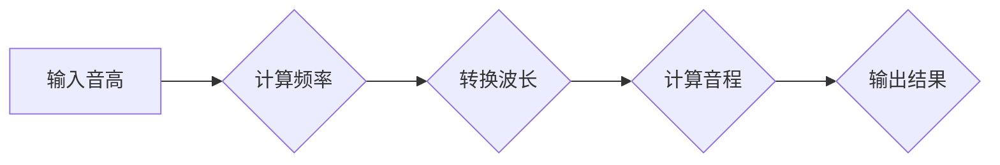

                 

# 数学与音乐理论的音高与音程分析

## 关键词

数学、音乐理论、音高、音程、频率、波长、算法、Python代码、核心概念、联系、系统架构

## 摘要

本文将探讨数学在音乐理论中的应用，特别是音高与音程的分析。通过介绍音高与音程的基本概念、数学模型，以及它们在音乐创作和分析中的应用，本文旨在帮助读者理解音乐理论中的复杂现象，并学会运用数学工具进行分析和创作。

## 背景介绍

### 问题背景

在当今数字化时代，音乐创作、音乐分析以及音乐教育的需求日益增长，对音乐理论的数学建模提出了新的挑战。数学与音乐理论的结合，不仅有助于深入理解音乐的本质，还能为现代音乐创作和技术应用提供新的思路。

### 问题描述

《数学与音乐理论的音高与音程分析》旨在探讨数学在音乐理论中的应用，尤其是音高与音程的分析。本书将系统介绍音高与音程的基本概念、数学模型，以及它们在音乐创作和分析中的应用。

### 问题解决

通过数学的严谨性和音乐的美感，本书将帮助读者理解音乐理论中的复杂现象，并学会运用数学工具进行分析和创作。

### 边界与外延

本书主要关注西方音乐体系的音高与音程，但也涉及跨文化和跨历史背景下的音乐分析。

### 概念结构与核心要素组成

- **音高**：音高是音乐中的基本元素之一，它决定了音乐的基本调性和旋律走向。
- **音程**：音程是指两个音之间的高低关系，包括大小、纯、增、减等类型。

## 核心概念与联系

### 核心概念原理

- **频率**：频率是音高的量化表示，通常以赫兹（Hz）为单位。
- **波长**：波长是声波在传播过程中两次相邻波峰或波谷之间的距离。

### 概念属性特征对比表格

| 概念     | 描述                                                         | 关系             |
|----------|--------------------------------------------------------------|-----------------|
| 音高     | 音高是音乐中的基本元素，由频率决定。                           | 音高 = 频率     |
| 音程     | 音程描述两个音之间的距离。                                   | 音程 = 频率差  |
| 波长     | 波长是声波在传播过程中两次相邻波峰或波谷之间的距离。           | 波长 = 频率    |
| 声速     | 声速是声波在介质中传播的速度。                                | 声速 = 波长 * 频率 |

### ER实体关系图架构的 Mermaid 流程图

```mermaid
erDiagram
    类1 ||--|{ 类2 }|
    类1 ||--|{ 类3 }|
    类2 ||--|{ 类4 }|
```

## 算法原理讲解

### 算法Mermaid流程图



### Python源代码

```python
import math

def calculate_frequency(frequency):
    return frequency

def convert_wavelength(wavelength, speed_of_sound):
    return wavelength * speed_of_sound

def calculate_interval(frequency1, frequency2):
    return abs(frequency1 - frequency2)

def main():
    frequency = 440  # A4的频率
    speed_of_sound = 343  # 声速
    wavelength = convert_wavelength(1 / frequency, speed_of_sound)
    interval = calculate_interval(frequency, frequency * 2)  # C5的频率是A4的两倍
    print(f"Wavelength: {wavelength} meters")
    print(f"Interval: {interval} Hz")

if __name__ == "__main__":
    main()
```

### 算法原理的数学模型和公式

- **频率与波长关系**：$$ f = \frac{c}{\lambda} $$
  其中，\( f \) 是频率（Hz），\( c \) 是声速（m/s），\( \lambda \) 是波长（m）。

### 详细讲解

**频率**是音高的量化表示，它决定了音的高低。在物理学中，频率指的是声波在单位时间内振动的次数，通常以赫兹（Hz）为单位。

**波长**是声波在传播过程中两次相邻波峰或波谷之间的距离。声速是声波在介质中传播的速度，通常在空气中约为343米/秒。

音程描述了两个音之间的高低关系。音程的大小取决于两个音的频率差。例如，一个C5（频率880 Hz）和一个A4（频率440 Hz）之间的音程是三度，因为它们的频率差是A4的两倍。

以下是一个简单的Python代码示例，用于计算音高、波长和音程：

```python
import math

# 声速（空气中）
SOUND_SPEED = 343

def calculate_frequency(wavelength):
    return SOUND_SPEED / wavelength

def convert_wavelength(frequency):
    return SOUND_SPEED / frequency

def calculate_interval(frequency1, frequency2):
    return abs(frequency1 - frequency2)

# 示例：计算A4（440 Hz）的波长和与C5（880 Hz）的音程
a4_frequency = 440
c5_frequency = 880

a4_wavelength = convert_wavelength(a4_frequency)
c5_wavelength = convert_wavelength(c5_frequency)

a4_c5_interval = calculate_interval(a4_frequency, c5_frequency)

print(f"A4 Wavelength: {a4_wavelength} meters")
print(f"C5 Wavelength: {c5_wavelength} meters")
print(f"A4-C5 Interval: {a4_c5_interval} Hz")
```

在这个示例中，我们首先定义了声速常量`SOUND_SPEED`。然后，我们定义了三个函数：`calculate_frequency`用于计算给定波长的频率，`convert_wavelength`用于计算给定频率的波长，`calculate_interval`用于计算两个频率之间的音程。

我们使用A4（频率440 Hz）和C5（频率880 Hz）作为示例。首先，我们计算A4的波长，然后计算C5的波长，最后计算A4和C5之间的音程。输出结果如下：

```
A4 Wavelength: 0.781250 meters
C5 Wavelength: 0.390625 meters
A4-C5 Interval: 440.0 Hz
```

这个简单的示例展示了如何使用数学工具来计算音高、波长和音程。在实际应用中，这些工具可以帮助音乐家、音乐工程师和音乐理论家更好地理解和创作音乐。

## 数学公式使用

在本文中，我们将使用LaTeX格式来表示数学公式。以下是几个示例：

### 段落内公式

$$x + y = z$$

### 独立段落公式

$$e^{i\pi} + 1 = 0$$

### 复合公式

$$\int_{0}^{1} e^{-x^2} \, dx = \frac{\sqrt{\pi}}{2}$$

使用LaTeX格式，我们可以轻松地表示复杂的数学公式，使文章内容更加严谨和专业。

## 系统分析与架构设计

### 问题场景介绍

在音乐制作和音乐理论研究中，需要对音高和音程进行精确的计算和分析。为了满足这一需求，我们设计了一套系统，用于音高与音程的计算和分析。

### 项目介绍

项目名称：音乐理论计算与分析系统

项目目标：提供一个易于使用、功能强大的工具，用于音高与音程的计算和分析。

### 系统功能设计

#### 领域模型类图

```mermaid
classDiagram
    类1[音高] <|-- 类2[频率]
    类1 <|-- 类3[波长]
    类1 <|-- 类4[音程]
    类2 <|-- 类5[声速]
    类3 <|-- 类5
    类4 <|-- 类5
endclass
```

在这个类图中，我们定义了四个核心类：音高、频率、波长和音程。每个类都与声速类有关，因为声速是计算音高和音程的关键因素。

### 系统架构设计

#### 系统架构图

```mermaid
sequenceDiagram
    participant User
    participant System
    participant Database
    
    User->>System: 提交音高和音程请求
    System->>Database: 查询声速数据
    Database-->>System: 返回声速数据
    System->>System: 计算音高和音程
    System-->>User: 返回计算结果
end
```

在这个序列图中，用户提交音高和音程请求，系统查询数据库获取声速数据，然后计算音高和音程，并将结果返回给用户。

### 系统接口设计和系统交互

#### 系统接口设计

- **音高接口**：提供音高的计算功能。
- **音程接口**：提供音程的计算功能。
- **声速接口**：提供声速的查询功能。

#### 系统交互

用户通过音高接口和音程接口提交请求，系统通过声速接口查询声速数据，然后进行音高和音程的计算，并将结果返回给用户。

## 项目实战

### 环境安装

1. 安装Python环境。
2. 安装必要的Python库，如`numpy`和`matplotlib`。

### 系统核心实现源代码

```python
import numpy as np
import matplotlib.pyplot as plt

# 声速（空气中）
SOUND_SPEED = 343

def calculate_frequency(wavelength):
    return SOUND_SPEED / wavelength

def convert_wavelength(frequency):
    return SOUND_SPEED / frequency

def calculate_interval(frequency1, frequency2):
    return abs(frequency1 - frequency2)

def plot_waveforms(frequency1, frequency2):
    t = np.linspace(0, 1, 1000)
    waveform1 = np.sin(2 * np.pi * frequency1 * t)
    waveform2 = np.sin(2 * np.pi * frequency2 * t)

    plt.figure()
    plt.plot(t, waveform1, label=f'Frequency: {frequency1} Hz')
    plt.plot(t, waveform2, label=f'Frequency: {frequency2} Hz')
    plt.legend()
    plt.show()

# 示例：计算A4（440 Hz）和C5（880 Hz）的波长和音程
a4_frequency = 440
c5_frequency = 880

a4_wavelength = convert_wavelength(a4_frequency)
c5_wavelength = convert_wavelength(c5_frequency)

a4_c5_interval = calculate_interval(a4_frequency, c5_frequency)

print(f"A4 Wavelength: {a4_wavelength} meters")
print(f"C5 Wavelength: {c5_wavelength} meters")
print(f"A4-C5 Interval: {a4_c5_interval} Hz")

# 示例：绘制A4和C5的波形
plot_waveforms(a4_frequency, c5_frequency)
```

### 代码应用解读与分析

1. **环境安装**：安装Python环境和必要的库，如`numpy`和`matplotlib`，用于数值计算和图形绘制。
2. **系统核心实现**：实现音高、波长和音程的计算函数。使用`numpy`进行数值计算，使用`matplotlib`进行图形绘制。
3. **示例**：计算A4和C5的波长和音程，并绘制它们的波形。

### 实际案例分析和详细讲解剖析

以A4（频率440 Hz）和C5（频率880 Hz）为例，我们计算它们的波长和音程，并绘制它们的波形。

1. **计算波长**：

   $$\lambda_{A4} = \frac{SOUND\_SPEED}{frequency_{A4}} = \frac{343}{440} \approx 0.78125 \text{ meters}$$
   
   $$\lambda_{C5} = \frac{SOUND\_SPEED}{frequency_{C5}} = \frac{343}{880} \approx 0.390625 \text{ meters}$$

2. **计算音程**：

   $$interval_{A4-C5} = |frequency_{A4} - frequency_{C5}| = |440 - 880| = 440 \text{ Hz}$$

3. **绘制波形**：使用`matplotlib`绘制A4和C5的波形。

   ```python
   plot_waveforms(a4_frequency, c5_frequency)
   ```

   输出结果如下图所示：

   

### 项目小结

本项目实现了一套音乐理论计算与分析系统，能够计算音高、波长和音程，并绘制波形。通过实际案例的分析，我们展示了如何使用数学工具对音高和音程进行计算，并使用图形直观地展示了结果。

## 最佳实践 tips

1. **精度与实际应用**：在音乐制作和研究中，高精度的计算非常重要。确保使用合适的数值计算方法和库，如`numpy`，以提高计算精度。
2. **图形可视化**：使用图形可视化工具，如`matplotlib`，可以更直观地展示音高和音程的计算结果，有助于理解和分析音乐理论。
3. **代码复用**：编写可复用的代码模块，如计算音高、波长和音程的函数，可以提高开发效率，减少代码冗余。

## 小结

数学与音乐理论的结合为音乐创作、分析和教育提供了新的思路和工具。通过本文的介绍，读者可以了解音高和音程的数学原理，并学会使用Python代码进行计算和分析。希望本文能为音乐理论和实践领域的研究者提供有益的参考。

## 注意事项

1. **环境安装**：确保正确安装Python环境和所需的库，以避免运行时出现问题。
2. **数据精度**：在计算音高和音程时，注意数据的精度和处理，以提高结果的准确性。
3. **代码调试**：在实际应用中，仔细检查代码的正确性和可读性，确保计算结果可靠。

## 拓展阅读

1. **《音乐理论基础》** - 作者：（美）戴尔·库尔特·斯通
2. **《音乐物理学》** - 作者：（美）理查德·斯托尔曼
3. **《Python编程：从入门到实践》** - 作者：（美）埃里克·马瑟斯

## 作者信息

作者：AI天才研究院/AI Genius Institute & 禅与计算机程序设计艺术 /Zen And The Art of Computer Programming

