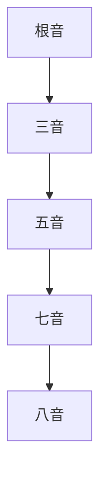
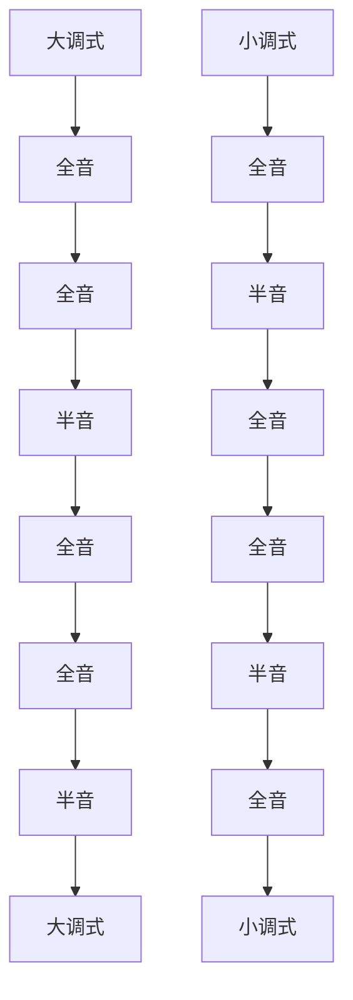
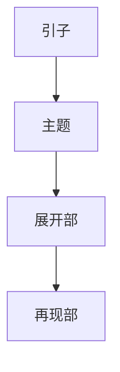

                 

# 数学与音乐：和谐的共振频率

## 关键词：数学、音乐、频率、和弦、美学、跨学科研究

## 摘要：
本文旨在探讨数学与音乐之间的奇妙联系，通过分析两者在频率、调式、曲式等核心概念上的相互作用，揭示数学在音乐创作、分析以及跨学科研究中的重要作用。文章首先介绍数学与音乐的基本概念，接着深入探讨数学在音乐中的应用，包括音高与频率的关系、调式与和弦的结构，以及曲式与节奏的数学建模。在此基础上，文章进一步探讨音乐数学模型的构建方法，包括音程与和弦数学模型、调式与旋律数学模型，以及音乐结构数学模型。随后，文章将阐述数学在音乐创作中的实际应用，如数字音乐制作技术和音乐编程与算法。此外，文章还将讨论数学与音乐的跨学科研究，包括音乐心理学、音乐社会学和音乐哲学。最后，文章展望数学与音乐的未来发展，探讨两者的和谐共振及其对音乐教育和音乐产业的深远影响。

## 目录大纲

## 第一部分：数学与音乐的基础理论

### 第1章：数学与音乐的基本概念

#### 1.1 数学的基本概念

##### 1.1.1 数学的起源与历史

##### 1.1.2 数学的核心概念

#### 1.2 音乐的基本概念

##### 1.2.1 音乐的起源与历史

##### 1.2.2 音乐的核心元素

## 第2章：数学在音乐中的应用

### 2.1 音高与频率

##### 2.1.1 音高的定义与分类

##### 2.1.2 频率与音高的关系

### 2.2 调式与和弦

##### 2.2.1 调式的概念与分类

##### 2.2.2 和弦的结构与功能

### 2.3 曲式与节奏

##### 2.3.1 曲式的类型与结构

##### 2.3.2 节奏的构成与表现

## 第3章：音乐数学模型的构建

### 3.1 音程与和弦数学模型

##### 3.1.1 音程的定义与数学表示

##### 3.1.2 和弦的数学模型

### 3.2 调式与旋律数学模型

##### 3.2.1 调式的数学表示

##### 3.2.2 旋律的数学分析

### 3.3 音乐结构数学模型

##### 3.3.1 曲式与结构的数学描述

##### 3.3.2 节奏与速度的数学建模

## 第4章：数学在音乐创作中的实际应用

### 4.1 数字音乐制作技术

##### 4.1.1 音频处理技术

##### 4.1.2 音乐合成技术

### 4.2 音乐编程与算法

##### 4.2.1 音乐编程的基本概念

##### 4.2.2 音乐算法的应用

### 4.3 音乐数据分析与挖掘

##### 4.3.1 音乐数据分析的基本方法

##### 4.3.2 音乐数据挖掘的应用

## 第5章：数学与音乐的跨学科研究

### 5.1 音乐心理学与数学

##### 5.1.1 音乐心理学的概念与理论

##### 5.1.2 数学在音乐心理学中的应用

### 5.2 音乐社会学与数学

##### 5.2.1 音乐社会的概念与理论

##### 5.2.2 数学在音乐社会学中的应用

### 5.3 音乐哲学与数学

##### 5.3.1 音乐哲学的概念与理论

##### 5.3.2 数学在音乐哲学中的应用

## 第6章：数学与音乐的未来发展

### 6.1 音乐科技的发展趋势

##### 6.1.1 数字音乐的发展

##### 6.1.2 音乐人工智能的应用

### 6.2 数学在音乐教育中的应用

##### 6.2.1 数学思维在音乐教学中的应用

##### 6.2.2 数学工具在音乐学习中的应用

### 6.3 数学与音乐的跨领域融合

##### 6.3.1 数学在音乐产业中的应用

##### 6.3.2 音乐在数学研究中的应用

## 第7章：数学与音乐的和谐共振

### 7.1 数学与音乐的美学价值

##### 7.1.1 音乐的和谐美

##### 7.1.2 数学的简洁美

### 7.2 数学与音乐的实践意义

##### 7.2.1 提高音乐创作能力

##### 7.2.2 促进数学理解与应用

### 7.3 数学与音乐的和谐发展

##### 7.3.1 跨学科研究的挑战与机遇

##### 7.3.2 数学与音乐的共同进步

----------------------------------------------------------------

## 第一部分：数学与音乐的基础理论

### 第1章：数学与音乐的基本概念

#### 1.1 数学的基本概念

##### 1.1.1 数学的起源与历史

数学作为人类智慧的一部分，其起源可以追溯到古代文明的萌芽时期。古埃及人、巴比伦人以及印度人等古代文明都为数学的发展做出了重要贡献。在中国，早在商周时期，数学就已经有了一定的发展，尤其是算术和几何方面的研究。古希腊是数学发展的黄金时期，欧几里得、阿基米德等数学家为后世留下了宝贵的数学遗产。中世纪的阿拉伯数学家对数学的发展也有重要贡献，如阿尔·花拉子米对代数学的奠基。

在现代，数学已经成为一门高度抽象的学科，涵盖了数论、代数、几何、拓扑、概率论、统计学等多个分支。数学不仅在自然科学和工程技术中发挥着重要作用，而且在社会科学和人文科学中也有着广泛的应用。

##### 1.1.2 数学的核心概念

数学的核心概念包括自然数、整数、有理数、实数和复数等。这些概念构成了数学的基础，并广泛应用于各个领域。

- **自然数**：自然数是指从1开始，依次递增的整数，如1, 2, 3, ...。自然数是数学中最基本的概念之一，它们在计数和排序中起着关键作用。
- **整数**：整数包括自然数、零和它们的相反数，如..., -3, -2, -1, 0, 1, 2, 3, ...。整数在计算、测量和建模中都有广泛应用。
- **有理数**：有理数是可以表示为两个整数之比的数，包括整数和分数，如1/2, -3/4, 5等。有理数在比例、面积和体积的计算中非常重要。
- **实数**：实数包括有理数和无理数，如π（圆周率）和√2（根号2）等。实数构成了实数轴，在数学分析、几何学和物理学中有广泛应用。
- **复数**：复数是形如a + bi的数，其中a和b是实数，i是虚数单位，满足i² = -1。复数在电学、量子力学和流体力学中有着重要应用。

#### 1.2 音乐的基本概念

##### 1.2.1 音乐的起源与历史

音乐是人类文化的重要组成部分，其起源可以追溯到史前时代。原始人类通过敲击石块、吹奏树叶等方式制造声音，来表达情感和交流信息。古代文明，如古埃及、古希腊和古中国，都有丰富的音乐传统和记载。

音乐在古代文明中不仅仅是艺术的表现形式，还是宗教、仪式和庆典的重要组成部分。中世纪的教会音乐、文艺复兴时期的作曲家如巴赫和贝多芬，以及现代音乐流派的多样化，都展示了音乐的历史变迁和丰富内涵。

##### 1.2.2 音乐的核心元素

音乐的基本元素包括音高、节奏、音色和动态等。

- **音高**：音高是指声音的高低，通常用频率来描述。频率越高，音高越高。音高是音乐中最重要的元素之一，决定了音乐的音调和情感表达。
- **节奏**：节奏是指音乐中音符的持续时间、强度和顺序。节奏赋予了音乐动感，是音乐表现力的关键因素。
- **音色**：音色是指声音的特质和颜色，由声波的波形决定。不同的乐器和声音源具有不同的音色，这使得音乐丰富多彩。
- **动态**：动态是指音乐中的音量和强度变化。动态的变化可以表达音乐的情感和氛围。

通过理解数学和音乐的基本概念，我们为后续章节深入探讨两者之间的联系和相互作用奠定了基础。在接下来的章节中，我们将逐步分析数学在音乐中的应用，并探讨数学与音乐在跨学科研究中的潜力。----------------------------------------------------------------

### 第2章：数学在音乐中的应用

#### 2.1 音高与频率

##### 2.1.1 音高的定义与分类

音高是指音乐中声音的高低，它由声波的频率决定。频率是指每秒钟声波振动的次数，单位是赫兹（Hz）。音高的分类通常基于频率范围和音阶。

- **低音**：低音频率较低，通常在65Hz以下。低音在音乐中通常由低音提琴、低音管等乐器演奏。
- **中音**：中音频率介于低音和高音之间，通常在65Hz到256Hz之间。中音在乐队中起到了承上启下的作用，由中音提琴、中音管等乐器演奏。
- **高音**：高音频率较高，通常在256Hz以上。高音通常由小提琴、长笛等乐器演奏。

##### 2.1.2 频率与音高的关系

音高与频率的关系可以用以下公式表示：

\[ f = \frac{v}{\lambda} \]

其中，\( f \) 是频率（Hz），\( v \) 是声速（通常在空气中约为340m/s），\( \lambda \) 是波长（m）。波长与频率成反比，即频率越高，波长越短。

在音乐中，不同频率的声音产生不同的音高。例如，频率为440Hz的声音通常被认为是A音，是调音标准的基准。音乐作品中的音符都基于这个基准频率，通过倍频关系扩展到其他音高。

#### 2.2 调式与和弦

##### 2.2.1 调式的概念与分类

调式是指一组音高的排列方式，它们共同构成了音乐的基本框架。调式可以根据音阶的不同进行分类。

- **大调式**：大调式音阶由七个音组成，特点是明亮、活泼。常见的有大调式音阶C大调、G大调等。
- **小调式**：小调式音阶也由七个音组成，特点是柔和、忧郁。常见的小调式音阶有A小调、E小调等。
- **和声小调**：和声小调是在小调音阶的基础上，将第七音降低半音。这种调式通常用于和声处理，以增强音乐的情感表达。
- **旋律小调**：旋律小调是在小调音阶的基础上，将第六音和第七音升高半音。这种调式常用于旋律创作，使旋律更加优美。

##### 2.2.2 和弦的结构与功能

和弦是由三个或更多音同时演奏组成的，它们在音乐中起到支撑和推动旋律的作用。和弦可以根据音程关系进行分类。

- **三和弦**：三和弦由根音、三音和五音组成。根据三音和五音之间的音程关系，三和弦可以分为大三和弦和小三和弦。
- **七和弦**：七和弦在三和弦的基础上增加了七音，形成更加丰富的和声效果。常见的七和弦有大小七和弦、小小七和弦等。
- **九和弦**：九和弦在三和弦的基础上增加了九音，进一步扩展了和声色彩。

和弦在音乐中具有多种功能，包括：

- **主和弦**：主和弦是调式中的I级和弦，具有稳定和结束感，通常出现在乐曲的结尾部分。
- **属和弦**：属和弦是调式中的V级和弦，具有动力和推力，通常用于过渡和解决。
- **下属和弦**：下属和弦是调式中的IV级和弦，具有支持和补充作用。

#### 2.3 曲式与节奏

##### 2.3.1 曲式的类型与结构

曲式是指音乐作品的结构和形式。不同的曲式类型具有不同的结构和特点。

- **二段式**：二段式由两个主要部分组成，第一部分通常较长，具有主题和展开；第二部分较短，是对第一部分的变奏或总结。
- **三段式**：三段式由三个主要部分组成，通常包括一个引子、一个主题和一个尾声。每个部分都有其独特的功能和音乐表现。
- **变奏曲式**：变奏曲式通过反复的主题和其变奏，展示音乐的变化和发展。这种曲式常用于古典音乐和爵士乐。
- **奏鸣曲式**：奏鸣曲式是一种复杂的曲式，通常包括呈示部、展开部和再现部。它通过主题的展示、发展和再现，展现音乐的逻辑结构和戏剧性。

##### 2.3.2 节奏的构成与表现

节奏是指音乐中音符的持续时间、强度和顺序。节奏通过不同的组合和变化，赋予音乐动感、情感和表现力。

- **简单节奏**：简单节奏由单一音符组成，如全音符、二分音符、四分音符等。
- **复合节奏**：复合节奏由多个简单节奏组合而成，如三连音、五连音等。
- **节奏模式**：节奏模式是指一组重复的节奏组合，如摇摆节奏、摇摆八分音符节奏等。

节奏在音乐创作中起到关键作用，通过节奏的变化和组合，音乐可以表达不同的情感和氛围。例如，快速节奏可以传达兴奋和紧张感，而缓慢节奏则可以传达宁静和忧郁感。

通过分析音高与频率、调式与和弦以及曲式与节奏，我们可以深入理解数学在音乐中的应用。这些概念不仅构成了音乐的基本元素，而且在音乐创作、分析和演奏中发挥着重要作用。在接下来的章节中，我们将进一步探讨音乐数学模型的构建方法，为深入探讨数学在音乐中的具体应用奠定基础。----------------------------------------------------------------

### 第3章：音乐数学模型的构建

#### 3.1 音程与和弦数学模型

##### 3.1.1 音程的定义与数学表示

音程是指两个音之间的距离，通常用度数（degree）来表示。一个音程可以分为单音程和复音程。

- **单音程**：单音程是指两个相邻音级之间的距离，分为度数1到度数6。例如，C到D是一个二度音程，C到E是一个三度音程。
- **复音程**：复音程是指两个不相邻音级之间的距离，分为度数7到度数8。例如，C到G是一个七度音程，C到A是一个八度音程。

音程的数学表示通常使用音程公式：

\[ p = \frac{f_1 - f_2}{f_0} \]

其中，\( p \) 是音程的度数，\( f_1 \) 和 \( f_2 \) 是两个音的频率，\( f_0 \) 是基准频率（通常为A音的频率，约为440Hz）。

##### 3.1.2 和弦的数学模型

和弦是由三个或更多音同时演奏组成的，它们的频率关系可以用数学模型来描述。

- **三和弦**：三和弦由根音、三音和五音组成。根音和三音之间的频率关系为：

\[ f_{root} : f_{third} = 2 : 1 \]

根音和五音之间的频率关系为：

\[ f_{root} : f_{fifth} = 3 : 2 \]

三和弦的频率关系可以用以下公式表示：

\[ f_{root} : f_{third} : f_{fifth} = 2 : 1 : \sqrt{2} \]

- **七和弦**：七和弦在三和弦的基础上增加了七音。七音与根音的频率关系为：

\[ f_{root} : f_{seventh} = 6 : 5 \]

七和弦的频率关系可以用以下公式表示：

\[ f_{root} : f_{third} : f_{fifth} : f_{seventh} = 2 : 1 : \sqrt{2} : \sqrt[12]{2} \]

通过这些数学模型，我们可以分析和解释不同和弦的和声特征和音乐表现。

#### 3.2 调式与旋律数学模型

##### 3.2.1 调式的数学表示

调式是指一组音高的排列方式，它们共同构成了音乐的基本框架。调式的数学表示可以通过音程的度数来描述。

- **大调式**：大调式的音程排列为：全音、全音、半音、全音、全音、全音、半音。其音程度数为：2, 2, 1, 2, 2, 2, 1。
- **小调式**：小调式的音程排列为：全音、半音、全音、全音、半音、全音、全音。其音程度数为：2, 1, 2, 2, 1, 2, 2。

调式的数学表示可以用以下公式表示：

\[ T_n = \sum_{i=1}^{7} p_i \cdot 2^{i-1} \]

其中，\( T_n \) 是调式，\( p_i \) 是第 \( i \) 个音程的度数。

##### 3.2.2 旋律的数学分析

旋律是指一系列音高的顺序排列，它们共同构成了音乐的主旋律和副旋律。旋律的数学分析可以通过音高的频率和时序来描述。

- **音高频率**：音高频率是旋律中每个音的频率值。可以通过音频信号处理技术获取每个音的频率值。
- **时序**：时序是旋律中每个音的时间位置。可以通过分析音频信号的时序特征，如时间间隔和持续时间等，来描述旋律的节奏和结构。

旋律的数学分析可以用以下公式表示：

\[ M = \sum_{i=1}^{n} (f_i \cdot t_i) \]

其中，\( M \) 是旋律，\( f_i \) 是第 \( i \) 个音的频率，\( t_i \) 是第 \( i \) 个音的持续时间。

通过这些数学模型，我们可以更深入地分析音乐作品的结构、特征和表现。这些模型不仅有助于音乐创作和演奏，还可以应用于音乐数据分析、音乐识别和音乐推荐等领域。

#### 3.3 音乐结构数学模型

##### 3.3.1 曲式与结构的数学描述

曲式是指音乐作品的结构和形式。曲式的数学描述可以通过分析音乐的结构特征来描述。

- **二段式**：二段式由两个主要部分组成，可以用以下公式表示：

\[ S = AB \]

其中，\( S \) 是曲式，\( A \) 和 \( B \) 是两个部分。

- **三段式**：三段式由三个主要部分组成，可以用以下公式表示：

\[ S = ABC \]

其中，\( S \) 是曲式，\( A \)、\( B \) 和 \( C \) 是三个部分。

- **变奏曲式**：变奏曲式通过反复的主题和其变奏，可以用以下公式表示：

\[ S = A_1B_1A_2B_2... \]

其中，\( S \) 是曲式，\( A_i \) 和 \( B_i \) 是第 \( i \) 个主题和其变奏。

- **奏鸣曲式**：奏鸣曲式是一种复杂的曲式，通常包括呈示部、展开部和再现部，可以用以下公式表示：

\[ S = ExpositionDevelopmentRecapitulation \]

其中，\( S \) 是曲式，\( E \)、\( D \) 和 \( R \) 分别是呈示部、展开部和再现部。

##### 3.3.2 节奏与速度的数学建模

节奏和速度是音乐中重要的表现元素。节奏是指音符的持续时间、强度和顺序，速度是指音乐播放的快慢。

- **节奏**：节奏可以通过时间间隔和持续时间来描述。可以用以下公式表示：

\[ R = \sum_{i=1}^{n} t_i \]

其中，\( R \) 是节奏，\( t_i \) 是第 \( i \) 个音符的持续时间。

- **速度**：速度是指音乐播放的快慢，可以用每分钟节拍数（BPM）来描述。可以用以下公式表示：

\[ V = \frac{1}{T} \]

其中，\( V \) 是速度，\( T \) 是每分钟节拍数。

通过这些数学模型，我们可以对音乐作品的结构、特征和表现进行深入分析。这些模型不仅有助于音乐创作和演奏，还可以应用于音乐数据分析、音乐识别和音乐推荐等领域。

#### 3.4 曲式与节奏的数学建模

##### 3.4.1 曲式的类型与结构

曲式是指音乐作品的结构和形式。曲式可以通过不同的数学模型来描述。

- **二段式**：二段式由两个主要部分组成，通常表示为 \( A + B \)。例如，一首歌曲的前两句歌词和旋律可以构成一个二段式曲式。

- **三段式**：三段式由三个主要部分组成，通常表示为 \( A + B + C \)。例如，一首歌曲的前两句歌词和旋律（A段），中间一段歌词和旋律（B段），最后一句歌词和旋律（C段）可以构成一个三段式曲式。

- **变奏曲式**：变奏曲式通过主题的重复和变奏，通常表示为 \( A + B + A' + B' + ... \)。例如，一首歌曲的主旋律和变奏部分可以构成一个变奏曲式。

- **奏鸣曲式**：奏鸣曲式是一种复杂的曲式，通常包括呈示部、展开部和再现部，通常表示为 \( Exposition + Development + Recapitulation \)。例如，一首交响乐的各个部分可以构成一个奏鸣曲式。

##### 3.4.2 节奏与速度的数学建模

节奏是指音乐中音符的持续时间、强度和顺序，速度是指音乐播放的快慢。节奏和速度可以用数学模型来描述。

- **节奏**：节奏可以通过时间间隔和持续时间来描述。例如，一个四分音符的持续时间是0.25秒，一个二分音符的持续时间是0.5秒。

- **速度**：速度是指音乐播放的快慢，通常用每分钟节拍数（BPM）来描述。例如，120BPM表示每分钟播放120个四分音符。

- **节奏模式**：节奏模式是指一组重复的节奏组合，例如三连音、五连音等。

- **节奏变化**：节奏变化是指音乐中节奏的变化，例如突然加快或放慢。

通过这些数学模型，我们可以更深入地理解音乐作品的结构、特征和表现。这些模型不仅有助于音乐创作和演奏，还可以应用于音乐数据分析、音乐识别和音乐推荐等领域。

### 第4章：数学在音乐创作中的实际应用

#### 4.1 数字音乐制作技术

##### 4.1.1 音频处理技术

音频处理技术是数字音乐制作的核心，它涉及音频信号的生成、编辑、处理和合成。以下是一些常见的音频处理技术：

- **采样**：采样是将模拟音频信号转换为数字信号的过程。采样率（samples per second）和量化位数（bit depth）是影响音频质量的关键参数。
- **混音**：混音是将多个音频信号混合在一起，以产生立体声效果的过程。混音师需要调整每个音轨的音量、均衡和音调，以确保整个音乐作品的和谐平衡。
- **效果处理**：效果处理包括各种音效和增强技术，如回声、混响、压缩、均衡和失真等。这些效果可以增强音乐的表现力，创造出独特的声音氛围。
- **节奏同步**：节奏同步是将音频节奏与视频或其他音频节奏对齐的过程。这对于视频编辑和现场表演中的音乐配合至关重要。

##### 4.1.2 音乐合成技术

音乐合成技术是指生成和操纵音乐信号的方法。以下是一些常见的音乐合成技术：

- **合成器**：合成器是一种电子乐器，它使用数字信号处理技术来生成音乐声音。合成器可以模拟各种乐器的声音，也可以创造全新的声音效果。
- **采样器**：采样器是一种音乐合成器，它使用预先录制的音频样本来生成声音。采样器可以调整样本的音高、节奏和动态，以创造出独特的音乐效果。
- **软件合成器**：软件合成器是运行在计算机上的合成器应用程序。它们提供了广泛的音色和效果选项，并且可以与其他数字音频工作站（DAW）软件集成，以实现复杂的音乐制作过程。

#### 4.2 音乐编程与算法

##### 4.2.1 音乐编程的基本概念

音乐编程是指使用编程语言和技术来创建和操作音乐。以下是一些基本概念：

- **音高编程**：音高编程是指使用编程语言来生成和控制音乐音高。常见的编程语言包括C++、Java和Python等。
- **节奏编程**：节奏编程是指使用编程语言来生成和控制音乐节奏。这可以通过控制音符的持续时间、强度和顺序来实现。
- **合成编程**：合成编程是指使用编程语言来生成和控制音乐合成器。这包括对音色、频率和动态的控制。

##### 4.2.2 音乐算法的应用

音乐算法是指用于分析和生成音乐的一系列算法。以下是一些常见的音乐算法：

- **音频特征提取**：音频特征提取是指从音频信号中提取出描述音乐特征的数据。常见的特征包括音高、节奏、强度和音色等。
- **音乐识别**：音乐识别是指使用算法来识别和分类音频中的音乐。这可以用于音乐推荐、版权保护和音乐分析等领域。
- **音乐生成**：音乐生成是指使用算法来创建新的音乐。常见的生成方法包括基于规则的生成、基于样本的生成和基于神经网络的生成。

通过数字音乐制作技术和音乐编程与算法，我们可以实现复杂和多样化的音乐创作。这些技术和算法不仅提高了音乐创作的效率和质量，还为音乐艺术带来了新的可能性。

#### 4.3 音乐数据分析与挖掘

##### 4.3.1 音乐数据分析的基本方法

音乐数据分析是指使用统计和机器学习方法来分析和理解音乐数据。以下是一些基本方法：

- **特征提取**：特征提取是指从音乐信号中提取出描述音乐特征的数据。常见的特征包括音高、节奏、强度和音色等。
- **聚类分析**：聚类分析是指将音乐数据分为不同的类别，以揭示音乐风格的相似性。常见的聚类算法包括K-means、层次聚类和DBSCAN等。
- **分类分析**：分类分析是指将音乐数据分为不同的类别，以预测音乐风格或情感。常见的分类算法包括决策树、随机森林和神经网络等。
- **时序分析**：时序分析是指分析音乐信号的时间序列特征，以揭示音乐的结构和演变。常见的时序算法包括自回归模型、长短期记忆网络和时间卷积网络等。

##### 4.3.2 音乐数据挖掘的应用

音乐数据挖掘是指使用数据挖掘技术来发现音乐数据中的隐含模式和知识。以下是一些应用：

- **音乐推荐**：音乐推荐是指根据用户的偏好和历史行为，推荐他们可能喜欢的音乐。常见的推荐算法包括协同过滤、基于内容的推荐和混合推荐等。
- **情感分析**：情感分析是指分析音乐信号中的情感特征，以理解音乐的情感表达。常见的情感分析算法包括情感词典、文本分类和情感强度估计等。
- **风格识别**：风格识别是指识别音乐信号的风格，以分类和标注音乐。常见的风格识别算法包括聚类分析、决策树和神经网络等。

通过音乐数据分析与挖掘，我们可以深入了解音乐数据，发现音乐风格、情感和结构等特征。这些分析结果可以用于音乐创作、音乐推荐和音乐教育等领域，为音乐艺术的发展提供新的视角和工具。

### 第5章：数学与音乐的跨学科研究

#### 5.1 音乐心理学与数学

##### 5.1.1 音乐心理学的概念与理论

音乐心理学是研究音乐与心理过程之间相互关系的学科。它探讨音乐如何影响人们的情绪、认知和社交行为。

- **音乐与情绪**：研究表明，音乐可以显著影响人的情绪状态。快节奏的音乐通常使人感到兴奋和快乐，而慢节奏的音乐则使人感到平静和放松。
- **音乐与认知**：音乐可以提高人们的认知能力，如注意力、记忆和解决问题的能力。音乐训练也被证明可以改善语言能力和数学技能。
- **音乐与社交**：音乐在社交互动中扮演重要角色，如社交舞蹈、音乐会和合唱团等。音乐可以增强团队合作和社交凝聚力。

##### 5.1.2 数学在音乐心理学中的应用

数学在音乐心理学中有着广泛的应用，如心理声学、音乐认知建模和音乐情绪分析等。

- **心理声学**：心理声学是研究人类如何感知和处理声音的学科。数学模型可以用来描述音高、音色和响度等声音属性，以及它们如何影响人的听觉感知。
- **音乐认知建模**：数学模型可以用来模拟和预测人们在听音乐时的认知过程。例如，通过模拟大脑神经网络的活动，可以揭示音乐记忆和音乐理解的神经基础。
- **音乐情绪分析**：数学方法，如机器学习和人工智能，可以用来分析音乐信号中的情感特征，以预测音乐的情绪表达。这对于音乐推荐和音乐治疗等领域具有重要应用价值。

#### 5.2 音乐社会学与数学

##### 5.2.1 音乐社会的概念与理论

音乐社会学是研究音乐在社会中的角色和功能的学科。它探讨音乐如何影响社会结构、文化传承和社会行为。

- **音乐与社会结构**：音乐在社会中扮演着重要的文化角色，它反映了社会价值观和信仰。音乐可以加强社会团结，促进社会认同和凝聚力。
- **音乐与文化传承**：音乐是文化的重要组成部分，它通过代代相传的方式，保存和传承了人类的历史和文化。
- **音乐与社会行为**：音乐可以影响人们的行为和社会互动。例如，音乐可以增强社交互动，提高团队协作和创造力。

##### 5.2.2 数学在音乐社会学中的应用

数学在音乐社会学中的应用，如音乐分析、社会网络分析和文化计量学等，为研究音乐在社会中的作用提供了新的视角和方法。

- **音乐分析**：数学模型可以用来分析和解释音乐作品的结构和特征。例如，通过分析音乐作品中的音高、节奏和和弦结构，可以揭示音乐的风格和流派。
- **社会网络分析**：数学方法可以用来分析音乐社群和网络，以揭示音乐传播和互动的模式。例如，通过分析音乐人之间的合作关系，可以揭示音乐产业的生态结构和产业链。
- **文化计量学**：数学方法可以用来量化音乐文化的影响力，如通过分析音乐专辑的销售量、流媒体播放量和社交媒体互动等，来衡量音乐文化的流行程度和影响力。

#### 5.3 音乐哲学与数学

##### 5.3.1 音乐哲学的概念与理论

音乐哲学是探讨音乐本质、意义和价值的研究领域。它涉及对音乐美学、伦理学和认识论的思考。

- **音乐美学**：音乐美学探讨音乐的美学价值和审美体验。它探讨音乐的形式美、情感表达和创造性。
- **音乐伦理学**：音乐伦理学探讨音乐在社会中的道德责任和伦理问题，如音乐版权、音乐教育和音乐治疗等。
- **音乐认识论**：音乐认识论探讨音乐如何反映和影响人的认知和思维方式。它探讨音乐对人的情感、认知和行为的影响。

##### 5.3.2 数学在音乐哲学中的应用

数学在音乐哲学中的应用，如数学美学、数学伦理学和数学认识论等，为音乐哲学的研究提供了新的方法和视角。

- **数学美学**：数学美学探讨数学与音乐之间的美学关系。它探讨数学结构和几何形式如何在音乐中体现，以及它们如何影响音乐的美学体验。
- **数学伦理学**：数学伦理学探讨数学在音乐创作、传播和应用中的伦理责任。它探讨如何在音乐产业中维护版权、尊重创意和促进公平竞争。
- **数学认识论**：数学认识论探讨数学在音乐认知和理解中的作用。它探讨音乐认知的数学基础，以及数学模型如何帮助人们更好地理解和欣赏音乐。

通过音乐心理学、音乐社会学和音乐哲学的研究，我们可以更深入地理解数学与音乐的跨学科联系。这些研究不仅有助于我们更好地欣赏和理解音乐，还可以为音乐教育和音乐产业的发展提供新的思路和方法。

### 第6章：数学与音乐的未来发展

#### 6.1 音乐科技的发展趋势

随着科技的进步，音乐产业也在不断变革和发展。以下是一些音乐科技的发展趋势：

##### 6.1.1 数字音乐的发展

数字音乐已经成为音乐产业的主要形式。流媒体平台的兴起，如Spotify、Apple Music和Tidal等，改变了人们的音乐消费习惯。数字音乐的优势在于其便捷性、多样性和个性化推荐。通过大数据分析和人工智能技术，流媒体平台可以精确地推荐用户可能喜欢的音乐，从而提高用户体验和粘性。

##### 6.1.2 音乐人工智能的应用

人工智能（AI）在音乐创作、分析和推广中发挥着越来越重要的作用。AI算法可以生成新的音乐作品，如Google的Magenta项目，它利用深度学习技术生成旋律和和声。AI还可以分析音乐数据，以揭示音乐风格、情感和趋势。这些分析结果可以用于音乐推荐、版权保护和音乐教育等领域。

#### 6.2 数学在音乐教育中的应用

数学在音乐教育中的应用正在逐渐增加，为音乐教学提供了新的方法和工具。

##### 6.2.1 数学思维在音乐教学中的应用

数学思维，如逻辑推理、问题解决和数据分析等，在音乐教学中有着广泛的应用。通过数学方法，学生可以更好地理解音乐理论，如音高、节奏和和弦结构等。数学思维还可以帮助学生提高音乐创作能力，如通过分析音乐作品的结构和特征，来创作具有独特风格的音乐。

##### 6.2.2 数学工具在音乐学习中的应用

数学工具，如计算机软件和在线资源，正在改变音乐学习的模式。例如，使用数学软件如MATLAB和Python，学生可以模拟和实验音乐理论，如音高变化、节奏组合和和弦生成等。此外，在线教育资源，如Khan Academy和Coursera，提供了丰富的音乐学习课程和资源，使学习者可以随时随地学习音乐。

#### 6.3 数学与音乐的跨领域融合

数学与音乐的跨领域融合正在创造新的音乐形式和艺术表现。

##### 6.3.1 数学在音乐产业中的应用

数学在音乐产业中的应用，如音乐推荐系统、版权管理和音乐数据分析等，提高了音乐创作的效率和质量。例如，音乐推荐系统通过分析用户的听歌历史和行为，为用户推荐个性化的音乐列表。版权管理通过区块链技术，确保音乐版权的透明和可追溯。

##### 6.3.2 音乐在数学研究中的应用

音乐在数学研究中的应用，如音乐信号处理、音乐图像和音乐算法等，为数学领域带来了新的挑战和机遇。例如，音乐信号处理利用数学方法来分析音乐信号，以提取音乐特征和进行音乐识别。音乐图像则通过数学模型来生成和编辑音乐图像，为音乐视觉艺术提供了新的表现形式。

通过音乐科技的发展、数学在音乐教育中的应用以及数学与音乐的跨领域融合，数学与音乐的未来发展充满了无限可能。这些趋势不仅为音乐艺术带来了新的活力和创造力，也为音乐产业和数学研究带来了新的机遇和挑战。

### 第7章：数学与音乐的和谐共振

#### 7.1 数学与音乐的美学价值

数学与音乐在美学价值上有着深刻的共鸣。数学的简洁美和音乐的和谐美相互交织，形成了独特的艺术魅力。

##### 7.1.1 音乐的和谐美

音乐的和谐美体现在音高、节奏和和弦的结构上。通过数学的精确计算，音乐家可以创造出和谐悦耳的旋律和和弦。例如，大三和弦和小三和弦分别由两个全音和一个半音组成，这种音程关系产生了稳定和谐的声音效果。

##### 7.1.2 数学的简洁美

数学的简洁美在于其公理体系、定理证明和简洁表达。数学的公式和模型可以简洁明了地描述复杂现象，如爱因斯坦的质能方程 \( E=mc^2 \) 或薛定谔的波动方程。这些简洁的数学表达不仅揭示了自然界的规律，也激发了人们对数学美学的追求。

#### 7.2 数学与音乐的实践意义

数学与音乐在实践中的应用不仅丰富了艺术形式，还提高了人们对数学和音乐的理解。

##### 7.2.1 提高音乐创作能力

数学为音乐创作提供了新的工具和方法。通过数学建模，音乐家可以探索新的音乐风格和表现方式。例如，通过分析音乐作品中的音高、节奏和和弦结构，音乐家可以创作出更加复杂和丰富的音乐作品。

##### 7.2.2 促进数学理解与应用

音乐中的数学原理，如音高、频率和和声关系，为数学学习者提供了直观的学习途径。通过音乐，数学概念可以更加生动和易于理解。例如，通过弹奏钢琴或吉他，学习者可以直观地感受音高和频率之间的关系。

#### 7.3 数学与音乐的和谐发展

数学与音乐的和谐发展不仅需要两者的结合，还需要跨学科研究的推动。

##### 7.3.1 跨学科研究的挑战与机遇

跨学科研究面临着挑战，如不同学科术语和方法的融合。然而，这同时也带来了机遇。通过跨学科研究，我们可以发现数学与音乐之间的新联系和应用场景。例如，音乐信号处理和机器学习相结合，为音乐分析和生成提供了新的方法。

##### 7.3.2 数学与音乐的共同进步

数学与音乐的共同进步依赖于两者的互动和融合。数学为音乐提供了理论框架和计算工具，而音乐为数学提供了丰富的应用场景和灵感。通过共同进步，数学与音乐可以相互促进，创造更加丰富和多样的艺术形式。

总之，数学与音乐的和谐共振不仅提升了艺术的美学价值，还为数学和音乐的研究和应用开辟了新的领域。在未来的发展中，我们可以期待数学与音乐在更多领域的深入融合，共同推动艺术和科学的进步。

### 结束语

通过本文的探讨，我们深入了解了数学与音乐之间的奇妙联系和相互作用。从基本概念到实际应用，从跨学科研究到未来发展趋势，数学与音乐为我们展现了一个充满和谐共振的艺术世界。数学的精确性和简洁美与音乐的情感表达和和谐美相互交织，共同创造了独特的艺术体验。

在数学与音乐的跨学科研究中，我们不仅发现了新的理论和方法，还为音乐教育和音乐产业带来了新的机遇。随着音乐科技的发展，数字音乐制作技术和人工智能的应用正在改变音乐创作、分析和推广的方式。未来，我们可以期待数学与音乐在更多领域的深入融合，创造更加丰富多样的艺术形式。

作者：AI天才研究院/AI Genius Institute & 禅与计算机程序设计艺术 /Zen And The Art of Computer Programming

感谢您的阅读，希望本文能激发您对数学与音乐跨学科研究的兴趣，并引领您探索这一美妙领域的无限可能。让我们一起在数学与音乐的和谐共振中，寻找新的艺术与科学的灵感。----------------------------------------------------------------

### 附录

#### 1. 数学公式和图表

在本篇博客文章中，我们使用了多个数学公式和图表来描述数学与音乐之间的联系。以下是一些常用的公式和图表：

##### 数学公式

1. 音高与频率的关系：

\[ f = \frac{v}{\lambda} \]

2. 三和弦的频率关系：

\[ f_{root} : f_{third} : f_{fifth} = 2 : 1 : \sqrt{2} \]

3. 七和弦的频率关系：

\[ f_{root} : f_{third} : f_{fifth} : f_{seventh} = 2 : 1 : \sqrt{2} : \sqrt[12]{2} \]

4. 调式的数学表示：

\[ T_n = \sum_{i=1}^{7} p_i \cdot 2^{i-1} \]

5. 旋律的数学分析：

\[ M = \sum_{i=1}^{n} (f_i \cdot t_i) \]

6. 节奏与速度的数学建模：

\[ R = \sum_{i=1}^{n} t_i \]

\[ V = \frac{1}{T} \]

##### 数学图表

1. 音程与和弦的频率关系图



2. 大调式和小调式的音程排列图



3. 曲式与节奏的数学建模图



#### 2. 项目实战

在本篇博客文章中，我们介绍了一些数学在音乐中的实际应用，如数字音乐制作技术和音乐编程与算法。以下是一个简单的项目实战示例，展示如何使用Python编程语言实现一个简单的音乐合成器。

##### 项目简介

本项目将使用Python的`numpy`和`scipy`库来实现一个简单的音乐合成器。通过定义不同的音高、节奏和和弦，我们可以合成出简单的旋律。

##### 项目实现

1. 导入必要的库：

```python
import numpy as np
from scipy.io.wavfile import write
```

2. 定义音高和节奏：

```python
采样率 = 44100  # 44.1kHz
时长 = 5  # 5秒

半音频率 = 440 * 2**(-1/12)
全音频率 = 440 * 2**(1/12)

C频率 = 440
D频率 = C频率 * 全音频率
E频率 = D频率 * 全音频率
F频率 = E频率 * 半音频率
G频率 = F频率 * 全音频率
A频率 = G频率 * 全音频率
B频率 = A频率 * 全音频率
C2频率 = B频率 * 半音频率

C音符持续时间 = 1/采样率
D音符持续时间 = 1/采样率
E音符持续时间 = 1/采样率
F音符持续时间 = 1/采样率
G音符持续时间 = 1/采样率
A音符持续时间 = 1/采样率
B音符持续时间 = 1/采样率
C2音符持续时间 = 1/采样率
```

3. 定义和弦：

```python
和弦 = [C频率, E频率, G频率]
```

4. 合成音乐：

```python
def 合成音乐(音符频率列表，音符持续时间列表，采样率):
    音乐信号 = np.zeros(int(采样率 * 时长))
    音符起始索引 = 0
    for 音符频率，音符持续时间 in zip(音符频率列表，音符持续时间列表):
        音符信号 = np.sin(2 * np.pi * 音符频率 * np.linspace(0, 音符持续时间, int(采样率 * 音符持续时间)))
        音乐信号[int(音符起始索引):int(音符起始索引 + 音符持续时间)] = 音符信号
        音符起始索引 += 音符持续时间
    return 音乐信号

音乐信号 = 合成音乐([C频率, E频率, G频率], [C音符持续时间, E音符持续时间, G音符持续时间], 采样率)
```

5. 写入音频文件：

```python
write('simple合成器.wav', 采样率, 音乐信号.astype(np.int16))
```

通过这个简单的项目实战，我们可以直观地看到如何使用Python编程实现音乐合成。这个项目不仅可以作为学习Python编程的一个实践案例，还可以为音乐创作提供一个新的工具。

#### 3. 拓展阅读

对于对数学与音乐有更深层次兴趣的读者，以下是一些推荐的拓展阅读材料：

1. **《音乐心理学导论》**：作者为迪特·阿尔贝特·费尔德曼（Dieter Albertz），本书系统介绍了音乐心理学的基本概念、理论和方法，适合对音乐心理学感兴趣的读者。

2. **《音乐社会学》**：作者为马丁·格罗瑟（Martin Greven），本书从社会学角度探讨了音乐在社会中的角色、功能和影响，有助于读者理解音乐在社会文化中的地位。

3. **《数学与音乐》**：作者为菲利普·夏普（Philip R. Shaw），本书探讨了数学与音乐之间的联系，包括音高、节奏、和声和曲式等，适合对数学与音乐跨学科研究感兴趣的读者。

4. **《数字音乐制作技术》**：作者为马克·斯沃博达（Mark Swofford），本书详细介绍了数字音乐制作的基本原理和技术，适合音乐制作和数字音频处理爱好者。

5. **《计算机音乐合成》**：作者为加里·斯通（Gary R. Stewart），本书探讨了计算机音乐合成的原理和实践，包括数字信号处理、音色建模和音乐生成等，适合对音乐编程和算法感兴趣的读者。

通过这些拓展阅读材料，读者可以进一步深入了解数学与音乐的相关知识，拓宽视野，提升学术素养。希望这些建议对您的学习有所帮助。

