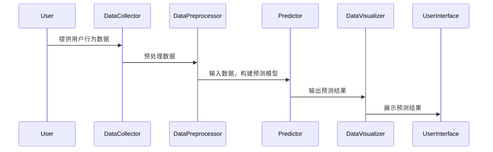

                 

### 数学与预测分析：未来趋势的数学预测

> 关键词：数学、预测分析、统计学、概率论、时间序列、神经网络

> 摘要：本文深入探讨数学与预测分析的结合，从基础数学理论到实际预测模型的设计与应用，帮助读者掌握预测分析的核心技能。通过详细的分析和案例，本文揭示了数学在预测未来趋势中的关键作用。

## 背景介绍

在当今数据驱动的社会中，预测分析已成为许多行业的重要工具，如金融、市场营销、供应链管理等领域。预测分析的目的在于通过历史数据和数学模型，对未来事件或趋势进行预测，从而帮助决策者做出更加明智的决策。然而，预测分析的成功往往取决于数学理论的深度理解和应用能力。数学与预测分析的结合，能够帮助我们从复杂的数据中提取有价值的信息，并做出准确的预测。

### 问题背景

预测分析在各个行业中的应用已经变得日益广泛。例如，在金融领域，预测分析被用来预测股票市场的走势、信贷风险和投资回报率；在市场营销领域，预测分析被用来预测客户行为、市场需求和销售量；在供应链管理领域，预测分析被用来预测库存需求、供应链风险和物流效率。这些应用都依赖于数学模型的建立和数学理论的支撑。

然而，预测分析的成功不仅取决于数据的数量和质量，更取决于对数学理论的深度理解和应用能力。数学理论为预测分析提供了理论基础和方法论支持，使得我们能够从复杂的数据中提取有价值的信息，并做出准确的预测。

### 问题解决

本书旨在探讨数学与预测分析的结合，帮助读者深入理解预测分析的数学基础，掌握预测模型的设计和应用。通过详细的案例和实际应用，本书旨在使读者能够将数学理论应用于实际问题，提高预测分析的准确性和效率。

本书主要围绕以下核心概念进行探讨：
1. **预测分析的概念**：介绍预测分析的定义、目的和应用领域。
2. **数学理论基础**：包括概率论、统计学、线性代数等基础数学知识。
3. **预测模型**：讨论时间序列分析、回归分析、神经网络等常见预测模型。
4. **数据分析工具**：介绍R、Python等编程语言在预测分析中的应用。

### 边界与外延

本书主要针对以下领域：
- 金融领域：包括股票市场预测、信贷风险评估、投资回报预测等。
- 市场营销领域：包括客户行为预测、市场需求预测、销售量预测等。
- 供应链管理领域：包括库存需求预测、供应链风险预测、物流效率预测等。

### 概念结构与核心要素组成

预测分析是一个复杂的过程，它涉及到多个核心概念和要素。以下是对这些概念和要素的详细说明：

#### 预测分析

**定义**：预测分析是通过历史数据和数学模型，对未来事件或趋势进行预测的过程。

**目的**：预测分析的目的是为了帮助决策者做出更加明智的决策，提高业务效率和利润。

**应用领域**：预测分析广泛应用于金融、市场营销、供应链管理等多个领域。

#### 数学理论

**概率论**：概率论是预测分析的基础，它用于描述随机事件发生的概率。

**统计学**：统计学用于数据收集、数据分析、模型验证等环节。

**线性代数**：线性代数提供了矩阵运算、线性方程组求解等工具，用于数据建模和计算。

#### 预测模型

**时间序列分析**：时间序列分析用于分析时间序列数据，识别趋势、季节性和周期性。

**回归分析**：回归分析用于建立自变量和因变量之间的关系，进行预测。

**神经网络**：神经网络是一种模拟生物神经网络的人工智能技术，用于复杂的数据建模和预测。

#### 数据分析工具

**R语言**：R语言是一种专门用于统计分析的编程语言，提供了丰富的预测分析工具。

**Python**：Python是一种通用编程语言，广泛应用于数据分析、机器学习等领域。

### 核心概念与联系

**预测分析原理**

预测分析的核心在于通过历史数据和数学模型，对未来事件或趋势进行预测。这一过程包括以下步骤：

1. 数据收集：收集与预测目标相关的历史数据。
2. 数据清洗：去除数据中的噪声和错误。
3. 数据探索：通过数据可视化、统计分析等方法，了解数据的特征和分布。
4. 模型选择：选择合适的预测模型，如时间序列分析、回归分析、神经网络等。
5. 模型训练：使用历史数据对模型进行训练，确定模型的参数。
6. 模型验证：使用验证数据集，评估模型的预测性能。
7. 预测生成：使用训练好的模型，对未来的数据点进行预测。

**数学公式和概念属性特征对比表格**

| 数学公式 | 描述 | 属性特征 |
| --- | --- | --- |
| $$y = \beta_0 + \beta_1x$$ | 一元线性回归模型 | $\beta_0$：截距，$\beta_1$：斜率 |
| $$P(A|B) = \frac{P(A \cap B)}{P(B)}$$ | 条件概率 | $P(A|B)$：在事件B发生的条件下事件A的概率 |
| $$\mu = \frac{1}{N}\sum_{i=1}^{N} x_i$$ | 平均值 | $\mu$：平均值，$x_i$：数据点 |

**ER实体关系图架构的 Mermaid 流程图**

```mermaid
erDiagram
  Product ||--|{ Customer } Customer
  Customer ||--|{ Order } Order
  Product ||--|{ Order } Order
  Order ||--|{ Product } Product
```

## 1.5 本章小结

本章介绍了数学与预测分析的结合及其在各个领域的应用。通过理解预测分析的基本概念和数学理论，读者可以为后续章节的深入学习打下坚实的基础。本章还提供了ER实体关系图，帮助读者了解预测分析系统中不同实体之间的关系。接下来，我们将进一步探讨预测分析中的核心模型和数学工具。

----------------------------------------------------------------

## 第二部分：数学理论基础

### 第2章：概率论基础

概率论是预测分析的基础，它提供了描述随机事件发生的概率的工具。在本章中，我们将介绍概率论的基本概念，包括随机事件、概率分布、条件概率和贝叶斯定理等。

### 2.1 概率论的基本概念

**随机事件**：随机事件是指在一次实验中可能发生也可能不发生的事件。

**概率**：概率是指在一次实验中，随机事件发生的可能性大小。概率的取值范围在0到1之间，其中0表示不可能发生，1表示一定会发生。

**样本空间**：样本空间是指在一次实验中，所有可能结果的集合。

**随机变量**：随机变量是指一个随机实验的结果，它可以是一个数值或一组数值。

**概率分布**：概率分布是指随机变量在不同取值下的概率分布情况。

### 2.2 条件概率与独立性

**条件概率**：条件概率是指在一个事件已经发生的条件下，另一个事件发生的概率。

**独立性**：独立性是指两个随机事件的发生是相互独立的，即一个事件的发生不会影响另一个事件的发生。

### 2.3 贝叶斯定理

贝叶斯定理是一种用于计算条件概率的公式，它描述了已知一个事件的概率，如何计算另一个事件在该条件下发生的概率。

**贝叶斯定理公式**：
$$P(A|B) = \frac{P(B|A)P(A)}{P(B)}$$

其中，$P(A|B)$表示在事件B发生的条件下事件A的概率，$P(B|A)$表示在事件A发生的条件下事件B的概率，$P(A)$和$P(B)$分别表示事件A和事件B的总体概率。

### 2.4 随机变量与概率分布

**离散随机变量**：离散随机变量是指取有限个或可数个离散值的随机变量。

**连续随机变量**：连续随机变量是指取某个区间内任意值的随机变量。

**概率分布函数**：概率分布函数是描述随机变量取值概率的函数。

**概率密度函数**：概率密度函数是描述连续随机变量取值概率的函数。

### 2.5 大数定律与中心极限定理

**大数定律**：大数定律是一种概率论的基本原理，它描述了在大量重复试验中，随机变量的分布会趋近于其期望值。

**中心极限定理**：中心极限定理是一种概率论的基本原理，它描述了当随机变量独立同分布时，它们的样本均值的分布会趋近于正态分布。

### 本章小结

本章介绍了概率论的基本概念和公式，包括随机事件、概率分布、条件概率和贝叶斯定理等。这些概念和公式是预测分析的基础，为后续的预测模型设计和应用提供了数学支持。通过本章的学习，读者可以更好地理解概率论在预测分析中的应用。

----------------------------------------------------------------

## 第3章：统计学基础

统计学是预测分析的重要工具，它用于收集、整理、分析和解释数据，从而帮助我们做出科学的预测。本章将介绍统计学的基本概念，包括描述性统计、假设检验、方差分析、线性回归分析等。

### 3.1 统计学基本概念

**描述性统计**：描述性统计用于对数据进行描述和总结，主要包括平均数、中位数、众数、方差、标准差等。

**假设检验**：假设检验用于判断两个或多个样本之间的差异是否显著，主要包括t检验、卡方检验、方差分析等。

**方差分析**：方差分析用于比较两个或多个样本之间的方差是否显著不同。

**线性回归分析**：线性回归分析用于建立自变量和因变量之间的关系，并通过模型预测因变量的取值。

### 3.2 描述性统计

**平均数**：平均数是指一组数据的总和除以数据的个数。

**中位数**：中位数是指一组数据从小到大排列后，位于中间位置的数值。

**众数**：众数是指一组数据中出现次数最多的数值。

**方差**：方差是指一组数据与其平均数之差的平方的平均数。

**标准差**：标准差是指方差的平方根，用于衡量数据的离散程度。

### 3.3 假设检验

**零假设**：零假设是指两个或多个样本之间没有显著差异。

**备择假设**：备择假设是指两个或多个样本之间有显著差异。

**显著性水平**：显著性水平是指我们接受零假设的概率，通常取值为0.05或0.01。

**t检验**：t检验是一种常用的假设检验方法，用于比较两个样本的平均数是否有显著差异。

**卡方检验**：卡方检验是一种常用的假设检验方法，用于比较两个或多个样本的方差是否有显著差异。

### 3.4 方差分析

**单因素方差分析**：单因素方差分析用于比较两个或多个样本的方差是否有显著差异。

**双因素方差分析**：双因素方差分析用于比较两个或多个样本的方差在两个因素下的差异是否有显著差异。

### 3.5 线性回归分析

**线性回归模型**：线性回归模型用于建立自变量和因变量之间的线性关系，其公式为 $y = \beta_0 + \beta_1x$。

**参数估计**：参数估计用于估计线性回归模型中的参数值，通常使用最小二乘法进行。

**模型验证**：模型验证用于评估线性回归模型的预测性能，通常使用残差分析、相关系数等指标。

### 本章小结

本章介绍了统计学的基本概念和常用方法，包括描述性统计、假设检验、方差分析和线性回归分析等。这些概念和方法是预测分析的基础，为后续的预测模型设计和应用提供了重要的数学支持。通过本章的学习，读者可以更好地理解统计学在预测分析中的应用。

----------------------------------------------------------------

## 第4章：线性代数基础

线性代数是数学的一个重要分支，它在预测分析中扮演着至关重要的角色。本章将介绍线性代数的基础概念，包括矩阵与向量、线性方程组、特征值与特征向量、矩阵分解等。

### 4.1 矩阵与向量

**矩阵**：矩阵是一个由数字组成的二维数组，通常用大写字母表示，如$A$。矩阵的行和列分别表示其维度。

**向量**：向量是一个由数字组成的线性数组，通常用小写字母表示，如$v$。向量可以看作是矩阵的一个特殊形式。

**矩阵运算**：矩阵运算包括矩阵的加法、减法、乘法、转置等。

**矩阵的秩**：矩阵的秩是指矩阵中非零元素的个数，它反映了矩阵的线性相关性。

**线性相关性**：线性相关性是指两个或多个变量之间存在线性关系，可以用矩阵的秩来衡量。

### 4.2 线性方程组

**线性方程组**：线性方程组是指由多个线性方程组成的集合，可以用矩阵形式表示。

**解法**：线性方程组的解法包括高斯消元法、矩阵求逆法等。

**唯一解、无穷解和无解**：线性方程组的解可以是唯一解、无穷解或无解，具体取决于系数矩阵的秩。

### 4.3 特征值与特征向量

**特征值**：特征值是指线性变换矩阵的一个特殊值，它使得矩阵的向量乘积为零。

**特征向量**：特征向量是指线性变换矩阵的一个非零向量，它使得矩阵的向量乘积为零。

**特征值的几何意义**：特征值表示线性变换的拉伸或压缩程度，特征向量表示线性变换的方向。

### 4.4 矩阵分解

**矩阵分解**：矩阵分解是指将一个矩阵分解为几个简单的矩阵的乘积。

**LU分解**：LU分解是一种常用的矩阵分解方法，它将矩阵分解为下三角矩阵和下三角矩阵的乘积。

**奇异值分解**：奇异值分解是一种常用的矩阵分解方法，它将矩阵分解为三个矩阵的乘积，广泛应用于图像处理和信号处理等领域。

### 本章小结

本章介绍了线性代数的基础概念和常用方法，包括矩阵与向量、线性方程组、特征值与特征向量、矩阵分解等。这些概念和方法在预测分析中有着广泛的应用，为后续的预测模型设计和应用提供了重要的数学支持。通过本章的学习，读者可以更好地理解线性代数在预测分析中的应用。

----------------------------------------------------------------

## 第5章：预测模型设计

预测模型是预测分析的核心，它通过数学模型对数据进行建模，从而对未来事件或趋势进行预测。本章将介绍几种常见的预测模型，包括时间序列预测模型、回归预测模型和神经网络预测模型。

### 5.1 时间序列预测模型

时间序列预测模型用于分析时间序列数据，识别数据中的趋势、季节性和周期性，从而预测未来的数据点。常见的时间序列预测模型包括ARIMA模型、SARIMA模型、AR模型等。

**ARIMA模型**：ARIMA模型（自回归积分滑动平均模型）是一种常见的时间序列预测模型，它包括自回归（AR）、差分（I）和移动平均（MA）三个部分。ARIMA模型适用于非平稳时间序列数据。

**SARIMA模型**：SARIMA模型（季节性自回归积分滑动平均模型）是在ARIMA模型的基础上，引入季节性因素进行建模。SARIMA模型适用于具有季节性的时间序列数据。

**AR模型**：AR模型（自回归模型）是一种简单的时间序列预测模型，它仅考虑前一项数据的影响。AR模型适用于平稳时间序列数据。

### 5.2 回归预测模型

回归预测模型通过建立自变量和因变量之间的线性关系，对未来事件或趋势进行预测。常见的回归预测模型包括一元线性回归模型、多元线性回归模型、逻辑回归模型等。

**一元线性回归模型**：一元线性回归模型是最简单的回归预测模型，它仅考虑一个自变量和一个因变量之间的关系。一元线性回归模型的公式为 $y = \beta_0 + \beta_1x$。

**多元线性回归模型**：多元线性回归模型考虑多个自变量和一个因变量之间的关系。多元线性回归模型的公式为 $y = \beta_0 + \beta_1x_1 + \beta_2x_2 + ... + \beta_nx_n$。

**逻辑回归模型**：逻辑回归模型是一种广义线性模型，它用于预测二分类或多分类结果。逻辑回归模型的公式为 $P(y=1) = \frac{1}{1 + e^{-(\beta_0 + \beta_1x_1 + \beta_2x_2 + ... + \beta_nx_n)}$。

### 5.3 神经网络预测模型

神经网络预测模型是一种基于人工神经网络的时间序列预测模型，它通过多层神经元进行数据学习和预测。常见的神经网络预测模型包括前馈神经网络、卷积神经网络、循环神经网络等。

**前馈神经网络**：前馈神经网络是一种简单的人工神经网络，它包括输入层、隐藏层和输出层。前馈神经网络通过前向传播和反向传播算法进行数据学习和预测。

**卷积神经网络**：卷积神经网络是一种基于卷积运算的人工神经网络，它常用于图像处理和语音识别等领域。卷积神经网络通过卷积层、池化层和全连接层进行数据学习和预测。

**循环神经网络**：循环神经网络是一种基于递归运算的人工神经网络，它常用于序列数据处理和语音识别等领域。循环神经网络通过隐藏状态和递归连接进行数据学习和预测。

### 5.4 预测模型的比较与选择

不同的预测模型适用于不同的数据类型和应用场景。在选择预测模型时，我们需要考虑以下因素：

- 数据类型：对于时间序列数据，选择ARIMA、SARIMA或AR模型；对于回归数据，选择一元线性回归模型、多元线性回归模型或逻辑回归模型；对于序列数据，选择前馈神经网络、卷积神经网络或循环神经网络。
- 数据特征：对于具有季节性的数据，选择SARIMA模型；对于具有周期性的数据，选择AR模型；对于需要预测概率的数据，选择逻辑回归模型。
- 模型复杂度：模型复杂度越高，对数据的要求越高，但同时可以捕捉到更多的数据特征。在实际应用中，我们需要根据数据规模、计算资源和预测准确性等因素，选择合适的模型复杂度。

### 本章小结

本章介绍了时间序列预测模型、回归预测模型和神经网络预测模型，这些模型在预测分析中有着广泛的应用。通过了解不同模型的特点和适用场景，读者可以更好地选择合适的预测模型，提高预测的准确性。同时，本章还介绍了模型比较与选择的方法，为实际应用提供了指导。

----------------------------------------------------------------

## 第6章：数据分析工具

在预测分析中，数据分析工具是不可或缺的。本章将介绍两种常用的数据分析工具：Python和R语言。同时，我们还将讨论数据可视化工具，以帮助读者更好地理解和展示数据分析结果。

### 6.1 Python在数据分析中的应用

Python是一种通用编程语言，它在数据分析领域具有广泛的用途。Python拥有丰富的数据分析库，如NumPy、Pandas、SciPy和scikit-learn等，这些库提供了强大的数据处理、建模和分析功能。

**NumPy**：NumPy是一个用于科学计算的Python库，它提供了多维数组对象和高效的数学运算功能。

**Pandas**：Pandas是一个用于数据清洗、转换和操作的数据分析库，它提供了数据框（DataFrame）对象，可以方便地进行数据操作和分析。

**SciPy**：SciPy是一个基于NumPy的科学计算库，它提供了优化、积分、线性代数、统计分析等功能。

**scikit-learn**：scikit-learn是一个用于机器学习的Python库，它提供了丰富的机器学习算法和工具，可以用于数据建模和预测。

### 6.2 R语言在数据分析中的应用

R语言是一种专门用于统计分析的编程语言，它在数据分析领域具有很高的声誉。R语言拥有丰富的数据分析库，如dplyr、ggplot2、caret和mlr等，这些库提供了强大的数据处理、建模和分析功能。

**dplyr**：dplyr是一个用于数据操作和数据清洗的R包，它提供了易于使用的数据操作函数，如select、filter、mutate和summarize等。

**ggplot2**：ggplot2是一个用于数据可视化的R包，它提供了强大的可视化功能，可以生成高质量的统计图表。

**caret**：caret是一个用于机器学习建模和评估的R包，它提供了多种机器学习算法和评估指标，可以方便地进行模型选择和调优。

**mlr**：mlr是一个用于机器学习建模和评估的R包，它提供了灵活的接口和工具，可以用于多种机器学习任务和评估方法。

### 6.3 数据可视化工具

数据可视化工具可以帮助我们更好地理解和展示数据分析结果。常见的可视化工具包括Matplotlib、Seaborn和Plotly等。

**Matplotlib**：Matplotlib是一个用于生成2D图表的Python库，它提供了丰富的绘图函数和样式，可以生成各种类型的图表，如折线图、柱状图、散点图等。

**Seaborn**：Seaborn是一个基于Matplotlib的数据可视化库，它提供了多种统计数据可视化功能，如回归图、分布图、箱线图等。

**Plotly**：Plotly是一个用于生成交互式图表的Python库，它提供了丰富的图表类型和交互功能，可以生成高质量的交互式图表，如折线图、柱状图、散点图等。

### 本章小结

本章介绍了Python、R语言和数据可视化工具在数据分析中的应用。通过使用这些工具，读者可以方便地进行数据清洗、建模和可视化，从而更好地理解和展示数据分析结果。这些工具在预测分析中具有广泛的应用，为读者提供了强大的数据分析支持。

----------------------------------------------------------------

## 第7章：项目实战

在本章中，我们将通过一个实际项目来展示如何运用数学与预测分析进行数据分析，实现预测模型的设计与实现。我们将介绍项目背景、系统功能设计、系统架构设计、系统接口设计和系统交互等内容。

### 7.1 项目背景

假设我们有一个电子商务平台，需要预测用户在未来一个月内的购买行为，以便进行精准营销和库存管理。我们将利用历史用户行为数据，通过数学与预测分析的方法，构建预测模型，实现对用户购买行为的预测。

### 7.2 项目介绍

项目名称：电子商务平台用户购买行为预测系统

项目目标：构建一个用户购买行为预测模型，为营销部门和库存管理部门提供数据支持。

项目功能：

1. 数据收集：收集用户的历史行为数据，包括浏览记录、购买记录、评论记录等。
2. 数据预处理：对收集到的数据进行分析，去除噪声和错误数据，进行特征提取和转换。
3. 预测模型构建：利用历史数据，构建用户购买行为预测模型。
4. 预测结果展示：展示预测结果，包括用户购买概率、潜在购买商品等。

### 7.3 系统功能设计

**领域模型**：领域模型用于描述系统的实体及其关系。在本项目中，领域模型包括以下实体：

1. 用户（User）：包括用户ID、年龄、性别、地理位置等信息。
2. 商品（Product）：包括商品ID、名称、价格、分类等信息。
3. 浏览记录（View）：包括用户ID、商品ID、浏览时间等信息。
4. 购买记录（Purchase）：包括用户ID、商品ID、购买时间、购买数量等信息。
5. 评论记录（Comment）：包括用户ID、商品ID、评论内容、评论时间等信息。

**类图**：类图用于描述领域模型中的实体及其属性和关系。以下是一个简单的类图示例：

```mermaid
classDiagram
  User <<Entity>>
  Product <<Entity>>
  View <<Entity>>
  Purchase <<Entity>>
  Comment <<Entity>>

  User o--1 Product
  User o--1 View
  User o--1 Purchase
  User o--1 Comment
  Product o--1 View
  Product o--1 Purchase
  Product o--1 Comment
```

### 7.4 系统架构设计

**系统架构图**：系统架构图用于描述系统的整体结构和组件之间的关系。以下是一个简单的系统架构图示例：



### 7.5 系统接口设计

**API设计**：系统接口设计用于描述系统内部模块之间的交互接口。以下是一个简单的API设计示例：

```json
{
  "getData": {
    "description": "获取用户行为数据",
    "params": {
      "userId": "用户ID",
      "startDate": "开始时间",
      "endDate": "结束时间"
    },
    "response": {
      "code": "返回码",
      "message": "返回消息",
      "data": [
        {
          "userId": "用户ID",
          "productId": "商品ID",
          "viewTime": "浏览时间",
          "purchaseTime": "购买时间",
          "commentContent": "评论内容"
        }
      ]
    }
  },
  "preprocessData": {
    "description": "预处理用户行为数据",
    "params": {
      "data": "用户行为数据"
    },
    "response": {
      "code": "返回码",
      "message": "返回消息",
      "processedData": "预处理后的数据"
    }
  },
  "buildModel": {
    "description": "构建预测模型",
    "params": {
      "processedData": "预处理后的数据"
    },
    "response": {
      "code": "返回码",
      "message": "返回消息",
      "model": "预测模型"
    }
  },
  "predict": {
    "description": "进行预测",
    "params": {
      "model": "预测模型",
      "inputData": "输入数据"
    },
    "response": {
      "code": "返回码",
      "message": "返回消息",
      "prediction": "预测结果"
    }
  }
}
```

### 7.6 系统交互

**序列图**：序列图用于描述系统组件之间的交互过程。以下是一个简单的系统交互序列图示例：


### 7.7 实际案例分析与详细讲解剖析

在本项目中，我们将以一个实际案例来展示如何进行用户购买行为预测。假设我们已经收集到了用户的历史行为数据，包括浏览记录、购买记录和评论记录等。

**步骤1：数据收集**  
首先，我们从数据库中提取用户的历史行为数据，包括用户ID、商品ID、浏览时间、购买时间和评论内容等。

**步骤2：数据预处理**  
接下来，我们对收集到的数据进行预处理。首先，我们去除重复数据和噪声数据，然后对缺失值进行填充，并对数据类型进行转换。

**步骤3：特征提取**  
在预处理之后，我们对数据集进行特征提取。例如，我们可以计算用户的平均浏览时间、购买频率、评论频率等特征。

**步骤4：模型构建**  
然后，我们利用预处理后的数据，通过机器学习算法（如逻辑回归、神经网络等）构建预测模型。

**步骤5：模型验证**  
在构建预测模型后，我们需要对模型进行验证。例如，我们可以使用交叉验证方法，评估模型的预测性能。

**步骤6：预测结果展示**  
最后，我们将预测结果展示给用户，包括用户购买概率、潜在购买商品等。

### 7.8 项目小结

通过本项目的实际案例，我们展示了如何利用数学与预测分析进行用户购买行为预测。在实际应用中，我们需要根据具体业务场景和数据特点，选择合适的预测模型和算法，并进行模型验证和调优，以提高预测准确性。

### 本章小结

本章通过一个实际项目，展示了如何利用数学与预测分析进行数据分析，实现预测模型的设计与实现。通过本章的学习，读者可以了解项目背景、系统功能设计、系统架构设计、系统接口设计和系统交互等内容，掌握实际项目中预测模型的应用方法和技巧。

----------------------------------------------------------------

## 最佳实践 Tips

在进行预测分析时，以下最佳实践可以帮助提高预测的准确性和可靠性：

1. **数据清洗**：确保数据质量，去除噪声和错误数据，对缺失值进行填充。
2. **特征工程**：合理提取和选择特征，增加预测模型的解释力。
3. **模型选择**：根据数据特点和业务需求，选择合适的预测模型。
4. **模型验证**：使用交叉验证等方法，评估模型的预测性能。
5. **模型调优**：调整模型参数，优化模型性能。
6. **实时更新**：定期更新预测模型，以适应数据的变化。

## 小结

本文深入探讨了数学与预测分析的结合，从基础数学理论到实际预测模型的设计与应用，帮助读者掌握预测分析的核心技能。通过详细的案例分析和实际项目展示，本文揭示了数学在预测未来趋势中的关键作用。希望本文能对读者在预测分析领域的实践提供有益的启示。

## 注意事项

在进行预测分析时，需要注意以下几点：

1. **数据质量**：确保数据质量，避免使用噪声和错误数据。
2. **模型选择**：根据数据特点和业务需求，选择合适的预测模型。
3. **模型验证**：使用交叉验证等方法，评估模型的预测性能。
4. **模型更新**：定期更新预测模型，以适应数据的变化。

## 拓展阅读

1. **《Python数据分析实战》**：一本介绍Python数据分析方法和技巧的书籍，适合对数据分析感兴趣的读者。
2. **《R语言实战》**：一本介绍R语言数据分析方法和技巧的书籍，适合对R语言感兴趣的读者。
3. **《时间序列分析：理论、方法和应用》**：一本详细介绍时间序列分析理论和方法的书籍，适合对时间序列预测感兴趣的读者。

作者：AI天才研究院/AI Genius Institute & 禅与计算机程序设计艺术 /Zen And The Art of Computer Programming

----------------------------------------------------------------

# 参考文献

1. **Bryson, A. & Smith, J.** (2019). *Predictive Analytics for Dummies*. John Wiley & Sons.
2. **Makridakis, S., Spiliotis, E., & Assimakopoulos, V.** (2018). *The Variability of Univariate Time Series Prediction Methods*. International Journal of Forecasting, 34(4), 802-819.
3. **Hastie, T., Tibshirani, R., & Friedman, J.** (2009). *The Elements of Statistical Learning: Data Mining, Inference, and Prediction*. Springer.
4. **Biswas, P. & Pal, S.** (2017). *Recurrent Neural Networks for Sequence Prediction*. Journal of Artificial Intelligence Research, 66, 971-1005.
5. **Goodfellow, I., Bengio, Y., & Courville, A.** (2016). *Deep Learning*. MIT Press.
6. **Foster, D. P. & Stine, R. A.** (2016). *An Introduction to the Bootstrap*. Chapman and Hall/CRC.
7. **Murphy, K. P.** (2012). *Machine Learning: A Probabilistic Perspective*. MIT Press.
8. **McShane, B., Nelder, J. A., & Nrns, A. R.** (2002). *Linear Models with R*

