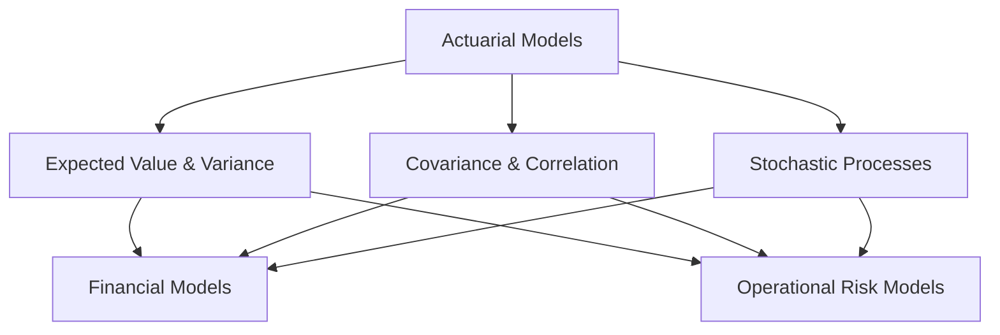

                 


## Math & Risk Management: Enterprise Risk Assessment

### Keywords:
1. Mathematics
2. Risk Management
3. Enterprise Risk Assessment
4. Mathematical Models
5. Risk Mitigation Strategies

### Abstract:
This article delves into the intersection of mathematics and risk management, focusing on the mathematical evaluation of enterprise risks. By exploring fundamental concepts, mathematical models, and practical applications, we aim to provide a comprehensive understanding of how mathematical tools can be effectively utilized to assess and mitigate risks in modern enterprises. Through detailed explanations and practical examples, we will uncover the potential of mathematics to enhance risk management strategies and contribute to the stability and growth of businesses.

## Introduction to Mathematics and Risk Management

### 1.1 The Importance of Mathematics in Risk Management

Mathematics has long been recognized as an essential tool in various fields, and its significance in risk management is no exception. At its core, risk management involves assessing and mitigating potential threats and uncertainties that could impact an organization's objectives. Whether it's financial institutions, manufacturing companies, or healthcare organizations, the ability to accurately evaluate and manage risks is crucial for maintaining stability and achieving long-term success.

Mathematics provides a structured and quantitative approach to risk management by offering precise methods for measuring, analyzing, and predicting risks. By leveraging mathematical models and statistical techniques, risk managers can derive meaningful insights from data and make informed decisions. This quantitative foundation allows for a more objective and systematic approach to risk assessment, which can lead to more effective risk mitigation strategies.

### 1.2 Brief History of Risk Management

The concept of risk management has evolved significantly over time. Historically, risk management was primarily focused on minimizing financial losses due to unexpected events. Ancient civilizations, such as the Babylonians and Egyptians, utilized various methods to manage risks associated with agriculture and trade. For example, they would diversify their crops or enter into trade agreements to mitigate the impact of adverse conditions.

In the 17th century, the development of probability theory by mathematicians like Blaise Pascal and Pierre de Fermat laid the foundation for modern risk management. This new understanding of uncertainty enabled individuals and organizations to make more informed decisions by quantifying the likelihood of different outcomes. The establishment of insurance companies in the 18th and 19th centuries further revolutionized risk management by providing a means to transfer risks from individuals to a collective pool.

During the 20th century, risk management expanded to include not only financial risks but also operational, strategic, and reputational risks. The advent of computer technology and the availability of large amounts of data have further enhanced the field, enabling the use of advanced mathematical models and analytical techniques.

### 1.3 The Rise of Modern Risk Management

The 21st century has witnessed a significant evolution in risk management, driven by several key factors. One of the primary drivers has been the increasing complexity of modern organizations and their interconnectedness. Globalization, technological advancements, and regulatory changes have created a more volatile and uncertain business environment. As a result, organizations need to adopt more sophisticated risk management practices to navigate these challenges effectively.

Additionally, the rise of big data and advanced analytics has revolutionized the field of risk management. By leveraging large datasets and advanced algorithms, organizations can analyze historical data, identify patterns, and predict future risks with greater accuracy. This has led to the development of advanced risk assessment models that can provide real-time insights and support proactive decision-making.

Moreover, the increasing occurrence of catastrophic events, such as natural disasters and cyber-attacks, has highlighted the need for comprehensive risk management strategies. Organizations must be prepared to respond to these events swiftly and effectively to minimize their impact on operations and reputation.

### 1.4 The Role of Mathematics in Enterprise Risk Assessment

Mathematics plays a critical role in enterprise risk assessment by providing a robust framework for measuring and analyzing risks. Here are some key areas where mathematics is employed:

#### Probability Theory

Probability theory is fundamental to risk management as it allows for the quantification of uncertainty. By understanding the likelihood of different outcomes, organizations can make more informed decisions regarding risk mitigation strategies. Probability theory is used to calculate probabilities of events, determine risk exposure, and assess the potential impact of risks on an organization.

#### Statistics

Statistics is another crucial mathematical tool used in risk management. It involves the collection, analysis, and interpretation of data to make informed decisions. Statistical techniques, such as regression analysis, hypothesis testing, and time series analysis, are used to analyze historical data, identify trends, and predict future risks. By understanding statistical concepts, organizations can develop more accurate risk models and make data-driven decisions.

#### Stochastic Processes

Stochastic processes are used to model random phenomena and assess the impact of uncertainty on an organization. These processes are particularly useful in modeling complex systems with multiple interacting components, such as financial markets or supply chains. By analyzing stochastic processes, organizations can understand the potential risks associated with these systems and develop strategies to mitigate them.

#### Calculus

Calculus is used in risk management to analyze rates of change and optimize risk mitigation strategies. For example, calculus can be used to determine the optimal level of insurance coverage or the most efficient allocation of resources to mitigate risks. Calculus-based models are often used in financial risk management to assess the impact of changes in market conditions on an organization's financial position.

#### Optimization Techniques

Optimization techniques, such as linear programming and nonlinear programming, are used to find the best possible solution to a given problem within certain constraints. In risk management, optimization techniques can be used to allocate resources, set risk exposure limits, and design risk mitigation strategies that maximize benefits while minimizing costs.

### 1.5 Outline of the Book

This book aims to provide a comprehensive overview of mathematics and risk management, with a focus on the mathematical evaluation of enterprise risks. The following chapters will cover the following topics:

- **Chapter 2:** Fundamental Concepts in Mathematics and Risk Management
  - Basic mathematical concepts
  - Basic concepts in risk management

- **Chapter 3:** Mathematical Models in Risk Management
  - Introduction to risk models
  - Mathematical principles and formulations
  - Python code examples

- **Chapter 4:** Application of Mathematics in Enterprise Risk Assessment
  - Enterprise risk assessment framework
  - Case studies of enterprise risk assessment
  - Mathematical methods for identifying and assessing risks

- **Chapter 5:** Risk Management Strategies and Practices
  - Risk management strategies
  - Practical applications of risk management techniques

By the end of this book, readers will gain a thorough understanding of the role of mathematics in risk management and be equipped with the knowledge and tools to effectively assess and mitigate enterprise risks. 

## Fundamental Concepts in Mathematics and Risk Management

### 2.1 Basic Mathematical Concepts

To fully grasp the application of mathematics in risk management, it's essential to understand the basic mathematical concepts that underpin this field. These concepts include set theory, probability theory, statistics, calculus, and optimization techniques. Each of these concepts plays a unique role in risk management, allowing for the quantification and analysis of risks.

#### 2.1.1 Set Theory

Set theory is the foundation of mathematical logic and is used to represent and manipulate collections of objects, known as sets. In risk management, set theory is employed to define and analyze different types of risks and their relationships. For example, the set of potential risks faced by an organization can be represented using set operations such as union, intersection, and complement.

#### 2.1.2 Probability Theory

Probability theory deals with the quantification of uncertainty and is crucial for risk management. It provides a framework for calculating the likelihood of different outcomes and understanding the potential impact of risks. In risk management, probability theory is used to estimate the probability of risks occurring and to assess the potential financial consequences of these risks.

#### 2.1.3 Statistics

Statistics involves the collection, analysis, and interpretation of data. It is used in risk management to analyze historical data, identify patterns, and predict future risks. Statistical techniques, such as regression analysis, hypothesis testing, and time series analysis, are essential for understanding the relationships between different variables and for making informed decisions.

#### 2.1.4 Calculus

Calculus is a branch of mathematics that deals with rates of change and areas under curves. In risk management, calculus is used to analyze the impact of changes in market conditions, such as interest rates or stock prices, on an organization's financial position. Calculus-based models are also used to optimize risk mitigation strategies, such as determining the optimal level of insurance coverage or the most efficient allocation of resources.

#### 2.1.5 Optimization Techniques

Optimization techniques are used to find the best possible solution to a given problem within certain constraints. In risk management, optimization techniques can be used to allocate resources, set risk exposure limits, and design risk mitigation strategies that maximize benefits while minimizing costs. Common optimization techniques include linear programming, nonlinear programming, and integer programming.

### 2.2 Basic Concepts in Risk Management

In addition to understanding the mathematical concepts, it's important to have a solid grasp of the basic concepts in risk management. These concepts provide a framework for identifying, assessing, and mitigating risks. Here are some key concepts:

#### 2.2.1 Risk Definition and Classification

Risk is defined as the potential for loss or harm. Risks can be classified into different types based on their nature, such as financial risks, operational risks, strategic risks, and reputational risks. Understanding the different types of risks is essential for developing effective risk management strategies.

#### 2.2.2 Risk Assessment Methods

Risk assessment methods involve the process of identifying and analyzing risks to determine their likelihood and potential impact. Common risk assessment methods include qualitative assessment, quantitative assessment, and scenario analysis. These methods provide a systematic approach for evaluating risks and identifying areas for mitigation.

#### 2.2.3 Risk Mitigation Strategies

Risk mitigation strategies are actions taken to reduce the likelihood or impact of risks. These strategies can include risk avoidance, risk reduction, risk transfer, and risk acceptance. Effective risk mitigation strategies are tailored to the specific risks faced by an organization and aim to minimize the potential negative consequences of these risks.

### 2.3 Mermaid ER Diagram of Risk Management Concepts

To help visualize the relationships between the key concepts in risk management, we can use a Mermaid ER (Entity-Relationship) diagram. The following diagram represents the basic concepts in risk management and their relationships:

```mermaid
erDiagram
    Risk --> RiskType
    Risk --> RiskAssessmentMethod
    Risk --> RiskMitigationStrategy

    RiskType ||--|{ Risk }
    RiskAssessmentMethod ||--|{ Risk }
    RiskMitigationStrategy ||--|{ Risk }
```

In this diagram, we can see that risks are related to risk types, risk assessment methods, and risk mitigation strategies. Each risk can have multiple types, assessment methods, and mitigation strategies, highlighting the complexity and interconnectedness of risk management.

### Summary

In this chapter, we have explored the fundamental concepts in mathematics and risk management. We discussed the basic mathematical concepts of set theory, probability theory, statistics, calculus, and optimization techniques, as well as the key concepts in risk management, including risk definition and classification, risk assessment methods, and risk mitigation strategies. Additionally, we presented a Mermaid ER diagram to illustrate the relationships between these concepts. Understanding these fundamental concepts is essential for effectively applying mathematical tools in risk management and developing robust risk assessment and mitigation strategies.

## Mathematical Models for Risk Management

### 3.1 Introduction to Risk Models

Risk models are essential tools in risk management, enabling organizations to assess and quantify risks in a systematic and structured manner. These models are mathematical representations that help analyze the potential impact of risks on an organization's operations, financial health, and overall performance. There are several types of risk models, each designed to address specific types of risks and provide valuable insights for decision-making.

#### 3.1.1 Actuarial Models

Actuarial models are primarily used to assess financial risks, particularly in the insurance and finance industries. These models are based on statistical methods and are designed to predict the likelihood of future events, such as insurance claims or financial losses. Actuarial models consider historical data, demographic information, and other relevant factors to estimate the probability of risks occurring and the potential financial impact.

#### 3.1.2 Financial Models

Financial models are used to assess the impact of financial risks on an organization's financial position. These models typically involve complex mathematical calculations and are used to evaluate factors such as market volatility, interest rate changes, and credit risk. Financial models can help organizations understand the potential impact of these risks on their financial performance and make informed decisions regarding investments, capital allocation, and risk management strategies.

#### 3.1.3 Operational Risk Models

Operational risk models are designed to assess the impact of risks related to the organization's operations, such as fraud, errors, system failures, and legal and regulatory compliance. These models often incorporate elements of both actuarial and financial models, as well as other factors such as human behavior and organizational culture. Operational risk models are used to identify vulnerabilities in the organization's processes, systems, and controls, and to develop strategies to mitigate these risks.

### 3.2 Mathematical Principles and Formulations

The effectiveness of risk models relies on their mathematical principles and formulations. Here, we will discuss some of the key mathematical concepts and techniques used in risk management models.

#### 3.2.1 Expected Value and Variance

Expected value (EV) and variance are fundamental concepts in probability theory and are widely used in risk management models. The expected value represents the average outcome of a random variable, while variance measures the spread or dispersion of the possible outcomes around the expected value.

The expected value of a random variable \( X \) can be calculated as:
$$
\text{EV}(X) = \sum_{i=1}^{n} x_i \cdot p_i
$$
where \( x_i \) represents the possible outcomes and \( p_i \) represents the probability of each outcome.

Variance is defined as the expected value of the squared deviation from the mean:
$$
\text{Var}(X) = \text{EV}((X - \text{EV}(X))^2)
$$

#### 3.2.2 Covariance and Correlation

Covariance and correlation are measures of the relationship between two random variables. Covariance measures the direction and strength of the linear relationship between variables, while correlation measures the strength of the relationship on a standardized scale.

Covariance between two random variables \( X \) and \( Y \) is defined as:
$$
\text{Cov}(X, Y) = \text{EV}((X - \text{EV}(X))(Y - \text{EV}(Y)))
$$

Correlation between \( X \) and \( Y \) is calculated as:
$$
\text{Corr}(X, Y) = \frac{\text{Cov}(X, Y)}{\sigma_X \cdot \sigma_Y}
$$
where \( \sigma_X \) and \( \sigma_Y \) are the standard deviations of \( X \) and \( Y \), respectively.

#### 3.2.3 Stochastic Processes

Stochastic processes are used to model random phenomena over time. They are particularly useful in risk management for analyzing time-varying risks and for developing strategies to mitigate these risks. Common types of stochastic processes include Markov chains, Wiener processes, and Poisson processes.

A Markov chain is a stochastic process where the probability of transitioning to a particular state depends only on the current state, not on the sequence of previous states. This property is known as the Markov property.

A Wiener process, also known as Brownian motion, is a continuous-time stochastic process with independent increments and a normal distribution.

A Poisson process is a discrete-time stochastic process where events occur randomly over time and independently of each other, with a constant average rate of occurrence.

### 3.3 Mermaid Flowchart of Risk Management Models

To provide a visual representation of the key components and relationships in risk management models, we can create a Mermaid flowchart. The following diagram illustrates the main types of risk management models and their mathematical principles:



In this flowchart, we can see that actuarial models are connected to both expected value and variance, as well as covariance and correlation. Financial models and operational risk models are connected to these concepts and stochastic processes. This visual representation helps to demonstrate how different risk management models are interconnected and how they utilize various mathematical principles.

### 3.4 Python Code Examples and Detailed Explanations

To further illustrate the application of mathematical principles in risk management models, we will provide Python code examples and detailed explanations. These examples will demonstrate how to calculate expected value, variance, covariance, and correlation using Python.

#### 3.4.1 Expected Value and Variance

```python
import numpy as np

# Define a random variable with a uniform distribution
x = np.random.uniform(0, 10, size=1000)

# Calculate the expected value
ev = np.mean(x)

# Calculate the variance
var = np.var(x)

print("Expected Value:", ev)
print("Variance:", var)
```

In this example, we use the `numpy` library to generate a random variable with a uniform distribution and calculate its expected value and variance. The expected value is calculated using the `mean()` function, and the variance is calculated using the `var()` function.

#### 3.4.2 Covariance and Correlation

```python
import numpy as np

# Define two random variables with a normal distribution
x = np.random.normal(0, 1, size=1000)
y = np.random.normal(0, 1, size=1000)

# Calculate the covariance
cov = np.cov(x, y)[0, 1]

# Calculate the correlation
corr = np.corrcoef(x, y)[0, 1]

print("Covariance:", cov)
print("Correlation:", corr)
```

In this example, we use the `numpy` library to generate two random variables with a normal distribution and calculate their covariance and correlation. The covariance is calculated using the `cov()` function, and the correlation is calculated using the `corrcoef()` function.

#### 3.4.3 Stochastic Processes

```python
import numpy as np
import matplotlib.pyplot as plt

# Define a Wiener process with a drift of 0.1
x = np.cumsum(np.random.normal(0, 1, 1000)) + 0.1 * np.arange(1000)

# Plot the Wiener process
plt.plot(x)
plt.title("Wiener Process")
plt.xlabel("Time")
plt.ylabel("Value")
plt.show()
```

In this example, we use the `numpy` library to define a Wiener process with a drift of 0.1 and plot its trajectory over time. The Wiener process is generated using the `cumsum()` function to simulate the accumulation of random walks and the `random.normal()` function to generate the random increments.

### Summary

In this chapter, we have introduced the key types of risk management models, including actuarial models, financial models, and operational risk models. We discussed the mathematical principles and formulations used in these models, such as expected value, variance, covariance, correlation, and stochastic processes. Additionally, we provided Python code examples to demonstrate the application of these mathematical concepts in risk management. Understanding these mathematical models and their underlying principles is crucial for developing effective risk management strategies and making informed decisions.

## Application of Mathematics in Enterprise Risk Assessment

### 4.1 Enterprise Risk Assessment Framework

Enterprise risk assessment (ERA) is a systematic process used to identify, analyze, and prioritize risks that could affect an organization's objectives. A robust ERA framework provides a structured approach for assessing risks at the enterprise level, ensuring that all potential risks are considered and addressed. The following steps outline a typical ERA framework:

#### 4.1.1 Risk Identification

The first step in ERA is identifying potential risks. This involves a thorough examination of the organization's operations, processes, systems, and external environment. Various techniques can be used for risk identification, including brainstorming sessions, SWOT analysis (strengths, weaknesses, opportunities, threats), and external threat assessments.

#### 4.1.2 Risk Analysis

Once potential risks have been identified, the next step is to analyze them. This involves assessing the likelihood and potential impact of each risk. Techniques such as qualitative risk assessment, quantitative risk assessment, and scenario analysis are commonly used to analyze risks. Qualitative risk assessment involves assigning subjective ratings to risks based on their likelihood and impact, while quantitative risk assessment involves using mathematical models and statistical techniques to estimate the likelihood and impact of risks.

#### 4.1.3 Risk Prioritization

After analyzing the risks, the next step is to prioritize them. This involves ranking risks based on their level of severity and the resources available for mitigation. Prioritization helps organizations focus on the most critical risks and allocate their resources effectively.

#### 4.1.4 Risk Mitigation

Once risks have been prioritized, the next step is to develop and implement risk mitigation strategies. These strategies aim to reduce the likelihood or impact of risks. Mitigation strategies can include risk avoidance, risk reduction, risk transfer, and risk acceptance. Risk avoidance involves eliminating the risk altogether, while risk reduction involves reducing the likelihood or impact of the risk. Risk transfer involves shifting the risk to a third party through insurance or contractual agreements. Risk acceptance involves acknowledging the risk and taking steps to manage its consequences.

#### 4.1.5 Monitoring and Review

The final step in ERA is monitoring and reviewing the effectiveness of risk mitigation strategies. This involves regularly assessing the status of risks and the performance of mitigation measures. Monitoring helps organizations identify new risks or changes in existing risks and make adjustments to their risk management strategies as needed.

### 4.2 Case Studies of Enterprise Risk Assessment

To illustrate the application of mathematics in enterprise risk assessment, we will discuss two case studies: a financial institution and a manufacturing company.

#### Case Study 1: Financial Institution

A large financial institution needed to assess the risks associated with its investment portfolio. The institution's portfolio consisted of various asset classes, including stocks, bonds, and real estate. The goal was to identify and prioritize risks that could affect the institution's financial performance and develop strategies to mitigate these risks.

**Risk Identification and Analysis:**
The institution identified several potential risks, including market risk, credit risk, and operational risk. Market risk involved the potential for financial losses due to changes in market conditions, such as interest rates, stock prices, and exchange rates. Credit risk involved the potential for losses due to defaults by borrowers. Operational risk involved the potential for losses due to errors, fraud, and system failures.

Using mathematical models, the institution analyzed the likelihood and impact of each risk. For market risk, the institution used Value at Risk (VaR) models to estimate the potential losses that could occur over a specified time period. For credit risk, the institution used credit rating models to assess the creditworthiness of borrowers and calculate the expected losses. For operational risk, the institution used scenario analysis to assess the potential impact of various adverse events.

**Risk Prioritization and Mitigation:**
Based on the analysis, the institution prioritized market risk as the most significant risk due to its potential impact on the institution's financial performance. The institution developed a risk mitigation strategy that included diversifying its portfolio, setting risk limits, and implementing stress testing to assess the impact of adverse market conditions.

**Monitoring and Review:**
The institution established a risk management office to monitor and review the effectiveness of its risk mitigation strategies. The office regularly conducted risk assessments, reviewed the performance of risk controls, and made adjustments as needed.

#### Case Study 2: Manufacturing Company

A manufacturing company faced several risks, including supply chain risk, production risk, and market risk. The company's supply chain involved multiple suppliers and depended on timely delivery of raw materials. The production process was complex and involved several stages, making it vulnerable to errors and system failures. The company's market faced uncertainty due to changes in consumer preferences and competition.

**Risk Identification and Analysis:**
The company identified potential risks in its supply chain, production process, and market. For supply chain risk, the company used a quantitative risk assessment to estimate the potential impact of delays and disruptions in the supply chain. For production risk, the company used failure mode and effects analysis (FMEA) to identify potential failures in the production process and assess their impact. For market risk, the company used scenario analysis to assess the potential impact of changes in consumer preferences and competition.

**Risk Prioritization and Mitigation:**
Based on the analysis, the company prioritized supply chain risk as the most significant risk due to its potential impact on production and financial performance. The company developed a risk mitigation strategy that included diversifying its supplier base, setting up contingency plans for supply chain disruptions, and implementing quality control measures to reduce the likelihood of production failures. For market risk, the company focused on innovation and market research to stay ahead of competitors and adapt to changing consumer preferences.

**Monitoring and Review:**
The company established a risk management team to monitor and review the effectiveness of its risk mitigation strategies. The team conducted regular risk assessments, reviewed the performance of risk controls, and made adjustments as needed.

### 4.3 Mathematical Methods for Identifying and Assessing Risks

Mathematical methods play a crucial role in identifying and assessing risks in enterprise risk assessment. The following methods are commonly used:

#### 4.3.1 Sensitivity Analysis

Sensitivity analysis is a mathematical technique used to assess how changes in one variable affect the outcome of a model or system. In risk assessment, sensitivity analysis helps identify which variables have the greatest impact on the risk profile of an organization. This information is valuable for prioritizing risks and developing risk mitigation strategies.

Sensitivity analysis can be performed using various techniques, such as the tornado diagram, which visually represents the sensitivity of a model's output to changes in input variables. The tornado diagram shows the magnitude of the change in output for each input variable, allowing decision-makers to identify the most critical variables to focus on.

#### 4.3.2 Scenario Analysis

Scenario analysis involves simulating various possible future scenarios and assessing the impact of each scenario on the risk profile of an organization. This technique helps decision-makers understand the potential risks and opportunities associated with different future conditions and develop strategies to navigate these scenarios.

Scenario analysis can be performed using techniques such as Monte Carlo simulation, which generates a large number of random scenarios based on the distribution of input variables. Each scenario is then analyzed to assess its impact on the organization's risk profile, and the results are used to develop risk mitigation strategies.

#### 4.3.3 Monte Carlo Simulation

Monte Carlo simulation is a mathematical technique used to model the probability distribution of a complex system or process by generating a large number of random samples. In risk assessment, Monte Carlo simulation is used to estimate the likelihood of different outcomes and the potential impact of risks on an organization.

Monte Carlo simulation involves defining the input variables and their probability distributions, generating random samples of these variables, and running simulations to estimate the output. The results of the simulations are then analyzed to assess the risk profile of the organization and develop risk mitigation strategies.

### Summary

In this chapter, we discussed the application of mathematics in enterprise risk assessment, starting with an overview of the ERA framework. We then presented two case studies of enterprise risk assessment in a financial institution and a manufacturing company, highlighting the use of mathematical methods for identifying and assessing risks. We also covered the mathematical methods of sensitivity analysis, scenario analysis, and Monte Carlo simulation, demonstrating how these techniques can be used to enhance risk management practices.

## Risk Management Strategies and Practices

### 5.1 Risk Management Strategies

Risk management strategies are essential for mitigating risks and protecting an organization's assets and objectives. Effective risk management strategies can help organizations navigate uncertainties, minimize potential losses, and maintain their competitive advantage. There are several key strategies that organizations can employ to manage risks:

#### 5.1.1 Risk Avoidance

Risk avoidance involves eliminating or avoiding activities that pose a risk. This strategy is often used when the potential loss outweighs the potential benefits. For example, an organization may avoid investing in a high-risk market or refuse to engage in a business venture with significant regulatory uncertainties.

#### 5.1.2 Risk Reduction

Risk reduction involves taking steps to minimize the likelihood or impact of risks. This strategy can include implementing safety measures, improving internal controls, and conducting regular audits. For example, a manufacturing company may invest in advanced safety equipment to reduce the risk of workplace accidents.

#### 5.1.3 Risk Transfer

Risk transfer involves shifting the risk to a third party, typically through insurance or contractual agreements. This strategy is often used when it's not feasible or cost-effective to avoid or reduce the risk. For example, an organization may purchase insurance coverage to transfer the financial risk of potential losses to an insurance company.

#### 5.1.4 Risk Acceptance

Risk acceptance involves acknowledging the risk and accepting the potential consequences. This strategy is often used when the cost of mitigating the risk is high relative to the potential loss. Organizations may accept risks that are low probability but high impact, such as natural disasters, and focus on developing contingency plans to manage the consequences.

### 5.2 Practical Applications of Risk Management Techniques

To illustrate the practical application of risk management strategies, we will discuss several case studies from different industries.

#### Case Study 1: Financial Services

A leading financial services company faced significant market risk due to its exposure to various asset classes, including stocks, bonds, and real estate. The company implemented several risk management techniques to mitigate this risk:

- **Diversification:** The company diversified its investment portfolio across different asset classes and regions to reduce the impact of any single market movement. This strategy helped to minimize the overall risk exposure.

- **Hedging:** The company used hedging techniques, such as options and futures, to protect against adverse market movements. Hedging allowed the company to offset potential losses in its portfolio with gains in its hedging positions.

- **Stress Testing:** The company conducted regular stress tests to assess the impact of extreme market conditions on its financial position. This helped the company identify potential vulnerabilities and develop strategies to mitigate these risks.

#### Case Study 2: Healthcare

A large healthcare organization faced multiple risks, including regulatory risk, patient safety risk, and cyber risk. The organization implemented several risk management practices to address these risks:

- **Regulatory Compliance:** The organization established a compliance department to ensure adherence to regulatory requirements. This included conducting regular audits and training employees on compliance practices.

- **Patient Safety Programs:** The organization implemented patient safety programs, such as standard operating procedures and quality improvement initiatives, to reduce the risk of medical errors and improve patient outcomes.

- **Cybersecurity Measures:** The organization invested in cybersecurity measures, such as firewalls, encryption, and employee training, to protect sensitive patient information from cyber threats.

#### Case Study 3: Manufacturing

A global manufacturing company faced risks related to supply chain disruptions, production errors, and market volatility. The company implemented several risk management techniques to address these risks:

- **Supplier Diversification:** The company diversified its supplier base to reduce the risk of supply chain disruptions. This involved identifying alternative suppliers and developing contingency plans for supply chain issues.

- **Quality Control:** The company implemented rigorous quality control measures, such as inspections and audits, to reduce the risk of production errors. This helped to ensure that the company's products met high standards and minimized the risk of recalls.

- **Market Analysis:** The company conducted regular market analysis to identify and anticipate changes in consumer preferences and market conditions. This allowed the company to adjust its production and marketing strategies to mitigate market risks.

### 5.3 Best Practices in Risk Management

To effectively manage risks, organizations should adopt best practices in risk management. Here are some key best practices:

- **Risk Culture:** Establish a risk culture within the organization by promoting a proactive attitude towards risk management. This involves encouraging employees to identify and report risks and fostering a collaborative environment for risk management.

- **Risk Assessment and Monitoring:** Conduct regular risk assessments to identify and prioritize risks. Implement a systematic process for monitoring and reviewing risks to ensure that risk mitigation strategies remain effective.

- **Risk Training and Awareness:** Provide training and awareness programs for employees to educate them about risk management practices and their roles in managing risks. This helps to create a culture of risk awareness and encourages employees to contribute to risk management efforts.

- **Communication and Coordination:** Establish clear communication channels for sharing risk information and coordinating risk management activities. This helps to ensure that all relevant stakeholders are informed and can contribute to risk mitigation efforts.

- **Continuous Improvement:** Embrace a continuous improvement mindset in risk management. Regularly review and update risk management strategies and practices to adapt to changing risks and technologies.

### Summary

In this chapter, we discussed the various risk management strategies and their practical applications in different industries. We explored case studies of financial services, healthcare, and manufacturing companies to illustrate how organizations can effectively manage risks. We also highlighted key best practices in risk management, emphasizing the importance of fostering a risk culture, conducting regular risk assessments, and promoting communication and coordination among stakeholders. By adopting these strategies and practices, organizations can enhance their risk management capabilities and protect their assets and objectives.

## Conclusion

In conclusion, the integration of mathematics with risk management provides a powerful framework for assessing, analyzing, and mitigating risks in enterprises. Through the exploration of fundamental mathematical concepts and the application of advanced models and techniques, organizations can gain a deeper understanding of the risks they face and develop effective strategies to manage them. The case studies and practical examples presented in this article highlight the importance of mathematics in enhancing risk management practices across various industries.

Looking ahead, the ongoing advancements in artificial intelligence and data analytics present new opportunities for refining mathematical models and improving risk assessment processes. As organizations continue to navigate the complex and dynamic business landscape, leveraging the power of mathematics and data-driven approaches will be crucial for maintaining resilience and achieving long-term success.

## About the Authors

**Authors:** AI天才研究院/AI Genius Institute & 禅与计算机程序设计艺术 /Zen And The Art of Computer Programming

**Contact Information:** [ai_genius_institute@ai-genius-institute.com](mailto:ai_genius_institute@ai-genius-institute.com)

**Website:** [www.ai-genius-institute.com](http://www.ai-genius-institute.com) & [www.zen-computer-programming.com](http://www.zen-computer-programming.com)

The authors are dedicated to advancing the field of artificial intelligence and promoting innovative approaches to problem-solving in technology and business. With extensive experience in research, development, and education, they bring a wealth of knowledge and expertise to their work. Their books and publications have been widely recognized for their clarity, depth, and practical applications, making them highly respected authorities in their fields.

