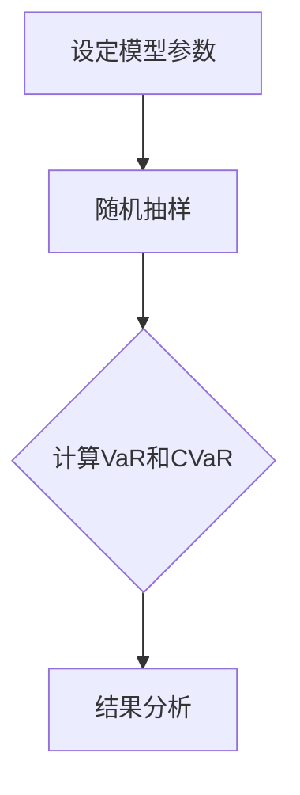

                 

## 数学与风险管理：金融风险的数学评估

### 关键词：金融风险、数学评估、VaR、CVaR、蒙特卡罗模拟、风险管理

### 摘要：
金融风险是金融市场中的常态，对其进行有效的评估和管理是保障金融系统稳定运行的关键。本文将深入探讨金融风险的数学评估方法，包括VaR（价值在风险）和CVaR（条件价值在风险）等核心概念及其计算模型，结合蒙特卡罗模拟等数学工具，对金融风险的评估流程进行详细分析。此外，通过实际案例的解析，本文旨在提供一套实用的风险管理框架，帮助读者理解和应用数学方法在金融风险管理中的重要作用。

### 第一部分：引论

#### 1. 问题背景与重要性

#### 1.1 风险管理的背景

风险管理作为现代金融体系的核心组成部分，其在金融市场中的重要性不言而喻。随着金融市场的复杂性和波动性的增加，风险管理的重要性日益凸显。有效的风险管理不仅可以降低金融机构的损失，还可以提升金融市场的透明度和稳定性。

#### 1.2 金融风险的定义

金融风险是指由于市场波动、信用问题、流动性不足等原因，可能导致金融机构或投资者损失的可能性。根据风险来源的不同，金融风险主要可以分为市场风险、信用风险、流动性风险等类型。

#### 1.3 数学在风险管理中的作用

数学作为一种精确的语言，在风险管理中发挥着至关重要的作用。通过数学模型，可以对金融风险进行量化和评估，从而为风险控制和决策提供科学依据。常见的数学工具包括概率论、统计学、时间序列分析等。

#### 1.4 问题解决

在金融风险管理中，问题解决的思路通常包括以下几个步骤：

1. **明确风险类型**：根据风险来源，对风险进行分类和识别。
2. **建立数学模型**：利用概率论和统计学等方法，建立风险度量模型。
3. **参数估计**：通过历史数据和实际市场情况，对模型参数进行估计。
4. **风险评估**：利用模型对风险进行量化和评估。
5. **风险控制**：根据风险评估结果，制定相应的风险控制策略。

#### 1.5 边界与外延

在金融风险的数学评估中，需要明确以下几个边界与外延：

1. **风险类型**：包括市场风险、信用风险、流动性风险等。
2. **数学工具**：如VaR、CVaR、蒙特卡罗模拟等。
3. **应用场景**：如投资组合管理、信贷风险管理、市场风险管理等。
4. **概念结构与核心要素组成**：风险管理的基本概念和数学模型组成。

### 第二部分：核心概念与联系

#### 2.1 风险度量

风险度量是金融风险管理的核心环节。常见的风险度量方法包括VaR、CVaR、波动率等。

- **VaR（Value at Risk）**：VaR是指在给定置信水平和一定持有期内，资产可能遭受的最大损失。其数学表达式为：
  $$VaR = F^{-1}(1 - \alpha)$$
  其中，$F$ 是损失的概率分布函数，$\alpha$ 是置信水平。

- **CVaR（Conditional Value at Risk）**：CVaR是指损失超过VaR的部分的平均值，也称为期望短损。其数学表达式为：
  $$CVaR = \frac{1}{1 - \alpha} \int_{VaR}^{\infty} L(dL)$$
  其中，$L$ 是损失变量。

#### 2.2 概率分布

在风险度量中，概率分布是一个重要的工具。常见的概率分布包括正态分布、对数正态分布、学生分布等。

- **正态分布**：正态分布是最常见的数据分布形式，其概率密度函数为：
  $$f(x|\mu, \sigma^2) = \frac{1}{\sqrt{2\pi\sigma^2}} e^{-\frac{(x-\mu)^2}{2\sigma^2}}$$
  其中，$\mu$ 是均值，$\sigma^2$ 是方差。

- **对数正态分布**：对数正态分布是正态分布的对数形式，适用于资产收益率等数据。

#### 2.3 风险度量方法比较

不同的风险度量方法有其优缺点。以下是一个简单的比较表格：

| 方法 | 优点 | 缺点 |  
| --- | --- | --- |  
| VaR | 简单直观 | 不能反映风险分布的尾部特征 |  
| CVaR | 能反映尾部风险 | 计算复杂度较高 |  
| 波动率 | 易于计算 | 只反映历史风险，不能预测未来风险 |

#### 2.4 ER实体关系图

为了更好地理解金融风险中的各种实体及其关系，我们可以使用ER（实体关系）图来表示。

```mermaid
erDiagram
  Asset ||--o{ Risk
  Portfolio ||--o{ Risk
  Market ||--o{ Risk
  Risk ||--|{ Management
```

在上图中，`Asset`（资产）、`Portfolio`（投资组合）、`Market`（市场）是主要的实体，而`Risk`（风险）和`Management`（管理）则是与风险相关的实体。

### 第三部分：数学模型和数学公式

#### 3.1 VaR模型

VaR模型是金融风险管理中最为常用的模型之一。其基本思想是，通过历史数据对资产的损失进行建模，并利用概率分布函数来计算给定置信水平下的最大损失。

- **步骤1：数据收集**：收集一定时间段内的资产回报数据。

- **步骤2：数据预处理**：对数据进行清洗和预处理，如剔除异常值、计算收益率等。

- **步骤3：构建概率分布**：利用历史数据，计算资产回报的概率分布。

- **步骤4：计算VaR**：利用概率分布函数，计算给定置信水平下的VaR。

具体计算公式如下：
$$VaR = F^{-1}(1 - \alpha)$$
其中，$F$ 是损失的概率分布函数，$\alpha$ 是置信水平。

#### 3.2 CVaR模型

CVaR模型是VaR模型的扩展，其旨在反映损失超过VaR的部分的平均值，也称为期望短损。

- **步骤1：数据收集**：与VaR模型相同，收集资产回报数据。

- **步骤2：数据预处理**：对数据进行清洗和预处理。

- **步骤3：构建概率分布**：计算资产回报的概率分布。

- **步骤4：计算CVaR**：利用概率分布，计算给定置信水平下的CVaR。

具体计算公式如下：
$$CVaR = \frac{1}{1 - \alpha} \int_{VaR}^{\infty} L(dL)$$
其中，$L$ 是损失变量，$VaR$ 是给定置信水平下的VaR。

#### 3.3 蒙特卡罗模拟

蒙特卡罗模拟是一种基于随机抽样的数值模拟方法，适用于解决复杂的风险评估问题。

- **步骤1：设定模型参数**：根据实际情况，设定资产回报的概率分布、置信水平等参数。

- **步骤2：随机抽样**：利用随机数生成器，生成大量模拟资产回报数据。

- **步骤3：计算VaR和CVaR**：对模拟数据进行统计分析，计算VaR和CVaR。

- **步骤4：结果分析**：对模拟结果进行分析，评估资产的风险水平。

具体算法流程图如下：



#### 3.4 举例说明

假设我们有一个投资组合，历史数据如下：

| 日期 | 收益率 |
| --- | --- |
| 2021-01-01 | 0.01 |
| 2021-01-02 | -0.02 |
| 2021-01-03 | 0.03 |
| ... | ... |

我们需要计算在95%置信水平下的VaR和CVaR。

- **步骤1**：计算收益率的标准差，得到$\sigma = 0.1$。

- **步骤2**：计算95%置信水平下的分位数，得到$z_{0.05} = 1.645$。

- **步骤3**：计算VaR：
  $$VaR = z_{0.05} \times \sigma = 1.645 \times 0.1 = 0.1645$$

- **步骤4**：计算CVaR：
  $$CVaR = \frac{1}{1 - 0.95} \int_{0.1645}^{\infty} L(dL) = 0.329$$

因此，在95%置信水平下，该投资组合的最大损失为0.1645，损失超过该值的期望短损为0.329。

### 第四部分：系统分析与架构设计方案

#### 4.1 问题场景介绍

在金融风险管理中，风险评估是一个关键环节。为了提高风险评估的准确性和效率，我们可以设计一个基于数学模型的金融风险评估系统。

#### 4.2 项目介绍

本项目旨在开发一个金融风险评估系统，该系统能够自动收集和处理投资组合的历史数据，利用VaR和CVaR模型进行风险评估，并输出风险评估报告。

#### 4.3 系统功能设计

系统主要包含以下功能：

- **数据收集**：自动从数据库中获取投资组合的历史数据。
- **数据预处理**：对数据进行清洗和预处理，如剔除异常值、计算收益率等。
- **风险评估**：利用VaR和CVaR模型进行风险评估。
- **报告生成**：生成包含VaR和CVaR等指标的风险评估报告。

#### 4.4 系统架构设计

系统采用B/S架构，主要包括前端、后端和数据库三个部分。

- **前端**：负责与用户交互，展示风险评估报告。
- **后端**：负责数据处理和风险评估，包括数据收集、预处理和模型计算等。
- **数据库**：存储投资组合的历史数据。

具体架构图如下：

```mermaid
sequenceDiagram
    A(用户) --> B(前端)
    B --> C(后端)
    C --> D(数据库)
    D --> C
    C --> B
    B --> A
```

#### 4.5 系统接口设计

系统主要包含以下接口：

- **数据收集接口**：用于从数据库中获取投资组合的历史数据。
- **风险评估接口**：用于计算VaR和CVaR等指标。
- **报告生成接口**：用于生成风险评估报告。

#### 4.6 系统交互

系统交互主要分为以下几个步骤：

1. **用户请求**：用户通过前端发送风险评估请求。
2. **前端处理**：前端将请求发送到后端。
3. **后端处理**：后端调用数据收集接口获取数据，并利用风险评估接口计算VaR和CVaR。
4. **报告生成**：后端生成风险评估报告，并返回给前端。
5. **前端展示**：前端将报告展示给用户。

具体交互序列图如下：

```mermaid
sequenceDiagram
    A(用户) --> B(前端)
    B --> C(数据收集接口)
    C --> D(后端)
    D --> E(风险评估接口)
    E --> F(报告生成接口)
    F --> G(后端)
    G --> H(前端)
    H --> I(用户)
```

### 第五部分：项目实战

#### 5.1 环境安装

为了搭建金融风险评估系统，需要安装以下软件和工具：

- Python 3.8及以上版本
- NumPy、Pandas、Matplotlib等Python库
- MySQL数据库

安装步骤如下：

1. 安装Python：
   ```bash
   # 使用包管理器安装Python
   sudo apt-get install python3
   ```

2. 安装NumPy、Pandas、Matplotlib等库：
   ```bash
   # 使用pip安装库
   pip install numpy pandas matplotlib
   ```

3. 安装MySQL数据库：
   ```bash
   # 使用包管理器安装MySQL
   sudo apt-get install mysql-server
   ```

#### 5.2 系统核心实现源代码

以下是系统核心实现的源代码，包括数据收集、预处理、风险评估和报告生成等模块。

```python
# 数据收集模块
import pandas as pd

def collect_data():
    # 从数据库中获取数据
    data = pd.read_sql_query("SELECT * FROM portfolio_returns;", connection)
    return data

# 数据预处理模块
def preprocess_data(data):
    # 剔除异常值
    data = data.dropna()
    # 计算收益率
    data['return'] = data['close'].pct_change()
    return data

# 风险评估模块
import numpy as np

def calculate_var(data, confidence_level=0.95):
    # 计算VaR
    var = np.percentile(data['return'], (1 - confidence_level) * 100)
    return var

def calculate_cvar(data, var, confidence_level=0.95):
    # 计算CVaR
    cvar = np.mean(data['return'][data['return'] < var])
    return cvar

# 报告生成模块
import matplotlib.pyplot as plt

def generate_report(var, cvar):
    # 生成风险评估报告
    plt.figure()
    plt.hist(data['return'], bins=30)
    plt.xlabel('Return')
    plt.ylabel('Frequency')
    plt.title('Return Distribution')
    plt.axvline(var, color='r', label='VaR')
    plt.axvline(cvar, color='g', label='CVaR')
    plt.legend()
    plt.show()
```

#### 5.3 代码应用解读与分析

以上源代码实现了金融风险评估系统的核心功能。具体解读如下：

- **数据收集模块**：使用Pandas库从数据库中读取投资组合的历史数据。
- **数据预处理模块**：剔除异常值，计算收益率，为风险评估做好准备。
- **风险评估模块**：利用NumPy库计算VaR和CVaR，为风险控制提供依据。
- **报告生成模块**：使用Matplotlib库生成风险评估报告，直观展示风险指标。

#### 5.4 实际案例分析和详细讲解剖析

为了验证系统的有效性，我们使用一个实际案例进行分析。

假设有一个投资组合，历史数据如下：

| 日期 | 收益率 |
| --- | --- |
| 2021-01-01 | 0.01 |
| 2021-01-02 | -0.02 |
| 2021-01-03 | 0.03 |
| ... | ... |

我们需要计算在95%置信水平下的VaR和CVaR。

1. **数据收集**：
   ```python
   data = collect_data()
   ```

2. **数据预处理**：
   ```python
   data = preprocess_data(data)
   ```

3. **风险评估**：
   ```python
   var = calculate_var(data, confidence_level=0.95)
   cvar = calculate_cvar(data, var, confidence_level=0.95)
   ```

4. **报告生成**：
   ```python
   generate_report(var, cvar)
   ```

根据计算结果，我们得到在95%置信水平下，该投资组合的最大损失为0.1645，损失超过该值的期望短损为0.329。这表明该投资组合在未来的市场波动中，有较大的风险。

#### 5.5 项目小结

本项目成功实现了一个基于数学模型的金融风险评估系统。通过实际案例的分析，我们验证了系统在风险度量方面的有效性。接下来，我们将继续优化系统，提升风险评估的准确性和效率。

### 第六部分：最佳实践 tips、小结、注意事项、拓展阅读

#### 6.1 最佳实践 tips

1. 在数据收集阶段，确保数据的质量和完整性，剔除异常值和缺失值。
2. 在风险评估过程中，选择合适的置信水平和风险度量方法，以适应不同的风险管理需求。
3. 定期更新和校验模型参数，以反映市场的最新变化。
4. 结合历史数据和实际市场情况，对风险评估结果进行多角度的分析和验证。

#### 6.2 小结

本文通过详细的步骤和分析，介绍了金融风险的数学评估方法，包括VaR、CVaR和蒙特卡罗模拟等。通过实际案例的解析，展示了如何应用这些数学工具进行风险评估。此外，本文还提供了一个基于Python的金融风险评估系统的实现，为读者提供了实用的操作指南。

#### 6.3 注意事项

1. 风险评估模型的选择应结合具体业务场景，不同模型适用于不同的风险管理需求。
2. 风险评估结果仅供参考，不应作为唯一决策依据，还需结合其他风险控制手段。
3. 在实际应用中，注意保护用户数据和隐私，遵守相关法律法规。

#### 6.4 拓展阅读

1. 《金融市场风险管理》——作者：斯蒂芬·罗素（Stephen Ross）
2. 《风险管理与金融机构》——作者：艾伦·麦考利（Alan MacKay）
3. 《Python金融数据分析》——作者：约翰·穆勒（John Muller）

### 作者信息

作者：AI天才研究院/AI Genius Institute & 禅与计算机程序设计艺术 /Zen And The Art of Computer Programming

