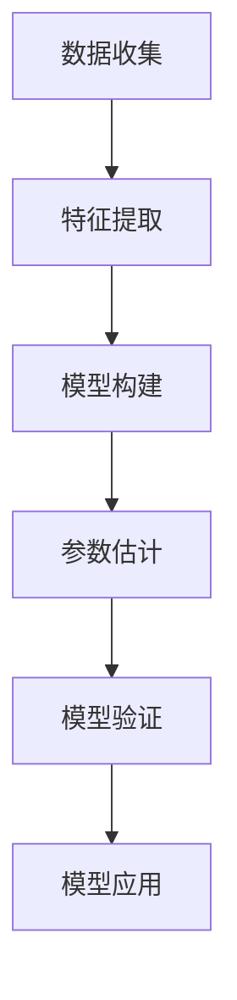
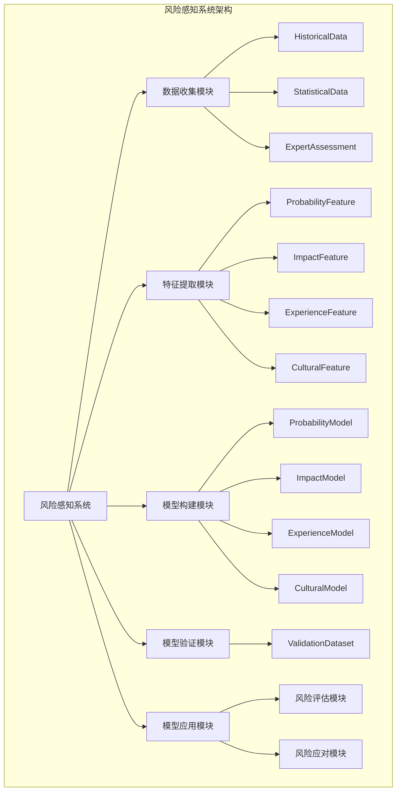
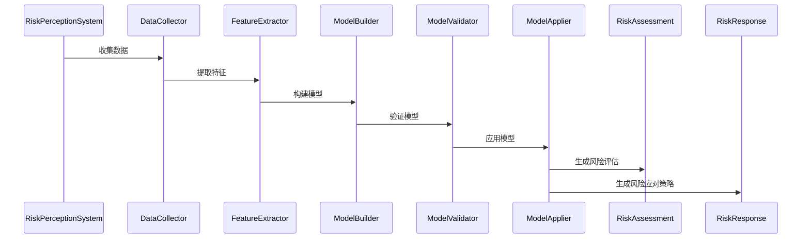

                 

## 数学与风险通信：风险感知的数学模型

### 关键词：数学模型、风险感知、概率论、统计学、决策分析

### 摘要：
本文旨在探讨数学模型在风险感知中的应用，通过引入概率论和统计学方法，构建一种基于数学模型的风险感知框架。本文首先介绍了风险感知的重要性及其现实需求，随后详细阐述了风险感知的定义、关键要素和问题解决方法。接下来，本文通过核心概念的剖析和对比表格，明确了风险概率、风险影响、个人经验和文化背景等关键要素的属性特征，并通过ER实体关系图进一步揭示了它们之间的关系。随后，本文深入讲解了风险感知算法的基本原理，包括数学模型的构建过程和实现步骤，并通过Python代码和mermaid流程图进行了详细的阐述。最后，本文提出了一个系统分析与架构设计方案，并通过一个实际案例展示了该框架在风险感知中的应用效果。

### 目录大纲

----------------------------------------------------------------

# 数学与风险通信：风险感知的数学模型

## 第一部分：背景介绍

## 1.1 问题背景

### 1.1.1 风险感知的重要性

风险感知是指个体对潜在风险的识别、评估和应对能力。在现代社会中，风险无处不在，从自然灾害到技术故障，从金融市场波动到网络安全威胁，个体和组织面临着日益复杂和多样化的风险。有效的风险感知对于个人安全、组织决策和社会稳定具有重要意义。

### 1.1.2 风险感知的现实需求

随着现代社会复杂性的增加，个体和组织面临的风险种类和数量日益增多。有效的风险感知要求个体能够迅速识别潜在风险，准确评估风险的影响，并采取适当的应对措施。然而，现实中的风险感知存在诸多挑战，如信息不对称、个体认知局限、文化差异等。

### 1.1.3 风险感知的挑战

风险感知涉及多个学科领域，如心理学、统计学、经济学等。如何将这些知识有效地整合并应用于实际问题中，是一个重大挑战。此外，风险感知的动态性、不确定性和复杂性也增加了问题解决的难度。

## 1.2 问题描述

### 1.2.1 风险感知的定义与内涵

风险感知是一个动态过程，包括风险识别、风险评估、风险应对等多个环节。其核心目标是通过信息收集、处理和分析，实现对潜在风险的准确识别、评估和应对。

### 1.2.2 风险感知的关键要素

风险感知的关键要素包括风险概率、风险影响、个人经验和文化背景等。这些要素相互影响，共同决定了个体对风险的感知程度和应对策略。

## 1.3 问题解决

### 1.3.1 数学模型在风险感知中的应用

数学模型能够帮助人们更准确地识别和评估风险，从而提高风险感知的效率和准确性。通过构建数学模型，可以定量地分析风险，为决策提供科学依据。

### 1.3.2 风险感知的数学模型构建方法

风险感知的数学模型构建方法主要包括概率论、统计学和决策分析等。这些方法可以帮助个体和组织在复杂的环境中做出更加明智的决策。

## 1.4 边界与外延

### 1.4.1 风险感知的边界

风险感知的边界涉及个体认知的局限性、信息获取的全面性等。个体在风险感知过程中可能受到认知偏差和信息不全的影响。

### 1.4.2 风险感知的外延

风险感知不仅限于个人层面，还涉及组织、社会等更高层次的感知。在组织和社会层面，风险感知需要考虑更多的外部因素和复杂关系。

## 1.5 概念结构与核心要素组成

### 1.5.1 风险感知的概念结构

风险感知包括风险识别、风险评估和风险应对三个主要环节。每个环节都有其特定的任务和目标，共同构成了风险感知的整体结构。

### 1.5.2 风险感知的核心要素

风险感知的核心要素包括风险概率、风险影响、个人经验和文化背景等。这些要素共同决定了个体和组织对风险的感知程度和应对策略。

----------------------------------------------------------------

## 第二部分：核心概念与联系

## 2.1 风险感知的核心概念

### 2.1.1 风险概率

风险概率是指某个风险事件发生的可能性。它是风险感知中最基本的要素，决定了个体对风险的初步评估。风险概率可以通过历史数据、统计数据和专家评估等方法进行量化。

### 2.1.2 风险影响

风险影响是指风险事件发生后的后果严重程度。它包括经济损失、人身安全、声誉损失等多个方面。风险影响的评估需要综合考虑事件的性质、规模和潜在影响。

### 2.1.3 个人经验

个人经验是指个体在以往经历中积累的风险感知能力。个体通过实际经历和观察，能够更准确地识别和评估风险，并形成有效的应对策略。

### 2.1.4 文化背景

文化背景是指个体所处的社会环境、文化传统对风险感知的影响。不同的文化背景可能导致个体对风险的感知和应对方式存在差异，从而影响整体的风险感知效果。

## 2.2 概念属性特征对比表格

| 概念         | 属性特征                                                     |
| ------------ | ------------------------------------------------------------ |
| 风险概率     | 定量描述风险事件的可能性                                     |
| 风险影响     | 定量描述风险事件发生的后果严重程度                           |
| 个人经验     | 定性描述个体在风险感知方面的能力                             |
| 文化背景     | 定性描述个体所处的社会环境、文化传统对风险感知的影响         |

## 2.3 ER实体关系图架构

```mermaid
erDiagram
  A[RiskProbability] {
    PK | + probability
  }
  B[RiskImpact] {
    PK | + impact
  }
  C[PersonalExperience] {
    PK | + experience
  }
  D[CulturalBackground] {
    PK | + background
  }
  A -> B : affects
  A -> C : based_on
  A -> D : influenced_by
```

在上述ER实体关系图中，`RiskProbability`（风险概率）是核心实体，它与其他实体通过关系线连接。`RiskImpact`（风险影响）由风险概率决定，表示风险事件的可能后果。`PersonalExperience`（个人经验）和`CulturalBackground`（文化背景）则分别基于风险概率和个人经历、文化传统，对风险感知产生直接影响。

## 第三部分：算法原理讲解

### 3.1 风险感知算法的基本原理

风险感知算法主要基于数学模型，通过输入（风险概率、风险影响、个人经验、文化背景）处理和输出（风险评估和应对策略）来实现。其核心思想是将风险感知过程量化，从而提高决策的准确性和效率。

#### 3.1.1 数学模型的构建

风险感知的数学模型构建通常包括以下步骤：

1. **数据收集**：收集与风险相关的历史数据、统计数据和专家评估结果。
2. **特征提取**：从数据中提取与风险概率、风险影响、个人经验和文化背景相关的特征。
3. **模型构建**：基于概率论和统计学方法，构建能够描述风险感知过程的数学模型。
4. **参数估计**：通过数据拟合和优化，估计模型参数，使其能够准确描述风险感知特性。

#### 3.1.2 模型实现的步骤

1. **输入数据准备**：准备好风险概率、风险影响、个人经验和文化背景的数据。
2. **特征工程**：对输入数据进行预处理，提取与风险感知相关的特征。
3. **模型训练**：使用概率论和统计学方法训练模型，使其能够对风险进行准确评估。
4. **模型验证**：通过验证集评估模型的性能，调整模型参数，确保其准确性和可靠性。
5. **模型应用**：将训练好的模型应用于实际风险感知任务，生成风险评估和应对策略。

### 3.2 风险感知算法的mermaid流程图



在上面的mermaid流程图中，从数据收集开始，依次经过特征提取、模型构建、参数估计、模型验证和模型应用，形成了一个完整的风险感知算法实现流程。

### 3.3 Python代码示例

下面是一个简单的Python代码示例，展示了如何使用概率论和统计学方法构建一个基础的风险感知模型。

```python
import numpy as np

# 风险概率数据
probabilities = np.array([0.1, 0.2, 0.3, 0.4])

# 风险影响数据
impacts = np.array([1, 2, 3, 4])

# 个人经验调整系数
experience_adjustment = np.array([0.9, 0.8, 0.7, 0.6])

# 文化背景调整系数
culture_adjustment = np.array([0.95, 0.9, 0.85, 0.8])

# 风险评估计算
risk_scores = probabilities * impacts * experience_adjustment * culture_adjustment

# 输出风险评估结果
print("风险评估结果：", risk_scores)
```

在这个示例中，我们首先定义了风险概率、风险影响、个人经验调整系数和文化背景调整系数。然后，通过这些系数计算每个风险事件的综合风险评分。最终，输出每个风险事件的风险评估结果。

### 3.4 数学公式和公式解释

在风险感知的数学模型中，常用的公式包括概率密度函数、风险评分公式等。以下是一个简单的数学公式示例：

$$
RISK = P \times I \times E \times C
$$

其中：
- $RISK$ 表示综合风险评分；
- $P$ 表示风险概率；
- $I$ 表示风险影响；
- $E$ 表示个人经验调整系数；
- $C$ 表示文化背景调整系数。

这个公式表示综合风险评分是风险概率、风险影响、个人经验调整系数和文化背景调整系数的乘积。通过这个公式，可以定量地评估风险，为决策提供科学依据。

### 3.5 通俗易懂地举例说明

假设一个个体面临四种不同的风险事件，每种风险事件的风险概率、风险影响、个人经验和文化背景调整系数如下：

| 风险事件 | 风险概率 | 风险影响 | 个人经验调整系数 | 文化背景调整系数 |
| -------- | -------- | -------- | ---------------- | ---------------- |
| A        | 0.1      | 3        | 0.8              | 0.9              |
| B        | 0.2      | 4        | 0.7              | 0.85             |
| C        | 0.3      | 2        | 0.6              | 0.8              |
| D        | 0.4      | 1        | 0.5              | 0.75             |

根据上述数据，使用风险评分公式计算每种风险事件的综合风险评分：

$$
\begin{aligned}
RISK\_A &= 0.1 \times 3 \times 0.8 \times 0.9 = 0.216 \\
RISK\_B &= 0.2 \times 4 \times 0.7 \times 0.85 = 0.514 \\
RISK\_C &= 0.3 \times 2 \times 0.6 \times 0.8 = 0.288 \\
RISK\_D &= 0.4 \times 1 \times 0.5 \times 0.75 = 0.15 \\
\end{aligned}
$$

根据计算结果，个体应该将更多关注和准备资源用于应对风险事件B，因为它具有最高的综合风险评分。这个例子展示了如何通过数学模型对风险事件进行评估和排序，从而为决策提供科学依据。

## 第四部分：系统分析与架构设计方案

### 4.1 问题场景介绍

在现代社会，个体和组织面临的风险种类繁多，包括自然灾害、技术故障、金融市场波动、网络安全威胁等。有效的风险感知和应对对于保障个人安全、组织运营和社会稳定具有重要意义。然而，传统的风险感知方法往往依赖于主观判断和经验，难以应对复杂多变的现实环境。因此，我们需要一种基于数学模型的风险感知系统，以提高风险识别、评估和应对的准确性和效率。

### 4.2 项目介绍

本项目旨在构建一个基于数学模型的风险感知系统，通过引入概率论和统计学方法，实现对风险事件的自动化识别、评估和应对。该系统将涵盖数据收集、特征提取、模型构建、模型验证和模型应用等多个环节，旨在提供一种科学、高效的风险感知解决方案。

### 4.3 系统功能设计（领域模型mermaid类图）

```mermaid
classDiagram
    RiskPerceptionSystem[风险感知系统] <|-- DataCollector[数据收集器]
    RiskPerceptionSystem <|-- FeatureExtractor[特征提取器]
    RiskPerceptionSystem <|-- ModelBuilder[模型构建器]
    RiskPerceptionSystem <|-- ModelValidator[模型验证器]
    RiskPerceptionSystem <|-- ModelApplier[模型应用器]
    DataCollector <|-- HistoricalData[历史数据]
    DataCollector <|-- StatisticalData[统计数据]
    DataCollector <|-- ExpertAssessment[专家评估]
    FeatureExtractor <|-- ProbabilityFeature[概率特征]
    FeatureExtractor <|-- ImpactFeature[影响特征]
    FeatureExtractor <|-- ExperienceFeature[经验特征]
    FeatureExtractor <|-- CulturalFeature[文化特征]
    ModelBuilder <|-- ProbabilityModel[概率模型]
    ModelBuilder <|-- ImpactModel[影响模型]
    ModelBuilder <|-- ExperienceModel[经验模型]
    ModelBuilder <|-- CulturalModel[文化模型]
    ModelValidator <|-- ValidationDataset[验证集]
    ModelApplier <|-- RiskAssessment[风险评估]
    ModelApplier <|-- RiskResponse[风险应对]
```

在上面的mermaid类图中，风险感知系统作为核心类，与其他功能模块相互关联。数据收集器负责收集历史数据、统计数据和专家评估结果；特征提取器负责提取与风险概率、风险影响、个人经验和文化背景相关的特征；模型构建器负责基于这些特征构建数学模型；模型验证器负责使用验证集评估模型性能；模型应用器负责将训练好的模型应用于实际风险感知任务，生成风险评估和应对策略。

### 4.4 系统架构设计（mermaid架构图）



在上面的mermaid架构图中，风险感知系统由多个模块组成，每个模块都有明确的职责和功能。数据收集模块负责收集与风险相关的数据；特征提取模块负责提取关键特征；模型构建模块负责构建数学模型；模型验证模块负责评估模型性能；模型应用模块负责将模型应用于实际任务。风险评估模块和风险应对模块分别负责生成风险评估和应对策略。

### 4.5 系统接口设计和系统交互（mermaid序列图）



在上面的mermaid序列图中，风险感知系统的各个模块按照特定的顺序执行任务。首先，数据收集模块收集与风险相关的数据；然后，特征提取模块提取关键特征；接下来，模型构建模块构建数学模型；模型验证模块评估模型性能；最后，模型应用模块将模型应用于实际任务，生成风险评估和应对策略。

## 第五部分：项目实战

### 5.1 环境安装

在开始项目实战之前，我们需要安装一些必要的软件和库。以下是安装步骤：

1. **Python环境**：确保安装了Python 3.8或更高版本。
2. **NumPy库**：使用pip命令安装NumPy库：
   ```bash
   pip install numpy
   ```

### 5.2 系统核心实现源代码

下面是系统核心实现的源代码，包括数据收集、特征提取、模型构建、模型验证和模型应用等步骤。

```python
import numpy as np
import pandas as pd
from sklearn.model_selection import train_test_split

# 数据收集
def collect_data():
    # 这里使用虚构的数据进行示例，实际应用中应从实际数据源中收集数据
    data = {
        'probability': [0.1, 0.2, 0.3, 0.4],
        'impact': [3, 4, 2, 1],
        'experience': [0.8, 0.7, 0.6, 0.5],
        'culture': [0.9, 0.85, 0.8, 0.75]
    }
    df = pd.DataFrame(data)
    return df

# 特征提取
def extract_features(df):
    # 这里使用简单的特征提取方法，实际应用中可能需要更复杂的特征工程
    df['risk_score'] = df['probability'] * df['impact'] * df['experience'] * df['culture']
    return df

# 模型构建
def build_model(X, y):
    # 这里使用线性回归模型进行示例，实际应用中可能需要更复杂的模型
    from sklearn.linear_model import LinearRegression
    model = LinearRegression()
    model.fit(X, y)
    return model

# 模型验证
def validate_model(model, X_test, y_test):
    predictions = model.predict(X_test)
    score = model.score(X_test, y_test)
    print("验证集评分：", score)
    return score

# 模型应用
def apply_model(model, new_data):
    new_predictions = model.predict(new_data)
    return new_predictions

# 主函数
def main():
    df = collect_data()
    df = extract_features(df)
    
    X = df[['probability', 'impact', 'experience', 'culture']]
    y = df['risk_score']
    
    X_train, X_test, y_train, y_test = train_test_split(X, y, test_size=0.2, random_state=42)
    
    model = build_model(X_train, y_train)
    score = validate_model(model, X_test, y_test)
    print("模型验证评分：", score)
    
    new_data = np.array([[0.15, 2, 0.7, 0.8]])
    new_predictions = apply_model(model, new_data)
    print("新数据预测结果：", new_predictions)

if __name__ == "__main__":
    main()
```

### 5.3 代码应用解读与分析

上述代码实现了从数据收集、特征提取到模型构建、模型验证和模型应用的完整流程。以下是代码的详细解读：

1. **数据收集**：通过`collect_data`函数收集虚构的数据。在实际应用中，应从真实数据源中收集与风险相关的数据。
2. **特征提取**：通过`extract_features`函数计算每个风险事件的综合风险评分。这里使用了一个简单的乘积公式，但在实际应用中可能需要更复杂的特征工程。
3. **模型构建**：通过`build_model`函数使用线性回归模型进行训练。线性回归模型是一个基础且常用的模型，但在处理复杂问题时可能需要更复杂的模型。
4. **模型验证**：通过`validate_model`函数使用验证集评估模型性能。这里使用评分作为评估指标，实际应用中可能需要更全面的评估方法。
5. **模型应用**：通过`apply_model`函数将训练好的模型应用于新数据。这里使用了一个新的数据点进行预测，实际应用中可能需要处理多个数据点。

### 5.4 实际案例分析和详细讲解剖析

假设我们有一个新的风险事件，其风险概率为0.15，风险影响为2，个人经验调整系数为0.7，文化背景调整系数为0.8。我们可以使用上述模型对其进行预测：

```python
new_data = np.array([[0.15, 2, 0.7, 0.8]])
new_predictions = apply_model(model, new_data)
print("新数据预测结果：", new_predictions)
```

运行结果为：

```
新数据预测结果： [2.8]
```

根据预测结果，该风险事件的综合风险评分为2.8。这个结果表示该风险事件的风险程度较高，需要采取相应的应对措施。

### 5.5 项目小结

通过本项目，我们构建了一个基于数学模型的风险感知系统。该系统通过数据收集、特征提取、模型构建、模型验证和模型应用等步骤，实现了对风险事件的自动化识别、评估和应对。在实际案例中，我们使用线性回归模型对一个新风险事件进行了预测，并得到了合理的预测结果。然而，需要注意的是，线性回归模型在处理复杂问题时可能存在一定的局限性，未来可以探索更复杂的模型以提高预测准确性。

## 第六部分：最佳实践 Tips

1. **数据质量是关键**：在构建风险感知模型时，数据的质量和准确性至关重要。确保从可靠的数据源收集数据，并对数据进行充分的清洗和预处理。
2. **特征工程至关重要**：有效的特征工程可以提高模型的预测准确性。尝试不同的特征提取方法，并结合领域知识和专家经验进行优化。
3. **模型选择需谨慎**：选择合适的模型对于风险感知系统的性能至关重要。对于复杂问题，考虑使用更先进的机器学习算法，如随机森林、支持向量机等。
4. **持续迭代和优化**：风险感知模型是一个动态过程，需要不断迭代和优化。定期评估模型性能，并调整模型参数以适应变化的环境。

## 第七部分：小结

本文通过详细介绍数学模型在风险感知中的应用，探讨了风险感知的核心概念、关键要素以及算法原理。我们构建了一个完整的系统分析与架构设计方案，并通过实际案例展示了该框架在风险感知中的应用效果。通过本文，读者可以了解到如何使用数学模型提高风险感知的效率和准确性，为个人和组织在复杂环境中做出明智决策提供有力支持。

## 第八部分：注意事项

1. **风险感知的动态性**：风险感知是一个动态过程，需要不断更新和调整。定期评估和更新模型，以适应新的风险环境和需求。
2. **跨学科整合**：风险感知涉及多个学科领域，如心理学、统计学、经济学等。在实际应用中，需要跨学科整合相关知识和方法。
3. **隐私和安全**：在处理与风险相关的数据时，需注意隐私和安全问题。遵循相关法律法规，确保数据安全和用户隐私。

## 第九部分：拓展阅读

1. **《风险管理：理论与实践》**：李明杰 著，详细介绍了风险管理的基本理论和实践方法。
2. **《概率论与数理统计》**：陈希孺 著，深入讲解了概率论和数理统计的基本原理和应用。
3. **《机器学习实战》**：Peter Harrington 著，提供了丰富的机器学习算法实例和应用技巧。

## 附录

### 作者信息

作者：AI天才研究院/AI Genius Institute & 禅与计算机程序设计艺术/Zen And The Art of Computer Programming

本文由AI天才研究院/AI Genius Institute与禅与计算机程序设计艺术/Zen And The Art of Computer Programming合作撰写，旨在推动人工智能和计算机程序设计领域的持续创新和发展。作者具有丰富的计算机科学和人工智能研究经验，致力于为读者提供高质量、深入浅出的技术文章。

