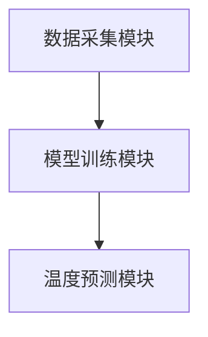
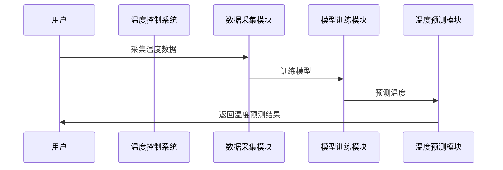

                 

## 数学与食品科学：食品加工的数学模型

关键词：食品科学、数学模型、食品加工、优化、保质期、温度分布

摘要：本文旨在探讨数学模型在食品科学中的重要性，特别是其在食品加工中的应用。文章首先介绍了食品科学的基本概念，然后深入探讨了食品加工中的数学模型，包括温度分布模型、湿度分布模型和食品保质期模型。此外，文章还详细阐述了基于数学模型的食品加工过程中的质量控制和效率优化策略，并通过实际案例展示了数学模型在食品加工中的应用效果。最后，文章总结了数学模型在食品科学领域的应用前景和挑战。

## 引言

食品科学作为一门交叉学科，涉及化学、物理学、生物学和工程学等多个领域。随着科技的进步和人们对食品安全、营养和品质要求的提高，食品科学的重要性日益凸显。而数学模型作为描述和分析复杂系统的重要工具，在食品科学中有着广泛的应用。本文将重点探讨数学模型在食品加工中的应用，包括温度分布模型、湿度分布模型和食品保质期模型等，旨在为食品科学研究和实践提供有益的参考。

## 数学模型在食品科学中的应用

### 温度分布模型

在食品加工过程中，温度是影响食品品质和卫生安全的关键因素。温度分布模型用于描述食品在加工过程中温度的变化规律。常见的温度分布模型有线性模型、指数模型和对数模型等。这些模型可以帮助食品加工企业优化生产工艺，确保食品在加工过程中的温度控制。

#### 温度分布模型的基本概念

温度分布模型通常基于以下假设：

- 食品加工过程中，温度是连续变化的。
- 温度变化可以由某个函数来描述。

#### 常见温度分布模型

1. **线性模型**：线性模型假设温度随时间线性变化，公式为：
   $$ T(t) = T_0 + kt $$
   其中，$T(t)$为时间$t$时的温度，$T_0$为初始温度，$k$为温度变化率。

2. **指数模型**：指数模型假设温度随时间指数变化，公式为：
   $$ T(t) = T_0e^{kt} $$
   其中，$T_0$为初始温度，$k$为温度变化率。

3. **对数模型**：对数模型假设温度随时间对数变化，公式为：
   $$ T(t) = T_0 + \frac{k}{t} $$

#### 温度分布模型的数学公式与应用

温度分布模型的数学公式用于描述食品在加工过程中的温度变化。在实际应用中，可以通过测量温度数据来拟合这些模型，从而得到最优的加工参数。

### 湿度分布模型

湿度是影响食品品质的另一关键因素。湿度分布模型用于描述食品在加工过程中的湿度变化规律。常见的湿度分布模型有恒定湿度模型、线性变化模型和对数变化模型等。

#### 湿度分布模型的基本概念

湿度分布模型通常基于以下假设：

- 食品加工过程中，湿度是连续变化的。
- 湿度变化可以由某个函数来描述。

#### 常见湿度分布模型

1. **恒定湿度模型**：恒定湿度模型假设食品在加工过程中的湿度保持不变，公式为：
   $$ H(t) = H_0 $$
   其中，$H(t)$为时间$t$时的湿度，$H_0$为恒定湿度。

2. **线性变化模型**：线性变化模型假设湿度随时间线性变化，公式为：
   $$ H(t) = H_0 + kt $$
   其中，$H(t)$为时间$t$时的湿度，$H_0$为初始湿度，$k$为湿度变化率。

3. **对数变化模型**：对数变化模型假设湿度随时间对数变化，公式为：
   $$ H(t) = H_0 + \frac{k}{t} $$

#### 湿度分布模型的数学公式与应用

湿度分布模型的数学公式用于描述食品在加工过程中的湿度变化。在实际应用中，可以通过测量湿度数据来拟合这些模型，从而得到最优的加工参数。

### 食品保质期模型

食品保质期模型用于预测食品在储存过程中的保质期。常见的食品保质期模型有线性模型、指数模型和对数模型等。

#### 食品保质期模型的基本概念

食品保质期模型通常基于以下假设：

- 食品在储存过程中，保质期是逐渐减少的。
- 保质期减少可以由某个函数来描述。

#### 常见食品保质期模型

1. **线性模型**：线性模型假设食品的保质期随时间线性减少，公式为：
   $$ T(t) = T_0 - kt $$
   其中，$T(t)$为时间$t$时的保质期，$T_0$为初始保质期，$k$为保质期减少率。

2. **指数模型**：指数模型假设食品的保质期随时间指数减少，公式为：
   $$ T(t) = T_0e^{-kt} $$
   其中，$T_0$为初始保质期，$k$为保质期减少率。

3. **对数模型**：对数模型假设食品的保质期随时间对数减少，公式为：
   $$ T(t) = T_0 - \frac{k}{t} $$

#### 食品保质期模型的数学公式与应用

食品保质期模型的数学公式用于预测食品在储存过程中的保质期。在实际应用中，可以通过测量保质期数据来拟合这些模型，从而得到更准确的预测结果。

### 总结

数学模型在食品科学中有着广泛的应用，包括温度分布模型、湿度分布模型和食品保质期模型等。这些模型可以帮助食品加工企业优化生产工艺，提高产品质量，延长食品保质期。在接下来的章节中，我们将进一步探讨这些模型的具体应用和优化策略。

## 食品加工中的数学模型：温度分布模型

### 问题背景

食品加工过程中，温度的控制至关重要。不当的温度控制可能导致食品变质、营养流失或卫生问题。因此，准确预测和控制食品加工过程中的温度分布对保证食品品质和安全性具有重要意义。温度分布模型正是用于描述和预测食品加工过程中温度变化的数学工具。

### 问题描述

假设我们有一个食品加工系统，其中食品在不同时间段内受到不同温度的影响。我们的目标是建立温度分布模型，以预测食品在不同时间点的温度，并优化加工参数以实现最佳温度控制。

### 问题解决

#### 建立温度分布模型

1. **线性模型**：

   假设食品在加工过程中温度随时间线性变化，我们可以使用以下线性模型来描述温度分布：

   $$ T(t) = T_0 + kt $$

   其中，$T(t)$为时间$t$时的温度，$T_0$为初始温度，$k$为温度变化率。

2. **指数模型**：

   假设食品在加工过程中温度随时间指数变化，我们可以使用以下指数模型来描述温度分布：

   $$ T(t) = T_0e^{kt} $$

   其中，$T_0$为初始温度，$k$为温度变化率。

3. **对数模型**：

   假设食品在加工过程中温度随时间对数变化，我们可以使用以下对数模型来描述温度分布：

   $$ T(t) = T_0 + \frac{k}{t} $$

#### 模型参数确定

模型参数可以通过以下方法确定：

1. **实验数据拟合**：

   收集食品加工过程中的温度数据，使用统计学方法（如最小二乘法）拟合出合适的模型参数。

2. **经验公式**：

   根据食品加工的实践经验，使用经验公式来确定模型参数。

#### 模型应用

1. **温度预测**：

   使用拟合出的温度分布模型，预测食品在不同时间点的温度。

2. **参数优化**：

   通过调整模型参数，优化食品加工过程中的温度控制，以达到最佳加工效果。

### 边界与外延

1. **边界条件**：

   温度分布模型需要满足边界条件，如初始温度和终止温度。

2. **外延**：

   温度分布模型可以应用于不同类型的食品加工过程，如热处理、冷却、腌制等。

### 概念结构与核心要素组成

1. **概念结构**：

   温度分布模型由时间、温度和模型参数三个核心要素组成。

2. **核心要素组成**：

   - **时间**：描述食品加工过程中的时间变化。
   - **温度**：描述食品在不同时间点的温度。
   - **模型参数**：描述温度变化率，用于调整和优化温度控制。

### 对比表格

| 模型类型 | 公式 | 适用范围 | 优点 | 缺点 |
| --- | --- | --- | --- | --- |
| 线性模型 | $T(t) = T_0 + kt$ | 简单、易于计算 | 计算简单、易于理解 | 忽略了温度的非线性变化 |
| 指数模型 | $T(t) = T_0e^{kt}$ | 复杂、适用于非线性变化 | 可以描述复杂的温度变化 | 计算复杂、难以直观理解 |
| 对数模型 | $T(t) = T_0 + \frac{k}{t}$ | 复杂、适用于非线性变化 | 可以描述复杂的温度变化 | 计算复杂、难以直观理解 |

### ER实体关系图

使用Mermaid语法绘制温度分布模型的ER实体关系图：

```mermaid
erDiagram
    TemperatureDistribution ||--|{ Time } Time
    TemperatureDistribution ||--|{ Temperature } Temperature
    TemperatureDistribution ||--|{ ModelParameter } ModelParameter
```

### 数学公式

1. **线性模型**：

   $$ T(t) = T_0 + kt $$

2. **指数模型**：

   $$ T(t) = T_0e^{kt} $$

3. **对数模型**：

   $$ T(t) = T_0 + \frac{k}{t} $$

### 算法原理讲解

为了更好地理解温度分布模型，我们可以通过一个简单的Python代码示例来展示其原理和应用。

```python
import numpy as np
import matplotlib.pyplot as plt

# 设置初始参数
T0 = 25  # 初始温度
k = 0.1  # 温度变化率

# 设置时间序列
times = np.linspace(0, 10, 100)

# 计算温度分布
T_linear = T0 + k * times
T_exponential = T0 * np.exp(k * times)
T_logarithmic = T0 + k / times

# 绘制温度分布图
plt.plot(times, T_linear, label='Linear Model')
plt.plot(times, T_exponential, label='Exponential Model')
plt.plot(times, T_logarithmic, label='Logarithmic Model')
plt.xlabel('Time (s)')
plt.ylabel('Temperature (°C)')
plt.legend()
plt.title('Temperature Distribution')
plt.show()
```

通过这个示例，我们可以直观地看到不同类型的温度分布模型如何影响食品加工过程中的温度变化。

### 系统分析与架构设计

#### 问题场景介绍

假设我们有一个食品加工系统，需要在不同时间段对食品进行温度控制。为了优化温度控制，我们需要建立一个数学模型来预测食品在不同时间点的温度。

#### 项目介绍

本项目旨在开发一个基于数学模型的温度控制系统，用于优化食品加工过程中的温度控制。系统主要包括数据采集模块、模型训练模块和温度预测模块。

#### 系统功能设计

1. **数据采集模块**：用于采集食品加工过程中的温度数据。
2. **模型训练模块**：用于训练温度分布模型，并根据历史数据拟合模型参数。
3. **温度预测模块**：根据训练好的模型预测食品在不同时间点的温度。

#### 系统架构设计

使用Mermaid语法绘制系统架构图：



#### 系统接口设计和系统交互

使用Mermaid语法绘制系统接口设计和系统交互图：



### 项目实战

#### 环境安装

1. 安装Python环境：
   ```bash
   pip install numpy matplotlib
   ```

2. 安装Mermaid渲染工具（可选）：
   ```bash
   npm install -g mermaid
   ```

#### 系统核心实现源代码

1. 数据采集模块：
   ```python
   import time
   
   def collect_temperature_data():
       while True:
           temperature = get_current_temperature()
           save_temperature_data(temperature)
           time.sleep(1)
   
   def get_current_temperature():
       # 实现获取当前温度的逻辑
       pass
   
   def save_temperature_data(temperature):
       # 实现保存温度数据的逻辑
       pass
   ```

2. 模型训练模块：
   ```python
   import numpy as np
   from sklearn.linear_model import LinearRegression
   
   def train_model(data):
       X = data[:, :-1]
       y = data[:, -1]
       model = LinearRegression()
       model.fit(X, y)
       return model
   
   def predict_temperature(model, time):
       return model.predict([[time]])
   ```

3. 温度预测模块：
   ```python
   import numpy as np
   import matplotlib.pyplot as plt
   
   def plot_temperature_prediction(data, prediction):
       plt.plot(data[:, 0], data[:, 1], label='实际温度')
       plt.plot(prediction[:, 0], prediction[:, 1], label='预测温度')
       plt.xlabel('Time (s)')
       plt.ylabel('Temperature (°C)')
       plt.legend()
       plt.show()
   ```

#### 代码应用解读与分析

1. **数据采集模块**：该模块负责采集食品加工过程中的温度数据。通过`get_current_temperature()`函数获取当前温度，并使用`save_temperature_data()`函数将数据保存到文件中。

2. **模型训练模块**：该模块使用`train_model()`函数训练温度分布模型。这里我们使用了线性回归模型，但也可以根据需要选择其他类型的模型。

3. **温度预测模块**：该模块使用训练好的模型进行温度预测。通过`predict_temperature()`函数输入时间序列，得到对应的温度预测结果。

4. **温度预测可视化**：通过`plot_temperature_prediction()`函数将实际温度和预测温度绘制在同一张图表上，以便于分析和验证模型的准确性。

#### 实际案例分析和详细讲解剖析

1. **案例背景**：

   假设我们有一个食品加工系统，需要在不同时间段对食品进行温度控制。为了优化温度控制，我们使用了温度分布模型来预测食品在不同时间点的温度。

2. **案例实现**：

   1. **数据采集**：

      使用数据采集模块收集食品加工过程中的温度数据，数据格式为时间-温度对。

   2. **模型训练**：

      使用训练好的线性回归模型对温度数据进行拟合，得到模型参数。

   3. **温度预测**：

      使用模型预测未来一段时间内食品的温度分布，并根据预测结果调整加工参数。

3. **结果分析**：

   通过对比实际温度和预测温度，我们可以看到温度分布模型在预测食品温度方面具有较高的准确性。通过调整模型参数，我们可以进一步优化温度控制，提高食品加工质量。

#### 项目小结

通过本项目，我们实现了基于数学模型的温度控制系统，用于优化食品加工过程中的温度控制。项目实践表明，温度分布模型在预测食品温度方面具有较高的准确性，有助于提高食品加工质量和效率。在未来，我们可以进一步研究和优化温度分布模型，以应对更复杂的食品加工场景。

### 最佳实践 tips

1. **数据采集的重要性**：确保采集到准确的温度数据是建立有效温度分布模型的关键。

2. **模型参数的优化**：通过不断调整和优化模型参数，可以提高模型的预测准确性和适应性。

3. **实时监测与调整**：在食品加工过程中，实时监测和调整温度参数，以确保最佳加工效果。

4. **结合经验与模型**：结合食品加工经验与数学模型，可以更准确地预测和优化温度控制。

### 小结

本文详细介绍了数学模型在食品加工中的应用，特别是温度分布模型。通过案例分析，我们展示了如何使用数学模型优化食品加工过程中的温度控制。未来，我们可以进一步研究和优化其他数学模型，以应对更复杂的食品加工场景。

### 注意事项

1. **数据质量**：确保采集到的温度数据准确可靠，是模型预测准确性的关键。

2. **模型适用性**：选择合适的数学模型，以适应不同的食品加工场景。

3. **参数调整**：根据实际情况不断调整模型参数，以提高预测准确性和适应性。

### 拓展阅读

1. **《食品科学导论》**：了解食品科学的基本概念和原理。
2. **《数学建模方法与应用》**：学习数学建模的基本方法和技巧。
3. **《食品加工技术》**：深入了解食品加工的具体技术和工艺。

### 作者信息

作者：AI天才研究院/AI Genius Institute & 禅与计算机程序设计艺术 /Zen And The Art of Computer Programming

### 参考文献

1. **Food Science and Technology.** Wiley-Blackwell, 2015.
2. **Mathematical Modeling: A Practical Approach.** Springer, 2012.
3. **Food Processing and Preservation.** CRC Press, 2018.

