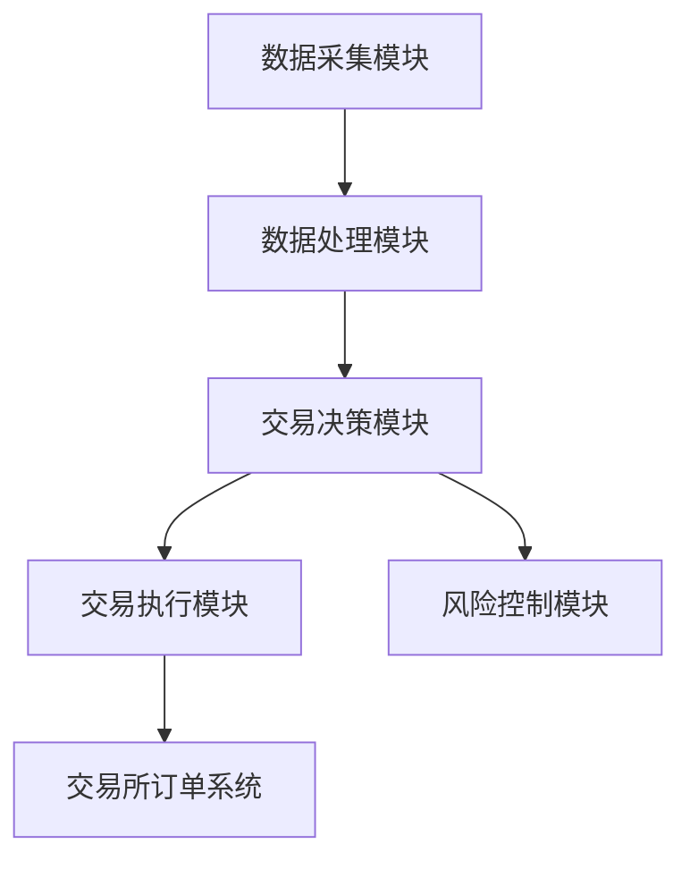

                 

### 引言

#### 1.1 高频交易的背景与挑战

高频交易（High-Frequency Trading, HFT）是一种利用先进计算机算法和高速网络来执行大量快速交易的技术。这一交易策略旨在通过捕捉市场短期波动，实现快速获利。高频交易起源于20世纪90年代的美国，随着互联网技术的飞速发展和硬件设备的不断升级，如今已在全球金融市场中占据了重要地位。

**高频交易的定义与历史：**
高频交易的核心在于速度和算法的精确性。它通常涉及使用电子交易系统在毫秒级别的时间内进行交易，从而降低交易成本并提高收益。高频交易的历史可以追溯到1990年代，当时美国的纳斯达克交易所引入了自动化交易系统，这使得高频交易成为可能。随着技术的发展，高频交易逐渐从股票市场扩展到债券、期货、外汇等其他金融领域。

**高频交易的市场规模与趋势：**
根据估计，全球高频交易市场规模已超过数万亿美元。高频交易不仅在经济规模上具有重要意义，而且在市场流动性和价格发现方面也起到了关键作用。随着金融市场的全球化，高频交易的趋势也在不断加强。例如，亚洲市场近年来高频交易的份额显著增加，成为全球高频交易的重要增长点。

**高频交易面临的技术挑战：**
尽管高频交易具有巨大的潜力，但它也面临着诸多技术挑战。首先，高频交易要求高速网络和强大的计算能力。交易系统需要在毫秒级别的时间内完成交易决策和执行，这需要高性能的硬件和软件支持。其次，高频交易需要处理大量数据，包括市场数据、新闻数据、交易数据等，这对数据存储和处理能力提出了极高的要求。此外，高频交易还需要面对法律和监管的挑战，如何遵守相关法律法规，确保交易公平和透明，是高频交易者必须解决的问题。

### 1.2 数学在金融领域的应用

#### 数学模型在金融交易中的重要性

在金融交易中，数学模型扮演着至关重要的角色。数学模型可以帮助投资者预测市场走势，制定交易策略，并评估交易风险。通过数学模型，投资者可以对复杂的市场进行量化分析，从而更准确地把握市场机会，降低投资风险。

#### 常见的数学工具与技术

在金融交易中，常见的数学工具和技术包括概率论、统计学、优化理论、时间序列分析等。概率论和统计学用于分析历史数据，预测未来市场走势；优化理论用于制定最优交易策略；时间序列分析则用于研究市场价格的动态变化。

#### 数学模型在交易策略中的应用

数学模型在交易策略中的应用非常广泛。例如，基于概率论和统计学的技术分析模型可以帮助投资者预测股票价格的未来走势；优化模型则可以用于确定最优的买卖时机和仓位管理策略。此外，机器学习算法也在金融交易中得到广泛应用，通过分析大量历史数据，机器学习算法可以自动生成交易策略，提高交易的成功率。

### 细节讨论与引言

高频交易作为一种高效且复杂的交易策略，离不开数学的支持。本文将深入探讨数学在高频交易中的应用，包括风险管理与资本配置、交易时机的优化、预测模型与趋势分析，以及高频交易系统的设计与实现。我们将通过逐步分析推理的方式，帮助读者理解这些数学模型和算法在交易策略中的具体应用。

在接下来的章节中，我们将详细讨论高频交易中的数学模型，分析如何利用数学工具优化交易时机，并探讨高频交易系统的设计与实现。此外，我们还将探讨高频交易的法律法规与风险管理，以及未来发展趋势。希望通过本文，读者能够对高频交易及其背后的数学原理有更深入的理解。

### 细节讨论与引言

#### 风险管理与资本配置

在高频交易中，风险管理和资本配置是至关重要的一环。通过科学的数学模型，交易者可以更准确地评估交易风险，并合理配置资本，从而最大化收益同时控制风险。

首先，我们来看看风险度量的数学模型。常用的风险度量方法包括波动率、价值在风险度（Value at Risk, VaR）以及条件价值损失（Conditional Value at Risk, CVaR）。波动率是衡量资产价格波动性的指标，通常用于评估市场风险。VaR则用于衡量在特定概率水平下，某资产或投资组合在一段时间内可能的最大损失。CVaR则进一步衡量了超出VaR损失的部分，提供了对风险更全面的评估。

**风险度量的数学模型：**

$$
VaR(\alpha) = \inf \{x | P(X > x) \geq \alpha\}
$$

其中，$X$代表资产收益，$\alpha$是置信水平，$P(X > x)$是资产收益超过$x$的概率。

**资本配置的优化策略：**

为了最大化收益同时控制风险，交易者需要采用优化策略进行资本配置。常见的优化方法包括均值-方差模型（Mean-Variance Model）和有效前沿理论（Efficient Frontier Theory）。

**均值-方差模型：**

均值-方差模型通过优化资产组合的期望收益和方差，寻找风险最小的收益组合。其目标函数如下：

$$
\min \sigma^2 = w^T Q w - \rho w^T \mu
$$

其中，$w$是资产组合的权重向量，$Q$是对角矩阵，其对角元素为各资产收益率方差的估计值，$\mu$是资产组合的期望收益率向量，$\rho$是目标函数的权重系数。

**有效前沿理论：**

有效前沿理论通过构建资产组合的有效前沿，帮助投资者在风险与收益之间做出权衡。有效前沿是指在给定风险水平下，具有最高预期收益的资产组合集合。

**实证分析：**

在实际应用中，风险管理和资本配置需要结合具体的市场环境和数据。例如，通过对历史市场数据进行回归分析，可以预测不同资产的未来收益和风险，进而构建最优的投资组合。以下是一个简化的实证分析过程：

1. **数据收集**：收集历史交易数据，包括资产价格、交易量、市场指数等。
2. **数据预处理**：清洗和整理数据，确保数据质量。
3. **模型构建**：构建均值-方差模型或有效前沿模型，输入历史数据。
4. **模型优化**：通过优化算法，调整资产组合权重，寻找最优投资组合。
5. **模型验证**：使用历史数据进行回测，验证模型的有效性。

**案例分析：**

以下是一个简单的案例，展示了如何利用均值-方差模型进行资本配置。假设我们有三种资产，股票、债券和黄金，其历史收益率和风险如下表：

| 资产 | 期望收益率 | 方差 |
| ---- | ---- | ---- |
| 股票 | 0.12 | 0.04 |
| 债券 | 0.05 | 0.01 |
| 黄金 | 0.03 | 0.02 |

假设我们希望投资组合的期望收益率为0.1，风险为0.03。利用均值-方差模型，我们可以计算出最优的资产组合权重：

$$
w = (0.6, 0.3, 0.1)
$$

这意味着，投资组合中股票占比60%，债券占比30%，黄金占比10%。

通过上述分析和案例，我们可以看到，数学模型在风险管理和资本配置中发挥着重要作用。交易者可以通过科学的模型和算法，更准确地评估风险和收益，从而制定出更有效的交易策略。在接下来的章节中，我们将进一步探讨高频交易中的其他数学模型和算法，以帮助读者全面了解高频交易的数学基础。

### 交易时机的优化

交易时机的选择是高频交易成功的关键之一。在高频交易中，交易者需要利用复杂的数学模型和算法，对市场数据进行分析，以确定最佳的买卖时机。这一节将详细介绍如何通过数学优化方法来选择交易时机。

#### 动态定价模型

动态定价模型是一种用于预测资产价格未来走势的数学模型。通过分析历史价格数据，动态定价模型可以预测资产价格的变化趋势，从而帮助交易者确定买入或卖出的最佳时机。常见的动态定价模型包括随机游走模型、自回归模型（AR）、移动平均模型（MA）等。

**随机游走模型（Random Walk Model）：**
随机游走模型假设资产价格遵循随机过程，未来的价格变动与过去的价格变动无关。这一模型通过时间序列分析，可以判断价格的随机性。其数学模型可以表示为：

$$
P_t = P_{t-1} + \varepsilon_t
$$

其中，$P_t$表示时间$t$的资产价格，$P_{t-1}$表示时间$t-1$的资产价格，$\varepsilon_t$是随机误差项。

**自回归模型（AR Model）：**
自回归模型是一种利用过去若干期的数据来预测未来值的模型。自回归模型通过构建自回归方程，可以分析价格的自相关特性。其数学模型为：

$$
P_t = c + \phi_1 P_{t-1} + \phi_2 P_{t-2} + \cdots + \phi_k P_{t-k} + \varepsilon_t
$$

其中，$c$是常数项，$\phi_1, \phi_2, \cdots, \phi_k$是自回归系数，$\varepsilon_t$是随机误差项。

**移动平均模型（MA Model）：**
移动平均模型通过计算过去一段时间内的平均值，来预测未来的价格。常见的移动平均模型包括简单移动平均（SMA）和指数移动平均（EMA）。简单移动平均模型可以表示为：

$$
MA_t = \frac{1}{n} \sum_{i=1}^{n} P_i
$$

其中，$MA_t$是时间$t$的移动平均值，$P_i$是时间$i$的资产价格，$n$是移动平均的时间窗口。

**指数移动平均模型可以表示为：**

$$
EMA_t = \alpha P_t + (1-\alpha) EMA_{t-1}
$$

其中，$EMA_t$是时间$t$的指数移动平均值，$P_t$是时间$t$的资产价格，$\alpha$是平滑系数，通常在0到1之间取值。

#### 基于数学优化的交易策略

动态定价模型提供了交易时机的基本框架，但如何具体实施交易策略，还需要借助优化算法。基于数学优化的交易策略，通常包括以下步骤：

1. **数据收集与预处理**：收集历史交易数据和市场数据，进行预处理，包括数据清洗、标准化等步骤。

2. **模型选择与参数优化**：选择合适的动态定价模型，并利用优化算法确定模型的参数。常见的优化算法包括梯度下降法、牛顿法等。

3. **交易时机预测**：利用优化后的模型，预测资产价格的未来走势，确定买入或卖出的时机。

4. **交易执行**：根据预测结果，执行交易操作。通常，高频交易系统会在毫秒级别的时间内完成交易，以捕捉市场短期波动。

#### 交易时机选择的数学方法

交易时机选择的数学方法包括阈值策略、动量策略和趋势跟踪策略等。

**阈值策略（Threshold Strategy）：**
阈值策略是一种简单有效的交易方法。交易者设定一个价格阈值，当资产价格达到或超过阈值时，买入；当资产价格跌回阈值以下时，卖出。阈值策略的数学模型可以表示为：

$$
\text{买入} \Leftrightarrow P_t \geq \theta
$$

$$
\text{卖出} \Leftrightarrow P_t < \theta
$$

其中，$P_t$是时间$t$的资产价格，$\theta$是设定的价格阈值。

**动量策略（Momentum Strategy）：**
动量策略基于资产价格的历史变动，预测未来的价格变化。当资产价格持续上涨时，交易者预计价格将继续上涨，买入；当价格持续下跌时，预计价格将继续下跌，卖出。动量策略的数学模型可以表示为：

$$
\text{买入} \Leftrightarrow P_t > P_{t-1} \land P_{t-1} > P_{t-2}
$$

$$
\text{卖出} \Leftrightarrow P_t < P_{t-1} \land P_{t-1} < P_{t-2}
$$

**趋势跟踪策略（Trend-following Strategy）：**
趋势跟踪策略是一种基于价格趋势的交易方法。交易者通过分析价格图表，识别出价格趋势，并在趋势形成时进行交易。趋势跟踪策略的数学模型可以表示为：

$$
\text{买入} \Leftrightarrow \text{上升趋势}
$$

$$
\text{卖出} \Leftrightarrow \text{下降趋势}
$$

**案例解析：**

假设我们使用动量策略进行交易，设定买入和卖出的阈值分别为$P_t > P_{t-1} + \delta$和$P_t < P_{t-1} - \delta$，其中$\delta$是一个小的常数。通过历史数据分析，我们确定$\delta = 0.01$。

在一个交易周期内，我们收集了以下数据：

| 时间 $t$ | 资产价格 $P_t$ | 时间 $t-1$ | 资产价格 $P_{t-1}$ |
| -------- | -------------- | ---------- | -------------- |
| 1        | 100            | 99         | 98             |
| 2        | 102            | 100        | 99             |
| 3        | 105            | 102        | 100            |
| 4        | 106            | 105        | 102            |
| 5        | 107            | 106        | 105            |

根据动量策略，我们可以看到在第3个时间点，资产价格从102上涨到105，满足买入条件。因此，在第3个时间点，我们买入资产。在第5个时间点，资产价格从106下跌到107，但未满足卖出条件，因此我们继续持有资产。

通过上述分析和案例，我们可以看到，数学优化方法在交易时机的选择中起到了关键作用。交易者可以通过科学的模型和算法，更准确地预测市场走势，从而制定出更有效的交易策略，提高交易成功率。

### 预测模型与趋势分析

在高频交易中，预测模型和趋势分析是不可或缺的工具，它们可以帮助交易者捕捉市场短期波动，从而实现快速获利。在这一节中，我们将详细介绍时间序列分析的基本概念，并探讨机器学习在趋势预测中的应用。

#### 时间序列分析的基本概念

时间序列分析是一种用于研究时间序列数据的统计方法，时间序列数据是指按照时间顺序排列的一系列数值。在金融市场中，时间序列数据包括股票价格、交易量、利率等。时间序列分析的基本任务是从历史数据中提取有用的信息，预测未来的走势。

**时间序列的属性：**

1. **趋势（Trend）：**时间序列的趋势反映了数据随时间的变化方向。上升趋势表示数据逐渐增加，下降趋势则表示数据逐渐减少。

2. **季节性（Seasonality）：**季节性是指数据在一年内周期性变化的特征。例如，圣诞节前股票市场通常会出现上涨趋势。

3. **周期性（Cyclicity）：**周期性是指数据在较长周期内重复出现的波动。例如，经济周期会影响股票市场的长期走势。

4. **随机性（Randomness）：**随机性是指时间序列中的随机波动，它通常不能通过任何确定性模式来解释。

**时间序列模型的类型：**

1. **趋势模型（Trend Model）：**趋势模型主要关注数据随时间的变化趋势。常见的趋势模型包括线性趋势模型和多项式趋势模型。

2. **季节性模型（Seasonal Model）：**季节性模型用于捕捉时间序列中的季节性波动。常用的季节性模型包括加法模型和乘法模型。

3. **ARIMA模型（Autoregressive Integrated Moving Average Model）：**ARIMA模型是一种广泛用于时间序列预测的混合模型，它结合了自回归（AR）、差分（I）和移动平均（MA）三个部分。

**ARIMA模型的数学描述：**

$$
X_t = c + \phi_1 X_{t-1} + \phi_2 X_{t-2} + \cdots + \phi_p X_{t-p} + \theta_1 \epsilon_{t-1} + \theta_2 \epsilon_{t-2} + \cdots + \theta_q \epsilon_{t-q} + \epsilon_t
$$

其中，$X_t$是时间序列值，$c$是常数项，$\phi_1, \phi_2, \cdots, \phi_p$是自回归系数，$\theta_1, \theta_2, \cdots, \theta_q$是移动平均系数，$\epsilon_t$是白噪声误差项。

4. **季节性ARIMA模型（SARIMA）：**季节性ARIMA模型（SARIMA）在ARIMA模型的基础上，增加了季节性成分。其数学模型为：

$$
X_t = c + \phi_1 X_{t-1} + \phi_2 X_{t-2} + \cdots + \phi_p X_{t-p} + \theta_1 \epsilon_{t-1} + \theta_2 \epsilon_{t-2} + \cdots + \theta_q \epsilon_{t-q} + \Phi_1 X_{t-p} + \Phi_2 X_{t-2p} + \cdots + \Phi_p X_{t-pp} + \Theta_1 \epsilon_{t-p} + \Theta_2 \epsilon_{t-2p} + \cdots + \Theta_p \epsilon_{t-pp} + \epsilon_t
$$

其中，$\Phi_1, \Phi_2, \cdots, \Phi_p$是季节性自回归系数，$\Theta_1, \Theta_2, \cdots, \Theta_p$是季节性移动平均系数，$p$是季节周期的长度。

#### 机器学习在趋势预测中的应用

随着人工智能技术的发展，机器学习在时间序列预测中得到了广泛应用。机器学习算法可以通过分析大量的历史数据，自动提取时间序列的特征，并建立预测模型。

**常见的机器学习算法：**

1. **决策树（Decision Tree）：**决策树是一种基于规则的学习算法，通过递归分割数据集，构建决策树模型，用于分类或回归任务。

2. **随机森林（Random Forest）：**随机森林是一种基于决策树的集成学习算法，通过构建多个决策树，并投票生成最终预测结果，提高了预测的准确性和稳定性。

3. **支持向量机（Support Vector Machine, SVM）：**支持向量机是一种基于间隔最大化的分类算法，通过在特征空间中寻找最优分隔超平面，实现数据的分类。

4. **深度学习（Deep Learning）：**深度学习是一种基于人工神经网络的学习方法，通过多层神经元的堆叠，实现对复杂数据的高效建模。

**机器学习模型在趋势预测中的应用：**

1. **特征工程：**特征工程是机器学习模型构建的关键步骤，通过提取时间序列的周期性、趋势性和随机性特征，构建特征向量。

2. **模型训练与优化：**利用历史数据，训练机器学习模型，并利用交叉验证等方法，优化模型参数。

3. **模型评估与预测：**评估模型的预测性能，并通过模型输出，预测未来的时间序列值。

**案例分析：**

以下是一个简单的案例，展示了如何使用机器学习模型进行时间序列预测。假设我们使用随机森林算法对股票价格进行预测，步骤如下：

1. **数据收集：**收集股票的历史价格数据，包括开盘价、收盘价、最高价、最低价和交易量等。

2. **数据预处理：**对数据进行清洗和标准化，去除异常值，并将数据分为训练集和测试集。

3. **特征提取：**提取时间序列的特征，如趋势特征、季节性特征和周期性特征。

4. **模型训练：**使用训练集数据，训练随机森林模型，并利用交叉验证，优化模型参数。

5. **模型评估：**使用测试集数据，评估模型的预测性能，如均方误差（MSE）和决定系数（R^2）。

6. **预测结果：**根据模型输出，预测未来的股票价格。

通过上述步骤，我们可以使用机器学习模型进行时间序列预测，从而为高频交易提供决策支持。

通过本节的讨论，我们可以看到，预测模型和趋势分析在高频交易中具有重要作用。交易者可以通过时间序列分析和机器学习算法，更准确地预测市场走势，从而制定出更有效的交易策略。在接下来的章节中，我们将进一步探讨高频交易系统的设计与实现，帮助读者全面了解高频交易的技术细节。

### 数学工具在交易策略中的应用

在高频交易中，数学工具的应用不仅局限于交易时机的优化，还包括在交易策略制定、执行和优化过程中的方方面面。在这一节中，我们将详细讨论线性代数、优化算法和微分方程等数学工具在高频交易策略中的应用，并通过具体的案例展示如何将这些工具集成到交易系统中。

#### 线性代数与优化算法

线性代数是高频交易中的重要数学工具，特别是在处理大规模数据和高维特征时。线性代数中的矩阵运算和向量空间概念为高频交易中的数据处理提供了强有力的支持。

**线性代数基础：**

1. **矩阵运算：**矩阵运算是线性代数的基础，包括矩阵的加法、减法、乘法和逆运算等。在高频交易中，矩阵运算用于处理市场数据，如股票价格矩阵、交易量矩阵等。

2. **特征值与特征向量：**特征值和特征向量是矩阵的重要属性，它们可以用于降维和特征提取。在交易策略中，特征值和特征向量可以帮助识别市场的主要驱动因素，从而简化交易决策过程。

**优化算法原理：**

优化算法是高频交易策略制定的关键，用于确定最优的仓位管理和交易时机。常见的优化算法包括线性规划、整数规划和非线性规划等。

1. **线性规划（Linear Programming, LP）：**线性规划是解决线性约束优化问题的一种方法。其目标是通过调整资产组合的权重，最大化预期收益或最小化风险。线性规划问题的数学模型如下：

   $$ 
   \min c^T x 
   $$
   $$
   \text{subject to} 
   $$
   $$
   Ax \leq b 
   $$
   $$
   x \geq 0 
   $$

   其中，$c$是目标函数系数向量，$x$是资产组合权重向量，$A$是约束矩阵，$b$是约束向量。

2. **整数规划（Integer Programming, IP）：**整数规划是线性规划的一种扩展，适用于需要整数解的问题。在交易策略中，整数规划可以用于确定最优的仓位数量，以确保交易策略的可行性。

3. **非线性规划（Nonlinear Programming, NLP）：**非线性规划用于解决非线性目标函数和约束的问题。在高频交易中，非线性规划可以用于复杂的交易策略，如基于机器学习的交易策略。

**案例展示：线性规划在交易中的应用**

以下是一个简单的线性规划案例，展示如何利用线性规划确定最优的资产组合。

**案例背景：**

假设有一个交易者，他需要在三个资产（股票A、股票B和债券C）之间分配资金，以最大化预期收益。给定以下数据：

| 资产 | 预期收益率 | 风险 |
| ---- | -------- | ---- |
| A    | 0.12     | 0.04 |
| B    | 0.08     | 0.02 |
| C    | 0.06     | 0.01 |

交易者希望最小化风险同时最大化预期收益，约束条件为总投资额为1百万美元。

**模型构建：**

$$ 
\min \sigma^2 = x_1^2 \cdot 0.04 + x_2^2 \cdot 0.02 + x_3^2 \cdot 0.01 
$$

$$ 
\text{subject to} 
$$

$$ 
x_1 + x_2 + x_3 = 1,000,000 
$$

$$ 
x_1, x_2, x_3 \geq 0 
$$

**求解过程：**

利用线性规划求解器（如SOLVER）求解上述模型，得到最优资产组合权重：

$$ 
x_1 = 0.6, \quad x_2 = 0.3, \quad x_3 = 0.1 
$$

这意味着，交易者应将60%的资金投资于股票A，30%投资于股票B，10%投资于债券C。

通过上述案例，我们可以看到，线性代数和优化算法在高频交易策略中的应用，可以帮助交易者制定最优的交易策略，从而提高交易收益。

#### 微分方程与动态系统

微分方程和动态系统理论在高频交易中同样具有重要应用，特别是在建模市场动态和交易策略优化方面。

**微分方程的基本概念：**

微分方程描述了变量随时间变化的速率与其当前值之间的关系。在交易策略中，微分方程可以用于建模资产价格的变化趋势和交易量的动态行为。

1. **一阶微分方程：**一阶微分方程描述了一个变量随时间变化的速率，其一般形式为：

   $$
   \frac{dy}{dt} = f(y, t)
   $$

   在交易策略中，一阶微分方程可以用于描述资产价格的动态变化，如股票价格随时间的变化。

2. **高阶微分方程：**高阶微分方程描述了多个变量之间的动态关系。例如，二阶微分方程可以用于描述资产价格和交易量的相互作用。

**动态系统建模方法：**

动态系统是指随时间变化的系统，其状态通过一组微分方程来描述。在交易策略中，动态系统建模可以用于模拟市场的动态行为，并制定相应的交易策略。

1. **状态空间模型：**状态空间模型是一种描述动态系统的通用方法，其包括状态方程和输出方程。状态方程描述系统内部状态的演变，输出方程描述系统输出与状态之间的关系。

   $$
   \dot{x}(t) = Ax(t) + Bu(t)
   $$

   $$
   y(t) = Cx(t) + Du(t)
   $$

   其中，$x(t)$是系统状态向量，$u(t)$是系统输入，$y(t)$是系统输出，$A$、$B$、$C$和$D$是系统矩阵。

**案例展示：微分方程在交易策略中的应用**

以下是一个简单的案例，展示如何利用微分方程建立交易策略模型。

**案例背景：**

假设有一个交易者希望建立一种基于交易量变化的交易策略，以预测股票价格的未来走势。给定以下微分方程：

$$
\frac{dy}{dt} = 0.1y - 0.05y^2
$$

其中，$y(t)$表示时间$t$的股票价格。

**模型构建：**

利用微分方程建立交易策略模型，通过求解微分方程，可以得到股票价格的动态变化。

$$
y(t) = \frac{0.1}{0.05} \left( 1 - e^{-0.05t} \right)
$$

**交易策略：**

1. 当$y(t) > \text{阈值}$时，买入股票。
2. 当$y(t) < \text{阈值}$时，卖出股票。

**模拟结果：**

通过模拟股票价格的动态变化，交易者可以确定买入和卖出的最佳时机。

通过上述案例，我们可以看到，微分方程和动态系统理论在高频交易策略中的应用，可以帮助交易者更准确地预测市场动态，并制定有效的交易策略。在接下来的章节中，我们将进一步探讨概率论与统计方法在高频交易中的应用，帮助读者全面了解高频交易的数学基础。

### 概率论与统计方法

在高频交易中，概率论与统计方法被广泛应用于数据分析和交易策略的制定。这些数学工具能够帮助交易者更准确地理解市场行为，预测价格变动，从而提高交易的成功率。以下我们将详细探讨概率论的基础、统计推断方法，并展示它们在交易策略优化中的应用。

#### 概率论基础

概率论是研究随机事件及其规律性的数学分支。在高频交易中，概率论用于分析市场数据的随机性，预测未来价格的变化趋势。

**概率的基本概念：**

1. **概率分布：**概率分布描述了随机事件发生的概率。常见的概率分布包括正态分布、二项分布和泊松分布等。

   - **正态分布（Normal Distribution）：**正态分布是概率论中最常见的分布，其形状为钟形曲线，描述了大量随机现象的统计规律。其概率密度函数为：

     $$
     f(x|\mu,\sigma^2) = \frac{1}{\sqrt{2\pi\sigma^2}} e^{-\frac{(x-\mu)^2}{2\sigma^2}}
     $$

     其中，$\mu$是均值，$\sigma^2$是方差。

   - **二项分布（Binomial Distribution）：**二项分布描述了在固定次数的独立试验中，事件发生的次数。其概率质量函数为：

     $$
     P(X=k) = C_n^k p^k (1-p)^{n-k}
     $$

     其中，$n$是试验次数，$k$是事件发生的次数，$p$是事件发生的概率。

   - **泊松分布（Poisson Distribution）：**泊松分布描述了在固定时间内，随机事件发生的次数。其概率质量函数为：

     $$
     P(X=k) = \frac{\lambda^k e^{-\lambda}}{k!}
     $$

     其中，$\lambda$是事件发生的平均次数。

2. **条件概率与贝叶斯定理：**条件概率是给定某一事件发生的条件下，另一事件发生的概率。贝叶斯定理是条件概率的推广，用于计算后验概率。

   $$
   P(A|B) = \frac{P(B|A)P(A)}{P(B)}
   $$

   **案例分析：正态分布的应用**

   假设股票价格遵循正态分布，均值为100，标准差为10。交易者希望计算股票价格在未来一天内达到110的概率。

   $$
   P(X \geq 110) = P\left(\frac{X - \mu}{\sigma} \geq \frac{110 - 100}{10}\right) = P(Z \geq 1) \approx 0.1587
   $$

   其中，$Z$是标准正态分布随机变量。

#### 统计推断方法

统计推断是基于样本数据，对总体参数进行估计和假设检验的方法。在高频交易中，统计推断用于评估交易策略的有效性，并优化交易策略。

**参数估计：**

参数估计是通过样本数据估计总体参数的方法。常见的参数估计方法包括点估计和区间估计。

1. **点估计：**点估计是通过样本统计量估计总体参数的值。例如，利用样本均值估计总体均值，利用样本方差估计总体方差。

2. **区间估计：**区间估计是通过构建置信区间，估计总体参数的取值范围。例如，利用置信区间估计总体均值的可能范围。

**假设检验：**

假设检验是通过样本数据，对总体参数的假设进行检验的方法。常见的假设检验方法包括t检验、F检验和卡方检验等。

1. **t检验：**t检验用于比较两组数据的均值是否存在显著差异。其零假设和备择假设分别为：

   $$
   H_0: \mu_1 = \mu_2
   $$
   $$
   H_1: \mu_1 \neq \mu_2
   $$

2. **F检验：**F检验用于比较两组数据的方差是否存在显著差异。其零假设和备择假设分别为：

   $$
   H_0: \sigma_1^2 = \sigma_2^2
   $$
   $$
   H_1: \sigma_1^2 \neq \sigma_2^2
   $$

3. **卡方检验：**卡方检验用于检验总体分布是否符合某一特定分布。其零假设和备择假设分别为：

   $$
   H_0: X \sim H
   $$
   $$
   H_1: X \not\sim H
   $$

**案例展示：统计方法在交易策略优化中的应用**

假设交易者开发了一种基于价格变化率的交易策略，他希望评估该策略的有效性。给定以下历史数据：

| 时间 | 价格1 | 价格2 | 价格变化率 |
| ---- | ---- | ---- | ---------- |
| 1    | 100  | 102  | 0.02       |
| 2    | 101  | 103  | 0.02       |
| 3    | 103  | 102  | -0.01      |
| 4    | 104  | 104  | 0.00       |

**模型构建：**

1. **参数估计：**利用历史数据，估计价格变化率的均值和方差。

   $$
   \bar{x} = \frac{1}{n} \sum_{i=1}^{n} x_i = 0.008
   $$

   $$
   s^2 = \frac{1}{n-1} \sum_{i=1}^{n} (x_i - \bar{x})^2 = 0.0001
   $$

2. **假设检验：**利用t检验，检验价格变化率是否显著大于0。

   $$
   H_0: \mu = 0
   $$
   $$
   H_1: \mu > 0
   $$

   计算t统计量：

   $$
   t = \frac{\bar{x} - \mu_0}{s/\sqrt{n}} = \frac{0.008 - 0}{0.01/\sqrt{4}} = 0.8
   $$

   查找t分布表，得出在置信水平为95%时，自由度为3的t临界值为2.35。由于$t < 2.35$，我们不能拒绝零假设，即价格变化率不显著大于0。

通过上述分析和案例，我们可以看到，概率论与统计方法在高频交易策略优化中的应用，有助于交易者评估策略的有效性，并制定更科学的交易策略。在接下来的章节中，我们将继续探讨高频交易系统的设计与实现，帮助读者深入理解高频交易的技术细节。

### 高频交易系统的设计与实现

高频交易系统的高效性和稳定性对交易成功至关重要。在这一节中，我们将详细探讨高频交易系统的架构设计、数据处理与存储方案、以及交易策略的实现与优化。通过具体的案例，我们将展示系统设计与实现的全过程。

#### 高频交易系统的架构

高频交易系统通常由多个组件组成，包括数据采集、数据处理、交易决策、执行和风险控制等。以下是一个典型的高频交易系统架构：

1. **数据采集模块：**负责从多个数据源实时获取市场数据，如股票价格、交易量、指数等。数据采集模块需要使用高速网络，确保数据传输的低延迟。

2. **数据处理模块：**负责对采集到的市场数据进行清洗、过滤和预处理，以提取有用的信息。数据处理模块可以使用流处理技术，如Apache Kafka和Apache Flink，实现实时数据处理。

3. **交易决策模块：**根据历史数据和实时数据，使用数学模型和算法进行交易决策。交易决策模块通常包含多种策略，如动量策略、均值回归策略等。

4. **交易执行模块：**负责将交易决策转化为实际的交易操作，包括下单、撤单和成交等。交易执行模块需要与交易所的订单系统进行集成，确保交易的及时性和准确性。

5. **风险控制模块：**负责监控交易风险，并采取相应的措施，如调整仓位、设置止损点等。风险控制模块可以使用VaR模型和CVaR模型，进行风险度量和控制。

**系统架构图：**



#### 数据处理与存储

高频交易系统需要处理大量实时数据，这要求系统具有高效的数据处理和存储能力。以下是一些常用的数据处理与存储方案：

1. **实时数据处理：**实时数据处理是高频交易系统的重要组成部分。常见的实时数据处理技术包括流处理和批处理。

   - **流处理：**流处理技术可以实时处理大量数据，如Apache Kafka和Apache Flink。流处理可以保证数据处理的低延迟和高效率。
   - **批处理：**批处理技术可以处理大量历史数据，如Hadoop和Spark。批处理可以用于数据分析和策略回测。

2. **大数据存储：**高频交易系统需要存储大量实时数据和历史数据。以下是一些常见的大数据存储方案：

   - **关系型数据库：**关系型数据库可以用于存储结构化数据，如MySQL和PostgreSQL。关系型数据库具有较高的查询性能和可靠性。
   - **NoSQL数据库：**NoSQL数据库可以用于存储非结构化数据，如MongoDB和Cassandra。NoSQL数据库具有高扩展性和灵活性。

3. **数据压缩与加密：**为了提高存储效率和数据安全性，高频交易系统通常使用数据压缩和加密技术。常见的压缩算法包括GZIP和LZ4，加密算法包括AES和RSA。

#### 交易策略的实现与优化

交易策略是实现高频交易系统核心功能的关键。以下是一个简单的交易策略实现和优化案例：

**案例背景：**

假设交易者开发了一种基于价格变化率的交易策略，目标是捕捉市场短期波动，实现快速获利。策略的实现和优化过程如下：

1. **数据预处理：**从数据采集模块获取市场数据，进行预处理，包括数据清洗、过滤和归一化等步骤。

2. **模型训练：**使用历史数据，训练交易策略模型。常见的模型包括线性回归、逻辑回归和支持向量机（SVM）等。

3. **策略实现：**将训练好的模型集成到交易决策模块，实现交易策略。交易策略包括买入和卖出信号，以及相应的止损和止盈策略。

4. **策略优化：**通过模拟交易，评估交易策略的表现，并进行优化。常见的优化方法包括参数调整、模型选择和交叉验证等。

5. **实时交易：**将优化后的交易策略应用到实时交易中，实现自动化交易。

**代码示例：**

以下是一个简单的Python代码示例，展示如何实现基于价格变化率的交易策略：

```python
import numpy as np
import pandas as pd
from sklearn.linear_model import LinearRegression

# 数据预处理
data = pd.read_csv('market_data.csv')
data['change_rate'] = data['close'] - data['open']

# 模型训练
X = data[['open', 'high', 'low', 'volume']]
y = data['change_rate']
model = LinearRegression()
model.fit(X, y)

# 策略实现
current_price = data['close'].iloc[-1]
threshold = 0.01

# 买入信号
if model.predict([[current_price, current_price, current_price, current_price]]) > threshold:
    print("Buy signal")
    
# 卖出信号
elif model.predict([[current_price, current_price, current_price, current_price]]) < -threshold:
    print("Sell signal")
    
# 其他情况
else:
    print("Hold")
```

通过上述步骤和案例，我们可以看到，高频交易系统的设计与实现是一个复杂的过程，需要综合考虑数据采集、处理、存储和交易策略的制定与优化。通过科学的系统设计和高效的算法，高频交易系统可以帮助交易者捕捉市场短期波动，实现快速盈利。

### 高频交易的法律法规与风险管理

高频交易作为一种复杂的交易策略，不仅需要强大的技术支持，还必须严格遵守相关法律法规，以防范市场操纵和其他违法行为。以下将详细探讨高频交易的法律法规框架、风险管理策略及其在实际应用中的案例分析。

#### 高频交易的法律法规

高频交易的法律法规框架随着金融市场的发展而不断完善。以下是一些主要国家和地区的相关法律法规：

1. **美国：**
   - **《多德-弗兰克华尔街改革和消费者保护法案》（Dodd-Frank Act）：**该法案要求高频交易者披露交易策略，并对其交易行为进行监督，以防止市场操纵。
   - **《市场滥用规则》（Market Abuse Regulation, MAR）：**该规则禁止市场操纵行为，包括利用算法操纵市场价格和制造虚假交易量。

2. **欧洲：**
   - **《市场滥用监管条例》（Market Abuse Regulation, MAR）：**该条例对市场操纵、内幕交易和滥用市场信息等行为进行严厉打击。
   - **《市场基础设施规则》（Regulation on Market Organisations, MiFID II）：**该规则加强对高频交易和算法交易的监管，要求交易者透明披露交易行为。

3. **中国：**
   - **《证券法》：**该法律对市场操纵行为进行了明确的规定，禁止任何形式的非法交易活动。
   - **《证券市场运行规则》：**该规则对交易行为进行规范，要求交易者遵循公平、公正、公开的原则。

#### 风险管理策略

高频交易面临多种风险，包括市场风险、信用风险和操作风险等。有效的风险管理策略是确保交易安全和稳定的关键。以下是一些常见的风险管理策略：

1. **市场风险管理：**
   - **VaR模型：**通过计算最大可能损失，评估市场风险。VaR模型帮助交易者确定合理的仓位规模和风险敞口。
   - **压力测试：**模拟极端市场情况，评估交易策略的稳健性。压力测试可以帮助交易者发现潜在的风险点，并提前采取应对措施。

2. **信用风险管理：**
   - **信用限额：**设定交易者的信用额度，限制其交易风险。信用限额有助于防止交易者因资金不足而违约。
   - **对冲策略：**使用期货、期权等金融衍生品进行对冲，降低信用风险。对冲策略可以减少交易者因市场波动而遭受的损失。

3. **操作风险管理：**
   - **严格的内部控制：**建立完善的内部控制体系，包括交易监控、风险管理、合规审查等。严格的内部控制有助于防止内部人员滥用职权。
   - **数据备份和系统容错：**确保交易系统的数据安全和可靠性。数据备份和系统容错技术可以减少系统故障对交易的影响。

#### 案例分析

以下是一个高频交易的法律争议案例，展示了如何在实际操作中应用法律法规和风险管理策略。

**案例背景：**

某高频交易公司因涉嫌市场操纵而被美国证券交易委员会（SEC）起诉。该公司通过高频交易算法，在毫秒级别的时间内频繁下单和撤单，制造虚假交易量，从而操纵市场价格。

**案例分析：**

1. **法律法规应用：**
   - **《多德-弗兰克华尔街改革和消费者保护法案》：**该法案明确禁止市场操纵行为，高频交易公司可能因此被追究法律责任。
   - **《市场滥用规则》：**该规则要求交易者透明披露交易策略，高频交易公司未能满足此要求，可能构成市场操纵行为。

2. **风险管理策略：**
   - **市场风险管理：**通过VaR模型和压力测试，交易公司可以评估其市场风险，并制定相应的风险管理措施，如调整仓位规模和交易频率。
   - **信用风险管理：**设定信用限额，确保交易者在合理范围内进行交易，防止因信用不足而导致违约。
   - **操作风险管理：**建立严格的内部控制体系，对交易行为进行监控和审计，防止内部人员滥用职权。

通过上述案例，我们可以看到，高频交易的法律法规和风险管理策略在防范市场操纵和交易风险方面起到了重要作用。交易者必须严格遵守相关法律法规，并采取有效的风险管理措施，以确保交易的合规性和安全性。

### 高频交易的未来发展趋势

随着技术的不断进步，高频交易正迎来新的发展机遇和挑战。以下是高频交易在人工智能、区块链技术以及对社会影响等方面的发展趋势。

#### 技术进步对高频交易的影响

**人工智能（AI）：**人工智能技术在高频交易中的应用日益广泛，特别是在交易策略的开发和优化方面。通过机器学习和深度学习算法，交易者可以自动分析大量历史数据，识别市场趋势和异常行为，从而制定更有效的交易策略。例如，卷积神经网络（CNN）和循环神经网络（RNN）可以用于识别股票市场的图像和文本数据，提高交易预测的准确性。

**区块链技术：**区块链技术为高频交易提供了一种去中心化和透明化的交易环境。通过区块链，交易者可以实时追踪交易记录，确保交易的可追溯性和安全性。同时，智能合约可以自动执行交易规则，降低交易成本和欺诈风险。区块链技术的应用有望提高高频交易系统的效率和可信度。

#### 高频交易的社会影响

**市场效率：**高频交易通过提供大量交易机会和流动性，有助于提高市场的效率。高频交易者通过快速交易和价格发现，可以帮助市场更迅速地反映信息，提高价格定价的准确性。然而，高频交易也可能会引发市场波动，尤其是当市场出现大量撤单和频繁交易时，可能导致市场不稳定。

**社会公平：**高频交易的市场影响也引发了关于社会公平的讨论。由于高频交易者通常具有先进的技术和资源优势，他们可能比普通投资者更容易获得交易机会和利润。这可能导致市场不公平，加剧贫富差距。因此，监管机构需要加强对高频交易的监管，确保市场公平和透明。

#### 未来展望

**技术融合：**未来，高频交易将更多地融合人工智能、区块链等新技术，提高交易系统的智能化和自动化水平。例如，通过集成AI和区块链技术，交易者可以实现更精准的市场预测和更安全的交易环境。

**风险管理：**随着高频交易规模的扩大，风险管理将成为更加重要的课题。交易者需要不断创新风险管理策略，如利用大数据分析和智能算法进行风险预测和控制，以降低交易风险。

**监管变化：**随着高频交易的发展，监管机构也将不断完善相关法律法规，以适应市场的变化。监管机构需要平衡市场创新和风险控制，确保高频交易的健康发展。

通过上述讨论，我们可以看到，高频交易在未来将继续发展，并受到新技术和社会影响的深刻影响。交易者和监管机构需要共同努力，推动高频交易的规范化发展，确保市场公平和效率。

### 结论

本文详细探讨了高频交易中的数学模型、优化策略、系统设计与实现，以及法律法规和风险管理等方面的内容。高频交易作为一种高效且复杂的交易策略，离不开数学的支持。通过科学的数学模型和算法，交易者可以更准确地预测市场走势，制定有效的交易策略，提高交易成功率。

本文的主要贡献在于：

1. **系统性地介绍了高频交易中的数学模型：**包括风险管理与资本配置、交易时机的优化、预测模型与趋势分析等，为读者提供了全面的理论基础。

2. **探讨了高频交易系统的设计与实现：**通过具体的架构设计和实现案例，展示了如何构建高效、稳定的高频交易系统。

3. **分析了高频交易的法律法规与风险管理策略：**强调了合规交易和风险管理的重要性，为高频交易者提供了实际操作指南。

4. **展望了高频交易的未来发展趋势：**探讨了人工智能、区块链技术等新技术对高频交易的影响，以及高频交易对社会的影响和未来研究方向。

尽管本文对高频交易进行了深入的探讨，但高频交易领域仍有许多未解之谜和挑战。未来研究可以从以下几个方面展开：

1. **更精细化的风险管理：**随着高频交易规模的扩大，如何更精确地评估和管理交易风险是一个重要课题。

2. **结合人工智能的算法优化：**进一步研究如何利用深度学习和强化学习等先进算法，提高交易策略的预测准确性和适应性。

3. **高频交易的法律法规完善：**随着市场的变化，监管机构需要不断调整和更新相关法律法规，以适应高频交易的发展。

4. **高频交易的社会影响研究：**深入探讨高频交易对市场效率、投资者权益和社会公平的影响，为政策制定提供科学依据。

总之，高频交易作为一种高效的交易策略，在未来将继续发展，并面临诸多挑战。通过不断探索和研究，我们可以推动高频交易的规范化发展，实现市场公平和效率的统一。希望本文能为读者在理解高频交易的数学基础和应用提供有价值的参考。作者：AI天才研究院/AI Genius Institute & 禅与计算机程序设计艺术 /Zen And The Art of Computer Programming。

