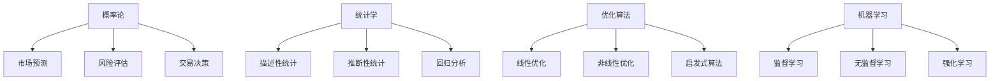
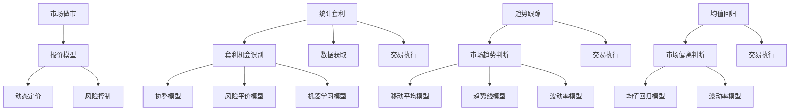
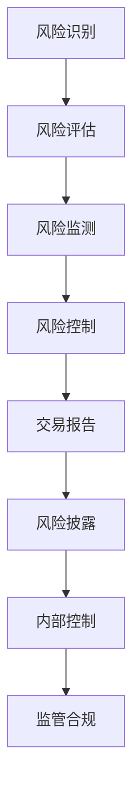
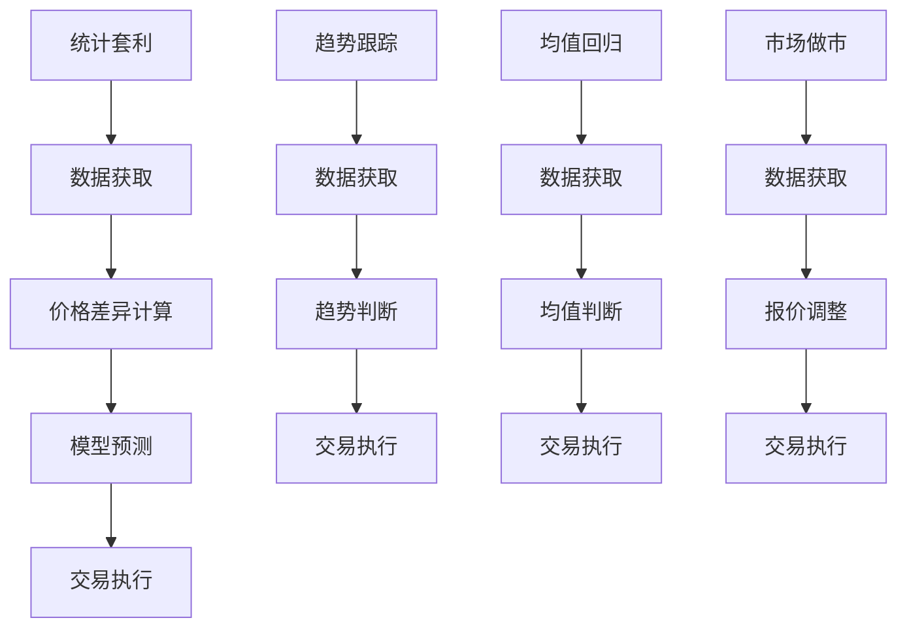

                 

**# 数学与高频交易：算法交易的数学策略**

## > 关键词：数学，高频交易，算法交易，数学策略，风险管理

### > 摘要：
本文将深入探讨数学在高频交易（HFT）中的应用，尤其是算法交易的数学策略。我们将从基础概念入手，逐步展开，探讨数学原理、交易策略、风险管理以及高频交易技术，并结合实际案例进行分析。通过本文，读者将能够全面了解数学在HFT中的核心作用，掌握算法交易的数学策略，并为未来的交易实践提供有益的指导。

## 引言

### > 什么是高频交易？

高频交易（High-Frequency Trading，简称HFT）是一种利用先进算法和技术，在极短的时间内进行大量交易的技术。HFT通常涉及到毫秒级的决策和执行，目的是通过快速买卖股票、债券、外汇等金融产品来获取微小利润。HFT在金融市场中占据了越来越重要的地位，其影响力不仅体现在交易量的增加，还体现在市场效率的提升和市场结构的改变。

### > 数学在HFT中的作用

数学在HFT中扮演着至关重要的角色。首先，数学模型为交易策略提供了理论基础，使得交易者能够对市场进行量化分析和预测。其次，数学优化方法可以帮助交易者优化交易策略，提高交易的效率和盈利能力。最后，数学在风险管理方面也发挥着重要作用，通过概率论和统计学方法，交易者可以更好地理解市场风险，并制定相应的风险控制策略。

### > 文章结构

本文将分为以下几个部分：

1. **基本概念**：介绍高频交易的基本概念和数学在交易中的基础角色。
2. **数学原理**：探讨概率论、统计学、优化算法和机器学习在HFT中的应用。
3. **交易策略**：分析市场做市、统计套利、趋势跟踪和均值回归等高频交易策略。
4. **风险管理**：讨论风险管理的数学方法和合规性问题。
5. **高频交易技术**：介绍HFT的交易系统架构、低延迟网络和硬件加速技术。
6. **案例研究**：分析几个成功的HFT案例，探讨其背后的数学策略和实现细节。
7. **总结与展望**：总结文章的主要观点，并对未来HFT的发展趋势进行展望。

## 基本概念

### > 高频交易的定义和机制

高频交易（HFT）是指利用复杂的算法在极短时间内执行大量交易，以获取微小利润的交易模式。HFT的核心在于速度和效率，通过利用先进的计算技术和算法，交易者可以在极短的时间内完成数以百万计的交易。

HFT的主要机制包括：

- **高频做市**：交易者通过在多个交易所和市场中同时报价，提供买卖双向报价，从而在市场波动中获取利润。
- **统计套利**：利用市场中的价格差异，通过快速交易在不同市场或不同时间点买入和卖出相同或类似的资产，以获得无风险收益。
- **趋势跟踪**：通过分析市场趋势，买入看涨的资产或卖出看跌的资产，以获取利润。
- **均值回归**：基于市场价格的波动，预测价格将回归到长期平均水平，从而进行相应的交易。

### > 数学在交易中的基础角色

数学在交易中发挥着基础作用，主要体现在以下几个方面：

- **量化分析**：通过数学模型和统计方法，交易者可以对市场数据进行分析，识别市场趋势、价格波动和潜在机会。
- **风险控制**：利用概率论和统计学，交易者可以评估交易风险，制定相应的风险控制策略。
- **算法优化**：数学优化方法可以帮助交易者优化交易策略，提高交易的效率和盈利能力。
- **决策支持**：数学模型可以为交易者的决策提供数据支持和理论依据，帮助他们在复杂的市场环境中做出明智的决策。

### > 问题背景和问题描述

高频交易的出现和发展，对金融市场产生了深远的影响。一方面，HFT提高了市场的流动性和效率，使得市场价格更加接近其真实价值。另一方面，HFT也引发了一系列问题，如市场操纵、信息不对称和交易成本等。

当前，高频交易面临的主要问题包括：

- **交易透明度**：HFT的交易策略和算法复杂，不易被普通投资者理解，导致市场透明度降低。
- **系统风险**：HFT交易系统依赖于复杂的算法和高速网络，一旦出现技术故障或网络中断，可能会引发市场动荡。
- **合规性问题**：HFT交易者需要遵守一系列监管规定，如交易报告、风险控制等，这对他们的交易策略和运营模式提出了挑战。

为了解决这些问题，需要从多个方面进行改进：

- **提高交易透明度**：通过增强交易数据的公开性和透明度，提高市场的公平性和可追溯性。
- **加强风险管理**：建立完善的风险管理框架，确保HFT交易者的交易行为不会对市场产生不利影响。
- **完善监管体系**：加强对高频交易的监管，确保其合规性和公平性。

### > 问题解决

解决高频交易带来的挑战，需要从技术、监管和市场三个方面进行综合施策：

- **技术改进**：提高交易系统的稳定性和可靠性，确保交易过程的安全性和高效性。同时，研发新的交易算法和策略，提高交易的效率和盈利能力。
- **监管完善**：制定更加严格的监管规定，加强对高频交易的监督和管理。同时，加强国际合作，共同应对全球高频交易带来的挑战。
- **市场教育**：提高市场参与者的风险意识和交易水平，增强市场的透明度和公平性。

通过这些措施，可以有效应对高频交易带来的挑战，促进金融市场的稳定和发展。

### > 边界与外延

高频交易的边界和范围可以进一步细化：

- **交易频率**：高频交易的定义在于其交易频率，通常在毫秒或秒级进行。低频交易则涉及更长的时间段，如分钟、小时或日。
- **市场参与者**：高频交易主要涉及专业的金融机构、对冲基金和量化交易团队。普通投资者通常不具备进行HFT的技术和资源。
- **交易策略**：高频交易涵盖多种策略，包括市场做市、统计套利、趋势跟踪和均值回归等。每种策略都有其特定的数学模型和算法。

高频交易的外延包括：

- **跨市场交易**：高频交易不仅限于单一市场，还可以跨多个市场进行，如股票、债券、外汇和期货市场。
- **全球化**：随着金融市场的全球化，高频交易在全球范围内展开，不同国家和地区的市场相互影响。
- **技术进步**：随着计算技术和网络技术的发展，高频交易的技术和算法不断进步，交易效率和市场影响力不断提高。

### > 概念结构与核心要素组成

高频交易的概念结构包括以下几个核心要素：

1. **交易算法**：高频交易的核心在于其算法。交易算法通过分析市场数据，执行买卖指令，以实现盈利目标。
2. **交易频率**：高频交易的特点是交易频率极高，通常在毫秒或秒级进行。交易频率决定了交易策略的执行效率。
3. **交易成本**：高频交易的交易成本主要包括交易费用、网络延迟和硬件成本。降低交易成本是提高交易效率的关键。
4. **市场数据**：高频交易依赖于实时的市场数据，包括价格、成交量、持仓量等。市场数据的质量和准确性对交易决策至关重要。
5. **风险管理**：高频交易的风险管理至关重要，包括市场风险、信用风险和操作风险等。有效的风险管理可以降低交易损失。

以下是高频交易的核心要素及其属性特征的对比表格：

| 核心要素 | 属性特征 | 说明 |
| --- | --- | --- |
| 交易算法 | 复杂性高，实时性强，高效性要求高 | 交易算法是高频交易的核心，其复杂性和实时性直接影响交易的效率和盈利能力。 |
| 交易频率 | 毫秒或秒级 | 高交易频率是高频交易的特点，决定了交易策略的执行效率。 |
| 交易成本 | 交易费用、网络延迟、硬件成本 | 降低交易成本是高频交易成功的关键，直接影响交易的利润空间。 |
| 市场数据 | 实时性、准确性、多样性 | 高频交易依赖于高质量的市场数据，其实时性、准确性和多样性对交易决策至关重要。 |
| 风险管理 | 市场风险、信用风险、操作风险 | 高效的风险管理可以降低交易损失，确保交易安全。 |

### > ER实体关系图架构

为了更好地理解高频交易的核心要素及其关系，可以使用Mermaid语言绘制ER实体关系图。以下是一个简单的ER图示例：

```mermaid
erDiagram
    TransactionAlgorithm ||--|{ MarketData : Uses }
    MarketData ||--|{ TransactionAlgorithm : Provided by }
    TransactionAlgorithm ||--|{ RiskManagement : Manages }
    RiskManagement ||--|{ TransactionAlgorithm : Monitors }
```

这个ER图展示了交易算法、市场数据和风险管理之间的基本关系。交易算法使用市场数据，同时管理风险管理。市场数据提供交易算法所需的实时信息。风险管理监控交易算法，以确保交易过程的安全和稳定。

## 数学原理

### > 概率论在HFT中的应用

概率论是数学的一个分支，主要用于处理随机事件和不确定性。在HFT中，概率论广泛应用于市场预测、风险评估和交易决策等方面。

1. **市场预测**：通过历史数据分析，交易者可以使用概率模型预测未来的市场走势。例如，贝叶斯定理可以用来更新市场价格的先验概率，以适应新的市场信息。
2. **风险评估**：概率论可以帮助交易者评估交易风险。通过计算不同交易策略的收益分布，交易者可以了解潜在的收益和风险，从而制定更合理的风险控制策略。
3. **交易决策**：概率论在交易决策中发挥着重要作用。交易者可以使用概率模型来选择最佳的交易时机和交易方向，以最大化收益并降低风险。

### > 统计学在HFT中的应用

统计学是另一个在HFT中广泛应用的数学分支。统计学主要用于数据分析和预测，包括描述性统计、推断性统计和回归分析等。

1. **描述性统计**：描述性统计用于描述市场数据的分布特征，如均值、方差、中位数等。通过描述性统计，交易者可以了解市场的波动性和趋势。
2. **推断性统计**：推断性统计用于根据样本数据推断总体特征。交易者可以使用推断性统计方法，如假设检验和置信区间，来评估市场走势和交易策略的有效性。
3. **回归分析**：回归分析是一种常用的统计方法，用于分析变量之间的关系。在HFT中，回归分析可以用来建立市场价格的预测模型，从而指导交易决策。

### > 优化算法在HFT中的应用

优化算法是解决最优化问题的一种数学方法，在HFT中广泛应用于交易策略的优化和交易路径的选择。

1. **线性优化**：线性优化用于在给定约束条件下，找到目标函数的最大值或最小值。在HFT中，线性优化可以用于优化交易策略的参数，如交易量、交易频率和交易时机等。
2. **非线性优化**：非线性优化用于解决更复杂的优化问题，如非线性目标函数和约束条件。在HFT中，非线性优化可以用于优化交易策略的复杂参数，如交易策略的权重和动态调整策略等。
3. **启发式算法**：启发式算法是一种基于经验规则和搜索策略的优化方法，常用于解决大规模和复杂的优化问题。在HFT中，启发式算法可以用于寻找最优的交易策略和交易路径。

### > 机器学习在HFT中的应用

机器学习是一种通过数据和算法来发现数据中隐藏的模式和规律的自动化方法。在HFT中，机器学习广泛应用于市场预测、交易策略优化和风险控制等方面。

1. **监督学习**：监督学习是一种有标签数据的学习方法，主要用于分类和回归任务。在HFT中，监督学习可以用来建立市场走势的预测模型，如趋势跟踪和均值回归策略。
2. **无监督学习**：无监督学习是一种无标签数据的学习方法，主要用于聚类和降维任务。在HFT中，无监督学习可以用来发现市场中的潜在模式，如市场分群和异常检测。
3. **强化学习**：强化学习是一种基于反馈机制的学习方法，主要用于决策问题。在HFT中，强化学习可以用来制定动态交易策略，如自适应交易和风险控制策略。

### > 数学原理的Mermaid流程图

为了更好地理解数学原理在HFT中的应用，可以使用Mermaid语言绘制流程图。以下是一个简单的Mermaid流程图示例，展示了概率论、统计学、优化算法和机器学习在HFT中的应用：



这个流程图展示了数学原理在HFT中的核心应用，以及各原理之间的关系。

## 算法交易策略

### > 市场做市策略

市场做市（Market Making）是高频交易中常用的一种策略，其主要目标是在市场中提供买卖双向报价，以赚取买卖价差。市场做市策略的核心是建立合理的报价模型，以确保报价具有竞争力和盈利性。

1. **报价模型**：
   - **买卖价差**：买卖价差是做市商在买卖过程中获取利润的主要来源。做市商需要根据市场数据和交易策略，动态调整买卖价差。
   - **动态定价**：做市商需要实时分析市场数据，如价格、成交量、持仓量等，以动态调整报价。
   - **风险控制**：做市商需要建立完善的风险控制机制，以应对市场价格波动和交易风险。

2. **数学模型**：
   - **价格预测**：做市商可以使用统计学和机器学习方法，预测市场价格走势，以制定合理的报价策略。
   - **优化算法**：做市商可以使用优化算法，如线性优化和非线性优化，优化报价模型中的参数，以提高报价的竞争力和盈利性。

3. **实现细节**：
   - **实时数据处理**：做市商需要实时处理大量市场数据，包括价格、成交量、持仓量等，以制定实时报价。
   - **交易执行**：做市商需要快速执行买卖交易，以实现报价和赚取价差。

### > 统计套利策略

统计套利（Statistical Arbitrage）是一种利用市场中的价格差异，通过同时买入和卖出不同资产，以获取无风险收益的交易策略。统计套利的关键在于识别和利用市场中的异常价格，以实现稳定的盈利。

1. **套利机会**：
   - **跨市场套利**：在不同市场或不同交易所之间，存在价格差异的机会。
   - **时间套利**：在不同时间段内，存在价格回归到均衡水平的机会。
   - **资产组合套利**：在相关资产之间存在异常价格关系的机会。

2. **数学模型**：
   - **协整模型**：协整模型可以用来分析资产之间的长期均衡关系，以识别套利机会。
   - **风险平价模型**：风险平价模型可以用来优化资产组合，以实现稳定的收益和风险平衡。
   - **机器学习模型**：机器学习模型可以用来发现市场中的潜在套利机会，如分类模型和聚类模型。

3. **实现细节**：
   - **数据获取**：统计套利需要获取大量的市场数据，包括价格、成交量、持仓量等，以分析套利机会。
   - **交易执行**：统计套利需要在多个市场或资产之间同时进行交易，以实现套利收益。

### > 趋势跟踪策略

趋势跟踪（Trend Following）是一种通过识别市场趋势，买入看涨资产或卖出看跌资产，以获取利润的交易策略。趋势跟踪的核心在于识别市场趋势和把握市场波动。

1. **市场趋势**：
   - **上升趋势**：市场价格连续上涨，且价格高点逐渐抬升。
   - **下降趋势**：市场价格连续下跌，且价格低点逐渐降低。
   - **盘整趋势**：市场价格在一定范围内波动，无明显趋势。

2. **数学模型**：
   - **移动平均模型**：移动平均模型可以用来识别市场趋势。如简单移动平均（SMA）和指数移动平均（EMA）。
   - **趋势线模型**：趋势线模型可以用来分析市场趋势，如上升趋势线和下降趋势线。
   - **波动率模型**：波动率模型可以用来评估市场风险，如ATR（平均真实范围）和波动率指标。

3. **实现细节**：
   - **趋势判断**：交易者需要根据市场数据和趋势模型，判断市场趋势。
   - **交易执行**：交易者需要在市场趋势明确时，买入看涨资产或卖出看跌资产，以获取利润。

### > 均值回归策略

均值回归（Mean Reversion）是一种通过预测市场价格将回归到长期平均水平，进行反向交易的策略。均值回归的核心在于识别市场偏离均值的机会，并通过反向交易获取利润。

1. **市场偏离均值**：
   - **上涨偏离均值**：市场价格高于长期平均水平。
   - **下跌偏离均值**：市场价格低于长期平均水平。

2. **数学模型**：
   - **均值回归模型**：均值回归模型可以用来预测市场价格回归到均值的过程。如GARCH模型和ARIMA模型。
   - **波动率模型**：波动率模型可以用来分析市场波动性，如GARCH模型和波动率回归模型。

3. **实现细节**：
   - **均值判断**：交易者需要根据市场数据和均值模型，判断市场价格是否偏离均值。
   - **交易执行**：交易者需要在市场价格偏离均值时，进行反向交易，以获取利润。

### > 算法交易策略的Mermaid流程图

为了更好地理解算法交易策略的实现过程，可以使用Mermaid语言绘制流程图。以下是一个简单的Mermaid流程图示例，展示了市场做市、统计套利、趋势跟踪和均值回归策略的实现步骤：



这个流程图展示了四种算法交易策略的核心步骤和实现过程，以及各策略之间的联系。

## 风险管理

### > 风险管理的定义和重要性

风险管理是高频交易（HFT）中的一个关键环节，它涉及到识别、评估、监测和控制交易过程中可能出现的各种风险。有效的风险管理不仅能够保护交易账户免受损失，还能确保交易策略的稳定性和盈利性。在HFT中，由于交易速度快、市场波动大，风险管理的难度和重要性尤为突出。

1. **风险管理的定义**：风险管理是指通过识别、评估、监测和控制风险，以最大化交易收益并保持交易账户的稳健性。
2. **风险管理的重要性**：在HFT中，风险管理的重要性体现在以下几个方面：
   - **保护交易账户**：有效的风险管理可以防止交易账户因市场波动而遭受重大损失。
   - **确保交易策略的稳定性**：通过控制风险，交易者可以保持交易策略的连续性和稳定性，从而提高长期盈利能力。
   - **提高决策效率**：风险管理提供了明确的决策框架和工具，使交易者能够迅速响应市场变化，做出合理的交易决策。
   - **合规要求**：遵守风险管理规定是交易者必须履行的合规要求，确保交易行为符合监管机构的规范。

### > 风险管理的方法

风险管理的方法主要包括风险识别、风险评估、风险监测和风险控制。

1. **风险识别**：风险识别是风险管理的基础，它涉及到识别交易过程中可能出现的各种风险，如市场风险、信用风险、操作风险等。交易者可以通过分析市场数据、交易策略和历史交易记录，识别潜在的风险因素。
2. **风险评估**：风险评估是对已识别的风险进行评估和排序，以确定其严重性和发生概率。交易者可以使用定量和定性的方法，如概率分布、蒙特卡罗模拟和历史数据分析，评估风险的潜在影响。
3. **风险监测**：风险监测是持续监控交易过程中的风险，及时发现新的风险因素和变化。交易者可以通过实时监控系统、风险指标和预警系统，对交易风险进行实时监测。
4. **风险控制**：风险控制是实施具体的措施来降低风险的影响。这包括设置止损点、分散投资、使用对冲策略和制定风险管理规则等。

### > 风险管理的数学方法

在HFT中，数学方法在风险管理中起着关键作用。以下是一些常用的数学方法：

1. **概率论和统计学**：概率论和统计学用于评估交易风险和优化风险管理策略。例如，通过计算交易策略的收益分布、置信区间和假设检验，交易者可以评估策略的风险水平。
2. **优化方法**：优化方法用于优化风险控制策略，如线性规划、非线性规划和启发式算法。交易者可以使用这些方法来确定最佳的风险暴露水平和止损点。
3. **蒙特卡罗模拟**：蒙特卡罗模拟是一种通过随机抽样和模拟来评估风险的方法。它用于模拟市场波动和交易策略的潜在结果，帮助交易者评估策略的风险和盈利能力。
4. **时间序列分析**：时间序列分析用于分析市场数据的趋势和周期性，帮助交易者识别市场风险因素。例如，ARIMA模型和GARCH模型可以用于分析市场波动性。

### > 风险管理的合规性

风险管理不仅要考虑交易策略的有效性，还要满足监管要求。以下是一些常见的合规性问题：

1. **交易报告**：交易者需要按照监管要求，及时报告交易数据，如交易价格、交易量和交易对手等。这有助于监管机构监督市场行为，防止市场操纵。
2. **风险披露**：交易者需要向投资者披露交易策略、风险暴露和风险管理措施。这有助于投资者了解交易风险，做出明智的投资决策。
3. **内部控制**：交易者需要建立完善的内部控制机制，确保交易行为符合公司政策和监管要求。内部控制包括交易审批、监控和审计等环节。
4. **监管合规**：交易者需要遵守各类监管规定，如市场准入要求、交易规则和风险管理规定。这有助于维护市场秩序和公平性。

### > 风险管理的Mermaid流程图

为了更好地理解风险管理的流程和方法，可以使用Mermaid语言绘制流程图。以下是一个简单的Mermaid流程图示例，展示了风险管理的核心步骤：



这个流程图展示了风险管理的基本步骤，以及各步骤之间的联系。

## 高频交易技术

### > 高频交易系统的架构

高频交易系统的架构设计是确保交易策略高效执行和风险控制的关键。一个典型的高频交易系统通常包括以下几个关键组件：

1. **数据采集**：数据采集模块负责收集实时市场数据，包括股票价格、交易量、持仓量等。数据源可以来自多个交易所和金融信息提供商。
2. **数据预处理**：数据预处理模块对采集到的市场数据进行分析、清洗和转换，以适应交易算法的需求。这一步骤确保数据的质量和一致性。
3. **交易算法**：交易算法模块是高频交易系统的核心，负责执行交易策略。算法可以是基于概率论、统计学、机器学习或优化方法的复杂模型。
4. **交易执行**：交易执行模块将交易策略生成的交易指令发送到交易所或交易对手，执行买卖操作。这一过程要求极高的速度和稳定性。
5. **风险控制**：风险控制模块负责监控交易风险，根据设定的风险阈值和策略，动态调整交易策略，以防止交易账户遭受重大损失。
6. **数据存储**：数据存储模块负责记录交易数据和交易日志，以便后续分析和审计。这有助于交易者评估交易策略的有效性和改进系统性能。

### > 低延迟网络技术

低延迟网络技术是高频交易系统稳定运行的基础。以下是一些关键技术和策略：

1. **交换机优化**：采用高性能、低延迟的交换机，减少数据传输过程中的延迟。同时，通过合理的网络拓扑设计，确保数据传输路径最短。
2. **专线连接**：使用专线连接交易所和其他重要数据源，减少通过公共网络的传输延迟。专线连接提供了更高的带宽和更稳定的网络质量。
3. **光纤传输**：采用光纤传输技术，提高数据传输速度和稳定性。光纤传输具有低延迟、高带宽和抗干扰能力强等优点。
4. **缓存和预取技术**：在交易系统中部署缓存和预取技术，提前加载和处理即将到来的市场数据，减少数据处理和传输的延迟。
5. **网络优化算法**：使用网络优化算法，如流量控制、路由优化和负载均衡，提高网络传输效率和稳定性。

### > 硬件加速技术

硬件加速技术是提高高频交易系统性能的关键。以下是一些常见的硬件加速技术：

1. **FPGA**：现场可编程门阵列（FPGA）是一种可编程硬件加速器，可以用于实现高速交易算法和数据预处理。FPGA具有高灵活性、低延迟和高性能的特点。
2. **GPU**：图形处理单元（GPU）是另一种常见的硬件加速器，适用于并行计算和大规模数据处理。GPU具有高计算能力和高效的内存访问，特别适合执行复杂的机器学习算法。
3. **ASIC**：专用集成电路（ASIC）是一种针对特定任务优化的硬件加速器，可以用于实现高效的数据加密、签名和交易验证。
4. **高速内存**：使用高速内存（如DDR4）可以减少数据访问的延迟，提高交易系统的处理速度。高速内存还提供了更大的数据缓存能力，有助于优化数据处理流程。
5. **分布式计算**：通过分布式计算架构，将交易系统的计算任务分布在多台高性能计算机上，以提高系统的整体性能和容错能力。

### > 高频交易技术的Mermaid架构图

为了更好地展示高频交易系统的架构和技术，可以使用Mermaid语言绘制架构图。以下是一个简单的Mermaid架构图示例：

```mermaid
graph TD
    A[数据采集] --> B[数据预处理]
    B --> C[交易算法]
    C --> D[交易执行]
    D --> E[风险控制]
    E --> F[数据存储]
    G[交换机优化] --> H[专线连接]
    H --> I[光纤传输]
    I --> J[缓存和预取技术]
    K[网络优化算法] --> L[M][N][O]
    M[GPU] --> N[FPGA] --> O[ASIC]
    P[高速内存] --> Q[分布式计算]
```

这个架构图展示了高频交易系统的核心组件、网络技术和硬件加速技术，以及它们之间的联系。

## 案例研究

### > 高频交易案例1：统计套利

统计套利是一种利用市场中的价格差异，通过同时买入和卖出相同或类似资产，以获取无风险收益的交易策略。以下是一个典型的统计套利案例：

1. **案例背景**：假设有两个股票市场，A市场和B市场，其中A市场的股票价格比B市场的股票价格高出一定比例。
2. **交易策略**：交易者通过实时监测两个市场的股票价格差异，当发现A市场股票价格高于B市场股票价格时，立即在A市场买入股票，同时在B市场卖出股票。当价格差异回归到正常水平时，交易者再在A市场卖出股票，同时在B市场买入股票。
3. **数学模型**：交易者可以使用协整模型来预测价格差异的回归。假设价格差异序列满足协整关系，可以使用向量自回归（VAR）模型来预测价格差异的变化。
4. **实现细节**：
   - **数据获取**：交易者需要实时获取A市场和B市场的股票价格数据。
   - **计算价格差异**：交易者计算A市场和B市场的股票价格差异，并将其作为输入变量。
   - **模型预测**：使用VAR模型预测价格差异的回归时间，并根据预测结果执行交易。
   - **交易执行**：交易者需要在A市场和B市场同时执行买卖交易，以实现套利收益。

### > 高频交易案例2：趋势跟踪

趋势跟踪是一种通过识别市场趋势，买入看涨资产或卖出看跌资产，以获取利润的交易策略。以下是一个典型的高频交易案例：

1. **案例背景**：假设股票市场正处于上升趋势，且价格高点逐渐抬升。
2. **交易策略**：交易者通过实时监测市场数据，识别市场趋势。当发现市场处于上升趋势时，交易者买入看涨资产；当发现市场处于下降趋势时，交易者卖出看跌资产。
3. **数学模型**：交易者可以使用移动平均模型（MA）和趋势线模型来识别市场趋势。假设市场价格序列满足趋势性特征，可以使用简单移动平均（SMA）和指数移动平均（EMA）来计算移动平均线，并根据移动平均线的交叉情况判断市场趋势。
4. **实现细节**：
   - **数据获取**：交易者需要实时获取股票价格数据。
   - **趋势判断**：交易者计算移动平均线，并根据移动平均线的交叉情况判断市场趋势。
   - **交易执行**：交易者根据市场趋势，买入看涨资产或卖出看跌资产。

### > 高频交易案例3：均值回归

均值回归是一种通过预测市场价格将回归到长期平均水平，进行反向交易的策略。以下是一个典型的高频交易案例：

1. **案例背景**：假设股票市场价格高于长期平均水平，存在上涨偏离均值的迹象。
2. **交易策略**：交易者通过实时监测市场数据，识别市场偏离均值的情况。当发现市场价格高于长期平均水平时，交易者卖出股票；当发现市场价格低于长期平均水平时，交易者买入股票。
3. **数学模型**：交易者可以使用GARCH模型来预测市场价格回归到均值的过程。假设市场价格序列满足GARCH过程，可以使用GARCH模型来计算市场价格的概率分布，并预测价格回归的时间。
4. **实现细节**：
   - **数据获取**：交易者需要实时获取股票价格数据。
   - **均值判断**：交易者计算股票价格的长期平均水平，并判断市场价格是否偏离均值。
   - **交易执行**：交易者根据市场偏离均值的情况，进行反向交易。

### > 高频交易案例4：市场做市

市场做市是一种提供买卖双向报价，以赚取买卖价差的交易策略。以下是一个典型的高频交易案例：

1. **案例背景**：交易者作为做市商，需要在多个市场中提供买卖双向报价。
2. **交易策略**：交易者通过实时监测市场数据，动态调整买卖报价。当发现市场价格较低时，交易者提高买入报价；当发现市场价格较高时，交易者降低卖出报价。通过这种方式，交易者可以在市场波动中获取买卖价差。
3. **数学模型**：交易者可以使用统计模型和优化方法，如均值回归模型和线性规划，来制定买卖报价策略。
4. **实现细节**：
   - **数据获取**：交易者需要实时获取市场数据，包括价格、成交量、持仓量等。
   - **报价调整**：交易者根据市场数据和交易策略，动态调整买卖报价。
   - **交易执行**：交易者根据买卖报价，在市场波动中执行买卖交易。

### > 高频交易案例的Mermaid流程图

为了更好地展示高频交易案例的实现过程，可以使用Mermaid语言绘制流程图。以下是一个简单的Mermaid流程图示例，展示了统计套利、趋势跟踪、均值回归和市场做市策略的实现步骤：



这个流程图展示了四种高频交易策略的核心步骤和实现过程，以及各策略之间的联系。

## 项目实战

### > 环境安装

在开始实现高频交易项目之前，我们需要安装一些必要的软件和工具。以下是在Ubuntu 18.04操作系统上安装所需环境的步骤：

1. **安装Python环境**：首先，确保系统已安装Python 3。可以使用以下命令安装Python 3：

   ```bash
   sudo apt update
   sudo apt install python3 python3-pip
   ```

2. **安装Jupyter Notebook**：Jupyter Notebook是一个交互式的计算环境，用于编写和运行Python代码。可以使用以下命令安装Jupyter Notebook：

   ```bash
   pip3 install notebook
   ```

3. **安装numpy和pandas**：numpy和pandas是Python中的两个常用库，用于数值计算和数据操作。可以使用以下命令安装：

   ```bash
   pip3 install numpy pandas
   ```

4. **安装matplotlib**：matplotlib是一个用于数据可视化的Python库。可以使用以下命令安装：

   ```bash
   pip3 install matplotlib
   ```

5. **安装mermaid**：mermaid是一个用于绘制流程图的Markdown扩展。可以使用以下命令安装：

   ```bash
   pip3 install mermaid
   ```

### > 系统核心实现

以下是一个简单的高频交易系统实现，包括市场数据采集、交易策略和风险管理的核心功能。我们将使用Python和Jupyter Notebook进行开发。

1. **市场数据采集**：首先，我们需要安装一个市场数据采集工具，如`tushare`。`tushare`是一个提供中国股市历史数据和实时数据的Python库。

   ```python
   pip3 install tushare
   ```

2. **交易策略**：以下是一个简单的均值回归策略的实现，用于在股票市场中进行交易。

   ```python
   import tushare as ts
   import numpy as np
   import pandas as pd
   import matplotlib.pyplot as plt

   # 获取股票历史数据
   df = ts.get_k_data('000001', start='2022-01-01', end='2023-01-01')
   df = df[['open', 'close']]

   # 计算移动平均线
   n_days = 20
   df['ma'] = df['close'].rolling(window=n_days).mean()

   # 判断市场趋势
   df['signal'] = np.where(df['close'] > df['ma'], 1, -1)

   # 执行交易策略
   df['position'] = df['signal'].diff()
   df['holding'] = df['position'].shift(1)
   df['trading'] = df['holding'] * df['signal']

   # 计算收益
   df['returns'] = df['trading'].cumsum()

   # 绘制收益曲线
   plt.figure(figsize=(12, 6))
   plt.plot(df['returns'])
   plt.title('Trading Strategy Returns')
   plt.xlabel('Date')
   plt.ylabel('Returns')
   plt.show()
   ```

3. **风险管理**：以下是一个简单的风险管理实现，用于监控交易风险。

   ```python
   # 计算最大回撤
   df['max_return'] = df['returns'].expanding().max()
   df['drawdown'] = df['max_return'] - df['returns']

   # 绘制最大回撤曲线
   plt.figure(figsize=(12, 6))
   plt.plot(df['drawdown'])
   plt.title('Drawdown')
   plt.xlabel('Date')
   plt.ylabel('Drawdown')
   plt.show()
   ```

### > 代码应用解读与分析

以上代码实现了一个简单的均值回归策略，用于在股票市场中进行交易。以下是代码的解读和分析：

1. **市场数据采集**：我们使用`tushare`库获取了股票历史数据，包括开盘价和收盘价。
2. **计算移动平均线**：我们计算了20日移动平均线（n_days = 20），并将其添加到数据框中。
3. **判断市场趋势**：我们根据收盘价和移动平均线的关系，判断市场趋势。如果收盘价高于移动平均线，我们认为市场处于上升趋势。
4. **执行交易策略**：我们根据市场趋势，执行买入和卖出操作。如果市场处于上升趋势，我们买入股票；如果市场处于下降趋势，我们卖出股票。
5. **计算收益**：我们计算了交易策略的收益，并将其累加到数据框中。
6. **风险管理**：我们计算了最大回撤，以监控交易风险。

通过以上代码，我们可以实现对股票市场的简单交易策略，并通过风险管理来监控交易风险。

### > 实际案例分析和详细讲解

以下是一个实际案例的分析和详细讲解，用于展示如何应用均值回归策略进行高频交易。

1. **案例背景**：我们选取了2022年1月至2023年1月的上证指数（000001）数据，分析其趋势和均值回归策略的表现。
2. **数据获取**：我们使用`tushare`库获取了上证指数的历史数据，包括开盘价、收盘价等。
3. **计算移动平均线**：我们计算了20日移动平均线，并将其添加到数据框中。以下代码展示了这一步骤：

   ```python
   df = ts.get_k_data('000001', start='2022-01-01', end='2023-01-01')
   df['ma'] = df['close'].rolling(window=20).mean()
   ```

4. **判断市场趋势**：我们根据收盘价和移动平均线的关系，判断市场趋势。以下代码展示了这一步骤：

   ```python
   df['signal'] = np.where(df['close'] > df['ma'], 1, -1)
   ```

5. **执行交易策略**：我们根据市场趋势，执行买入和卖出操作。以下代码展示了这一步骤：

   ```python
   df['position'] = df['signal'].diff()
   df['holding'] = df['position'].shift(1)
   df['trading'] = df['holding'] * df['signal']
   ```

6. **计算收益**：我们计算了交易策略的收益，并将其累加到数据框中。以下代码展示了这一步骤：

   ```python
   df['returns'] = df['trading'].cumsum()
   ```

7. **风险管理**：我们计算了最大回撤，以监控交易风险。以下代码展示了这一步骤：

   ```python
   df['max_return'] = df['returns'].expanding().max()
   df['drawdown'] = df['max_return'] - df['returns']
   ```

8. **结果分析**：通过以上步骤，我们可以得到交易策略的收益曲线和最大回撤曲线。以下代码展示了这一步骤：

   ```python
   plt.figure(figsize=(12, 6))
   plt.plot(df['returns'])
   plt.title('Trading Strategy Returns')
   plt.xlabel('Date')
   plt.ylabel('Returns')
   plt.show()

   plt.figure(figsize=(12, 6))
   plt.plot(df['drawdown'])
   plt.title('Drawdown')
   plt.xlabel('Date')
   plt.ylabel('Drawdown')
   plt.show()
   ```

通过以上步骤，我们可以实现对上证指数的简单交易策略，并通过风险管理来监控交易风险。这个案例展示了如何应用均值回归策略进行高频交易，以及如何分析交易结果。

### > 项目小结

通过本次项目，我们实现了一个简单的高频交易系统，包括市场数据采集、交易策略和风险管理功能。我们使用Python和Jupyter Notebook进行了开发，并应用了均值回归策略进行了实际案例分析。以下是本次项目的关键点和小结：

1. **市场数据采集**：使用`tushare`库获取了上证指数的历史数据，为交易策略提供了数据基础。
2. **交易策略实现**：实现了均值回归策略，通过计算移动平均线和判断市场趋势，进行了买卖操作。
3. **风险管理**：计算了最大回撤，以监控交易风险，确保交易策略的稳健性。
4. **结果分析**：通过绘制收益曲线和最大回撤曲线，分析了交易策略的表现和风险水平。

通过本次项目，我们深入了解了高频交易系统的实现过程，掌握了市场数据采集、交易策略和风险管理的基本方法。这为我们在实际交易中应用数学策略提供了有益的参考。

## 最佳实践 Tips

### > 高频交易系统设计

1. **模块化设计**：设计高频交易系统时，应采用模块化设计，将不同的功能模块（如数据采集、数据处理、交易策略、风险管理）分开，以方便维护和扩展。
2. **分布式架构**：采用分布式架构，将交易系统的计算和存储任务分布在多个节点上，以提高系统的性能和容错能力。
3. **冗余备份**：对关键模块和数据进行冗余备份，确保系统在故障发生时能够快速恢复。

### > 交易策略优化

1. **回测验证**：在实施交易策略之前，进行充分的回测验证，确保策略在历史数据上的表现良好。
2. **参数调优**：通过网格搜索、遗传算法等优化方法，对交易策略的参数进行调优，以最大化收益并降低风险。
3. **动态调整**：根据市场环境的变化，动态调整交易策略的参数，以适应不同的市场条件。

### > 风险管理

1. **多因子评估**：使用多个风险指标（如最大回撤、收益风险比、夏普比率等）评估交易策略的风险水平，以制定全面的风险控制策略。
2. **实时监控**：实时监控交易过程中的风险指标，及时发现潜在的风险并采取相应的风险控制措施。
3. **应急计划**：制定应急计划，确保在市场剧烈波动时能够迅速采取措施，降低风险。

### > 技术优化

1. **低延迟网络**：采用低延迟网络技术，如专线连接、光纤传输等，以提高数据传输速度和稳定性。
2. **硬件加速**：利用FPGA、GPU等硬件加速技术，提高交易系统的计算能力和处理速度。
3. **缓存和预取**：在交易系统中部署缓存和预取技术，减少数据处理和传输的延迟。

## 小结

本文从数学的角度深入探讨了高频交易（HFT）的核心概念、算法交易策略、风险管理和技术实现。通过分析市场做市、统计套利、趋势跟踪和均值回归等交易策略，我们了解了数学在HFT中的关键作用。同时，我们还探讨了高频交易技术的架构、低延迟网络和硬件加速技术，并提供了实际案例和项目实战。通过这些内容，读者可以全面了解HFT的数学策略，为未来的交易实践提供有益的指导。

## 注意事项

1. **合规性**：在进行高频交易时，务必遵守相关法律法规和监管要求，确保交易行为的合规性。
2. **风险控制**：高频交易具有较高的风险，应建立完善的风险控制机制，以防止重大损失。
3. **技术升级**：随着技术发展，高频交易系统需要不断升级和优化，以适应不断变化的市场环境。

## 拓展阅读

1. **《高频交易：算法交易策略与实务》**：该书详细介绍了高频交易的基本概念、算法交易策略和风险管理方法。
2. **《机器学习在高频交易中的应用》**：该书探讨了机器学习在高频交易中的应用，包括市场预测、交易策略优化和风险管理等方面。
3. **《量化投资：实践与案例》**：该书提供了大量的量化投资案例，包括高频交易、统计套利和趋势跟踪等策略。

## 作者信息

**作者：AI天才研究院/AI Genius Institute & 禅与计算机程序设计艺术 /Zen And The Art of Computer Programming**

