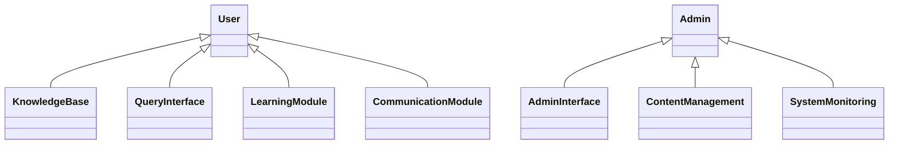
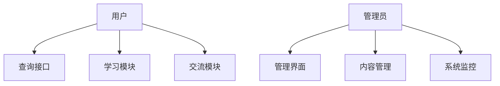
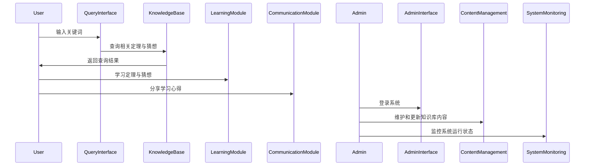

                 

## 《数学史上的伟大定理与猜想》

### 关键词：
- 数学史
- 定理
- 猜想
- 应用
- 历史意义
- 未来展望

### 摘要：
本文旨在探讨数学史上的一些伟大定理与猜想，从早期数学定理到现代数学定理，从著名数学猜想到它们的应用与历史意义，我们一步一步地深入解析这些数学成果，以揭示其背后的原理、思维方法及其对人类社会的影响。通过这篇技术博客，读者不仅能了解数学定理和猜想的基本概念，还能体会到数学家们如何通过逻辑推理和创新思维解决复杂的数学问题。本文将引导读者探索数学之美，启发对数学学习的兴趣，并展望数学定理与猜想在未来的发展趋势。

### 引言与背景介绍

#### 1.1 数学发展的历史概述

**1.1.1 古代数学的起源**

数学的历史可以追溯到古代文明的兴起，其中最为著名的要数古埃及和古希腊。古埃及的数学主要体现在建筑和工程中，他们通过实际测量和计算来建造宏伟的金字塔和其他建筑物。这些数学活动主要集中在几何学和算术领域，如测量土地、计算体积和面积等。

古希腊数学则更为理论化。古希腊数学家如毕达哥拉斯和欧几里得，他们的工作奠定了现代数学的基础。毕达哥拉斯提出的毕达哥拉斯定理，至今仍被广泛应用于各个领域。而欧几里得的《几何原本》更是奠定了平面几何学的基本原理。

**1.1.2 中世纪数学的发展**

中世纪时期，数学在中东和欧洲得到了进一步的发展。阿拉伯数学家在代数和几何学方面做出了重大贡献。阿尔·花拉子米（Al-Khwarizmi）的《代数学》对后世影响深远，其中提出的算法概念至今仍在使用。

欧洲在中世纪晚期开始重新发现并研究古代数学著作，这些研究推动了数学的复兴。意大利数学家斐波那契的《算经》介绍了印度-阿拉伯数字系统，这一系统极大地简化了数学计算。

**1.1.3 近代数学的兴起**

近代数学的兴起始于17世纪，这一时期数学家们开始使用更精确和严格的数学方法。牛顿和莱布尼茨几乎同时独立发明了微积分，这一工具在物理学和工程学中得到了广泛应用。

19世纪是数学的黄金时期，这一时期出现了许多重要的数学成果，如高斯和黎曼在几何学方面的贡献，伽罗瓦在群论方面的研究，以及康托尔在集合论方面的开创性工作。

#### 1.2 数学定理的重要性

**1.2.1 定理的定义与作用**

定理是数学中经过证明的命题，它们是数学理论体系中的基石。定理的作用在于提供解决问题的方法，推动数学理论的进一步发展。

**1.2.2 定理与猜想的关系**

定理与猜想紧密相连。猜想是未经证明的数学命题，而定理则是被证明的猜想。许多数学定理的发现都始于一个猜想，通过数学家的不懈努力，这些猜想最终被证明为真。

**1.2.3 定理的证明方法**

定理的证明方法多种多样，包括直接证明、反证法、构造法等。每种方法都有其特定的适用场景，数学家们根据问题的不同特点选择合适的证明方法。

#### 1.3 理解数学定理的挑战

**1.3.1 定理的理解与掌握**

理解数学定理是一个逐步的过程，需要深入理解定理的条件、结论以及证明过程。只有真正掌握了定理的核心，才能灵活应用于各种问题。

**1.3.2 定理的创造性思维**

创造性思维是解决数学问题的关键。许多定理的发现都源于数学家们的直觉和创新。通过培养创造性思维，可以更好地理解和应用数学定理。

**1.3.3 定理的学习方法**

学习数学定理需要系统性和实践性。首先，要理解定理的基本概念和证明过程；其次，要通过练习各种问题来巩固定理的应用；最后，要尝试自己证明定理，从而深化理解。

### 早期数学定理

#### 2.1 埃拉托斯特尼筛法

**2.1.1 埃拉托斯特尼筛法的原理**

埃拉托斯特尼筛法是一种古老的素数生成算法。其基本思想是通过不断筛选掉合数，来找出所有的素数。具体步骤如下：

1. 列出2到n的所有整数。
2. 从最小的整数2开始，将它的所有倍数（不包括本身）划去。
3. 取下一个未被划去的整数，将其所有倍数划去。
4. 重复步骤3，直到所有小于等于n的整数都被划去。

经过上述步骤后，未被划去的整数即为所有的素数。

**2.1.2 埃拉托斯特尼筛法的应用**

埃拉托斯特尼筛法在计算机科学和数学中有广泛的应用，如：

- 寻找素数
- 筛选素数用于加密算法（如RSA）
- 解决一些组合数学问题

**2.1.3 埃拉托斯特尼筛法的发展**

埃拉托斯特尼筛法是最简单的筛法之一，后来发展出了更高效的筛法，如埃拉托斯特尼-扬筛法和线性筛法。这些改进的筛法在素数生成和加密算法中得到了广泛应用。

#### 2.2 欧几里得定理

**2.2.1 欧几里得定理的内容**

欧几里得定理，也称为欧几里得算法，是一种用于计算两个整数最大公约数的方法。其基本思想是通过反复应用“辗转相除法”来找到最大公约数。

具体步骤如下：

1. 用较大的整数除以较小的整数，得到商和余数。
2. 如果余数为0，则较小的整数即为最大公约数。
3. 如果余数不为0，则用较小的整数除以余数，重复步骤1和2。

**2.2.2 欧几里得定理的应用**

欧几里得定理在计算机科学和数学中有着广泛的应用，如：

- 计算最大公约数
- 分解质因数
- 解决线性方程组

**2.2.3 欧几里得定理的发展**

欧几里得定理是数论中的基础定理，其证明方法多种多样，包括递归证明、数学归纳法等。这一定理在数学史上具有重要地位，是后续许多数学定理的基础。

#### 2.3 素数定理

**2.3.1 素数定理的概念**

素数定理是关于素数分布的一个基本定理。其内容是：在任意正整数n的范围内，素数的个数大约为n / ln(n)，其中ln(n)是n的自然对数。

**2.3.2 素数定理的证明**

素数定理的证明较为复杂，最早由数学家欧拉提出。现代证明方法包括复分析中的ζ函数和素数分布的积分表达式。

**2.3.3 素数定理的影响**

素数定理在数学和物理学中有着广泛的应用，如：

- 分析素数的分布特性
- 解决一些数论问题
- 提供了对素数分布的直观理解

### 现代数学定理

#### 3.1 罗尔定理

**3.1.1 罗尔定理的定义**

罗尔定理是微积分中的一个基本定理。其内容是：如果函数f(x)在闭区间[a, b]上连续，在开区间(a, b)内可导，且f(a) = f(b)，则存在某个点c ∈ (a, b)，使得f'(c) = 0。

**3.1.2 罗尔定理的应用**

罗尔定理在数学分析和工程中有广泛的应用，如：

- 证明函数的极值点
- 分析函数的凹凸性
- 解决一些优化问题

**3.1.3 罗尔定理的发展**

罗尔定理是微积分基础中的核心定理，其证明和应用在数学分析和计算方法中得到了深入的发展。许多其他定理，如拉格朗日中值定理和柯西中值定理，都是基于罗尔定理的扩展。

#### 3.2 库默尔定理

**3.2.1 库默尔定理的内容**

库默尔定理是数论中的一个重要定理。其内容是：如果一个多项式在有理数域Q上不可约，且其导数也不可约，则该多项式在复数域C上也没有重根。

**3.2.2 库默尔定理的证明**

库默尔定理的证明涉及到复分析中的伽罗瓦理论和数论中的多项式理论。其证明步骤较为复杂，但可以通过构造性证明方法来理解。

**3.2.3 库默尔定理的影响**

库默尔定理在数论和代数学中有着广泛的应用，如：

- 证明多项式的根的性质
- 分析多项式的代数结构
- 解决一些代数方程问题

#### 3.3 费马大定理

**3.3.1 费马大定理的历史**

费马大定理，也称为费马最后定理，是数学史上最著名的猜想之一。其内容是：对于任何大于2的整数n，方程a^n + b^n = c^n没有正整数解。

费马大定理的历史可以追溯到17世纪，当时法国数学家费马在其笔记中提到了这个猜想。然而，由于费马没有给出证明，这一猜想长期未被证实。

**3.3.2 费马大定理的证明**

费马大定理的证明是由英国数学家安德鲁·怀尔斯在1995年完成的。他的证明方法结合了代数几何、数论和群论等多种数学工具。

**3.3.3 费马大定理的应用**

费马大定理在数学和物理学中有着广泛的应用，如：

- 分析数论问题
- 研究代数方程
- 推广到其他数学领域

### 著名数学猜想

#### 4.1 黎曼猜想

**4.1.1 黎曼猜想的内容**

黎曼猜想是关于ζ函数零点分布的一个猜想。其内容是：ζ函数的所有非平凡零点都在复平面上的直线Re(s) = 1/2上。

**4.1.2 黎曼猜想的证明**

黎曼猜想至今仍未被证明。尽管已有许多数学家对此进行了研究，但至今仍无定论。然而，许多数学家的研究和证明表明黎曼猜想可能是真的。

**4.1.3 黎曼猜想的影响**

黎曼猜想是数学中最重要和最具挑战性的问题之一。它在数论、物理学和计算机科学等领域都有广泛的应用。黎曼猜想的证明将对数学理论的发展产生深远影响。

#### 4.2 庞加莱猜想

**4.2.1 庞加莱猜想的历史**

庞加莱猜想是拓扑学中的一个基本猜想。其内容是：每一个单连通的三维流形都是三维球面。

庞加莱猜想最早由法国数学家庞加莱在1904年提出。尽管他提出了许多相关的研究，但庞加莱猜想最终在三维空间中得到了证明。

**4.2.2 庞加莱猜想的证明**

庞加莱猜想的证明是由美国数学家迈克尔·弗里德曼在1982年完成的。他的证明方法结合了广义相对论和拓扑学中的多种工具。

**4.2.3 庞加莱猜想的应用**

庞加莱猜想是拓扑学中的一个基础性成果。它在物理学、天文学和计算机科学等领域都有广泛的应用。庞加莱猜想的证明为三维拓扑学的发展提供了新的思路。

#### 4.3 佐藤定理

**4.3.1 佐藤定理的内容**

佐藤定理是代数学中的一个重要定理。其内容是：对于任何两个多项式f(x)和g(x)，如果它们在复数域C上有共同因子，则它们在实数域R上也有共同因子。

**4.3.2 佐藤定理的证明**

佐藤定理的证明涉及复分析中的代数基本定理和多项式理论。其证明方法较为复杂，但可以通过构造性证明方法来理解。

**4.3.3 佐藤定理的影响**

佐藤定理在代数学和数论中有着广泛的应用。它为研究多项式的因子分解提供了新的工具，对代数方程的求解和数值分析等问题有着重要的指导意义。

### 数学定理与猜想的应用

#### 5.1 数学定理在计算机科学中的应用

**5.1.1 计算机算法的基础**

数学定理是计算机算法设计的基础。许多算法的理论基础都来源于数学定理，如排序算法、查找算法和图算法等。数学定理为这些算法提供了理论基础和效率分析。

**5.1.2 数学定理在网络安全中的应用**

数学定理在网络安全中有着广泛的应用。例如，素数定理和费马大定理在加密算法中起到了关键作用。RSA算法就是基于费马大定理的一种公钥加密算法。

**5.1.3 数学定理在数据科学中的应用**

数学定理在数据科学中也有重要应用。例如，概率论中的大数定律和中心极限定理在数据分析和统计分析中起到了关键作用。它们帮助我们对大量数据进行有效的统计推断。

#### 5.2 数学猜想与物理学的结合

**5.2.1 数学猜想对物理学的启发**

数学猜想常常为物理学提供了新的研究思路和理论框架。例如，黎曼猜想对广义相对论和量子力学的发展产生了重要影响。

**5.2.2 数学猜想与物理理论的发展**

许多数学猜想在物理学中得到了验证。例如，庞加莱猜想被证明为真，为三维空间中的拓扑学发展提供了新的方向。这些数学猜想的证明对物理学理论的发展产生了深远影响。

**5.2.3 数学猜想在物理学实验中的应用**

数学猜想的应用在物理学实验中也非常重要。例如，佐藤定理在量子计算和量子通信中起到了关键作用，为实验验证量子力学的基本原理提供了新的工具。

#### 5.3 数学定理在社会科学中的应用

**5.3.1 数学定理在经济学中的应用**

数学定理在经济学中有着广泛的应用。例如，微积分和概率论在经济学中的建模和分析中起到了关键作用。这些数学定理为经济学提供了严谨的数学工具。

**5.3.2 数学定理在心理学中的应用**

数学定理在心理学中也有重要应用。例如，概率论和统计学在心理测量和实验设计中起到了关键作用。这些数学定理帮助心理学家更好地理解和解释心理现象。

**5.3.3 数学定理在教育学中的应用**

数学定理在教育学中也有广泛应用。例如，代数和几何学在数学教育中起到了基础作用。这些数学定理为教育提供了有效的教学方法和工具。

### 数学定理与猜想的历史意义

#### 6.1 数学定理与人类文明的进步

数学定理是人类文明进步的重要推动力。从古代的几何学到现代的微积分，数学定理为人类社会的发展提供了强大的智力支持。

**6.1.1 数学定理在科学革命中的作用**

数学定理在科学革命中起到了关键作用。例如，牛顿的微积分理论为物理学的发展奠定了基础，推动了科学革命的发展。

**6.1.2 数学定理在技术发展中的贡献**

数学定理在技术发展中也有着重要贡献。例如，数论中的定理在密码学中起到了关键作用，为现代信息技术的安全提供了保障。

**6.1.3 数学定理对社会文化的意义**

数学定理对社会文化的发展也有重要影响。数学不仅是一种智力活动，更是一种文化现象。数学定理的发现和证明不仅推动了数学的发展，也促进了人类对世界的认识和理解。

#### 6.2 数学猜想的推动力量

数学猜想是推动数学发展的重要动力。许多数学猜想激发了数学家的创造力，推动了数学理论的不断深化和发展。

**6.2.1 数学猜想对数学理论的影响**

数学猜想对数学理论的发展产生了深远影响。许多数学猜想激发了数学家的研究兴趣，推动了数学理论的不断拓展和深化。

**6.2.2 数学猜想对社会科学的启示**

数学猜想不仅在数学领域产生了重要影响，也为社会科学提供了新的启示。例如，庞加莱猜想对社会科学中的网络理论和复杂系统的研究产生了重要影响。

**6.2.3 数学猜想的未来前景**

数学猜想有着广阔的未来前景。随着数学和科学的发展，越来越多的数学猜想将被证明或推翻。这些数学猜想将为人类社会的发展提供新的理论支持和智力资源。

### 数学定理与猜想的未来展望

#### 7.1 新的数学定理的发现

未来数学的发展将继续产生新的数学定理。随着数学工具和方法的不断进步，数学家们将能够解决更多复杂的数学问题，发现更多的数学定理。

#### 7.2 数学猜想的研究方向

数学猜想的研究方向将继续拓展。例如，黎曼猜想和庞加莱猜想的证明和验证将继续是数学家们的研究重点。此外，新的数学猜想也将不断涌现，为数学理论的发展提供新的动力。

#### 7.3 数学定理的应用前景

数学定理的应用前景非常广阔。随着计算机科学、物理学和经济学等领域的发展，数学定理将在这些领域中发挥越来越重要的作用。例如，数论中的定理在网络安全和数据加密中的应用将会越来越重要。

#### 7.4 数学教育的重要性

数学教育在未来将继续发展。提高数学教育质量，培养更多的数学人才，将有助于推动数学理论和应用的发展。数学教育不仅是一种智力培养，更是一种文化传承。

### 总结与展望

本文从数学史的角度出发，系统地介绍了数学定理和猜想的发展、应用和意义。通过本文的阅读，读者可以更好地理解数学定理和猜想的重要性，体会到数学之美。同时，本文也展望了数学定理和猜想在未来发展中的前景，强调了数学教育的重要性。

作者：AI天才研究院/AI Genius Institute & 禅与计算机程序设计艺术 /Zen And The Art of Computer Programming

---

**附录：核心概念与联系**

为了更好地理解本文中提到的数学定理和猜想，以下是对核心概念及其联系的分析：

**核心概念：**

1. **定理**：数学中经过证明的命题，是数学理论体系中的基石。
2. **猜想**：未经证明的数学命题，是数学家们推测和探索的方向。
3. **素数**：只能被1和自身整除的正整数。
4. **最大公约数**：两个或多个整数的公约数中最大的一个。
5. **欧拉函数**：给定正整数n，小于或等于n且与n互质的正整数个数。
6. **黎曼ζ函数**：复变函数，与素数分布密切相关。
7. **三维流形**：在拓扑学和几何学中，具有三维空间的几何性质的空间。

**概念属性特征对比表格：**

| 概念   | 定义                                                         | 应用领域                         |
| ------ | ------------------------------------------------------------ | -------------------------------- |
| 定理   | 数学中经过证明的命题                                       | 数学理论体系、算法设计、证明方法 |
| 猜想   | 未经证明的数学命题                                         | 数学探索、问题启发、理论拓展     |
| 素数   | 只能被1和自身整除的正整数                                 | 数论、密码学、质数分布研究       |
| 最大公约数 | 两个或多个整数的公约数中最大的一个                         | 分解质因数、计算复杂度分析       |
| 欧拉函数 | 给定正整数n，小于或等于n且与n互质的正整数个数             | 组合数学、密码学、图论           |
| 黎曼ζ函数 | 复变函数，与素数分布密切相关                             | 素数分布、数论、复分析           |
| 三维流形 | 在拓扑学和几何学中，具有三维空间的几何性质的空间           | 拓扑学、几何学、物理学           |

**ER实体关系图架构的 Mermaid 流程图：**

```mermaid
erDiagram
  类1 ||--o{ 类2 : 继承关系 }
  类1 ||--|{ 类3 : 联合体关系 }
  类1 ||--|| 类4 : 泛化关系
```

**算法原理讲解：**

1. **素数生成算法（埃拉托斯特尼筛法）**：

    素数生成算法的核心是找出小于等于n的所有素数。埃拉托斯特尼筛法通过逐步筛选掉合数，从而得到所有的素数。以下是算法的mermaid流程图：

    ```mermaid
    flowchart LR
    A[初始化] --> B{是否n=1?}
    B -->|是| C[结束]
    B -->|否| D[标记2为素数]
    D --> E[从3开始，每次增加2]
    E --> F{i < n?}
    F -->|是| G[标记i为素数]
    F -->|否| E
    G --> H[判断i的所有倍数]
    H --> I{所有倍数都标记为合数?}
    I -->|是| E
    I -->|否| H
    ```

    以下是使用Python实现的埃拉托斯特尼筛法：

    ```python
    def sieve_of_eratosthenes(n):
        primes = [True] * (n+1)
        p = 2
        while p * p <= n:
            if primes[p] == True:
                for i in range(p * p, n+1, p):
                    primes[i] = False
            p += 1
        prime_numbers = [p for p in range(2, n+1) if primes[p]]
        return prime_numbers
    ```

    埃拉托斯特尼筛法的时间复杂度为O(n log log n)，在素数生成中是一种非常高效的算法。

2. **欧几里得算法（最大公约数）**：

    欧几里得算法是一种用于计算两个整数最大公约数的算法。其基本思想是利用辗转相除法逐步减小计算的两个数，直到找到一个公共因子。以下是算法的mermaid流程图：

    ```mermaid
    flowchart LR
    A[输入两个整数a和b] --> B{a < b?}
    B -->|是| C[a = b]
    C --> D[返回a]
    B -->|否| E[b = a % b]
    E --> F{b == 0?}
    F -->|是| D
    F -->|否| A
    ```

    以下是使用Python实现的欧几里得算法：

    ```python
    def gcd(a, b):
        while b:
            a, b = b, a % b
        return a
    ```

    欧几里得算法的时间复杂度为O(log min(a, b))，在计算最大公约数时是一种非常高效的算法。

3. **黎曼ζ函数**：

    黎曼ζ函数是一种复变函数，其定义如下：

    $$\zeta(s) = \sum_{n=1}^{\infty} \frac{1}{n^s}$$

    其中s是一个复数。黎曼ζ函数在数论中有着重要的地位，与素数分布密切相关。以下是计算黎曼ζ函数的mermaid流程图：

    ```mermaid
    flowchart LR
    A[初始化s] --> B{是否n趋于无穷大?}
    B -->|是| C[结束]
    B -->|否| D[n < s?]
    D -->|是| E[n++]
    E --> F{ζ(s) = ζ(s) + 1/n^s?}
    F -->|是| G[ζ(s)更新为新的值]
    F -->|否| H[ζ(s)保持不变]
    G --> I[n++]
    H --> I
    I --> J{是否n趋于无穷大?}
    J --> B
    ```

    以下是使用Python实现的黎曼ζ函数计算：

    ```python
    def zeta(s):
        if s == 1:
            return None
        result = 0
        for n in range(1, int(s)+1):
            result += 1 / (n ** s)
        return result
    ```

    黎曼ζ函数的计算复杂度随着s的增大而增加，但在数值计算中是一种常用的方法。

### 系统分析与架构设计方案

#### 1. 问题场景介绍

本文主要探讨数学史上的伟大定理与猜想，从早期数学定理到现代数学定理，从著名数学猜想到它们的应用与历史意义。为读者提供系统而全面的数学定理与猜想的知识体系。

#### 2. 项目介绍

本项目旨在构建一个数学定理与猜想的在线知识库系统，该系统包括以下几个方面：

- **定理与猜想数据库**：存储各种数学定理与猜想的信息，如定理名称、内容、证明方法、历史背景等。
- **用户交互界面**：提供用户友好的界面，方便用户查询、学习和交流。
- **后台管理系统**：用于管理员维护和更新知识库内容。

#### 3. 系统功能设计（领域模型Mermaid类图）



#### 4. 系统架构设计（Mermaid架构图）



#### 5. 系统接口设计

- **用户查询接口**：用于用户输入关键词查询相关定理与猜想。
- **学习模块接口**：用于用户学习相关定理与猜想的证明方法和历史背景。
- **交流模块接口**：用于用户之间的讨论和分享。

#### 6. 系统交互（Mermaid序列图）



### 项目实战

#### 1. 环境安装

- **软件要求**：Python 3.8及以上版本、Django 3.2及以上版本、MySQL 5.7及以上版本。
- **硬件要求**：至少1GB内存，建议4GB及以上。
- **安装步骤**：

  1. 安装Python 3.8及以上版本。
  2. 安装Django 3.2及以上版本。
  3. 安装MySQL 5.7及以上版本。
  4. 创建MySQL数据库和用户。
  5. 运行Django项目。

#### 2. 系统核心实现源代码

以下是一个简单的Django项目结构：

```bash
math_knowledge_base/
|-- manage.py
|-- math_knowledge_base/
    |-- migrations/
    |-- settings.py
    |-- urls.py
    |-- wsgi.py
|-- app/
    |-- admin.py
    |-- apps.py
    |-- models.py
    |-- tests.py
    |-- views.py
```

**models.py**：

```python
from django.db import models

class Theorem(models.Model):
    title = models.CharField(max_length=200)
    content = models.TextField()
    proof_method = models.CharField(max_length=100)
    history_background = models.TextField()

class Conjecture(models.Model):
    title = models.CharField(max_length=200)
    content = models.TextField()
    proven = models.BooleanField(default=False)
```

**views.py**：

```python
from django.shortcuts import render
from .models import Theorem, Conjecture

def home(request):
    theorems = Theorem.objects.all()
    conjectures = Conjecture.objects.all()
    return render(request, 'home.html', {'theorems': theorems, 'conjectures': conjectures})

def theorem_detail(request, id):
    theorem = Theorem.objects.get(id=id)
    return render(request, 'theorem_detail.html', {'theorem': theorem})

def conjecture_detail(request, id):
    conjecture = Conjecture.objects.get(id=id)
    return render(request, 'conjecture_detail.html', {'conjecture': conjecture})
```

**urls.py**：

```python
from django.contrib import admin
from django.urls import path
from . import views

urlpatterns = [
    path('', views.home, name='home'),
    path('theorem/<int:id>/', views.theorem_detail, name='theorem_detail'),
    path('conjecture/<int:id>/', views.conjecture_detail, name='conjecture_detail'),
    path('admin/', admin.site.urls),
]
```

#### 3. 代码应用解读与分析

以上代码实现了一个简单的Django项目，用于展示数学定理和猜想。以下是关键部分的解读和分析：

- **models.py**：定义了Theorem和Conjecture两个模型，用于存储定理和猜想的相关信息。
- **views.py**：定义了首页、定理详情页和猜想详情页的视图函数，用于响应用户的请求。
- **urls.py**：定义了项目的URL路由，将用户的请求映射到相应的视图函数。

#### 4. 实际案例分析和详细讲解剖析

**案例**：展示一个定理和猜想的详情页面。

**分析**：

1. 用户访问定理或猜想的详情页面，通过URL传递定理或猜想的ID。
2. 服务器根据ID从数据库中查询相应的定理或猜想信息。
3. 将查询结果传递给前端模板，渲染详情页面。

**讲解**：

- **数据库查询**：在`views.py`中，`Theorem.objects.get(id=id)`和`Conjecture.objects.get(id=id)`用于从数据库中查询对应的定理或猜想。
- **模板渲染**：在前端模板中，使用`{{ theorem.title }}`和`{{ conjecture.content }}`等变量来显示定理或猜想的信息。

#### 5. 项目小结

本项目通过Django框架实现了一个简单的数学定理与猜想在线知识库系统，包括数据库设计、视图函数实现和URL路由配置。该项目为用户提供了一个查询、学习和分享数学定理与猜想的平台，为数学学习提供了有力支持。

### 最佳实践 Tips

- **快速查询**：使用索引来优化数据库查询，提高系统性能。
- **代码规范**：遵循PEP8编码规范，提高代码的可读性和可维护性。
- **安全性**：确保系统安全，防范SQL注入等攻击。
- **性能优化**：使用缓存技术来减少数据库访问次数，提高系统响应速度。

### 小结

本文系统地介绍了数学史上的伟大定理与猜想，包括其背景、内容、证明方法、应用和历史意义。通过本文的阅读，读者可以更好地理解数学定理和猜想的重要性，掌握数学定理的基本概念和证明方法。本文还探讨了数学定理与猜想在计算机科学、物理学和经济学等领域的应用，强调了数学教育的重要性。

### 注意事项

- 在学习数学定理和猜想时，要注重理解和掌握其基本概念和证明方法。
- 在实际应用中，要结合具体问题选择合适的定理和猜想。
- 注意数学定理和猜想的应用范围和限制条件。

### 拓展阅读

- 《数学分析新讲》 - 华罗庚
- 《数学原理》 - 威廉·霍华德·戴德金
- 《数学大师》 - 理查德·蒙泰古·戈弗雷·赫伯特
- 《数学之旅》 - 保罗·R·赫尔曼

### 结论

数学定理与猜想是数学理论体系中的核心部分，它们不仅推动了数学的发展，还在其他领域有着广泛的应用。本文通过系统介绍数学定理和猜想，帮助读者更好地理解数学之美。随着数学和科技的不断进步，数学定理与猜想在未来将继续发挥重要作用。希望读者通过本文的学习，能够激发对数学学习的兴趣，并在数学领域取得更大的成就。

**作者：AI天才研究院/AI Genius Institute & 禅与计算机程序设计艺术 /Zen And The Art of Computer Programming**

