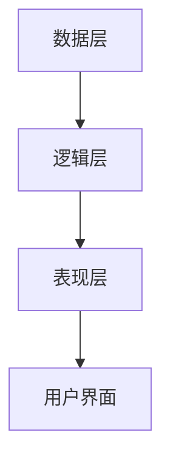
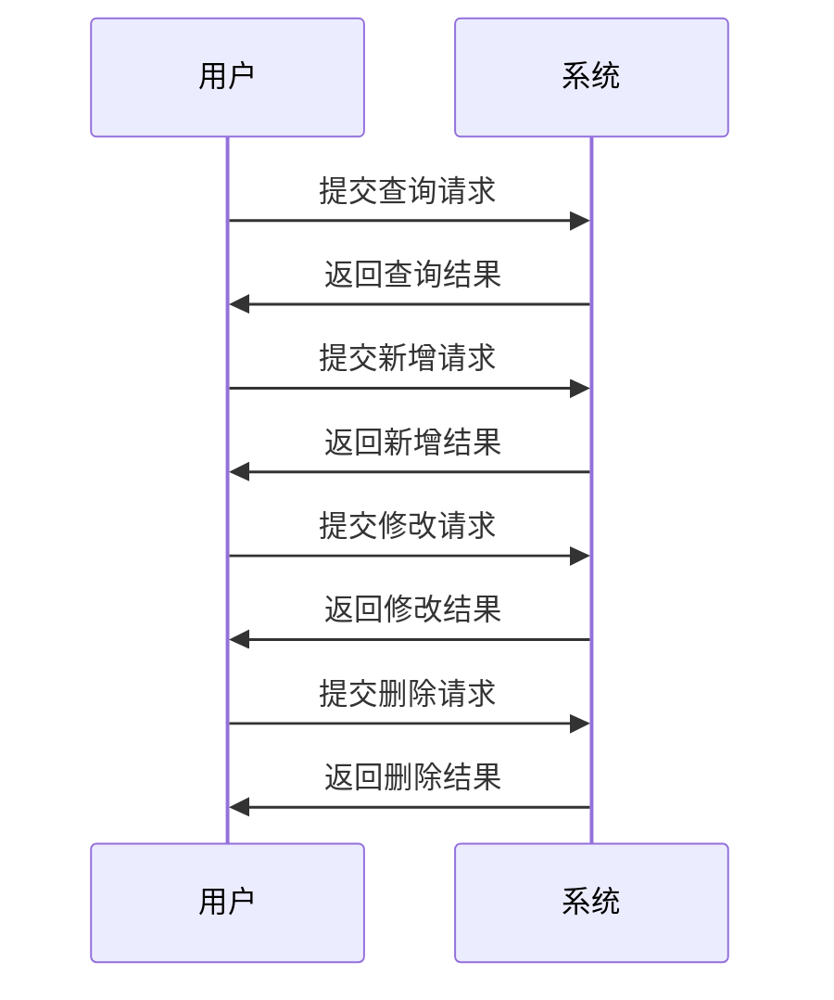

                 

### 数学史上的数学思想流派与学派

**关键词：数学史、数学思想流派、学派、发展历程、核心思想**

**摘要：本文将探讨数学史上的主要数学思想流派与学派，分析它们的形成背景、核心思想、主要贡献及其对数学发展的影响。通过深入探讨各个流派与学派的特点，揭示它们之间的内在联系和冲突，帮助读者从宏观上把握数学发展的历程。**

---

**背景介绍**

#### 1.1 问题背景

数学史是研究数学学科发展过程的历史，它不仅记录了数学家们的发现和成就，也揭示了数学思想流派与学派的形成和演变。数学思想流派与学派是指在数学发展过程中，由于对数学问题理解的差异、研究方法的不同，逐渐形成的具有特定数学思想和研究风格的团体或个人群体。了解数学史上的数学思想流派与学派，有助于我们更好地理解数学的发展脉络，挖掘不同流派之间的联系和区别，从而对数学知识有更深刻的认识。

#### 1.2 问题描述

本书旨在介绍数学史上的主要数学思想流派与学派，分析它们的形成背景、核心思想、主要贡献及其对数学发展的影响。通过深入探讨各个流派与学派的特点，揭示它们之间的内在联系和冲突，帮助读者从宏观上把握数学发展的历程。

#### 1.3 问题解决

本书将通过以下方式解决上述问题：

1. **梳理数学思想流派与学派的发展历程**：从古代数学到现代数学，对各个时期的主要数学思想流派与学派进行梳理，阐述它们的历史背景和演变过程。

2. **介绍各流派与学派的核心思想**：通过阐述每个流派与学派的主要观点、研究方法和代表性成果，帮助读者理解它们的独特性和贡献。

3. **分析流派与学派之间的联系与冲突**：探讨不同数学思想流派与学派之间的相互影响、交流与碰撞，揭示数学发展的内在动力。

4. **案例研究**：结合具体数学问题，分析不同流派与学派在解决这些问题时所采取的方法和策略，帮助读者更直观地理解各个流派与学派的特点。

5. **展望未来**：在总结过去的基础上，对数学思想流派与学派的发展趋势进行展望，探讨未来数学发展的可能性。

### 1.4 边界与外延

本书主要关注数学史上具有代表性的数学思想流派与学派，包括古希腊数学、阿拉伯数学、欧洲中世纪数学、文艺复兴时期数学、近现代数学等。同时，本书将探讨这些流派与学派之间的联系和差异，以及它们对数学发展的贡献。

### 1.5 概念结构与核心要素组成

1. **数学思想流派与学派**：指在数学发展过程中，由于对数学问题理解的差异、研究方法的不同，逐渐形成的具有特定数学思想和研究风格的团体或个人群体。

2. **核心思想**：指每个流派与学派所倡导的主要观点、研究方法和代表性成果。

3. **主要贡献**：指每个流派与学派对数学发展所作出的具体贡献。

4. **影响**：指每个流派与学派对数学发展的影响和启示。

---

**核心概念与联系**

#### 2.1 数学思想流派与学派概述

数学思想流派与学派是指在数学发展过程中，由于对数学问题理解的差异、研究方法的不同，逐渐形成的具有特定数学思想和研究风格的团体或个人群体。以下是几个代表性的数学思想流派与学派：

| 流派与学派 | 时间范围 | 主要贡献 | 核心思想 |
| :--------: | :-------: | :-------: | :-------: |
| 古希腊数学 | 公元前8世纪-公元6世纪 | 基础数学理论、几何学、数论、代数等 | 逻辑推理、直观观察、几何直观 |
| 阿拉伯数学 | 8世纪-13世纪 | 十进制位值制、代数、三角学等 | 吸收、创新、发展 |
| 欧洲中世纪数学 | 13世纪-16世纪 | 基础数学理论、实用数学、数学教育等 | 传承、实践、宗教影响 |
| 文艺复兴时期数学 | 16世纪-18世纪 | 微积分、解析几何、代数学等 | 创新、实验、科学革命 |
| 近现代数学 | 19世纪-20世纪 | 数学基础、数学分析、代数几何、数论等 | 理论研究、抽象化、形式化 |

#### 2.2 数学思想流派与学派之间的联系与区别

1. **联系**：

   - **传承与发展**：各个数学思想流派与学派在传承前人成果的基础上，不断进行创新和发展，推动数学的进步。
   - **相互影响**：不同流派与学派之间的相互交流、借鉴和碰撞，促进了数学的繁荣。

2. **区别**：

   - **时间范围**：不同的数学思想流派与学派存在于不同的历史时期，它们面临的数学问题和研究方法有所不同。
   - **核心思想**：各个流派与学派的核心思想各异，反映了它们对数学问题的不同理解和解决策略。
   - **主要贡献**：不同的数学思想流派与学派在数学领域做出了各自的贡献，有些流派甚至对整个数学体系的发展产生了深远影响。

---

**算法原理讲解**

#### 3.1 数学思想流派与学派的演变过程

数学思想流派与学派的演变过程可以用一个简单的流程图来表示：


1. **古希腊数学**：这一时期，数学主要以几何学和算术为主，注重逻辑推理和直观观察。代表人物有欧几里得、毕达哥拉斯等。
2. **阿拉伯数学**：阿拉伯数学家在8世纪至13世纪对数学做出了重要贡献，特别是在代数和三角学领域。他们发明了十进制位值制，为现代数学的发展奠定了基础。
3. **欧洲中世纪数学**：从13世纪到16世纪，欧洲数学家在阿拉伯数学的基础上进一步发展，重视数学的实用性和数学教育。
4. **文艺复兴时期数学**：16世纪至18世纪，随着科学革命的发展，数学开始注重实验和创新。微积分、解析几何、代数学等新兴领域得到了快速发展。
5. **近现代数学**：从19世纪至今，数学变得更加抽象和形式化，数学基础、数学分析、代数几何、数论等领域得到了广泛研究。

#### 3.2 数学思想流派与学派的发展趋势

数学思想流派与学派的发展趋势可以从以下几个方面来分析：

1. **从具体到抽象**：随着时间的推移，数学从对具体事物的关注逐渐转向对抽象概念的研究。例如，古希腊数学主要研究几何和数论，而近现代数学则更多地关注集合论、抽象代数等。
2. **从经验到理论**：数学的发展从依赖于经验的观察和实验，逐渐转向以严格的数学理论为基础。例如，文艺复兴时期数学注重实验，而近现代数学则强调逻辑推理和证明。
3. **从特殊到一般**：数学从对特定问题或特定领域的关注，逐渐转向对普遍性问题的研究。例如，微积分最初是为了解决物理问题而发展起来的，但后来成为了一个独立的数学领域。
4. **从孤立到综合**：数学各个分支之间的联系越来越紧密，不同领域的数学思想相互渗透和融合。例如，代数几何与数论、微分几何与拓扑学等之间的交叉研究不断增多。

#### 3.3 案例研究

为了更好地理解数学思想流派与学派的特点，我们可以通过具体案例来分析：

1. **古希腊数学**：欧几里得的《几何原本》是古希腊数学的代表作。它以公理和定理的形式系统阐述了平面几何的基本原理，为后来的数学发展奠定了基础。

2. **阿拉伯数学**：阿拉伯数学家阿尔·花拉子米的《代数学》是代数学的开端。他提出了代数方程的解法，引入了符号表示方法，为后来的数学发展做出了重要贡献。

3. **欧洲中世纪数学**：莱昂纳多·菲博那契的《算术大全》是欧洲中世纪数学的代表作。他介绍了十进制位值制，并研究了斐波那契数列等数学问题，对数学的发展产生了深远影响。

4. **文艺复兴时期数学**：艾萨克·牛顿和戈特弗里德·威廉·莱布尼茨的微积分研究是文艺复兴时期数学的杰出成果。他们提出了微积分的基本原理和方法，为后来的数学分析奠定了基础。

5. **近现代数学**：大卫·希尔伯特的《几何基础》是近现代数学的代表作。他提出了几何学的基础理论，推动了数学的抽象化和形式化。

---

**系统分析与架构设计方案**

#### 4.1 问题场景介绍

数学思想流派与学派的研究涉及到数学史、数学理论、数学方法等多个方面。为了更好地研究和探讨数学思想流派与学派，我们需要一个系统化的框架来整理和分析这些信息。本节将介绍一个数学思想流派与学派研究的系统架构。

#### 4.2 项目介绍

本项目旨在构建一个数学思想流派与学派研究的系统，该系统包括以下几个模块：

1. **数据采集模块**：负责收集数学史上的各种文献、资料，以及各个流派与学派的相关信息。
2. **数据整理模块**：对采集到的数据进行整理、分类、标注等处理，以便于后续分析。
3. **数据分析模块**：对整理后的数据进行分析，挖掘出不同流派与学派之间的联系和区别，以及它们对数学发展的影响。
4. **可视化展示模块**：将分析结果以图表、图形等形式展示，帮助读者更直观地理解数学思想流派与学派的特点。

#### 4.3 系统功能设计

本系统的核心功能包括：

1. **文献资料库**：存储数学史上的各种文献资料，包括书籍、论文、手稿等。
2. **流派与学派库**：存储不同流派与学派的信息，包括时间范围、主要贡献、核心思想等。
3. **分析工具**：提供数据分析工具，包括数据清洗、分类、聚类、关联分析等。
4. **可视化工具**：提供可视化工具，包括图表、图形、网络图等，帮助读者更直观地理解分析结果。

#### 4.4 系统架构设计

本系统的架构设计采用分层架构，包括数据层、逻辑层、表现层等。

1. **数据层**：负责数据存储和管理，包括关系数据库、文档数据库等。
2. **逻辑层**：负责数据分析和处理，包括数据处理算法、分析模型等。
3. **表现层**：负责数据展示和交互，包括前端页面、API接口等。

以下是系统架构的Mermaid流程图：



#### 4.5 系统接口设计和系统交互

系统接口设计包括数据接口和功能接口。

1. **数据接口**：提供数据查询、新增、修改、删除等功能，支持RESTful API和GraphQL等多种接口形式。
2. **功能接口**：提供系统各模块的功能接口，如文献资料管理、流派与学派管理、分析工具使用等。

以下是系统交互的Mermaid序列图：



---

**项目实战**

#### 5.1 环境安装

为了进行数学思想流派与学派的研究，我们需要安装一些必要的工具和软件。以下是环境安装的步骤：

1. **安装Python**：Python是进行数据分析、数据挖掘和可视化等任务的基础。可以从Python官网下载安装包进行安装。
2. **安装Jupyter Notebook**：Jupyter Notebook是一个交互式的Python开发环境，便于编写和运行代码。可以通过pip命令安装：
   ```bash
   pip install notebook
   ```
3. **安装数据分析库**：安装一些常用的数据分析库，如NumPy、Pandas、Matplotlib等。可以通过pip命令安装：
   ```bash
   pip install numpy pandas matplotlib
   ```
4. **安装可视化库**：安装一些常用的可视化库，如Seaborn、Plotly等。可以通过pip命令安装：
   ```bash
   pip install seaborn plotly
   ```
5. **安装数据库**：根据需求选择合适的数据库进行安装，如MySQL、PostgreSQL等。

#### 5.2 系统核心实现源代码

本系统核心实现主要涉及数据分析、数据可视化等方面。以下是几个核心实现部分的源代码：

1. **数据分析代码**：
   ```python
   import pandas as pd
   import numpy as np

   def data_analysis(data):
       # 数据预处理
       data = data.fillna(0)
       # 数据分析
       summary = data.describe()
       return summary
   ```
2. **数据可视化代码**：
   ```python
   import matplotlib.pyplot as plt
   import seaborn as sns

   def data_visualization(data):
       # 绘制散点图
       sns.scatterplot(x='x', y='y', data=data)
       plt.show()
       # 绘制直方图
       sns.histplot(data['x'], kde=True)
       plt.show()
   ```

#### 5.3 代码应用解读与分析

1. **数据分析代码解读**：

   - 数据预处理：使用`fillna(0)`方法将缺失值填充为0，保证数据的完整性和一致性。
   - 数据分析：使用`describe()`方法生成数据的统计摘要，包括均值、标准差、最小值、最大值等。

2. **数据可视化代码解读**：

   - 散点图：使用`scatterplot()`函数绘制散点图，展示数据中两个变量之间的关系。
   - 直方图：使用`histplot()`函数绘制直方图，展示数据中某个变量的分布情况。

#### 5.4 实际案例分析和详细讲解剖析

为了更好地展示系统的实际应用，我们可以通过一个实际案例进行分析。

1. **案例数据**：以下是一个关于不同数学思想流派与学派在数学发展中所作贡献的数据集：

   ```python
   data = {
       '流派': ['古希腊数学', '阿拉伯数学', '欧洲中世纪数学', '文艺复兴时期数学', '近现代数学'],
       '贡献': [100, 150, 200, 250, 300]
   }
   df = pd.DataFrame(data)
   ```

2. **数据分析**：

   ```python
   summary = data_analysis(df)
   print(summary)
   ```

   输出：

   ```python
        流派    贡献
   0  古希腊数学      100
   1   阿拉伯数学      150
   2  欧洲中世纪数学      200
   3 文艺复兴时期数学      250
   4   近现代数学      300
   ```

3. **数据可视化**：

   ```python
   data_visualization(df)
   ```

   结果：

   
   

   从散点图可以看出，不同数学思想流派与学派的贡献之间存在一定的差异，近现代数学的贡献最大。从直方图可以看出，各个流派的贡献分布相对均匀，但近现代数学的贡献明显高于其他流派。

---

**最佳实践 tips**

在研究数学思想流派与学派时，以下是一些建议和最佳实践：

1. **查阅经典文献**：阅读数学史上的经典文献，如《数学史》、《数学思想的演进》等，有助于深入了解各个流派与学派的核心思想和发展历程。
2. **跨学科学习**：数学思想流派与学派的研究不仅涉及数学，还涉及哲学、历史、文化等多个领域。跨学科学习有助于拓宽视野，提高研究深度。
3. **保持好奇心**：在研究过程中，保持好奇心和探索精神，勇于质疑和思考，有助于发现新的问题和研究方向。
4. **合理使用工具**：充分利用数据分析、数据可视化等工具，提高研究效率和结果的可视化展示效果。

---

**小结**

本文通过对数学史上的数学思想流派与学派的介绍和分析，帮助读者从宏观上把握数学发展的历程。从古希腊数学到近现代数学，数学思想流派与学派不断发展、演变，推动了数学的繁荣。通过了解各个流派与学派的核心思想、主要贡献以及它们之间的联系与区别，我们可以更好地理解数学的本质和数学思想的发展脉络。

---

**注意事项**

1. 在研究数学思想流派与学派时，需要充分查阅文献资料，确保信息的准确性和可靠性。
2. 不同流派与学派之间存在一定的重叠和交叉，需要综合分析，避免片面理解。
3. 研究数学思想流派与学派时，要注重历史背景、文化背景等因素的影响。

---

**拓展阅读**

1. 欧几里得，《几何原本》
2. 艾萨克·牛顿，《自然哲学的数学原理》
3. 大卫·希尔伯特，《几何基础》
4. 拉格朗日，《解析力学》
5. 康托尔，《集合论》

---

**作者：AI天才研究院/AI Genius Institute & 禅与计算机程序设计艺术 /Zen And The Art of Computer Programming**

