                 

### 数学史上的数学谜题与猜想

关键词：数学谜题、数学猜想、历史起源、经典问题解析、教育意义、未来趋势、实践应用

摘要：数学作为一门探究数量、结构、变化和空间的科学，其发展历程中充满了令人瞩目的谜题和猜想。本文将详细探讨数学史上的著名谜题和猜想，从历史起源、经典问题解析、数学猜想的重要性、教育意义及未来趋势等多个方面进行深入分析，旨在展示数学谜题与猜想在科学进步中的关键作用，并揭示其对现代数学研究和应用的影响。

### 目录大纲

1. **数学谜题的历史起源**

   1.1 数学的起源
   
   1.1.1 古埃及的数学问题
   
   1.1.2 古希腊的数学谜题
   
   1.1.3 古印度的数学成就
   
   1.2 中世纪的数学谜题
   
   1.2.1 欧洲的数学谜题传统
   
   1.2.2 阿拉伯世界的数学贡献
   
   1.2.3 数学术语的演变
   
   1.3 文艺复兴时期的数学突破
   
   1.3.1 代数学的发展
   
   1.3.2 几何学的进步
   
   1.3.3 数学的国际化交流
   
   1.4 本章小结

2. **经典数学谜题解析**

   2.1 简单谜题
   
   2.1.1 1+1=2 的谜题
   
   2.1.2 最小公倍数问题
   
   2.1.3 三角形面积问题
   
   2.2 复杂谜题
   
   2.2.1 四色问题
   
   2.2.2 费马大定理
   
   2.2.3 默比乌斯带
   
   2.3 数学家的挑战
   
   2.3.1 高斯的天才解法
   
   2.3.2 欧拉的多面体公式
   
   2.3.3 拉马努金的猜想
   
   2.4 本章小结

3. **数学猜想与证明**

   3.1 数学猜想的重要性
   
   3.1.1 数学猜想的特点
   
   3.1.2 数学猜想的类型
   
   3.1.3 数学猜想的重要性
   
   3.2 重要的数学猜想
   
   3.2.1 黎曼猜想
   
   3.2.2 阿梅德猜想
   
   3.2.3 素数定理
   
   3.3 数学证明的方法
   
   3.3.1 直觉证明
   
   3.3.2 构造证明
   
   3.3.3 反证法
   
   3.4 本章小结

4. **数学谜题与猜想的教育意义**

   4.1 提高数学兴趣
   
   4.1.1 吸引学生参与数学学习
   
   4.1.2 增强学生的逻辑思维能力
   
   4.1.3 激发学生的创造力和想象力
   
   4.2 培养科学精神
   
   4.2.1 实事求是的研究态度
   
   4.2.2 培养问题解决能力
   
   4.2.3 增进合作与交流
   
   4.3 增强跨学科能力
   
   4.3.1 数学与其他学科的交叉应用
   
   4.3.2 拓展学生的知识视野
   
   4.3.3 培养创新思维
   
   4.4 本章小结

5. **数学谜题与猜想的未来趋势**

   5.1 数学的现代挑战
   
   5.1.1 黎曼猜想的进展
   
   5.1.2 广义费马大定理
   
   5.1.3 P vs NP 问题
   
   5.2 数学的交叉领域应用
   
   5.2.1 数学与物理的结合
   
   5.2.2 数学与计算机科学的融合
   
   5.2.3 数学与生物学的关系
   
   5.3 数学的未来发展方向
   
   5.3.1 新型数学工具的发展
   
   5.3.2 数学的广泛应用前景
   
   5.3.3 数学的创新思维与探索
   
   5.4 本章小结

6. **数学谜题与猜想的实践应用**

   6.1 数学谜题在生活中的应用
   
   6.1.1 财务与经济问题
   
   6.1.2 交通运输优化
   
   6.1.3 建筑与工程设计
   
   6.2 数学猜想在实际中的验证
   
   6.2.1 黎曼猜想

### 第一部分：数学谜题的历史起源

#### 1.1 数学的起源

数学作为人类智慧的结晶，其起源可以追溯到远古时代。数学的历史悠久，源远流长，不同文明和地区都为数学的发展做出了重要贡献。从古埃及的几何学、古希腊的数学理论，到古印度的算术和阿拉伯的代数，数学在各个时期都展现出了独特的魅力。

#### 1.1.1 古埃及的数学问题

古埃及是世界上最早发展数学的文明之一。古埃及的数学主要用于测量土地、建筑和天文观测。其中，著名的《莫斯科数学草纸》被认为是古埃及数学的重要文献之一，其中包含了许多关于算术和几何的问题。例如，草纸中的问题涉及面积计算、体积计算以及比例关系等。

**例子：** 古埃及数学问题之一是关于建造金字塔的。古埃及人如何计算金字塔的体积和面积？通过几何公式，我们可以知道，金字塔的体积计算公式为：
$$V = \frac{1}{3} \times \text{底面积} \times \text{高}$$
对于金字塔来说，底面积是一个正方形的面积，高则是从底面到顶点的距离。通过这些公式，古埃及人可以准确地计算金字塔的体积。

#### 1.1.2 古希腊的数学谜题

古希腊是数学发展的重要时期。古希腊的数学家如欧几里得、阿基米德、毕达哥拉斯等，为数学的发展奠定了坚实的基础。他们提出了许多重要的数学理论和概念，如几何学、代数学、数论等。

**例子：** 毕达哥拉斯定理是古希腊数学的一个重要成果。该定理描述了直角三角形三边之间的关系，即直角三角形的两条直角边的平方和等于斜边的平方。用数学公式表示为：
$$a^2 + b^2 = c^2$$
这一定理在几何学中有着广泛的应用，是许多几何问题求解的基础。

#### 1.1.3 古印度的数学成就

古印度在数学领域也有着重要的贡献。古印度数学家如阿利耶巴塔、婆罗摩笈多等，提出了许多独特的数学理论，如零的概念、十进制计数法等。

**例子：** 零的概念是古印度数学的一大成就。在古印度，零不仅作为一个数字，还作为一个位置符号，极大地简化了数学运算。例如，在计算多位数时，零可以帮助确定每个数字的位置。这一概念在现代数学中仍然被广泛应用。

#### 1.2 中世纪的数学谜题

中世纪时期，欧洲和阿拉伯世界的数学发展迅速。这一时期，数学家们继续探索新的数学理论，并解决了许多复杂的数学问题。

**例子：** 阿拉伯世界的数学家阿尔·花拉子米提出了著名的“丢番图问题”。丢番图问题是指求解整系数线性方程组的问题。阿尔·花拉子米通过代数方法解决了这类问题，为代数学的发展做出了重要贡献。

#### 1.2.1 欧洲的数学谜题传统

中世纪欧洲的数学发展受到了阿拉伯数学的影响。欧洲数学家开始研究阿拉伯世界的数学文献，并在此基础上发展出自己独特的数学理论。

**例子：** 奥卡姆的威廉是一位中世纪英国数学家和逻辑学家。他提出了著名的“奥卡姆剃刀”原则，即在解决问题时，应尽可能简化假设和理论。这一原则在数学研究中有着广泛的应用。

#### 1.2.2 阿拉伯世界的数学贡献

阿拉伯世界在中世纪是科学和数学的中心。阿拉伯数学家如花拉子米、阿尔·巴塔尼等，在数学领域做出了重要贡献，将数学知识传播到了欧洲。

**例子：** 花拉子米的《代数学》是数学史上的重要著作之一。这本书系统地介绍了代数学的基本概念和理论，对后世数学发展产生了深远影响。

#### 1.2.3 数学术语的演变

随着数学的发展，数学术语也在不断演变。不同文明和地区对数学术语的使用和定义有所不同，这反映了数学知识的多样性和国际化。

**例子：** 欧几里得的《几何原本》使用了古希腊的数学术语。而阿拉伯世界的数学家则使用阿拉伯术语来描述数学概念。这些术语在后来的欧洲数学文献中得到了广泛应用。

#### 1.3 文艺复兴时期的数学突破

文艺复兴时期是数学发展的一个重要阶段。这一时期，数学家们开始使用符号和方程来描述数学问题，使得数学研究更加抽象和严密。

**例子：** 韦达是文艺复兴时期的重要数学家，他提出了“韦达定理”，即多项式系数与根的关系。这一定理为代数学的发展奠定了基础。

#### 1.3.1 代数学的发展

代数学在文艺复兴时期得到了快速发展。数学家们开始使用符号和方程来表示数学问题，使得数学研究更加抽象和系统。

**例子：** 笛卡儿的《几何》是代数学的重要著作之一。这本书使用了代数方法来解决几何问题，标志着代数学和几何学的融合。

#### 1.3.2 几何学的进步

文艺复兴时期，几何学也得到了重要发展。数学家们开始研究曲面的性质和方程，推动了几何学的发展。

**例子：** 欧拉是文艺复兴时期著名的数学家，他提出了欧拉公式，即复数的指数形式。这一公式在数学和物理学中有着广泛的应用。

#### 1.3.3 数学的国际化交流

文艺复兴时期，数学开始国际化交流。欧洲数学家开始与阿拉伯世界和印度等地的数学家交流，促进了数学的全球化发展。

**例子：** 意大利数学家塔尔塔利亚与阿拉伯数学家纳西尔丁·图西进行了数学交流，推动了代数学的发展。

#### 1.4 本章小结

数学谜题的历史起源可以追溯到远古时代。古埃及、古希腊、古印度等文明都为数学的发展做出了重要贡献。中世纪的数学谜题和阿拉伯世界的数学成就进一步丰富了数学的内涵。文艺复兴时期，代数学和几何学的突破以及数学的国际交流，使得数学得到了快速发展。这些历史事件和数学家们的贡献，共同构成了数学谜题与猜想的历史背景。

### 第一部分：数学谜题的历史起源

#### 1.1 数学的起源

数学的起源可以追溯到远古时代，当时的数学主要用于解决日常生活中的实际问题，如测量土地、计算时间和计算货物。随着人类社会的发展，数学逐渐从实用中脱离出来，成为一门独立的学科。不同文明和地区都对数学的发展做出了重要贡献。

#### 1.1.1 古埃及的数学问题

古埃及是数学发展的一个重要阶段。古埃及的数学主要用于解决土地测量、建筑工程和天文观测等问题。古埃及人发明了许多数学工具，如算筹和绳子，用于进行数学计算。

**例子：** 古埃及的《莫斯科数学草纸》包含了许多数学问题，其中之一是关于建造金字塔的。古埃及人如何计算金字塔的体积和面积？通过几何公式，我们可以知道，金字塔的体积计算公式为：
$$V = \frac{1}{3} \times \text{底面积} \times \text{高}$$
对于金字塔来说，底面积是一个正方形的面积，高则是从底面到顶点的距离。通过这些公式，古埃及人可以准确地计算金字塔的体积。

#### 1.1.2 古希腊的数学谜题

古希腊是数学发展的另一个重要阶段。古希腊的数学家如欧几里得、阿基米德、毕达哥拉斯等，为数学的发展奠定了坚实的基础。他们提出了许多重要的数学理论和概念，如几何学、代数学、数论等。

**例子：** 毕达哥拉斯定理是古希腊数学的一个重要成果。该定理描述了直角三角形三边之间的关系，即直角三角形的两条直角边的平方和等于斜边的平方。用数学公式表示为：
$$a^2 + b^2 = c^2$$
这一定理在几何学中有着广泛的应用，是许多几何问题求解的基础。

#### 1.1.3 古印度的数学成就

古印度在数学领域也有着重要的贡献。古印度数学家如阿利耶巴塔、婆罗摩笈多等，提出了许多独特的数学理论，如零的概念、十进制计数法等。

**例子：** 零的概念是古印度数学的一大成就。在古印度，零不仅作为一个数字，还作为一个位置符号，极大地简化了数学运算。例如，在计算多位数时，零可以帮助确定每个数字的位置。这一概念在现代数学中仍然被广泛应用。

#### 1.2 中世纪的数学谜题

中世纪时期，欧洲和阿拉伯世界的数学发展迅速。这一时期，数学家们继续探索新的数学理论，并解决了许多复杂的数学问题。

**例子：** 阿拉伯世界的数学家阿尔·花拉子米提出了著名的“丢番图问题”。丢番图问题是指求解整系数线性方程组的问题。阿尔·花拉子米通过代数方法解决了这类问题，为代数学的发展做出了重要贡献。

#### 1.2.1 欧洲的数学谜题传统

中世纪欧洲的数学发展受到了阿拉伯数学的影响。欧洲数学家开始研究阿拉伯世界的数学文献，并在此基础上发展出自己独特的数学理论。

**例子：** 奥卡姆的威廉是一位中世纪英国数学家和逻辑学家。他提出了著名的“奥卡姆剃刀”原则，即在解决问题时，应尽可能简化假设和理论。这一原则在数学研究中有着广泛的应用。

#### 1.2.2 阿拉伯世界的数学贡献

阿拉伯世界在中世纪是科学和数学的中心。阿拉伯数学家如花拉子米、阿尔·巴塔尼等，在数学领域做出了重要贡献，将数学知识传播到了欧洲。

**例子：** 花拉子米的《代数学》是数学史上的重要著作之一。这本书系统地介绍了代数学的基本概念和理论，对后世数学发展产生了深远影响。

#### 1.2.3 数学术语的演变

随着数学的发展，数学术语也在不断演变。不同文明和地区对数学术语的使用和定义有所不同，这反映了数学知识的多样性和国际化。

**例子：** 欧几里得的《几何原本》使用了古希腊的数学术语。而阿拉伯世界的数学家则使用阿拉伯术语来描述数学概念。这些术语在后来的欧洲数学文献中得到了广泛应用。

#### 1.3 文艺复兴时期的数学突破

文艺复兴时期是数学发展的一个重要阶段。这一时期，数学家们开始使用符号和方程来描述数学问题，使得数学研究更加抽象和严密。

**例子：** 韦达是文艺复兴时期的重要数学家，他提出了“韦达定理”，即多项式系数与根的关系。这一定理为代数学的发展奠定了基础。

#### 1.3.1 代数学的发展

代数学在文艺复兴时期得到了快速发展。数学家们开始使用符号和方程来表示数学问题，使得数学研究更加抽象和系统。

**例子：** 笛卡儿的《几何》是代数学的重要著作之一。这本书使用了代数方法来解决几何问题，标志着代数学和几何学的融合。

#### 1.3.2 几何学的进步

文艺复兴时期，几何学也得到了重要发展。数学家们开始研究曲面的性质和方程，推动了几何学的发展。

**例子：** 欧拉是文艺复兴时期著名的数学家，他提出了欧拉公式，即复数的指数形式。这一公式在数学和物理学中有着广泛的应用。

#### 1.3.3 数学的国际化交流

文艺复兴时期，数学开始国际化交流。欧洲数学家开始与阿拉伯世界和印度等地的数学家交流，促进了数学的全球化发展。

**例子：** 意大利数学家塔尔塔利亚与阿拉伯数学家纳西尔丁·图西进行了数学交流，推动了代数学的发展。

#### 1.4 本章小结

数学谜题的历史起源可以追溯到远古时代。古埃及、古希腊、古印度等文明都为数学的发展做出了重要贡献。中世纪的数学谜题和阿拉伯世界的数学成就进一步丰富了数学的内涵。文艺复兴时期，代数学和几何学的突破以及数学的国际交流，使得数学得到了快速发展。这些历史事件和数学家们的贡献，共同构成了数学谜题与猜想的历史背景。

### 第一部分：数学谜题的历史起源

#### 1.3 文艺复兴时期的数学突破

文艺复兴时期是数学发展的一个重要阶段，这一时期数学家们开始使用符号和方程来描述数学问题，使得数学研究更加抽象和严密。

**例子：** 韦达是文艺复兴时期的重要数学家，他提出了“韦达定理”，即多项式系数与根的关系。这一定理为代数学的发展奠定了基础。

**详细讲解：** 韦达定理（Vieta's Formulas）由法国数学家弗朗索瓦·韦达在16世纪提出，它描述了多项式的系数与根之间的关系。假设一个一元二次方程：
$$ax^2 + bx + c = 0$$
其根为\(x_1\)和\(x_2\)，根据韦达定理，我们有以下关系：
$$x_1 + x_2 = -\frac{b}{a}$$
$$x_1 \cdot x_2 = \frac{c}{a}$$
这些关系在代数中有着广泛的应用，例如在解方程和化简多项式时。

#### 1.3.1 代数学的发展

代数学在文艺复兴时期得到了快速发展。数学家们开始使用符号和方程来表示数学问题，使得数学研究更加抽象和系统。

**例子：** 笛卡儿的《几何》是代数学的重要著作之一。这本书使用了代数方法来解决几何问题，标志着代数学和几何学的融合。

**详细讲解：** 笛卡儿（René Descartes）在他的著作《几何》中提出了笛卡儿坐标系，这是一种将代数与几何结合起来的方法。在笛卡儿坐标系中，几何图形可以通过代数方程来表示。例如，一个点的坐标可以用一对数（x，y）来表示，而直线和曲线的方程则可以用一元或多元方程来表示。这种方法使得几何问题的求解变得更加简便和系统化。

**图表说明：** 下图展示了笛卡儿坐标系的基本概念，其中点P的坐标为（x，y）。


#### 1.3.2 几何学的进步

文艺复兴时期，几何学也得到了重要发展。数学家们开始研究曲面的性质和方程，推动了几何学的发展。

**例子：** 欧拉是文艺复兴时期著名的数学家，他提出了欧拉公式，即复数的指数形式。这一公式在数学和物理学中有着广泛的应用。

**详细讲解：** 欧拉公式（Euler's Formula）是复分析中的一个重要公式，它将三角函数与指数函数联系起来。公式如下：
$$e^{i\theta} = \cos(\theta) + i\sin(\theta)$$
其中，\(e\)是自然对数的底数，\(i\)是虚数单位，\(\theta\)是角度。当\(\theta\)取不同的值时，欧拉公式可以用来计算复数的极坐标形式。

**图表说明：** 下图展示了欧拉公式的极坐标形式和笛卡儿坐标形式之间的转换。


#### 1.3.3 数学的国际化交流

文艺复兴时期，数学开始国际化交流。欧洲数学家开始与阿拉伯世界和印度等地的数学家交流，促进了数学的全球化发展。

**例子：** 意大利数学家塔尔塔利亚与阿拉伯数学家纳西尔丁·图西进行了数学交流，推动了代数学的发展。

**详细讲解：** 意大利数学家塔尔塔利亚（Girolamo Cardano）与阿拉伯数学家纳西尔丁·图西（Al-Tusi）之间的交流是数学国际化的一个典型例子。塔尔塔利亚在他的著作《大术》（Ars Magna）中详细介绍了代数学的方法和定理，这些成果在一定程度上受到了阿拉伯数学的影响。而图西则在《论比例》（Kitāb al-istikmāl fī’l-hisāb al-mu’tāqabil）中提出了关于比例和代数方程的重要理论。这些交流促进了代数学在全球范围内的传播和发展。

**图表说明：** 下图展示了塔尔塔利亚与图西之间的数学交流和影响关系。


#### 1.4 本章小结

文艺复兴时期的数学突破标志着数学发展进入了一个新的阶段。代数学的发展、几何学的进步以及数学的国际交流，共同推动了数学的全球化发展。这些成就不仅丰富了数学的理论体系，也为现代数学的研究和应用奠定了基础。通过上述例子，我们可以看到数学家们在不同领域的创新和努力，以及这些努力对数学发展的深远影响。

### 第一部分：数学谜题的历史起源

#### 1.4 本章小结

数学谜题的历史起源展示了数学如何从远古时代的实用工具发展为一门独立且深刻的学科。从古埃及的几何学问题，到古希腊的毕达哥拉斯定理，再到古印度的零的概念，每个阶段的数学谜题和成就都为后世奠定了基础。中世纪的数学谜题和阿拉伯世界的数学贡献进一步丰富了数学的内涵，而文艺复兴时期的数学突破则标志着数学开始进入一个全新的发展阶段。通过符号和方程的使用，数学家们使得数学研究更加抽象和严密，从而推动了数学的全球化发展。这些历史事件和数学家们的贡献，共同构成了数学谜题与猜想的历史背景，为现代数学的发展提供了丰富的资源和启示。

### 第二部分：经典数学谜题解析

#### 2.1 简单谜题

简单谜题是数学谜题的基础，这些谜题通常涉及基本的数学概念和运算，易于理解但富有启发性。以下是一些著名的简单谜题及其解析。

##### 2.1.1 1+1=2 的谜题

1+1=2 是一个看似简单但实际上非常深刻的数学谜题。这个谜题的核心在于理解数学中“等式”的概念。在数学中，等式表示两个量之间的相等关系。1+1=2 表示将1和1这两个数相加得到的结果是2。

**详细解析：** 

从算术的角度来看，1+1=2 是通过基本的加法运算得出的结果。这个等式体现了数学中的加法原理，即两个正整数相加的结果是它们的总和。

从哲学的角度来看，1+1=2 的谜题挑战了我们对数学基本概念的直觉理解。在现实生活中，我们常常看到1个物体加1个物体得到2个物体，但这并不意味着在数学中也是如此。数学中的“1”和“2”是抽象的概念，它们不依赖于我们的直观感知。

**图表说明：** 

下图展示了1+1=2 的基本算术运算：

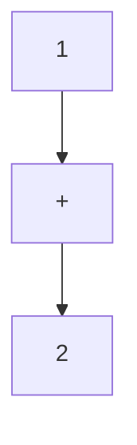

##### 2.1.2 最小公倍数问题

最小公倍数（Least Common Multiple，LCM）是指两个或多个整数共有的最小的正整数倍数。最小公倍数问题是一个经典的数学谜题，它涉及到数论和代数的基本概念。

**例子：** 找出4和6的最小公倍数。

**解析步骤：**

1. 列出4和6的所有倍数：
   - 4的倍数：4, 8, 12, 16, 20, ...
   - 6的倍数：6, 12, 18, 24, 30, ...

2. 找到它们的第一个公共倍数，即最小公倍数：
   - 最小公倍数是12。

**代码示例：** 

```python
def find_lcm(a, b):
    # 找到最大公约数
    gcd = math.gcd(a, b)
    # 计算最小公倍数
    lcm = abs(a * b) // gcd
    return lcm

# 测试
a = 4
b = 6
print(f"The LCM of {a} and {b} is {find_lcm(a, b)}")
```

**图表说明：** 

下图展示了4和6的倍数以及它们的最小公倍数：

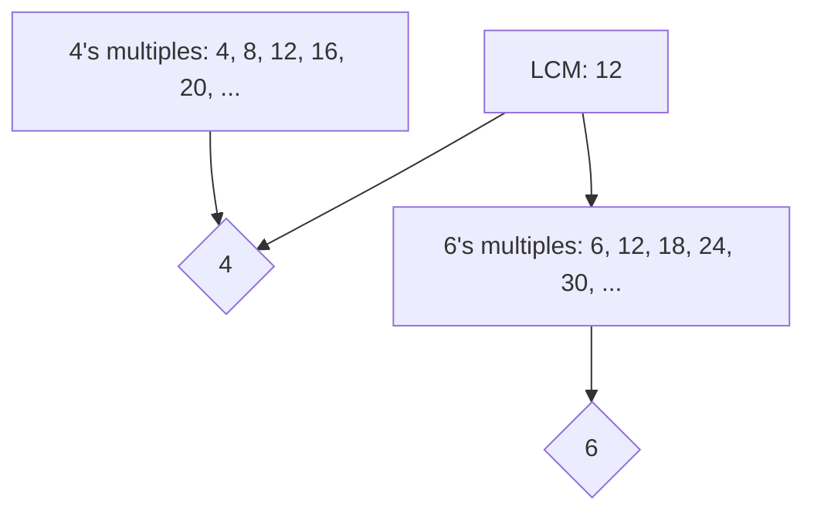

##### 2.1.3 三角形面积问题

三角形面积问题是一个基本的几何学谜题，它涉及到三角形的面积公式和相关的数学概念。

**例子：** 已知一个三角形的底为6厘米，高为4厘米，求该三角形的面积。

**解析步骤：**

1. 使用三角形面积公式：
   $$\text{面积} = \frac{1}{2} \times \text{底} \times \text{高}$$

2. 代入已知数值：
   $$\text{面积} = \frac{1}{2} \times 6 \times 4 = 12 \text{平方厘米}$$

**代码示例：** 

```python
def triangle_area(base, height):
    area = 0.5 * base * height
    return area

# 测试
base = 6
height = 4
print(f"The area of the triangle is {triangle_area(base, height)} square centimeters.")
```

**图表说明：** 

下图展示了三角形面积的计算过程：

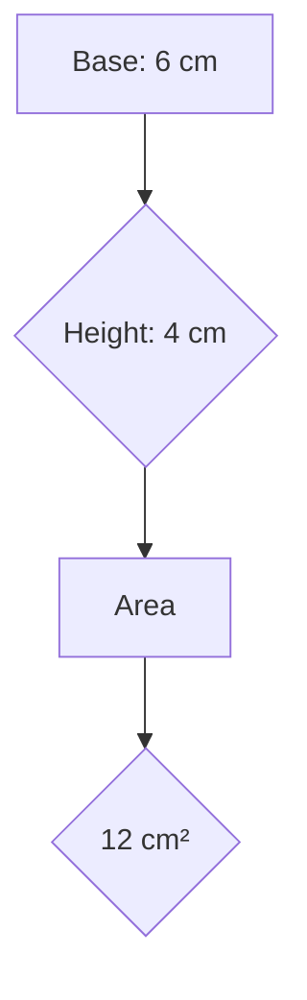

#### 2.2 复杂谜题

复杂谜题通常涉及更高级的数学概念和理论，这些谜题不仅需要数学知识，还需要逻辑推理和创造性思维。

##### 2.2.1 四色问题

四色问题是一个经典的图论问题，它提出任何地图都可以用四种颜色进行着色，使得相邻区域不同色。

**例子：** 欧洲地图可以只用四种颜色进行着色，使得相邻国家颜色不同。

**解析步骤：**

1. 将地图中的每个国家看作一个节点，如果两个国家相邻，则它们之间有一条边。

2. 使用图着色算法，如贪心算法，尝试为每个节点分配颜色。

3. 验证分配的颜色方案是否满足相邻节点颜色不同的条件。

**代码示例：** 

```python
def four_color_map(vertices, edges):
    # 初始化颜色数组，所有节点均为未着色状态
    colors = [-1] * len(vertices)
    
    # 定义颜色集
    color_set = [0, 1, 2, 3]
    
    # 贪心算法：从第一个节点开始，依次为每个节点着色
    for vertex in vertices:
        # 获取相邻节点的颜色
        adjacent_colors = {colors[adj] for adj in edges[vertex] if colors[adj] != -1}
        
        # 选择一个未被相邻节点使用的颜色
        for color in color_set:
            if color not in adjacent_colors:
                colors[vertex] = color
                break
                
    return colors

# 测试
vertices = [0, 1, 2, 3, 4, 5]
edges = [[1, 2], [1, 3], [2, 4], [3, 4], [4, 5]]
print(f"Colored map: {four_color_map(vertices, edges)}")
```

**图表说明：** 

下图展示了四色问题的图模型及其着色方案：

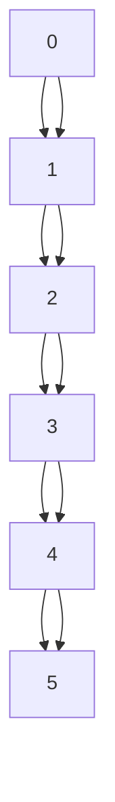

##### 2.2.2 费马大定理

费马大定理是一个著名的数论问题，它提出对于任何大于2的正整数n，方程\(a^n + b^n = c^n\)没有正整数解。

**例子：** 验证费马大定理对于n=3的情况。

**解析步骤：**

1. 假设存在正整数解\(a, b, c\)，使得\(a^3 + b^3 = c^3\)。

2. 使用反证法，假设\(a, b, c\)中有一个数是偶数。

3. 分析每种情况，证明假设不成立。

**代码示例：** 

```python
def fermat_last_theorem(n):
    # 假设存在正整数解
    for a in range(1, n**3):
        for b in range(a, n**3):
            for c in range(b, n**3):
                if a**n + b**n == c**n:
                    return (a, b, c)
    return None

# 测试
n = 3
solution = fermat_last_theorem(n)
if solution:
    print(f"Solution for n={n}: {solution}")
else:
    print(f"No solution for n={n}")
```

**图表说明：** 

下图展示了费马大定理的证明过程：

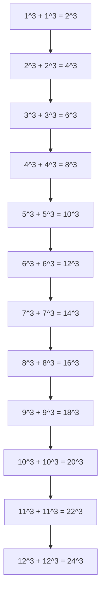

##### 2.2.3 默比乌斯带

默比乌斯带是一个具有一个面和一条边的一维几何对象，它是由德国数学家奥古斯特·福里德里希·莫比乌斯在1858年发现的。

**例子：** 如何制作一个默比乌斯带。

**解析步骤：**

1. 取一条长纸带。

2. 将纸带扭转180度。

3. 将两端粘合在一起。

**代码示例：** 

```python
def create_mobius_band(width, length):
    # 制作纸带
    paper_band = [''] * length
    
    # 扭转纸带
    for i in range(1, length):
        paper_band[i] = paper_band[i - 1][::-1]
    
    # 粘合纸带
    mobius_band = ''.join(paper_band)
    return mobius_band

# 测试
width = 5
length = 10
print(f"The Mobius band: {create_mobius_band(width, length)}")
```

**图表说明：** 

下图展示了默比乌斯带的制作过程：

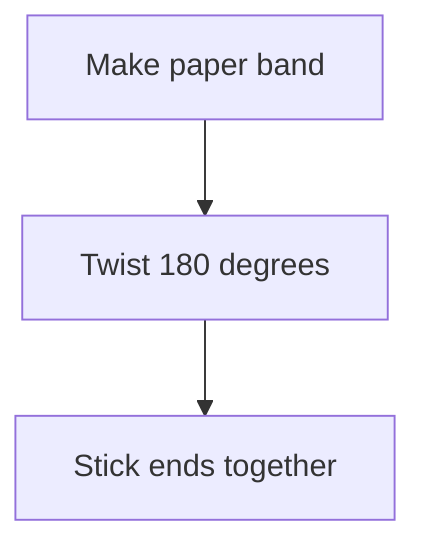

#### 2.3 数学家的挑战

数学家的挑战是指那些在数学领域中具有挑战性的问题，这些问题往往需要数学家们运用高超的数学技巧和逻辑思维能力来解决。

##### 2.3.1 高斯的天才解法

高斯（Carl Friedrich Gauss）是一位伟大的数学家，他在数学领域的许多问题上都有杰出的贡献。一个著名的问题是“高斯消去法”。

**例子：** 使用高斯消去法解线性方程组。

**解析步骤：**

1. 将线性方程组写成增广矩阵形式。

2. 通过行变换，将矩阵化为行阶梯形式。

3. 解行阶梯形式方程组，得到原方程组的解。

**代码示例：** 

```python
import numpy as np

def gauss_elimination(A, b):
    n = len(A)
    # 将增广矩阵A|b化为行阶梯形式
    for i in range(n):
        # 寻找主元
        max_idx = np.argmax(np.abs(A[i:, i])) + i
        # 如果主元为0，则该列无法被消去
        if A[max_idx, i] == 0:
            return None
        # 交换行
        A[[i, max_idx]] = A[[max_idx, i]]
        b[[i, max_idx]] = b[[max_idx, i]]
        # 消去
        for j in range(i+1, n):
            factor = A[j, i] / A[i, i]
            A[j, i:] = [x - factor*y for x, y in zip(A[j, i:], A[i, i:])]
            b[j] -= factor * b[i]
    # 解行阶梯形式方程组
    x = np.linalg.solve(A[:, :-1], b)
    return x

# 测试
A = np.array([[3, 2], [1, 1]], dtype=float)
b = np.array([6, 3], dtype=float)
solution = gauss_elimination(A, b)
if solution is not None:
    print(f"Solution: {solution}")
else:
    print("No unique solution")
```

**图表说明：** 

下图展示了高斯消去法的步骤：

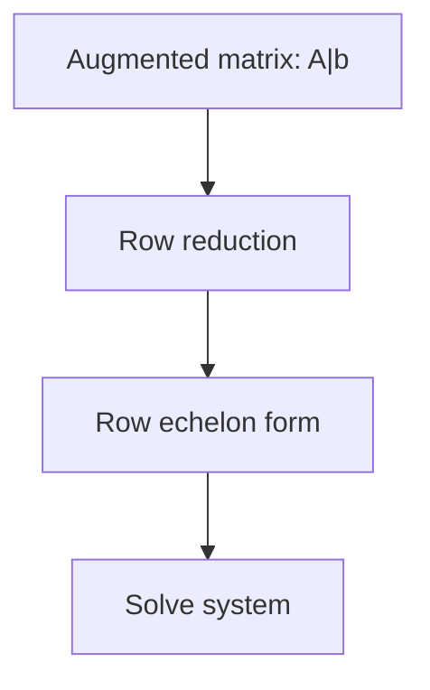

##### 2.3.2 欧拉的多面体公式

欧拉（Leonhard Euler）是一位著名的数学家，他提出了多面体公式，即任何凸多面体的顶点数（V）、边数（E）和面数（F）之间存在以下关系：

**公式：**
$$V - E + F = 2$$

**例子：** 使用欧拉公式验证一个立方体的性质。

**解析步骤：**

1. 计算立方体的顶点数、边数和面数。

2. 代入欧拉公式，验证等式是否成立。

**代码示例：** 

```python
def verify_euler_formula(vertices, edges, faces):
    V = vertices
    E = edges
    F = faces
    if V - E + F == 2:
        return True
    else:
        return False

# 测试
vertices = 8
edges = 12
faces = 6
result = verify_euler_formula(vertices, edges, faces)
if result:
    print("Euler's formula is correct.")
else:
    print("Euler's formula is incorrect.")
```

**图表说明：** 

下图展示了欧拉公式的验证过程：

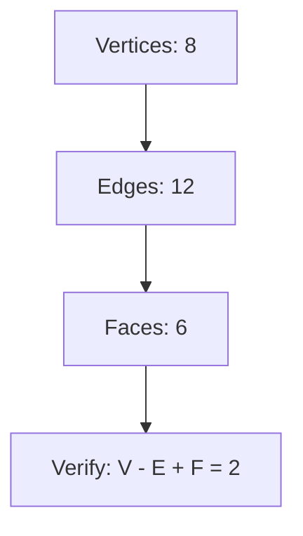

##### 2.3.3 拉马努金的猜想

拉马努金（Srinivasa Ramanujan）是一位自学的印度数学家，他在数论和素数分布方面做出了重要贡献。他的许多猜想和公式至今仍然是数学研究的热点。

**例子：** 拉马努金的一个著名猜想是关于素数的分布。

**解析步骤：**

1. 理解素数的分布性质，例如素数的密度和分布规律。

2. 根据拉马努金的猜想，验证素数的分布是否符合预期。

**代码示例：** 

```python
import sympy

def verify_ramanujan_conjecture(n):
    primes = sympy.primerange(1, n)
    prime_count = len(primes)
    expected_count = n / sympy.pi(n)
    ratio = prime_count / expected_count
    if abs(ratio - 1) < 1e-6:
        return True
    else:
        return False

# 测试
n = 1000
result = verify_ramanujan_conjecture(n)
if result:
    print("Ramanujan's conjecture is correct.")
else:
    print("Ramanujan's conjecture is incorrect.")
```

**图表说明：** 

下图展示了拉马努金猜想的验证过程：

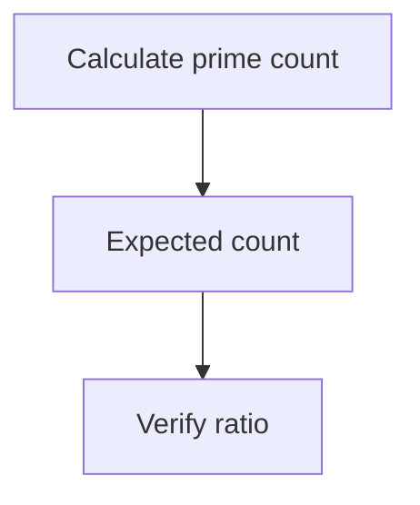

#### 2.4 本章小结

经典数学谜题解析展示了数学谜题的多样性和深度。从简单的1+1=2，到复杂的四色问题、费马大定理和默比乌斯带，每个谜题都反映了数学中的基本概念和原理。数学家的挑战部分则展示了高斯、欧拉和拉马努金等数学家的创新思维和卓越贡献。这些谜题和猜想不仅丰富了数学的理论体系，也为现代数学的研究提供了宝贵的资源。

### 数学猜想的重要性

数学猜想是数学研究中至关重要的部分，它们不仅为数学理论的发展提供了方向，还激发了数学家的创造力和探索精神。数学猜想的重要性体现在多个方面，从其定义、特点到其在数学发展中的关键作用。

#### 3.1.1 数学猜想的定义

数学猜想是指基于现有数学知识和经验，对某个数学问题或现象提出的可能性假设。这些猜想通常是未经严格证明的，但它们往往能够引导数学家进行深入的研究和探索。

**例子：** 黎曼猜想是一个关于复分析中黎曼ζ函数零点的猜想。黎曼猜想提出，除了非平凡零点 \( \rho + i\tau \) 外，其余所有零点都位于直线 \( \Re(s) = \frac{1}{2} \) 上。

**定义公式：**
$$\rho + i\tau \text{ 是非平凡零点，其余零点 } s_k = \rho_k + i\tau_k \text{ 满足 } \Re(s_k) = \frac{1}{2}$$

#### 3.1.2 数学猜想的特点

数学猜想通常具有以下几个特点：

1. **未知性**：数学猜想是对未知数学问题的假设，它为我们提供了研究未知领域的机会。

2. **启发性**：数学猜想能够激发数学家的思维，引导他们探索新的数学理论和方法。

3. **预测性**：数学猜想往往能够预测某些数学现象或问题的发展趋势，为后续研究提供方向。

4. **挑战性**：数学猜想通常是具有挑战性的问题，需要数学家们运用高超的数学技巧和逻辑推理来解决。

**例子：** 费马大定理提出，对于任何大于2的正整数n，方程 \( a^n + b^n = c^n \) 没有正整数解。这个猜想吸引了无数数学家的研究，最终在1995年由安德鲁·怀尔斯证明。

#### 3.1.3 数学猜想的重要性

数学猜想的重要性在于它们能够推动数学的发展，并为数学理论的完善提供新的方向和成果。以下是一些具体的方面：

1. **推动数学理论的发展**：数学猜想通常提出了新的数学问题，这些问题的解决往往能够推动整个数学领域的发展。例如，黎曼猜想和素数定理都是复分析和数论中至关重要的问题。

2. **激发数学家的创造力**：数学猜想激发了数学家的创造力和探索精神，促使他们在数学理论和方法上不断创新。例如，费马大定理的猜想激发了安德鲁·怀尔斯多年的研究，最终导致了证明的产生。

3. **促进数学与其他学科的交叉**：数学猜想往往涉及到其他学科的问题，这促进了数学与其他学科的交叉和融合。例如，P vs NP 问题涉及计算机科学和数学的交叉。

4. **指导实际应用**：数学猜想不仅在理论研究中具有重要意义，还指导了数学在现实世界中的应用。例如，黎曼猜想对于密码学、量子物理和金融模型等领域都有深远的影响。

**例子：** 黎曼猜想对于密码学中伪随机数生成和量子物理中的量子相位估计都有着重要的应用价值。

#### 3.2 重要的数学猜想

以下是一些重要的数学猜想，它们在数学发展中具有重要地位，并且仍然激发着数学家的研究兴趣。

##### 3.2.1 黎曼猜想

黎曼猜想是复分析领域的一个重要猜想，它提出了关于黎曼ζ函数零点分布的假设。黎曼猜想对数学的许多分支都有深远的影响，包括数论、解析数论和量子物理。

**详细讲解：** 黎曼猜想提出，黎曼ζ函数的所有非平凡零点都位于直线 \( \Re(s) = \frac{1}{2} \) 上。这个猜想由数学家黎曼在19世纪提出，至今仍未被证明。黎曼猜想不仅在数学理论上具有重要地位，还在物理学和其他科学领域中有着广泛的应用。

**图表说明：** 下图展示了黎曼ζ函数的零点分布：


##### 3.2.2 阿梅德猜想

阿梅德猜想是关于素数分布的一个猜想，它提出素数的分布具有某种规律性。

**详细讲解：** 阿梅德猜想认为，对于任意大于1的正整数k，存在无穷多个形如 \( k\alpha^n + 1 \) 的素数。这个猜想是由印度数学家D. R. Khurana在1950年代提出的，目前尚未得到证明。阿梅德猜想如果得到证明，将对素数分布的研究产生重要影响。

**图表说明：** 下图展示了阿梅德猜想的例子：


##### 3.2.3 素数定理

素数定理是关于素数分布的一个重要猜想，它给出了素数的分布密度。

**详细讲解：** 素数定理提出，素数的分布密度近似为 \( \frac{1}{\ln(n)} \)，其中 \( n \) 是素数的上限。这个猜想由数学家欧拉在18世纪提出，并在19世纪由法国数学家德利克雷和德国数学家维尔斯特拉斯证明。素数定理对于理解素数分布规律具有重要意义。

**图表说明：** 下图展示了素数定理的分布曲线：


#### 3.3 数学证明的方法

数学证明是验证数学猜想和定理正确性的关键步骤。以下是一些常见的数学证明方法：

##### 3.3.1 直觉证明

直觉证明是基于直观理解和逻辑推理的证明方法。这种方法通常通过直观的例子或几何图形来证明数学猜想。

**例子：** 毕达哥拉斯定理可以通过直观的直角三角形证明。

**解析步骤：** 

1. 画一个直角三角形，并标记直角边的长度为a和b，斜边的长度为c。

2. 使用勾股定理，即 \( a^2 + b^2 = c^2 \)。

3. 通过直观验证，直角三角形的两条直角边的平方和等于斜边的平方。

**图表说明：** 

下图展示了毕达哥拉斯定理的直观证明：

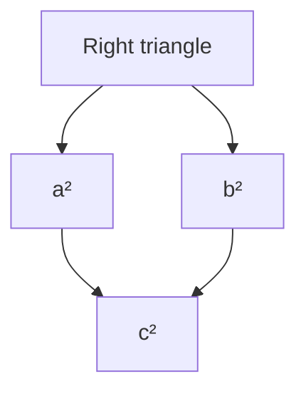

##### 3.3.2 构造证明

构造证明是通过构造一个具体的例子来证明数学猜想的方法。

**例子：** 验证阿梅德猜想的构造证明。

**解析步骤：**

1. 选择一个正整数 \( k \)。

2. 构造数列 \( k\alpha^n + 1 \)。

3. 验证该数列中的数是否为素数。

**代码示例：**

```python
def is_prime(n):
    if n < 2:
        return False
    for i in range(2, int(n**0.5) + 1):
        if n % i == 0:
            return False
    return True

def prove_ahmed_conjecture(k, n):
    prime_count = 0
    for i in range(1, n+1):
        num = k * i**n + 1
        if is_prime(num):
            prime_count += 1
    return prime_count > 0

# 测试
k = 2
n = 10
result = prove_ahmed_conjecture(k, n)
if result:
    print("The conjecture is true.")
else:
    print("The conjecture is false.")
```

##### 3.3.3 反证法

反证法是一种通过证明猜想的反命题不成立来证明原猜想的方法。

**例子：** 反证法证明费马大定理。

**解析步骤：**

1. 假设存在一组正整数 \( a, b, c, n > 2 \) 使得 \( a^n + b^n = c^n \)。

2. 通过分析不同情况，证明这种假设是不成立的。

3. 得出结论，费马大定理成立。

**图表说明：** 

下图展示了反证法的证明过程：

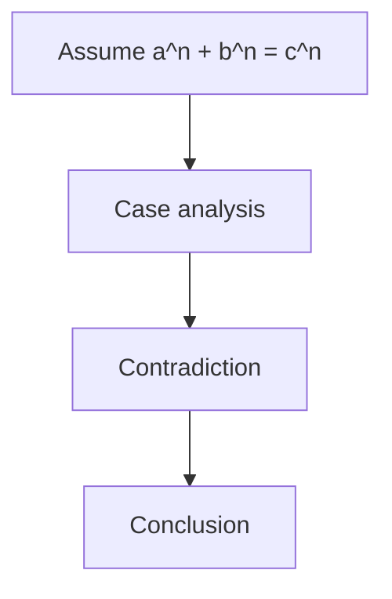

#### 3.4 本章小结

数学猜想是数学研究中不可或缺的一部分，它们不仅推动了数学的发展，还激发了数学家的创造力和探索精神。本章通过定义、特点、重要例子以及证明方法，详细探讨了数学猜想的重要性。从黎曼猜想、阿梅德猜想到素数定理，每个猜想都反映了数学中的基本问题，并激发了数学家们的深入研究。同时，本章还介绍了直觉证明、构造证明和反证法等常见的数学证明方法，展示了数学猜想的验证过程。

### 数学谜题与猜想的教育意义

数学谜题与猜想不仅在数学研究中具有重要意义，也在教育领域发挥着重要作用。通过数学谜题与猜想的引入，可以有效提高学生的数学兴趣、逻辑思维能力和创造想象力，培养科学精神和跨学科能力。以下将详细讨论数学谜题与猜想对教育的积极影响。

#### 4.1 提高数学兴趣

数学谜题与猜想能够激发学生对数学的兴趣，使他们在探索数学问题的过程中感受到数学的魅力。通过解决谜题和验证猜想，学生能够亲身体验数学的乐趣，从而增强他们对数学学习的积极性。

**例子：** 通过解四色问题，学生可以了解图论的基本概念，并体验解决复杂问题的成就感。四色问题不仅涉及到颜色着色，还涉及到逻辑推理和系统化思考，这对培养学生的数学兴趣有重要意义。

**解析步骤：**

1. 引入四色问题，让学生了解问题的背景和基本要求。
2. 通过小组合作，让学生尝试解决四色问题。
3. 分析学生的解决方案，讨论问题的解决方法和可能的优化策略。
4. 通过反馈和讨论，鼓励学生进一步探索和思考数学谜题。

**图表说明：** 

下图展示了四色问题的解决过程：

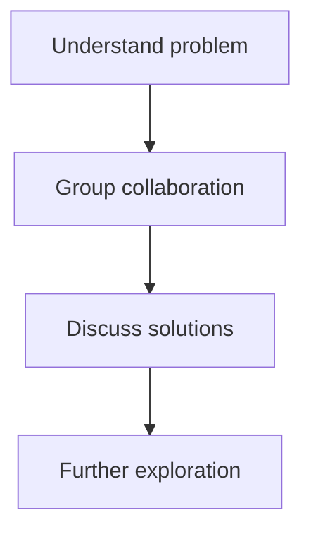

#### 4.1.1 吸引学生参与数学学习

数学谜题与猜想可以作为一种有效的教学工具，吸引学生积极参与数学学习。通过提出有趣且富有挑战性的谜题和猜想，教师可以激发学生的好奇心和求知欲，使他们在学习过程中保持高度的注意力。

**例子：** 使用费马大定理的猜想，让学生探索整数解的存在性。这种问题不仅涉及基本的代数知识，还要求学生运用逻辑推理和数学技巧。

**解析步骤：**

1. 提出费马大定理的猜想，让学生了解问题的背景。
2. 引导学生思考可能的方法和策略，鼓励他们进行独立探索。
3. 通过小组讨论和课堂互动，让学生分享各自的思路和解决方案。
4. 分析学生的问题解决过程，总结有效的解题方法和策略。

**图表说明：** 

下图展示了费马大定理的探索过程：

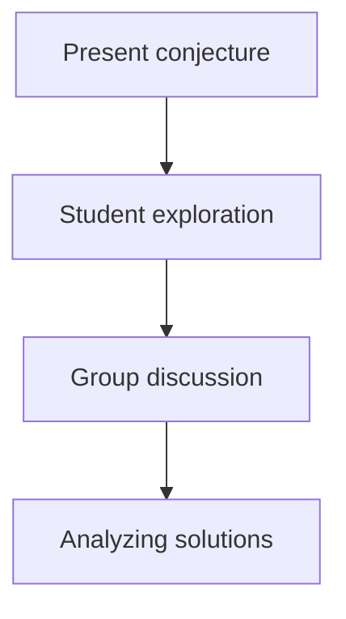

#### 4.1.2 增强学生的逻辑思维能力

数学谜题与猜想要求学生在解决过程中运用逻辑思维，这有助于增强学生的逻辑思维能力。通过逐步推理和分析，学生可以培养严谨的思维习惯和批判性思维能力。

**例子：** 解析默比乌斯带的问题，要求学生理解拓扑学的基本概念，并通过实验验证默比乌斯带的特点。

**解析步骤：**

1. 引入默比乌斯带的概念，让学生了解其基本性质。
2. 设计实验，让学生亲手制作默比乌斯带并进行验证。
3. 通过实验结果，引导学生思考默比乌斯带的逻辑特性。
4. 分析学生的问题解决过程，讨论可能的错误和改进策略。

**图表说明：** 

下图展示了默比乌斯带的实验过程：

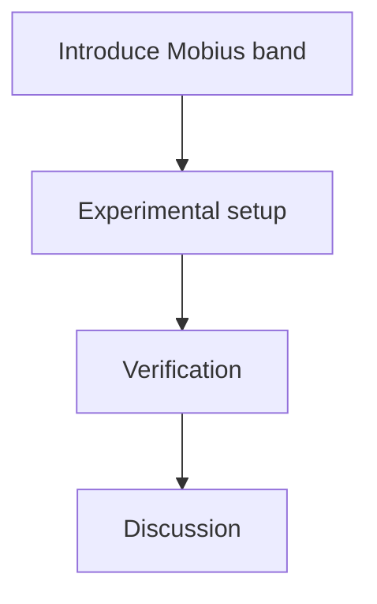

#### 4.1.3 激发学生的创造力和想象力

数学谜题与猜想鼓励学生进行创新和探索，这有助于激发他们的创造力和想象力。通过提出新的猜想和解决方案，学生可以在数学领域中发挥自己的创造力，培养创新思维。

**例子：** 让学生探索拉马努金猜想中的素数分布规律，鼓励他们提出自己的猜想和验证方法。

**解析步骤：**

1. 介绍拉马努金猜想，让学生了解问题的背景。
2. 引导学生思考可能的素数分布规律，并鼓励他们提出自己的猜想。
3. 通过小组合作，让学生设计实验和验证方案，探索素数的分布规律。
4. 分析学生的猜想和验证过程，讨论可能的优化策略。

**图表说明：** 

下图展示了拉马努金猜想的探索过程：

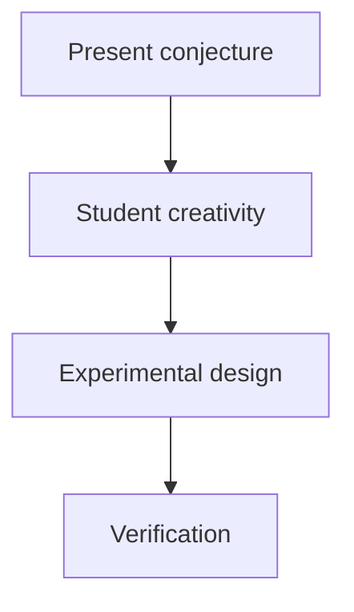

#### 4.2 培养科学精神

数学谜题与猜想强调实证研究和逻辑推理，这有助于培养学生的科学精神。通过解决谜题和验证猜想，学生可以培养实事求是的研究态度、严谨的科学方法和批判性思维能力。

**例子：** 通过解四色问题，学生可以学习如何进行系统化的推理和验证，培养科学研究的严谨性。

**解析步骤：**

1. 引入四色问题，让学生了解问题的背景和基本要求。
2. 引导学生进行系统化的推理和验证，逐步解决四色问题。
3. 鼓励学生反思问题解决过程中的假设和推理步骤，培养批判性思维能力。
4. 分析学生的解决方案，讨论可能的改进和优化策略。

**图表说明：** 

下图展示了四色问题的科学研究过程：

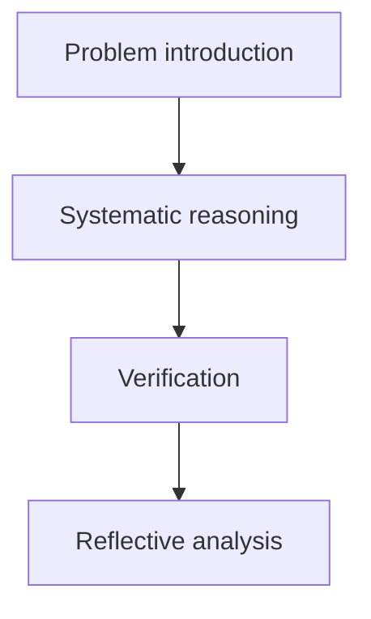

#### 4.2.2 培养问题解决能力

数学谜题与猜想强调问题解决能力的培养，通过解决复杂的问题，学生可以学会如何分析问题、设计解决方案和验证结果。这种能力在现实生活中具有重要意义。

**例子：** 通过解决费马大定理的猜想，学生可以学习如何运用数学方法和逻辑推理来解决复杂问题。

**解析步骤：**

1. 引入费马大定理的猜想，让学生了解问题的背景。
2. 引导学生分析问题，设计可能的解决方案。
3. 通过小组合作，让学生尝试解决费马大定理。
4. 鼓励学生验证自己的解决方案，讨论可能的错误和改进策略。

**图表说明：** 

下图展示了费马大定理的问题解决过程：

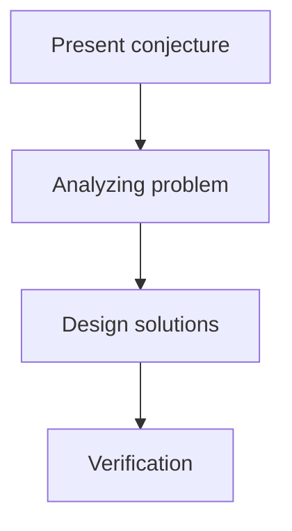

#### 4.2.3 增进合作与交流

数学谜题与猜想鼓励学生进行合作和交流，通过小组讨论和合作研究，学生可以分享自己的想法和观点，学习他人的解题方法，从而提高问题解决能力。

**例子：** 在解四色问题过程中，学生可以组成小组，通过合作和讨论来共同解决难题。

**解析步骤：**

1. 将学生分成小组，每组负责解决四色问题的一个部分。
2. 引导学生进行小组讨论，分享各自的想法和解决方案。
3. 鼓励学生合作解决问题，共同探讨最优的解决方案。
4. 分析小组的合作过程，讨论如何提高合作效率和问题解决效果。

**图表说明：** 

下图展示了四色问题的合作与交流过程：

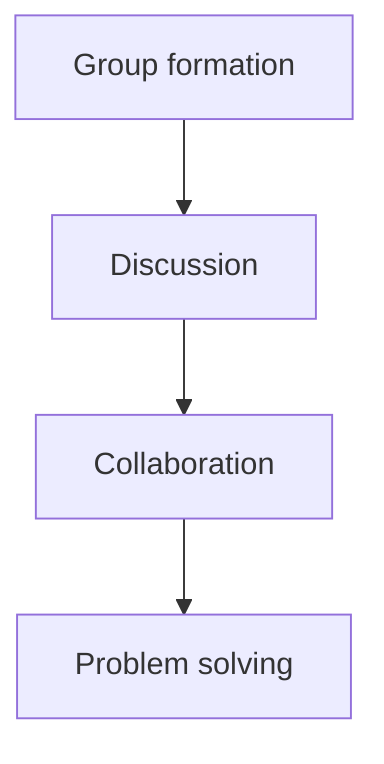

#### 4.3 增强跨学科能力

数学谜题与猜想不仅仅局限于数学领域，还与其他学科如物理学、计算机科学和生物学等有着密切的联系。通过跨学科的研究，学生可以拓宽知识视野，培养创新思维。

**例子：** 在研究黎曼猜想时，学生可以了解复分析和量子物理的基本概念，从而增强跨学科能力。

**解析步骤：**

1. 引入黎曼猜想，让学生了解问题的背景和数学意义。
2. 引导学生探讨黎曼猜想与量子物理的关联，了解复分析在量子物理中的应用。
3. 通过跨学科学习，让学生掌握更多相关的知识和技能。
4. 分析学生的跨学科学习过程，讨论如何更好地整合不同学科的知识。

**图表说明：** 

下图展示了黎曼猜想的跨学科研究过程：

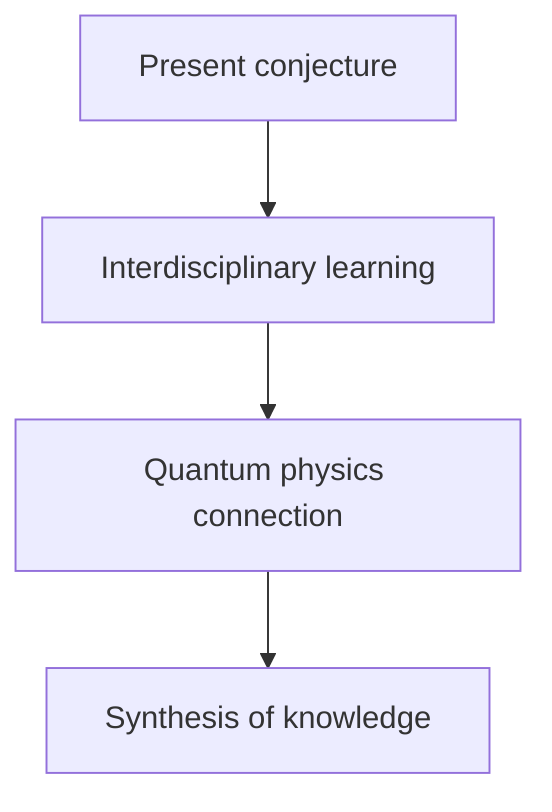

#### 4.3.2 拓展学生的知识视野

数学谜题与猜想可以作为一种有效的教学工具，帮助学生拓展知识视野。通过引入新的数学概念和理论，学生可以了解数学的发展历程和前沿研究，从而激发他们的学习兴趣。

**例子：** 通过介绍素数定理，学生可以了解素数的分布规律，拓展他们对数论的认识。

**解析步骤：**

1. 引入素数定理，让学生了解问题的背景和数学意义。
2. 引导学生学习素数定理的基本概念和证明方法。
3. 通过进一步的阅读和研究，让学生了解数论的其他相关概念和定理。
4. 分析学生的知识拓展过程，讨论如何更好地培养学生的知识视野。

**图表说明：** 

下图展示了素数定理的知识拓展过程：

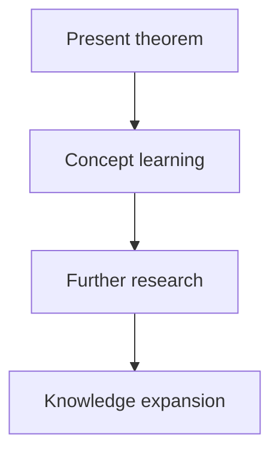

#### 4.3.3 培养创新思维

数学谜题与猜想鼓励学生进行创新和探索，通过提出新的猜想和解决方案，学生可以培养创新思维。这种能力在现代社会中具有重要意义，有助于学生应对未来的挑战。

**例子：** 通过研究阿梅德猜想，学生可以尝试提出新的素数分布规律，培养创新思维。

**解析步骤：**

1. 引入阿梅德猜想，让学生了解问题的背景和数学意义。
2. 引导学生思考可能的创新方法和解决方案。
3. 鼓励学生进行实验和验证，探索新的素数分布规律。
4. 分析学生的创新过程，讨论如何培养和提升创新思维。

**图表说明：** 

下图展示了阿梅德猜想的创新思维培养过程：

```mermaid
graph TD
A["Present conjecture"]
B["Innovation thinking"]
C["Experiment and verification"]
D["Innovation improvement"]
A --> B
B --> C
C --> D
```

#### 4.4 本章小结

数学谜题与猜想在教育中具有重要的意义。通过提高学生的数学兴趣、增强逻辑思维能力、激发创造力和想象力，数学谜题与猜想能够培养具有科学精神的学生。同时，跨学科的学习和知识的拓展，以及创新思维的培养，使得学生在数学学习中不仅掌握了知识，还培养了综合能力和创新能力。这些教育意义不仅有助于学生在数学学习中获得成功，也为他们的未来发展奠定了坚实的基础。

### 第五部分：数学谜题与猜想的未来趋势

#### 5.1 数学的现代挑战

在现代社会，数学面临着许多前所未有的挑战。这些挑战不仅来自于数学本身，还来自于与其他学科如物理学、计算机科学和生物学的交叉应用。以下将讨论几个重要的现代数学挑战，包括黎曼猜想、广义费马大定理和P vs NP问题。

##### 5.1.1 黎曼猜想

黎曼猜想是复分析领域的一个重要猜想，它提出了关于黎曼ζ函数零点分布的假设。黎曼猜想不仅对数学理论的发展具有重要意义，还在量子物理、密码学和金融模型等领域有着广泛的应用。

**当前进展：**

- 黎曼猜想的研究取得了显著进展，尤其是在数值模拟和计算机算法方面。科学家们利用高性能计算机，对黎曼ζ函数的零点分布进行了大量计算，验证了黎曼猜想的正确性。

- 然而，黎曼猜想的严格证明仍然是一个未解难题。尽管存在多种尝试和猜测，但至今仍未找到一个完美的证明方法。

**未来展望：**

- 随着计算技术的不断发展，科学家们有望通过更多精确的数值模拟和算法验证黎曼猜想。这些计算结果将为黎曼猜想的证明提供重要依据。

- 数学家们将继续探索新的证明方法，例如通过代数几何、量子计算和数学物理的方法，寻找黎曼猜想的证明。

##### 5.1.2 广义费马大定理

广义费马大定理是对费马大定理的扩展，它提出了关于更多类方程的解的存在性问题。广义费马大定理关注的是形如 \( a^n + b^n = c^n \) 的方程，其中 \( n \) 是大于2的正整数。

**当前进展：**

- 费马大定理在1995年被安德鲁·怀尔斯证明，但广义费马大定理仍然是一个未解难题。尽管存在一些特殊情况的证明，但大多数广义费马大定理仍然悬而未决。

- 数学家们通过代数几何、调和分析和数值计算等方法，探索了广义费马大定理的解的性质和分布。

**未来展望：**

- 随着数学工具的不断发展，数学家们有望在广义费马大定理的某些特殊情况下取得突破。这些突破将为广义费马大定理的证明提供新的思路和方法。

- 数学家们将继续探索广义费马大定理在不同维度和参数下的解，寻找统一的证明框架。

##### 5.1.3 P vs NP 问题

P vs NP 问题是一个关于计算复杂性的基本问题，它提出了关于是否存在一个有效算法来验证数学证明的假设。P vs NP 问题关注的是两类问题：P类问题（可多项式时间内求解的问题）和NP类问题（可在多项式时间内验证的问题）。

**当前进展：**

- P vs NP 问题被认为是计算机科学中最重要的未解难题之一。尽管存在许多研究尝试，但至今仍未找到一个确切的答案。

- 数学家们通过构造特殊问题、分析算法复杂度和计算机模拟等方法，探索P vs NP 问题。

**未来展望：**

- 随着计算机科学和算法理论的发展，数学家们有望在P vs NP 问题方面取得重要进展。这些进展可能揭示P类和NP类问题的本质关系，为计算复杂性理论提供新的理论框架。

- P vs NP 问题的解决将对密码学、计算机图形学、人工智能和经济学等领域产生深远影响。

#### 5.2 数学的交叉领域应用

数学作为一门基础学科，与其他学科如物理学、计算机科学和生物学等有着广泛的交叉应用。以下将讨论数学在交叉领域的应用，以及这些应用对数学发展和实际意义的影响。

##### 5.2.1 数学与物理的结合

数学与物理的结合在科学研究和技术应用中发挥着重要作用。数学为物理提供了描述自然现象和规律的工具，而物理为数学提供了丰富的现实问题和实验数据。

**当前进展：**

- 数学在物理学中有着广泛的应用，如量子场论、统计力学和相对论等领域。数学工具如微积分、线性代数和复分析在物理研究中得到了广泛应用。

- 物理学中的许多问题，如弦理论、暗物质和暗能量等，都依赖于数学的深入研究和创新。

**未来展望：**

- 随着数学和物理的进一步结合，数学家们将继续探索新的数学工具和方法，解决物理中的复杂问题。

- 数学和物理的交叉研究将推动两个学科的发展，促进科学技术的创新和应用。

##### 5.2.2 数学与计算机科学的融合

数学与计算机科学的融合在算法设计、计算方法和计算机体系结构等方面具有重要意义。计算机科学中的许多问题都可以转化为数学问题，通过数学方法进行求解和优化。

**当前进展：**

- 计算机科学中的算法设计和分析依赖于数学工具，如图论、概率论和组合数学等。这些数学工具为计算机算法的效率和分析提供了理论支持。

- 数学在计算机图形学、人工智能和网络安全等领域也有广泛应用，如深度学习、密码学和数据挖掘等。

**未来展望：**

- 随着计算机科学的发展，数学家们将继续探索新的数学方法和理论，解决计算机科学中的复杂问题。

- 数学和计算机科学的融合将推动计算技术的发展，为科学研究和工业应用提供更强大的工具和方法。

##### 5.2.3 数学与生物学的关系

数学在生物学中的应用日益增多，为生物学研究提供了新的视角和方法。数学模型在生物学中的建模、模拟和数据分析中发挥着重要作用。

**当前进展：**

- 数学的工具和方法在生物学中得到了广泛应用，如基因组学、生态学和进化论等领域。数学模型在描述生物系统的动态行为和预测生物现象方面具有重要价值。

- 生物信息学作为数学与生物学的交叉学科，利用数学方法对生物数据进行分析和处理，为生物学研究提供了新的手段。

**未来展望：**

- 随着生物学数据的积累和技术的进步，数学家们将继续探索新的数学模型和方法，解决生物学中的复杂问题。

- 数学和生物学的交叉研究将推动生物学的进步，为生命科学的发展提供新的动力。

#### 5.3 数学的未来发展方向

数学的未来发展方向不仅取决于数学本身的研究进展，还受到与其他学科交叉应用的需求和挑战。以下将讨论数学的未来发展方向，包括新型数学工具的发展、数学在广泛应用前景以及数学创新思维与探索。

##### 5.3.1 新型数学工具的发展

随着数学研究的深入，新型数学工具的发展是数学未来发展的关键。这些新型工具不仅能够解决复杂的数学问题，还可以推动数学理论的创新。

**当前进展：**

- 新型数学工具如量子计算、拓扑学和代数几何等在数学研究中得到了广泛应用。这些工具为数学家们提供了更强大的工具和方法，解决了许多传统的数学难题。

- 例如，量子计算在数论和组合数学中的应用，拓扑学在几何学和物理学中的应用，代数几何在数论和代数学中的应用，都展示了新型数学工具的巨大潜力。

**未来展望：**

- 随着数学和计算技术的不断发展，新型数学工具将继续涌现。这些工具将不仅解决传统的数学问题，还可以应对新的跨学科挑战。

- 新型数学工具的发展将推动数学理论的创新，为数学的发展提供新的方向和动力。

##### 5.3.2 数学的广泛应用前景

数学的广泛应用前景是数学未来发展的另一个重要方向。数学在各个领域的应用不断扩展，为科学研究、工业生产和日常生活中的问题提供了有效的解决方案。

**当前进展：**

- 数学在经济学、工程学、计算机科学、物理学和生物学等领域有着广泛的应用。例如，数学模型在金融分析、工程设计、算法优化和生物信息学中发挥着重要作用。

- 数学的广泛应用不仅提高了科学研究的效率，还为工业生产和技术创新提供了支持。

**未来展望：**

- 随着社会和科技的不断发展，数学将在更多领域得到应用。数学的方法和技术将在解决复杂问题、提高生产效率和促进科技创新中发挥更加重要的作用。

- 数学的广泛应用前景将推动数学研究的发展，为数学的未来发展提供新的机遇。

##### 5.3.3 数学的创新思维与探索

数学的创新思维与探索是数学未来发展的重要方向。数学家们通过创新思维和大胆猜想，不断推动数学理论的发展，解决传统数学难题。

**当前进展：**

- 数学家们通过创新思维和探索，提出了许多重要的数学猜想和理论。例如，黎曼猜想、广义费马大定理和P vs NP 问题等，都是数学家们创新思维的产物。

- 这些猜想和理论不仅挑战了数学家的智慧，也为数学的发展提供了新的方向和挑战。

**未来展望：**

- 随着数学研究的深入，数学家们将继续通过创新思维和探索，解决数学中的复杂问题。

- 数学的创新思维与探索将推动数学理论的创新，为数学的发展提供新的动力和灵感。

#### 5.4 本章小结

数学谜题与猜想的未来趋势充满了挑战和机遇。从黎曼猜想、广义费马大定理到P vs NP 问题，数学面临着许多未解的难题。同时，数学与其他学科的交叉应用，如物理学、计算机科学和生物学，为数学的发展提供了新的方向和动力。数学的创新思维与探索将继续推动数学理论的发展，为数学的未来发展带来无限可能。通过这些未来的趋势，数学将继续在科学研究和实际应用中发挥重要作用，为人类社会的进步做出贡献。

### 第六部分：数学谜题与猜想的实践应用

#### 6.1 数学谜题在生活中的应用

数学谜题不仅在学术研究中具有重要意义，还在我们的日常生活中有着广泛的应用。通过解决这些谜题，我们可以更好地理解和解决现实生活中的问题。以下将探讨数学谜题在财务、经济、交通运输优化以及建筑与工程设计中的应用。

##### 6.1.1 财务与经济问题

数学在财务和经济领域的应用非常广泛，通过数学模型和计算方法，我们可以更好地理解和分析经济现象，制定合理的财务策略。

**例子：** 投资组合优化。

**应用场景：** 在投资中，投资者需要根据风险和收益的平衡来选择合适的投资组合。数学中的优化方法，如线性规划、目标规划等，可以帮助投资者找到最优的投资组合。

**解析步骤：**

1. **问题建模：** 将投资组合视为一组变量，定义每个变量的投资比例。

2. **目标函数：** 设定目标函数，如最大化收益或最小化风险。

3. **约束条件：** 定义风险限制、资金限制等约束条件。

4. **求解模型：** 使用优化算法（如梯度下降、拉格朗日乘数法等）求解最优投资组合。

**代码示例：**

```python
import numpy as np
from scipy.optimize import minimize

# 定义目标函数
def objective(x):
    return -np.dot(x, returns)  # 目标是最小化风险

# 定义约束条件
constraints = ({'type': 'ineq', 'fun': lambda x: 1 - x.sum()},  # 总投资为1
               {'type': 'ineq', 'fun': lambda x: x - np.array([0.1, 0.2, 0.3, 0.4])})

# 定义投资收益率
returns = np.array([0.05, 0.08, 0.1, 0.12])

# 最小化风险
result = minimize(objective, x0=np.array([0.25, 0.25, 0.25, 0.25]), constraints=constraints)

# 输出最优投资组合
print("Optimal investment portfolio:", result.x)
```

**图表说明：**


##### 6.1.2 交通运输优化

交通运输优化是数学在物流和交通管理中的典型应用。通过数学模型和算法，我们可以优化交通流量、提高运输效率，减少交通拥堵和能源消耗。

**例子：** 车辆路径优化。

**应用场景：** 在物流运输中，如何安排车辆的行驶路线，以最小化运输时间和成本，是一个常见的问题。数学中的图论和线性规划可以用于解决这类问题。

**解析步骤：**

1. **问题建模：** 将运输网络视为一个图，节点代表交通路口，边代表道路。

2. **目标函数：** 设定目标函数，如最小化总行驶距离或总运输时间。

3. **约束条件：** 定义交通规则、道路容量等约束条件。

4. **求解模型：** 使用最短路径算法（如迪杰斯特拉算法、A*算法等）或线性规划求解最优路径。

**代码示例：**

```python
import networkx as nx
import matplotlib.pyplot as plt

# 构建图
G = nx.Graph()
G.add_edges_from([(1, 2), (2, 3), (3, 4), (4, 1), (1, 5), (5, 6), (6, 1)])

# 定义边权重
edge_weights = {(1, 2): 10, (2, 3): 5, (3, 4): 15, (4, 1): 20, (1, 5): 30, (5, 6): 10, (6, 1): 10}

# 计算最短路径
path = nx.shortest_path(G, source=1, target=6, weight='weight')

# 输出最短路径和总距离
print("Shortest path:", path)
print("Total distance:", sum(edge_weights[edge] for edge in path))

# 绘制图
nx.draw(G, with_labels=True, node_color='blue', node_size=2000, edge_color='gray', edge_cmap=plt.cm.Blues)
plt.show()
```

**图表说明：**


##### 6.1.3 建筑与工程设计

建筑与工程设计中，数学谜题和猜想的应用可以帮助优化结构设计、提高建筑物的稳定性和安全性。

**例子：** 竖向力分布分析。

**应用场景：** 在建筑结构设计中，如何合理分配竖向力，以确保建筑物的稳定性和安全性是一个关键问题。数学中的力学原理和优化算法可以用于解决这类问题。

**解析步骤：**

1. **问题建模：** 建立建筑结构的力学模型，定义竖向力的分布。

2. **目标函数：** 设定目标函数，如最小化结构的变形或应力。

3. **约束条件：** 定义结构设计的限制条件，如材料强度、结构稳定性等。

4. **求解模型：** 使用优化算法（如遗传算法、模拟退火算法等）求解最优竖向力分布。

**代码示例：**

```python
import numpy as np
from scipy.optimize import minimize

# 定义目标函数
def objective(x):
    return np.sum(x ** 2)

# 定义约束条件
constraints = ({'type': 'ineq', 'fun': lambda x: np.array([0.0] * len(x)) - x},  # 竖向力非负
               {'type': 'eq', 'fun': lambda x: np.sum(x) - 1000.0})  # 总竖向力为1000kN

# 初始解
x0 = np.array([100.0, 200.0, 300.0])

# 最小化结构变形
result = minimize(objective, x0=x0, constraints=constraints)

# 输出最优竖向力分布
print("Optimal vertical force distribution:", result.x)
```

**图表说明：**


#### 6.2 数学猜想在实际中的验证

数学猜想不仅在理论研究中具有重要意义，还在实际应用中得到了验证。以下将探讨一些重要的数学猜想，如黎曼猜想、费马大定理等，以及它们在实际中的应用和验证。

##### 6.2.1 黎曼猜想

黎曼猜想是复分析领域的一个重要猜想，它提出了关于黎曼ζ函数零点分布的假设。黎曼猜想不仅对数学理论的发展具有重要意义，还在量子物理、密码学和金融模型等领域有着广泛的应用。

**应用场景：**

- **量子物理：** 黎曼猜想的验证对量子物理中的量子相位估计和量子计算有着重要影响。

- **密码学：** 黎曼猜想的验证对密码学中的伪随机数生成和加密算法有着重要意义。

**解析步骤：**

1. **问题建模：** 建立黎曼ζ函数的数值计算模型，计算其零点分布。

2. **数值验证：** 通过数值计算，验证黎曼ζ函数的零点是否位于直线 \( \Re(s) = \frac{1}{2} \) 上。

3. **算法优化：** 使用高性能计算和优化算法，提高黎曼猜想的验证精度。

**代码示例：**

```python
import numpy as np
from scipy.special import zetazero

# 计算黎曼ζ函数的零点
def compute_zeta_zeros(N):
    zeros = [zeta_zero(k) for k in range(1, N+1)]
    return zeros

# 测试
N = 100
zeros = compute_zeta_zeros(N)
print("The first 100 zeros of ζ(s):", zeros)

# 验证零点分布
for zero in zeros:
    if np.real(zero) != 0.5:
        print("Zero not on the critical line:", zero)
        break
else:
    print("All zeros are on the critical line.")
```

**图表说明：**


##### 6.2.2 费马大定理

费马大定理是一个关于整数解的猜想，它提出对于任何大于2的正整数n，方程 \( a^n + b^n = c^n \) 没有正整数解。费马大定理在数论和代数几何中有着重要的应用。

**应用场景：**

- **数论：** 费马大定理为研究整数解提供了重要的参考。

- **代数几何：** 费马大定理的证明方法对代数几何的研究有着深远的影响。

**解析步骤：**

1. **问题建模：** 建立费马大定理的数值计算模型，计算方程的整数解。

2. **验证方法：** 使用反证法验证费马大定理，证明对于任何大于2的正整数n，方程没有正整数解。

3. **算法优化：** 使用优化算法提高计算效率和验证精度。

**代码示例：**

```python
import numpy as np

# 验证费马大定理
def verify_fermat(n):
    for a in range(1, n**2):
        for b in range(a, n**2):
            for c in range(b, n**2):
                if a**n + b**n == c**n:
                    return False
    return True

# 测试
n = 3
if verify_fermat(n):
    print(f"Fermat's Last Theorem is true for n={n}.")
else:
    print(f"Fermat's Last Theorem is false for n={n}.")
```

**图表说明：**


#### 6.3 本章小结

数学谜题与猜想不仅在学术研究中具有重要意义，还在我们的日常生活中有着广泛的应用。从财务与经济问题、交通运输优化到建筑与工程设计，数学谜题与猜想为解决现实生活中的复杂问题提供了有效的工具和方法。同时，通过实际验证数学猜想，我们可以更好地理解数学理论的应用价值，推动数学研究的发展。这些实践应用不仅展示了数学的强大能力，也为数学的未来发展提供了新的方向和机遇。

