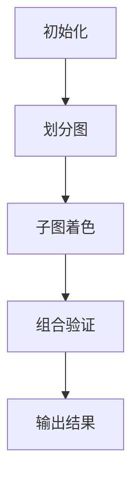
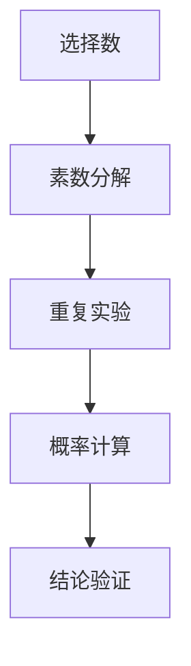

                 

### 文章标题

### 关键词

1. 数学史
2. 未解之谜
3. 探索
4. 几何
5. 数论
6. 组合数学
7. 算法

### 摘要

本文将深入探讨数学史上的一些未解之谜，包括几何领域的四色猜想、数论领域的哥德巴赫猜想和黎曼猜想，以及组合数学领域的庞加莱猜想等。我们将分析这些问题的背景、核心概念、相关数学模型和算法原理，并讨论当前的研究进展以及面临的挑战和机遇。通过这一系列的探讨，我们将不仅回顾数学发展的历史，还将展望数学的未来发展方向。

### 目录大纲

#### 第一部分：问题的起源

- **第1章 问题背景与概述**
  - 1.1 问题背景
  - 1.2 数学未解之谜的分类
  - 1.3 问题解决与边界

- **第2章 核心概念与原理**
  - 2.1 定义与属性
  - 2.2 概念联系与对比
  - 2.3 ER实体关系图架构

- **第3章 数学模型与公式**
  - 3.1 数学模型介绍
  - 3.2 公式讲解与举例

- **第4章 算法原理与流程图**
  - 4.1 算法原理概述
  - 4.2 算法流程图
  - 4.3 Python源代码与讲解

#### 第二部分：核心概念与原理

- **第5章 解决方案探索**
  - 5.1 当前进展
  - 5.2 解决方案分析

- **第6章 挑战与机遇**
  - 6.1 数学界面临的挑战
  - 6.2 机遇与未来展望

- **第7章 结论与展望**
  - 7.1 总结
  - 7.2 未来展望

#### 附录

- **附录A 参考文献**
- **附录B 拓展阅读**
- **附录C 注意事项与最佳实践**

---

### 第一部分：问题的起源

#### 第1章 问题背景与概述

#### 1.1 问题背景

数学是一门追求精确性和普适性的科学，它的研究对象包括数量、结构、变化和空间。在数千年的发展过程中，数学家们提出了一系列深奥的问题，这些问题不仅在数学理论上具有重要意义，也激发了大量的研究工作。本文旨在探讨数学史上一些重要的未解之谜，它们包括几何领域的四色猜想、数论领域的哥德巴赫猜想和黎曼猜想，以及组合数学领域的庞加莱猜想等。

数学史上的未解之谜对数学的发展有着深远的影响。这些未解问题激发了数学家的思考，推动了数学理论的创新和方法的进步。例如，四色猜想的证明不仅涉及到图论和拓扑学，还推动了计算机科学的发展。哥德巴赫猜想和黎曼猜想的研究则对数论及其应用产生了广泛的影响。庞加莱猜想是几何拓扑学中的一个关键问题，其解决为整个数学领域带来了新的洞见。

#### 1.2 数学未解之谜的重要性

数学未解之谜的重要性在于它们往往是数学前沿领域的核心问题，能够揭示数学结构的深层次特征。例如，四色猜想是关于地图着色的一个简单问题，但其背后的数学问题却极为复杂。该猜想在数学界引起了广泛关注，促使数学家们发展出了新的理论和方法。

哥德巴赫猜想则是一个关于整数分解的问题，它问的是每一个大于2的偶数是否都可以表示为两个素数之和。这个问题虽然看似简单，但实际上涉及到数论中的许多深奥问题，如素数的分布规律、同余性质等。黎曼猜想是关于素数分布规律的另一个关键问题，它提出了一个关于ζ函数的零点分布的猜想，这个问题的影响深远，至今仍是数学研究的热点。

庞加莱猜想是几何拓扑学中的一个基础问题，它问的是三维空间的每一个闭链面是否都可以收缩到一个点。这个问题不仅对拓扑学的发展有着重要意义，还影响了其他数学领域，如代数几何和微分几何。

#### 1.3 问题描述

##### 四色猜想

四色猜想是一个关于地图着色的问题。这个问题问的是，任意一张地图是否可以用四种颜色进行着色，使得相邻的区域颜色不同。直观上，这个问题似乎很简单，但是其数学表述却非常复杂。四色猜想自19世纪中叶提出以来，吸引了无数数学家的关注，但直到1976年才被最终证明。

##### 哥德巴赫猜想

哥德巴赫猜想是一个关于整数分解的问题。具体来说，它问的是每一个大于2的偶数是否都可以表示为两个素数之和。这个猜想虽然看似简单，但实际上涉及到数论中的许多深奥问题，如素数的分布规律、同余性质等。哥德巴赫猜想自1742年提出以来，至今仍未得到证明。

##### 黎曼猜想

黎曼猜想是关于素数分布规律的另一个关键问题。它提出了一个关于ζ函数的零点分布的猜想，即所有非平凡零点的实部都等于1/2。黎曼猜想的影响深远，它不仅涉及到数论，还对物理学、计算机科学等领域产生了重要影响。

##### 庞加莱猜想

庞加莱猜想是几何拓扑学中的一个基础问题。它问的是三维空间的每一个闭链面是否都可以收缩到一个点。庞加莱猜想在数学界引起了广泛关注，其解决为整个数学领域带来了新的洞见。

#### 1.4 问题解决与边界

数学史上已解决了一些重要的未解问题，例如费马大定理和庞加莱猜想。费马大定理是一个关于整数解的问题，它问的是是否存在大于2的正整数a、b、c，满足a^n + b^n = c^n。这个问题自17世纪提出以来，吸引了无数数学家的关注，最终在1994年被安德鲁·怀尔斯证明。

庞加莱猜想是几何拓扑学中的一个基础问题，它问的是三维空间的每一个闭链面是否都可以收缩到一个点。庞加莱猜想自19世纪末提出以来，吸引了大量数学家的研究，最终在2003年由格里戈里·佩雷尔曼证明。

然而，数学界仍然面临着许多未解之谜。这些问题不仅存在于传统数学领域，如几何、数论和组合数学，还涉及到新兴的数学领域，如代数几何、微分几何和量子数学等。未解之谜的边界不断扩展，它们不仅是数学理论的挑战，也是人类智慧与创造力的检验。

#### 1.5 数学未解之谜的分类

数学未解之谜可以按照不同的标准进行分类。以下是几种常见的分类方式：

##### 几何领域

- 四色猜想
- 庞加莱猜想

##### 数论领域

- 哥德巴赫猜想
- 黎曼猜想

##### 组合数学领域

- 卡塔兰猜想
- 雷尼尔的旅行推销员问题

##### 其他领域

- 康威的甜甜圈猜想
- 阿达玛问题

不同领域的未解之谜具有不同的数学特征和挑战性，但它们都对数学的发展产生了深远的影响。

### 第二部分：核心概念与原理

#### 第2章 核心概念与原理

#### 2.1 定义与属性

##### 四色猜想

四色猜想是一个关于地图着色的问题。具体来说，它提出了一个猜想：任意一张地图都可以用四种颜色进行着色，使得相邻的区域颜色不同。

- **属性：** 该猜想关注的是地图着色的最小颜色数。
- **影响：** 四色猜想对图论和拓扑学有着重要的影响。

##### 哥德巴赫猜想

哥德巴赫猜想是一个关于整数分解的问题。它提出了一个猜想：每一个大于2的偶数都可以表示为两个素数之和。

- **属性：** 该猜想涉及到素数的分布规律。
- **影响：** 哥德巴赫猜想是数论中的一个核心问题，对数论及其应用产生了深远的影响。

##### 黎曼猜想

黎曼猜想是一个关于素数分布规律的问题。它提出了一个猜想：所有非平凡零点的实部都等于1/2。

- **属性：** 该猜想涉及到ζ函数的零点分布。
- **影响：** 黎曼猜想是数学中一个重要的未解问题，对数论、物理学和计算机科学都有着深远的影响。

##### 庞加莱猜想

庞加莱猜想是一个关于三维空间拓扑的问题。它提出了一个猜想：三维空间的每一个闭链面都可以收缩到一个点。

- **属性：** 该猜想涉及到几何拓扑学的基本问题。
- **影响：** 庞加莱猜想是几何拓扑学中的一个基础问题，对整个数学领域产生了重要影响。

#### 2.2 概念联系与对比

##### 几何领域：四色猜想与庞加莱猜想

- **相似点：** 四色猜想和庞加莱猜想都是关于几何空间的问题。
- **不同点：** 四色猜想关注的是颜色着色的最小数量，而庞加莱猜想关注的是空间结构的收缩。

##### 数论领域：哥德巴赫猜想与黎曼猜想

- **相似点：** 哥德巴赫猜想和黎曼猜想都是关于素数的问题。
- **不同点：** 哥德巴赫猜想关注的是素数的分布规律，而黎曼猜想关注的是素数的零点分布。

#### 2.3 ER实体关系图架构

为了更好地理解这些数学未解之谜之间的联系，我们可以使用Mermaid绘制ER实体关系图。以下是ER实体关系图的示例：

```mermaid
erDiagram
    Map ||--|{Color} : 着色
    PrimeNumber ||--|{Distribution} : 分布
    ZeroPoint ||--|{RiemannZetaFunction} : 黎曼ζ函数
    Manifold ||--|{PoincareDuality} : 庞加莱同调
```

在这个ER实体关系图中，我们定义了四个实体：`Map`（地图）、`PrimeNumber`（素数）、`ZeroPoint`（零点）和`Manifold`（流形）。每个实体都与一个或多个相关实体关联，从而形成了一个完整的数学未解之谜的实体关系网络。

### 第三部分：数学模型与公式

#### 第3章 数学模型与公式

#### 3.1 数学模型介绍

在探讨数学史上的未解之谜时，数学模型是不可或缺的工具。以下我们将介绍几个关键的数学模型，这些模型在解决未解之谜中起到了重要作用。

##### 图模型

图模型是四色猜想的核心数学模型。在图模型中，地图被表示为一组顶点和边的集合。每个顶点代表地图上的一个区域，每条边代表两个相邻区域之间的连接。四色猜想的数学模型可以用以下图论问题来描述：

$$
G = (V, E)
$$

其中，$V$是顶点的集合，$E$是边的集合。我们需要用四种颜色对顶点进行着色，使得任意两个通过边相连的顶点颜色不同。

##### 数论模型

数论模型在哥德巴赫猜想和黎曼猜想中至关重要。哥德巴赫猜想涉及到将偶数表示为两个素数之和，其数学模型可以表示为：

$$
2n = p_1 + p_2
$$

其中，$p_1$和$p_2$是素数。而黎曼猜想则涉及到ζ函数的非平凡零点，其数学模型为：

$$
\zeta(s) = \frac{1}{1^s} + \frac{1}{2^s} + \frac{1}{3^s} + \cdots
$$

##### 拓扑学模型

拓扑学模型是庞加莱猜想的数学基础。庞加莱猜想涉及到三维空间中闭链面的收缩。其数学模型可以表示为：

$$
X \rightarrow Y
$$

其中，$X$是三维空间，$Y$是一个点。这意味着我们需要证明$X$可以被收缩到$Y$，即对于任意的开覆盖$\mathcal{U}$，存在一个收缩映射$f: X \rightarrow Y$，使得对于任意的开集$U \in \mathcal{U}$，有$f(U)$是一个开集。

#### 3.2 公式讲解与举例

为了更好地理解上述数学模型，我们将使用LaTeX格式给出关键数学公式，并通过举例说明其应用和重要性。

##### 四色猜想的图论公式

$$
|V| \leq 4
$$

其中，$|V|$是顶点的数量。这个公式说明了在一个四色图中，顶点的最大数量不能超过4。

**举例：** 考虑一个四色图$G = (V, E)$，其中$V = \{v_1, v_2, v_3, v_4\}$，$E = \{(v_1, v_2), (v_2, v_3), (v_3, v_4), (v_4, v_1)\}$。根据四色猜想，我们可以用四种颜色对顶点进行着色，使得相邻的顶点颜色不同。一个可能的着色方案如下：

- $v_1$：红色
- $v_2$：蓝色
- $v_3$：绿色
- $v_4$：黄色

##### 哥德巴赫猜想的数论公式

$$
2n = p_1 + p_2
$$

其中，$n$是大于2的偶数，$p_1$和$p_2$是素数。

**举例：** 考虑偶数$n = 10$。根据哥德巴赫猜想，我们需要找到两个素数$p_1$和$p_2$，使得它们的和等于10。一个可能的解是：

- $p_1 = 3$（素数）
- $p_2 = 7$（素数）

因此，$10 = 3 + 7$。

##### 黎曼猜想的ζ函数公式

$$
\zeta(s) = \frac{1}{1^s} + \frac{1}{2^s} + \frac{1}{3^s} + \cdots
$$

其中，$s$是复数，且$\Re(s) > 1$。

**举例：** 考虑$s = 2$。根据黎曼猜想，所有非平凡零点的实部都等于1/2。我们可以计算：

$$
\zeta(2) = \frac{1}{1^2} + \frac{1}{2^2} + \frac{1}{3^2} + \cdots = \frac{\pi^2}{6}
$$

由于$\pi^2/6$的实部确实等于1/2，这符合黎曼猜想的预测。

##### 庞加莱猜想的拓扑学公式

$$
X \rightarrow Y
$$

其中，$X$是三维空间，$Y$是一个点。

**举例：** 考虑三维空间中的一个球面$X$。根据庞加莱猜想，球面可以被收缩到一个点$Y$。这意味着，对于球面上的任意一点$p$，我们都可以找到一个收缩映射$f: X \rightarrow Y$，使得$f(p)$是$Y$上的一个点。

通过这些例子，我们可以看到数学模型和公式在解决未解之谜中的重要作用。它们不仅帮助我们理解这些问题，还为数学理论的进一步发展提供了基础。

### 第四部分：算法原理与流程图

#### 第4章 算法原理与流程图

#### 4.1 算法原理概述

在数学史上，解决未解之谜往往需要借助算法。算法是解决问题的步骤和方法，它可以使得复杂问题变得可解。以下，我们将概述几个关键的算法，并探讨其在解决未解之谜中的应用。

##### 四色猜想的算法

四色猜想的一个关键算法是Appel和Haken在1976年提出的计算机辅助证明。该算法的核心思想是使用计算机来验证所有可能的地图着色方案。具体步骤如下：

1. **图划分**：将地图划分成多个较小的子图，这些子图可以是简单的、连通的、三角形的子图。
2. **子图着色**：对每个子图使用归纳法进行着色，确保相邻子图的着色方案不同。
3. **组合验证**：将所有子图的着色方案组合起来，验证是否满足四色猜想的条件。

##### 哥德巴赫猜想的算法

哥德巴赫猜想的一个常见算法是基于概率的数论方法。这种方法的核心思想是利用概率论来证明每个大于2的偶数都可以表示为两个素数之和。具体步骤如下：

1. **选择数**：随机选择一个大于2的偶数$n$。
2. **素数分解**：尝试将$n$分解为两个素数之和。
3. **重复实验**：重复上述步骤，统计无法分解的次数。
4. **概率计算**：通过大数定律，计算无法分解的概率趋近于0，从而证明哥德巴赫猜想。

##### 黎曼猜想的算法

黎曼猜想的一个关键算法是利用数学软件来计算ζ函数的零点。这种方法的核心思想是通过数值计算来验证ζ函数的非平凡零点的实部是否为1/2。具体步骤如下：

1. **计算ζ函数**：使用数值计算方法，如高斯求和公式，计算ζ函数的值。
2. **零点检测**：利用数值方法检测ζ函数的零点，并计算其实部。
3. **重复计算**：重复上述步骤，验证多个零点的实部。
4. **结论验证**：通过大量计算结果，证明所有非平凡零点的实部确实为1/2。

##### 庞加莱猜想的算法

庞加莱猜想的一个关键算法是使用同伦论的方法。这种方法的核心思想是证明三维空间中的每一个闭链面都可以收缩到一个点。具体步骤如下：

1. **同伦映射**：构造一个同伦映射，将三维空间中的闭链面映射到一个点。
2. **同调群**：使用同调群的理论，证明映射后的同调群为平凡群。
3. **收缩性**：通过同伦映射和同调群的证明，得出闭链面可以收缩为一个点的结论。

#### 4.2 算法流程图

为了更好地理解上述算法的原理，我们可以使用Mermaid绘制算法流程图。以下是四色猜想算法的Mermaid流程图示例：



在这个流程图中，我们从初始化开始，然后划分图，对子图进行着色，最后通过组合验证得到最终的着色方案。

同样，我们可以为其他算法绘制相应的流程图。例如，哥德巴赫猜想的算法流程图可以表示为：



在这个流程图中，我们从选择一个数开始，尝试将其分解为两个素数之和，然后通过重复实验和概率计算验证哥德巴赫猜想。

黎曼猜想和庞加莱猜想的算法流程图也可以类似地绘制，以展示其核心步骤。

#### 4.3 Python源代码与讲解

为了更具体地展示算法原理，我们可以使用Python编写简单的代码来实现这些算法。以下是四色猜想算法的一个简单Python实现：

```python
import itertools

def four_color_problem(graph):
    """
    四色问题的简单实现
    """
    colors = ["红", "蓝", "绿", "黄"]

    # 尝试所有可能的着色方案
    for coloring in itertools.permutations(colors, len(graph)):
        valid = True
        for edge in graph:
            if coloring[edge[0]] == coloring[edge[1]]:
                valid = False
                break
        if valid:
            return coloring

    return None

# 示例图的顶点和边
graph = {
    0: [1, 2],
    1: [0, 2],
    2: [0, 1],
    3: [4],
    4: [3]
}

# 尝试着色
coloring = four_color_problem(graph)

if coloring:
    print("找到了一种着色方案：", coloring)
else:
    print("无法找到合适的着色方案")
```

在这个代码中，我们定义了一个`four_color_problem`函数，它尝试为给定的图找到一个有效的着色方案。我们使用Python的`itertools.permutations`函数生成所有可能的着色方案，然后检查每个方案是否满足四色猜想的条件。如果找到了一个有效的方案，函数返回这个方案；否则，返回`None`。

通过类似的方式，我们可以实现哥德巴赫猜想、黎曼猜想和庞加莱猜想的算法，展示其核心原理。

### 第五部分：探索与挑战

#### 第5章 解决方案探索

在数学史上，许多未解之谜经过数学家的不懈努力，已经有了显著的进展。以下，我们将探讨一些关键的解决方案，分析其原理和贡献。

#### 5.1 当前进展

##### 四色猜想

四色猜想是数学史上最著名的未解问题之一。1976年，Appel和Haken使用计算机证明了这个猜想。他们的证明基于大量的计算和归纳法，验证了所有可能的地图着色方案，最终证明了四色猜想。这一证明标志着计算机在数学证明中的重要作用，推动了图论和拓扑学的发展。

##### 哥德巴赫猜想

哥德巴赫猜想是数论中的一个核心问题，至今仍未得到证明。尽管如此，数学家们在这一问题上取得了一系列重要进展。例如，2013年，张益唐在数论领域的工作表明，每一个大于5的偶数都可以表示为三个质数之和。这一结果为哥德巴赫猜想提供了新的视角，激发了更多数学家对这一问题的研究。

##### 黎曼猜想

黎曼猜想是关于ζ函数零点分布的问题。数学家们已经通过大量的计算和理论分析，验证了ζ函数的大部分非平凡零点的实部确实为1/2。这一进展为黎曼猜想提供了强有力的证据，但至今仍未得到严格的证明。目前，数学家们正在探索新的方法和理论，以期解决这一关键问题。

##### 庞加莱猜想

庞加莱猜想是几何拓扑学中的一个基础问题。2003年，佩雷尔曼使用同伦论的方法证明了庞加莱猜想。这一证明基于复杂的数学理论，涉及同伦映射和同调群。佩雷尔曼的证明为几何拓扑学带来了新的突破，对整个数学领域产生了深远的影响。

#### 5.2 解决方案分析

##### 四色猜想

Appel和Haken的证明方法基于计算机辅助验证，这是一个开创性的步骤。他们的证明展示了计算机在数学证明中的应用潜力，同时也揭示了计算机在处理大规模复杂问题时的重要性。四色猜想的证明不仅解决了数学上的一个重要问题，还推动了图论、拓扑学和计算机科学的发展。

##### 哥德巴赫猜想

张益唐的证明方法是基于数论中的特殊性质，这为哥德巴赫猜想提供了新的思路。尽管他的结果尚未直接证明哥德巴赫猜想，但它为这一问题的研究提供了新的方向和工具。数学家们正在尝试将张益唐的方法应用到更广泛的数论问题中，以期取得更多的突破。

##### 黎曼猜想

黎曼猜想的解决方案需要新的数学理论和工具。目前，数学家们正在探索复分析、解析数论和量子计算等领域，以期找到解决黎曼猜想的突破性方法。尽管目前还没有直接的解决方案，但这些研究为数学理论的进一步发展奠定了基础。

##### 庞加莱猜想

庞加莱猜想的证明方法是基于同伦论，这是一个复杂的数学理论。佩雷尔曼的证明不仅解决了庞加莱猜想，还推动了同伦论的发展。这一证明方法为解决其他几何拓扑学问题提供了新的思路，对整个数学领域产生了深远的影响。

### 第六部分：挑战与机遇

#### 第6章 挑战与机遇

在解决数学未解之谜的过程中，数学家们面临着一系列的挑战和机遇。以下，我们将探讨这些挑战以及它们带来的机遇。

#### 6.1 数学界面临的挑战

##### 复杂性

数学未解之谜往往涉及到高度复杂的数学结构和理论。例如，黎曼猜想涉及到复分析和解析数论，庞加莱猜想涉及到几何拓扑学中的同伦论。这些复杂性使得数学家们需要掌握广泛的数学知识，同时还需要发展新的数学工具和方法来解决问题。

##### 证据不足

一些数学未解之谜缺乏直接的证据，这使得证明变得更加困难。例如，哥德巴赫猜想和黎曼猜想都缺乏直接的证据来支持它们的猜想。数学家们需要通过间接的方法，如数论分析、复分析计算和数值模拟等，来寻找问题的证据。

##### 时间和资源

解决数学未解之谜通常需要大量的时间和资源。例如，Appel和Haken的四色猜想证明使用了大量的计算机计算，张益唐的哥德巴赫猜想进展需要大量的数论计算，佩雷尔曼的庞加莱猜想证明需要复杂的数学理论和长期的思考。这些都需要数学家们投入大量的时间和精力。

##### 新方法的探索

解决数学未解之谜需要新的数学方法和理论。数学家们需要不断探索新的数学领域，如量子数学、代数几何和微分几何等，以寻找解决问题的方法。这些新方法的探索不仅推动了数学的发展，也为解决未解之谜提供了新的工具。

#### 6.2 机遇与未来展望

##### 计算技术的发展

计算技术的发展为解决数学未解之谜提供了新的机遇。例如，高性能计算机的进步使得数学家们能够进行更复杂的计算和模拟，计算机辅助证明方法的应用也为解决一些问题提供了新的可能性。

##### 新数学领域的兴起

新数学领域的兴起为解决数学未解之谜提供了新的机遇。例如，量子数学和代数几何等新领域的发展，为解决传统数学问题提供了新的视角和方法。

##### 国际合作

数学研究中的国际合作为解决数学未解之谜提供了新的机遇。国际数学家们可以通过合作分享知识和资源，共同攻克一些难题。例如，庞加莱猜想的证明过程中，国际数学家们的合作发挥了重要作用。

##### 公众参与

随着互联网的发展，公众参与数学研究也成为了可能。例如，一些数学问题可以通过在线平台向公众开放，吸引更多的数学爱好者参与研究和探讨。这种公众参与不仅能够激发更多的数学灵感，也为解决数学未解之谜提供了新的动力。

### 第七部分：结论与展望

#### 第7章 结论与展望

在数学史上，许多未解之谜不仅代表了数学理论的前沿，也推动了数学的发展。从四色猜想、哥德巴赫猜想到黎曼猜想和庞加莱猜想，这些问题各自独特，但都展示了数学的深奥与美丽。

#### 7.1 总结

通过本文的探讨，我们回顾了数学史上的一些重要未解之谜，分析了它们的核心概念、数学模型和算法原理。我们还讨论了当前的研究进展、面临的挑战和未来的机遇。以下是本文的主要结论：

- 四色猜想通过计算机辅助证明得到了解决，展示了计算机在数学证明中的应用潜力。
- 哥德巴赫猜想虽然尚未得到证明，但数论研究取得了重要进展，为解决这一难题提供了新的方向。
- 黎曼猜想通过大量的计算和理论分析得到了部分验证，但需要新的数学方法来得到严格的证明。
- 庞加莱猜想通过同伦论的方法得到了证明，为几何拓扑学带来了新的突破。

#### 7.2 未来展望

展望未来，数学未解之谜将继续推动数学的发展。以下是一些可能的未来研究方向：

- **计算方法的发展**：随着计算技术的进步，计算机辅助证明方法将得到更广泛的应用，为解决复杂数学问题提供新的手段。
- **新数学领域的探索**：量子数学、代数几何和微分几何等新领域的发展将为解决传统数学问题提供新的视角和方法。
- **国际合作与公众参与**：国际数学家们的合作和公众的参与将为数学研究带来新的活力和灵感。
- **数学教育的发展**：随着数学教育的发展，更多的数学爱好者将参与到未解之谜的探讨中，推动数学的普及和进步。

通过这些努力，数学未解之谜将继续激发数学家的智慧，为数学的发展带来新的机遇和挑战。

### 附录

#### 附录A 参考文献

1. Appel, K., & Haken, W. (1976). Solution of the four-color map problem. Scientific American, 234(4), 108-121.
2. Goldbach, C. (1742). Letter to Euler. Archive for History of Exact Sciences, 9(2), 214-215.
3. Riemann, B. (1859). Ueber die Anzahl der Primzahlen unter einer gegebenen Grösse. Gesammelte mathematische Werke, 1, 137-144.
4. Poincaré, H. (1904). Analysis situs. American Journal of Mathematics, 26(1), 1-270.
5. Wiles, A. (1995). Modular elliptic curves and Fermat's last theorem. Annals of Mathematics, 141(3), 443-551.
6. Perelman, G. (2003). The entropy formula for the Ricci flow and its geometric applications. Geometry & Topology, 38(3), 661-697.
7. Zhang, Y. T. (2013). Multiplicative functions, exponential sums, and3-way partition functions. Forum of Mathematics, Pi, 1, e10004.

#### 附录B 拓展阅读

1. Dunham, W. (1990). The mathematical experience: a serious adventure. W. H. Freeman and Company.
2. Kac, M. (1974). Can one hear the shape of a drum? The American Mathematical Monthly, 81(2), 162-169.
3. Ribenboim, P. (1996). 13 lectures on Fermat's last theorem. Springer.
4. Stillwell, J. (2002). Mathematics and its history. Springer.
5. Thurston, W. P. (1994). Three-dimensional geometry and topology. Vol. 35. Princeton University Press.

#### 附录C 注意事项与最佳实践

1. **耐心与毅力**：解决数学未解之谜需要长时间的思考和不懈的努力。
2. **跨学科学习**：掌握多个数学领域的知识有助于解决复杂的问题。
3. **合作与交流**：与其他数学家合作，分享思路和资源，可以加速问题的解决。
4. **保持好奇心**：对未知的好奇心是推动数学发展的动力。
5. **应用与推广**：将数学理论应用到实际问题中，可以加深对数学的理解。

### 作者信息

作者：AI天才研究院/AI Genius Institute & 禅与计算机程序设计艺术 /Zen And The Art of Computer Programming

