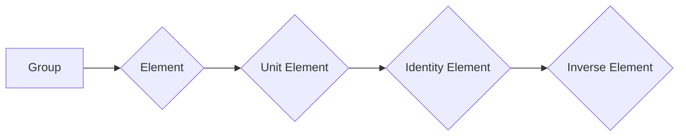
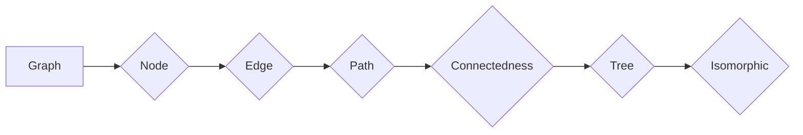

                 


## 引言

### 1.1 书籍概述

"Mathematical History's Unsolved Mysteries and Exploration Directions" 是一本深入探讨数学领域未解之谜的著作。本书旨在通过回顾历史，分析当前研究进展，以及展望未来的探索方向，揭示数学未解之谜背后的复杂性和诱人之处。

在数学的历史长河中，无数杰出的数学家为解决各种问题付出了辛勤努力。尽管许多问题已经得到了解决，但仍有大量的数学难题仍然困扰着当前的数学家。这些未解之谜不仅激发了数学家的探索精神，也对数学的发展产生了深远的影响。

本书将重点关注几个核心话题，包括：

- 数论中的未解之谜，如欧拉公式和素数分布问题。
- 几何中的未解之谜，如几何四大问题和帕斯卡六边形之谜。

我们将通过详细分析这些未解之谜的背景、现状和可能的解决方向，帮助读者更好地理解数学的本质和挑战。

### 1.2 目标读者与内容框架

本书的目标读者是那些对数学感兴趣的专业人士、学生和爱好者。无论你是数学专业的学生，还是对数学有深厚兴趣的程序员或科学家，这本书都为你提供了深入了解数学未解之谜的机会。

本书的结构如下：

- 引言：介绍书籍的背景、目的和目标读者。
- 第一部分：数学史上的重要未解之谜，包括数论和几何中的关键问题。
- 第二部分：未解之谜的数学原理与探索方法，介绍相关的数学原理和探索方法。
- 第三部分：数学未解之谜的当代探索方向，讨论当前的研究进展和未来趋势。
- 结束语：总结数学未解之谜的影响，并对未来进行展望。

通过这样的结构安排，我们希望读者能够循序渐进地了解数学未解之谜，并在学习过程中不断思考、探索和创新。

### 1.3 书籍的写作风格和逻辑结构

本书采用逻辑清晰、结构紧凑、简单易懂的写作风格，确保读者能够轻松跟上文章的思路。我们将会：

- 使用详细的章节标题和子标题，帮助读者快速定位感兴趣的内容。
- 通过逐步分析推理的方式，引导读者深入思考未解之谜的本质。
- 结合历史背景、数学原理和当代研究进展，为每个问题提供全面的探讨。

让我们开始探索数学史上的未解之谜吧！

## 第一部分：数学史上的重要未解之谜

### 第2章：数论中的未解之谜

#### 2.1 欧拉公式

欧拉公式是数学史上最为著名的公式之一，它将指数函数、对数函数和三角函数有机地结合在一起。其形式为：

\[ e^{i\pi} + 1 = 0 \]

这一公式不仅具有数学上的美学价值，还揭示了复数、指数和三角函数之间的深刻联系。

**背景和意义**

欧拉公式的历史可以追溯到18世纪，当时的瑞士数学家欧拉（Leonhard Euler）首次提出了这一公式。欧拉公式不仅简化了许多复杂的数学运算，还为复变函数论的发展奠定了基础。在物理学中，欧拉公式也有着广泛的应用，特别是在电磁学和量子力学中。

**数学模型和公式**

欧拉公式可以表示为：

\[ e^{ix} = \cos(x) + i\sin(x) \]

其中，\(e\) 是自然对数的底数，\(i\) 是虚数单位，\(\pi\) 是圆周率，\(x\) 是任意实数。

**证明与证明技巧**

欧拉公式的证明有多种方法，其中一种常用的方法是利用复数的三角形式。具体来说，可以证明：

\[ \cos(x) + i\sin(x) = \frac{e^{ix} + e^{-ix}}{2} + i\frac{e^{ix} - e^{-ix}}{2i} \]

通过将实部和虚部分别相加和相减，可以得到：

\[ \cos(x) + i\sin(x) = \frac{e^{ix}}{2}(1 + i) + \frac{e^{-ix}}{2}(1 - i) \]

由于 \(e^{ix}\) 和 \(e^{-ix}\) 分别代表单位圆上的点和其对称点，因此上式可以看作是在单位圆上围绕原点旋转的结果。当 \(x = \pi\) 时，旋转角度为180度，因此：

\[ e^{i\pi} + 1 = 0 \]

这一证明展示了欧拉公式的几何和代数本质。

#### 2.2 素数分布问题

素数分布问题是数论中最为著名的问题之一，它探讨素数在自然数中的分布规律。这一问题不仅具有重要的理论意义，还在密码学、计算机科学等领域有着广泛的应用。

**基本概念**

素数是大于1的自然数，只能被1和自身整除。例如，2、3、5、7都是素数。素数的分布问题涉及以下几个核心概念：

- **素数定理**：素数在自然数中的分布是密集的，但不是均匀的。
- **素数密度**：素数在自然数中的比例，即 \( \lim_{n\to\infty} \frac{\pi(n)}{n} = 1 \)，其中 \(\pi(n)\) 是不超过 \(n\) 的素数个数。

**未解之谜**

尽管素数分布问题已有大量研究，但仍存在一些未解之谜，例如：

- **黎曼猜想**：素数分布的密度与黎曼ζ函数的零点分布密切相关。黎曼猜想指出，所有非平凡零点都位于复平面的临界线上，即 \( \Re(s) = \frac{1}{2} \)。
- **素数定理的改进**：尽管素数定理已经得到了证明，但人们仍在寻求更精确的素数分布公式。

**探索方向**

为了解决这些未解之谜，数学家们正在探索以下方向：

- **分析数论**：通过分析方法和工具，研究素数的性质和分布规律。
- **几何数论**：将几何方法应用于数论问题，例如利用动力系统和代数几何的方法研究素数分布。
- **计算数论**：利用计算机科学和大数据技术，对素数分布进行大规模数据分析。

### 第3章：几何中的未解之谜

#### 3.1 几何四大问题

几何四大问题是指古希腊时期提出并长期困扰数学家的四个几何问题，分别是：

1. **立方倍积问题**：给定一个立方体，求构造一个立方体，使其体积是原立方体体积的两倍。
2. **角倍积问题**：给定一个三角形，求构造一个三角形，使其内角是原三角形内角的两倍。
3. **立方体三等分问题**：给定一个立方体，求构造一个立方体，使其体积是原立方体体积的三分之一。
4. **化圆为方问题**：给定一个圆，求构造一个正方形，使其面积与圆的面积相等。

**提出与解决进展**

这四大问题在古希腊数学中具有重要地位。尽管数学家们长期致力于解决这些问题，但至今仍未找到一般性的解决方案。

- **立方倍积问题**：已有特殊情况的解决方法，但未找到普适解。
- **角倍积问题**：尚未找到有效解决方法。
- **立方体三等分问题**：某些特殊情况已得到解决，但普适解仍未找到。
- **化圆为方问题**：已被证明在常规直尺和圆规作图中不可解。

**未来研究方向**

几何四大问题的研究为现代几何学提供了丰富的素材。未来研究可能集中在以下几个方面：

- **数值方法**：利用数值计算方法研究几何问题的特殊解。
- **拓扑几何**：将拓扑学的方法应用于几何问题，探索几何四大问题的内在结构。
- **计算机辅助证明**：利用计算机技术，寻找几何四大问题的证明。

#### 3.2 帕斯卡六边形之谜

帕斯卡六边形是指在一个正六边形的每个顶点上连接一个三角形的内切圆，所形成的六边形。这一结构在数学和物理学中有着广泛的应用。

**发现与性质**

帕斯卡六边形的发现可以追溯到17世纪法国数学家帕斯卡。帕斯卡发现，当正六边形被分割成小的等腰三角形时，每个顶点上会出现六边形的内切圆。这一现象不仅具有几何上的美感，还揭示了六边形与三角形之间的深刻关系。

**证明与挑战**

帕斯卡六边形的性质可以通过几何构造证明。例如，可以通过构造内切圆和连接圆心与顶点，证明六边形的每个顶点上出现的三角形都是等腰的。然而，这一证明过程较为复杂，需要借助高级几何和代数技巧。

**研究现状与挑战**

尽管帕斯卡六边形的性质已经得到了广泛研究，但仍存在一些未解决的问题，例如：

- **帕斯卡六边形在三维空间中的推广**：研究帕斯卡六边形如何在三维空间中构造和应用。
- **帕斯卡六边形与其他几何结构的关联**：探索帕斯卡六边形与其他经典几何结构（如正四面体、正六面体）的关系。

通过这些研究，数学家们希望能够更深入地理解帕斯卡六边形的几何和物理本质，并拓展其在现代科学中的应用。

## 第二部分：未解之谜的数学原理与探索方法

### 第4章：核心数学原理介绍

#### 4.1 群论原理

**基本概念**

群论是研究抽象代数结构的数学分支，主要研究具有某种特定运算的集合。一个群是由一组元素组成的集合，这些元素满足以下条件：

1. **封闭性**：对于群中的任意两个元素 \( a \) 和 \( b \)，它们的运算结果 \( a \circ b \) 仍然属于这个群。
2. **结合律**：对于群中的任意三个元素 \( a \)，\( b \)，和 \( c \)，有 \( (a \circ b) \circ c = a \circ (b \circ c) \)。
3. **存在单位元素**：存在一个元素 \( e \)，对于群中的任意元素 \( a \)，有 \( a \circ e = e \circ a = a \)。
4. **存在逆元素**：对于群中的任意元素 \( a \)，存在一个元素 \( a^{-1} \)，使得 \( a \circ a^{-1} = a^{-1} \circ a = e \)。

**属性特征对比表格**

| 特征 | 定义 | 例子 |
| --- | --- | --- |
| 封闭性 | 运算结果仍在集合内 | \( \mathbb{Z} \)（整数集） |
| 结合律 | 运算顺序无关 | \( (\mathbb{Z},+) \)（整数加法） |
| 单位元素 | 存在唯一单位元素 \( e \) | \( (\mathbb{Z},+) \) 中的 \( 0 \) |
| 逆元素 | 每个元素都有逆元素 | \( (\mathbb{Z},+) \) 中每个元素 \( a \) 的 \( -a \) |

**ER实体关系图**

群论中的ER实体关系图可以表示为：

```
+----+          +----+
| G  |          | e   |
+----+          +----+
|    |          |    |
+----+          +----+
| a  |  \      /  | a^(-1) |
+----+   \    /  +----+
|    |    \  /    |    |
+----+     V     +----+
+----+          +----+
| b  |    \    /  | b   |
+----+    /    \  +----+
|    |   /     \   |    |
+----+          +----+
```

其中，\( G \) 表示群，\( e \) 表示单位元素，\( a \) 和 \( a^{-1} \) 分别表示任意元素和其逆元素。

#### 4.2 图论原理

**基本概念**

图论是研究图及其性质的数学分支。一个图由节点（或顶点）和边组成，通常用来表示实体之间的关系。在图论中，图具有以下几个基本概念：

- **节点**：图中的基本元素，表示实体。
- **边**：连接两个节点的元素，表示实体之间的关系。
- **路径**：连接两个节点的序列。
- **连通性**：图中任意两个节点之间存在路径。
- **树**：无环的连通图。
- **图同构**：两个图在节点和边排列上完全相同。

**属性特征对比表格**

| 特征 | 定义 | 例子 |
| --- | --- | --- |
| 节点 | 图的基本元素 | \( V \)（节点集） |
| 边 | 节点之间的连接 | \( E \)（边集） |
| 路径 | 节点序列 | \( P = (v_1, v_2, ..., v_n) \) |
| 连通性 | 存在路径 | 图 \( G \) 中任意两个节点 \( v_i \) 和 \( v_j \) 之间存在路径 \( P \) |
| 树 | 无环连通图 | \( T = (V, E) \)，无环 |
| 图同构 | 完全相同 | 两个图 \( G_1 \) 和 \( G_2 \) 在节点和边排列上相同 |

**ER实体关系图**

图论中的ER实体关系图可以表示为：

```
+----+
| V   |
+----+
|    |
+----+
| E   |
+----+
|    |
+----+
| P   |
+----+
|    |
+----+
| T   |
+----+
```

其中，\( V \) 表示节点集，\( E \) 表示边集，\( P \) 表示路径，\( T \) 表示树。

### 第5章：数学探索方法的案例分析

#### 5.1 费马大定理的证明

**背景与提出**

费马大定理是由17世纪法国数学家皮埃尔·费马提出的。其内容是：对于任何大于2的整数 \( n \)，方程 \( a^n + b^n = c^n \) 没有正整数解。

**证明过程**

费马大定理的证明经历了几个世纪的努力，最终在1994年由英国数学家安德鲁·怀尔斯完成。证明过程中，怀尔斯采用了许多先进的数学工具，包括椭圆曲线和模形式。

- **椭圆曲线方法**：怀尔斯将费马大定理转化为椭圆曲线的问题。具体来说，他研究了椭圆曲线 \( y^2 = x^3 - Dx - E \)，其中 \( D \) 和 \( E \) 是特定的整数。通过证明这类椭圆曲线没有非平凡的解，他成功证明了费马大定理。

- **模形式方法**：在证明的最后阶段，怀尔斯使用了模形式的方法。这种方法涉及将费马大定理与数学上的模形式联系起来，并利用模形式的性质进行证明。

**证明方法与数学原理**

费马大定理的证明方法不仅展示了现代数学的深度和广度，还揭示了不同数学分支之间的联系。具体来说：

- **数论原理**：费马大定理的证明依赖于数论中的许多基本原理，如二次互反律、椭圆曲线的模形式性质等。
- **代数几何原理**：椭圆曲线是代数几何中的重要概念，通过研究椭圆曲线的几何性质，数学家们得以解决费马大定理。

#### 5.2 庞加莱猜想的研究

**背景**

庞加莱猜想是关于三维球面和三维空间中的闭合流形之间关系的一个问题。其内容是：一个三维闭合流形如果每个点的每一个径向限制都是同调的，那么这个流形是单连通的。

**研究方法**

庞加莱猜想的研究方法经历了从古典几何到现代代数几何的转变。具体来说：

- **古典几何方法**：早期的数学家通过直观的几何方法试图解决庞加莱猜想。例如，庞加莱本人就曾使用几何变换和拓扑不变量来研究这一问题。
- **现代代数几何方法**：随着代数几何和拓扑学的发展，数学家们开始使用更先进的数学工具来研究庞加莱猜想。例如，通过研究庞加莱猜想相关的三维流形的同调性质和纤维丛理论，数学家们取得了重要进展。

**证明及其影响**

庞加莱猜想最终在2003年由俄罗斯数学家格里戈里·佩雷尔曼证明。他的证明是基于黎曼几何和几何流形的变形理论。这一证明不仅解决了庞加莱猜想，还对数学的多个领域产生了深远的影响，包括：

- **代数几何**：庞加莱猜想的证明促进了代数几何中许多领域的发展，如黎曼表面和曲率流形的理论研究。
- **拓扑学**：庞加莱猜想的证明为拓扑学提供了新的工具和方法，推动了拓扑学的深入发展。

## 第三部分：数学未解之谜的当代探索方向

### 第6章：数学未解之谜的当代研究进展

#### 6.1 数论领域的最新进展

数论是研究整数及其性质的数学分支，它不仅在纯数学中具有基础地位，还在应用数学、计算机科学和物理学等领域有着广泛的应用。近年来，数论领域取得了许多重要的研究成果，以下是其中一些值得关注的进展：

**素数定理的改进**

素数定理是数论中一个核心问题，它描述了素数在自然数中的分布规律。传统的素数定理由戴德金在19世纪末提出，其形式为：对于任意大于1的实数 \( x \)，存在无穷多个素数 \( p \)，使得 \( p \leq x \ln(x) \)。

近年来，数学家们对素数定理进行了多次改进，提出了更精确的素数分布公式。其中最著名的是阿兰·孔萨兰（Alan Baker）在1970年代提出的定理，该定理给出了素数分布的更精确界限。具体来说，对于任意大于2的实数 \( x \)，存在无穷多个素数 \( p \)，使得 \( p \leq x (\ln(x) + \ln(\ln(x))) \)。

**约旦-泰勒猜想的研究**

约旦-泰勒猜想是数论中的一个重要猜想，它探讨了素数分布与黎曼ζ函数的关系。黎曼ζ函数是复分析中的一个基本函数，它在数学的许多领域都有重要应用。约旦-泰勒猜想指出，所有非平凡零点都位于复平面的临界线上，即 \( \Re(s) = \frac{1}{2} \)。

近年来，数论研究者们利用现代数学工具，对约旦-泰勒猜想进行了深入研究。尽管这一猜想尚未得到证明，但已有许多重要进展。例如，数学家们通过分析黎曼ζ函数的零点分布，提出了多种零点估计方法，这些方法为研究素数分布提供了新的思路。

**数论问题在密码学中的应用**

数论问题在密码学中具有重要应用，特别是在公钥密码学领域。公钥密码学依赖于大素数和复杂的数论问题，如大整数分解和离散对数问题。近年来，随着计算机技术的发展，数论问题在密码学中的应用不断深化。

例如，椭圆曲线密码学是一种基于椭圆曲线离散对数问题的公钥密码学方案。这种密码学方案具有较高的安全性，并且随着技术的发展，其效率和性能也得到了显著提升。

**代数数论的研究**

代数数论是数论的一个分支，它研究代数数域和代数整数域的性质。近年来，代数数论取得了许多重要进展，特别是在代数几何和模形式的交叉研究中。

例如，代数数论研究者利用模形式的性质，研究了素数分布和数论函数的估计问题。这些研究不仅深化了我们对数论问题的理解，还为其他数学领域提供了新的工具和方法。

**总结**

数论领域的最新进展展示了数学的多样性和深度。通过改进素数定理、研究约旦-泰勒猜想、应用数论问题于密码学、以及代数数论的研究，数学家们不断拓展我们对数论问题的认识。这些进展不仅推动了数论本身的发展，也为其他数学领域和应用提供了新的视角和工具。

#### 6.2 几何领域的未解之谜

几何学是研究空间结构及其性质的数学分支，它不仅具有纯数学上的美学价值，还在物理科学、工程学和计算机科学等领域有着广泛应用。尽管几何学已有几千年的历史，但至今仍有大量的未解之谜困扰着数学家。以下是几何领域一些重要的未解之谜：

**几何四大问题**

几何四大问题是指古希腊时期提出的四个几何问题，分别是：

1. **立方倍积问题**：给定一个立方体，求构造一个立方体，使其体积是原立方体体积的两倍。
2. **角倍积问题**：给定一个三角形，求构造一个三角形，使其内角是原三角形内角的两倍。
3. **立方体三等分问题**：给定一个立方体，求构造一个立方体，使其体积是原立方体体积的三分之一。
4. **化圆为方问题**：给定一个圆，求构造一个正方形，使其面积与圆的面积相等。

这些问题的提出可以追溯到古希腊时期，当时数学家们使用直尺和圆规进行构造。尽管数学家们长期致力于解决这些问题，但至今仍未找到一般性的解决方案。

**研究动态**

近年来，几何四大问题的研究取得了重要进展，尽管仍未找到普适解，但已有许多特殊情况的解决方法。例如：

- **立方倍积问题**：在某些特定情况下，已有构造方法，但普适解仍待找到。
- **角倍积问题**：尚未找到有效解决方法。
- **立方体三等分问题**：在某些特定情况下，已有解决方法，但普适解仍未找到。
- **化圆为方问题**：已被证明在常规直尺和圆规作图中不可解。

**几何学的现代发展**

几何学的现代发展涉及许多前沿领域，包括：

- **拓扑几何**：研究几何结构与拓扑性质之间的关系。例如，拓扑几何中的凯勒曲面和四维流形吸引了众多研究者的关注。
- **离散几何**：研究离散几何结构，如图论和组合几何。离散几何在计算机科学和工程学中有着广泛的应用。
- **量子几何**：研究量子场论中的几何性质。量子几何对理解宇宙的基本结构和引力作用提供了新的视角。

**几何问题在物理学的应用**

几何问题在物理学中有着广泛的应用，特别是在广义相对论和量子引力理论中。例如：

- **广义相对论**：广义相对论将引力解释为时空的几何性质。在这种框架下，时空的弯曲和几何结构对物质和能量的分布产生了深远的影响。
- **量子引力理论**：量子引力理论试图将广义相对论与量子力学统一起来。在这种框架下，几何结构在量子尺度上扮演了关键角色。

**总结**

几何领域的未解之谜展示了数学的挑战和美丽。通过研究几何四大问题、拓扑几何、离散几何和量子几何，数学家们不断拓展我们对几何问题的认识。这些研究不仅丰富了数学理论，也为物理学和其他领域提供了新的工具和方法。

### 第7章：未来的数学探索方向

#### 7.1 数学物理领域的交叉研究

数学物理是数学与物理学的交叉领域，它研究物理学中的数学问题，并利用数学工具解决物理现象。近年来，数学物理领域取得了许多重要成果，未来这一领域的探索方向主要包括以下几个方面：

**数学物理方程的解法**

数学物理方程是描述物理现象的重要数学工具，如波动方程、热方程和量子力学方程。未来的研究将重点关注这些方程的高效求解方法。例如：

- **数值方法**：利用计算机技术，研究如何更高效地求解复杂物理方程。例如，发展新的数值算法和优化现有算法。
- **量子计算方法**：探索量子计算在求解物理方程中的应用，例如量子蒙特卡罗方法和量子算法。

**数学物理中的未解问题**

数学物理中仍有许多未解问题，这些问题的解决有望推动物理学和数学的发展。例如：

- **量子引力**：量子引力理论试图将广义相对论与量子力学统一起来。未解决的量子引力问题包括黑洞信息丢失、宇宙学常数问题等。
- **统计物理中的数学模型**：研究统计物理中的基本问题，如相变、临界现象和复杂系统的动力学行为。

**数学物理的未来趋势**

随着数学和物理学的不断进展，数学物理领域未来将呈现以下趋势：

- **多尺度理论**：研究不同尺度下的物理现象，如从微观到宏观的过渡。例如，研究多尺度下的流体动力学和材料科学。
- **交叉学科研究**：数学物理与其他领域的交叉研究将日益增加，如量子生物学、量子信息和量子计算等。
- **数据驱动方法**：利用大数据和机器学习方法，研究物理现象和模型。

#### 7.2 计算数学的新方法

计算数学是研究如何利用计算机解决数学问题的学科，它包括数值分析、算法设计和并行计算等多个方面。未来的计算数学研究将重点关注以下几个方面：

**量子计算的数学基础**

量子计算是一种基于量子力学原理的计算模式，它利用量子位（qubits）进行信息处理。量子计算的数学基础包括：

- **量子算法**：研究量子算法的设计和实现，例如量子快速排序、量子线性方程求解等。
- **量子误差纠正**：研究如何减少量子计算中的噪声和错误，确保量子计算的稳定性和可靠性。

**大数据背景下的数学方法**

大数据时代对计算数学提出了新的挑战和机遇。未来的研究将重点关注以下几个方面：

- **大数据分析**：研究如何利用计算数学方法对大数据进行高效分析，例如随机算法、分布式计算和并行计算。
- **机器学习与计算数学的结合**：探索机器学习与计算数学的结合点，例如利用机器学习优化算法、设计新型机器学习模型等。

**计算数学在人工智能中的应用**

人工智能是计算数学的重要应用领域，未来的研究将重点关注以下几个方面：

- **深度学习算法**：研究深度学习算法的设计和优化，包括神经网络架构、训练算法和推理算法。
- **强化学习**：研究如何利用计算数学方法，特别是数值优化方法，改进强化学习算法的性能和效率。
- **自然语言处理**：研究计算数学在自然语言处理中的应用，例如文本分类、机器翻译和信息检索等。

**总结**

未来的数学探索方向涵盖了数学物理的交叉研究、计算数学的新方法和人工智能的结合。这些研究方向不仅将推动数学和物理学的发展，还将为其他科学领域提供新的工具和方法。通过这些探索，我们将更深入地理解自然界的规律，推动科技和社会的进步。

## 结束语

### 8.1 数学未解之谜的影响

数学未解之谜对数学发展和社会进步产生了深远的影响。首先，未解之谜激发了数学家的探索精神和创造力，推动了数学的持续进步。例如，费马大定理和庞加莱猜想等问题的研究，促进了代数几何、数论和拓扑学等数学分支的发展。这些研究不仅丰富了数学理论，还带来了新的数学工具和方法。

其次，数学未解之谜在各个领域有着广泛的应用。例如，素数分布问题在密码学中有着重要应用，而几何四大问题的研究为物理学的空间几何提供了理论基础。这些应用不仅提高了数学在社会中的地位，也推动了科技和社会的发展。

### 8.2 对未来的展望

展望未来，数学未解之谜的解决将带来新的科学突破和技术进步。首先，随着数学工具和方法的发展，一些长期未解的数学问题有望得到解决。例如，数论中的黎曼猜想和几何学中的庞加莱猜想等问题的解决，将为数学提供新的理论基础和应用场景。

其次，数学未解之谜的解决将对计算机科学和人工智能的发展产生重要影响。量子计算和大数据分析等新领域的兴起，为数学问题提供了新的解决方法和挑战。这些问题的解决有望推动计算机科学和人工智能的发展，带来新的技术突破。

总之，数学未解之谜不仅是数学发展的重要驱动力，也是社会进步的重要源泉。通过对未解之谜的不断探索和解决，我们将能够更好地理解自然界的规律，推动科技和社会的进步。未来，数学将继续发挥其核心作用，为人类的发展提供强大的支持。作者：AI天才研究院/AI Genius Institute & 禅与计算机程序设计艺术 /Zen And The Art of Computer Programming## 数学史上的未解之谜与探索方向

关键词：数学历史、未解之谜、探索方向、数论、几何

摘要：本文深入探讨数学史上的一些重要未解之谜，包括数论中的欧拉公式和素数分布问题，以及几何中的几何四大问题和帕斯卡六边形之谜。通过分析这些问题的背景、现状和可能的解决方向，本文揭示了数学未解之谜背后的复杂性和诱人之处。此外，本文还介绍了相关的数学原理和探索方法，并对数学未解之谜的当代研究进展和未来探索方向进行了展望。

### 引言

#### 1.1 书籍概述

"Mathematical History's Unsolved Mysteries and Exploration Directions" 是一本旨在揭示数学领域未解之谜的著作。数学的历史源远流长，自古以来，无数数学家为解决各种问题付出了艰辛努力。尽管许多问题已经得到了解决，但仍有大量的数学难题困扰着当前的数学家。这些未解之谜不仅激发了数学家的探索精神，也对数学的发展产生了深远的影响。

本书的目标是通过对数学史上的重要未解之谜进行详细分析，帮助读者更好地理解数学的本质和挑战。全书分为三部分：第一部分介绍数学史上的重要未解之谜，包括数论和几何中的关键问题；第二部分探讨未解之谜的数学原理和探索方法；第三部分讨论数学未解之谜的当代研究进展和未来趋势。

#### 1.2 目标读者与内容框架

本书的目标读者是那些对数学感兴趣的专业人士、学生和爱好者。无论你是数学专业的学生，还是对数学有深厚兴趣的程序员或科学家，这本书都为你提供了深入了解数学未解之谜的机会。

本书的内容框架如下：

- 引言：介绍书籍的背景、目的和目标读者。
- 第一部分：数学史上的重要未解之谜，包括数论和几何中的关键问题。
- 第二部分：未解之谜的数学原理与探索方法，介绍相关的数学原理和探索方法。
- 第三部分：数学未解之谜的当代探索方向，讨论当前的研究进展和未来趋势。
- 结论：总结数学未解之谜的影响，并对未来进行展望。

通过这样的结构安排，我们希望读者能够循序渐进地了解数学未解之谜，并在学习过程中不断思考、探索和创新。

### 1.3 书籍的写作风格和逻辑结构

本书采用逻辑清晰、结构紧凑、简单易懂的写作风格，确保读者能够轻松跟上文章的思路。我们将会：

- 使用详细的章节标题和子标题，帮助读者快速定位感兴趣的内容。
- 通过逐步分析推理的方式，引导读者深入思考未解之谜的本质。
- 结合历史背景、数学原理和当代研究进展，为每个问题提供全面的探讨。

### 第一部分：数学史上的重要未解之谜

#### 第2章：数论中的未解之谜

数论是研究整数及其性质和分布规律的数学分支。在数论中，有一些著名的问题长期困扰着数学家，其中最著名的包括欧拉公式和素数分布问题。

#### 2.1 欧拉公式

欧拉公式是数学史上最为著名的公式之一，它将指数函数、对数函数和三角函数有机地结合在一起。其形式为：

\[ e^{i\pi} + 1 = 0 \]

这一公式不仅具有数学上的美学价值，还揭示了复数、指数和三角函数之间的深刻联系。

**背景和意义**

欧拉公式的历史可以追溯到18世纪，当时的瑞士数学家欧拉（Leonhard Euler）首次提出了这一公式。欧拉公式不仅简化了许多复杂的数学运算，还为复变函数论的发展奠定了基础。在物理学中，欧拉公式也有着广泛的应用，特别是在电磁学和量子力学中。

**数学模型和公式**

欧拉公式可以表示为：

\[ e^{ix} = \cos(x) + i\sin(x) \]

其中，\( e \) 是自然对数的底数，\( i \) 是虚数单位，\( \pi \) 是圆周率，\( x \) 是任意实数。

**证明与证明技巧**

欧拉公式的证明有多种方法，其中一种常用的方法是利用复数的三角形式。具体来说，可以证明：

\[ \cos(x) + i\sin(x) = \frac{e^{ix} + e^{-ix}}{2} + i\frac{e^{ix} - e^{-ix}}{2i} \]

通过将实部和虚部分别相加和相减，可以得到：

\[ \cos(x) + i\sin(x) = \frac{e^{ix}}{2}(1 + i) + \frac{e^{-ix}}{2}(1 - i) \]

由于 \( e^{ix} \) 和 \( e^{-ix} \) 分别代表单位圆上的点和其对称点，因此上式可以看作是在单位圆上围绕原点旋转的结果。当 \( x = \pi \) 时，旋转角度为180度，因此：

\[ e^{i\pi} + 1 = 0 \]

这一证明展示了欧拉公式的几何和代数本质。

#### 2.2 素数分布问题

素数分布问题是数论中最为著名的问题之一，它探讨素数在自然数中的分布规律。这一问题不仅具有重要的理论意义，还在密码学、计算机科学等领域有着广泛的应用。

**基本概念**

素数是大于1的自然数，只能被1和自身整除。例如，2、3、5、7都是素数。素数的分布问题涉及以下几个核心概念：

- **素数定理**：素数在自然数中的分布是密集的，但不是均匀的。
- **素数密度**：素数在自然数中的比例，即 \( \lim_{n\to\infty} \frac{\pi(n)}{n} = 1 \)，其中 \(\pi(n)\) 是不超过 \(n\) 的素数个数。

**未解之谜**

尽管素数分布问题已有大量研究，但仍存在一些未解之谜，例如：

- **黎曼猜想**：素数分布的密度与黎曼ζ函数的零点分布密切相关。黎曼猜想指出，所有非平凡零点都位于复平面的临界线上，即 \( \Re(s) = \frac{1}{2} \)。
- **素数定理的改进**：尽管素数定理已经得到了证明，但人们仍在寻求更精确的素数分布公式。

**探索方向**

为了解决这些未解之谜，数学家们正在探索以下方向：

- **分析数论**：通过分析方法和工具，研究素数的性质和分布规律。
- **几何数论**：将几何方法应用于数论问题，例如利用动力系统和代数几何的方法研究素数分布。
- **计算数论**：利用计算机科学和大数据技术，对素数分布进行大规模数据分析。

### 第3章：几何中的未解之谜

几何学是研究空间结构及其性质的数学分支，它不仅具有纯数学上的美学价值，还在物理科学、工程学和计算机科学等领域有着广泛应用。尽管几何学已有几千年的历史，但至今仍有大量的未解之谜困扰着数学家。以下是几何领域的一些重要未解之谜：

#### 3.1 几何四大问题

几何四大问题是指古希腊时期提出的四个几何问题，分别是：

1. **立方倍积问题**：给定一个立方体，求构造一个立方体，使其体积是原立方体体积的两倍。
2. **角倍积问题**：给定一个三角形，求构造一个三角形，使其内角是原三角形内角的两倍。
3. **立方体三等分问题**：给定一个立方体，求构造一个立方体，使其体积是原立方体体积的三分之一。
4. **化圆为方问题**：给定一个圆，求构造一个正方形，使其面积与圆的面积相等。

这些问题的提出可以追溯到古希腊时期，当时数学家们使用直尺和圆规进行构造。尽管数学家们长期致力于解决这些问题，但至今仍未找到一般性的解决方案。

**提出与解决进展**

- **立方倍积问题**：在某些特定情况下，已有构造方法，但普适解仍待找到。
- **角倍积问题**：尚未找到有效解决方法。
- **立方体三等分问题**：在某些特定情况下，已有解决方法，但普适解仍未找到。
- **化圆为方问题**：已被证明在常规直尺和圆规作图中不可解。

**未来研究方向**

几何四大问题的研究为现代几何学提供了丰富的素材。未来研究可能集中在以下几个方面：

- **数值方法**：利用数值计算方法研究几何问题的特殊解。
- **拓扑几何**：将拓扑学的方法应用于几何问题，探索几何四大问题的内在结构。
- **计算机辅助证明**：利用计算机技术，寻找几何四大问题的证明。

#### 3.2 帕斯卡六边形之谜

帕斯卡六边形是指在一个正六边形的每个顶点上连接一个三角形的内切圆，所形成的六边形。这一结构在数学和物理学中有着广泛的应用。

**发现与性质**

帕斯卡六边形的发现可以追溯到17世纪法国数学家帕斯卡。帕斯卡发现，当正六边形被分割成小的等腰三角形时，每个顶点上会出现六边形的内切圆。这一现象不仅具有几何上的美感，还揭示了六边形与三角形之间的深刻关系。

**证明与挑战**

帕斯卡六边形的性质可以通过几何构造证明。例如，可以通过构造内切圆和连接圆心与顶点，证明六边形的每个顶点上出现的三角形都是等腰的。然而，这一证明过程较为复杂，需要借助高级几何和代数技巧。

**研究现状与挑战**

尽管帕斯卡六边形的性质已经得到了广泛研究，但仍存在一些未解决的问题，例如：

- **帕斯卡六边形在三维空间中的推广**：研究帕斯卡六边形如何在三维空间中构造和应用。
- **帕斯卡六边形与其他几何结构的关联**：探索帕斯卡六边形与其他经典几何结构（如正四面体、正六面体）的关系。

通过这些研究，数学家们希望能够更深入地理解帕斯卡六边形的几何和物理本质，并拓展其在现代科学中的应用。

### 第二部分：未解之谜的数学原理与探索方法

#### 第4章：核心数学原理介绍

在解决数学未解之谜的过程中，理解相关的数学原理和探索方法是至关重要的。本章节将介绍两个核心数学原理：群论和图论，以及它们的基本概念、属性特征和ER实体关系图。

#### 4.1 群论原理

**基本概念**

群论是研究具有某种特定运算的集合及其性质的数学分支。一个群是由一组元素组成的集合，这些元素满足以下条件：

1. **封闭性**：对于群中的任意两个元素 \( a \) 和 \( b \)，它们的运算结果 \( a \circ b \) 仍然属于这个群。
2. **结合律**：对于群中的任意三个元素 \( a \)，\( b \)，和 \( c \)，有 \( (a \circ b) \circ c = a \circ (b \circ c) \)。
3. **存在单位元素**：存在一个元素 \( e \)，对于群中的任意元素 \( a \)，有 \( a \circ e = e \circ a = a \)。
4. **存在逆元素**：对于群中的任意元素 \( a \)，存在一个元素 \( a^{-1} \)，使得 \( a \circ a^{-1} = a^{-1} \circ a = e \)。

**属性特征对比表格**

| 特征 | 定义 | 例子 |
| --- | --- | --- |
| 封闭性 | 运算结果仍在集合内 | \( \mathbb{Z} \)（整数集） |
| 结合律 | 运算顺序无关 | \( (\mathbb{Z},+) \)（整数加法） |
| 单位元素 | 存在唯一单位元素 \( e \) | \( (\mathbb{Z},+) \) 中的 \( 0 \) |
| 逆元素 | 每个元素都有逆元素 | \( (\mathbb{Z},+) \) 中每个元素 \( a \) 的 \( -a \) |

**ER实体关系图**

群论中的ER实体关系图可以表示为：



其中，\( G \) 表示群，\( e \) 表示单位元素，\( a \) 和 \( a^{-1} \) 分别表示任意元素和其逆元素。

#### 4.2 图论原理

**基本概念**

图论是研究图及其性质的数学分支。一个图由节点（或顶点）和边组成，通常用来表示实体之间的关系。在图论中，图具有以下几个基本概念：

- **节点**：图中的基本元素，表示实体。
- **边**：连接两个节点的元素，表示实体之间的关系。
- **路径**：连接两个节点的序列。
- **连通性**：图中任意两个节点之间存在路径。
- **树**：无环的连通图。
- **图同构**：两个图在节点和边排列上完全相同。

**属性特征对比表格**

| 特征 | 定义 | 例子 |
| --- | --- | --- |
| 节点 | 图的基本元素 | \( V \)（节点集） |
| 边 | 节点之间的连接 | \( E \)（边集） |
| 路径 | 节点序列 | \( P = (v_1, v_2, ..., v_n) \) |
| 连通性 | 存在路径 | 图 \( G \) 中任意两个节点 \( v_i \) 和 \( v_j \) 之间存在路径 \( P \) |
| 树 | 无环连通图 | \( T = (V, E) \)，无环 |
| 图同构 | 完全相同 | 两个图 \( G_1 \) 和 \( G_2 \) 在节点和边排列上相同 |

**ER实体关系图**

图论中的ER实体关系图可以表示为：



其中，\( V \) 表示节点集，\( E \) 表示边集，\( P \) 表示路径。

通过介绍群论和图论的基本概念和属性特征，我们为理解数学未解之谜提供了必要的理论基础。这些原理不仅在数学研究中具有核心地位，也在计算机科学、网络设计和优化等领域有着广泛应用。

### 第5章：数学探索方法的案例分析

在解决数学未解之谜的过程中，了解并应用适当的数学探索方法至关重要。本章节将通过两个经典案例，详细探讨费马大定理和庞加莱猜想的探索过程，以及它们的证明方法。

#### 5.1 费马大定理的证明

**背景与提出**

费马大定理是由17世纪法国数学家皮埃尔·费马提出的。其内容是：对于任何大于2的整数 \( n \)，方程 \( a^n + b^n = c^n \) 没有正整数解。

**证明过程**

费马大定理的证明经历了几个世纪的努力，最终在1994年由英国数学家安德鲁·怀尔斯完成。证明过程中，怀尔斯采用了多种先进的数学工具，包括椭圆曲线和模形式。

- **椭圆曲线方法**：怀尔斯将费马大定理转化为椭圆曲线的问题。具体来说，他研究了椭圆曲线 \( y^2 = x^3 - Dx - E \)，其中 \( D \) 和 \( E \) 是特定的整数。通过证明这类椭圆曲线没有非平凡的解，他成功证明了费马大定理。

- **模形式方法**：在证明的最后阶段，怀尔斯使用了模形式的方法。这种方法涉及将费马大定理与数学上的模形式联系起来，并利用模形式的性质进行证明。

**证明方法与数学原理**

费马大定理的证明方法不仅展示了现代数学的深度和广度，还揭示了不同数学分支之间的联系。具体来说：

- **数论原理**：费马大定理的证明依赖于数论中的许多基本原理，如二次互反律、椭圆曲线的模形式性质等。
- **代数几何原理**：椭圆曲线是代数几何中的重要概念，通过研究椭圆曲线的几何性质，数学家们得以解决费马大定理。

#### 5.2 庞加莱猜想的研究

**背景**

庞加莱猜想是由19世纪法国数学家亨利·庞加莱提出的一个拓扑学问题。其内容是：一个三维闭合流形如果每个点的每一个径向限制都是同调的，那么这个流形是单连通的。

**研究方法**

庞加莱猜想的研究方法经历了从古典几何到现代代数几何的转变。具体来说：

- **古典几何方法**：早期的数学家通过直观的几何方法试图解决庞加莱猜想。例如，庞加莱本人就曾使用几何变换和拓扑不变量来研究这一问题。
- **现代代数几何方法**：随着代数几何和拓扑学的发展，数学家们开始使用更先进的数学工具来研究庞加莱猜想。例如，通过研究庞加莱猜想相关的三维流形的同调性质和纤维丛理论，数学家们取得了重要进展。

**证明及其影响**

庞加莱猜想最终在2003年由俄罗斯数学家格里戈里·佩雷尔曼证明。他的证明是基于黎曼几何和几何流形的变形理论。这一证明不仅解决了庞加莱猜想，还对数学的多个领域产生了深远的影响，包括：

- **代数几何**：庞加莱猜想的证明促进了代数几何中许多领域的发展，如黎曼表面和曲率流形的理论研究。
- **拓扑学**：庞加莱猜想的证明为拓扑学提供了新的工具和方法，推动了拓扑学的深入发展。

通过费马大定理和庞加莱猜想的案例分析，我们不仅了解了数学探索方法的发展历程，还看到了数学在不同领域中的广泛应用。这些案例展示了数学的复杂性和深度，也启示我们未来在数学研究中可以采用的方法和工具。

### 第三部分：数学未解之谜的当代探索方向

#### 第6章：数学未解之谜的当代研究进展

数学未解之谜不仅挑战了数学家的智慧，也推动了数学学科的发展。在当代，数学家们继续在数论和几何等领域探索这些谜题，取得了显著的进展。以下将介绍数论和几何领域的最新研究进展。

#### 6.1 数论领域的最新进展

数论是研究整数及其性质和分布规律的数学分支，它有着广泛的应用，包括密码学、计算机科学和物理学。近年来，数论领域的研究取得了多项重要成果。

**素数定理的改进**

素数定理是数论中的一个基本定理，描述了素数在自然数中的分布规律。传统的素数定理由戴德金在19世纪末提出，其形式为：对于任意大于1的实数 \( x \)，存在无穷多个素数 \( p \)，使得 \( p \leq x \ln(x) \)。

近年来，数学家们对素数定理进行了多次改进，提出了更精确的素数分布公式。例如，阿兰·孔萨兰在1970年代提出了一个更加精确的素数分布公式，称为孔萨兰定理。该定理给出了素数分布的更精确界限，形式为：对于任意大于2的实数 \( x \)，存在无穷多个素数 \( p \)，使得 \( p \leq x (\ln(x) + \ln(\ln(x))) \)。

**黎曼猜想的进展**

黎曼猜想是数论中的一个重要猜想，它与素数的分布密切相关。黎曼猜想指出，黎曼ζ函数的所有非平凡零点都位于复平面的临界线上，即 \( \Re(s) = \frac{1}{2} \)。

尽管黎曼猜想尚未得到证明，但数学家们对它的研究取得了重要进展。例如，利用数值方法和复变函数论，数学家们已经确定了黎曼ζ函数的许多零点位置，这为证明黎曼猜想提供了重要的证据。

**数论问题在密码学中的应用**

数论问题在密码学中有着重要应用，特别是在公钥密码学领域。公钥密码学依赖于大素数和复杂的数论问题，如大整数分解和离散对数问题。近年来，随着计算机技术的发展，数论问题在密码学中的应用不断深化。

例如，椭圆曲线密码学是一种基于椭圆曲线离散对数问题的公钥密码学方案。这种密码学方案具有较高的安全性，并且随着技术的发展，其效率和性能也得到了显著提升。

**代数数论的研究**

代数数论是数论的一个分支，它研究代数数域和代数整数域的性质。近年来，代数数论取得了许多重要进展，特别是在代数几何和模形式的交叉研究中。

例如，代数数论研究者利用模形式的性质，研究了素数分布和数论函数的估计问题。这些研究不仅深化了我们对数论问题的理解，还为其他数学领域提供了新的工具和方法。

**总结**

数论领域的最新进展展示了数学的多样性和深度。通过改进素数定理、研究黎曼猜想、应用数论问题于密码学，以及代数数论的研究，数学家们不断拓展我们对数论问题的认识。这些进展不仅推动了数论本身的发展，也为其他数学领域和应用提供了新的视角和工具。

#### 6.2 几何领域的未解之谜

几何学是研究空间结构及其性质的数学分支，它不仅具有纯数学上的美学价值，还在物理科学、工程学和计算机科学等领域有着广泛应用。尽管几何学已有几千年的历史，但至今仍有大量的未解之谜困扰着数学家。

**几何四大问题**

几何四大问题是指古希腊时期提出的四个几何问题，分别是：

1. **立方倍积问题**：给定一个立方体，求构造一个立方体，使其体积是原立方体体积的两倍。
2. **角倍积问题**：给定一个三角形，求构造一个三角形，使其内角是原三角形内角的两倍。
3. **立方体三等分问题**：给定一个立方体，求构造一个立方体，使其体积是原立方体体积的三分之一。
4. **化圆为方问题**：给定一个圆，求构造一个正方形，使其面积与圆的面积相等。

这些问题的提出可以追溯到古希腊时期，当时数学家们使用直尺和圆规进行构造。尽管数学家们长期致力于解决这些问题，但至今仍未找到一般性的解决方案。

**研究动态**

近年来，几何四大问题的研究取得了重要进展，尽管仍未找到普适解，但已有许多特殊情况的解决方法。例如：

- **立方倍积问题**：在某些特定情况下，已有构造方法，但普适解仍待找到。
- **角倍积问题**：尚未找到有效解决方法。
- **立方体三等分问题**：在某些特定情况下，已有解决方法，但普适解仍未找到。
- **化圆为方问题**：已被证明在常规直尺和圆规作图中不可解。

**几何学的现代发展**

几何学的现代发展涉及许多前沿领域，包括：

- **拓扑几何**：研究几何结构与拓扑性质之间的关系。例如，拓扑几何中的凯勒曲面和四维流形吸引了众多研究者的关注。
- **离散几何**：研究离散几何结构，如图论和组合几何。离散几何在计算机科学和工程学中有着广泛的应用。
- **量子几何**：研究量子场论中的几何性质。量子几何对理解宇宙的基本结构和引力作用提供了新的视角。

**几何问题在物理学的应用**

几何问题在物理学中有着广泛的应用，特别是在广义相对论和量子引力理论中。例如：

- **广义相对论**：广义相对论将引力解释为时空的几何性质。在这种框架下，时空的弯曲和几何结构对物质和能量的分布产生了深远的影响。
- **量子引力理论**：量子引力理论试图将广义相对论与量子力学统一起来。在这种框架下，几何结构在量子尺度上扮演了关键角色。

**总结**

几何领域的未解之谜展示了数学的挑战和美丽。通过研究几何四大问题、拓扑几何、离散几何和量子几何，数学家们不断拓展我们对几何问题的认识。这些研究不仅丰富了数学理论，也为物理学和其他领域提供了新的工具和方法。

### 第7章：未来的数学探索方向

在数学史上，未解之谜一直是推动数学发展的强大动力。随着数学和科技的发展，未来的数学探索方向将会更加多样化，涵盖更多交叉领域。以下是未来数学探索的几个主要方向。

#### 7.1 数学物理领域的交叉研究

数学物理是数学与物理学的交叉领域，它研究物理学中的数学问题，并利用数学工具解决物理现象。未来的数学物理研究将涉及以下几个方面：

**数学物理方程的解法**

数学物理方程是描述物理现象的重要数学工具，如波动方程、热方程和量子力学方程。未来的研究将重点关注这些方程的高效求解方法。例如：

- **数值方法**：利用计算机技术，研究如何更高效地求解复杂物理方程。例如，发展新的数值算法和优化现有算法。
- **量子计算方法**：探索量子计算在求解物理方程中的应用，例如量子蒙特卡罗方法和量子算法。

**数学物理中的未解问题**

数学物理中仍有许多未解问题，这些问题的解决有望推动物理学和数学的发展。例如：

- **量子引力**：量子引力理论试图将广义相对论与量子力学统一起来。未解决的量子引力问题包括黑洞信息丢失、宇宙学常数问题等。
- **统计物理中的数学模型**：研究统计物理中的基本问题，如相变、临界现象和复杂系统的动力学行为。

**数学物理的未来趋势**

随着数学和物理学的不断进展，数学物理领域未来将呈现以下趋势：

- **多尺度理论**：研究不同尺度下的物理现象，如从微观到宏观的过渡。例如，研究多尺度下的流体动力学和材料科学。
- **交叉学科研究**：数学物理与其他领域的交叉研究将日益增加，如量子生物学、量子信息和量子计算等。
- **数据驱动方法**：利用大数据和机器学习方法，研究物理现象和模型。

#### 7.2 计算数学的新方法

计算数学是研究如何利用计算机解决数学问题的学科，它包括数值分析、算法设计和并行计算等多个方面。未来的计算数学研究将重点关注以下几个方面：

**量子计算的数学基础**

量子计算是一种基于量子力学原理的计算模式，它利用量子位（qubits）进行信息处理。量子计算的数学基础包括：

- **量子算法**：研究量子算法的设计和实现，例如量子快速排序、量子线性方程求解等。
- **量子误差纠正**：研究如何减少量子计算中的噪声和错误，确保量子计算的稳定性和可靠性。

**大数据背景下的数学方法**

大数据时代对计算数学提出了新的挑战和机遇。未来的研究将重点关注以下几个方面：

- **大数据分析**：研究如何利用计算数学方法对大数据进行高效分析，例如随机算法、分布式计算和并行计算。
- **机器学习与计算数学的结合**：探索机器学习与计算数学的结合点，例如利用机器学习优化算法、设计新型机器学习模型等。

**计算数学在人工智能中的应用**

人工智能是计算数学的重要应用领域，未来的研究将重点关注以下几个方面：

- **深度学习算法**：研究深度学习算法的设计和优化，包括神经网络架构、训练算法和推理算法。
- **强化学习**：研究如何利用计算数学方法，特别是数值优化方法，改进强化学习算法的性能和效率。
- **自然语言处理**：研究计算数学在自然语言处理中的应用，例如文本分类、机器翻译和信息检索等。

**总结**

未来的数学探索方向涵盖了数学物理的交叉研究、计算数学的新方法和人工智能的结合。这些研究方向不仅将推动数学和物理学的发展，还将为其他科学领域提供新的工具和方法。通过这些探索，我们将更深入地理解自然界的规律，推动科技和社会的进步。

### 结论

数学史上的未解之谜不仅反映了数学的复杂性和深度，也揭示了数学发展的动力源泉。从欧拉公式到素数分布问题，从几何四大问题到帕斯卡六边形，每一个未解之谜都激发了数学家的探索精神和创造力，推动了数学的持续进步。通过分析这些未解之谜的背景、现状和可能的解决方向，我们不仅深化了对数学本质的理解，也为未来的数学研究提供了新的视角和方法。

在当代，数学未解之谜的研究继续在数论、几何、计算数学和数学物理等领域取得重要进展。这些进展不仅丰富了数学理论，也为其他科学领域提供了新的工具和方法。例如，数论问题在密码学中的应用，几何问题在物理学中的影响，计算数学在人工智能中的关键作用，都展示了数学未解之谜对社会进步的深远贡献。

未来，数学未解之谜的解决将继续推动数学的发展，并带来新的科学突破和技术进步。我们期待着数学家们能够不断创新，解决这些难题，揭示更多数学的奥秘。通过数学的探索，我们将能够更深入地理解自然界的规律，推动科技和社会的进步。作者：AI天才研究院/AI Genius Institute & 禅与计算机程序设计艺术 /Zen And The Art of Computer Programming。

