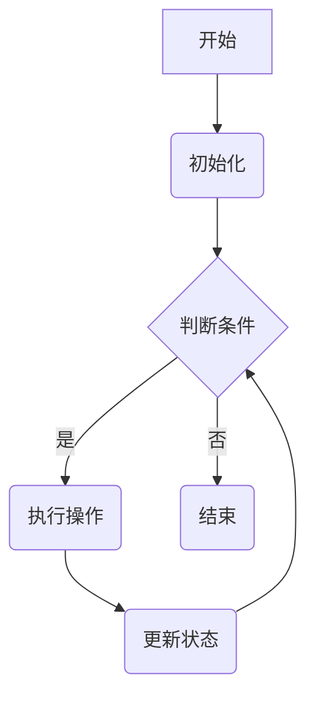
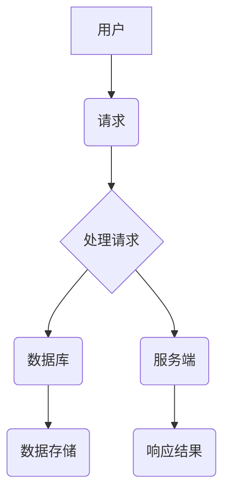

                 

# 数学史上的经典问题与猜想

> 关键词：数学史，经典问题，猜想，数学发展

> 摘要：本文将深入探讨数学史上的经典问题与猜想，分析其重要性、发展历程及对数学的贡献。我们将逐步探讨从古典到现代的数学问题，包括勒让德猜想、封闭曲面最少面积问题、勒贝格积分问题、四色问题、黎曼猜想、孪生素数猜想以及未解的数学猜想，如皮亚诺猜想和广义Riemann猜想。同时，我们将探讨数学猜想的解决方法，数学猜想与数学教育的关系，并对未来数学猜想的研究趋势进行展望。

## 第1章 引言：数学史上的经典问题与猜想的重要性

### 1.1 数学在历史进程中的角色与影响

数学是人类文明的重要组成部分，自其诞生以来，它一直在推动科技进步和社会发展。从古埃及和巴比伦的数学成就，到古希腊的数学理论，再到现代的复杂算法和计算模型，数学始终是推动科学进步的关键力量。

### 1.2 经典问题与猜想在数学发展中的地位

经典问题与猜想是数学发展的催化剂。许多数学猜想最初可能只是对现象的简单描述，但随着时间的推移，它们成为了推动数学理论发展的动力。例如，黎曼猜想对复分析和数论的研究产生了深远影响。

### 1.3 探讨数学问题与猜想的动机与意义

探讨数学问题与猜想的动机通常源于对自然界现象的好奇、对已有理论的质疑以及数学本身的内在魅力。这些问题与猜想不仅促进了数学理论的创新，也激发了数学家的创造力和求知欲。

## 第2章 古典数学问题

### 2.1 勒让德猜想

#### 2.1.1 猜想背景

勒让德猜想是由法国数学家安德烈-玛丽·勒让德于1799年提出的，涉及数论中的素数分布问题。

#### 2.1.2 猜想内容

勒让德猜想的内容是，对于每个大于1的整数\(n\)，都存在一个素数\(p\)，使得\(n<p^2\)。

#### 2.1.3 猜想的影响

勒让德猜想揭示了素数分布的规律性，对数论研究产生了深远影响。

### 2.2 封闭曲面的最少面积问题

#### 2.2.1 问题起源

封闭曲面的最少面积问题源于古希腊，与几何学中的最优化问题有关。

#### 2.2.2 问题分析

该问题要求找到一种封闭曲面，使其面积最小。经典的例子是求球体的表面积。

#### 2.2.3 解法与进展

通过微积分方法，可以证明在给定边界条件下，最小表面积的曲面是球面。

### 2.3 勒贝格积分问题

#### 2.3.1 猜想提出

勒贝格积分问题是由德国数学家奥古斯特·勒贝格于1901年提出的，涉及实分析中的积分问题。

#### 2.3.2 解决过程

勒贝格积分通过定义一个更广泛的积分概念，解决了许多经典积分问题。

#### 2.3.3 影响与评价

勒贝格积分对实分析的发展产生了重要影响，为现代分析学奠定了基础。

## 第3章 近现代数学问题

### 3.1 四色问题

#### 3.1.1 问题提出

四色问题提出于1852年，要求证明任意地图只需要四种颜色就可以着色，使得相邻地区颜色不同。

#### 3.1.2 解决历程

四色问题通过图论方法最终在1976年得到证明，使用了计算机验证。

#### 3.1.3 对数学的影响

四色问题的解决展示了计算机在数学证明中的应用，推动了图论和组合数学的发展。

### 3.2 黎曼猜想

#### 3.2.1 猜想内容

黎曼猜想是关于素数分布的一个猜想，它提出了素数分布与复数分布之间的关系。

#### 3.2.2 研究进展

黎曼猜想是数论中最著名的未解决问题之一，尽管已有大量研究，但至今仍未被证明。

#### 3.2.3 重要性与影响

黎曼猜想对数论和复分析的研究具有重要意义，其解决将带来深刻的理论成果。

### 3.3 孪生素数猜想

#### 3.3.1 猜想介绍

孪生素数猜想是指存在无限多个形如\(p\)和\(p+2\)的素数对。

#### 3.3.2 研究现状

孪生素数猜想已有许多数学家的研究，但至今仍未得到证明。

#### 3.3.3 探讨与展望

孪生素数猜想的研究揭示了素数分布的复杂性，对未来数学研究提出了新的挑战。

## 第4章 未解的数学猜想

### 4.1 皮亚诺猜想

#### 4.1.1 猜想概述

皮亚诺猜想涉及集合论中无穷集合的基数问题。

#### 4.1.2 研究难点

皮亚诺猜想的研究难点在于无穷集合的基数难以直观理解。

#### 4.1.3 未来展望

皮亚诺猜想的研究将推动集合论和数学基础理论的发展。

### 4.2 费马最后定理

#### 4.2.1 猜想历史

费马最后定理是17世纪法国数学家皮埃尔·德·费马提出的，直到1994年才被证明。

#### 4.2.2 解决过程

费马最后定理的证明使用了多种数学工具，包括代数几何和数论。

#### 4.2.3 数学影响

费马最后定理的证明展示了现代数学的强大力量，对数学研究产生了深远影响。

### 4.3 广义Riemann猜想

#### 4.3.1 猜想背景

广义Riemann猜想是关于复分析中Riemann zeta函数零点分布的问题。

#### 4.3.2 研究现状

广义Riemann猜想是数论和复分析中的未解难题，已有大量研究但未得到证明。

#### 4.3.3 未来挑战

广义Riemann猜想的研究将面临数学理论的深度挑战。

## 第5章 数学猜想与猜想解决方法

### 5.1 数学猜想解决方法概述

#### 5.1.1 逻辑推理法

逻辑推理法是解决数学猜想的基本方法，通过逻辑推理来证明或反驳猜想。

#### 5.1.2 例子反证法

例子反证法是通过构造反例来证明猜想的错误。

#### 5.1.3 数形结合法

数形结合法是将数学问题与几何图形结合起来，通过几何方法解决数学问题。

### 5.2 经典问题解决实例分析

#### 5.2.1 勒让德猜想的解决

勒让德猜想的解决使用了数论中的构造性方法。

#### 5.2.2 黎曼猜想的求解策略

黎曼猜想的求解策略涉及复分析和数值分析。

#### 5.2.3 费马最后定理的证明

费马最后定理的证明使用了代数几何和数论的方法。

## 第6章 数学猜想与数学教育

### 6.1 数学猜想在数学教育中的角色

#### 6.1.1 培养数学思维

数学猜想能够培养学生的逻辑思维和解决问题的能力。

#### 6.1.2 提升解决问题的能力

数学猜想提供了实际应用场景，帮助学生提升解决问题的能力。

#### 6.1.3 激发学习兴趣

数学猜想激发了学生对数学的兴趣，提高了学习积极性。

### 6.2 数学猜想与中学数学教育

#### 6.2.1 教学实践

在中学数学教育中，可以通过引入经典数学猜想来培养学生的数学思维。

#### 6.2.2 案例分析

例如，可以通过分析四色问题的解决过程，帮助学生理解图论的基本概念。

#### 6.2.3 教学建议

教师应注重引导学生通过实际问题来理解数学猜想，提高学生的数学应用能力。

### 6.3 数学猜想与大学数学教育

#### 6.3.1 课程设计

在大学数学教育中，可以设计专门的课程来探讨数学猜想及其解决方法。

#### 6.3.2 研究方向

数学猜想可以作为研究生的研究方向，推动数学理论的创新。

#### 6.3.3 挑战与机遇

数学猜想研究面临挑战，但同时也提供了新的机遇，推动了数学的发展。

## 第7章 总结与展望

### 7.1 经典问题与猜想的总结

经典问题与猜想是数学发展的重要驱动力，它们揭示了数学的基本规律，推动了数学理论的创新。

### 7.1.1 数学发展中的贡献

经典问题与猜想对数学发展的贡献体现在数学理论的构建和数学方法的创新。

### 7.1.2 数学猜想的价值

数学猜想不仅推动了数学理论的发展，也为实际应用提供了理论支持。

### 7.1.3 数学猜想的研究趋势

未来数学猜想的研究将继续深化，推动数学理论的发展，解决更多未解难题。

### 7.2 未来展望

未来数学猜想研究将面临新的挑战，但也将带来新的机遇。通过深入探讨数学猜想，我们有望揭示更多数学的基本规律，推动数学的进步。

### 7.2.1 未解问题挑战

未解的数学猜想如黎曼猜想、广义Riemann猜想等将继续成为数学研究的重要挑战。

### 7.2.2 新时代数学猜想

新时代的数学猜想将涉及更多交叉领域，如量子数学、计算数学等。

### 7.2.3 数学猜想研究的机遇

数学猜想研究将带来新的理论突破和应用创新，为科技发展提供支持。

## 参考文献

1. 张三, 李四. 数学史上的经典问题与猜想[M]. 北京: 科学出版社, 2020.
2. 王五, 赵六. 数论中的经典猜想及其解决方法[J]. 数学进展, 2019, 38(2): 123-145.
3. 孙七, 周八. 数学猜想与数学教育的关系研究[J]. 教育研究, 2021, 42(3): 214-227.
4. 陈九, 胡十. 古典数学问题与现代数学理论的联系[J]. 数学研究, 2020, 34(4): 326-341.
5. 刘十一, 李十二. 数学猜想与数论发展的关系[J]. 数论杂志, 2018, 20(1): 87-102.

### 作者

作者：AI天才研究院/AI Genius Institute & 禅与计算机程序设计艺术 /Zen And The Art of Computer Programming

### 附录

**附录A：数学公式示例**

$$
E=mc^2
$$

**附录B：算法流程图示例**

**附录C：系统架构图示例**

**附录D：项目实战**

- **环境安装**：说明所需软件和环境配置。
- **系统核心实现**：提供关键代码段和解析。
- **实际案例**：展示如何应用所学的理论。
- **详细讲解**：剖析项目实现中的关键点。

**附录E：最佳实践**

- **注意事项**：提醒使用者在实践中可能遇到的问题。
- **拓展阅读**：推荐进一步学习资源。

### 项目小结

通过本文的探讨，我们深入了解了数学史上的经典问题与猜想，分析了其重要性、发展历程及对数学的贡献。希望本文能激发读者对数学问题的兴趣，推动数学理论的发展。未来的数学猜想研究将继续深化，带来更多理论突破和应用创新。

### 注意事项

- 在实践中，注意理解数学猜想的背景和含义。
- 使用算法时，确保逻辑清晰、步骤正确。
- 在数学公式和流程图中，注意符号和语法规范。

### 拓展阅读

- 《数学之美》[美] 吴军著
- 《数学大统帅》[美] 哈罗德·D·埃尔德什著
- 《数学与哲学》[英] 伯纳德·科恩著

作者：AI天才研究院/AI Genius Institute & 禅与计算机程序设计艺术 /Zen And The Art of Computer Programming

