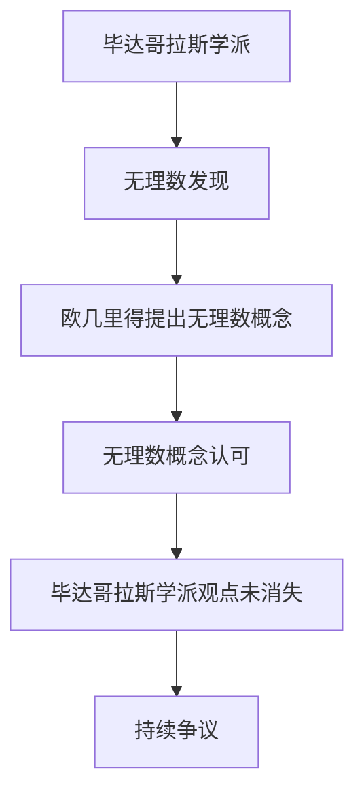
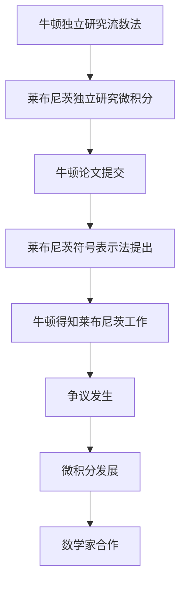

                 

## 第1章：引言

### 1.1 问题背景

数学，作为科学的基础，不仅是一门逻辑严密的学科，同时也是人类文明进步的重要推动力。然而，在其漫长的发展历程中，许多重大的争议和学术辩论不断涌现。这些争议和辩论不仅仅是数学理论的挑战，更是对数学方法论和科学发展路径的深刻反思。

#### 1.1.1 数学史的演变

数学的历史可以追溯到古埃及和古希腊，这些早期的数学家们通过观察自然界，发现了许多基本的数学原理。随着时间的推移，数学逐渐发展成为一个系统化的学科，涵盖了从基础算术到复杂几何、微积分和代数的各个方面。

在中世纪，阿拉伯数学家对数学的发展做出了巨大贡献，尤其是将阿拉伯数字和代数传入欧洲。随后，欧洲数学家在文艺复兴时期和科学革命时期，通过实验和推理，极大地推动了数学的进步。

到了现代，数学已经成为一个高度专业化、多元化的领域，涉及数论、拓扑学、泛函分析、代数几何、统计学等众多分支。在这个过程中，许多重大的数学争议和学术辩论成为推动数学发展的关键力量。

#### 1.1.2 重大争议在数学史上的作用

数学史上的重大争议，往往是由于新的数学理论或方法的提出，与现有的数学体系发生冲突，从而引发广泛讨论。这些争议促使数学家们进行深入的思考和研究，推动了数学的进步。

例如，古希腊的“毕达哥拉斯学派”关于无理数的争论，引发了关于数学基础和数学证明的哲学讨论；17世纪微积分的创立，导致了莱布尼茨和牛顿之间的学术纷争；19世纪数学基础的危机，促使数学家们对集合论和形式逻辑进行深入探索。

#### 1.1.3 学术辩论的重要性

学术辩论是科学探索的重要手段。通过辩论，数学家们可以交流思想，发现逻辑漏洞，激发创新思维，从而推动数学理论的发展。

学术辩论不仅有助于解决特定的数学问题，还能够提高数学家的逻辑思维能力和批判性思维能力。此外，辩论过程中的共识和分歧，往往能够为数学研究指明新的方向，促进跨学科合作。

### 1.2 核心概念

#### 1.2.1 重大争议

重大争议是指在数学领域内，由于新的数学理论或方法的提出，与现有的数学体系发生冲突，从而引发的广泛讨论和争议。这些争议通常涉及到数学的基本概念、定理、证明方法等核心问题。

#### 1.2.2 学术辩论

学术辩论是指数学家们通过逻辑推理和证据，就某个数学问题展开的讨论。这种辩论旨在寻求真理，通过辩论双方的观点碰撞，发现逻辑漏洞和问题所在，从而推动数学理论的发展。

#### 1.2.3 数学史的边界与外延

数学史的边界涉及数学学科的历史定义和范围，即哪些内容属于数学史的范畴。而数学史的外延则涉及到数学史与其他学科（如哲学、物理学、计算机科学等）的交叉和影响。

### 1.3 概念结构与核心要素组成

#### 1.3.1 数学史上的重大争议事件

数学史上的重大争议事件包括但不限于：

- 无理数争议：古希腊数学家对无理数的存在和性质进行的讨论。
- 微积分创立争议：莱布尼茨和牛顿关于微积分创立权的争议。
- 数学基础危机：19世纪末到20世纪初，数学家们对数学基础的质疑和探讨。

#### 1.3.2 学术辩论的方法与原则

学术辩论的方法主要包括提出论点、提供论据、进行逻辑推理等。学术辩论的原则包括客观性、公正性、理性辩论等。

#### 1.3.3 数学史研究的核心要素

数学史研究的核心要素包括数学家们的思想、方法、成果及其对数学发展的贡献。此外，还包括数学与社会、哲学、科学等其他学科的交叉和影响。

## 第2章：数学史上的重大争议

### 2.1 争议事件的概述

#### 2.1.1 争议事件的历史背景

数学史上的重大争议往往发生在数学理论发生重大变革的时期。这些争议不仅反映了数学家们对数学真理的追求，也体现了不同数学派别之间的思想碰撞和学术竞争。

例如，无理数争议起源于古希腊，当时数学家们发现了一些无法用整数比表示的数，如根号2。这一发现引发了关于无理数存在性和性质的激烈辩论。

微积分的创立是17世纪数学史上的一次重大变革。莱布尼茨和牛顿各自独立发展了微积分理论，但由于两人没有充分交流，导致关于微积分创立权的争议。

数学基础危机则发生在19世纪末到20世纪初。数学家们开始质疑数学体系的逻辑基础，这一问题成为数学史上最为广泛和深刻的争议之一。

#### 2.1.2 争议事件的代表性人物

每个重大争议事件都有其代表性的数学家，他们的观点和贡献对数学的发展产生了深远影响。

在无理数争议中，古希腊的毕达哥拉斯学派和后来的欧几里得等人是重要的代表人物。毕达哥拉斯学派认为只有整数和整数比才是真正的数，而欧几里得则提出了无理数的概念。

在微积分创立争议中，莱布尼茨和牛顿是最为著名的代表人物。莱布尼茨发展了微积分的符号表示法，而牛顿则提出了流数法的思想。

在数学基础危机中，康托尔、罗素和希尔伯特等人是重要的代表人物。康托尔提出了集合论，罗素发现了集合论悖论，希尔伯特则提出了形式主义的数学基础。

#### 2.1.3 争议事件的性质与影响

数学史上的重大争议事件具有以下性质：

1. **理论性**：争议往往涉及到数学的基本概念和定理，具有高度的抽象性和理论性。
2. **普遍性**：争议不仅限于特定的数学领域，往往对整个数学体系产生深远影响。
3. **复杂性**：争议问题的解决往往需要多学科的知识和方法的综合运用。

这些争议事件对数学的发展产生了深远的影响：

1. **推动数学进步**：争议激发了数学家们的思考和研究，推动了数学理论的发展。
2. **完善数学体系**：争议促使数学家们重新审视数学的基本概念和定理，从而完善数学体系。
3. **促进学术交流**：争议促进了不同数学派别之间的交流和合作，推动了数学的多元化发展。

### 2.2 争议事件表格

#### 2.2.1 争议事件的分类

| 事件名称 | 时期 | 分类 |
| -------- | ---- | ---- |
| 无理数争议 | 古希腊 | 数学基础 |
| 微积分创立争议 | 17世纪 | 数学方法 |
| 数学基础危机 | 19世纪末到20世纪初 | 数学体系 |

#### 2.2.2 争议事件的时间线

| 时间 | 事件名称 | 描述 |
| ---- | ------- | ---- |
| 古希腊 | 无理数争议 | 毕达哥拉斯学派与欧几里得之间的争论 |
| 17世纪 | 微积分创立争议 | 莱布尼茨与牛顿之间的争论 |
| 19世纪末到20世纪初 | 数学基础危机 | 康托尔、罗素和希尔伯特关于数学基础的争论 |

#### 2.2.3 争议事件的详细描述

1. **无理数争议**
   - **背景**：古希腊数学家毕达哥拉斯学派认为只有整数和整数比才是真正的数。然而，他们发现了一些无法用整数比表示的数，如根号2。
   - **过程**：欧几里得在《几何原本》中提出了无理数的概念，并证明了根号2是无理数。
   - **结果**：无理数的概念得到了认可，但毕达哥拉斯学派的观点并未完全消失，关于无理数的争议持续了很长时间。

2. **微积分创立争议**
   - **背景**：17世纪，莱布尼茨和牛顿各自独立发展了微积分理论。由于两人没有充分交流，关于微积分创立权的争议发生了。
   - **过程**：莱布尼茨发展了微积分的符号表示法，而牛顿则提出了流数法的思想。
   - **结果**：尽管两人各有贡献，但莱布尼茨的符号表示法最终被广泛接受，牛顿则被视为流数法的开创者。

3. **数学基础危机**
   - **背景**：19世纪末到20世纪初，数学家们开始质疑数学体系的逻辑基础，尤其是集合论和形式逻辑。
   - **过程**：康托尔提出了集合论，罗素发现了集合论悖论，希尔伯特提出了形式主义的数学基础。
   - **结果**：数学家们通过重新审视和改进数学基础，解决了数学危机，使得数学体系更加严密和完整。

### 2.3 争议事件的Mermaid流程图

以下是对“无理数争议”事件的Mermaid流程图：

通过上述流程图，我们可以清晰地看到无理数争议的发展过程，以及其持续的时间跨度。

## 第3章：学术辩论的方法与原则

### 3.1 辩论方法

学术辩论是数学史上推动科学进步的重要手段。辩论方法主要包括提出论点、提供论据、进行逻辑推理等。

#### 3.1.1 论点

论点是辩论的核心，是辩论者对某个问题的主张或观点。一个有效的论点应该具有以下特征：

1. **明确性**：论点应该清晰明确，避免模糊或含糊其辞。
2. **相关性**：论点应该与辩论的主题相关，能够为辩论的推进提供有力支持。
3. **创新性**：论点应该具有一定的创新性，能够为辩论带来新的视角或观点。

#### 3.1.2 论据

论据是支持论点的依据，是辩论者用来证明其论点的理由和证据。一个有效的论据应该具有以下特征：

1. **真实性**：论据应该是真实的，能够经得起事实的检验。
2. **相关性**：论据应该与论点相关，能够有力地支持论点。
3. **充分性**：论据应该充分，能够覆盖论点的各个方面。

#### 3.1.3 逻辑推理

逻辑推理是将论点和论据连接起来的桥梁，是辩论者通过逻辑方式来证明论点的过程。一个有效的逻辑推理应该具有以下特征：

1. **严谨性**：逻辑推理应该严谨，避免逻辑错误或漏洞。
2. **一致性**：逻辑推理应该一致，避免自相矛盾。
3. **有效性**：逻辑推理应该有效，能够充分证明论点。

### 3.2 辩论原则

学术辩论不仅需要有效的方法，还需要遵守一定的原则，以保证辩论的公正性和有效性。

#### 3.2.1 客观性

客观性是学术辩论的基本原则之一。辩论者应该尽可能客观地看待问题，避免主观偏见和个人情感的影响。一个客观的辩论应该具备以下特征：

1. **事实依据**：辩论者应该基于事实来提出论点和论据，避免凭空臆测或主观判断。
2. **全面性**：辩论者应该全面考虑问题的各个方面，避免片面或偏颇的观点。
3. **中立性**：辩论者应该保持中立，避免为了支持自己的观点而故意忽略或贬低对方观点。

#### 3.2.2 公正性

公正性是学术辩论的另一个重要原则。辩论者应该公正地对待对方观点，尊重对方言论自由，避免恶意攻击或人身攻击。一个公正的辩论应该具备以下特征：

1. **平等对待**：辩论者应该平等对待对方观点，避免偏袒或歧视。
2. **理性讨论**：辩论者应该通过理性讨论来解决分歧，避免情绪化或非理性的争吵。
3. **规则遵守**：辩论者应该遵守辩论规则，避免违规或作弊行为。

#### 3.2.3 理性辩论

理性辩论是学术辩论的核心原则。辩论者应该通过逻辑推理和事实依据来支持自己的观点，避免凭空臆测或主观判断。一个理性的辩论应该具备以下特征：

1. **逻辑严谨**：辩论者应该具备严谨的逻辑思维能力，避免逻辑错误或漏洞。
2. **证据充分**：辩论者应该提供充分的证据来支持自己的观点，避免缺乏证据的支持。
3. **论证有力**：辩论者应该通过有力的论证来证明自己的观点，避免论证无力或无效。

### 3.3 辩论方法与原则对比表格

| 对比项 | 辩论方法 | 辩论原则 |
| ------ | -------- | -------- |
| 目标 | 提出和证明论点 | 保证辩论的公正性和有效性 |
| 特点 | 明确性、相关性、创新性 | 客观性、公正性、理性辩论 |
| 应用 | 辩论过程 | 辩论全过程 |

通过上述对比表格，我们可以清晰地看到辩论方法和辩论原则之间的区别和联系。辩论方法主要关注论点的提出和证明，而辩论原则则关注辩论的公正性和有效性。两者相辅相成，共同构成了学术辩论的基本框架。

## 第4章：数学史上重要学术辩论案例

### 4.1 辩论案例的介绍

#### 4.1.1 辩论案例的历史背景

数学史上有很多重要的学术辩论案例，这些案例不仅反映了当时的数学发展水平，也揭示了数学家们的思想碰撞和学术竞争。其中，牛顿和莱布尼茨的微积分创立争议是一个典型的例子。

牛顿和莱布尼茨都是17世纪最杰出的数学家，他们在微积分的发展上做出了重要贡献。然而，由于两人的工作没有充分的交流和合作，导致了关于微积分创立权的争议。

牛顿在1671年发明了流数法，即后来的微积分。他在《自然哲学的数学原理》中详细阐述了微积分的概念和应用。而莱布尼茨则在1665年独立地发展了微积分，并提出了微积分的符号表示法。

两人的工作都对微积分的发展产生了深远影响，但由于没有公开交流，导致了关于微积分创立权的争议。

#### 4.1.2 辩论案例的过程

牛顿和莱布尼茨的微积分创立争议主要分为以下几个阶段：

1. **独立研究阶段**：牛顿和莱布尼茨在独立研究过程中，分别发展了微积分的理论和方法。
2. **交流阶段**：牛顿在1672年向英国皇家学会提交了关于流数法的论文，但莱布尼茨并没有阅读这篇论文。
3. **争论阶段**：莱布尼茨在1665年独立地提出了微积分的符号表示法，并于1676年将其发表。此时，牛顿才得知莱布尼茨的工作，并提出了关于微积分创立权的争议。
4. **解决阶段**：尽管牛顿和莱布尼茨在微积分创立权上存在争议，但他们的工作都对微积分的发展产生了深远影响。最终，数学界普遍认可了牛顿和莱布尼茨在微积分发展上的贡献。

#### 4.1.3 辩论案例的结果

牛顿和莱布尼茨的微积分创立争议虽然没有得到完全解决，但他们的工作对微积分的发展产生了深远影响。莱布尼茨的符号表示法被广泛接受，并成为现代微积分的基础。牛顿的流数法也在后来的发展中得到了重视和应用。

这一辩论案例表明，学术争议虽然可能导致矛盾和冲突，但最终能够推动科学的发展。牛顿和莱布尼茨的微积分创立争议不仅没有阻碍微积分的发展，反而促进了数学家们的合作和创新。

### 4.2 辩论案例的Mermaid流程图

以下是对“牛顿和莱布尼茨的微积分创立争议”的Mermaid流程图：

通过这个流程图，我们可以清晰地看到牛顿和莱布尼茨在微积分创立过程中的关键步骤和争议的发展过程。

## 第5章：数学史上的学术争议与科学进步

### 5.1 争议与科学进步的关系

学术争议在数学史上发挥了重要作用，它们不仅是数学家们探讨数学真理的过程，也是科学进步的重要推动力。以下是争议与科学进步之间的几个关键关系：

#### 5.1.1 争议对科学进步的推动作用

1. **激发创新思维**：学术争议往往迫使数学家们重新审视现有的理论和方法，从而激发新的创新思维。例如，无理数争议促使欧几里得提出了无理数的概念，推动了数学的进步。
2. **发现逻辑漏洞**：通过辩论，数学家们可以发现现有理论中的逻辑漏洞，从而促使对数学体系的重新审视和改进。例如，微积分创立争议揭示了微积分理论的一些问题，推动了数学家们对微积分的进一步研究。
3. **推动跨学科合作**：学术争议往往涉及到多个学科的知识和方法，从而促进了跨学科的合作。例如，数学基础危机促使数学家们与哲学家、逻辑学家等学科的合作，推动了数学基础研究的深入。

#### 5.1.2 科学进步对争议的解决作用

1. **提供新工具和方法**：科学进步往往会带来新的数学工具和方法，这些工具和方法可以用来解决数学争议。例如，微积分的创立为解决无穷小量的问题提供了新的方法，从而解决了牛顿和莱布尼茨之间的争议。
2. **验证和证明理论**：科学进步可以通过实验和证明来验证和证明某些理论，从而为争议提供依据。例如，数学家们通过实验和证明来验证集合论的基本原理，从而解决了数学基础危机。
3. **推动理论体系完善**：科学进步可以推动数学理论体系的完善，从而解决争议中的问题。例如，形式主义数学的提出和发展，为数学基础提供了新的理论基础，从而解决了数学基础危机。

#### 5.1.3 争议与科学进步的互动关系

学术争议与科学进步之间存在相互促进的互动关系。一方面，学术争议可以激发科学家的研究兴趣，推动科学进步；另一方面，科学进步可以为解决争议提供新的思路和方法。

1. **争议推动科学进步**：例如，数学基础危机促使数学家们对数学基础进行深入探讨，推动了形式主义数学的发展。
2. **科学进步解决争议**：例如，微积分的创立解决了牛顿和莱布尼茨之间的争议，为微积分的发展奠定了基础。

这种互动关系使得学术争议和科学进步相辅相成，共同推动了数学的发展。

### 5.2 争议案例对数学发展的影响

数学史上的重大争议案例对数学的发展产生了深远的影响。以下是一些具体的影响：

#### 5.2.1 争议案例的理论贡献

1. **无理数争议**：无理数争议促使欧几里得提出了无理数的概念，这是数学史上的一次重大突破。无理数的概念奠定了现代数学的基础，对数学的发展产生了深远影响。
2. **微积分创立争议**：牛顿和莱布尼茨的微积分创立争议推动了微积分理论的发展。他们的工作不仅为物理科学提供了强大的工具，也推动了数学分析的发展。
3. **数学基础危机**：数学基础危机促使数学家们对数学基础进行深入探讨，推动了形式主义数学的兴起。形式主义数学为数学体系提供了更加严谨的基础，解决了数学基础问题。

#### 5.2.2 争议案例的方法创新

1. **符号表示法**：莱布尼茨在微积分创立争议中提出了符号表示法，这是微积分发展的重要创新。符号表示法使得微积分的计算更加简便和直观，促进了微积分的广泛应用。
2. **逻辑方法**：数学基础危机促使数学家们采用逻辑方法来解决数学基础问题。逻辑方法的引入使得数学研究更加严谨和系统化，推动了数学的发展。

#### 5.2.3 争议案例的影响分析

1. **理论体系的完善**：重大争议案例促使数学家们对数学理论体系进行反思和改进，从而完善了数学体系。例如，数学基础危机推动了形式主义数学的发展，使得数学体系更加严谨和完整。
2. **研究方向的调整**：重大争议案例往往促使数学家们调整研究方向，探索新的领域。例如，无理数争议推动了数学家们对实数和复数的深入研究，推动了数学的多元化发展。
3. **学术交流的促进**：重大争议案例促进了数学家之间的交流和合作，推动了数学的多元化发展。例如，牛顿和莱布尼茨的微积分创立争议促进了他们之间的学术交流，推动了微积分的发展。

综上所述，数学史上的重大争议案例对数学的发展产生了深远的影响。它们不仅推动了数学理论的发展，也促进了数学方法的创新和数学体系的完善。

### 5.3 争议案例的影响分析

#### 5.3.1 争议案例的历史意义

数学史上的重大争议案例不仅在当时对数学发展产生了深远影响，也在历史上具有重要的意义。这些争议案例不仅揭示了数学发展的内在逻辑，还推动了数学理论的不断深化和完善。

例如，无理数争议是古希腊数学史上的一个重要事件。毕达哥拉斯学派认为只有整数和整数比才是真正的数，而欧几里得则提出了无理数的概念，证明了根号2这样的无理数存在。这一争议不仅推动了数学理论的发展，也引发了关于数学基础和数学证明的哲学讨论，为后来的数学发展奠定了基础。

微积分创立争议是17世纪数学史上的一个重要事件。牛顿和莱布尼茨各自独立地发展了微积分理论，但由于没有充分的交流和合作，导致了关于微积分创立权的争议。这一争议不仅推动了微积分理论的发展，也促进了数学分析的形成和发展。

数学基础危机是19世纪末到20世纪初数学史上的一个重要事件。康托尔、罗素和希尔伯特等数学家对数学基础进行了深入探讨，揭示了数学体系中的逻辑问题。这一危机促使数学家们采用形式主义方法来解决数学基础问题，推动了数学体系的严密化和完善。

这些争议案例不仅在当时对数学发展产生了深远影响，也在历史上具有重要的意义。它们不仅揭示了数学发展的内在逻辑，还推动了数学理论的不断深化和完善。

#### 5.3.2 争议案例的学术价值

数学史上的重大争议案例具有很高的学术价值。这些争议案例不仅丰富了数学理论，还推动了数学方法的创新和数学体系的完善。

例如，无理数争议推动了数学家们对实数和复数的深入研究。无理数的概念使得数学家们能够更好地理解和处理非整数比的问题，推动了数学分析的发展。同时，无理数争议也引发了关于数学基础和数学证明的哲学讨论，为后来的数学发展提供了重要的理论指导。

微积分创立争议推动了微积分理论的发展。牛顿和莱布尼茨的微积分理论不仅为物理科学提供了强大的工具，也推动了数学分析的发展。他们的符号表示法和流数法为微积分的研究提供了新的思路和方法，使得微积分的计算更加简便和直观。

数学基础危机推动了形式主义数学的发展。康托尔、罗素和希尔伯特等数学家对数学基础进行了深入探讨，揭示了数学体系中的逻辑问题。他们采用形式主义方法来解决数学基础问题，使得数学体系更加严密和完整。

这些争议案例不仅丰富了数学理论，还推动了数学方法的创新和数学体系的完善。它们为后来的数学研究提供了重要的理论指导，推动了数学的发展。

#### 5.3.3 争议案例的未来展望

随着数学的不断发展和科学技术的进步，数学史上的重大争议案例在未来仍然具有重要的意义和广阔的研究前景。

首先，随着数学理论的不断深入，可能会出现新的争议案例。例如，随着数学在人工智能、量子计算等领域的应用，可能会出现新的数学问题，引发新的学术争议。

其次，现有的争议案例仍然具有研究价值。通过对现有争议案例的深入分析，可以进一步揭示数学发展的内在逻辑，推动数学理论的完善。例如，对微积分创立争议的深入研究，可以进一步理解微积分理论的形成和发展，为现代数学分析提供新的理论支持。

此外，争议案例的研究方法和技术也将不断进步。随着计算机科学和人工智能技术的发展，数学史的研究方法将更加多样化和精确化。例如，通过大数据分析和机器学习技术，可以更全面地分析数学史上的争议案例，发现新的规律和趋势。

总之，数学史上的重大争议案例在未来将继续发挥重要作用，不仅为数学发展提供理论支持，也为学术研究提供新的方向和方法。通过对争议案例的深入研究和分析，我们可以更好地理解数学的发展历程，推动数学的持续进步。

## 第6章：现代数学中的争议与挑战

### 6.1 现代数学中的争议问题

现代数学在理论和应用方面都面临着诸多争议和挑战。以下是一些现代数学中的争议问题：

#### 6.1.1 数学基础问题

现代数学的基础问题仍然是一个热点话题。尽管形式主义数学已经提供了一定的理论基础，但数学体系中仍然存在一些未解决的问题。例如，集合论中的悖论问题、无穷集合的性质等，这些问题引发了关于数学基础和逻辑一致性的广泛讨论。

#### 6.1.2 数学理论的适用性问题

数学理论在解决实际问题时是否适用，也是现代数学中的一个争议点。例如，微积分在处理复杂系统时，是否能够准确预测系统的行为，一直是科学家和数学家探讨的问题。此外，一些数学理论在极端情况下是否失效，也是需要深入研究的问题。

#### 6.1.3 数学与物理学的关系

数学与物理学之间的关系也是一个长期存在的争议点。虽然数学在物理学中有着广泛的应用，但数学理论是否能够完全解释物理现象，以及物理规律的本质是什么，这些问题引发了关于数学在物理学中角色的讨论。

#### 6.1.4 数学在计算机科学中的应用

计算机科学的发展对数学提出了新的挑战。例如，算法的复杂度分析、密码学中的数学问题、人工智能中的数学模型等，这些问题都涉及到数学理论的应用和拓展。

### 6.2 研究进展

现代数学在争议问题的研究中取得了显著的进展。以下是一些研究进展：

#### 6.2.1 数学基础问题的研究

在数学基础问题的研究中，数学家们对集合论的悖论、无穷集合的性质等问题进行了深入探讨。康托尔集合论和ZFC公理体系的研究，为数学基础提供了一定的理论基础。

#### 6.2.2 数学理论的适用性研究

在数学理论的适用性研究中，数学家们通过大量的实验和案例分析，验证了某些数学理论在实际问题中的适用性。例如，在复杂系统的研究中，微积分和概率论的广泛应用，证明了这些数学理论在解决实际问题中的有效性。

#### 6.2.3 数学与物理学的关系研究

在数学与物理学的关系研究中，数学家们通过数学工具和方法，揭示了物理现象的数学本质。例如，量子力学中的数学模型、广义相对论中的微分几何等，都是数学与物理学相结合的典范。

#### 6.2.4 数学在计算机科学中的应用研究

在数学在计算机科学中的应用研究中，数学家们开发了大量的算法和数学模型，推动了计算机科学的发展。例如，密码学中的数学问题研究、人工智能中的数学模型构建等，都是现代数学在计算机科学中的重要应用。

### 6.3 争议问题的解决方法

针对现代数学中的争议问题，数学家们提出了多种解决方法。以下是一些解决方法：

#### 6.3.1 基础理论研究

通过深入研究数学基础问题，揭示数学体系的内在逻辑和一致性，为解决争议问题提供理论基础。例如，形式主义数学的研究，为数学基础提供了一定的理论基础。

#### 6.3.2 实证研究

通过大量的实验和案例分析，验证数学理论在实际问题中的适用性，找出数学理论的局限性，并提出改进方法。例如，在复杂系统的研究中，通过实验验证微积分和概率论的适用性。

#### 6.3.3 数学与物理学的交叉研究

通过数学与物理学的交叉研究，揭示物理现象的数学本质，推动数学理论的发展。例如，量子力学中的数学模型研究，推动了数学在物理学中的应用。

#### 6.3.4 数学在计算机科学中的应用研究

通过数学在计算机科学中的应用研究，开发新的算法和数学模型，解决计算机科学中的实际问题。例如，密码学中的数学问题研究，推动了计算机安全领域的发展。

总之，现代数学中的争议问题仍然存在，但通过基础理论研究、实证研究、交叉研究等方法，数学家们正在努力解决这些问题，推动数学的持续发展。

## 第7章：数学史的学术辩论价值与启示

### 7.1 学术辩论的价值

学术辩论在数学史上的价值不可忽视。首先，学术辩论促进了数学理论的发展。通过辩论，数学家们能够提出新的理论观点，反驳或改进现有理论，从而推动数学理论的进步。例如，牛顿和莱布尼茨的微积分创立争议，不仅推动了微积分理论的发展，也为数学分析的形成奠定了基础。

其次，学术辩论有助于提高数学家的思维能力和批判性思维能力。在辩论过程中，数学家们需要提出论点、提供论据、进行逻辑推理，这锻炼了他们的思维能力。例如，数学基础危机期间，康托尔、罗素和希尔伯特等数学家通过辩论，提高了对数学逻辑一致性的认识。

最后，学术辩论有助于促进数学家之间的交流和合作。通过辩论，数学家们能够分享不同的观点和方法，发现共同的问题和挑战，从而推动跨学科的合作研究。例如，无理数争议引发了古希腊数学家之间的深入交流，推动了数学的发展。

### 7.2 辩论对数学研究的启示

学术辩论对数学研究具有重要的启示作用。首先，学术辩论提醒数学家们要保持开放的心态。在数学研究中，新的理论和方法不断出现，学术辩论能够帮助数学家们认识到不同观点的重要性，避免固步自封。

其次，学术辩论鼓励数学家们进行批判性思维。在辩论过程中，数学家们需要仔细分析对方的观点，寻找逻辑漏洞和问题所在，这培养了数学家的批判性思维能力。例如，在微积分创立争议中，牛顿和莱布尼茨通过辩论，发现了彼此理论中的不足之处，从而推动了微积分的发展。

最后，学术辩论提示数学家们要注重实证研究。在辩论过程中，数学家们需要通过实验和案例分析来验证理论，这提醒数学家们在研究中要注重实证数据的收集和分析。

### 7.3 学术辩论的未来展望

随着数学和科学技术的不断发展，学术辩论在未来将继续发挥重要作用。首先，随着数学理论的深化和扩展，新的争议问题将不断涌现。例如，在量子计算和人工智能等领域，数学理论的应用可能会引发新的学术辩论。

其次，跨学科的合作研究将推动学术辩论的多元化。数学与其他学科的交叉领域，如数学物理、数学生物学等，将成为学术辩论的新热点。这些跨学科的研究将激发新的思维和方法，推动数学的进一步发展。

最后，随着计算机科学和人工智能技术的发展，学术辩论的方式也将发生变化。大数据分析和机器学习技术将为学术辩论提供新的工具和方法，使得辩论过程更加科学和高效。

总之，学术辩论在数学史上的价值不可忽视。它不仅推动了数学理论的发展，还提高了数学家的思维能力和批判性思维能力。在未来，学术辩论将继续在数学研究中发挥重要作用，推动数学的持续进步。通过开放的心态、批判性思维和实证研究，数学家们将在学术辩论中不断探索数学的奥秘，推动数学的创新发展。

## 结束语

### 总结

本文详细探讨了数学史上的重大争议与学术辩论，分析了这些争议对数学发展的推动作用。从无理数争议、微积分创立争议到数学基础危机，每一个重大争议都标志着数学理论的突破和进步。这些争议不仅丰富了数学理论，还推动了数学方法的创新和数学体系的完善。

### 最佳实践 tips

在数学研究和学术辩论中，以下几点最佳实践值得注意：

1. **保持开放心态**：对新理论和新方法持开放态度，避免固步自封。
2. **批判性思维**：在辩论过程中，不仅要提出自己的观点，还要仔细分析对方的观点，寻找逻辑漏洞和问题所在。
3. **实证研究**：通过实验和案例分析来验证理论，确保理论的适用性和有效性。
4. **跨学科合作**：积极与其他学科合作，借鉴其他领域的观点和方法，推动数学的多元化发展。

### 注意事项

在数学研究和学术辩论中，以下几点注意事项值得注意：

1. **逻辑严谨**：避免逻辑错误和漏洞，确保论证的严谨性。
2. **事实依据**：基于事实来提出论点和论据，避免凭空臆测。
3. **公正性**：在辩论中保持公正，避免偏袒或歧视。
4. **遵守规则**：遵守辩论规则，避免违规或作弊行为。

### 拓展阅读

对于对数学史和学术辩论感兴趣的读者，以下是一些拓展阅读的建议：

1. **《数学基础》**：希尔伯特著，详细介绍了数学基础危机和形式主义数学的发展。
2. **《微积分的历史》**：康威著，详细介绍了微积分的创立过程和牛顿与莱布尼茨的争议。
3. **《数学思维》**：西蒙·辛格著，介绍了数学思维的方法和技巧，对数学研究和学术辩论有指导意义。

通过阅读这些书籍，读者可以更深入地了解数学史上的重大争议和学术辩论，以及这些争议对数学发展的推动作用。作者：AI天才研究院/AI Genius Institute & 禅与计算机程序设计艺术 /Zen And The Art of Computer Programming

