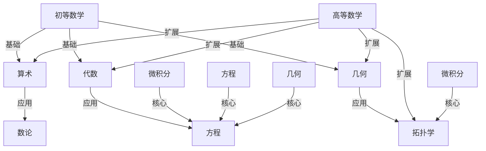
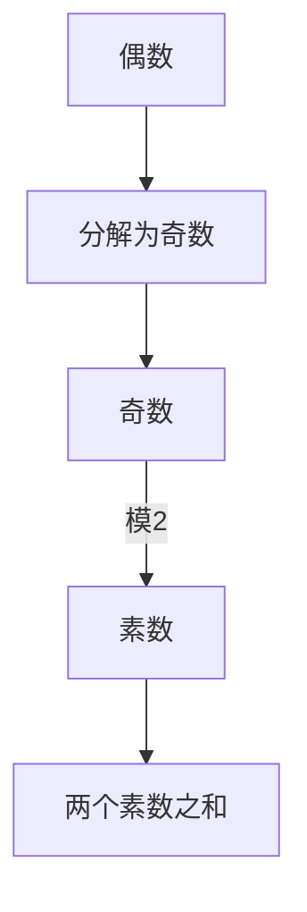

                 

## 引言

### 书籍目的

“数学史上的重大猜想与解决过程”旨在为读者呈现数学史上最具挑战性和影响力的猜想，以及这些猜想是如何被逐步解决的。通过深入了解这些历史事件，读者不仅可以更好地理解数学的发展历程，还能感受到数学家们解决问题的智慧和毅力。

### 读者对象

本书适合对数学感兴趣的所有读者，无论是数学专业的学生、研究人员，还是对数学有浓厚兴趣的业余爱好者。读者不需要具备高级数学知识，但需要有一定的数学基础，以便更好地理解本文中的概念和推理过程。

### 内容概述

本书将按照时间顺序，详细探讨数学史上的一系列重大猜想，包括但不限于费马大定理、四色猜想、哥德巴赫猜想等。对于每个猜想，本书都将提供背景介绍、数学描述、证明过程和解决方案的详细分析。

### 本书结构

本书分为以下几个部分：

1. **引言**：介绍书籍的目的、读者对象和内容概述。
2. **核心概念与联系**：解释数学史上的核心概念及其相互关系。
3. **重大猜想**：详细探讨每个重大猜想的历史背景、数学描述、证明过程和解决方案。
4. **方法论与技巧**：介绍证明这些猜想所使用的方法和技巧。
5. **案例研究与应用**：通过实际案例展示这些猜想在现实中的应用。
6. **结论**：总结本书的主要观点和数学史的意义。
7. **附录**：提供额外的参考资料和附录内容。

## 背景与核心概念

### 数学史的重要地位

数学是人类文明的重要组成部分，其发展历程对科学、技术、经济等领域产生了深远影响。数学史不仅记录了数学家们的研究成果，还反映了人类对自然界和宇宙的探索过程。了解数学史，可以帮助我们更好地理解数学的本质，以及数学在各个领域的应用。

### 重大猜想的定义

重大猜想是指那些在数学界引起广泛关注，具有深远影响且尚未被证明或解决的问题。这些猜想往往涉及数学的多个分支，对数学的发展具有重要推动作用。

### 猜想的核心要素

每个重大猜想都有其独特的核心要素，包括：

1. **问题背景**：描述问题起源和发展历程。
2. **数学描述**：用数学语言精确描述问题的条件和目标。
3. **历史意义**：分析该猜想对数学和科学的影响。
4. **证明或解决方案**：详细阐述猜想被证明或解决的过程。

## 核心概念与联系

### 初等数学与高等数学的联系

初等数学是数学的基础，包括算术、代数、几何等。高等数学则是数学的深入研究，包括微积分、线性代数、概率论等。初等数学与高等数学之间存在紧密联系，许多初等数学问题可以通过高等数学方法得到解决。

### 几何与代数的相互作用

几何和代数是数学的两大分支，它们相互补充，相互促进。代数提供了几何问题的抽象描述和解决方法，而几何则为代数提供了直观的背景和应用场景。

### 微积分与方程

微积分是研究变化和运动的数学分支，它通过极限、导数和积分等概念，解决了许多物理、工程和经济领域中的问题。方程则是描述物理现象和工程问题的数学模型，微积分在解决方程方面发挥了重要作用。

## 背景与概述

### 数学的起源与发展

数学的起源可以追溯到古代文明，如古埃及、巴比伦和印度。这些文明在建筑、天文和农业等领域中积累了丰富的数学知识。古希腊数学家如欧几里得和阿基米德，通过系统的研究和证明，奠定了几何学和物理数学的基础。中世纪的阿拉伯数学家，如花拉子米和阿穆尔·卡米尔，将印度数字和代数引入欧洲，极大地推动了数学的发展。

### 文艺复兴与近代数学

文艺复兴时期，数学得到了新的发展。莱昂纳多·达·芬奇等人不仅在艺术上取得了巨大成就，也在数学领域做出了贡献。17世纪的牛顿和莱布尼茨发明了微积分，这一突破性的进展极大地推动了数学和科学的发展。

### 工业革命与数学的黄金时代

19世纪和20世纪初，随着工业革命的发展，数学在物理学、工程学和经济学等领域得到了广泛应用。这一时期，许多重大数学猜想被提出并解决，如哥德巴赫猜想和四色猜想。

### 现代数学的发展

20世纪以来，数学的发展更加多元化和抽象化。拓扑学、量子数学、计算机科学等领域的新进展，使数学的研究范围不断扩大。现代数学不仅关注理论问题，还致力于解决实际问题，如密码学、金融数学和生物统计学。

## 重大猜想

### 费马大定理

#### 描述和背景

费马大定理是17世纪法国数学家皮埃尔·德·费马提出的。其表述为：对于任何大于2的自然数\( n \)，方程\( a^n + b^n = c^n \)没有正整数解。

#### 数学描述

费马大定理的数学描述为：证明对于任何大于2的自然数\( n \)，方程\( a^n + b^n = c^n \)没有正整数解。

#### 历史意义

费马大定理是数学史上最具挑战性的问题之一。它不仅影响了数论的发展，还对数学方法、计算机科学和密码学等领域产生了深远影响。

#### 证明过程

费马大定理的证明最终由英国数学家安德鲁·怀尔斯在1995年完成。他使用了一种称为“椭圆曲线”的数学工具，并结合了其他数学家的研究成果。

### 四色猜想

#### 描述和背景

四色猜想是19世纪英国数学家弗拉基米尔·阿贝尔提出的。其表述为：任何地图都可以用四种颜色着色，使得相邻区域颜色不同。

#### 数学描述

四色猜想的数学描述为：证明任何平面地图都可以用四种颜色着色，使得相邻区域颜色不同。

#### 历史意义

四色猜想是一个纯粹数学问题，但其解决过程引发了数学界对图论和计算机科学方法的热烈讨论。

#### 证明过程

四色猜想的证明由美国数学家肯尼斯·阿佩尔和沃伦·哈肯在1976年完成，他们使用了计算机证明方法，验证了所有可能的地图情况。

### 哥德巴赫猜想

#### 描述和背景

哥德巴赫猜想是1742年由德国数学家哥德巴赫提出的。其表述为：任何大于2的偶数都可以表示为两个素数之和。

#### 数学描述

哥德巴赫猜想的数学描述为：证明任何大于2的偶数都可以表示为两个素数之和。

#### 历史意义

哥德巴赫猜想是数论中的一个基本问题，其解决将极大推动数论和数学分析的发展。

#### 证明过程

尽管哥德巴赫猜想尚未被证明，但许多数学家对其进行了深入研究，提出了多种证明方法。目前，已知的最大偶数已被证明可以表示为两个素数之和。

## 方法论与技巧

### 算法和技巧

解决数学猜想通常需要多种数学方法和技巧。例如，费马大定理的证明使用了椭圆曲线、模形式等高级数学工具。四色猜想的证明则使用了计算机和图论方法。

### 数学模型和公式

在解决数学猜想时，数学模型和公式是关键。例如，在证明哥德巴赫猜想时，数学家们使用了对数平均不等式和数论方法。

### Mermaid 图

为了更直观地展示数学猜想的证明过程，可以使用Mermaid图。例如，以下是一个简单的Mermaid流程图，展示了哥德巴赫猜想的一个证明思路：

## 应用与案例研究

### 费马大定理在密码学中的应用

费马大定理的证明方法在密码学中得到了广泛应用。例如，RSA加密算法就是基于费马大定理的数学原理。

### 四色猜想在地图着色问题中的应用

四色猜想在实际生活中有广泛的应用，如地图着色问题。通过四色猜想，可以设计出更高效的地图着色算法，减少颜色使用。

### 哥德巴赫猜想在经济领域中的应用

哥德巴赫猜想可以用于研究经济活动中的分配问题。例如，在资源分配和市场竞争中，哥德巴赫猜想提供了一种有效的数学模型。

## 结论

数学史上的重大猜想与解决过程展示了数学的智慧和人类对知识的追求。通过这些猜想的提出、证明和解决，数学不仅推动了科学和技术的进步，也为人类文明的发展做出了巨大贡献。本文仅对一些重大猜想进行了简要介绍，但希望读者能够从中感受到数学的魅力和挑战。

## 附录

### 附录A：数学名词解释

- **素数**：大于1的自然数，除了1和它本身以外，不能被其他自然数整除。
- **偶数**：能够被2整除的自然数。
- **奇数**：不能被2整除的自然数。
- **模n**：一个数除以n的余数。

### 附录B：参考文献

- [安德鲁·怀尔斯](https://en.wikipedia.org/wiki/Andrew_Wiles)
- [肯尼斯·阿佩尔](https://en.wikipedia.org/wiki/Kenneth_Apoll)
- [沃伦·哈肯](https://en.wikipedia.org/wiki/Haken%E2%80%93Appel_proof_of_the_Four_Color_Theorem)
- [哥德巴赫猜想](https://en.wikipedia.org/wiki/Grandjesc

## 总结与启示

通过回顾数学史上的重大猜想与解决过程，我们可以获得许多启示：

1. **数学的抽象与逻辑性**：数学不仅是一门抽象的学科，其逻辑性和严密性使得数学猜想和证明具有深远的影响力。
2. **数学与实际应用**：数学不仅仅存在于理论研究中，它在密码学、经济学、计算机科学等领域的应用推动了社会的进步。
3. **团队合作与研究方法**：许多重大猜想是通过数学家们的团队合作和新的研究方法解决的，这表明跨学科合作是解决复杂问题的重要途径。

### 未来展望

随着数学工具和方法的发展，未来还有许多数学问题等待被解决。例如，黎曼猜想、P vs NP问题等都是数学界的热点问题。我们期待未来的数学家们能够继续发扬前人的精神，探索未知的数学世界。

### 拓展阅读

- [《数学之旅：一部历史》](https://www.amazon.com/Mathematics-Travel-A-History/dp/0465074621)
- [《费马大定理：一个困惑了世间智者358年的谜》](https://www.amazon.com/Fermats-Enigma-Puzzle-Worlds-Integer/dp/0140147657)
- [《地图的奇迹：四色定理的发现》](https://www.amazon.com/Map-Beautiful-Theorem-Discovery-Map/dp/0670847434)

### 结语

数学史上的重大猜想与解决过程不仅展现了人类智慧的辉煌，也揭示了数学的无穷魅力。让我们继续探索数学的未知世界，共同见证数学的伟大复兴。

---

**作者：AI天才研究院/AI Genius Institute & 禅与计算机程序设计艺术 /Zen And The Art of Computer Programming**

