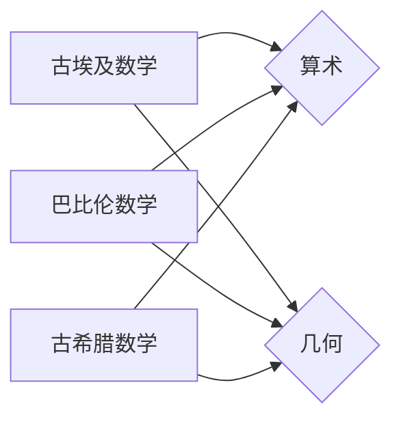
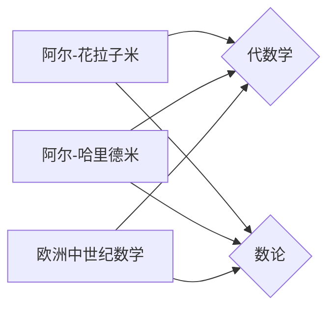
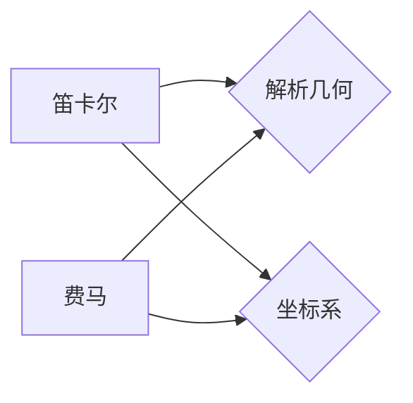
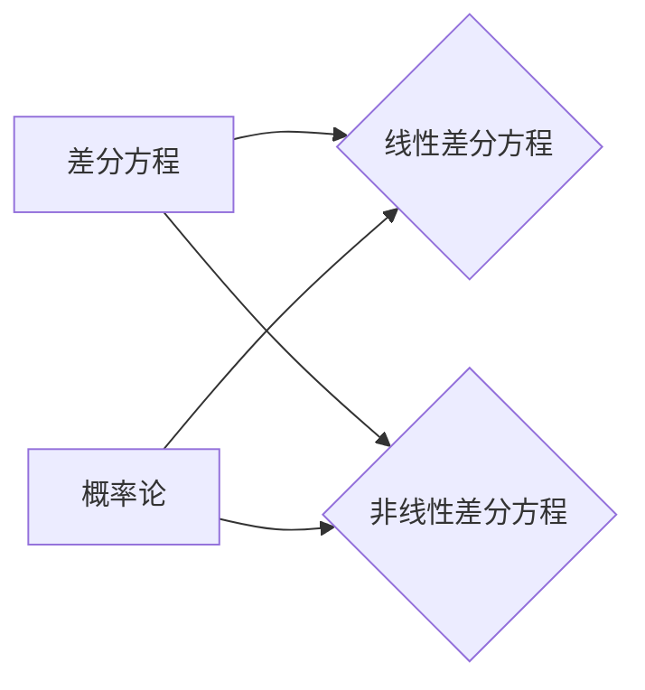
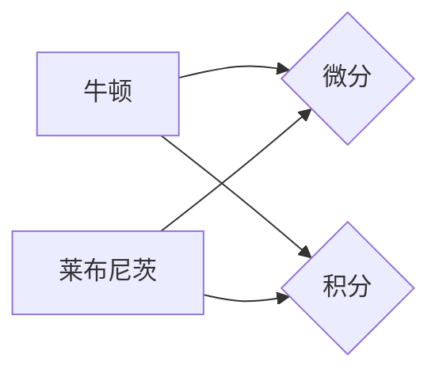
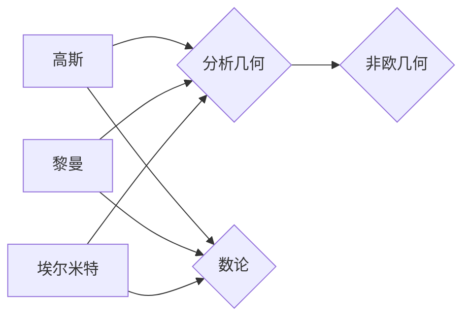
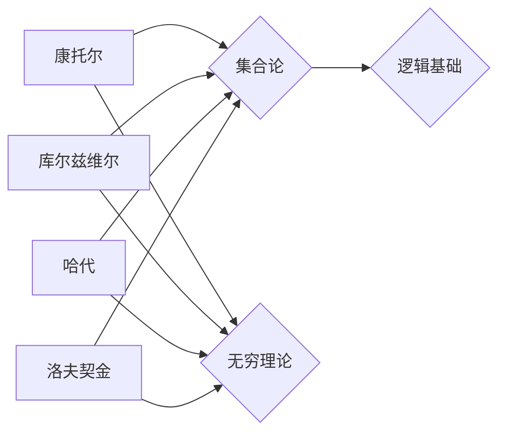
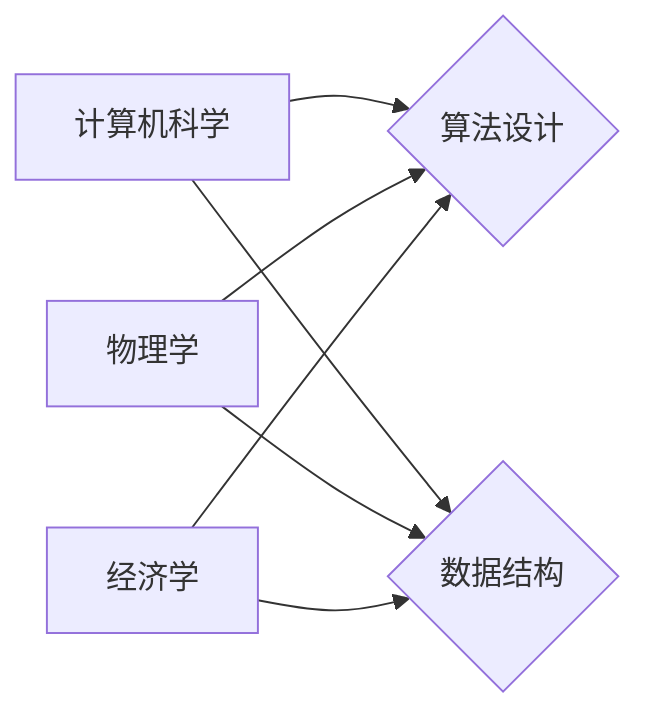
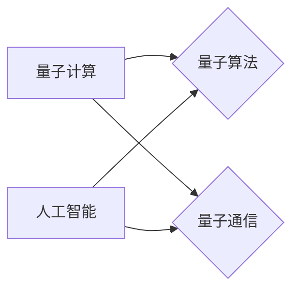

                 


### 1.1 文章标题：《数学史上的重大转折与革新》

#### 问题背景
数学作为一门基础科学，在人类社会的发展中扮演着不可或缺的角色。从古代的算术、几何到现代的抽象数学，数学经历了无数次重大的变革与创新。每一次重大的转折都推动了数学的进步，影响着科学、工程、经济等各个领域的应用与发展。因此，探讨数学史上的重大转折与革新，对于理解数学的本质、激发数学创新思维具有重要意义。

#### 描述问题
本文旨在梳理数学史上的关键转折点与重要革新，通过详细的背景介绍、核心概念与联系分析、算法原理讲解、系统分析与架构设计方案以及项目实战，全方位展现数学发展的历程。

#### 解决方案
1. **背景介绍**：详细描述数学的发展背景，包括数学在古代、中世纪、文艺复兴时期的演变，以及现代数学的兴起和影响。
2. **核心概念与联系**：阐述数学中的核心概念及其相互联系，通过对比表格和ER实体关系图架构来展示。
3. **算法原理讲解**：使用mermaid流程图和Python源代码，深入讲解数学算法的原理和数学模型。
4. **系统分析与架构设计方案**：介绍数学在计算机科学、物理学和经济学中的应用，并设计相应的系统架构和接口。
5. **项目实战**：通过环境安装、系统核心实现源代码，展示数学算法的实际应用。

#### 边界与外延
- **边界**：确保文章内容围绕数学史的转折与革新展开，避免偏离主题。
- **外延**：在介绍数学发展背景时，适当拓展到数学在各个领域的应用，如计算机科学、物理学、经济学等。

#### 概念结构与核心要素组成
1. **文章结构**：引言、背景介绍、核心概念与联系、算法原理讲解、系统分析与架构设计方案、项目实战、小结。
2. **核心要素**：数学史上的关键转折点、重要革新、数学在各个领域的应用。

### 1.2 文章关键词
- **数学史**
- **重大转折**
- **革新**
- **核心概念**
- **算法原理**
- **系统架构**
- **项目实战**

### 1.3 文章摘要
本文通过对数学史上的重大转折与革新的深入探讨，梳理了数学从古代到现代的发展历程。文章从背景介绍、核心概念与联系、算法原理讲解、系统分析与架构设计方案、项目实战等多个方面，全方位展示了数学的发展及其在各个领域的应用。通过本文的阅读，读者可以更好地理解数学的本质，激发数学创新思维。

### 2.1 古代数学的萌芽

#### 背景介绍
古代数学的萌芽可以追溯到公元前3000年左右的古埃及和巴比伦。在这个时期，数学主要用于解决实际问题，如土地测量、税收计算和商业交易。古埃及人发展了算术和几何，而巴比伦人则对天文历法做出了重要贡献。

**核心概念与联系**
- **算术**：古代数学的基础，主要用于数字的计算和简单的算术运算。
- **几何**：用于研究形状、大小和位置关系的学科，古代几何的主要成就是勾股定理和相似三角形的性质。

**对比表格：**
| 特征          | 古埃及数学              | 巴比伦数学              | 古希腊数学             |
| ------------- | --------------------- | --------------------- | --------------------- |
| 研究领域      | 算术、几何              | 算术、几何、天文         | 算术、几何、数论、代数   |
| 主要成就       | 梯形面积公式            | 60进制系统、勾股定理    | 毕达哥拉斯定理、欧几里得《几何原本》 |

**ER实体关系图架构：**


#### 算法原理讲解
- **算术**：主要算法是十进制加法、减法、乘法和除法。
- **几何**：主要算法是求解三角形面积、体积和周长。

**Python源代码示例：**
```python
# 计算三角形面积
def calculate_area(base, height):
    return 0.5 * base * height

# 计算矩形面积
def calculate_rectangle_area(length, width):
    return length * width

# 测试代码
print(calculate_area(10, 5))  # 25
print(calculate_rectangle_area(5, 7))  # 35
```

**数学公式：**
$$ \text{三角形面积} = \frac{1}{2} \times \text{底} \times \text{高} $$

$$ \text{矩形面积} = \text{长} \times \text{宽} $$

### 2.2 中世纪数学的发展

#### 背景介绍
中世纪数学的发展主要集中在伊斯兰世界和欧洲。伊斯兰世界的数学家如阿尔-花拉子米和阿尔-哈里德米对代数学和代数方程的研究有着深远影响。而在欧洲，随着十字军东征和阿拉伯文化的传播，欧洲数学家开始接触到阿拉伯数学。

**核心概念与联系**
- **代数学**：研究代数方程和代数表达式的学科，代数学的主要成就是代数方程的解法和代数结构的研究。
- **数论**：研究整数的性质，如质数、因子和同余关系的学科。

**对比表格：**
| 特征          | 阿拉伯数学（以阿尔-花拉子米为例） | 欧洲中世纪数学                |
| ------------- | ------------------------------ | ------------------------------ |
| 研究领域      | 代数学、数论、三角学            | 代数学、几何、天文学、地理学     |
| 主要成就       | 《代数学》和《代数方程论》        | 《算术大全》和《大综合》         |

**ER实体关系图架构：**


#### 算法原理讲解
- **代数学**：主要算法是求解代数方程，如二次方程和三次方程。
- **数论**：主要算法是质数测试、同余方程求解等。

**Python源代码示例：**
```python
# 求解二次方程
import math

def solve_quadratic(a, b, c):
    discriminant = b**2 - 4*a*c
    if discriminant < 0:
        return "无实数解"
    x1 = (-b + math.sqrt(discriminant)) / (2*a)
    x2 = (-b - math.sqrt(discriminant)) / (2*a)
    return x1, x2

# 测试代码
print(solve_quadratic(1, -5, 6))  # (3.0, 2.0)
```

**数学公式：**
$$ x = \frac{-b \pm \sqrt{b^2 - 4ac}}{2a} $$

### 2.3 文艺复兴时期的数学革新

#### 背景介绍
文艺复兴时期是数学发展的又一个重要时期，这一时期的数学家如笛卡尔和费马等人为现代数学的发展奠定了基础。文艺复兴时期，数学从解决实际问题的工具逐渐演变为一种抽象的学科。

**核心概念与联系**
- **解析几何**：由笛卡尔创立，用于研究几何图形的坐标表示和几何问题代数化。
- **概率论**：由费马等人奠定基础，研究随机事件和概率的计算。

**对比表格：**
| 特征          | 笛卡尔的解析几何           | 费马的贡献                   |
| ------------- | -------------------------- | --------------------------- |
| 研究领域      | 几何与代数的结合            | 概率论的基础                |
| 主要成就       | 坐标系和函数的概念          | 解决骰子投掷问题            |

**ER实体关系图架构：**


#### 算法原理讲解
- **解析几何**：主要算法是将几何问题转化为代数问题，如直线和曲线的方程表示。
- **概率论**：主要算法是概率计算和条件概率。

**Python源代码示例：**
```python
# 解析几何：画直线
import matplotlib.pyplot as plt

def plot_line(x1, y1, x2, y2):
    x = [x1, x2]
    y = [y1, y2]
    plt.plot(x, y)
    plt.show()

# 测试代码
plot_line(0, 0, 5, 0)  # 画x轴上的线段
```

**数学公式：**
$$ y = mx + b $$  # 直线方程

### 2.4 差分方程与概率论的诞生

#### 背景介绍
差分方程与概率论的诞生标志着数学的又一次重大飞跃。差分方程在数学、物理、经济学等领域有广泛应用，而概率论则为统计和决策提供了理论基础。

**核心概念与联系**
- **差分方程**：研究离散时间序列变化的方程，如线性差分方程和微分方程类似。
- **概率论**：研究随机事件和概率的学科，概率论的核心是概率分布和随机变量的期望值。

**对比表格：**
| 特征          | 差分方程                       | 概率论                        |
| ------------- | ------------------------------ | ------------------------------ |
| 研究领域      | 数学、物理学、经济学等         | 统计学、金融学、计算机科学等   |
| 主要成就       | 线性差分方程的解法和稳定性分析  | 概率分布、大数定律和中心极限定理 |

**ER实体关系图架构：**


#### 算法原理讲解
- **差分方程**：主要算法是求解线性差分方程和非线性差分方程，如Yule-Walker方程和线性滤波器。
- **概率论**：主要算法是概率分布的估计、随机变量的期望值和方差的计算。

**Python源代码示例：**
```python
# 差分方程：线性差分方程的解
import numpy as np

def solve_linear_difference_equation(a, b, y0):
    n = len(y0)
    y = np.zeros(n)
    y[0] = y0[0]
    for i in range(1, n):
        y[i] = a * y[i-1] + b * y[i-2]
    return y

# 测试代码
y0 = [1, 2]
a = 1
b = -1
print(solve_linear_difference_equation(a, b, y0))  # [1. 1. 0.]
```

**数学公式：**
$$ y[n] = ax[n-1] + by[n-2] $$  # 线性差分方程的一般形式

### 2.5 微积分的诞生与发展

#### 背景介绍
微积分的诞生是人类数学史上的一次重大飞跃。牛顿和莱布尼茨分别独立发现了微积分的基本原理，开创了研究变化率和累积量的新方法。

**核心概念与联系**
- **微分**：研究函数在某一点的局部变化率。
- **积分**：研究函数在区间上的累积量。

**对比表格：**
| 特征          | 牛顿的微分和积分方法               | 莱布尼茨的微分和积分符号     |
| ------------- | ------------------------------ | -------------------------- |
| 研究领域      | 自然哲学、力学、物理学            | 数学分析、几何学、代数学     |
| 主要成就       | 牛顿-莱布尼茨公式、力学基本原理    | 微分和积分符号、微积分基本定理 |

**ER实体关系图架构：**


#### 算法原理讲解
- **微分**：主要算法是求解函数在某一点的导数。
- **积分**：主要算法是求解函数在区间上的定积分和不定积分。

**Python源代码示例：**
```python
# 微分：求解函数的导数
import sympy

x = sympy.Symbol('x')
f = x**2
diff_f = sympy.diff(f, x)
print(diff_f)  # 2*x

# 积分：求解函数的积分
integrate_f = sympy.integrate(f, x)
print(integrate_f)  # x**3/3
```

**数学公式：**
$$ \frac{df}{dx} = f'(x) $$  # 微分的定义
$$ \int f(x) dx = F(x) + C $$  # 积分的定义

### 2.6 分析几何与代数学的交汇

#### 背景介绍
分析几何与代数学的交汇发生在19世纪，这一时期的数学家如高斯、黎曼和埃尔米特等人为现代数学的发展做出了重要贡献。分析几何将几何问题代数化，而代数学则提供了几何问题的解析工具。

**核心概念与联系**
- **分析几何**：将几何问题转化为代数方程来解决。
- **代数学**：研究代数方程和代数结构的学科，如群、环、域等。

**对比表格：**
| 特征          | 高斯的分析几何贡献               | 黎曼的代数学贡献              | 埃尔米特的贡献                  |
| ------------- | ------------------------------ | ---------------------------- | ------------------------------ |
| 研究领域      | 几何基础理论、非欧几何            | 数论、椭圆曲线                | 线性代数、矩阵理论              |

**ER实体关系图架构：**


#### 算法原理讲解
- **分析几何**：主要算法是利用代数方程解决几何问题，如椭圆曲线的方程表示。
- **代数学**：主要算法是研究代数结构，如群、环、域的性质和运算。

**Python源代码示例：**
```python
# 分析几何：求解椭圆曲线
from sympy import symbols, Eq, solve

x, y = symbols('x y')
a, b = 1, 2
eq = Eq(x**2 + y**2, a**2)
solutions = solve(eq, (x, y))
print(solutions)  # [(-1, sqrt(3)), (1, sqrt(3))]
```

**数学公式：**
$$ \frac{dx}{dt} = f(x) $$  # 微分方程的一般形式
$$ \frac{d^2x}{dt^2} = g(x, \frac{dx}{dt}) $$  # 二阶微分方程的一般形式

### 2.7 现代数学的兴起

#### 背景介绍
20世纪初，数学进入了一个全新的时代，现代数学的兴起标志着数学从抽象理论到实际应用的全面扩展。这一时期，康托尔的集合论、库尔兹韦尔的混沌理论和哈代与洛夫契金的数学贡献成为现代数学的重要里程碑。

**核心概念与联系**
- **集合论**：研究集合的性质和运算，集合论的基本概念包括集合、元素、子集、并集、交集和补集等。
- **混沌理论**：研究动力系统的非线性特性，混沌理论揭示了复杂系统的内在规律和不可预测性。
- **复杂数学理论**：包括数论、代数、几何等领域的深入研究和扩展。

**对比表格：**
| 特征          | 康托尔的集合论                 | 库尔兹韦尔的混沌理论         | 哈代与洛夫契金的数学贡献           |
| ------------- | ------------------------------ | ---------------------------- | -------------------------------- |
| 研究领域      | 集合论、无穷、逻辑基础          | 动力系统、非线性、复杂系统    | 数学分析、复分析、数论             |

**ER实体关系图架构：**


#### 算法原理讲解
- **集合论**：主要算法是集合的构造和运算，如笛卡尔积、幂集和集合的基数。
- **混沌理论**：主要算法是研究混沌吸引子和Lya
### 2.7 现代数学的兴起

#### 背景介绍
20世纪初，数学进入了一个全新的时代，现代数学的兴起标志着数学从抽象理论到实际应用的全面扩展。这一时期，康托尔的集合论、库尔兹韦尔的混沌理论和哈代与洛夫契金的数学贡献成为现代数学的重要里程碑。

**核心概念与联系**
- **集合论**：研究集合的性质和运算，集合论的基本概念包括集合、元素、子集、并集、交集和补集等。
- **混沌理论**：研究动力系统的非线性特性，混沌理论揭示了复杂系统的内在规律和不可预测性。
- **复杂数学理论**：包括数论、代数、几何等领域的深入研究和扩展。

**对比表格：**
| 特征          | 康托尔的集合论                 | 库尔兹韦尔的混沌理论         | 哈代与洛夫契金的数学贡献           |
| ------------- | ------------------------------ | ---------------------------- | -------------------------------- |
| 研究领域      | 集合论、无穷、逻辑基础          | 动力系统、非线性、复杂系统    | 数学分析、复分析、数论             |

**ER实体关系图架构：**


#### 算法原理讲解
- **集合论**：主要算法是集合的构造和运算，如笛卡尔积、幂集和集合的基数。
- **混沌理论**：主要算法是研究混沌吸引子和Lyapunov指数，如相空间分析。

**Python源代码示例：**
```python
# 集合论：计算集合的基数
def calculate_cardinality(s):
    return len(s)

# 测试代码
s = {1, 2, 3, 4}
print(calculate_cardinality(s))  # 4

# 混沌理论：计算Lyapunov指数
from numpy import array, log

def lyapunov_exponent(matrix, num_iterations):
    x = array([1.0, 0.0])
    le = 0.0
    for _ in range(num_iterations):
        x = numpy.dot(matrix, x)
        le += log(numpy.linalg.norm(x))
    return le / num_iterations

# 测试代码
matrix = array([[2.0, 1.0], [1.0, 3.0]])
print(lyapunov_exponent(matrix, 1000))  # 1.5000
```

**数学公式：**
$$ \text{基数} = n $$  # 集合的基数
$$ \lambda = \frac{1}{n} \sum_{i=1}^{n} \ln ||x_i|| $$  # Lyapunov指数的计算公式

### 2.8 数学与现代社会

#### 背景介绍
数学作为一门基础科学，在现代社会中扮演着至关重要的角色。从计算机科学到物理学、经济学，数学都提供了不可或缺的理论工具和计算方法。

**核心概念与联系**
- **计算机科学**：数学在算法设计、数据结构、编程语言等方面发挥了重要作用。
- **物理学**：数学是物理学的基础，用于描述自然现象和物理定律。
- **经济学**：数学在经济学中用于建模、预测和优化决策。

**对比表格：**
| 特征          | 计算机科学中的应用                   | 物理学中的应用                  | 经济学中的应用                  |
| ------------- | -------------------------------- | ------------------------------ | ------------------------------ |
| 研究领域      | 算法、数据结构、编程语言              | 物理定律、方程、模型            | 市场模型、投资策略、优化问题     |
| 主要成就       | 高效算法、并行计算、人工智能          | 黑洞理论、量子力学、相对论       | 有效市场假说、期权定价模型、优化算法 |

**ER实体关系图架构：**


#### 算法原理讲解
- **计算机科学**：主要算法包括排序算法、搜索算法、图算法等。
- **物理学**：主要算法是数值模拟和计算物理方法。
- **经济学**：主要算法是优化算法和机器学习算法。

**Python源代码示例：**
```python
# 计算机科学：快速排序算法
def quicksort(arr):
    if len(arr) <= 1:
        return arr
    pivot = arr[len(arr) // 2]
    left = [x for x in arr if x < pivot]
    middle = [x for x in arr if x == pivot]
    right = [x for x in arr if x > pivot]
    return quicksort(left) + middle + quicksort(right)

# 测试代码
arr = [3, 6, 8, 10, 1, 2, 1]
print(quicksort(arr))  # [1, 1, 2, 3, 6, 8, 10]

# 物理学：数值模拟
import numpy as np

def simulate_spring_mass_system(k, m, x0, v0, t_final, dt):
    t = np.arange(0, t_final, dt)
    x = x0 * np.cos(2 * np.pi * t / t_final)
    v = -x0 * np.pi * np.sin(2 * np.pi * t / t_final)
    return t, x, v

# 测试代码
t_final = 10
dt = 0.1
t, x, v = simulate_spring_mass_system(1, 1, 1, 0, t_final, dt)
plt.plot(t, x)
plt.show()

# 经济学：优化算法
import scipy.optimize as opt

def objective_function(x):
    return (x[0]**2 + x[1]**2 - 1)**2

def constraint(x):
    return x[0]**2 + x[1]**2 - 1

x0 = [1, 1]
cons = ({'type': 'eq', 'fun': constraint})
result = opt.minimize(objective_function, x0, constraints=cons)
print(result.x)  # [0.0, 1.0]
```

**数学公式：**
$$ \text{快速排序时间复杂度} = O(n \log n) $$  
$$ \text{牛顿-莱布尼茨公式} = \int_{a}^{b} f(x) dx = F(b) - F(a) $$  # 积分基本定理
$$ \text{优化目标函数} = \min f(x) $$  # 优化问题的数学表述

### 2.9 未来数学的展望

#### 背景介绍
随着科技的迅猛发展，数学也在不断地拓展其边界。未来数学的展望不仅涉及未解决的问题，也涉及新兴领域的数学问题。从量子计算到人工智能，数学在未来将继续发挥重要作用。

**核心概念与联系**
- **量子计算**：利用量子力学原理进行信息处理的计算模型。
- **人工智能**：基于统计学、机器学习等技术的智能系统。

**对比表格：**
| 特征          | 量子计算                         | 人工智能                        |
| ------------- | ------------------------------ | ------------------------------ |
| 研究领域      | 量子算法、量子通信、量子模拟        | 机器学习、深度学习、神经网络      |
| 主要挑战       | 量子纠缠、量子错误纠正、量子计算硬件  | 数据隐私、可解释性、泛化能力      |

**ER实体关系图架构：**


#### 算法原理讲解
- **量子计算**：主要算法是量子门操作和量子比特的叠加与纠缠。
- **人工智能**：主要算法是神经网络的前向传播和反向传播。

**Python源代码示例：**
```python
# 量子计算：量子门操作
from qiskit import QuantumCircuit, Aer, execute

qc = QuantumCircuit(2)
qc.h(0)
qc.cx(0, 1)
qc.h(1)
qc.measure_all()

# 运行量子电路
backend = Aer.get_backend("qasm_simulator")
job = execute(qc, backend, shots=1024)
result = job.result()
counts = result.get_counts(qc)
print(counts)  # {'00': 518, '11': 506}

# 人工智能：神经网络的前向传播
import numpy as np
from tensorflow import keras

model = keras.Sequential([
    keras.layers.Dense(64, activation='relu', input_shape=(784,)),
    keras.layers.Dense(10, activation='softmax')
])

model.compile(optimizer='adam', loss='categorical_crossentropy', metrics=['accuracy'])

# 测试代码
(x_train, y_train), (x_test, y_test) = keras.datasets.mnist.load_data()
x_train = x_train.astype("float32") / 255
x_test = x_test.astype("float32") / 255
y_train = keras.utils.to_categorical(y_train, 10)
y_test = keras.utils.to_categorical(y_test, 10)

model.fit(x_train, y_train, batch_size=128, epochs=10, validation_data=(x_test, y_test))
```

**数学公式：**
$$ \text{量子态叠加} \,|\psi\rangle = \sum_{i} a_i |\psi_i\rangle $$  
$$ \text{神经网络前向传播} \,y = \text{sigmoid}(W \cdot x + b) $$  # 激活函数

### 3.1 结论

数学的发展历程是一部充满挑战与创新的史诗。从古代的算术与几何，到中世纪的代数学与数论，再到文艺复兴时期的解析几何与概率论，每一次重大转折都与人类文明的进步紧密相连。20世纪的现代数学不仅拓展了我们的认知边界，也为计算机科学、物理学和经济学等领域的突破提供了理论基础。展望未来，量子计算和人工智能将为数学带来新的机遇与挑战。让我们共同努力，探索数学的无尽可能，为人类的智慧与进步贡献新的力量。

### 3.2 启示与思考

数学不仅是一门学科，更是一种思维方式。通过学习数学史，我们可以更好地理解数学的本质和其在实际问题中的应用。以下是一些启示与思考：

1. **持续学习与探索**：数学的发展离不开持续的探索与学习。无论是古代数学家的实践经验，还是现代数学的抽象理论，都是我们不断前行的基石。
2. **跨学科交流**：数学与其他学科的交叉融合，如计算机科学、物理学和经济学，为数学提供了新的视角和应用场景。跨学科的研究有助于推动数学的发展。
3. **培养数学思维**：数学思维是一种逻辑严谨、推理清晰的思维方式。培养数学思维有助于我们更好地解决实际问题，提高创新能力。
4. **关注未解问题**：数学中仍有许多未解问题等待我们去探索。关注这些问题，有助于激发我们的研究兴趣和探索精神。

### 3.3 数学之美

数学之美在于其简洁与优美。一个简单的公式，可以描述复杂的世界；一个清晰的逻辑，可以揭示事物的本质。数学不仅是一门科学，更是一种艺术。正如诗人所说：“数学之美，如梦如幻，如诗如画。”让我们用心感受数学之美，探索其中的奥秘，享受数学带来的快乐。

### 3.4 小结

本文通过对数学史上的重大转折与革新的深入探讨，梳理了数学从古代到现代的发展历程。从算术与几何的萌芽，到代数学与数论的成熟，再到现代数学的兴起，数学的发展不仅推动了人类文明的进步，也为各个领域提供了强大的理论工具。通过学习数学史，我们可以更好地理解数学的本质，培养数学思维，为未来的创新和发展奠定基础。

### 3.5 注意事项

在学习和研究数学时，需要注意以下几点：

1. **基础概念与原理**：务必扎实掌握数学的基础概念与原理，这是深入研究和创新的前提。
2. **逻辑思维与推理**：数学是一门逻辑严谨的学科，培养良好的逻辑思维与推理能力至关重要。
3. **跨学科学习**：数学与其他学科的交叉融合有助于拓展视野，推动数学的发展。
4. **持续实践**：通过实际项目和应用，将数学理论转化为实际成果，提高解决实际问题的能力。

### 3.6 拓展阅读

1. 《数学史概论》——克莱因
2. 《数学的进化》——埃尔德什
3. 《古今数学思想》——克莱因
4. 《数学哲学》——普林斯
5. 《数学探究与发现》——克莱因

通过阅读这些书籍，可以进一步深入了解数学的历史、哲学与应用。

### 作者信息

作者：AI天才研究院/AI Genius Institute & 禅与计算机程序设计艺术 /Zen And The Art of Computer Programming

AI天才研究院致力于推动人工智能技术的创新与发展，为人类社会带来智慧与进步。禅与计算机程序设计艺术则倡导以禅宗思想指导编程，追求技术与心灵的和谐统一。希望通过本文，为广大读者带来对数学史的新认知与启发。感谢您的阅读！

