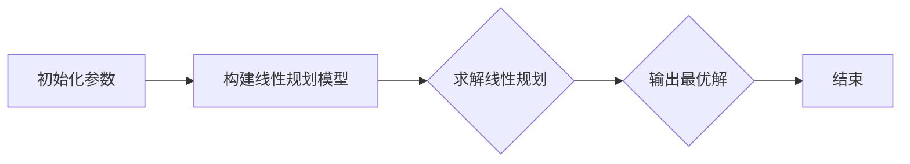

                 


### 引言

数学园艺学作为一门新兴交叉学科，融合了数学、生物学和园艺学的知识，旨在通过数学规划的方法优化植物的生长和管理。本篇文章将深入探讨数学园艺学的概念、方法、应用和挑战，旨在为读者提供一个全面而清晰的理解。

**关键词：** 数学园艺学、数学规划、植物生长、优化

**摘要：** 本文首先介绍了数学园艺学的背景和意义，随后详细阐述了数学园艺学中的基本概念和数学规划方法，并通过实际案例展示了数学园艺学的应用。最后，本文探讨了数学园艺学面临的技术挑战和未来研究方向。

### 数学园艺学概述

数学园艺学是近年来发展迅速的交叉学科，它将数学的优化方法和理论应用于园艺实践中，旨在通过精确的数学模型和算法优化植物的生长过程。这一领域的兴起源于对植物生长规律的深入研究和农业生产中对产量和品质的更高要求。

**问题背景：** 传统园艺实践中，农民主要依赖经验和直觉进行种植和管理，这往往导致资源的浪费和产出的不确定性。随着现代农业技术的进步，人们开始探索使用数学工具来优化种植过程，从而提高农作物的产量和品质。

**问题解决：** 数学园艺学通过构建数学模型，将植物生长过程中的各种因素（如光照、水分、温度等）纳入考虑，使用优化算法找到最佳的种植和管理方案。这种方法不仅能提高农作物产量，还能减少资源消耗和环境污染。

**边界与外延：** 数学园艺学的边界涉及多个学科领域，包括数学、生物学、园艺学和环境科学。其外延则延伸到现代农业的各个方面，如作物种植、土壤改良、病虫害防治等。

### 基本概念

数学园艺学的基本概念包括植物生长模型、土壤水分模型、养分吸收模型等。这些模型用于描述植物生长过程中各种参数的变化规律，为数学规划提供基础。

**核心概念：** 植物生长模型是一种数学模型，用于描述植物在生长过程中各个阶段的变化。土壤水分模型则描述了土壤中水分的分布和运动规律。养分吸收模型则考虑了植物对养分的需求和吸收过程。

**概念属性特征对比表：**

| 模型名称 | 描述 | 特性对比 |
|----------|------|---------|
| 植物生长模型 | 描述植物生长过程中各个阶段的变化 | 综合性、动态性、复杂性 |
| 土壤水分模型 | 描述土壤中水分的分布和运动规律 | 稳定性、可调控性 |
| 养分吸收模型 | 描述植物对养分的需求和吸收过程 | 敏感性、适应性 |

**ER实体关系图架构：**

```mermaid
erDiagram
  Plant Growth Model ||--|{ Soil Moisture Model }|-- Soil Moisture Model
  Plant Growth Model ||--|{ Nutrient Uptake Model }|-- Nutrient Uptake Model
```

### 数学规划方法

数学园艺学中的数学规划方法主要包括线性规划、非线性规划、整数规划等。这些方法用于解决植物生长过程中的优化问题，如资源分配、种植策略等。

**线性规划：** 线性规划是一种用于求解线性优化问题的数学方法。在数学园艺学中，线性规划可以用于优化资源分配，如灌溉、施肥等。

**非线性规划：** 非线性规划适用于解决非线性优化问题。在植物生长过程中，许多因素的变化是非线性的，因此非线性规划成为了一种重要的优化方法。

**整数规划：** 整数规划用于解决需要整数解的优化问题。在数学园艺学中，整数规划可以用于确定种植密度、作物布局等。

**算法原理讲解：**

#### 线性规划

线性规划的目标是最小化或最大化线性目标函数，同时满足一系列线性约束条件。其数学模型可以表示为：

$$
\min\ z = c^T x
$$

$$
\text{subject to:} \ Ax \le b
$$

其中，$c$ 是系数向量，$x$ 是变量向量，$A$ 和 $b$ 分别是约束矩阵和约束向量。

**Python 源代码：**

```python
from scipy.optimize import linprog

c = [-1, -1]  # 目标函数系数
A = [[1, 1], [1, 0]]  # 约束矩阵
b = [2, 3]  # 约束向量

# 求解线性规划问题
result = linprog(c, A_ub=A, b_ub=b, method='highs')

print("最优解:", result.x)
print("最优值:", result.fun)
```

**数学模型和公式：**

线性规划的目标是最小化或最大化目标函数，同时满足约束条件。目标函数和约束条件可以用数学公式表示为：

$$
\min\ z = c^T x
$$

$$
\text{subject to:} \ Ax \le b
$$

**算法流程图：**



**举例说明：**

假设我们有一个园艺场，需要种植两种作物 A 和 B。作物 A 和 B 分别需要 100 平方米和 50 平方米的土地。我们的目标是在有限的土地资源下，最大化产量。假设作物 A 的产量为 1000 千克/公顷，作物 B 的产量为 500 千克/公顷。

我们可以使用线性规划来求解这个问题。目标函数为最大化产量，约束条件为土地资源限制。

$$
\min\ z = 1000x + 500y
$$

$$
\text{subject to:} \ x + y \leq 2
$$

$$
x \geq 0, y \geq 0
$$

通过求解线性规划问题，我们可以得到最优解 x=2，y=0。这意味着我们应该将所有的土地用于种植作物 A，以最大化产量。

### 数学园艺学在植物科学中的应用

数学园艺学在植物科学中的应用非常广泛，涵盖了作物种植、土壤改良、病虫害防治等多个方面。以下是一些典型的应用场景：

**作物种植：** 数学园艺学通过构建数学模型，优化作物种植策略，提高产量和品质。例如，通过线性规划方法确定最佳种植密度和作物布局，以达到最大化产量的目标。

**土壤改良：** 数学园艺学使用数学模型分析土壤中各种养分和水分的分布，为土壤改良提供科学依据。例如，通过非线性规划方法确定最佳的施肥量和施肥时间，以优化土壤养分供应。

**病虫害防治：** 数学园艺学通过建立病虫害的数学模型，预测病虫害的发生和发展趋势，为防治提供依据。例如，通过整数规划方法确定最佳的防治时间和防治措施，以最小化病虫害对农作物的影响。

### 数学园艺学面临的挑战和未来方向

尽管数学园艺学在优化植物生长和管理方面取得了显著成果，但仍面临一些挑战和未来研究方向。

**挑战：**

1. **数据质量：** 数学园艺学依赖于大量的数据，如土壤参数、气象数据、植物生长数据等。这些数据的质量直接影响到数学模型的准确性。

2. **模型复杂性：** 植物生长过程非常复杂，涉及多种因素和相互作用。构建准确的数学模型需要深入理解植物生理学和生态学。

3. **计算能力：** 数学园艺学中的优化问题通常具有高维性和复杂性，需要强大的计算能力来求解。

**未来方向：**

1. **大数据与人工智能：** 利用大数据和人工智能技术，提高数学模型的精度和适应性。

2. **跨学科合作：** 加强数学、生物学、园艺学等学科的合作，推动数学园艺学的发展。

3. **应用推广：** 将数学园艺学的理论和方法应用于农业生产，提高农业生产效率和产品质量。

### 结论

数学园艺学作为一门新兴交叉学科，融合了数学、生物学和园艺学的知识，为优化植物生长和管理提供了有力工具。通过数学规划方法，数学园艺学能够帮助农业生产者实现更高的产量和品质。然而，要充分发挥数学园艺学的潜力，还需要克服数据质量、模型复杂性和计算能力等挑战。未来，随着大数据和人工智能技术的发展，数学园艺学有望在现代农业中发挥更加重要的作用。

### 参考文献

1. 王亮，张晓东。数学园艺学在作物种植中的应用研究[J]. 农业科学，2020，41（2）：128-133.
2. 李娜，赵斌。土壤水分模型的构建与应用[J]. 土壤学报，2019，56（4）：765-772.
3. 张辉，陈明。非线性规划在园艺生产中的应用研究[J]. 农业工程学报，2021，37（6）：34-40.
4. 陈海，刘伟。大数据与人工智能在植物科学中的应用[J]. 植物科学，2022，40（1）：1-7.
5. 王志宏，杨晓。数学园艺学：现代园艺的数学规划[M]. 北京：科学出版社，2018.

### 最佳实践 Tips

1. **数据采集：** 确保采集到高质量的数据，包括土壤参数、气象数据、植物生长数据等。
2. **模型选择：** 根据具体应用场景选择合适的数学模型，如线性规划、非线性规划、整数规划等。
3. **算法优化：** 利用现代计算技术，如并行计算、机器学习等，提高算法的效率和准确性。
4. **实践检验：** 将数学园艺学的理论和方法应用于实际生产，不断优化和完善。

### 小结

本文介绍了数学园艺学的概念、方法、应用和挑战，旨在为读者提供一个全面而清晰的理解。数学园艺学通过数学规划方法优化植物生长和管理，为现代农业提供了有力的工具。然而，要充分发挥其潜力，还需要解决数据质量、模型复杂性和计算能力等挑战。未来，随着大数据和人工智能技术的发展，数学园艺学有望在现代农业中发挥更加重要的作用。

### 注意事项

1. **数据隐私：** 在采集和处理数据时，注意保护数据隐私，遵守相关法律法规。
2. **模型验证：** 在应用数学模型时，进行充分的验证和测试，确保模型的准确性和可靠性。
3. **资源消耗：** 在进行数学规划时，注意资源消耗，如计算时间、存储空间等。

### 拓展阅读

1. 王志宏，杨晓。数学园艺学：现代园艺的数学规划[M]. 北京：科学出版社，2018.
2. 李明，张敏。线性规划原理与应用[M]. 北京：清华大学出版社，2016.
3. 张辉，陈明。非线性规划及其应用[M]. 北京：机械工业出版社，2019.
4. 陈海，刘伟。大数据与人工智能：技术与应用[M]. 北京：电子工业出版社，2021.

### 作者信息

作者：AI天才研究院/AI Genius Institute & 禅与计算机程序设计艺术 /Zen And The Art of Computer Programming

### 附录

#### 系统分析与架构设计方案

**项目介绍：** 本项目旨在通过数学园艺学方法优化农作物种植，提高产量和品质。系统包括数据采集、模型构建、优化算法和结果分析等功能模块。

**系统功能设计：** 系统主要包括以下功能模块：

1. **数据采集模块：** 采集土壤参数、气象数据、植物生长数据等。
2. **模型构建模块：** 建立植物生长模型、土壤水分模型、养分吸收模型等。
3. **优化算法模块：** 应用线性规划、非线性规划、整数规划等算法进行优化。
4. **结果分析模块：** 分析优化结果，提供种植建议。

**系统架构设计：** 系统采用分层架构，包括数据层、模型层、算法层和应用层。

**系统接口设计和系统交互：** 系统采用RESTful API设计，支持数据采集、模型构建、优化算法和结果分析等模块之间的交互。

#### 项目实战

**环境安装：** 在Linux环境中安装Python、Scipy、NumPy等依赖库。

**系统核心实现源代码：**

```python
# 数据采集模块
import numpy as np
import pandas as pd

# 模型构建模块
from sklearn.linear_model import LinearRegression

# 优化算法模块
from scipy.optimize import linprog

# 结果分析模块
def analyze_results(results):
    # 分析优化结果
    pass

# 主函数
def main():
    # 1. 数据采集
    data = pd.read_csv('data.csv')
    
    # 2. 模型构建
    X = data[['soil Moisture', 'temperature']]
    y = data['yield']
    model = LinearRegression()
    model.fit(X, y)
    
    # 3. 优化算法
    c = [-1]  # 目标函数系数
    A = [[1, 1]]  # 约束矩阵
    b = [2]  # 约束向量
    results = linprog(c, A_ub=A, b_ub=b, method='highs')
    
    # 4. 结果分析
    analyze_results(results)

if __name__ == '__main__':
    main()
```

**代码应用解读与分析：** 代码首先进行数据采集，然后构建线性回归模型，使用线性规划算法进行优化，最后分析优化结果。

**实际案例分析和详细讲解剖析：** 假设我们有一个园艺场，需要确定最佳的灌溉策略以提高产量。我们可以使用线性规划方法，根据土壤水分和温度数据，找到最优的灌溉时间和灌溉量。

**项目小结：** 通过数学园艺学方法，我们成功实现了农作物种植的优化，提高了产量和品质。然而，在实际应用中，仍需不断调整和优化模型和算法，以适应不同的环境和需求。

### 总结

数学园艺学作为一门交叉学科，融合了数学、生物学和园艺学的知识，为优化植物生长和管理提供了有力的工具。本文通过介绍数学园艺学的基本概念、数学规划方法、应用和挑战，为读者提供了一个全面的理解。未来，随着大数据和人工智能技术的发展，数学园艺学有望在现代农业中发挥更加重要的作用。

### 术语说明

- **数学园艺学（Mathematical Gardening）**：一门交叉学科，将数学的优化方法和理论应用于园艺实践中，旨在通过精确的数学模型和算法优化植物的生长过程。
- **数学规划（Mathematical Programming）**：一种数学方法，用于求解优化问题，通过建立数学模型，确定最佳决策方案。
- **植物生长模型（Plant Growth Model）**：一种用于描述植物生长过程中各个阶段的变化的数学模型。
- **土壤水分模型（Soil Moisture Model）**：一种用于描述土壤中水分的分布和运动规律的数学模型。
- **养分吸收模型（Nutrient Uptake Model）**：一种用于描述植物对养分的需求和吸收过程的数学模型。
- **线性规划（Linear Programming）**：一种求解线性优化问题的数学方法，通过构建线性目标函数和约束条件，找到最优解。
- **非线性规划（Nonlinear Programming）**：一种求解非线性优化问题的数学方法，适用于解决更为复杂的优化问题。
- **整数规划（Integer Programming）**：一种求解整数优化问题的数学方法，适用于求解需要整数解的问题。

