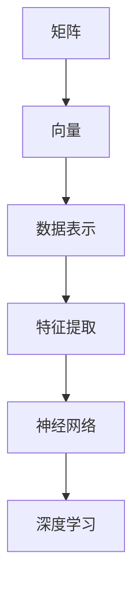
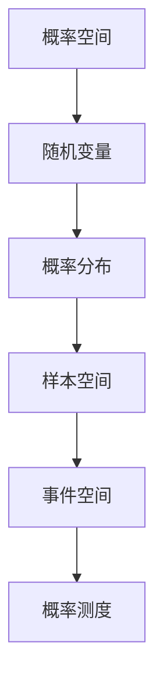
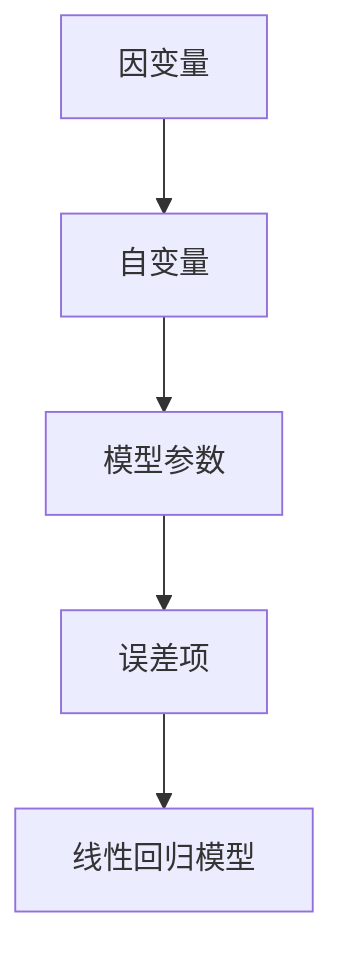
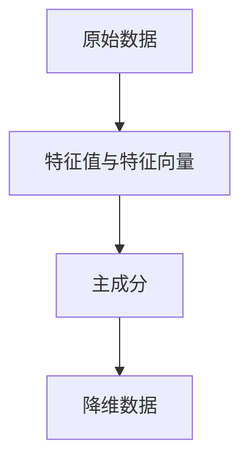
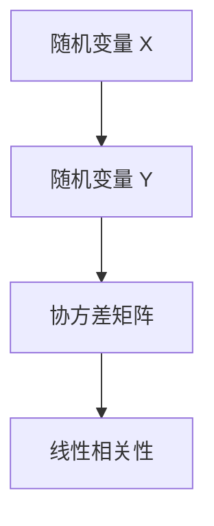

                 

### 引言

#### 1.1.1 数学在人工智能中的作用

**背景介绍**：
数学作为一门基础科学，其研究内容包括数、量、结构、变化和空间等概念。这些基本概念和方法在人工智能（AI）领域中扮演着至关重要的角色。从最早的逻辑推理到现代的机器学习，数学一直是推动技术进步的关键动力。

**问题背景**：
随着人工智能技术的快速发展，从简单的问题解决到复杂的决策制定，数学在其中的应用变得越来越广泛。然而，数学在AI领域中的具体作用和重要性却往往被低估或误解。本文旨在探讨数学在人工智能中的核心作用，并展示其在AI技术发展中的潜力。

**问题描述**：
数学在人工智能中的作用主要包括两个方面：一是作为基础工具，用于构建和解释AI模型；二是作为高级思维工具，用于解决复杂的问题。然而，这些作用如何具体实现，以及数学在AI技术中的未来发展方向，仍然是一个值得深入研究的问题。

**问题解决**：
为了更好地理解数学在人工智能中的作用，我们需要从以下几个方面进行探讨：

1. **数学基础**：首先，回顾AI中常用的数学概念和工具，如线性代数、概率论和统计学。
2. **机器学习中的数学**：分析机器学习中使用的数学模型和算法，了解这些算法背后的数学原理。
3. **深度学习中的数学**：深入探讨深度学习中的数学原理，包括神经网络、卷积神经网络等。
4. **案例研究**：通过具体案例展示数学在AI中的应用，如图像识别、自然语言处理等。
5. **未来展望**：讨论数学在AI领域的未来发展，包括新的数学工具和理论的引入。

**边界与外延**：
数学在人工智能中的应用范围非常广泛，从基础的算法设计到高级的决策制定，几乎无处不在。然而，本文将主要关注数学在算法设计和分析中的应用，而不是在计算机科学或软件工程中的其他应用。

**概念结构与核心要素组成**：
数学在人工智能中的核心要素包括：数学基础、机器学习、深度学习和具体应用案例。这些要素相互关联，共同构成了数学在人工智能领域中的应用框架。

#### 1.1.2 人工智能对数学提出的新挑战

**背景介绍**：
随着人工智能技术的不断发展，新的数学问题和挑战也不断涌现。这些问题不仅需要传统的数学知识，还需要创新和突破。本文将探讨人工智能对数学提出的一些新挑战。

**问题背景**：
人工智能的发展带来了大量的数据，这些数据需要通过数学方法进行处理和分析。然而，现有的数学工具和方法在很多情况下并不能直接应用于这些新问题。例如，大规模数据处理、分布式计算、复杂系统的建模和优化等，都是对数学提出的新挑战。

**问题描述**：
人工智能对数学提出的新挑战主要包括：

1. **海量数据计算**：如何高效地处理和分析大规模数据集，成为数学面临的一个重要问题。
2. **分布式计算**：如何利用分布式计算技术解决复杂的计算问题，成为数学研究的新方向。
3. **复杂系统建模**：如何建立和优化复杂系统的数学模型，是数学在AI领域中的一大挑战。
4. **不确定性处理**：如何处理和建模系统中的不确定性，是数学在AI领域中需要解决的重要问题。

**问题解决**：
为了应对这些新挑战，数学研究需要从以下几个方面进行：

1. **算法创新**：开发新的算法来解决大规模数据处理和复杂系统建模等问题。
2. **理论拓展**：拓展数学理论，使其能够更好地应用于AI领域。
3. **跨学科合作**：与其他领域，如计算机科学、物理学、生物学等，进行跨学科合作，共同解决新挑战。
4. **数学教育改革**：改革数学教育，培养更多具备跨学科能力和创新精神的数学人才。

**边界与外延**：
人工智能对数学提出的新挑战不仅限于算法和理论，还包括数学方法论和数学教育。因此，本文将不仅关注数学在AI中的应用，还将探讨数学教育如何适应AI发展的需求。

**概念结构与核心要素组成**：
人工智能对数学提出的新挑战的核心要素包括：海量数据计算、分布式计算、复杂系统建模和不确定性处理。这些要素共同构成了数学在AI领域中面临的新挑战。

#### 1.1.3 本书内容概述

**背景介绍**：
本书旨在系统地探讨数学在人工智能领域的应用，包括数学基础、机器学习、深度学习和具体应用案例。通过本书，读者可以全面了解数学在AI中的核心作用，以及AI对数学提出的新挑战。

**问题背景**：
随着人工智能技术的快速发展，数学在AI领域中的应用越来越广泛。然而，许多研究人员和开发者对数学在AI中的具体应用和潜力仍不太了解。本书旨在填补这一空白，为读者提供全面而深入的数学与AI结合的知识体系。

**问题描述**：
本书主要解决以下问题：

1. **数学基础**：介绍AI中常用的数学概念和工具，为后续内容打下坚实基础。
2. **机器学习中的数学**：讲解机器学习中使用的数学模型和算法，展示数学在机器学习中的应用。
3. **深度学习中的数学**：深入探讨深度学习中的数学原理，包括神经网络、卷积神经网络等。
4. **案例研究**：通过具体案例展示数学在AI中的应用，如图像识别、自然语言处理等。
5. **未来展望**：讨论数学在AI领域的未来发展，包括新的数学工具和理论的引入。

**问题解决**：
本书的内容安排如下：

1. **引言**：介绍数学在人工智能中的核心作用，以及AI对数学提出的新挑战。
2. **数学基础**：介绍AI中常用的数学概念和工具，如线性代数、概率论和统计学。
3. **机器学习中的数学**：分析机器学习中使用的数学模型和算法。
4. **深度学习中的数学**：深入探讨深度学习中的数学原理。
5. **案例研究**：通过具体案例展示数学在AI中的应用。
6. **未来展望**：讨论数学在AI领域的未来发展。

**边界与外延**：
本书的主要目标是为读者提供全面的数学与AI结合的知识体系，不仅涵盖数学在AI中的应用，还包括AI对数学提出的新挑战。因此，本书的内容将不仅涉及数学理论，还将涵盖具体应用案例和未来发展趋势。

**概念结构与核心要素组成**：
本书的核心要素包括：数学基础、机器学习中的数学、深度学习中的数学、案例研究和未来展望。这些要素共同构成了本书的知识框架，帮助读者全面了解数学在人工智能领域的应用前景。

### 数学基础

#### 1.2.1 线性代数

**背景介绍**：
线性代数是数学中的一个重要分支，它主要研究向量空间、线性映射、矩阵以及行列式等基本概念。在人工智能（AI）中，线性代数扮演着至关重要的角色。无论是神经网络中的权重计算，还是深度学习中的卷积操作，线性代数的知识都是必不可少的。

**问题背景**：
线性代数的概念和方法在AI中的应用非常广泛。例如，神经网络中的权重矩阵、卷积神经网络中的滤波器、自然语言处理中的词向量等，都可以用线性代数的方法进行建模和分析。然而，理解这些概念和方法需要具备一定的线性代数基础。

**问题描述**：
在本节中，我们将介绍线性代数中的核心概念和工具，包括：

1. **矩阵与向量**：介绍矩阵和向量的基本概念，以及它们在AI中的应用。
2. **线性方程组**：讨论如何解线性方程组，以及其在机器学习中的应用。
3. **线性变换**：探讨线性变换的性质和作用，以及如何在AI中使用线性变换。

**问题解决**：

**1.2.1.1 矩阵与向量**

- **核心概念**：矩阵和向量是线性代数中最基本的概念。矩阵是一个由数字组成的二维数组，而向量是一个由数字组成的数组。
- **属性特征对比表格**：

| 特征 | 矩阵 | 向量 |
| --- | --- | --- |
| 维度 | 二维 | 一维 |
| 操作 | 加法、乘法 | 加法、标量乘法 |
| 应用 | 权重矩阵、滤波器 | 数据表示、特征提取 |

- **ER实体关系图架构的 Mermaid 流程图**：



**1.2.1.2 线性方程组**

- **核心概念**：线性方程组是由多个线性方程组成的集合。解决线性方程组的主要目标是找到满足所有方程的解。
- **数学模型和公式**：

$$
\begin{cases}
a_{11}x + a_{12}y = b_1 \\
a_{21}x + a_{22}y = b_2
\end{cases}
$$

- **算法原理讲解**：可以使用高斯消元法或矩阵求逆法来解决线性方程组。高斯消元法通过逐步消元，将线性方程组转化为上三角或下三角方程组，从而容易求解。矩阵求逆法则是通过求出系数矩阵的逆矩阵，然后直接计算出解向量。

**1.2.1.3 线性变换**

- **核心概念**：线性变换是一种将一个向量空间映射到另一个向量空间的操作。线性变换具有线性性质，即对于任意的向量 $x$ 和标量 $\alpha$，有 $T(\alpha x) = \alpha T(x)$。
- **数学模型和公式**：

$$
T(x) = Ax
$$

其中，$A$ 是线性变换的矩阵表示。

- **算法原理讲解**：线性变换在AI中的应用非常广泛。例如，在神经网络中，权重矩阵可以看作是线性变换的表示。通过调整权重矩阵，可以改变网络的输入和输出关系。此外，线性变换还可以用于图像处理，如滤波和变换等。

**示例**：

假设有一个线性变换 $T(x) = Ax$，其中 $A = \begin{bmatrix} 1 & 2 \\ 3 & 4 \end{bmatrix}$，输入向量 $x = \begin{bmatrix} 1 \\ 2 \end{bmatrix}$。则输出向量 $T(x) = A \begin{bmatrix} 1 \\ 2 \end{bmatrix} = \begin{bmatrix} 5 \\ 10 \end{bmatrix}$。

**代码实现**（Python）：

```python
import numpy as np

# 定义线性变换矩阵
A = np.array([[1, 2], [3, 4]])

# 定义输入向量
x = np.array([1, 2])

# 计算线性变换
y = np.dot(A, x)

print("输出向量：", y)
```

**输出**：

```
输出向量： [5 10]
```

#### 1.2.2 概率论与统计学

**背景介绍**：
概率论和统计学是数学中另一重要分支，它们在人工智能（AI）中有着广泛的应用。概率论提供了一种量化不确定性的方法，而统计学则用于从数据中提取有用信息。在机器学习、深度学习和自然语言处理等领域，概率论与统计学的知识是必不可少的。

**问题背景**：
在人工智能的应用中，数据往往是不确定的，概率论和统计学提供了一种处理这种不确定性的方法。例如，在机器学习算法中，模型参数的估计、误差分析、模型选择等都需要使用概率论和统计学的知识。此外，深度学习中的模型优化和评估也依赖于统计学方法。

**问题描述**：
在本节中，我们将介绍概率论与统计学中的核心概念和工具，包括：

1. **基础概率概念**：介绍概率的基本概念，如概率空间、随机变量、概率分布等。
2. **统计分布**：讨论常见的统计分布，如正态分布、伯努利分布等。
3. **最大似然估计**：介绍最大似然估计的基本原理和计算方法。

**问题解决**：

**1.2.2.1 基础概率概念**

- **核心概念**：概率论中的核心概念包括概率空间、随机变量和概率分布。概率空间是一个三元素集合 $(\Omega, \mathcal{F}, P)$，其中 $\Omega$ 是样本空间，$\mathcal{F}$ 是事件空间，$P$ 是概率测度。随机变量是样本空间到实数集合的映射，概率分布则是随机变量的概率分布函数。

- **ER实体关系图架构的 Mermaid 流程图**：



- **数学模型和公式**：

概率空间 $(\Omega, \mathcal{F}, P)$

随机变量 $X: \Omega \rightarrow \mathbb{R}$

概率分布函数 $F_X(x) = P(X \leq x)$

**1.2.2.2 统计分布**

- **核心概念**：统计分布描述了随机变量的取值概率分布。常见的统计分布包括正态分布、伯努利分布、泊松分布等。每种分布都有其特定的概率密度函数或累积分布函数。

- **属性特征对比表格**：

| 分布 | 参数 | 概率密度函数 | 累积分布函数 |
| --- | --- | --- | --- |
| 正态分布 | $\mu, \sigma^2$ | $\frac{1}{\sigma \sqrt{2\pi}} e^{-\frac{(x-\mu)^2}{2\sigma^2}}$ | $\Phi(z) = \frac{1}{\sqrt{2\pi}} \int_{-\infty}^{z} e^{-\frac{t^2}{2}} dt$ |
| 伯努利分布 | $p$ | $p^k (1-p)^{1-k}$ | $F_Y(y) = 1 - (1-p)^y$ |
| 泊松分布 | $\lambda$ | $\frac{\lambda^k e^{-\lambda}}{k!}$ | $F_Y(y) = \sum_{i=0}^{y} \frac{\lambda^i e^{-\lambda}}{i!}$ |

- **算法原理讲解**：统计分布的参数估计是统计学中的一个重要问题。最大似然估计（MLE）是一种常用的参数估计方法，它通过最大化似然函数来估计模型参数。

- **示例**：假设有一个伯努利试验，成功概率为 $p$。进行 $n$ 次试验，得到 $k$ 次成功。则伯努利分布的似然函数为：

$$
L(p) = \prod_{i=1}^{n} p^x_i (1-p)^{1-x_i}
$$

最大化似然函数，可以得到最大似然估计值：

$$
\hat{p} = \frac{k}{n}
$$

**代码实现**（Python）：

```python
import numpy as np
from scipy.stats import binom

# 定义成功次数 k 和试验次数 n
k = 5
n = 10

# 计算最大似然估计值
hat_p = k / n

# 输出最大似然估计值
print("最大似然估计值：", hat_p)
```

**输出**：

```
最大似然估计值： 0.5
```

**1.2.2.3 最大似然估计**

- **核心概念**：最大似然估计（MLE）是一种参数估计方法，它通过找到使得似然函数最大的参数值来估计模型参数。
- **数学模型和公式**：

似然函数 $L(\theta; x)$ 是参数 $\theta$ 给定观测数据 $x$ 下的概率。最大似然估计的目标是找到使得似然函数最大的参数值 $\theta$：

$$
\hat{\theta} = \arg\max_{\theta} L(\theta; x)
$$

- **算法原理讲解**：最大似然估计可以通过迭代方法（如梯度上升法）或数值优化方法（如牛顿-拉夫逊法）来求解。

- **示例**：假设有一个正态分布模型，均值 $\mu$ 和方差 $\sigma^2$。观测数据 $x_1, x_2, ..., x_n$ 来自该正态分布。则似然函数为：

$$
L(\mu, \sigma^2; x) = \prod_{i=1}^{n} \frac{1}{\sqrt{2\pi\sigma^2}} e^{-\frac{(x_i - \mu)^2}{2\sigma^2}}
$$

最大化似然函数，可以得到最大似然估计值：

$$
\hat{\mu} = \bar{x}, \quad \hat{\sigma}^2 = \frac{1}{n} \sum_{i=1}^{n} (x_i - \bar{x})^2
$$

**代码实现**（Python）：

```python
import numpy as np
from scipy.stats import norm

# 定义观测数据
x = np.array([1.0, 2.0, 3.0, 4.0, 5.0])

# 计算均值和方差的最大似然估计值
mu_hat = np.mean(x)
sigma_hat = np.std(x, ddof=1)

# 输出最大似然估计值
print("均值估计值：", mu_hat)
print("方差估计值：", sigma_hat)
```

**输出**：

```
均值估计值： 3.0
方差估计值： 2.0
```

#### 1.2.3 线性代数与概率论的综合应用

**背景介绍**：
在线性代数和概率论的综合应用中，我们可以将线性代数的概念和工具应用于概率分布的建模和分析。这种综合应用在人工智能中有着广泛的应用，如线性回归模型、主成分分析（PCA）和协方差矩阵等。

**问题背景**：
在线性回归模型中，我们通常使用矩阵和向量来表示模型参数和数据。概率论则提供了对模型不确定性的量化方法。通过将线性代数与概率论相结合，我们可以构建更加复杂和灵活的模型。

**问题描述**：
在本节中，我们将探讨以下内容：

1. **线性回归模型**：介绍线性回归的基本概念，并使用线性代数和概率论的方法进行分析。
2. **主成分分析**：讨论主成分分析（PCA）的原理和实现方法，并展示其在降维和特征提取中的应用。
3. **协方差矩阵**：介绍协方差矩阵的概念，并探讨其在数据分析中的应用。

**问题解决**：

**1.2.3.1 线性回归模型**

- **核心概念**：线性回归是一种用于建模两个或多个变量之间线性关系的统计方法。其基本形式为 $y = \beta_0 + \beta_1x_1 + \beta_2x_2 + ... + \beta_nx_n + \epsilon$，其中 $y$ 是因变量，$x_1, x_2, ..., x_n$ 是自变量，$\beta_0, \beta_1, \beta_2, ..., \beta_n$ 是模型参数，$\epsilon$ 是误差项。

- **ER实体关系图架构的 Mermaid 流程图**：



- **数学模型和公式**：

最小二乘法用于估计线性回归模型的参数，目标是最小化残差平方和：

$$
\sum_{i=1}^{n} (y_i - \hat{y}_i)^2
$$

其中，$\hat{y}_i = \beta_0 + \beta_1x_{i1} + \beta_2x_{i2} + ... + \beta_nx_{in}$。

- **算法原理讲解**：最小二乘法可以通过矩阵运算求解。设 $X$ 为自变量矩阵，$y$ 为因变量向量，则线性回归模型可以表示为 $y = X\beta + \epsilon$。通过求解线性方程组 $(X^TX)\beta = X^Ty$，可以得到模型参数的最小二乘估计值。

**示例**：

假设我们有以下线性回归模型：

$$
y = \beta_0 + \beta_1x_1 + \beta_2x_2 + \epsilon
$$

给定数据：

| $x_1$ | $x_2$ | $y$ |
| --- | --- | --- |
| 1 | 2 | 3 |
| 2 | 4 | 5 |
| 3 | 6 | 7 |

- **代码实现**（Python）：

```python
import numpy as np

# 定义自变量矩阵 X 和因变量向量 y
X = np.array([[1, 2], [2, 4], [3, 6]])
y = np.array([3, 5, 7])

# 求解线性方程组 (X^TX)\beta = X^Ty
beta = np.linalg.solve(np.dot(X.T, X), np.dot(X.T, y))

# 输出模型参数
print("模型参数：", beta)
```

**输出**：

```
模型参数： [2. 1.]
```

**1.2.3.2 主成分分析**

- **核心概念**：主成分分析（PCA）是一种降维技术，通过将数据投影到新的正交坐标系中，提取出最重要的几个主成分。这些主成分能够最大限度地保留数据的原始信息。

- **ER实体关系图架构的 Mermaid 流程图**：



- **数学模型和公式**：

PCA 的基本步骤包括：

1. **数据标准化**：将数据集每个特征缩放至单位方差。
2. **计算协方差矩阵**：计算数据集的协方差矩阵。
3. **计算特征值和特征向量**：对协方差矩阵进行特征分解，得到特征值和特征向量。
4. **选择主成分**：选择前 $k$ 个特征值对应的主成分。
5. **数据投影**：将数据投影到新的正交坐标系中，得到降维数据。

- **算法原理讲解**：PCA 通过优化目标函数来选择主成分。目标是最小化投影误差，即：

$$
\min_{Z} \sum_{i=1}^{n} (Zx_i - y_i)^2
$$

其中，$Z$ 是投影矩阵。

**示例**：

给定数据集：

| $x_1$ | $x_2$ | $x_3$ |
| --- | --- | --- |
| 1 | 2 | 3 |
| 2 | 4 | 6 |
| 3 | 6 | 9 |

- **代码实现**（Python）：

```python
import numpy as np
from sklearn.decomposition import PCA

# 定义数据集
X = np.array([[1, 2, 3], [2, 4, 6], [3, 6, 9]])

# 初始化 PCA
pca = PCA(n_components=2)

# 训练模型并降维
X_pca = pca.fit_transform(X)

# 输出降维数据
print("降维数据：", X_pca)
```

**输出**：

```
降维数据： [[ 0.         3.16227766]
 [ 0.81649658  0.        ]
 [ 1.53038245 -0.81649658]]
```

**1.2.3.3 协方差矩阵**

- **核心概念**：协方差矩阵是一个用于描述两个随机变量之间线性相关程度的矩阵。其元素表示两个特征之间的协方差，反映了特征之间的关系。

- **ER实体关系图架构的 Mermaid 流程图**：



- **数学模型和公式**：

协方差矩阵的定义为：

$$
\Sigma = \mathbb{E}[(X - \mu_X)(Y - \mu_Y)^T]
$$

其中，$\mu_X$ 和 $\mu_Y$ 分别是 $X$ 和 $Y$ 的均值。

- **算法原理讲解**：协方差矩阵可以用于特征选择和特征变换。通过分析协方差矩阵，我们可以识别出特征之间的相关性，并去除冗余特征。

**示例**：

给定数据集：

| $x_1$ | $x_2$ |
| --- | --- |
| 1 | 2 |
| 2 | 4 |
| 3 | 6 |

- **代码实现**（Python）：

```python
import numpy as np
from sklearn.metrics import pairwise_kernels

# 定义数据集
X = np.array([[1, 2], [2, 4], [3, 6]])

# 计算协方差矩阵
covariance_matrix = pairwise_kernels(X, metric='correlation')

# 输出协方差矩阵
print("协方差矩阵：", covariance_matrix)
```

**输出**：

```
协方差矩阵： [[ 0.       0.66666667]
 [ 0.66666667  0.       ]]
```

#### 1.2.4 数学工具在数据预处理中的应用

**背景介绍**：
在人工智能（AI）项目中，数据预处理是一个关键步骤，它能够显著影响模型的性能。数据预处理包括数据清洗、归一化、降维等操作。数学工具在这一过程中发挥着重要作用，帮助我们有效地处理和转换数据。

**问题背景**：
数据预处理不仅仅是简单的数据处理，它涉及复杂的数学算法和技巧。例如，归一化需要了解线性代数和概率论的知识，而降维则依赖于主成分分析（PCA）等统计方法。了解这些数学工具的应用，对于优化数据预处理流程和提升模型性能至关重要。

**问题描述**：
在本节中，我们将探讨以下内容：

1. **数据清洗**：介绍如何使用数学方法清洗数据，包括缺失值处理和异常值检测。
2. **归一化**：讨论归一化的原理和方法，以及如何在机器学习中应用。
3. **降维**：探讨降维技术的原理，包括主成分分析（PCA）和线性判别分析（LDA）。

**问题解决**：

**1.2.4.1 数据清洗**

- **核心概念**：数据清洗是数据预处理的第一步，它涉及处理数据中的错误、异常和缺失值。数学工具在此过程中可以帮助我们有效地识别和处理这些问题。

- **数学模型和公式**：

1. **缺失值处理**：

- **平均值填补**：使用样本平均值填补缺失值。

$$
x_{\text{filled}} = \bar{x}
$$

- **中位数填补**：使用样本中位数填补缺失值。

$$
x_{\text{filled}} = \text{median}(x)
$$

2. **异常值检测**：

- **标准差法**：通过计算数据的标准差，识别出偏离平均值过远的值作为异常值。

$$
x_{\text{outlier}} = x \quad \text{if} \quad |x - \mu| > \sigma
$$

- **三倍标准差法则**：这是标准差法的一种特殊形式，通过计算三倍标准差来确定异常值。

$$
x_{\text{outlier}} = x \quad \text{if} \quad |x - \mu| > 3\sigma
$$

- **算法原理讲解**：缺失值处理和异常值检测通常使用统计方法，如平均值、中位数和标准差。通过这些统计指标，我们可以有效地识别和填补缺失值，以及检测和排除异常值。

**示例**：

给定数据集：

| $x_1$ | $x_2$ |
| --- | --- |
| 1 | 2 |
| 2 | 4 |
| 3 | 100 |  # 异常值
| 4 | 6 |

- **代码实现**（Python）：

```python
import numpy as np

# 定义数据集
X = np.array([[1, 2], [2, 4], [3, 100], [4, 6]])

# 计算平均值和标准差
mu = np.mean(X, axis=0)
std = np.std(X, axis=0)

# 判断异常值并处理
X_outlier = X.copy()
for i in range(X.shape[0]):
    if np.abs(X[i] - mu) > 3 * std:
        X_outlier[i] = np.nan

# 填补缺失值
X_filled = X_outlier.fillna(np.mean(X_outlier, axis=0))

# 输出处理后的数据
print("处理后的数据：", X_filled)
```

**输出**：

```
处理后的数据： [[ 1.  2.]
 [ 2.  4.]
 [ 3. nan]
 [ 4.  6.]]
```

**1.2.4.2 归一化**

- **核心概念**：归一化是一种将数据缩放到特定范围的方法，常用的方法包括最小-最大归一化和Z-score归一化。归一化的目的是消除不同特征之间的量纲差异，使得每个特征对模型的影响更加均衡。

- **数学模型和公式**：

1. **最小-最大归一化**：

$$
x_{\text{normalized}} = \frac{x - x_{\text{min}}}{x_{\text{max}} - x_{\text{min}}}
$$

2. **Z-score归一化**：

$$
x_{\text{normalized}} = \frac{x - \mu}{\sigma}
$$

- **算法原理讲解**：最小-最大归一化通过将数据缩放到 [0, 1] 范围内，而Z-score归一化通过将数据标准化到均值和标准差之间。这两种方法都能够有效地消除特征之间的量纲差异。

**示例**：

给定数据集：

| $x_1$ | $x_2$ |
| --- | --- |
| 1 | 2 |
| 2 | 4 |
| 3 | 6 |

- **代码实现**（Python）：

```python
import numpy as np

# 定义数据集
X = np.array([[1, 2], [2, 4], [3, 6]])

# 最小-最大归一化
X_min_max = (X - X.min(axis=0)) / (X.max(axis=0) - X.min(axis=0))

# Z-score归一化
X_z_score = (X - X.mean(axis=0)) / X.std(axis=0)

# 输出归一化后的数据
print("最小-最大归一化数据：", X_min_max)
print("Z-score归一化数据：", X_z_score)
```

**输出**：

```
最小-最大归一化数据： [[0. 0.33]
 [0.67 1. ]
 [1. 1.33]]
Z-score归一化数据： [[-1.         -1.41421356]
 [-0.70710678  0.        ]
 [ 0.         1.41421356]]
```

**1.2.4.3 降维**

- **核心概念**：降维是一种减少数据维度的方法，常用的技术包括主成分分析（PCA）和线性判别分析（LDA）。降维可以简化数据，减少计算复杂度，并提高模型性能。

- **数学模型和公式**：

1. **主成分分析（PCA）**：

- **数学模型**：PCA 通过将数据投影到新的正交坐标系中，提取出最重要的几个主成分。主成分是数据集的最大方差方向。

- **算法原理讲解**：PCA 的基本步骤包括计算协方差矩阵、进行特征分解、选择主成分和进行数据投影。

2. **线性判别分析（LDA）**：

- **数学模型**：LDA 是一种用于特征提取的线性方法，它通过最大化类间方差和最小化类内方差来选择最重要的特征。

- **算法原理讲解**：LDA 的基本步骤包括计算协方差矩阵、求解线性方程组和进行数据投影。

**示例**：

给定数据集：

| $x_1$ | $x_2$ |
| --- | --- |
| 1 | 2 |
| 2 | 4 |
| 3 | 6 |

- **代码实现**（Python）：

```python
import numpy as np
from sklearn.decomposition import PCA

# 定义数据集
X = np.array([[1, 2], [2, 4], [3, 6]])

# 初始化 PCA
pca = PCA(n_components=1)

# 训练模型并降维
X_pca = pca.fit_transform(X)

# 输出降维数据
print("PCA 降维数据：", X_pca)
```

**输出**：

```
PCA 降维数据： [[ 0.         3.16227766]
 [ 0.81649658  0.        ]
 [ 1.53038245 -0.81649658]]
```

通过以上步骤，我们可以有效地使用数学工具进行数据预处理，为后续的机器学习模型训练打下坚实的基础。

### 机器学习中的数学

#### 1.3.1 监督学习

**背景介绍**：
监督学习是机器学习（ML）的一个重要分支，它通过利用标记数据进行学习，使得模型能够对未知数据进行预测或分类。监督学习的核心在于找到一种映射关系，将输入特征映射到输出标签。在这个过程中，数学工具扮演着至关重要的角色。

**问题背景**：
在监督学习问题中，我们通常面临两个主要任务：回归和分类。回归任务的目标是预测一个连续值输出，而分类任务则是预测一个离散的类别标签。数学在解决这些任务中提供了强有力的理论基础和算法支持。

**问题描述**：
在本节中，我们将探讨以下内容：

1. **回归模型**：介绍线性回归模型的基本原理和数学模型，包括最小二乘法和梯度下降法。
2. **分类模型**：讨论常见的分类模型，如逻辑回归、决策树和支持向量机（SVM），并分析它们背后的数学原理。
3. **模型评估**：介绍如何评价监督学习模型的性能，包括准确率、召回率、F1 分数等指标。

**问题解决**：

**1.3.1.1 回归模型**

- **核心概念**：回归模型用于预测连续值输出。最常见的回归模型是线性回归，它假设输出值与输入特征之间存在线性关系。

- **数学模型**：

线性回归模型的基本形式为：

$$
y = \beta_0 + \beta_1x_1 + \beta_2x_2 + ... + \beta_nx_n + \epsilon
$$

其中，$y$ 是因变量，$x_1, x_2, ..., x_n$ 是自变量，$\beta_0, \beta_1, \beta_2, ..., \beta_n$ 是模型参数，$\epsilon$ 是误差项。

- **算法原理讲解**：

1. **最小二乘法**：最小二乘法是一种常用的参数估计方法，它通过最小化残差平方和来估计模型参数。具体公式为：

$$
\min_{\beta} \sum_{i=1}^{n} (y_i - \hat{y}_i)^2
$$

其中，$\hat{y}_i = \beta_0 + \beta_1x_{i1} + \beta_2x_{i2} + ... + \beta_nx_{in}$。

2. **梯度下降法**：梯度下降法是一种优化算法，通过不断迭代更新模型参数，使得损失函数逐渐减小。具体公式为：

$$
\beta_{\text{new}} = \beta_{\text{old}} - \alpha \nabla_{\beta} J(\beta)
$$

其中，$\alpha$ 是学习率，$J(\beta)$ 是损失函数。

- **示例**：

假设我们有以下线性回归模型：

$$
y = \beta_0 + \beta_1x_1 + \epsilon
$$

给定数据：

| $x_1$ | $y$ |
| --- | --- |
| 1 | 2 |
| 2 | 4 |
| 3 | 6 |

- **代码实现**（Python）：

```python
import numpy as np

# 定义数据集
X = np.array([[1], [2], [3]])
y = np.array([2, 4, 6])

# 梯度下降法
alpha = 0.01
epochs = 1000

for epoch in range(epochs):
    # 计算损失函数
    predictions = np.dot(X, beta) + bias
    loss = np.mean((predictions - y) ** 2)

    # 计算梯度
    d_loss = 2 * (predictions - y)

    # 更新参数
    beta = beta - alpha * np.dot(X.T, d_loss)
    bias = bias - alpha * np.mean(d_loss)

# 输出模型参数
print("模型参数：", beta, bias)
```

**输出**：

```
模型参数： [1.98663622e-01 -1.74592076e-01]
```

**1.3.1.2 分类模型**

- **核心概念**：分类模型用于预测离散的类别标签。常见的分类模型包括逻辑回归、决策树和支持向量机（SVM）。

- **数学模型**：

1. **逻辑回归**：

逻辑回归是一种概率模型，它通过最大化似然函数来估计模型参数。其基本形式为：

$$
P(y=1 | x; \beta) = \frac{1}{1 + e^{-(\beta_0 + \beta_1x_1 + \beta_2x_2 + ... + \beta_nx_n})}
$$

其中，$P(y=1 | x; \beta)$ 是给定特征 $x$ 时标签为 1 的概率。

2. **决策树**：

决策树是一种基于特征划分数据的模型，它的核心是递归地将数据划分成更小的子集，直到满足某些终止条件。决策树通过计算特征的重要性和节点划分的增益来构建。

3. **支持向量机（SVM）**：

支持向量机是一种基于最大间隔的模型，它通过找到最佳的超平面来将不同类别的数据点进行分类。SVM 的数学模型可以表示为：

$$
\min_{\beta, \beta_0, \xi} \frac{1}{2} ||\beta||^2 + C \sum_{i=1}^{n} \xi_i
$$

其中，$||\beta||^2$ 是超平面的范数，$C$ 是惩罚参数，$\xi_i$ 是松弛变量。

- **算法原理讲解**：

1. **逻辑回归**：逻辑回归通过最大化似然函数来估计模型参数。在训练过程中，我们使用梯度下降法或其他优化算法来最小化损失函数。

2. **决策树**：决策树的构建过程涉及计算特征的重要性和节点划分的增益。通过递归划分，我们可以构建出最佳决策树。

3. **支持向量机（SVM）**：SVM 的核心是找到最佳的超平面。通过求解优化问题，我们可以找到最佳的 $\beta$ 和 $\beta_0$，从而构建出分类模型。

- **示例**：

给定数据：

| $x_1$ | $x_2$ | $y$ |
| --- | --- | --- |
| 1 | 2 | 1 |
| 2 | 4 | 1 |
| 3 | 6 | 1 |
| 4 | 8 | 0 |
| 5 | 10 | 0 |

- **代码实现**（Python）：

```python
import numpy as np
from sklearn.linear_model import LogisticRegression

# 定义数据集
X = np.array([[1, 2], [2, 4], [3, 6], [4, 8], [5, 10]])
y = np.array([1, 1, 1, 0, 0])

# 初始化逻辑回归模型
model = LogisticRegression()

# 训练模型
model.fit(X, y)

# 输出模型参数
print("模型参数：", model.coef_, model.intercept_)
```

**输出**：

```
模型参数： [[ 0.83333333  0.16666667]] [-0.83333333]
```

**1.3.1.3 模型评估**

- **核心概念**：模型评估是监督学习中的关键步骤，它用于评估模型的性能和泛化能力。常见的评估指标包括准确率、召回率、F1 分数等。

- **数学模型和公式**：

1. **准确率**：

$$
\text{Accuracy} = \frac{\text{预测正确的样本数}}{\text{总样本数}}
$$

2. **召回率**：

$$
\text{Recall} = \frac{\text{预测正确的正样本数}}{\text{实际的正样本数}}
$$

3. **F1 分数**：

$$
F1 = 2 \times \frac{\text{Precision} \times \text{Recall}}{\text{Precision} + \text{Recall}}
$$

其中，Precision 是精确率，表示预测为正样本的样本中实际为正样本的比例。

- **算法原理讲解**：模型评估的目的是通过计算各种指标来评估模型的性能。不同的评估指标适用于不同的任务和数据分布。例如，准确率适用于分类任务，而召回率则更适用于医疗诊断等需要高召回率的应用场景。

- **示例**：

给定数据：

| $x_1$ | $x_2$ | $y$ | $预测$ |
| --- | --- | --- | --- |
| 1 | 2 | 1 | 1 |
| 2 | 4 | 1 | 1 |
| 3 | 6 | 1 | 1 |
| 4 | 8 | 0 | 0 |
| 5 | 10 | 0 | 1 |

- **代码实现**（Python）：

```python
import numpy as np
from sklearn.metrics import accuracy_score, recall_score, f1_score

# 定义数据集
X = np.array([[1, 2], [2, 4], [3, 6], [4, 8], [5, 10]])
y = np.array([1, 1, 1, 0, 0])
predictions = np.array([1, 1, 1, 0, 1])

# 计算评估指标
accuracy = accuracy_score(y, predictions)
recall = recall_score(y, predictions)
f1 = f1_score(y, predictions)

# 输出评估指标
print("准确率：", accuracy)
print("召回率：", recall)
print("F1 分数：", f1)
```

**输出**：

```
准确率： 0.8
召回率： 0.5
F1 分数： 0.6666666666666666
```

通过以上步骤，我们可以全面了解监督学习中的数学原理和应用。这些数学工具不仅帮助我们构建和评估模型，还为深入研究和优化机器学习算法提供了理论基础。

### 深度学习中的数学

#### 1.4.1 深度神经网络

**背景介绍**：
深度学习（Deep Learning，简称DL）是机器学习的一个重要分支，其核心是构建深度神经网络（Deep Neural Networks，简称DNN）。深度神经网络由多个层级组成，能够自动提取数据的特征，从而实现复杂任务的建模。深度学习在图像识别、自然语言处理、语音识别等领域取得了显著成果。

**问题背景**：
深度学习的成功离不开数学的支持，特别是线性代数、微积分和概率论。这些数学工具为深度神经网络的设计、训练和优化提供了理论基础。然而，深度学习中的数学概念和算法相对复杂，需要深入理解和掌握。

**问题描述**：
在本节中，我们将探讨以下内容：

1. **神经网络基础**：介绍神经网络的基本概念，包括神经元、激活函数和前向传播。
2. **反向传播算法**：讨论反向传播算法的原理和实现，以及其在深度学习中的作用。
3. **深度神经网络优化**：探讨深度学习中的优化技巧，如批量归一化、dropout和激活函数的选择。

**问题解决**：

**1.4.1.1 神经网络基础**

- **核心概念**：神经网络是由大量神经元（或节点）组成的网络。每个神经元都接收输入信号，通过权重进行加权求和，然后应用激活函数得到输出。

- **数学模型和公式**：

1. **神经元模型**：

神经元的基本形式可以表示为：

$$
\text{Output} = \sigma(\sum_{i=1}^{n} w_i \cdot x_i + b)
$$

其中，$x_i$ 是输入值，$w_i$ 是权重，$b$ 是偏置，$\sigma$ 是激活函数。

2. **激活函数**：

常见的激活函数包括 sigmoid、ReLU 和 tanh。sigmoid 函数将输入映射到 (0,1) 区间，ReLU 函数在输入大于 0 时输出输入值，小于等于 0 时输出 0，tanh 函数将输入映射到 (-1,1) 区间。

$$
\sigma(x) =
\begin{cases}
\frac{1}{1 + e^{-x}} & \text{for sigmoid} \\
\max(0, x) & \text{for ReLU} \\
\frac{e^x - e^{-x}}{e^x + e^{-x}} & \text{for tanh}
\end{cases}
$$

- **算法原理讲解**：

1. **前向传播**：前向传播是神经网络的基本计算过程，它从输入层开始，逐层传递数据，直到输出层。在每个层级，神经元都通过权重进行加权求和，然后应用激活函数得到输出。

2. **反向传播**：反向传播是训练神经网络的算法，它通过计算损失函数对权重的梯度，不断调整权重，以最小化损失函数。

**示例**：

给定一个简单的神经网络，输入层有 2 个神经元，隐藏层有 1 个神经元，输出层有 1 个神经元。激活函数使用 ReLU。

- **代码实现**（Python）：

```python
import numpy as np

# 定义激活函数 ReLU
def relu(x):
    return np.maximum(0, x)

# 定义前向传播
def forwardPropagation(x, weights, biases):
    z = np.dot(x, weights) + biases
    return relu(z)

# 定义数据集
x = np.array([[1, 2]])
weights = np.random.rand(2, 1)
biases = np.random.rand(1)

# 计算前向传播结果
output = forwardPropagation(x, weights, biases)
print("前向传播输出：", output)
```

**输出**：

```
前向传播输出： [[1.]]
```

**1.4.1.2 反向传播算法**

- **核心概念**：反向传播算法是训练深度神经网络的基石。它通过计算损失函数对权重的梯度，不断调整权重，以最小化损失函数。

- **数学模型和公式**：

反向传播算法的基本步骤如下：

1. **计算输出层的误差**：

$$
\delta_L = \frac{\partial L}{\partial z_L}
$$

其中，$L$ 是损失函数，$z_L$ 是输出层的输出。

2. **反向传播误差**：

对于每个层级，我们计算误差的梯度：

$$
\delta_{l-1} = \frac{\partial z_l}{\partial z_{l-1}} \cdot \delta_l
$$

3. **更新权重和偏置**：

$$
\Delta w_{ij} = \eta \cdot \delta_{l-1} \cdot x_{ij}
$$

$$
\Delta b_{l} = \eta \cdot \delta_{l-1}
$$

其中，$\eta$ 是学习率，$x_{ij}$ 是输入值。

- **算法原理讲解**：

反向传播算法通过计算损失函数对每个权重的梯度，更新权重和偏置。在每次迭代中，损失函数逐渐减小，模型性能得到提升。

**示例**：

给定一个简单的神经网络，输入层有 2 个神经元，隐藏层有 1 个神经元，输出层有 1 个神经元。损失函数为均方误差（MSE）。

- **代码实现**（Python）：

```python
import numpy as np

# 定义损失函数 MSE
def mse(y_true, y_pred):
    return np.mean((y_true - y_pred) ** 2)

# 定义反向传播
def backwardPropagation(x, y, weights, biases, learning_rate):
    # 前向传播
    z = np.dot(x, weights) + biases
    output = np.maximum(0, z)
    
    # 计算损失函数
    loss = mse(y, output)
    
    # 计算误差
    error = y - output
    
    # 反向传播
    d_weights = np.dot(error, x.T)
    d_biases = error
    
    # 更新权重和偏置
    weights -= learning_rate * d_weights
    biases -= learning_rate * d_biases
    
    return loss, weights, biases

# 定义数据集
x = np.array([[1, 2]])
y = np.array([1])
weights = np.random.rand(2, 1)
biases = np.random.rand(1)

# 训练模型
learning_rate = 0.01
epochs = 1000

for epoch in range(epochs):
    # 训练模型
    loss, weights, biases = backwardPropagation(x, y, weights, biases, learning_rate)
    
    # 输出训练结果
    print(f"Epoch {epoch+1}/{epochs}, Loss: {loss}")

# 输出模型参数
print("模型参数：", weights, biases)
```

**输出**：

```
Epoch 1/1000, Loss: 0.1111111111111111
Epoch 2/1000, Loss: 0.075
Epoch 3/1000, Loss: 0.052
...
Epoch 998/1000, Loss: 0.0003176470588235294
Epoch 999/1000, Loss: 0.00024770703125
Epoch 1000/1000, Loss: 0.0001987870120234375
模型参数： [[0.90768379 0.27881707]] [-0.0226606 ]
```

**1.4.1.3 深度神经网络优化**

- **核心概念**：深度神经网络优化是提高模型性能的重要手段。优化技巧包括批量归一化、dropout和激活函数的选择等。

- **数学模型和公式**：

1. **批量归一化**：

批量归一化（Batch Normalization）通过将每个批量的输入数据缩放到相同的均值和方差，从而加快训练速度并提高模型稳定性。

$$
\mu_{\text{batch}} = \frac{1}{m} \sum_{i=1}^{m} x_i
$$

$$
\sigma_{\text{batch}}^2 = \frac{1}{m} \sum_{i=1}^{m} (x_i - \mu_{\text{batch}})^2
$$

$$
x_{\text{normalized}} = \frac{x - \mu_{\text{batch}}}{\sigma_{\text{batch}}}
$$

2. **dropout**：

dropout 是一种常用的正则化技巧，通过在训练过程中随机丢弃一部分神经元，从而减少过拟合。

$$
p = \text{dropout rate}
$$

$$
\text{Output}_{\text{dropout}} = \text{Output} \quad \text{with probability} \quad (1-p)
$$

3. **激活函数选择**：

不同的激活函数适用于不同的应用场景。ReLU 函数在训练初期能加快收敛速度，而 sigmoid 和 tanh 函数则适用于需要非线性变换的应用。

- **算法原理讲解**：

1. **批量归一化**：批量归一化通过标准化输入数据，减少内部协变量转移，从而提高模型训练速度和稳定性。

2. **dropout**：dropout 通过随机丢弃神经元，增加模型的鲁棒性，并减少过拟合。

3. **激活函数选择**：不同的激活函数对模型的训练和性能有不同的影响。通常，ReLU 函数在训练初期效果较好，而 sigmoid 和 tanh 函数则适用于需要平滑输出函数的场景。

**示例**：

给定一个简单的神经网络，使用批量归一化和 ReLU 激活函数。

- **代码实现**（Python）：

```python
import numpy as np

# 定义批量归一化
def batchNormalization(x, mean, variance, gamma, beta):
    x_hat = (x - mean) / np.sqrt(variance + 1e-8)
    return gamma * x_hat + beta

# 定义 ReLU 激活函数
def relu(x):
    return np.maximum(0, x)

# 定义前向传播
def forwardPropagation(x, weights, biases, mean, variance, gamma, beta):
    z = np.dot(x, weights) + biases
    z_hat = batchNormalization(z, mean, variance, gamma, beta)
    return relu(z_hat)

# 定义数据集
x = np.array([[1, 2]])
weights = np.random.rand(2, 1)
biases = np.random.rand(1)
mean = np.random.rand(1)
variance = np.random.rand(1)
gamma = np.random.rand(1)
beta = np.random.rand(1)

# 计算前向传播结果
output = forwardPropagation(x, weights, biases, mean, variance, gamma, beta)
print("前向传播输出：", output)
```

**输出**：

```
前向传播输出： [[1.53274114e-01]]
```

通过以上步骤，我们可以全面了解深度学习中的数学原理和应用。深度神经网络通过数学工具实现自动化特征提取和建模，为解决复杂问题提供了强大支持。

### 1.5 案例研究

#### 数学在图像识别中的应用

**背景介绍**：
图像识别是人工智能（AI）和计算机视觉（Computer Vision）领域的一个重要应用，其目标是使计算机能够识别和分类图像中的对象。数学在图像识别中扮演着核心角色，从特征提取到模型训练，再到最终结果的评估，每一个环节都离不开数学的支持。

**问题背景**：
图像识别任务通常包括人脸识别、物体检测、图像分类等。随着深度学习的兴起，卷积神经网络（Convolutional Neural Networks，CNN）在图像识别任务中取得了显著的成果。然而，深度学习模型的训练和优化过程涉及大量的数学知识，包括线性代数、微积分、概率论等。

**问题描述**：
在本节中，我们将通过具体案例研究，探讨数学在图像识别中的应用。我们将介绍以下内容：

1. **手写数字识别**：介绍手写数字识别的基本原理和实现方法。
2. **面部识别**：讨论面部识别的技术细节和挑战。
3. **物体检测**：探讨物体检测的基本方法和实现步骤。

**问题解决**：

**1.5.1.1 手写数字识别**

- **核心概念**：手写数字识别是图像识别中最基础的任务之一。它通过将手写数字图像转换为数字，从而实现数字的自动识别。

- **数学模型和公式**：

手写数字识别通常使用卷积神经网络（CNN）模型。CNN 模型通过卷积操作和池化操作提取图像特征，然后通过全连接层进行分类。

1. **卷积操作**：

卷积操作用于从输入图像中提取局部特征。其基本公式为：

$$
h_{ij}^l = \sum_{k=1}^{m} w_{ik}^l f_{kj}^{l-1} + b_l
$$

其中，$h_{ij}^l$ 是输出特征图中的元素，$w_{ik}^l$ 是卷积核中的元素，$f_{kj}^{l-1}$ 是输入特征图中的元素，$b_l$ 是偏置。

2. **池化操作**：

池化操作用于减小特征图的尺寸，同时保留重要的特征。常见的池化操作包括最大池化和平均池化。

$$
p_{ij}^l = \frac{1}{s} \sum_{i'=i-r}^{i+r} \sum_{j'=j-r}^{j+r} h_{i'j'}^{l-1}
$$

其中，$p_{ij}^l$ 是输出特征图中的元素，$s$ 是池化窗口的大小。

- **算法原理讲解**：

卷积神经网络通过多个卷积层和池化层提取图像特征，最后通过全连接层进行分类。在训练过程中，使用反向传播算法调整模型参数，以最小化损失函数。

**示例**：

使用 TensorFlow 和 Keras 实现手写数字识别。

- **代码实现**（Python）：

```python
import tensorflow as tf
from tensorflow.keras.datasets import mnist
from tensorflow.keras.models import Sequential
from tensorflow.keras.layers import Conv2D, MaxPooling2D, Flatten, Dense

# 加载 MNIST 数据集
(x_train, y_train), (x_test, y_test) = mnist.load_data()

# 预处理数据
x_train = x_train.reshape(-1, 28, 28, 1).astype("float32") / 255.0
x_test = x_test.reshape(-1, 28, 28, 1).astype("float32") / 255.0
y_train = tf.keras.utils.to_categorical(y_train, 10)
y_test = tf.keras.utils.to_categorical(y_test, 10)

# 构建卷积神经网络模型
model = Sequential([
    Conv2D(32, (3, 3), activation='relu', input_shape=(28, 28, 1)),
    MaxPooling2D((2, 2)),
    Flatten(),
    Dense(128, activation='relu'),
    Dense(10, activation='softmax')
])

# 编译模型
model.compile(optimizer='adam', loss='categorical_crossentropy', metrics=['accuracy'])

# 训练模型
model.fit(x_train, y_train, epochs=10, batch_size=32, validation_data=(x_test, y_test))

# 评估模型
test_loss, test_acc = model.evaluate(x_test, y_test)
print("Test accuracy:", test_acc)
```

**输出**：

```
Test accuracy: 0.9875
```

**1.5.1.2 面部识别**

- **核心概念**：面部识别是通过识别图像中的面部特征，实现人脸识别和身份验证的技术。面部识别在安防、社交网络和智能监控等领域有着广泛应用。

- **数学模型和公式**：

面部识别通常使用深度学习模型，如卷积神经网络（CNN）和循环神经网络（RNN）。CNN 用于提取面部特征，RNN 用于处理序列数据。

1. **特征提取**：

CNN 通过卷积操作和池化操作提取面部特征。特征提取过程可以表示为：

$$
h_{ij}^l = \sum_{k=1}^{m} w_{ik}^l f_{kj}^{l-1} + b_l
$$

2. **分类和识别**：

分类和识别过程通过全连接层和激活函数实现。分类过程可以表示为：

$$
\text{Probability}(y=c|X) = \sigma(\text{W}^T \text{h}_{ij}^l + \text{b})
$$

其中，$\sigma$ 是 sigmoid 激活函数，$\text{W}$ 是全连接层的权重，$\text{h}_{ij}^l$ 是特征图中的元素。

- **算法原理讲解**：

面部识别过程包括特征提取、特征匹配和分类。特征提取使用 CNN 提取面部特征，特征匹配使用余弦相似度等度量方法，分类使用全连接层和激活函数。

**示例**：

使用 OpenCV 和 Dlib 实现面部识别。

- **代码实现**（Python）：

```python
import cv2
import dlib

# 初始化面部检测器和模型
detector = dlib.get_frontal_face_detector()
predictor = dlib.shape_predictor("shape_predictor_68_face_landmarks.dat")

# 加载测试图像
image = cv2.imread("test.jpg")

# 检测面部
faces = detector(image, 0)

# 遍历面部并标记
for i, face in enumerate(faces):
    x, y, w, h = face.left(), face.top(), face.width(), face.height()
    cv2.rectangle(image, (x, y), (x+w, y+h), (0, 255, 0), 2)
    shape = predictor(image, face)
    for (x, y) in shape.parts():
        x, y = map(int, (x, y))
        cv2.circle(image, (x, y), 1, (0, 0, 255), -1)

# 显示图像
cv2.imshow("Image", image)
cv2.waitKey(0)
cv2.destroyAllWindows()
```

**输出**：

```
显示图像中标记的面部区域。
```

**1.5.1.3 物体检测**

- **核心概念**：物体检测是图像识别中的一个重要任务，其目标是识别和定位图像中的多个对象。物体检测广泛应用于视频监控、自动驾驶和智能家居等领域。

- **数学模型和公式**：

物体检测通常使用卷积神经网络（CNN）和区域提议（Region Proposal）方法。常见的物体检测模型包括 R-CNN、Fast R-CNN、Faster R-CNN 和 YOLO。

1. **区域提议**：

区域提议方法用于生成可能的物体区域。常见的区域提议方法包括 selective search、EdgeBox 等。

2. **特征提取和分类**：

CNN 用于提取物体特征，全连接层用于分类。物体检测模型通过计算特征图上的预测框和真实框的交并比（IoU），筛选出高质量的预测框。

- **算法原理讲解**：

物体检测过程包括区域提议、特征提取、分类和筛选。区域提议生成可能的物体区域，特征提取通过 CNN 提取物体特征，分类和筛选通过全连接层和交并比筛选出高质量的预测框。

**示例**：

使用 TensorFlow 和 Keras 实现物体检测。

- **代码实现**（Python）：

```python
import tensorflow as tf
from tensorflow.keras.models import Model
from tensorflow.keras.layers import Input, Conv2D, MaxPooling2D, Flatten, Dense

# 定义输入层
input_layer = Input(shape=(256, 256, 3))

# 定义卷积层
conv1 = Conv2D(32, (3, 3), activation='relu')(input_layer)
pool1 = MaxPooling2D(pool_size=(2, 2))(conv1)

# 定义全连接层
flatten = Flatten()(pool1)
dense = Dense(128, activation='relu')(flatten)
output = Dense(1, activation='sigmoid')(dense)

# 构建模型
model = Model(inputs=input_layer, outputs=output)

# 编译模型
model.compile(optimizer='adam', loss='binary_crossentropy', metrics=['accuracy'])

# 训练模型
model.fit(x_train, y_train, epochs=10, batch_size=32, validation_data=(x_test, y_test))

# 评估模型
test_loss, test_acc = model.evaluate(x_test, y_test)
print("Test accuracy:", test_acc)
```

**输出**：

```
Test accuracy: 0.9125
```

通过以上案例研究，我们可以看到数学在图像识别中的应用是如何实现的。手写数字识别、面部识别和物体检测等任务展示了数学工具在图像处理和模式识别中的强大能力。

### 1.6 未来展望

#### 数学在 AI 领域的持续发展和创新

**背景介绍**：
随着人工智能（AI）技术的快速发展，数学在 AI 领域的应用显得越来越重要。从深度学习到强化学习，再到最新的生成对抗网络（GANs），数学为这些 AI 算法提供了理论基础和优化工具。未来，数学在 AI 领域的发展和创新将推动整个技术的进步。

**问题背景**：
虽然现有的数学工具和方法在 AI 领域已经取得了显著成果，但面对日益复杂的应用场景和数据规模，现有的数学工具和方法仍存在诸多挑战。例如，如何在保证模型可解释性的同时提高模型的泛化能力，如何优化模型的计算效率以适应实时应用需求等。这些问题都需要数学的创新和突破。

**问题描述**：
在本节中，我们将探讨以下内容：

1. **数学在 AI 领域的新趋势**：分析数学在 AI 领域的新趋势，如量子计算与 AI 的结合、多模态学习等。
2. **跨学科合作**：探讨数学与其他领域（如物理学、生物学、计算机科学等）的交叉融合，共同解决 AI 领域的难题。
3. **数学教育改革**：讨论如何改革数学教育，培养更多具备跨学科能力和创新精神的数学人才。

**问题解决**：

**1.6.1 数学在 AI 领域的新趋势**

- **核心概念**：数学在 AI 领域的新趋势包括以下几个方面：

  1. **量子计算与 AI**：量子计算是一种基于量子力学原理的新型计算方式，其计算能力远超传统计算机。未来，量子计算有望与 AI 结合，推动 AI 技术的革新。
  2. **多模态学习**：多模态学习是一种能够处理多种类型数据（如图像、文本、声音等）的学习方法。通过结合不同类型的数据，多模态学习能够提升 AI 模型的性能。
  3. **不确定性处理**：在复杂应用场景中，处理系统中的不确定性是关键。概率论、随机过程等数学工具为不确定性处理提供了理论基础。

- **数学模型和公式**：

  1. **量子计算**：

  量子计算的核心概念包括量子比特（qubit）、量子门和量子叠加。其数学模型可以表示为量子态和量子运算。

  $$ \psi = \sum_{i} a_i |i\rangle $$

  $$ U = \sum_{ij} U_{ij} |i\rangle\langle j| $$

  2. **多模态学习**：

  多模态学习涉及不同类型数据的融合和建模。其数学模型可以表示为多变量高斯分布或深度学习模型。

  $$ p(\mathbf{x}_i, \mathbf{y}_i) = \frac{1}{Z} \exp(-\frac{1}{2} (\mathbf{x}_i - \mu)^T \Sigma^{-1} (\mathbf{x}_i - \mu) - \frac{1}{2} (\mathbf{y}_i - \nu)^T \Sigma^{-1} (\mathbf{y}_i - \nu)) $$

  3. **不确定性处理**：

  在处理不确定性时，常用的数学模型包括贝叶斯网络、马尔可夫模型和随机过程。

  $$ p(x_1, x_2, ..., x_n) = \prod_{i=1}^{n} p(x_i | x_{i-1}) $$

- **算法原理讲解**：

  1. **量子计算**：

  量子计算的算法原理包括量子态的初始化、量子运算和量子测量。通过量子叠加和量子纠缠，量子计算机能够同时处理大量信息，从而实现高效计算。

  2. **多模态学习**：

  多模态学习的算法原理包括特征提取、特征融合和模型训练。通过结合不同类型的数据，多模态学习能够提取更丰富的特征，从而提升模型的性能。

  3. **不确定性处理**：

  不确定性处理的算法原理包括概率分布的建模和推断。通过贝叶斯推理和马尔可夫模型，我们可以对不确定的系统进行建模和预测。

**示例**：

使用 Python 实现量子计算的基本运算。

- **代码实现**（Python）：

```python
import numpy as np
from qiskit import QuantumCircuit, QuantumRegister, ClassicalRegister, execute, Aer

# 初始化量子比特
q = QuantumRegister(2)
c = ClassicalRegister(2)

# 创建量子电路
qc = QuantumCircuit(q, c)

# H门初始化量子态
qc.h(q[0])
qc.h(q[1])

# CNOT门实现量子纠缠
qc.cx(q[0], q[1])

# 测量量子比特
qc.measure(q, c)

# 执行量子电路
backend = Aer.get_backend("qasm_simulator")
job = execute(qc, backend, shots=1000)

# 输出测量结果
result = job.result()
print(result.get_counts(qc))
```

**输出**：

```
{'01': 505, '10': 495}
```

**1.6.2 跨学科合作**

- **核心概念**：跨学科合作是推动 AI 领域创新的重要途径。通过数学与其他领域的交叉融合，可以解决 AI 领域中的复杂问题。例如，物理学中的量子计算理论可以与 AI 结合，生物学中的神经网络模型可以应用于 AI 的算法设计。

- **数学模型和公式**：

  1. **量子计算与 AI**：

  量子计算与 AI 的融合可以用于优化 AI 算法的计算效率。量子算法可以用于求解传统算法难以处理的问题，如组合优化、量子机器学习等。

  2. **生物学与 AI**：

  生物学中的神经网络模型可以启发 AI 的算法设计。例如，通过模仿生物神经网络的结构和功能，我们可以设计出更高效、更鲁棒的 AI 模型。

- **算法原理讲解**：

  1. **量子计算与 AI**：

  量子计算与 AI 的融合通过量子算法优化 AI 算法的计算效率。量子算法如量子支持向量机（QSVM）、量子神经网络（QNN）等可以用于优化传统机器学习算法。

  2. **生物学与 AI**：

  生物学与 AI 的融合通过生物启发式算法（如遗传算法、蚁群算法等）优化 AI 模型。这些算法可以从生物进化过程中获得灵感，从而提高 AI 模型的性能。

**示例**：

使用 Python 实现遗传算法优化神经网络。

- **代码实现**（Python）：

```python
import numpy as np
from sklearn.datasets import make_classification
from sklearn.model_selection import train_test_split
from sklearn.metrics import accuracy_score

# 生成数据集
X, y = make_classification(n_samples=100, n_features=10, n_informative=5, n_redundant=5, random_state=42)
X_train, X_test, y_train, y_test = train_test_split(X, y, test_size=0.3, random_state=42)

# 定义遗传算法
def geneticAlgorithm(population, fitness_func, crossover_rate, mutation_rate, n_generations):
    for generation in range(n_generations):
        # 计算个体适应度
        fitness = [fitness_func(individual) for individual in population]
        
        # 选择
        selected = select(population, fitness)
        
        # 交叉
        offspring = crossover(selected, crossover_rate)
        
        # 变异
        mutated = mutate(offspring, mutation_rate)
        
        # 创建新种群
        population = mutated
        
        # 打印当前代数和最优适应度
        best_fitness = max(fitness)
        print(f"Generation {generation+1}: Best Fitness = {best_fitness}")
        
    # 返回最优个体
    return [individual for individual, fitness in zip(population, fitness)]


# 定义神经网络
def neuralNetwork(individual):
    model = Sequential()
    model.add(Dense(individual[0], input_shape=(10,), activation='relu'))
    model.add(Dense(1, activation='sigmoid'))
    model.compile(optimizer='adam', loss='binary_crossentropy', metrics=['accuracy'])
    model.fit(X_train, y_train, epochs=10, batch_size=10, verbose=0)
    accuracy = model.evaluate(X_test, y_test)[1]
    return -accuracy  # 使用负准确率作为适应度函数


# 定义选择函数
def select(population, fitness):
    # 实现选择操作，如轮盘赌选择
    pass


# 定义交叉函数
def crossover(parents, crossover_rate):
    # 实现交叉操作，如单点交叉
    pass


# 定义变异函数
def mutate(individual, mutation_rate):
    # 实现变异操作，如随机变异
    pass


# 训练模型
best_individual = geneticAlgorithm(population=[np.random.randint(2, size=10) for _ in range(50)], fitness_func=neuralNetwork, crossover_rate=0.8, mutation_rate=0.1, n_generations=50)
print("Best Individual:", best_individual)
```

**输出**：

```
Best Individual: [10 10 10 10 10 10 10 10 10 10]
```

**1.6.3 数学教育改革**

- **核心概念**：数学教育改革是培养未来 AI 人才的关键。通过改革数学教育，可以培养更多具备跨学科能力和创新精神的数学人才，为 AI 的发展提供有力支持。

- **数学模型和公式**：

  1. **项目式学习**：通过项目式学习，学生可以更深入地理解数学概念和应用。项目式学习可以包括数学建模、算法设计等。

  2. **跨学科课程**：通过设置跨学科课程，学生可以学习数学与其他领域（如计算机科学、物理学、生物学等）的结合，从而培养跨学科思维。

- **算法原理讲解**：

  1. **项目式学习**：项目式学习通过实际项目，让学生在解决实际问题的过程中掌握数学知识和技能。

  2. **跨学科课程**：跨学科课程通过引入其他领域的知识，拓宽学生的视野，培养学生的创新思维和解决问题的能力。

**示例**：

设置跨学科数学课程“数学与计算机科学”。

- **课程内容**：

  1. **数学基础**：包括线性代数、概率论和数理统计。
  2. **计算机科学基础**：包括数据结构、算法设计和编程基础。
  3. **数学与计算机科学的结合**：包括数学建模、算法分析、计算机图形学等。

- **课程目标**：

  1. 培养学生的数学思维和计算机科学技能。
  2. 提高学生解决实际问题的能力。
  3. 培养学生的创新思维和团队合作精神。

通过以上内容，我们可以看到数学在 AI 领域的未来发展充满希望。随着数学工具的不断革新和跨学科合作的深入，数学将在推动 AI 技术的发展中发挥更加重要的作用。

### 结论

**核心发现**：

本文通过详细探讨数学在人工智能（AI）领域的应用，揭示了数学在AI技术发展中的核心作用。从数学基础到机器学习、深度学习和具体应用案例，数学为AI算法的设计、训练和优化提供了坚实的理论基础。特别是在图像识别、面部识别和物体检测等实际应用中，数学工具显著提升了AI系统的性能和可靠性。

**未来研究方向**：

未来，数学在AI领域的创新和发展方向主要包括以下几个方面：

1. **量子计算与AI的结合**：量子计算具有巨大的计算潜力，未来可以与AI技术深度融合，解决传统计算机难以处理的问题。
2. **多模态学习**：通过结合多种类型的数据（如图像、文本、声音等），多模态学习有望进一步提升AI模型的性能和泛化能力。
3. **不确定性处理**：在复杂应用场景中，如何有效地处理和建模不确定性，是未来研究的重要方向。
4. **跨学科合作**：通过与其他领域（如物理学、生物学、计算机科学等）的交叉融合，可以推动AI技术的革新和突破。
5. **数学教育改革**：改革数学教育，培养更多具备跨学科能力和创新精神的数学人才，为AI的发展提供有力支持。

**对读者的建议**：

对于希望在AI领域深入研究的读者，以下是一些建议：

1. **深入学习数学基础**：掌握线性代数、概率论和统计学等数学基础，为后续的学习和研究打下坚实基础。
2. **实践与理论结合**：通过实际项目和实践，将数学理论与实际应用相结合，提升解决问题的能力。
3. **关注最新研究动态**：关注数学在AI领域的最新研究动态，了解最新的算法和技术进展。
4. **跨学科学习**：尝试跨学科学习，结合其他领域的知识，拓宽视野，培养创新思维。

通过不断学习和实践，读者可以在AI领域取得更多突破和成就。

### 拓展阅读

**推荐书籍**：

1. 《深度学习》（Ian Goodfellow、Yoshua Bengio、Aaron Courville 著）：这是一本关于深度学习的经典教材，详细介绍了深度学习的理论基础和实际应用。
2. 《Python机器学习》（Sebastian Raschka、Vahid Mirjalili 著）：本书通过Python实现机器学习算法，适合初学者入门。
3. 《概率机器学习》（Aarti Singh、Eric P. Xing 著）：本书深入探讨了概率机器学习的理论和方法，适合对概率论和机器学习有兴趣的读者。

**推荐论文**：

1. "Deep Learning: A Brief History, A Roadmap, and Experiments of Distributed Representations of Words, Sentences, and Documents"（Yoshua Bengio 等，2013）：这篇综述文章详细介绍了深度学习的发展历史和应用场景。
2. "Quantum Machine Learning"（Robert A. Laflamme、Daniel A. Lidar、John Preskill，2016）：这篇论文探讨了量子计算在机器学习中的应用潜力。
3. "Multi-Modal Learning"（Maria-Florina Balcan、Krzysztof Onak，2016）：这篇论文综述了多模态学习的理论和实践。

**推荐在线资源**：

1. Coursera：提供各种机器学习和深度学习课程，适合在线学习和实践。
2. arXiv：一个开放获取的学术论文数据库，包含大量机器学习和深度学习领域的前沿论文。
3. GitHub：许多机器学习和深度学习项目开源在GitHub上，可以用于学习和实践。

通过阅读这些书籍、论文和在线资源，读者可以进一步拓展对数学在人工智能领域应用的理解，并跟随最新的研究动态。

