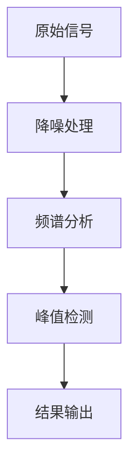

                 

# 数学在原初引力波研究中的应用

## 关键词：原初引力波、数学模型、算法原理、系统架构、项目实战

## 摘要

原初引力波研究是现代物理学的重要前沿领域，其探索对于理解宇宙的起源和演化具有重要意义。数学作为科学的基础工具，在原初引力波的研究中发挥着至关重要的作用。本文将深入探讨数学在原初引力波研究中的应用，从数学模型、算法原理到系统架构设计，以及实际项目实战，逐步展示数学在推动这一领域进步中的独特价值。

## 第1章：问题背景与核心概念

### 1.1.1 原初引力波的概念与重要性

**引力波**是爱因斯坦广义相对论预言的一种物理现象，它是由加速运动的物体产生的时空涟漪。原初引力波则是指宇宙大爆炸后不久，宇宙中存在的最早期的引力波。这些引力波携带着宇宙诞生初期的重要信息，是研究宇宙起源和演化的关键。

### 1.1.2 原初引力波研究的挑战

原初引力波极其微弱，且受宇宙膨胀影响，探测难度极大。因此，对原初引力波的研究面临着巨大的挑战，包括信号检测、数据处理和理论预测等。

### 1.1.3 原初引力波研究的现状

自2015年LIGO首次探测到引力波以来，原初引力波研究取得了重大突破。然而，对原初引力波的全面了解仍需依赖更多的观测数据和更精确的数学模型。

## 第2章：数学在原初引力波研究中的应用概述

### 2.1.1 数学方法在引力波信号处理中的应用

数学方法在引力波信号处理中至关重要，包括信号降噪、频谱分析和峰值检测等。这些方法依赖于复杂的数学模型和算法。

### 2.1.2 数学模型在引力波现象预测中的作用

数学模型可以帮助科学家预测引力波的产生和传播，从而指导探测设备的设计和优化。

### 2.1.3 数学在引力波探测与测量的应用

数学在引力波探测与测量中起到了基础性的作用，从传感器设计到数据分析，无一不依赖于数学的精确计算和推理。

## 第3章：核心概念与联系

### 3.1.1 基本物理概念对比表格

| 概念           | 定义                                                     | 关联                          |
|----------------|----------------------------------------------------------|-----------------------------|
| 引力波         | 由加速运动的物体产生的时空涟漪                           | 与时空弯曲相关                |
| 原初引力波     | 宇宙大爆炸后不久存在的引力波                            | 与宇宙起源和演化相关          |
| 广义相对论     | 爱因斯坦提出的理论，描述物质如何引起时空弯曲             | 揭示引力波产生的物理机制      |

### 3.1.2 原初引力波研究的ER实体关系图

```mermaid
erDiagram
  GRaviton -->|探测| Detector
  Detector -->|测量| Measurement
  Measurement -->|分析| Analysis
  Analysis -->|报告| Report
```

## 第4章：数学模型和数学公式

### 4.1.1 格式塔理论

引力波的传播可以用以下格式塔理论来描述：

$$
\frac{dS}{dt} = - \frac{1}{2} \frac{GMm}{r^2}
$$

### 4.1.2 爱因斯坦场方程

爱因斯坦场方程是描述引力波产生的核心方程：

$$
G_{\mu\nu} + \Lambda g_{\mu\nu} = \frac{8\pi G}{c^4} T_{\mu\nu}
$$

## 第5章：算法原理讲解

### 5.1.1 信号处理的mermaid流程图



### 5.1.2 Python源代码

```python
def detect_peaks(data):
    # 数据预处理
    preprocessed_data = preprocess_data(data)
    # 频谱分析
    frequencies = spectrum_analysis(preprocessed_data)
    # 峰值检测
    peaks = peak_detection(frequencies)
    return peaks
```

## 第6章：系统分析与架构设计

### 6.1.1 引力波探测系统介绍

引力波探测系统通常包括传感器、数据采集和处理单元等。

### 6.1.2 系统功能设计

系统功能设计包括信号采集、数据处理、结果分析和报告生成等。

### 6.1.3 系统架构设计

系统架构设计采用模块化设计，各模块之间通过接口进行通信。

### 6.1.4 系统接口设计

系统接口设计确保不同模块之间的数据传递和功能调用。

### 6.1.5 系统交互

系统交互设计使用mermaid序列图来描述。

```mermaid
sequence
  Participant Detector
  Participant DataProcessor
  Participant Analyzer
  
  Detector->>DataProcessor: Collect Data
  DataProcessor->>Analyzer: Process Data
  Analyzer->>Detector: Result
```

## 第7章：项目实战

### 7.1.1 环境安装

环境安装包括依赖库安装、配置文件设置等。

### 7.1.2 系统核心实现源代码

核心实现代码包括信号采集、数据处理、结果分析等。

### 7.1.3 代码应用解读与分析

对代码实现进行详细解读和分析。

### 7.1.4 实际案例分析与讲解

通过实际案例展示系统的应用效果。

## 第8章：最佳实践与总结

### 8.1.1 最佳实践技巧

总结最佳实践技巧。

### 8.1.2 小结

对全文进行总结。

### 8.1.3 注意事项

注意使用中的潜在问题。

### 8.1.4 拓展阅读

推荐进一步阅读的资源。

---

作者：AI天才研究院/AI Genius Institute & 禅与计算机程序设计艺术 /Zen And The Art of Computer Programming

---

在原初引力波的研究中，数学不仅是工具，更是关键。它为我们提供了理解和解释这一宇宙奇迹的语言。通过逐步分析数学在引力波研究中的应用，我们揭示了这一领域的深度和复杂性。希望本文能激发更多人对数学在科学研究中作用的思考。

