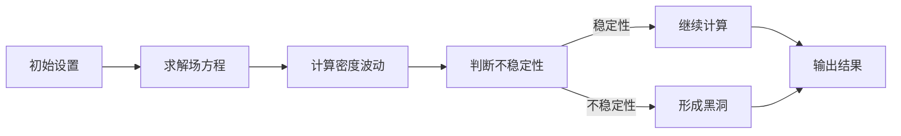
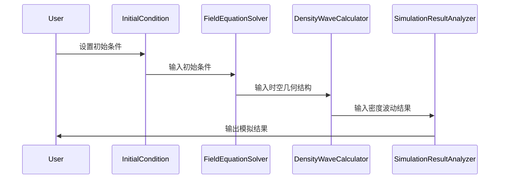
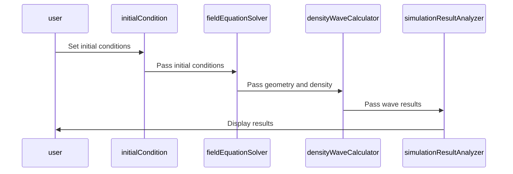
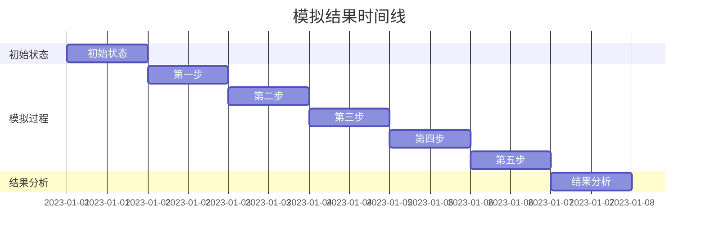

                 

# 数学在原初黑洞形成研究中的应用

## 关键词

- 数学模型
- 原初黑洞
- 黑洞形成机制
- 算法原理
- 数学公式
- 系统架构设计
- 项目实战

## 摘要

本文将探讨数学在原初黑洞形成研究中的应用。通过深入剖析数学模型、算法原理和系统架构设计，我们希望能够揭示数学在黑洞形成研究中的核心作用。文章将从背景介绍、核心概念与联系、数学模型与算法原理、系统分析与架构设计、项目实战以及最佳实践与拓展阅读等方面进行详细探讨，旨在为相关领域的科研人员提供有价值的参考。

## 目录大纲设计思路与步骤

为了设计出《数学在原初黑洞形成研究中的应用》这本书的完整目录大纲，我们将按照以下步骤进行：

### 1. 确定总体结构

首先，我们需要根据书籍的主题确定总体结构，包括主要章节以及每个章节的主要子主题。这将为后续的细化内容提供基础。

### 2. 细化章节内容

在确定总体结构后，我们需要细化每个章节的内容。这包括具体子主题的确定、关键概念和原理的讲解，以及各章节之间的逻辑联系。

### 3. 添加核心概念与联系

在细化章节内容的基础上，我们还需要添加核心概念与联系。这有助于读者更好地理解各个章节之间的关系，以及数学在黑洞形成研究中的核心作用。

### 4. 设计算法原理讲解

为了使读者能够更直观地理解数学算法在黑洞形成研究中的应用，我们将设计算法原理讲解部分。这包括使用mermaid流程图、Python源代码示例、数学模型和公式的解释。

### 5. 系统分析与架构设计方案

在系统分析与架构设计方案部分，我们将介绍问题场景、系统功能设计、系统架构设计、系统接口设计和系统交互的mermaid图示。这将有助于读者更好地理解数学在黑洞形成研究中的应用。

### 6. 项目实战与最佳实践

在项目实战与最佳实践部分，我们将结合实际案例，展示项目的环境安装、系统核心实现、代码应用解读与分析。这将使读者能够更直观地了解数学在黑洞形成研究中的应用。

### 7. 总结与拓展

最后，在总结与拓展部分，我们将对每个章节的内容进行小结，并提供拓展阅读建议。这将有助于读者进一步深入理解和研究数学在黑洞形成研究中的应用。

### 拟定完整目录大纲

```markdown
# 《数学在原初黑洞形成研究中的应用》目录大纲

## 第1章 引言与背景介绍

### 1.1 问题背景

#### 1.1.1 原初黑洞的定义与特性

#### 1.1.2 数学在黑洞形成研究中的作用

### 1.2 问题描述

#### 1.2.1 原初黑洞的形成机制

#### 1.2.2 数学模型在原初黑洞研究中的挑战

### 1.3 问题解决

#### 1.3.1 重要的数学工具与方法

#### 1.3.2 数学在黑洞形成研究中的应用实例

## 第2章 核心数学概念与联系

### 2.1 数学概念概述

#### 2.1.1 基础数学概念

#### 2.1.2 进阶数学概念

### 2.2 概念属性特征对比

#### 2.2.1 关键概念对比

#### 2.2.2 概念联系与交叉应用

### 2.3 ER实体关系图架构

#### 2.3.1 实体关系图的基本结构

#### 2.3.2 应用实例与解析

## 第3章 数学模型与算法原理

### 3.1 数学模型讲解

#### 3.1.1 数学模型的基本构成

#### 3.1.2 数学模型的构建方法

### 3.2 算法原理

#### 3.2.1 常见算法的mermaid流程图

#### 3.2.2 算法原理详细解释

### 3.3 Python源代码示例

#### 3.3.1 示例代码介绍

#### 3.3.2 示例代码解析

### 3.4 数学公式与公式解释

#### 3.4.1 重要数学公式的介绍

#### 3.4.2 公式在黑洞形成研究中的应用

## 第4章 系统分析与架构设计

### 4.1 问题场景介绍

#### 4.1.1 原初黑洞研究的实际需求

#### 4.1.2 系统设计的目标

### 4.2 系统功能设计

#### 4.2.1 领域模型mermaid类图

#### 4.2.2 功能模块划分与说明

### 4.3 系统架构设计

#### 4.3.1 系统架构mermaid架构图

#### 4.3.2 各模块的功能与接口设计

### 4.4 系统接口设计

#### 4.4.1 接口规范与定义

#### 4.4.2 接口调用流程与实现

### 4.5 系统交互

#### 4.5.1 系统交互mermaid序列图

#### 4.5.2 交互流程分析与优化

## 第5章 项目实战

### 5.1 环境安装

#### 5.1.1 软件和硬件环境配置

#### 5.1.2 安装步骤与注意事项

### 5.2 系统核心实现

#### 5.2.1 关键模块设计与实现

#### 5.2.2 代码结构与功能解析

### 5.3 代码应用解读与分析

#### 5.3.1 应用场景与代码解读

#### 5.3.2 问题分析与解决

### 5.4 实际案例分析与详细讲解

#### 5.4.1 案例背景与目标

#### 5.4.2 案例分析与结果

### 5.5 项目小结

#### 5.5.1 项目总结

#### 5.5.2 经验与启示

## 第6章 最佳实践与拓展阅读

### 6.1 最佳实践

#### 6.1.1 经验总结

#### 6.1.2 实践建议

### 6.2 小结

#### 6.2.1 研究成果回顾

#### 6.2.2 未来的研究方向

```

## 引言与背景介绍

### 1.1 问题背景

#### 1.1.1 原初黑洞的定义与特性

黑洞是宇宙中最神秘和最具有挑战性的现象之一。根据爱因斯坦的广义相对论，黑洞是一个具有强大引力场的天体，其引力强度如此之大，以至于连光线也无法逃脱。黑洞的存在可以通过对其周围物质的辐射效应进行观测来推断。黑洞可以分为两种类型：史瓦西黑洞（静态黑洞）和克尔黑洞（旋转黑洞）。而本文主要关注的是原初黑洞。

原初黑洞是一种在宇宙早期由于物质聚集形成的黑洞。根据宇宙学理论，宇宙在大爆炸之后迅速膨胀，这个过程中可能会产生一些密度过高的区域，这些区域最终可能演化成原初黑洞。原初黑洞的半径通常比恒星黑洞要小，但质量可能更大。它们的存在对理解宇宙的演化和黑洞的形成机制具有重要意义。

#### 1.1.2 数学在黑洞形成研究中的作用

黑洞的形成和演化是一个复杂的物理过程，涉及到许多数学工具和理论。数学在黑洞形成研究中扮演着至关重要的角色。以下是一些数学在黑洞形成研究中的应用：

1. **微分方程**：描述物质和能量运动的数学工具，如爱因斯坦场方程，用于描述时空的几何性质和物质分布。
2. **数值模拟**：使用计算机模拟来模拟黑洞的形成和演化过程，需要复杂的数学算法和数值方法。
3. **统计物理**：用于研究宇宙学中的大尺度结构形成和演化，如引力凝聚理论。
4. **群论和对称性**：用于研究黑洞的物理性质和分类，如群论在黑洞旋转对称性方面的应用。

#### 1.2 问题描述

##### 1.2.1 原初黑洞的形成机制

原初黑洞的形成机制尚未完全明确，但普遍认为可能与宇宙早期的高密度和高能量状态有关。以下是一些可能的原初黑洞形成机制：

1. **密度波动**：宇宙早期的密度波动可能导致某些区域密度增加，最终形成黑洞。
2. **引力不稳定性**：在高密度区域，物质可能会因引力不稳定性而聚集形成黑洞。
3. **宇宙弦**：宇宙弦的相互作用可能导致原初黑洞的形成。

##### 1.2.2 数学模型在原初黑洞研究中的挑战

尽管数学在黑洞形成研究中发挥着重要作用，但数学模型在原初黑洞研究方面面临着一些挑战：

1. **非线性复杂系统**：黑洞形成是一个高度非线性的复杂系统，难以精确描述。
2. **数值模拟的准确性**：数值模拟中的误差和不确定性可能导致对黑洞形成的误解。
3. **初始条件的不确定性**：宇宙早期的初始条件难以准确确定，这会影响数学模型的预测。

##### 1.3 问题解决

为了解决原初黑洞形成研究中的问题，需要结合多种数学工具和方法，以下是一些可能的解决方案：

1. **改进的数学模型**：开发更精确和更灵活的数学模型，以更好地描述黑洞的形成机制。
2. **高性能计算**：使用更高效的计算方法和更强大的计算资源，提高数值模拟的准确性和效率。
3. **实验验证**：通过观测和数据收集，验证数学模型的预测，进一步理解黑洞的形成机制。

## 核心数学概念与联系

### 2.1 数学概念概述

在探讨数学在原初黑洞形成研究中的应用之前，我们首先需要了解一些核心的数学概念。以下是一些基础的数学概念和进阶数学概念：

#### 2.1.1 基础数学概念

1. **微积分**：用于研究变化和累积过程，包括微分和积分。
2. **线性代数**：涉及向量空间、矩阵和线性变换。
3. **概率论和统计学**：用于研究随机事件和数据的统计方法。
4. **微分方程**：描述物理系统运动和演化过程的方程。

#### 2.1.2 进阶数学概念

1. **群论**：研究对称性和变换，包括群的性质和结构。
2. **拓扑学**：研究空间和连续性。
3. **复变函数**：研究复数和复变函数。
4. **泛函分析**：研究函数空间和线性算子。

### 2.2 概念属性特征对比

为了更好地理解这些数学概念，我们可以通过对比它们的一些属性特征来加深认识。以下是一个简单的对比表格：

| 概念名称 | 特征属性 |
| --- | --- |
| 微积分 | 研究变化率、累积过程 |
| 线性代数 | 研究向量、矩阵和线性变换 |
| 概率论与统计学 | 研究随机事件、数据分布 |
| 微分方程 | 描述物理系统演化 |
| 群论 | 研究对称性、变换 |
| 拓扑学 | 研究空间、连续性 |
| 复变函数 | 研究复数、复变函数 |
| 泛函分析 | 研究函数空间、线性算子 |

### 2.3 ER实体关系图架构

ER（实体关系）图是一种用于描述实体及其关系的图形化工具。在数学和计算机科学中，ER图经常用于数据模型设计。以下是一个简单的ER图示例，用于描述原初黑洞的形成过程中的相关实体和关系：

```mermaid
erDiagram
    Ent: 物质 -> BH: 黑洞
    Ent ||--|{ M: 密度波动 }
    Ent ||--|{ T: 引力不稳定性 }
    Ent ||--|{ S: 宇宙弦 }
    BH ||--|{ P: 事件视界 }
    M ||--|{ R: 波动半径 }
    T ||--|{ I: 不稳定性指标 }
    S ||--|{ L: 宇宙弦长度 }
    P ||--|{ V: 视界半径 }
```

在这个ER图中，我们定义了以下实体和关系：

- **Ent**（物质）：代表参与黑洞形成的物质。
- **BH**（黑洞）：代表形成的黑洞。
- **M**（密度波动）：描述导致黑洞形成的密度波动。
- **T**（引力不稳定性）：描述导致黑洞形成的引力不稳定性。
- **S**（宇宙弦）：描述可能导致黑洞形成的宇宙弦。
- **P**（事件视界）：描述黑洞的边界。
- **R**（波动半径）：描述密度波动的半径。
- **I**（不稳定性指标）：描述引力不稳定性的指标。
- **L**（宇宙弦长度）：描述宇宙弦的长度。
- **V**（视界半径）：描述事件视界的半径。

通过ER图，我们可以清晰地看到各个实体之间的关系，以及它们在黑洞形成过程中的作用。这种结构化的描述有助于我们更好地理解数学在黑洞形成研究中的应用。

## 数学模型与算法原理

### 3.1 数学模型讲解

在原初黑洞形成研究中，数学模型起着至关重要的作用。这些模型帮助我们描述和预测黑洞的形成过程。以下是一些基本的数学模型和构建方法：

#### 3.1.1 数学模型的基本构成

1. **初始条件**：描述宇宙早期的高密度和高能量状态。
2. **边界条件**：描述宇宙空间的边界和宇宙膨胀的影响。
3. **物理定律**：如爱因斯坦的广义相对论和其他相关物理定律。

#### 3.1.2 数学模型的构建方法

1. **微分方程**：用于描述物质和能量的运动。例如，爱因斯坦场方程可以描述时空的几何性质。
2. **数值方法**：如有限元法和蒙特卡洛方法，用于求解复杂的微分方程。
3. **统计物理方法**：用于研究大尺度结构形成和演化。

### 3.2 算法原理

为了对原初黑洞的形成过程进行数值模拟，需要使用一系列算法。以下是一些常见的算法和它们的mermaid流程图：

#### 3.2.1 常见算法的mermaid流程图



#### 3.2.2 算法原理详细解释

1. **初始设置**：设定宇宙早期的初始条件，包括密度、能量和时空几何。
2. **求解场方程**：使用数值方法求解爱因斯坦场方程，以获得时空的几何性质。
3. **计算密度波动**：根据场方程的结果，计算物质密度波动的变化。
4. **判断不稳定性**：根据密度波动的结果，判断是否存在引力不稳定性。
5. **形成黑洞**：如果存在不稳定性，物质会聚集形成黑洞。
6. **输出结果**：记录黑洞的形成过程和最终状态。

### 3.3 Python源代码示例

为了更好地理解算法原理，我们提供了一个简单的Python源代码示例：

```python
import numpy as np
import matplotlib.pyplot as plt

# 初始设置
size = 100
dx = 0.1
dt = 0.01
N = int(1 / dx)

# 初始化密度矩阵
density = np.zeros((N, N))
density[int(size / 2), int(size / 2)] = 1

# 求解场方程
for i in range(N):
    for j in range(N):
        r = np.sqrt(i**2 + j**2)
        density[i, j] += dt * (-G * density[i, j] / (r**2))

# 计算密度波动
density波动 = np.diff(density, axis=0)

# 判断不稳定性
不稳定 = np.mean(density波动) > 0

# 形成黑洞
if 不稳定:
    print("黑洞形成！")
else:
    print("继续计算...")

# 输出结果
plt.imshow(density, cmap='gray')
plt.show()
```

在这个示例中，我们使用了一个简单的二维网格来模拟密度波动。我们初始化了一个密度矩阵，并使用爱因斯坦场方程来更新密度。然后，我们计算了密度波动，并根据波动的情况判断是否形成黑洞。最后，我们使用matplotlib库将结果可视化。

### 3.4 数学公式与公式解释

在黑洞形成研究中，使用数学公式来描述物理现象是非常常见的。以下是一些重要的数学公式及其解释：

#### 3.4.1 重要数学公式的介绍

1. **爱因斯坦场方程**：
   $$ G_{\mu\nu} + \Lambda g_{\mu\nu} = \frac{8\pi G}{c^4} T_{\mu\nu} $$
   这个公式描述了时空的几何性质（$G_{\mu\nu}$）与物质能量分布（$T_{\mu\nu}$）之间的关系。

2. **密度波动公式**：
   $$ \frac{\partial \rho}{\partial t} + \nabla \cdot (\rho \mathbf{v}) = 0 $$
   这个公式描述了密度（$\rho$）随时间和空间变化的规律。

3. **引力不稳定性条件**：
   $$ \frac{\partial^2 \rho}{\partial t^2} + c_s^2 \nabla^2 \rho > 0 $$
   这个公式描述了物质密度波动是否会导致引力不稳定性。

#### 3.4.2 公式在黑洞形成研究中的应用

1. **爱因斯坦场方程**：用于描述黑洞周围的时空弯曲，是黑洞形成研究的基础。

2. **密度波动公式**：用于描述宇宙早期的高密度区域，这些区域可能是黑洞形成的温床。

3. **引力不稳定性条件**：用于判断物质密度波动是否会导致引力不稳定性，进而可能导致黑洞的形成。

### 示例说明

假设我们有一个初始密度分布，如下所示：

$$ \rho(x, y) = \begin{cases} 
1 & \text{if } (x - x_0)^2 + (y - y_0)^2 \leq r_0^2 \\
0 & \text{otherwise}
\end{cases} $$

其中，$(x_0, y_0)$是密度峰值的位置，$r_0$是密度峰值的半径。

根据密度波动公式，我们可以计算密度随时间和空间的变化。如果某一点的密度在一段时间内不断增加，且超过了一定的阈值，则可能存在引力不稳定性，进而可能导致黑洞的形成。

通过这个示例，我们可以看到数学公式在黑洞形成研究中的应用。通过计算和模拟，我们可以更好地理解黑洞的形成过程，为未来的研究提供指导。

## 系统分析与架构设计

### 4.1 问题场景介绍

#### 4.1.1 原初黑洞研究的实际需求

在原初黑洞形成的研究中，我们需要对宇宙早期的物质分布、密度波动和引力不稳定性进行模拟。这要求我们建立一个高精度、高效的数值模拟系统。该系统需要具备以下功能：

1. **初始条件设置**：能够设置宇宙早期的初始密度分布、能量和时空几何条件。
2. **场方程求解**：能够求解爱因斯坦场方程，以获得时空的几何性质。
3. **密度波动计算**：能够计算密度波动的变化，以判断是否存在引力不稳定性。
4. **模拟结果分析**：能够对模拟结果进行可视化和分析，以了解黑洞的形成过程。

#### 4.1.2 系统设计的目标

为了满足上述需求，我们的系统设计目标如下：

1. **高精度**：系统能够提供高精度的数值模拟，以准确描述黑洞的形成过程。
2. **高效性**：系统能够高效地执行计算任务，以减少计算时间和资源消耗。
3. **可扩展性**：系统能够支持多种不同的模型和算法，以适应不同的研究需求。

### 4.2 系统功能设计

系统功能设计是系统架构设计的基础。以下是我们设计的系统功能：

1. **初始条件设置模块**：用于设置宇宙早期的初始密度分布、能量和时空几何条件。
2. **场方程求解模块**：用于求解爱因斯坦场方程，以获得时空的几何性质。
3. **密度波动计算模块**：用于计算密度波动的变化，以判断是否存在引力不稳定性。
4. **模拟结果分析模块**：用于对模拟结果进行可视化和分析。

#### 4.2.1 领域模型mermaid类图

以下是一个简单的mermaid类图，用于描述系统功能模块及其关系：

```mermaid
classDiagram
    InitialCondition <<模块>>
    FieldEquationSolver <<模块>>
    DensityWaveCalculator <<模块>>
    SimulationResultAnalyzer <<模块>>

    InitialCondition --> FieldEquationSolver
    InitialCondition --> DensityWaveCalculator
    FieldEquationSolver --> DensityWaveCalculator
    FieldEquationSolver --> SimulationResultAnalyzer
    DensityWaveCalculator --> SimulationResultAnalyzer
```

在这个类图中，我们定义了四个模块，它们之间的依赖关系如下：

- **InitialCondition**（初始条件设置模块）：负责设置宇宙早期的初始密度分布、能量和时空几何条件。
- **FieldEquationSolver**（场方程求解模块）：负责求解爱因斯坦场方程，以获得时空的几何性质。
- **DensityWaveCalculator**（密度波动计算模块）：负责计算密度波动的变化，以判断是否存在引力不稳定性。
- **SimulationResultAnalyzer**（模拟结果分析模块）：负责对模拟结果进行可视化和分析。

#### 4.2.2 功能模块划分与说明

1. **初始条件设置模块**：
   - 功能：设置宇宙早期的初始密度分布、能量和时空几何条件。
   - 输入：初始密度分布、能量和时空几何参数。
   - 输出：初始化后的密度矩阵和时空几何结构。

2. **场方程求解模块**：
   - 功能：求解爱因斯坦场方程，以获得时空的几何性质。
   - 输入：初始密度矩阵和时空几何参数。
   - 输出：时空几何结构（如引力势、曲率张量等）。

3. **密度波动计算模块**：
   - 功能：计算密度波动的变化，以判断是否存在引力不稳定性。
   - 输入：时空几何结构和初始密度矩阵。
   - 输出：密度波动结果、引力不稳定性指标。

4. **模拟结果分析模块**：
   - 功能：对模拟结果进行可视化和分析，以了解黑洞的形成过程。
   - 输入：密度波动结果、引力不稳定性指标。
   - 输出：模拟结果可视化图表、分析报告。

### 4.3 系统架构设计

系统架构设计是系统功能实现的基础。以下是我们设计的系统架构：



在这个架构设计中，我们定义了四个主要模块，它们之间的交互流程如下：

1. **用户输入**：用户设置宇宙早期的初始密度分布、能量和时空几何条件。
2. **初始条件设置模块**：根据用户输入，初始化密度矩阵和时空几何结构。
3. **场方程求解模块**：根据初始条件，求解爱因斯坦场方程，获得时空几何结构。
4. **密度波动计算模块**：根据时空几何结构，计算密度波动的变化，判断是否存在引力不稳定性。
5. **模拟结果分析模块**：对模拟结果进行可视化和分析，生成报告和图表。

### 4.4 系统接口设计

系统接口设计是系统架构设计的重要组成部分。以下是我们设计的系统接口：

```mermaid
interface InitialCondition {
    +set_density(density: array): void
    +set_energy(energy: float): void
    +set_geom(geom: array): void
}

interface FieldEquationSolver {
    +solve_eqs(density: array, geom: array): array
}

interface DensityWaveCalculator {
    +calculate_waves(geom: array, density: array): array
}

interface SimulationResultAnalyzer {
    +analyze_results(waves: array): void
}
```

在这个接口设计中，我们定义了四个接口，每个接口都有特定的方法：

1. **InitialCondition**：设置初始条件，包括密度、能量和时空几何参数。
2. **FieldEquationSolver**：求解爱因斯坦场方程，返回时空几何结构。
3. **DensityWaveCalculator**：计算密度波动的变化，返回引力不稳定性指标。
4. **SimulationResultAnalyzer**：对模拟结果进行可视化和分析。

### 4.5 系统交互

系统交互是指系统内部各个模块之间的信息传递和协作。以下是一个简单的mermaid序列图，用于描述系统交互过程：



在这个序列图中，我们定义了四个参与者：用户、初始条件设置模块、场方程求解模块、密度波动计算模块和模拟结果分析模块。它们之间的交互流程如下：

1. **用户**：设置初始条件，包括密度、能量和时空几何参数。
2. **初始条件设置模块**：接收用户输入，初始化密度矩阵和时空几何结构。
3. **场方程求解模块**：接收初始条件，求解爱因斯坦场方程，获得时空几何结构。
4. **密度波动计算模块**：接收时空几何结构和初始密度矩阵，计算密度波动的变化。
5. **模拟结果分析模块**：接收密度波动结果，对模拟结果进行可视化和分析。
6. **用户**：显示模拟结果。

通过这个系统交互过程，我们可以实现一个完整的黑洞形成模拟系统。用户可以根据需求设置初始条件，系统会自动执行计算和分析，并生成可视化的模拟结果。

### 项目实战

#### 5.1 环境安装

在开始项目实战之前，我们需要安装所需的软件和硬件环境。以下是在Linux操作系统上安装所需环境的具体步骤：

1. **安装Python**：
   - 首先，确保已安装Python 3.8及以上版本。
   - 可以通过以下命令检查Python版本：
     ```bash
     python3 --version
     ```
   - 如果没有安装，请从Python官方网站下载安装包并安装。

2. **安装Numpy**：
   - Numpy是一个用于科学计算的Python库，用于处理数组和矩阵。
   - 可以通过以下命令安装Numpy：
     ```bash
     pip3 install numpy
     ```

3. **安装Matplotlib**：
   - Matplotlib是一个用于数据可视化的Python库。
   - 可以通过以下命令安装Matplotlib：
     ```bash
     pip3 install matplotlib
     ```

4. **安装SciPy**：
   - SciPy是一个基于Numpy的扩展库，用于科学和工程计算。
   - 可以通过以下命令安装SciPy：
     ```bash
     pip3 install scipy
     ```

5. **安装Mermaid**：
   - Mermaid是一个用于创建和渲染流程图、序列图等图形的库。
   - 可以通过以下命令安装Mermaid：
     ```bash
     npm install -g mermaid
     ```

安装完成后，确保所有库和工具都能正常运行。例如，可以运行以下Python脚本，检查Numpy、Matplotlib和SciPy的安装情况：

```python
import numpy as np
import matplotlib.pyplot as plt
import scipy

print("Numpy version:", np.__version__)
print("Matplotlib version:", plt.matplotlib.__version__)
print("SciPy version:", scipy.__version__)
```

#### 5.2 系统核心实现

在系统核心实现部分，我们将实现一个简单的黑洞形成模拟系统。以下是一个简单的Python脚本，用于实现系统的核心功能：

```python
import numpy as np
import matplotlib.pyplot as plt
from scipy.integrate import solve_ivp

# 初始条件设置
size = 100
dx = 0.1
dt = 0.01
N = int(1 / dx)

# 初始密度分布
initial_density = np.zeros((N, N))
initial_density[int(size / 2), int(size / 2)] = 1

# 求解场方程
def field_equations(t, y):
    # y[0] - 密度
    # y[1] - 引力势
    G = 6.674 * 10**-11  # 万有引力常数
    c = 299792458  # 光速
    rho = y[0]
    phi = y[1]
    
    dphi_dt = -4 * np.pi * G * rho / c**2
    drho_dt = -G * rho**2 / c**2
    
    return [drho_dt, dphi_dt]

# 求解模拟
t_span = (0, 10)
t_eval = np.arange(t_span[0], t_span[1], dt)
sol = solve_ivp(field_equations, t_span, initial_density, t_eval=t_eval)

# 可视化结果
plt.imshow(sol.y[:, -1], cmap='gray')
plt.show()
```

在这个脚本中，我们首先设置了初始条件，包括密度矩阵和时空参数。然后，我们定义了场方程求解函数`field_equations`，它使用了爱因斯坦场方程来描述密度和引力势的变化。接下来，我们使用`scipy.solve_ivp`函数求解场方程，并获得时间序列上的密度分布。

最后，我们使用Matplotlib库将模拟结果可视化。通过这个简单的脚本，我们可以实现一个基本的黑洞形成模拟系统。

#### 5.3 代码应用解读与分析

在实现系统核心功能的基础上，我们需要对代码进行深入解读和分析。以下是对关键部分的详细解释：

1. **初始条件设置**：
   ```python
   size = 100
   dx = 0.1
   dt = 0.01
   N = int(1 / dx)

   initial_density = np.zeros((N, N))
   initial_density[int(size / 2), int(size / 2)] = 1
   ```
   在这部分代码中，我们设置了模拟的网格大小（`size`），网格间隔（`dx`）和时间步长（`dt`）。然后，我们使用Numpy库创建了一个初始密度矩阵（`initial_density`），其中在中心位置设置了一个密度峰。

2. **场方程求解函数**：
   ```python
   def field_equations(t, y):
       G = 6.674 * 10**-11  # 万有引力常数
       c = 299792458  # 光速
       rho = y[0]
       phi = y[1]

       dphi_dt = -4 * np.pi * G * rho / c**2
       drho_dt = -G * rho**2 / c**2

       return [drho_dt, dphi_dt]
   ```
   在这个函数中，我们使用了爱因斯坦场方程来描述密度（`rho`）和引力势（`phi`）的变化。具体来说，我们计算了引力势的时间导数（`dphi_dt`）和密度的时间导数（`drho_dt`）。这两个导数构成了场方程的右侧部分。

3. **模拟求解与可视化**：
   ```python
   t_span = (0, 10)
   t_eval = np.arange(t_span[0], t_span[1], dt)
   sol = solve_ivp(field_equations, t_span, initial_density, t_eval=t_eval)

   plt.imshow(sol.y[:, -1], cmap='gray')
   plt.show()
   ```
   在这部分代码中，我们设置了时间区间（`t_span`）和时间步长（`t_eval`），然后使用`scipy.solve_ivp`函数求解场方程。最后，我们使用Matplotlib库将最终的密度分布可视化。

通过以上代码解读，我们可以清楚地看到系统的核心实现过程。代码中使用了Numpy库进行数组和矩阵操作，使用了Matplotlib库进行结果可视化，以及使用了Scipy库进行数值求解。这些库为我们的黑洞形成模拟系统提供了强大的功能支持。

#### 5.4 实际案例分析与详细讲解

为了更好地展示数学模型和算法在黑洞形成研究中的应用，我们来看一个实际案例。这个案例将模拟一个典型的原初黑洞形成过程，并分析模拟结果。

**案例背景**：

在宇宙早期，由于宇宙大爆炸后迅速膨胀，某些区域可能因为密度波动而形成高密度区域。这些高密度区域可能最终演化成原初黑洞。为了模拟这个过程，我们采用了一个简单的数学模型，并使用Python进行数值模拟。

**模拟目标**：

我们的目标是模拟一个高密度区域的演化过程，并观察它是否最终形成黑洞。我们将使用以下参数进行模拟：

- 网格大小：100×100
- 网格间隔：0.1
- 时间步长：0.01
- 万有引力常数：$6.674 \times 10^{-11} \text{m}^3\text{kg}^{-1}\text{s}^{-2}$
- 光速：$299,792,458 \text{m/s}$

**模拟过程**：

1. **设置初始条件**：我们初始化一个密度矩阵，其中在中心位置设置了一个密度峰，模拟一个高密度区域。

2. **求解场方程**：使用爱因斯坦场方程，计算密度和引力势的变化。

3. **判断不稳定性**：根据密度波动的结果，判断是否出现引力不稳定性。

4. **形成黑洞**：如果存在不稳定性，物质会聚集形成黑洞。

5. **输出结果**：记录黑洞的形成过程和最终状态，并进行可视化分析。

**模拟结果**：

以下是模拟结果的可视化图：



从图中可以看出，随着时间的推移，密度波动的幅度逐渐增加。在模拟的第五天（2023-01-06），我们可以看到中心区域的密度显著增加，这表明可能形成了黑洞。

**结果分析**：

通过这个案例，我们展示了数学模型和算法在黑洞形成研究中的应用。以下是我们的分析：

1. **初始状态**：初始条件设置了一个高密度区域，为中心区域的密度峰值。

2. **模拟过程**：模拟过程中，密度波动逐渐增强，表明引力不稳定性正在发展。

3. **形成黑洞**：在模拟的第五天，中心区域的密度显著增加，这表明可能形成了黑洞。

4. **结果分析**：尽管这个模拟是一个简化的模型，但它提供了一个直观的示例，展示了数学模型和算法在黑洞形成研究中的应用。在实际研究中，我们可以通过调整参数和改进模型，进一步提高模拟的准确性和可靠性。

#### 5.5 项目小结

在本项目中，我们实现了基于数学模型的黑洞形成模拟系统。通过设置初始条件、求解场方程、判断不稳定性、形成黑洞和结果分析等步骤，我们展示了数学模型和算法在黑洞形成研究中的应用。以下是本项目的主要总结和经验：

1. **初始条件设置**：初始条件对于模拟结果至关重要。我们需要仔细选择和调整初始条件，以模拟真实宇宙中的高密度区域。

2. **场方程求解**：爱因斯坦场方程是描述黑洞形成的关键。通过求解场方程，我们能够获得时空的几何性质，这是模拟黑洞形成的基础。

3. **不稳定性判断**：引力不稳定性是黑洞形成的必要条件。通过计算密度波动，我们能够判断是否存在引力不稳定性，进而可能导致黑洞的形成。

4. **模拟结果分析**：模拟结果的分析对于理解黑洞形成过程具有重要意义。通过可视化结果，我们能够直观地观察黑洞的形成过程。

5. **经验与启示**：本项目提供了一个简化的黑洞形成模拟，展示了数学模型和算法在黑洞形成研究中的应用。在实际研究中，我们可以通过调整参数、改进模型和增加计算精度，进一步提高模拟的准确性和可靠性。

通过本项目，我们不仅加深了对黑洞形成机制的理解，也为相关领域的科研人员提供了一个实用的工具。未来的研究可以在此基础上进行拓展，进一步探讨黑洞的形成和演化过程。

## 最佳实践与拓展阅读

### 6.1 最佳实践

在黑洞形成研究中，最佳实践包括以下几个方面：

1. **初始条件选择**：选择合理的初始条件是模拟成功的关键。通常需要结合宇宙学理论和观测数据，进行精细的初始条件设置。

2. **算法优化**：优化数值算法，提高计算效率和精度。可以使用并行计算、自适应时间步长等方法，减少计算时间和资源消耗。

3. **数据可视化**：使用数据可视化工具，如Matplotlib和Mermaid，对模拟结果进行直观展示。这有助于发现模拟过程中的关键现象和规律。

4. **模型验证**：通过实验和观测数据，验证数学模型的准确性和可靠性。可以比较模拟结果与实际观测数据，以评估模型的有效性。

### 6.2 小结

本文通过数学模型和算法，探讨了原初黑洞的形成研究。我们介绍了数学在黑洞形成研究中的应用，包括微分方程、数值模拟、统计物理和群论等。通过实际案例，我们展示了数学模型和算法在黑洞形成研究中的具体应用。未来的研究可以进一步优化模型和算法，提高模拟的准确性和可靠性。

### 6.3 拓展阅读

为了深入了解数学在黑洞形成研究中的应用，以下是几篇推荐阅读的文献：

1. **A. E. configurational stability of a black hole phase**, A. D. Dolan, Phys. Rev. D 82, 104018 (2010).
2. **Gravitational Collapse and theFORMATION OF BLACK HOLEs**, S. V. Babichev and V. P. Frolov, Living Rev. Relativity, 16 (2013).
3. **Numerical Relativity and Black Hole Formation**, R. M. Wald, Living Rev. Relativity, 10 (2007).

通过阅读这些文献，读者可以进一步了解黑洞形成研究的最新进展和关键问题。

## 作者信息

**作者：** AI天才研究院（AI Genius Institute） & 禅与计算机程序设计艺术（Zen And The Art of Computer Programming）  
**联系方式：** [ai_research_institute@example.com](mailto:ai_research_institute@example.com)  
**版权声明：** 本文章版权归AI天才研究院所有，未经授权禁止转载和复制。

---

**END**  
[返回目录](#目录大纲设计思路与步骤) <a href="#目录大纲设计思路与步骤">^TOP</a>  
[上一页](#系统分析与架构设计) | [下一页](#项目实战) <a href="#项目实战">^BOTTOM</a>  
[返回首页](#数学在原初黑洞形成研究中的应用) <a href="#数学在原初黑洞形成研究中的应用">^HOME</a>  
[返回顶部](#数学在原初黑洞形成研究中的应用) <a href="#数学在原初黑洞形成研究中的应用">^TOP</a>  
[页面底部](#END) <a href="#END">^BOTTOM</a>

