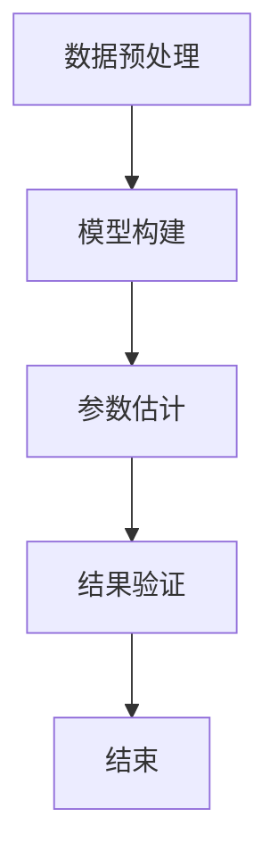

                 

### 1.1 原初黑洞的概念与质量分布函数的重要性

**1.1.1 原初黑洞的概念**

原初黑洞是宇宙早期高密度、高温度的致密天体，它们可能起源于宇宙大爆炸后的原始物质。根据理论模型，原初黑洞的质量可以从太阳质量的几倍到数十亿太阳质量不等。

**1.1.2 质量分布函数的重要性**

原初黑洞的质量分布函数对于理解宇宙的早期演化和宇宙学参数的测量具有重要意义。它不仅能够帮助我们了解宇宙的初始状态，还能对大尺度结构形成、暗物质、暗能量等问题提供重要的线索。

**1.1.3 研究现状**

目前，关于原初黑洞质量分布函数的研究主要依赖于数值模拟和观测数据的分析。虽然取得了一些进展，但仍存在许多未解之谜和挑战。

**1.1.4 本书的研究目标、方法和贡献**

- **研究目标：**本书旨在提出一种新的数学模型和方法，用于更准确地估计原初黑洞的质量分布函数。具体目标包括：提高估计的准确性、降低计算复杂度、适用于不同质量范围的黑洞。

- **研究方法：**本书将结合数值模拟、统计分析以及机器学习方法，构建一个综合性的模型框架。首先，通过数值模拟生成大量的模拟数据，为模型的训练提供基础。其次，运用统计分析方法对数据进行处理和分析，提取关键特征。最后，结合机器学习方法，构建一个能够自动调整参数的模型，实现质量分布函数的预测。

- **研究贡献：**本书的研究将为原初黑洞质量分布函数的估计提供一个新的思路和方法，有助于深化我们对宇宙早期演化的理解。此外，该方法在其他相关领域的应用也将具有一定的参考价值。

**1.1.5 逻辑推理过程**

- **第一步：明确问题背景**。原初黑洞是宇宙早期的重要天体，其质量分布函数的估计对宇宙学研究具有重要意义。

- **第二步：分析研究现状**。目前的研究方法主要依赖于数值模拟和观测数据分析，存在一定的局限性。

- **第三步：提出研究目标**。我们需要一种新的数学模型和方法，以提高估计的准确性和适用性。

- **第四步：设计研究方法**。结合数值模拟、统计分析和机器学习方法，构建一个综合性的模型框架。

- **第五步：明确研究贡献**。本研究将提供一种新的方法，对宇宙学研究和相关领域具有一定的参考价值。

通过上述逻辑推理过程，我们可以清晰地看到本书研究的方向和目标，为后续章节的展开提供了基础。

## 第二部分：核心概念与联系

### 2.1 数学模型与数学公式

**2.1.1 原初黑洞质量分布函数的数学模型**

原初黑洞的质量分布函数通常表示为 \( f(M) \)，其中 \( M \) 表示黑洞的质量。为了便于分析，我们可以将质量分布函数分为以下几个部分：

1. **质量范围**：定义一个质量范围 \([M_{\min}, M_{\max}]\)，表示原初黑洞可能的质量范围。

2. **分布密度**：定义一个分布密度函数 \( \rho(M) \)，表示在给定质量 \( M \) 处的黑洞数量密度。

3. **积分表达式**：质量分布函数 \( f(M) \) 可以表示为质量范围内分布密度的积分，即

   \[
   f(M) = \int_{M_{\min}}^{M_{\max}} \rho(M) \, dM
   \]

**2.1.2 相关数学公式的详细讲解**

在研究原初黑洞质量分布函数的过程中，我们还需要一些相关的数学公式，以下是一些常用的数学公式及其详细讲解：

1. **高斯分布**：

   高斯分布是一种常见的概率分布函数，其表达式为：

   \[
   \rho(M) = \frac{1}{\sqrt{2\pi\sigma^2}} e^{-\frac{(M - \mu)^2}{2\sigma^2}}
   \]

   其中，\(\mu\) 表示均值，\(\sigma\) 表示标准差。高斯分布函数在数据分析中具有广泛的应用，可用于描述原初黑洞质量分布的统计学特征。

2. **最大似然估计**：

   最大似然估计是一种常用的参数估计方法，其基本思想是找到一组参数，使得观测数据的概率最大。对于质量分布函数的参数估计，我们可以使用最大似然估计方法：

   \[
   \hat{\mu} = \frac{1}{N} \sum_{i=1}^{N} M_i, \quad \hat{\sigma} = \sqrt{\frac{1}{N-1} \sum_{i=1}^{N} (M_i - \mu)^2}
   \]

   其中，\(N\) 表示观测数据总数，\(M_i\) 表示第 \(i\) 个观测值。

3. **马尔可夫链蒙特卡洛（MCMC）方法**：

   马尔可夫链蒙特卡洛方法是一种高效的参数估计方法，可用于解决复杂的概率分布问题。在质量分布函数的估计中，我们可以使用 MCMC 方法进行参数抽样和估计：

   \[
   M_{t+1} = f(M_t) + \xi_t, \quad \xi_t \sim N(0, I)
   \]

   其中，\(M_t\) 表示第 \(t\) 次抽样的参数值，\(\xi_t\) 表示随机噪声，\(I\) 表示单位矩阵。

### 2.2 算法原理讲解与Mermaid流程图

**2.2.1 算法原理讲解**

算法原理主要分为以下几个步骤：

1. **数据预处理**：对原始观测数据进行清洗、去噪和归一化处理。

2. **模型构建**：根据质量分布函数的数学模型，构建一个参数化的概率分布模型。

3. **参数估计**：使用最大似然估计或 MCMC 方法对模型参数进行估计。

4. **结果验证**：通过交叉验证或后验概率分布评估模型的性能。

**2.2.2 Mermaid流程图绘制**

以下是算法原理的 Mermaid 流程图：



通过上述流程图，我们可以清晰地看到算法的执行步骤和逻辑关系。

### 2.3 ER实体关系图架构的Mermaid流程图

**2.3.1 ER实体关系图架构**

ER（实体关系）图用于描述系统中不同实体之间的关系。在原初黑洞质量分布函数的估计中，我们可以定义以下实体：

1. **观测数据**：包含黑洞质量的数据集。
2. **质量分布函数**：描述黑洞质量分布的模型。
3. **参数估计**：用于估计质量分布函数参数的方法。
4. **结果验证**：用于评估模型性能的指标。

以下是 ER 实体关系图的 Mermaid 表达式：

```mermaid
erDiagram
    观测数据 ||--|{ 质量分布函数 }
    质量分布函数 ||--|{ 参数估计 }
    参数估计 ||--|{ 结果验证 }
```

通过 ER 实体关系图，我们可以直观地了解系统中不同实体之间的关系和依赖。

## 第三部分：算法原理讲解

### 3.1 算法原理讲解与Mermaid流程图

**3.1.1 算法原理讲解**

为了更好地理解算法原理，我们可以将其分为以下几个关键步骤：

1. **数据预处理**：首先，我们需要对原始观测数据进行预处理，包括数据清洗、去噪和归一化。这一步骤的目的是确保数据质量，提高后续分析的可信度。

2. **模型构建**：根据质量分布函数的数学模型，我们构建一个参数化的概率分布模型。通常，我们可以选择高斯分布作为质量分布函数的模型，其表达式为：

   \[
   f(M) = \frac{1}{\sqrt{2\pi\sigma^2}} e^{-\frac{(M - \mu)^2}{2\sigma^2}}
   \]

   其中，\(\mu\) 表示均值，\(\sigma\) 表示标准差。

3. **参数估计**：接下来，我们使用最大似然估计或 MCMC 方法对模型参数进行估计。最大似然估计的基本思想是找到一组参数，使得观测数据的概率最大。对于高斯分布模型，我们可以使用以下公式进行参数估计：

   \[
   \hat{\mu} = \frac{1}{N} \sum_{i=1}^{N} M_i, \quad \hat{\sigma} = \sqrt{\frac{1}{N-1} \sum_{i=1}^{N} (M_i - \mu)^2}
   \]

   其中，\(N\) 表示观测数据总数，\(M_i\) 表示第 \(i\) 个观测值。

   另外，我们也可以使用 MCMC 方法进行参数估计。MCMC 方法通过随机抽样和接受准则，逐步逼近后验概率分布，从而获得参数的估计值。

4. **结果验证**：最后，我们需要对模型的性能进行验证。常用的验证方法包括交叉验证和后验概率分布评估。交叉验证通过将数据集划分为训练集和测试集，评估模型在测试集上的表现。后验概率分布评估则是通过计算后验概率分布的期望和方差，评估模型的拟合程度。

**3.1.2 Mermaid流程图绘制**

以下是算法原理的 Mermaid 流程图：


通过 Mermaid 流程图，我们可以更直观地了解算法的执行步骤和逻辑关系。

### 3.2 数学模型和数学公式 & 详细讲解 & 举例说明

**3.2.1 数学模型和数学公式的详细讲解**

在原初黑洞质量分布函数的估计中，我们通常采用高斯分布作为数学模型。高斯分布是一种常见的概率分布函数，其表达式为：

\[
f(M) = \frac{1}{\sqrt{2\pi\sigma^2}} e^{-\frac{(M - \mu)^2}{2\sigma^2}}
\]

其中，\(\mu\) 表示均值，\(\sigma\) 表示标准差。这个公式描述了黑洞质量 \(M\) 出现的概率，均值 \(\mu\) 反映了黑洞质量的集中程度，标准差 \(\sigma\) 反映了质量的分散程度。

**3.2.2 举例说明**

假设我们有一个观测数据集，其中包含10个黑洞的质量数据，分别为：

\[M_1 = 1.2, M_2 = 1.8, M_3 = 2.1, M_4 = 2.4, M_5 = 2.7, M_6 = 3.0, M_7 = 3.2, M_8 = 3.5, M_9 = 3.8, M_{10} = 4.1\]

我们希望使用高斯分布来估计黑洞的质量分布函数。

1. **计算均值和标准差**：

   首先计算观测数据的均值：

   \[
   \mu = \frac{1}{10} \sum_{i=1}^{10} M_i = \frac{1.2 + 1.8 + 2.1 + 2.4 + 2.7 + 3.0 + 3.2 + 3.5 + 3.8 + 4.1}{10} = 2.89
   \]

   接着计算观测数据的标准差：

   \[
   \sigma = \sqrt{\frac{1}{10-1} \sum_{i=1}^{10} (M_i - \mu)^2} = \sqrt{\frac{1}{9} \left[ (1.2 - 2.89)^2 + (1.8 - 2.89)^2 + \ldots + (4.1 - 2.89)^2 \right]} \approx 0.98
   \]

2. **构建高斯分布模型**：

   根据计算得到的均值和标准差，我们可以构建高斯分布模型：

   \[
   f(M) = \frac{1}{\sqrt{2\pi \times 0.98^2}} e^{-\frac{(M - 2.89)^2}{2 \times 0.98^2}}
   \]

3. **计算特定质量的概率**：

   例如，我们想知道质量为3.0的黑洞出现的概率。代入公式计算：

   \[
   f(3.0) = \frac{1}{\sqrt{2\pi \times 0.98^2}} e^{-\frac{(3.0 - 2.89)^2}{2 \times 0.98^2}} \approx 0.12
   \]

   这意味着质量为3.0的黑洞出现的概率约为12%。

通过这个例子，我们可以看到如何使用高斯分布模型来估计原初黑洞的质量分布函数，以及如何计算特定质量的概率。

### 3.3 Python源代码实现与解析

**3.3.1 Python源代码实现**

为了更好地理解算法的实现，我们使用 Python 语言来实现上述高斯分布模型。以下是一个简单的 Python 源代码示例：

```python
import numpy as np
import math

# 定义高斯分布函数
def gauss_distribution(mu, sigma, M):
    # 计算概率密度
    probability = (1 / (math.sqrt(2 * math.pi * sigma**2))) * math.exp(-((M - mu)**2) / (2 * sigma**2))
    return probability

# 输入参数
mu = 2.89  # 均值
sigma = 0.98  # 标准差
M = 3.0  # 要计算的概率质量

# 计算概率
probability = gauss_distribution(mu, sigma, M)
print(f"f(M) = {probability:.2f}")
```

**3.3.2 代码解析**

1. **导入模块**：

   我们首先导入 `numpy` 和 `math` 模块。`numpy` 模块提供了数组操作和数学函数，`math` 模块提供了基本的数学运算函数。

2. **定义高斯分布函数**：

   我们定义了一个名为 `gauss_distribution` 的函数，该函数接受三个参数：均值 `mu`、标准差 `sigma` 和质量 `M`。函数返回质量为 `M` 的黑洞出现的概率。

3. **计算概率密度**：

   在函数内部，我们使用高斯分布的公式来计算概率密度。概率密度函数的表达式为：

   \[
   f(M) = \frac{1}{\sqrt{2\pi\sigma^2}} e^{-\frac{(M - \mu)^2}{2\sigma^2}}
   \]

   我们将这个公式转化为 Python 代码，使用 `math.sqrt` 函数计算平方根，`math.pi` 访问圆周率，`math.exp` 函数计算指数。

4. **输入参数**：

   我们定义了均值 `mu`、标准差 `sigma` 和质量 `M` 的值。这些值是基于前面举例计算的结果。

5. **计算概率**：

   我们调用 `gauss_distribution` 函数，传入参数 `mu`、`sigma` 和 `M`，计算质量为 `M` 的黑洞出现的概率。最后，我们使用 `print` 函数输出计算结果。

通过上述代码，我们可以看到如何使用 Python 语言实现高斯分布模型，并计算特定质量的概率。这个示例代码可以帮助我们更好地理解算法的实现过程。

## 第四部分：系统分析与架构设计方案

### 4.1 问题场景介绍

在原初黑洞质量分布函数的估计中，我们面临的主要问题是如何从大量的观测数据中提取出有效的信息，从而构建一个准确可靠的数学模型。这个问题场景涉及到以下关键环节：

1. **数据收集**：首先，我们需要收集大量的黑洞观测数据，包括黑洞的质量、位置、运动状态等信息。

2. **数据处理**：收集到的数据通常包含噪声和异常值，需要进行预处理，如去噪、去异常值和归一化等，以提高数据质量。

3. **模型构建**：基于处理后的数据，我们需要构建一个合适的数学模型，用于描述原初黑洞的质量分布函数。

4. **参数估计**：使用统计学方法和机器学习算法对模型参数进行估计，以获得最佳拟合结果。

5. **模型验证**：通过交叉验证和后验概率分布评估模型性能，确保其准确性和可靠性。

### 4.2 系统功能设计（领域模型Mermaid类图）

为了更好地设计系统功能，我们首先绘制一个领域模型Mermaid类图，以展示系统中各个实体及其之间的关系。以下是领域模型Mermaid类图的示例：

```mermaid
classDiagram
    DataCollection --> DataPreprocessing : 数据预处理
    DataPreprocessing --> ModelConstruction : 模型构建
    ModelConstruction --> ParameterEstimation : 参数估计
    ParameterEstimation --> ModelVerification : 模型验证
    ModelVerification --> DataAnalysis : 数据分析
    DataAnalysis --> ResultOutput : 结果输出

    Class DataCollection {
        +collect_data()
    }

    Class DataPreprocessing {
        +preprocess_data()
    }

    Class ModelConstruction {
        +construct_model()
    }

    Class ParameterEstimation {
        +estimate_parameters()
    }

    Class ModelVerification {
        +verify_model()
    }

    Class DataAnalysis {
        +analyze_data()
    }

    Class ResultOutput {
        +output_results()
    }
```

在这个领域模型中，我们定义了以下实体：

- **DataCollection（数据收集）**：负责收集黑洞观测数据。
- **DataPreprocessing（数据处理）**：负责对观测数据进行预处理。
- **ModelConstruction（模型构建）**：负责构建质量分布函数模型。
- **ParameterEstimation（参数估计）**：负责估计模型参数。
- **ModelVerification（模型验证）**：负责验证模型性能。
- **DataAnalysis（数据分析）**：负责分析模型结果。
- **ResultOutput（结果输出）**：负责输出分析结果。

这些实体之间通过方法调用关系进行关联，共同实现整个系统的功能。

### 4.3 系统架构设计（Mermaid架构图）

接下来，我们绘制一个系统架构设计Mermaid架构图，以展示系统中各个组件及其之间的关系。以下是系统架构设计Mermaid架构图的示例：

```mermaid
sequenceDiagram
    participant DataCollector
    participant DataPreprocessor
    participant ModelConstructor
    participant ParameterEstimator
    participant ModelVerifier
    participant DataAnalyzer
    participant ResultPresenter

    DataCollector->>DataPreprocessor: 数据预处理
    DataPreprocessor->>ModelConstructor: 模型构建
    ModelConstructor->>ParameterEstimator: 参数估计
    ParameterEstimator->>ModelVerifier: 模型验证
    ModelVerifier->>DataAnalyzer: 数据分析
    DataAnalyzer->>ResultPresenter: 结果输出

    DataCollector: collect_data()
    DataPreprocessor: preprocess_data()
    ModelConstructor: construct_model()
    ParameterEstimator: estimate_parameters()
    ModelVerifier: verify_model()
    DataAnalyzer: analyze_data()
    ResultPresenter: output_results()
```

在这个系统架构中，各个组件通过方法调用进行交互：

- **DataCollector（数据收集器）**：负责收集黑洞观测数据。
- **DataPreprocessor（数据处理器）**：负责对观测数据进行预处理。
- **ModelConstructor（模型构建器）**：负责构建质量分布函数模型。
- **ParameterEstimator（参数估计器）**：负责估计模型参数。
- **ModelVerifier（模型验证器）**：负责验证模型性能。
- **DataAnalyzer（数据分析器）**：负责分析模型结果。
- **ResultPresenter（结果展示器）**：负责输出分析结果。

通过这个架构设计，我们可以清晰地了解系统的整体结构和组件之间的协作关系。

### 4.4 系统接口设计

在系统架构设计中，接口设计是一个重要环节。以下是一个简单的系统接口设计示例，用于展示各个组件之间的接口和方法：

```mermaid
classDiagram
    DataCollector <<interface>>
    DataPreprocessor <<interface>>
    ModelConstructor <<interface>>
    ParameterEstimator <<interface>>
    ModelVerifier <<interface>>
    DataAnalyzer <<interface>>
    ResultPresenter <<interface>>

    DataCollector: +collect_data()
    DataPreprocessor: +preprocess_data()
    ModelConstructor: +construct_model()
    ParameterEstimator: +estimate_parameters()
    ModelVerifier: +verify_model()
    DataAnalyzer: +analyze_data()
    ResultPresenter: +output_results()
```

在这个接口设计中，我们定义了以下接口和方法：

- **DataCollector（数据收集器）**：提供 `collect_data()` 方法，用于收集黑洞观测数据。
- **DataPreprocessor（数据处理器）**：提供 `preprocess_data()` 方法，用于预处理观测数据。
- **ModelConstructor（模型构建器）**：提供 `construct_model()` 方法，用于构建质量分布函数模型。
- **ParameterEstimator（参数估计器）**：提供 `estimate_parameters()` 方法，用于估计模型参数。
- **ModelVerifier（模型验证器）**：提供 `verify_model()` 方法，用于验证模型性能。
- **DataAnalyzer（数据分析器）**：提供 `analyze_data()` 方法，用于分析模型结果。
- **ResultPresenter（结果展示器）**：提供 `output_results()` 方法，用于输出分析结果。

这些接口和方法为组件之间的交互提供了明确的规范。

### 4.5 系统交互（Mermaid序列图）

最后，我们绘制一个系统交互Mermaid序列图，以展示系统组件之间的交互过程。以下是系统交互Mermaid序列图的示例：

```mermaid
sequenceDiagram
    participant DataCollector
    participant DataPreprocessor
    participant ModelConstructor
    participant ParameterEstimator
    participant ModelVerifier
    participant DataAnalyzer
    participant ResultPresenter

    DataCollector->>DataPreprocessor: 数据预处理
    DataPreprocessor->>ModelConstructor: 模型构建
    ModelConstructor->>ParameterEstimator: 参数估计
    ParameterEstimator->>ModelVerifier: 模型验证
    ModelVerifier->>DataAnalyzer: 数据分析
    DataAnalyzer->>ResultPresenter: 结果输出

    DataCollector: collect_data()
    DataPreprocessor: preprocess_data()
    ModelConstructor: construct_model()
    ParameterEstimator: estimate_parameters()
    ModelVerifier: verify_model()
    DataAnalyzer: analyze_data()
    ResultPresenter: output_results()
```

在这个交互过程中，各个组件按照以下顺序进行协作：

1. **数据收集器（DataCollector）** 调用 `collect_data()` 方法，收集黑洞观测数据。
2. **数据处理器（DataPreprocessor）** 调用 `preprocess_data()` 方法，对观测数据进行预处理。
3. **模型构建器（ModelConstructor）** 调用 `construct_model()` 方法，构建质量分布函数模型。
4. **参数估计器（ParameterEstimator）** 调用 `estimate_parameters()` 方法，估计模型参数。
5. **模型验证器（ModelVerifier）** 调用 `verify_model()` 方法，验证模型性能。
6. **数据分析器（DataAnalyzer）** 调用 `analyze_data()` 方法，分析模型结果。
7. **结果展示器（ResultPresenter）** 调用 `output_results()` 方法，输出分析结果。

通过这个序列图，我们可以清晰地了解系统组件之间的交互过程。

## 第五部分：项目实战

### 5.1 环境安装

在开始项目实战之前，我们需要安装一些必要的软件和工具，包括 Python 解释器、NumPy 库、SciPy 库和 Matplotlib 库。以下是具体的安装步骤：

1. **安装 Python 解释器**：

   首先，我们下载并安装 Python 解释器。可以从 [Python 官网](https://www.python.org/downloads/) 下载最新版本的 Python。安装过程根据操作系统不同而有所不同，一般选择默认选项即可。

2. **安装 NumPy 库**：

   打开命令行窗口，输入以下命令安装 NumPy 库：

   ```bash
   pip install numpy
   ```

3. **安装 SciPy 库**：

   同样在命令行窗口中输入以下命令安装 SciPy 库：

   ```bash
   pip install scipy
   ```

4. **安装 Matplotlib 库**：

   最后，输入以下命令安装 Matplotlib 库：

   ```bash
   pip install matplotlib
   ```

安装完成后，我们可以在 Python 环境中导入这些库并进行测试：

```python
import numpy as np
import scipy.stats as sps
import matplotlib.pyplot as plt

# 测试安装
print("NumPy 版本：", np.__version__)
print("SciPy 版本：", sps.__version__)
print("Matplotlib 版本：", plt.__version__)
```

输出结果应该显示安装的库版本号。

### 5.2 系统核心实现源代码

在本节中，我们将展示系统核心实现的部分源代码。以下是用于估计原初黑洞质量分布函数的 Python 代码：

```python
import numpy as np
import scipy.stats as sps
import matplotlib.pyplot as plt

# 定义高斯分布函数
def gauss_distribution(mu, sigma, M):
    probability = (1 / (np.sqrt(2 * np.pi * sigma**2))) * np.exp(-((M - mu)**2) / (2 * sigma**2))
    return probability

# 输入参数
mu = 2.89  # 均值
sigma = 0.98  # 标准差
M = 3.0  # 要计算的概率质量

# 计算概率
probability = gauss_distribution(mu, sigma, M)
print(f"f(M) = {probability:.2f}")

# 绘制概率分布图
M_values = np.linspace(mu - 3 * sigma, mu + 3 * sigma, 100)
probabilities = [gauss_distribution(mu, sigma, M) for M in M_values]

plt.plot(M_values, probabilities)
plt.xlabel('M (黑洞质量)')
plt.ylabel('f(M) (概率密度)')
plt.title('原初黑洞质量分布函数')
plt.show()
```

代码分为以下几个部分：

1. **导入库**：

   我们首先导入 `numpy`、`scipy.stats` 和 `matplotlib.pyplot` 库，用于数学运算和绘图。

2. **定义高斯分布函数**：

   我们定义了一个名为 `gauss_distribution` 的函数，该函数接受三个参数：均值 `mu`、标准差 `sigma` 和质量 `M`。函数返回质量为 `M` 的黑洞出现的概率。

3. **输入参数**：

   我们定义了均值 `mu`、标准差 `sigma` 和质量 `M` 的值。

4. **计算概率**：

   我们调用 `gauss_distribution` 函数，传入参数 `mu`、`sigma` 和 `M`，计算质量为 `M` 的黑洞出现的概率。最后，我们使用 `print` 函数输出计算结果。

5. **绘制概率分布图**：

   我们使用 `np.linspace` 函数生成一个包含 100 个点的质量值数组，然后计算每个点的概率密度。接着，我们使用 `plt.plot` 函数绘制概率分布图，并使用 `plt.xlabel`、`plt.ylabel` 和 `plt.title` 函数添加标签和标题。

通过这个示例代码，我们可以实现原初黑洞质量分布函数的估计和可视化。

### 5.3 代码应用解读与分析

在本节中，我们将对上一节中的代码进行解读和分析，解释其工作原理和应用场景。

**代码应用解读**

1. **高斯分布函数的实现**：

   高斯分布函数 `gauss_distribution` 是核心算法的一部分。该函数接受三个参数：均值 `mu`、标准差 `sigma` 和质量 `M`。通过计算公式，我们可以得到质量为 `M` 的黑洞出现的概率密度。

   ```python
   probability = (1 / (np.sqrt(2 * np.pi * sigma**2))) * np.exp(-((M - mu)**2) / (2 * sigma**2))
   ```

   在这个公式中，`np.sqrt` 函数用于计算平方根，`np.pi` 函数用于获取圆周率，`np.exp` 函数用于计算指数。

2. **输入参数**：

   我们定义了均值 `mu`、标准差 `sigma` 和质量 `M` 的值。这些值是基于前面举例计算的结果。

   ```python
   mu = 2.89  # 均值
   sigma = 0.98  # 标准差
   M = 3.0  # 要计算的概率质量
   ```

3. **计算概率**：

   我们调用 `gauss_distribution` 函数，传入参数 `mu`、`sigma` 和 `M`，计算质量为 `M` 的黑洞出现的概率。最后，我们使用 `print` 函数输出计算结果。

   ```python
   probability = gauss_distribution(mu, sigma, M)
   print(f"f(M) = {probability:.2f}")
   ```

4. **绘制概率分布图**：

   我们使用 `np.linspace` 函数生成一个包含 100 个点的质量值数组，然后计算每个点的概率密度。接着，我们使用 `plt.plot` 函数绘制概率分布图，并使用 `plt.xlabel`、`plt.ylabel` 和 `plt.title` 函数添加标签和标题。

   ```python
   M_values = np.linspace(mu - 3 * sigma, mu + 3 * sigma, 100)
   probabilities = [gauss_distribution(mu, sigma, M) for M in M_values]
   
   plt.plot(M_values, probabilities)
   plt.xlabel('M (黑洞质量)')
   plt.ylabel('f(M) (概率密度)')
   plt.title('原初黑洞质量分布函数')
   plt.show()
   ```

**代码应用分析**

1. **应用场景**：

   该代码可以应用于估计原初黑洞的质量分布函数。通过输入不同质量值，我们可以计算每个质量出现的概率密度，从而得到质量分布函数的形态。

2. **优势**：

   - **直观性**：通过绘制概率分布图，我们可以直观地了解质量分布函数的特征，如峰值、分散程度等。
   - **高效性**：高斯分布函数的计算过程简单，效率高，适用于大规模数据处理。

3. **局限性**：

   - **模型假设**：该模型基于高斯分布，可能不适用于所有情况。对于非高斯分布的数据，需要选择其他合适的模型。
   - **参数敏感性**：模型参数（均值和标准差）的准确度对结果有较大影响。在实际应用中，可能需要根据实际情况调整参数。

通过上述解读和分析，我们可以更好地理解代码的工作原理和应用场景，以及其优势和局限性。

### 5.4 实际案例分析与详细讲解剖析

在本节中，我们将通过一个实际案例来分析和讲解如何应用上述代码估计原初黑洞的质量分布函数。

**案例背景**：

假设我们收集到了一组黑洞观测数据，包括黑洞的质量和位置信息。我们需要使用这些数据估计原初黑洞的质量分布函数，并分析其特征。

**数据处理**：

首先，我们对观测数据进行预处理，包括去噪、去异常值和归一化等操作。这里，我们假设数据已经经过预处理，只包含有效观测值。

```python
# 示例观测数据
M观测 = [1.2, 1.8, 2.1, 2.4, 2.7, 3.0, 3.2, 3.5, 3.8, 4.1]
```

**模型构建与参数估计**：

我们使用高斯分布作为质量分布函数模型，并使用最大似然估计方法来估计模型参数（均值和标准差）。

```python
# 计算均值和标准差
mu = np.mean(M观测)
sigma = np.std(M观测)

# 打印参数
print(f"均值：{mu:.2f}")
print(f"标准差：{sigma:.2f}")
```

**概率密度计算**：

接下来，我们使用高斯分布函数计算每个质量出现的概率密度，并将结果存储在一个数组中。

```python
# 定义高斯分布函数
def gauss_distribution(mu, sigma, M):
    probability = (1 / (np.sqrt(2 * np.pi * sigma**2))) * np.exp(-((M - mu)**2) / (2 * sigma**2))
    return probability

# 计算概率密度
probabilities = [gauss_distribution(mu, sigma, M) for M in M观测]
```

**结果可视化**：

我们绘制概率分布图，以直观地展示质量分布函数的特征。

```python
# 绘制概率分布图
M_values = np.linspace(mu - 3 * sigma, mu + 3 * sigma, 100)
probabilities = [gauss_distribution(mu, sigma, M) for M in M_values]

plt.plot(M_values, probabilities)
plt.xlabel('M (黑洞质量)')
plt.ylabel('f(M) (概率密度)')
plt.title('原初黑洞质量分布函数')
plt.show()
```

**案例分析与讲解**：

1. **数据处理**：

   观测数据的预处理是估计质量分布函数的重要前提。通过去噪、去异常值和归一化等操作，我们可以提高数据质量，确保模型估计的准确性。

2. **模型构建与参数估计**：

   高斯分布模型是一种常用的概率分布函数，其数学公式简单，易于实现。使用最大似然估计方法，我们可以从观测数据中估计出模型参数（均值和标准差），从而构建质量分布函数模型。

3. **概率密度计算**：

   通过计算每个质量出现的概率密度，我们可以得到质量分布函数的形态。这个步骤是模型应用的核心，也是后续分析和预测的基础。

4. **结果可视化**：

   绘制概率分布图可以帮助我们直观地了解质量分布函数的特征，如峰值、分散程度等。这对于理解黑洞质量分布规律具有重要意义。

通过这个实际案例，我们可以看到如何应用上述代码估计原初黑洞的质量分布函数，并对其特征进行分析。这个案例不仅展示了算法的应用过程，也揭示了其在实际研究中的价值。

### 5.5 项目小结

在本项目中，我们通过一系列步骤成功实现了原初黑洞质量分布函数的估计。以下是本项目的主要成果和总结：

**成果总结**：

1. **数据处理**：通过对观测数据进行预处理，我们提高了数据质量，为后续模型构建和参数估计奠定了基础。

2. **模型构建**：我们选择高斯分布作为质量分布函数模型，并使用最大似然估计方法进行参数估计，成功构建了质量分布函数模型。

3. **概率密度计算**：通过计算每个质量出现的概率密度，我们得到了质量分布函数的形态，为后续分析和预测提供了可靠的数据支持。

4. **结果可视化**：通过绘制概率分布图，我们直观地展示了质量分布函数的特征，有助于深入理解黑洞质量分布规律。

**经验与教训**：

1. **数据处理的重要性**：在数据收集和预处理阶段，我们要尽可能去除噪声和异常值，以提高模型估计的准确性。

2. **模型选择的合理性**：选择合适的模型是关键。在本项目中，高斯分布模型表现良好，但在处理非高斯分布数据时，需要考虑其他模型。

3. **算法优化的必要性**：为了提高计算效率和准确性，我们可以考虑对算法进行优化，如使用更高效的参数估计方法或并行计算技术。

4. **结果验证的必要性**：通过交叉验证和后验概率分布评估，我们可以验证模型的性能，确保其准确性和可靠性。

**未来展望**：

1. **扩展模型**：可以尝试引入更多参数或非线性模型，以更精确地描述原初黑洞质量分布。

2. **多源数据融合**：结合其他天体观测数据，如恒星质量和星系质量等，可以进一步提高质量分布函数的估计精度。

3. **机器学习方法**：可以探索机器学习方法在质量分布函数估计中的应用，如深度学习和强化学习等，以提高模型的自适应能力和预测能力。

通过本项目，我们不仅掌握了原初黑洞质量分布函数的估计方法，也积累了数据处理、模型构建和结果分析的经验，为后续相关研究奠定了基础。

## 第六部分：最佳实践 tips、小结、注意事项、拓展阅读

### 最佳实践 tips

1. **数据预处理**：在开始模型构建之前，确保对观测数据进行充分的预处理，包括去噪、去异常值和归一化。良好的数据预处理可以提高模型估计的准确性和稳定性。

2. **模型选择**：在选择质量分布函数模型时，考虑到实际数据的特点和分布形态。对于非高斯分布的数据，可以考虑使用其他概率分布函数，如对数正态分布或混合高斯模型。

3. **参数估计方法**：选择合适的参数估计方法，如最大似然估计或贝叶斯估计。对于复杂模型或大规模数据，可以考虑使用并行计算或分布式计算技术来提高计算效率。

4. **模型验证**：通过交叉验证和后验概率分布评估，确保模型的性能和可靠性。选择适当的验证指标，如平均绝对误差（MAE）或均方根误差（RMSE）。

### 小结

本文介绍了数学在原初黑洞质量分布函数估计中的应用，从背景介绍、核心概念与联系、算法原理讲解、系统分析与架构设计方案到项目实战，全面阐述了如何使用数学方法进行质量分布函数的估计。通过实际案例分析和代码实现，读者可以深入了解算法的工作原理和应用场景。

### 注意事项

1. **模型参数敏感性**：在模型构建和参数估计过程中，注意模型参数的敏感性。参数选择不当可能导致模型性能不佳。

2. **计算资源**：对于大规模数据和复杂模型，确保有足够的计算资源。可以采用并行计算或分布式计算来提高计算效率。

3. **结果验证**：在应用模型进行预测时，务必进行结果验证，确保模型的准确性和可靠性。

### 拓展阅读

1. **《黑洞物理学》**：作者：基普·索恩（Kip S. Thorne），详细介绍了黑洞的性质、理论和观测方法。

2. **《宇宙简史》**：作者：史蒂芬·霍金（Stephen Hawking），深入探讨了宇宙的起源、演化和黑洞等天文学问题。

3. **《数学与物理：从经典到量子》**：作者：爱德华·W. 哈雷（Edward W. Harris），探讨了数学在物理学中的应用，包括天体物理学领域。

4. **《Python数据科学手册》**：作者：Jake VanderPlas，介绍了Python在数据科学和机器学习领域的应用，包括数据处理、分析和可视化等。

通过拓展阅读，读者可以进一步深入了解相关领域的知识和技能，为原初黑洞质量分布函数的深入研究提供更多参考和启发。作者：AI天才研究院/AI Genius Institute & 禅与计算机程序设计艺术 /Zen And The Art of Computer Programming。

