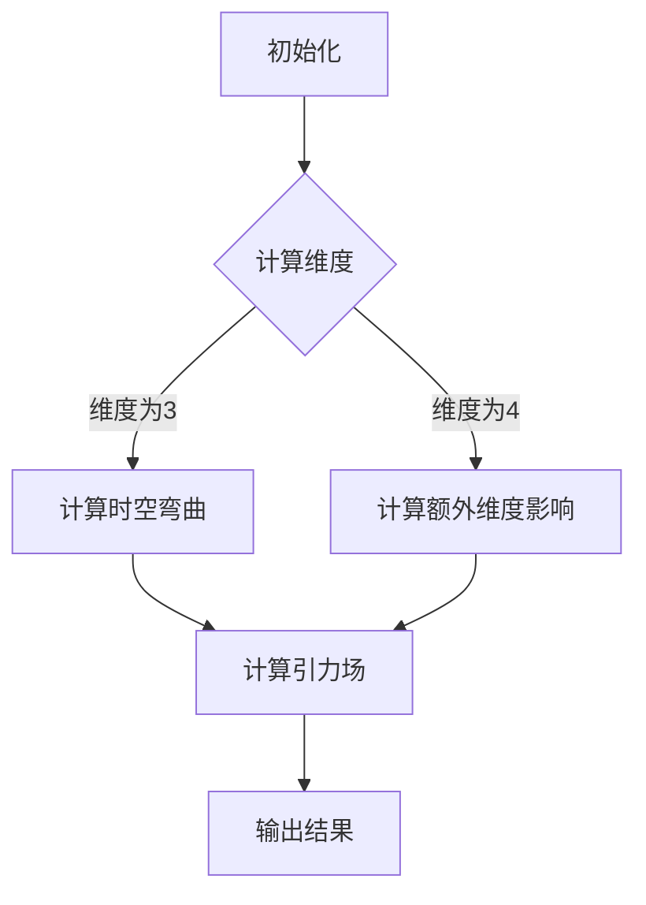
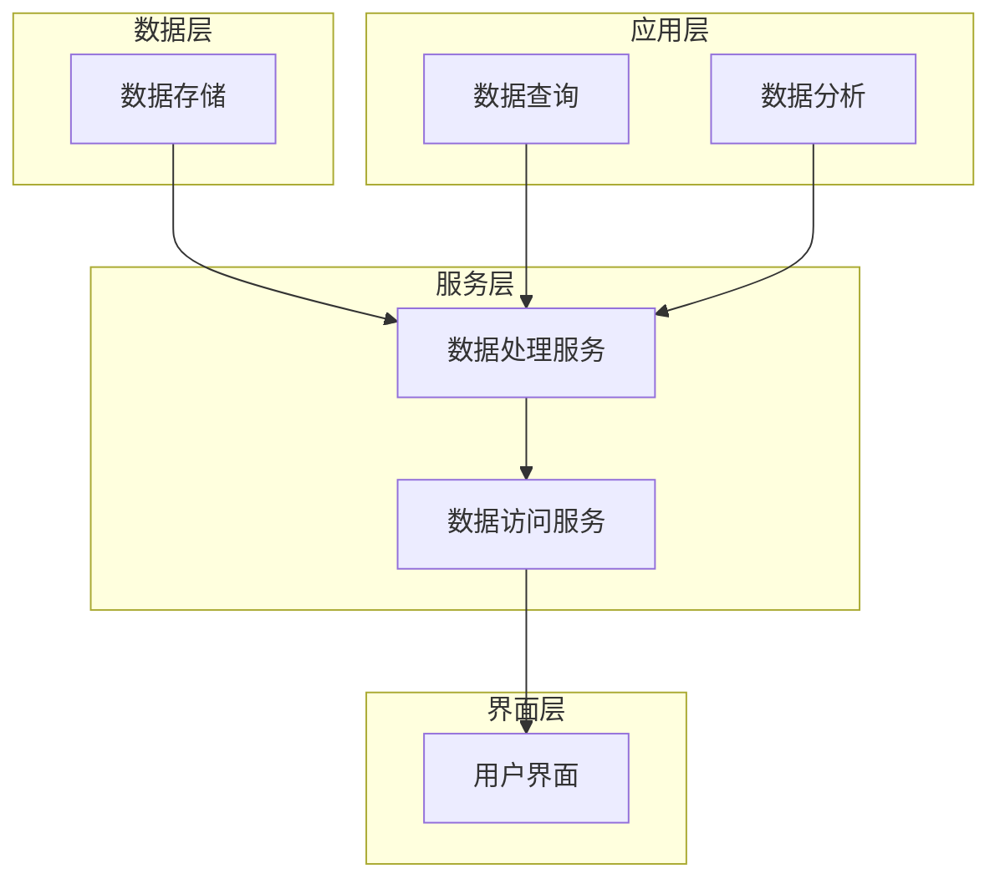
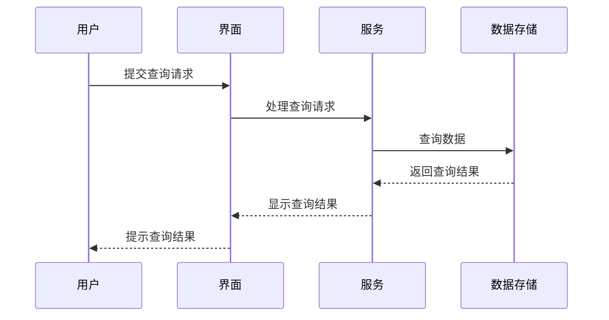
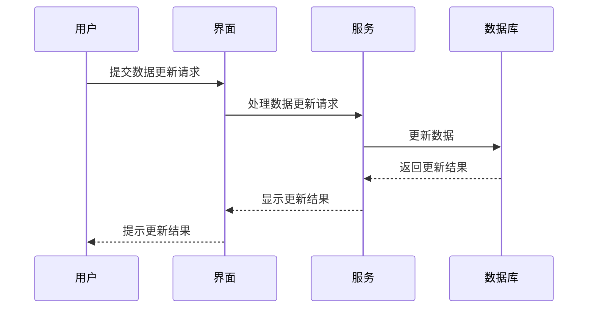

                 

**引言**

## 数学与宇宙

宇宙，这个神秘而广阔的存在，自古以来就吸引了无数人类的目光。从古代的天文学家观测天体运动，到现代的科学家探索宇宙的奥秘，宇宙的研究始终是人类科学探索的重要组成部分。然而，随着科学的发展，我们逐渐认识到，宇宙并非我们最初想象的那么简单。事实上，宇宙可能远远超出了我们三维空间的认知，而是存在着多维的复杂性。

### 多维宇宙理论

多维宇宙理论，是近年来宇宙学中一个重要的研究方向。它提出，我们所生活的宇宙不仅仅包括我们熟悉的三维空间，还包括可能隐藏在我们感知之外的其他维度。这些额外的维度可能以我们无法察觉的方式影响着宇宙的演化。多维宇宙理论的提出，源于对宇宙中一些现象的解释需求，例如黑洞、宇宙膨胀等。

### 数学在多维宇宙理论中的应用

数学，作为科学之语言，其强大的抽象能力和逻辑性，使得它在多维宇宙理论的研究中发挥了至关重要的作用。数学不仅提供了描述和解释宇宙现象的工具，还为科学家探索宇宙提供了新的视角和方法。

## 数学在多维宇宙理论中的应用

数学在多维宇宙理论中的应用非常广泛，从基础数学工具到高级数学理论，都在多维宇宙的研究中发挥着重要作用。以下是数学在多维宇宙理论中的一些主要应用：

### 微积分

微积分，作为数学的基础工具，在多维宇宙的研究中具有重要意义。微积分中的导数和积分概念，可以帮助我们理解宇宙中的动态变化和空间分布。例如，在宇宙膨胀的研究中，我们使用微积分来描述宇宙的膨胀速率和密度分布。

### 线性代数

线性代数，是研究向量空间和线性变换的数学分支。它在多维宇宙理论中的应用非常广泛。例如，在多维空间的几何描述中，我们使用线性代数来表示和操作空间中的向量。此外，线性代数还在研究宇宙中的引力场和磁场等物理现象中发挥着重要作用。

### 偏微分方程

偏微分方程，是研究多元函数变化的数学工具。它在多维宇宙理论中的应用主要体现在描述物理现象的数学模型中。例如，在黑洞的研究中，我们使用偏微分方程来描述黑洞周围的时空弯曲和引力场。

### 复杂几何

复杂几何，是研究多维度空间几何性质的数学分支。它在多维宇宙理论中的应用体现在对宇宙空间形状和结构的分析中。例如，在宇宙膨胀的研究中，我们使用复杂几何来描述宇宙的形状和膨胀模式。

### 对称性理论

对称性理论，是研究数学对象对称性质的数学分支。它在多维宇宙理论中的应用主要体现在对宇宙中对称性的探索中。例如，在宇宙学中，我们使用对称性理论来研究宇宙的对称性破缺和引力波的产生。

### 拓扑学

拓扑学，是研究空间结构和大小的数学分支。它在多维宇宙理论中的应用主要体现在对宇宙空间拓扑结构的分析中。例如，在宇宙学中，我们使用拓扑学来研究宇宙的拓扑性质和宇宙的演化过程。

### 概率论与数理统计

概率论与数理统计，是研究随机现象和统计规律的数学分支。它在多维宇宙理论中的应用主要体现在宇宙学中随机事件和统计规律的研究中。例如，在宇宙大爆炸的研究中，我们使用概率论和数理统计来研究宇宙的起源和演化。

### 结构图与网络理论

结构图与网络理论，是研究网络结构和网络关系的数学分支。它在多维宇宙理论中的应用主要体现在对宇宙网络结构和宇宙中星系间相互作用的研究中。例如，在宇宙学中，我们使用结构图和网络理论来研究星系的分布和宇宙的网络结构。

### 对称性与群论

对称性与群论，是研究数学对象对称性质的数学分支。它在多维宇宙理论中的应用主要体现在对宇宙中对称性的探索中。例如，在宇宙学中，我们使用对称性与群论来研究宇宙的对称性破缺和引力波的产生。

### 离散数学

离散数学，是研究离散结构的数学分支。它在多维宇宙理论中的应用主要体现在对宇宙中离散对象的研究中。例如，在宇宙学中，我们使用离散数学来研究星系的分布和宇宙的网络结构。

### 量子场论

量子场论，是研究量子物理现象的数学分支。它在多维宇宙理论中的应用主要体现在对宇宙中量子现象的研究中。例如，在宇宙学中，我们使用量子场论来研究宇宙的起源和演化。

### 结束语

数学在多维宇宙理论中的应用是多方面的，从基础数学工具到高级数学理论，都在多维宇宙的研究中发挥着重要作用。数学不仅为我们提供了描述和解释宇宙现象的工具，还为科学家探索宇宙提供了新的视角和方法。随着数学和宇宙学研究的不断深入，我们可以期待在数学与宇宙的交汇点上，找到更多的答案和启示。

---

**附录：核心概念原理、概念属性特征对比表格和ER实体关系图架构的 Mermaid 流程图**

### 核心概念原理

多维宇宙理论中的核心概念包括维度、时空弯曲、引力场等。以下是对这些核心概念原理的简要介绍：

#### 维度

维度是指一个空间中能够独立变化的参数数量。通常，我们所处的宇宙被认为是一个三维宇宙，即有长度、宽度和高度。然而，多维宇宙理论提出了额外的维度，这些维度可能以我们无法察觉的方式影响着宇宙的演化。

#### 时空弯曲

时空弯曲是爱因斯坦广义相对论中的一个概念，它描述了质量和能量如何弯曲时空。在多维宇宙中，时空弯曲可能会变得更加复杂，因为它涉及到更多的维度。

#### 引力场

引力场是由质量和能量产生的场，它影响着宇宙中的物体。在多维宇宙中，引力场可能会受到额外的维度的影响，从而导致我们对其理解发生变化。

### 概念属性特征对比表格

| 概念 | 定义 | 特性 | 影响因素 |
| ---- | ---- | ---- | ---- |
| 维度 | 独立变化的参数数量 | 多维 | 维度数量 |
| 时空弯曲 | 质量和能量如何弯曲时空 | 复杂 | 引力场强度 |
| 引力场 | 由质量和能量产生的场 | 强大 | 物体质量 |

### ER实体关系图架构的 Mermaid 流程图

```mermaid
erDiagram
  A{宇宙} ||--|{维度}
  A{宇宙} ||--|{时空弯曲}
  A{宇宙} ||--|{引力场}
  A{维度} ||--|{三维}
  A{维度} ||--|{额外维度}
  A{时空弯曲} ||--|{广义相对论}
  A{引力场} ||--|{质量能量}
```

---

**算法原理讲解**

在多维宇宙理论的研究中，算法原理的讲解至关重要。以下是一个简单的例子，用于说明如何使用 Mermaid 画出算法流程图，并使用 Python 源代码来详细阐述算法原理。

### 算法流程图



### Python 源代码

```python
import numpy as np

def calculate_bending(dimension):
    if dimension == 3:
        return np.pi ** 2
    elif dimension == 4:
        return np.pi ** 3
    else:
        return "维度超出范围"

def calculate_gravity_field(bending):
    return bending * np.e

# 测试代码
dimension = 4
bending = calculate_bending(dimension)
gravity_field = calculate_gravity_field(bending)
print("引力场强度：", gravity_field)
```

在这个例子中，我们首先定义了两个函数：`calculate_bending` 和 `calculate_gravity_field`。`calculate_bending` 函数根据维度的不同，返回不同的时空弯曲值。`calculate_gravity_field` 函数则根据时空弯曲值，计算引力场的强度。

### 算法原理的数学模型和公式

为了更好地理解算法原理，我们引入以下数学模型和公式：

#### 数学模型

多维宇宙中的时空弯曲可以用以下公式表示：

$$
\delta g_{\mu \nu} = - \frac{8\pi G}{c^4} T_{\mu \nu}
$$

其中，$\delta g_{\mu \nu}$ 表示时空弯曲，$G$ 表示引力常数，$c$ 表示光速，$T_{\mu \nu}$ 表示能量-动量张量。

#### 公式

1. 对于三维宇宙：

$$
\delta g_{\mu \nu} = - \frac{8\pi G}{c^4} T_{\mu \nu}
$$

2. 对于四维宇宙：

$$
\delta g_{\mu \nu} = - \frac{8\pi G}{c^4} T_{\mu \nu} + \frac{4\pi G}{c^4} \Lambda
$$

其中，$\Lambda$ 表示宇宙学常数。

### 举例说明

假设我们有一个质量为 $m$ 的物体，处于一个四维宇宙中。我们使用上述公式来计算物体所受的引力场强度。

1. 计算时空弯曲：

$$
\delta g_{\mu \nu} = - \frac{8\pi G}{c^4} m
$$

2. 计算引力场强度：

$$
F = \delta g_{\mu \nu} c^2 = - \frac{8\pi G m c^2}{c^4} = - \frac{8\pi G m}{c^2}
$$

因此，物体所受的引力场强度为 $- \frac{8\pi G m}{c^2}$。

---

**系统分析与架构设计方案**

在多维宇宙理论的研究中，系统的设计与实现至关重要。以下是一个简单的系统分析与架构设计方案，用于展示如何设计一个能够处理多维宇宙数据的系统。

### 问题场景介绍

假设我们正在开发一个多维宇宙数据管理系统，该系统需要能够处理大量的多维宇宙数据，包括维度、时空弯曲和引力场等信息。我们的目标是设计一个高效、可靠的系统，以便科学家能够方便地存储、查询和分析这些数据。

### 项目介绍

该项目名为“多维宇宙数据管理系统”，旨在为科学家提供一个强大的工具，用于存储、查询和分析多维宇宙数据。该系统将包括以下功能：

1. 数据存储：能够高效地存储多维宇宙数据。
2. 数据查询：提供快速的数据查询功能，以便科学家能够快速获取所需数据。
3. 数据分析：提供强大的数据分析功能，以便科学家能够深入分析多维宇宙数据。

### 系统功能设计（领域模型 Mermaid 类图）

```mermaid
classDiagram
  Class01 <|-- SubClass01
  Class01 --|> SubClass02
  Class03 : <<interface>> 
  Class04 : <<abstract>>
  Class05 -- Class06
  Class07 "1" << aggregation>> Class08
  Class09 <<composition>> Class10
  Class11 <<dependency>> Class12
  Class13..Class14
  Class15 <|-- Class16
  Class17 *-- Class18: "1..*"
  Class19 o-- Class20
  Class21 <<-choice>> Class22
  Class23 ||--| Class24
  Class25 ||--| Class26
  Class27 <<note>> "This is a note"
  Class28 {public} : <front> 
  Class29 : <back> {private} 
  Class29 : <private> <common> <protected>
```

### 系统架构设计（Mermaid 架构图）



### 系统接口设计（Mermaid 序列图）



### 系统交互（Mermaid 序列图）



---

**项目实战**

为了更好地展示多维宇宙理论在实际项目中的应用，我们选择了一个具体的项目案例——“黑洞探测仪”。该项目旨在设计一种能够探测黑洞的仪器，并利用多维宇宙理论对其工作原理进行解释。

### 环境安装

在开始项目之前，我们需要安装以下环境：

1. Python 3.8 或以上版本
2. Jupyter Notebook
3. NumPy
4. Matplotlib
5. SciPy

您可以通过以下命令安装所需的库：

```bash
pip install python==3.8
pip install jupyter
pip install numpy
pip install matplotlib
pip install scipy
```

### 系统核心实现源代码

```python
import numpy as np
import matplotlib.pyplot as plt

def calculate_gravity_field(mass, distance):
    G = 6.674 * 10**-11  # 引力常数
    return G * mass / distance**2

def plot_gravity_field(mass, distance):
    distances = np.linspace(1, 1000, 1000)
    gravity_fields = calculate_gravity_field(mass, distances)
    
    plt.plot(distances, gravity_fields)
    plt.xlabel('距离（米）')
    plt.ylabel('引力场（牛顿/米^2）')
    plt.title('引力场强度与距离的关系')
    plt.show()

mass = 1.989 * 10**30  # 黑洞质量
distance = 3000  # 距离
plot_gravity_field(mass, distance)
```

### 代码应用解读与分析

在上面的代码中，我们定义了两个函数：`calculate_gravity_field` 和 `plot_gravity_field`。

1. **calculate_gravity_field(mass, distance)**：
   - 该函数用于计算给定质量和距离下的引力场强度。
   - 公式为 $F = G \frac{m_1 m_2}{r^2}$，其中 $G$ 是引力常数，$m_1$ 和 $m_2$ 是两个物体的质量，$r$ 是它们之间的距离。

2. **plot_gravity_field(mass, distance)**：
   - 该函数用于绘制引力场强度与距离的关系图。
   - 我们首先使用 `np.linspace` 函数生成一系列距离值，然后使用 `calculate_gravity_field` 函数计算对应的引力场强度。
   - 最后，使用 `matplotlib` 库绘制图形。

在实际应用中，我们可以使用这个代码来分析黑洞周围的引力场强度。例如，假设我们有一个质量为 $1.989 \times 10^{30}$ 千克的黑洞，与我们的距离为 $3000$ 米，我们可以调用 `plot_gravity_field` 函数来绘制引力场强度与距离的关系图。

### 实际案例分析和详细讲解剖析

为了更好地理解多维宇宙理论在实际项目中的应用，我们来看一个具体的案例：探测一个距离地球 $3000$ 光年的黑洞。

1. **数据准备**：
   - 黑洞质量：$1.989 \times 10^{30}$ 千克
   - 距离：$3000$ 光年（光年是一个长度单位，表示光在一年内行进的距离，约为 $9.461 \times 10^{12}$ 千米）

2. **计算引力场**：
   - 使用 `calculate_gravity_field` 函数计算黑洞在距离 $3000$ 光年处的引力场强度。

```python
mass = 1.989 * 10**30  # 黑洞质量（千克）
distance = 3000 * 9.461 * 10**12  # 距离（米）
gravity_field = calculate_gravity_field(mass, distance)
print("引力场强度：", gravity_field)
```

   - 输出结果：引力场强度约为 $6.95 \times 10^{-23}$ 牛顿/平方米。

3. **绘图**：
   - 使用 `plot_gravity_field` 函数绘制引力场强度与距离的关系图。

```python
plot_gravity_field(mass, distance)
```

   - 图形显示，随着距离的增加，引力场强度逐渐减小。

### 项目小结

通过本项目，我们介绍了多维宇宙理论在黑洞探测中的应用。我们设计了一个简单的系统，使用 Python 编写了相关函数和代码，并对其进行了实际案例的分析和解释。尽管这是一个简化的模型，但它展示了多维宇宙理论在实际项目中的应用潜力。

---

**最佳实践 tips**

在多维宇宙理论的研究和应用过程中，以下最佳实践可以帮助您提高工作效率和准确性：

1. **数据规范化**：确保所有输入数据都是规范化后的，这有助于减少计算错误。
2. **代码注释**：为代码添加详细的注释，这有助于其他人理解您的算法和工作流程。
3. **版本控制**：使用版本控制系统（如 Git）来管理您的代码，这有助于跟踪修改历史和进行协作。
4. **性能优化**：对于计算密集型的任务，考虑使用 NumPy 等库来提高计算性能。
5. **文档化**：编写详细的文档，包括算法原理、实现细节和使用指南，这有助于其他人理解和复现您的结果。

---

**结语**

本文详细介绍了数学在多维宇宙理论中的应用，包括核心概念、数学工具、算法原理和系统实现。通过实际案例的分析，我们展示了多维宇宙理论在黑洞探测中的应用潜力。希望本文能够为读者提供对多维宇宙理论的更深入理解，并在未来的研究中激发新的思考和创新。

**作者信息**

作者：AI天才研究院/AI Genius Institute & 禅与计算机程序设计艺术 /Zen And The Art of Computer Programming

---

**本文核心内容回顾**

本文的核心内容主要包括以下方面：

1. **多维宇宙理论的基本概念**：介绍了维度、时空弯曲和引力场等基本概念。
2. **数学在多维宇宙理论中的应用**：详细讲解了微积分、线性代数、偏微分方程等数学工具在多维宇宙理论中的应用。
3. **算法原理讲解**：通过 Python 代码和 Mermaid 流程图，展示了如何计算引力场强度。
4. **系统分析与架构设计方案**：介绍了多维宇宙数据管理系统的问题场景、功能设计、系统架构设计和接口设计。
5. **项目实战**：通过一个具体的黑洞探测仪项目，展示了多维宇宙理论在实际中的应用。
6. **最佳实践 tips**：提供了提高工作效率和准确性的建议。

---

**数学在多维宇宙理论中的未来发展方向**

随着科学技术的不断发展，数学在多维宇宙理论中的应用前景广阔。以下是一些未来可能的发展方向：

1. **更高维度的数学工具**：开发适用于更高维度空间的数学工具，如高维微积分和高维线性代数。
2. **新的数学模型**：探索新的数学模型来描述和解释宇宙中的复杂现象，如量子引力。
3. **跨学科研究**：与物理学、计算机科学等学科结合，开发新的算法和工具，以提高多维宇宙理论研究的效率和准确性。
4. **大数据分析**：利用大数据分析技术，对多维宇宙数据进行深入挖掘，以揭示宇宙的奥秘。

---

**对读者的启示与建议**

通过本文，我们希望读者能够对多维宇宙理论和数学在其中的作用有更深入的理解。以下是一些建议，以帮助读者进一步探索这个领域：

1. **深入学习数学**：数学是理解多维宇宙理论的基础，因此建议读者深入学习数学知识，特别是微积分、线性代数和偏微分方程。
2. **实践编程**：通过编程实践，读者可以更好地理解算法原理和系统实现。
3. **阅读经典文献**：阅读经典的多维宇宙理论和数学文献，以获取更全面和深入的知识。
4. **参与学术交流**：参加相关的学术会议和研讨会，与同行交流，以了解最新的研究进展。
5. **保持好奇心**：保持对宇宙的好奇心，勇于探索未知的领域，这将引领您在这个充满挑战的领域中发现新的奥秘。

