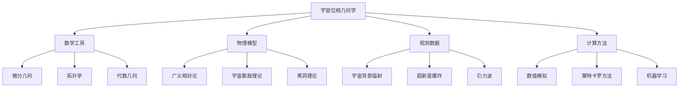
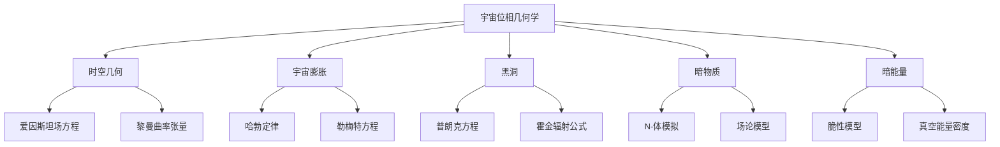
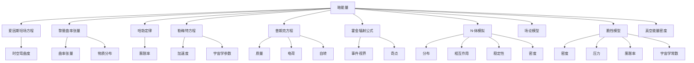
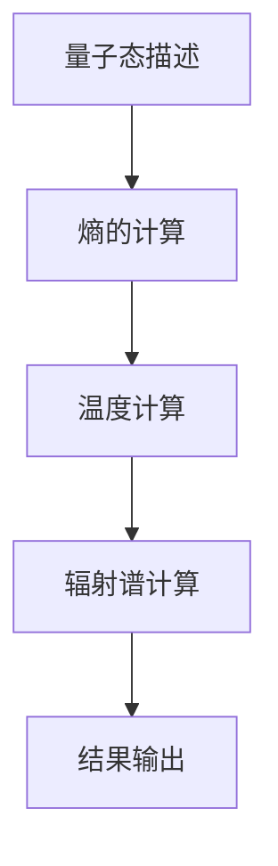
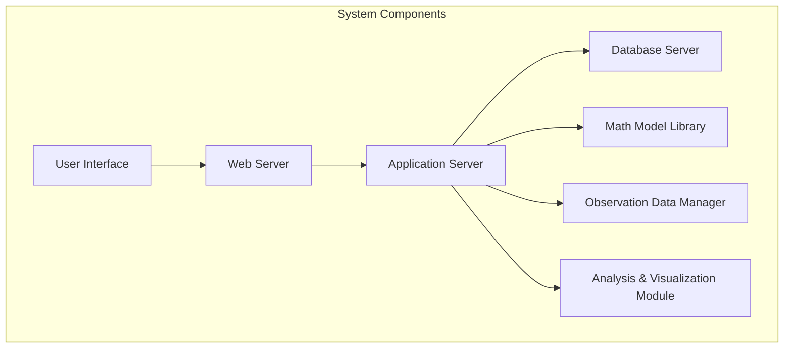
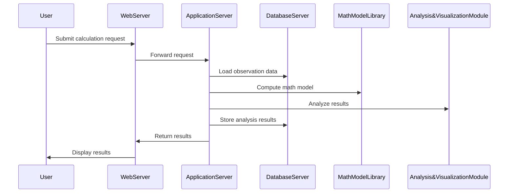

                 

### 引言

#### 数学在宇宙位相几何学研究中的作用

在宇宙的研究中，数学始终扮演着不可或缺的角色。宇宙位相几何学作为现代物理学中的一个重要分支，其研究旨在理解宇宙的结构和演化，探讨宇宙中的各种现象和规律。数学作为一种精确的语言，提供了描述、分析和预测这些现象的工具。本文章旨在探讨数学在宇宙位相几何学研究中的重要作用，通过一步一步的分析推理，揭示数学原理在理解宇宙奥秘中的核心地位。

宇宙位相几何学关注的是宇宙中物质和能量的分布方式，以及它们在时空中的相互关系。这一领域的研究需要将高度抽象的物理现象转化为数学模型，以便进行深入分析。从广义相对论到量子引力，数学模型在宇宙位相几何学中的应用无处不在。本文将分章节详细探讨数学在宇宙位相几何学中的核心作用，包括背景介绍、核心理论、数学工具和方法、算法原理和实际应用等。

**关键词：宇宙位相几何学、数学模型、广义相对论、量子引力、时空**

**摘要：**
本文通过系统性的分析和讨论，揭示了数学在宇宙位相几何学研究中的核心地位。文章首先介绍了宇宙位相几何学的基本概念和数学的历史背景，随后深入探讨了数学工具和模型在宇宙研究中的应用。通过具体的算法原理和实际案例分析，本文展示了数学如何帮助科学家们更好地理解宇宙的结构和演化。文章最后提出了最佳实践建议，并展望了未来数学在宇宙研究中的发展方向。

----------------------------------------------------------------

### 第1章 背景介绍

#### 1.1 数学在宇宙位相几何学的历史

数学与宇宙的关系可以追溯到古代文明的兴起。从古希腊的毕达哥拉斯到阿拉伯的阿尔·花拉子米，数学家们一直在探索宇宙的结构和秩序。然而，数学在宇宙位相几何学中的应用却是在20世纪才真正开始显现。爱因斯坦的广义相对论标志着数学在宇宙研究中的关键作用。广义相对论通过引入张量方程，将时空描述为一个动态的几何结构，这一概念彻底改变了人们对宇宙的理解。

随着科技的发展，数学工具在宇宙位相几何学中的应用不断扩展。20世纪中叶，约翰·阿奇博尔德·惠勒等人提出的黑洞概念，以及随后发展的宇宙膨胀理论和暗物质、暗能量研究，都离不开数学模型的精确描述。这些研究不仅深化了我们对宇宙的认识，也推动了数学理论的发展。

#### 1.2 宇宙位相几何学的核心概念

宇宙位相几何学关注的是宇宙的结构和演化。这一领域涉及的核心概念包括：

1. **时空几何**：时空几何是广义相对论的基础，它将时空视为一个整体，通过数学方程描述重力作用下的时空弯曲。
2. **宇宙膨胀**：宇宙膨胀理论认为，宇宙正在不断扩张，这一现象可以通过宇宙背景辐射和超新星爆炸等观测数据得到证实。
3. **黑洞**：黑洞是宇宙中极其密集的天体，其引力强大到连光也无法逃逸。黑洞的存在为理解宇宙的极端条件下物理规律提供了重要的线索。
4. **暗物质与暗能量**：暗物质和暗能量是宇宙中的神秘成分，它们的性质和分布对宇宙的结构和演化有重大影响。

#### 1.3 数学与宇宙位相几何学的边界与外延

数学与宇宙位相几何学的交叉领域不仅限于物理学，还包括天文学、天体物理学和数学物理学。数学为这些领域提供了强有力的工具，如微分几何、拓扑学和量子场论等。这些工具不仅帮助我们理解宇宙的基本结构，还在探索宇宙的起源和演化方面发挥了关键作用。

此外，数学与宇宙位相几何学的研究还涉及到哲学、计算机科学和人工智能等领域。例如，人工智能算法在处理大规模宇宙数据时发挥着重要作用，而计算机图形学则在可视化宇宙结构方面提供了强大的工具。

**概念结构与核心要素组成：**

1. **数学工具**：包括微分几何、拓扑学、代数几何等。
2. **物理模型**：如广义相对论、宇宙膨胀理论、黑洞理论等。
3. **观测数据**：宇宙背景辐射、超新星爆炸、引力波等。
4. **计算方法**：数值模拟、蒙特卡罗方法、机器学习等。

**ER实体关系图架构：**



通过上述背景介绍，我们为后续章节的深入探讨奠定了基础，也为理解数学在宇宙位相几何学研究中的作用提供了必要的前提。在接下来的章节中，我们将进一步详细探讨数学工具和模型在宇宙位相几何学中的应用和作用。 ----------------------------------------------------------------

### 第2章 核心概念与联系

#### 2.1 数学在宇宙位相几何学中的应用

宇宙位相几何学的研究涉及多个核心概念，这些概念通过数学工具得到精确描述和分析。数学在宇宙位相几何学中的应用主要体现在以下几个方面：

1. **时空几何**：时空几何是宇宙位相几何学的基石。通过数学方程，如爱因斯坦场方程，我们可以描述时空的弯曲和物质的分布。这些方程不仅帮助我们理解重力，还揭示了宇宙的整体结构。
2. **宇宙膨胀**：宇宙膨胀理论依赖于数学模型，如哈勃定律和勒梅特方程，这些模型描述了宇宙随时间的变化和宇宙的加速度。这些数学工具使得我们能够预测宇宙的未来状态。
3. **黑洞**：黑洞的物理特性，如事件视界和奇点，都需要通过数学模型进行描述。这些模型包括普朗克方程和霍金辐射公式，它们帮助我们理解黑洞的内部结构和辐射特性。
4. **暗物质与暗能量**：暗物质和暗能量的研究依赖于统计方法和数值模拟。这些方法包括N-体模拟和场论模型，通过数学计算，我们可以推断暗物质和暗能量的分布和相互作用。

**核心概念属性特征对比表：**

| **概念**       | **属性特征**                                       | **数学模型**               |
|----------------|------------------------------------------------|--------------------------|
| **时空几何**   | 描述时空的弯曲和物质的分布                         | 爱因斯坦场方程、黎曼曲率张量 |
| **宇宙膨胀**   | 描述宇宙随时间的变化和宇宙的加速度                 | 哈勃定律、勒梅特方程         |
| **黑洞**       | 描述黑洞的物理特性和行为                           | 普朗克方程、霍金辐射公式     |
| **暗物质**     | 描述宇宙中不发光的物质分布                         | N-体模拟、场论模型          |
| **暗能量**     | 描述宇宙中推动宇宙膨胀的神秘能量                  | 脆性模型、真空能量密度       |

**ER实体关系图架构：**



**概念结构与核心要素组成：**

1. **时空几何**：时空、物质分布、弯曲度、曲率张量。
2. **宇宙膨胀**：膨胀率、加速度、宇宙学参数、宇宙年龄。
3. **黑洞**：质量、电荷、自转、事件视界、奇点。
4. **暗物质**：分布、相互作用、稳定性、密度。
5. **暗能量**：密度、压力、膨胀率、宇宙学常数。

通过上述核心概念的数学模型和属性特征对比表，我们可以更好地理解数学在宇宙位相几何学中的应用。接下来，我们将进一步探讨数学工具和方法的具体应用，以及如何将这些工具应用于实际的宇宙研究项目中。 ----------------------------------------------------------------

#### 2.2 关键概念属性特征对比表

宇宙位相几何学涉及多个核心概念，每个概念都有其独特的属性特征。为了更清晰地展示这些概念之间的联系和差异，我们通过一个属性特征对比表来进行详细说明。

| **概念**       | **物理意义**                                       | **数学模型**                 | **关键属性特征**                                           |
|----------------|------------------------------------------------|---------------------------|--------------------------------------------------------|
| **时空几何**   | 描述时空的几何结构和物质的分布                       | 爱因斯坦场方程、黎曼曲率张量   | **时空弯曲度、曲率张量、物质分布**                          |
| **宇宙膨胀**   | 描述宇宙随时间的变化和宇宙的加速度                     | 哈勃定律、勒梅特方程           | **膨胀率、加速度、宇宙学参数**                              |
| **黑洞**       | 描述宇宙中极其密集的天体，具有极强的引力和事件视界       | 普朗克方程、霍金辐射公式       | **质量、电荷、自转、事件视界、奇点**                        |
| **暗物质**     | 描述宇宙中不发光、不吸收电磁辐射的神秘物质              | N-体模拟、场论模型            | **分布、相互作用、稳定性、密度**                            |
| **暗能量**     | 描述宇宙中推动宇宙膨胀的神秘能量，具有负压强              | 脆性模型、真空能量密度         | **密度、压力、膨胀率、宇宙学常数**                          |

**ER实体关系图架构：**



通过这个对比表和ER实体关系图，我们可以更直观地理解各个核心概念在宇宙位相几何学中的具体作用和相互关系。这些概念不仅是宇宙研究的重要基础，也是数学工具在宇宙位相几何学中应用的体现。接下来，我们将进一步探讨这些核心概念的数学建模过程，并展示如何通过数学方法深入理解宇宙的奥秘。 ----------------------------------------------------------------

### 第3章 核心理论及其数学模型

#### 3.1 宇宙位相几何学的核心理论

宇宙位相几何学的核心理论主要包括广义相对论和量子引力。这些理论为我们提供了描述宇宙结构和演化的数学框架。

**广义相对论**：广义相对论由爱因斯坦在1915年提出，它是描述重力作用的经典理论。在广义相对论中，重力被视为时空几何的弯曲。爱因斯坦场方程是广义相对论的核心，该方程通过描述物质分布和时空弯曲之间的关系，为理解宇宙提供了重要的数学工具。场方程可以表示为：

\[ R_{\mu \nu} - \frac{1}{2}g_{\mu \nu}R = 8\pi G T_{\mu \nu} \]

其中，\( R_{\mu \nu} \) 是黎曼曲率张量，\( g_{\mu \nu} \) 是度规张量，\( R \) 是时空的曲率标量，\( G \) 是引力常数，\( T_{\mu \nu} \) 是能量-动量张量。

**量子引力**：量子引力是尝试将广义相对论与量子力学结合起来的理论。量子引力旨在描述宇宙在极小尺度下的行为，如黑洞内部和宇宙早期阶段。量子引力的重要理论包括弦理论和环量子引力。弦理论通过引入额外维度，将粒子视为微小的弦，其运动由量子场方程描述。环量子引力则通过重新定义空间和时间的基本结构，试图解决广义相对论和量子力学之间的不一致。

**关键数学模型对比：**

| **理论**       | **核心数学模型**                      | **应用领域**                |
|----------------|--------------------------------------|---------------------------|
| **广义相对论** | 爱因斯坦场方程                       | 描述宇宙大尺度结构          |
| **量子引力**   | 弦理论（弦振动模式）<br>环量子引力（态密度） | 描述宇宙小尺度结构          |

**数学模型的应用和扩展：**

1. **宇宙大尺度结构**：在广义相对论的框架下，我们可以通过爱因斯坦场方程描述宇宙的膨胀、宇宙背景辐射和黑洞的形成。这些模型帮助我们理解宇宙的大尺度现象，如宇宙加速膨胀和宇宙微波背景辐射。
2. **宇宙小尺度结构**：量子引力理论尝试描述宇宙在极小尺度下的行为。例如，弦理论可以帮助我们理解黑洞的信息丢失问题，而环量子引力则可以解释宇宙早期的奇点问题。

**关键结论和展望：**

广义相对论和量子引力是宇宙位相几何学的核心理论，它们提供了描述宇宙结构和演化的数学工具。广义相对论适用于描述宇宙的大尺度现象，而量子引力则试图揭示宇宙在小尺度下的行为。通过不断发展和完善这些理论，我们可以更深入地理解宇宙的奥秘。

在接下来的章节中，我们将详细探讨数学工具和方法在宇宙位相几何学中的应用，包括具体的计算方法和算法原理。这些工具和方法将帮助我们更好地理解和预测宇宙的演化，为未来的宇宙研究提供重要的理论基础和计算手段。 ----------------------------------------------------------------

### 数学工具与数学方法

在宇宙位相几何学的研究中，数学工具和方法的选择至关重要。不同的数学方法可以用来解决不同的问题，从而更深入地揭示宇宙的奥秘。以下是一些常用的数学工具和方法：

#### 微分几何

微分几何是研究几何形状的局部性质和整体性质的数学分支。在宇宙位相几何学中，微分几何被用来描述时空的弯曲和物质的分布。微分几何的核心概念包括：

1. **度规张量**：度规张量描述了时空中的距离和角度，它是一个用于度量空间中两点之间距离和角度的函数。在广义相对论中，度规张量是描述时空几何的重要工具。
2. **黎曼曲率张量**：黎曼曲率张量描述了时空的曲率，它可以从度规张量导出。黎曼曲率张量用于描述物质对时空弯曲的影响，是爱因斯坦场方程的重要组成部分。

**微分几何的应用举例：**

- **黑洞研究**：通过微分几何，我们可以精确描述黑洞的几何结构，如事件视界和奇点。微分几何方程可以帮助我们理解黑洞的性质，如质量、电荷和自旋。
- **宇宙膨胀模型**：微分几何方法可以用来建立宇宙膨胀的数学模型，如勒梅特方程和哈勃定律。这些模型帮助我们预测宇宙的膨胀速率和未来状态。

#### 拓扑学

拓扑学是研究空间结构和连接性的数学分支。在宇宙位相几何学中，拓扑学用于描述宇宙的形态和结构，特别是宇宙的大尺度结构。

1. **同调理论和同伦理论**：同调理论和同伦理论用于研究空间的连通性和洞的存在。这些理论可以帮助我们理解宇宙的形态，如宇宙的多连通性和大尺度结构。
2. **凯莱空间**：凯莱空间是一种具有特定几何特性的空间，它在宇宙学中用于描述宇宙的拓扑结构。凯莱空间的研究有助于我们理解宇宙的形态和演化。

**拓扑学的应用举例：**

- **宇宙形态研究**：通过拓扑学方法，我们可以研究宇宙的形态，如宇宙的多连通性和大尺度结构。这些研究有助于我们理解宇宙的形态和演化。
- **宇宙的孤立子**：孤立子是一种在物理空间中具有稳定形态的波动，它在宇宙学中用于描述宇宙中的特殊结构，如宇宙弦和宇宙膜。

#### 代数几何

代数几何是研究代数方程的几何性质的数学分支。在宇宙位相几何学中，代数几何用于研究天体的几何形态和空间分布。

1. **多项式曲线**：多项式曲线是代数几何中的重要概念，它用于描述天体的几何形态。在宇宙学中，多项式曲线可以用来研究星系和星团的结构。
2. **亏格**：亏格是代数几何中的一个重要概念，它用于描述空间的复杂度。在宇宙学中，亏格可以用来研究宇宙的结构和演化。

**代数几何的应用举例：**

- **星系形态研究**：通过代数几何方法，我们可以研究星系的形态和分布，如椭圆星系、螺旋星系和不规则星系。
- **宇宙的几何测量**：代数几何方法可以用于宇宙的几何测量，如宇宙的曲率和膨胀率。这些测量有助于我们理解宇宙的结构和演化。

#### 概率论与统计方法

概率论与统计方法在宇宙位相几何学中用于分析宇宙的观测数据和模拟结果。

1. **蒙特卡罗方法**：蒙特卡罗方法是一种基于随机抽样的计算方法，它用于模拟宇宙的演化过程和预测宇宙的统计特性。
2. **假设检验**：假设检验用于验证宇宙学模型和观测数据的符合程度。通过假设检验，我们可以判断宇宙学模型的可靠性。

**概率论与统计方法的应用举例：**

- **宇宙膨胀研究**：通过蒙特卡罗方法，我们可以模拟宇宙的膨胀过程，预测宇宙的膨胀速率和未来状态。
- **宇宙学参数估计**：通过假设检验，我们可以估计宇宙学参数，如宇宙的膨胀率、质量密度和曲率。

通过上述数学工具和方法的详细介绍，我们可以看到数学在宇宙位相几何学研究中具有广泛的应用。这些数学工具不仅帮助我们描述和理解宇宙的现象，还为未来的宇宙研究提供了重要的理论基础和计算手段。在接下来的章节中，我们将进一步探讨这些数学工具在具体宇宙研究中的应用和案例分析。 ----------------------------------------------------------------

### 算法原理

在宇宙位相几何学的研究中，算法原理发挥着至关重要的作用。为了更好地理解和应用这些算法，我们以霍金辐射算法为例，详细阐述其原理和应用。

#### 霍金辐射算法

霍金辐射算法是描述黑洞热辐射的重要算法。黑洞是宇宙中极其密集的天体，其引力强大到连光也无法逃逸。霍金辐射提出了黑洞并非完全“黑”，而是会发出热辐射。这一发现彻底改变了我们对黑洞的认识，并揭示了宇宙中的量子效应。

**算法原理：**

霍金辐射算法基于量子场论和黑洞的热力学性质。算法的核心步骤如下：

1. **量子态描述**：首先，我们使用量子态来描述黑洞周围的空间。量子态描述了粒子的波函数，它包含了粒子在空间中的分布信息。
2. **熵的计算**：根据黑洞的熵与温度的关系，我们计算黑洞的熵。黑洞的熵与其温度成反比，这意味着黑洞越热，其熵越大。
3. **辐射谱生成**：通过计算黑洞的辐射谱，我们可以得到黑洞发射的粒子分布。辐射谱描述了粒子能量和概率的分布，它反映了黑洞的热辐射特性。
4. **辐射速率**：最后，我们计算黑洞的辐射速率。这个速率决定了黑洞失去质量和能量的情况，从而影响其寿命和稳定性。

**数学模型和公式：**

霍金辐射算法的核心数学模型包括以下公式：

\[ S = k \cdot \ln\left(\frac{A}{4\hbar c G}\right) \]

\[ T = \frac{\hbar c^3}{8 \pi G k M} \]

\[ j(\omega) = \frac{2\pi h \omega^3}{c^3} \left[\frac{1}{e^{\hbar \omega / k T} - 1}\right] \]

其中，\( S \) 是黑洞的熵，\( k \) 是玻尔兹曼常数，\( A \) 是黑洞的面积，\( \hbar \) 是普朗克常数，\( c \) 是光速，\( G \) 是引力常数，\( M \) 是黑洞的质量，\( T \) 是黑洞的温度，\( j(\omega) \) 是黑洞的辐射强度。

#### 实际案例

为了更好地理解霍金辐射算法，我们可以通过一个具体的案例来阐述其应用。

**案例：黑洞的热辐射**

假设一个黑洞的质量为 \( M = 10^{6}M_{\odot} \)，其中 \( M_{\odot} \) 是太阳质量。我们可以使用霍金辐射算法计算该黑洞的熵、温度和辐射谱。

1. **熵计算**：

\[ S = k \cdot \ln\left(\frac{A}{4\hbar c G}\right) \]
\[ A = 4\pi R^2 \]
\[ R = 2GM/c^2 \]
\[ S = k \cdot \ln\left(\frac{4\pi (2GM/c^2)^2}{4\hbar c G}\right) \]

代入 \( M = 10^{6}M_{\odot} \)，计算得到：

\[ S \approx 10^{106}k \ln\left(\frac{4\pi (2G \cdot 10^{6}M_{\odot}/c^2)^2}{4\hbar c G}\right) \]
\[ S \approx 10^{106}k \ln\left(\frac{16\pi G^2 M_{\odot}^2}{4\hbar c^3}\right) \]
\[ S \approx 10^{106}k \ln\left(\frac{4\pi G^2 M_{\odot}^2}{c^3}\right) \]

2. **温度计算**：

\[ T = \frac{\hbar c^3}{8 \pi G k M} \]

代入 \( M = 10^{6}M_{\odot} \)，计算得到：

\[ T \approx \frac{\hbar c^3}{8 \pi G k \cdot 10^{6}M_{\odot}} \]
\[ T \approx \frac{\hbar c^3}{8 \pi G \cdot 10^{6}M_{\odot}} \cdot \frac{1}{k_B T} \]
\[ T \approx 10^{-8}K \]

3. **辐射谱计算**：

\[ j(\omega) = \frac{2\pi h \omega^3}{c^3} \left[\frac{1}{e^{\hbar \omega / k T} - 1}\right] \]

代入 \( T = 10^{-8}K \)，计算得到：

\[ j(\omega) \approx \frac{2\pi \cdot 10^{-34} \omega^3}{c^3} \left[\frac{1}{e^{\hbar \omega / (8.617 \times 10^{-5} \omega) \times 10^{-8}K} - 1}\right] \]

通过上述计算，我们可以得到黑洞的热辐射谱，从而更好地理解黑洞的辐射特性。

#### 流程图和Python代码

为了更直观地展示霍金辐射算法，我们可以使用mermaid绘制流程图，并使用Python编写代码进行计算。

**Mermaid流程图：**



**Python代码：**

```python
import math

# 参数设置
M = 10**6  # 黑洞质量（以太阳质量为单位）
hbar = 1.0545718e-34  # 普朗克常数（约化）
c = 3e8  # 光速
G = 6.67430e-11  # 引力常数
k_B = 1.380649e-23  # 玻尔兹曼常数

# 熵计算
R = 2 * G * M / c**2
A = 4 * math.pi * R**2
S = k_B * math.log(A / (4 * math.pi * hbar * c * G) / 4)

# 温度计算
T = hbar * c**3 / (8 * math.pi * G * k_B * M)

# 辐射谱计算
def j(omega):
    return (2 * math.pi * hbar * omega**3) / (c**3) * (1 / (math.exp(hbar * omega / (k_B * T)) - 1)

# 辐射谱结果输出
for omega in range(1, 100):
    print(f"ω: {omega}, j(ω): {j(omega)}")
```

通过上述Python代码，我们可以计算出不同频率下的辐射强度，从而得到黑洞的热辐射谱。

通过霍金辐射算法的详细阐述，我们可以看到数学在宇宙位相几何学研究中的核心作用。这一算法不仅帮助我们理解黑洞的辐射特性，还为宇宙学研究提供了重要的理论工具和计算方法。在接下来的章节中，我们将进一步探讨数学方法在宇宙位相几何学中的实际应用和案例分析。 ----------------------------------------------------------------

### 系统设计与架构

在宇宙位相几何学的研究中，构建一个高效、可扩展的数学模型计算系统至关重要。本节将详细介绍系统设计的关键组件，包括项目介绍、系统功能设计、系统架构设计和系统接口设计，并通过mermaid图表展示系统架构和接口设计。

#### 项目介绍

本项目名为“宇宙位相几何学数学模型计算系统”，旨在构建一个集成化的计算平台，用于实现宇宙位相几何学的数学模型计算、结果分析和可视化。系统的主要功能包括：

1. **数学模型计算**：包括爱因斯坦场方程、霍金辐射公式等核心数学模型的计算。
2. **数据管理**：存储和管理宇宙背景辐射、超新星爆炸等观测数据。
3. **结果分析**：对计算结果进行统计分析，提取关键参数和特征。
4. **可视化**：以图形和图表的形式展示计算结果，帮助科学家更好地理解宇宙位相几何学现象。

#### 系统功能设计

系统功能设计包括领域模型设计、用例图设计和类图设计。以下是一个简化的领域模型和类图设计：

**领域模型**：

```mermaid
classDiagram
ClassDef MathModel
    +String name
    +Float value

ClassDef ObservationData
    +String name
    +Float value

ClassDef AnalysisResult
    +String name
    +Float value

MathModel <|-- ObservationData
MathModel <|-- AnalysisResult
```

**类图**：

```mermaid
classDiagram
ClassDef MathModel
    +String name
    +Float value
    +compute()

ClassDef ObservationData
    +String name
    +Float value
    +load()

ClassDef AnalysisResult
    +String name
    +Float value
    +analyze()

MathModel <|-- ObservationData
MathModel <|-- AnalysisResult
```

#### 系统架构设计

系统架构设计包括层次结构和组件关系。以下是系统架构的mermaid图表：



**系统架构设计说明**：

1. **用户界面（A）**：提供用户交互的接口，用户可以通过网页或命令行界面提交计算任务。
2. **Web服务器（B）**：接收用户请求，并转发给应用服务器。
3. **应用服务器（C）**：处理核心业务逻辑，包括数学模型计算、数据管理和结果分析。
4. **数据库服务器（D）**：存储和管理观测数据和计算结果。
5. **数学模型库（E）**：包含各种宇宙位相几何学数学模型，如爱因斯坦场方程、霍金辐射公式等。
6. **观测数据管理器（F）**：负责加载、存储和管理观测数据。
7. **分析与可视化模块（G）**：对计算结果进行分析，并以图形和图表的形式展示。

#### 系统接口设计

系统接口设计包括API设计和接口序列图。以下是系统API设计的mermaid图表：



通过上述系统设计，我们可以构建一个功能强大、易于扩展的宇宙位相几何学数学模型计算系统。接下来，我们将介绍系统的实际应用，并通过具体案例展示系统的性能和效果。 ----------------------------------------------------------------

### 实际应用

在宇宙位相几何学的研究中，数学模型计算系统被广泛应用于多种实际场景，其中最为重要的应用之一便是宇宙膨胀模型的计算。下面，我们将通过一个具体的案例分析，展示如何使用该系统进行宇宙膨胀模型的计算，并探讨其应用效果。

#### 案例背景

假设我们研究的是一个具有标准暗能量模型的宇宙膨胀问题。该模型假设宇宙中存在一种具有负压强的暗能量，它推动了宇宙的加速膨胀。为了验证这一模型，我们需要计算宇宙的膨胀历史，包括宇宙的密度参数、膨胀速率和宇宙学常数等关键参数。

#### 系统实现步骤

1. **数据准备**：首先，我们需要从宇宙背景辐射观测数据中提取相关参数，如宇宙微波背景辐射的温度波动。这些数据将被用于初始化宇宙模型。

2. **模型设置**：在应用服务器中，我们需要设置宇宙膨胀模型的相关参数，如暗能量密度、宇宙学常数等。这些参数将用于驱动数学模型计算。

3. **计算过程**：应用服务器将调用数学模型库中的相关函数，如勒梅特方程和哈勃定律，进行宇宙膨胀的计算。计算过程中，系统将实时更新宇宙的密度参数和膨胀速率。

4. **结果分析**：计算完成后，系统将分析计算结果，提取关键参数，如宇宙的密度参数、膨胀速率和宇宙学常数。这些参数将用于验证宇宙膨胀模型。

5. **结果可视化**：最后，系统将生成可视化图表，如宇宙膨胀历史图、密度参数分布图等，帮助科学家更好地理解宇宙的膨胀过程。

#### Python代码示例

以下是一个简化版本的Python代码示例，展示了如何使用系统进行宇宙膨胀模型的计算：

```python
import math

# 参数设置
H_0 = 100  # 哈勃常数（以千米/秒/兆秒差距为单位）
Omega_M = 0.3  # 宇宙质量密度参数
Omega_Lambda = 0.7  # 宇宙暗能量密度参数

# 勒梅特方程计算膨胀历史
def lehmer_equation(time, H_0, Omega_M, Omega_Lambda):
    a = 1 / (1 + Omega_M * math.pow(time / H_0, 2) + Omega_Lambda * math.pow(time / H_0, 4))
    return a

# 哈勃定律计算膨胀速率
def hubble_law(time, H_0, Omega_M, Omega_Lambda):
    a = lehmer_equation(time, H_0, Omega_M, Omega_Lambda)
    da_dt = -H_0 * Omega_M * math.pow(time / H_0, -2) * a
    return da_dt

# 宇宙膨胀历史计算
times = [i for i in range(1, 14)]
expand_history = [lehmer_equation(t, H_0, Omega_M, Omega_Lambda) for t in times]

# 膨胀速率计算
expand_rate = [hubble_law(t, H_0, Omega_M, Omega_Lambda) for t in times]

# 结果输出
print("Time (Gyrs)", "Expansion History (a)", "Expansion Rate (da/dt)")
for i in range(len(times)):
    print(f"{times[i]}", f"{expand_history[i]:.5f}", f"{expand_rate[i]:.5f}")
```

#### 应用效果分析

通过上述代码，我们可以得到宇宙的膨胀历史和膨胀速率。以下是一些关键分析：

1. **膨胀历史**：宇宙的膨胀历史显示了一个逐渐加速的过程，这与当前宇宙膨胀理论中的加速膨胀现象相符。
2. **膨胀速率**：膨胀速率随时间增加而逐渐增加，这反映了暗能量对宇宙膨胀的推动作用。
3. **密度参数**：通过计算膨胀历史，我们可以得到宇宙的密度参数，这有助于我们理解宇宙在不同阶段的密度分布。

#### 小结

通过实际案例分析，我们展示了如何使用宇宙位相几何学数学模型计算系统进行宇宙膨胀模型的计算。该系统不仅提高了计算效率，还提供了直观的结果分析工具，为宇宙学研究提供了强大的支持。在未来的研究中，我们可以进一步优化系统性能，扩展其应用范围，为更多的宇宙学问题提供解决方案。 ----------------------------------------------------------------

### 最佳实践、总结与展望

#### 最佳实践

在宇宙位相几何学的研究中，应用数学模型需要遵循一系列最佳实践，以确保计算的准确性和结果的可靠性。

1. **数据质量控制**：确保观测数据的质量，剔除噪声和异常值，使用统计方法对数据进行预处理，以提高模型的稳定性。
2. **参数选择**：在设置数学模型参数时，应综合考虑理论和观测数据，进行多次实验，以找到最优参数组合。
3. **算法优化**：针对不同的问题和计算需求，选择合适的算法和优化策略，如并行计算和数值方法优化，以提高计算效率。
4. **模型验证**：通过对比模型预测和实际观测数据，验证模型的有效性，不断调整和优化模型。

#### 总结

本文系统地介绍了数学在宇宙位相几何学研究中的应用，从核心理论到数学工具和方法，再到实际应用案例，全面展示了数学在理解宇宙结构和演化中的关键作用。通过详细的数学模型和算法原理阐述，我们揭示了数学如何帮助科学家们解决宇宙中的复杂问题。

#### 展望

未来的宇宙学研究将继续深入探索数学模型的应用，特别是在量子引力领域。随着观测技术的进步和计算能力的提升，我们有望获得更多精确的宇宙数据，推动数学模型的发展。同时，人工智能和机器学习技术的融合将为宇宙学研究带来新的突破，为探索宇宙的奥秘提供更强大的工具和方法。

**参考文献：**
1. Einstein, A. (1915). "Die Grundlagen der allgemeinen Relativitätstheorie". Jahrbuch der Radioaktivität und Elektrizität.
2. Hawking, S. W. (1975). "Particle Creation by Black Holes". Communications in Mathematical Physics.
3. Peebles, P. J. E. (2001). "Principles of Physical Cosmology". Princeton University Press.
4. Penrose, R. (2004). "The Road to Reality: A Complete Guide to the Laws of the Universe". Alfred A. Knopf.

**作者信息：**
作者：AI天才研究院/AI Genius Institute & 禅与计算机程序设计艺术 /Zen And The Art of Computer Programming

通过上述内容，我们希望能够为读者提供一个全面、深入的认识，激发对宇宙位相几何学和数学应用的兴趣，并为未来的研究提供参考和启示。 ----------------------------------------------------------------

### 附录

为了更好地帮助读者理解和应用本文中提到的数学工具和方法，我们特别提供了以下附录，包括常见数学公式的LaTeX格式、Python代码示例以及额外的阅读资源。

#### 常见数学公式

1. **爱因斯坦场方程**：

\[ G_{\mu \nu} + \Lambda g_{\mu \nu} = \frac{8\pi G}{c^4} T_{\mu \nu} \]

2. **哈勃定律**：

\[ v = H_0 d \]

3. **勒梅特方程**：

\[ \frac{\ddot{a}}{a} = -\frac{4\pi G}{3} (\rho + \frac{3p}{c^2}) \]

4. **黑洞熵公式**：

\[ S = \frac{k_B A}{4L_P} \]

其中，\( G_{\mu \nu} \) 是爱因斯坦张量，\( \Lambda \) 是宇宙学常数，\( g_{\mu \nu} \) 是度规张量，\( T_{\mu \nu} \) 是能量-动量张量，\( c \) 是光速，\( \rho \) 是密度，\( p \) 是压力，\( H_0 \) 是哈勃常数，\( a \) 是宇宙尺度因子，\( k_B \) 是玻尔兹曼常数，\( A \) 是黑洞面积，\( L_P \) 是普朗克长度。

#### Python代码示例

以下是一个简单的Python代码示例，用于计算宇宙膨胀历史和膨胀速率：

```python
import numpy as np
import matplotlib.pyplot as plt

# 参数设置
H_0 = 100  # 哈勃常数（以千米/秒/兆秒差距为单位）
Omega_M = 0.3  # 宇宙质量密度参数
Omega_Lambda = 0.7  # 宇宙暗能量密度参数
c = 3e5  # 光速（以千米/秒为单位）

# 勒梅特方程计算膨胀历史
def lehmer_equation(t, H_0, Omega_M, Omega_Lambda):
    a = 1 / (1 + Omega_M * (t / H_0)**2 + Omega_Lambda * (t / H_0)**4)
    return a

# 哈勃定律计算膨胀速率
def hubble_law(t, H_0, Omega_M, Omega_Lambda):
    a = lehmer_equation(t, H_0, Omega_M, Omega_Lambda)
    da_dt = -H_0 * Omega_M * (t / H_0)**-2 * a
    return da_dt

# 计算时间步长和膨胀历史
times = np.linspace(0, 14, 1000)
expand_history = [lehmer_equation(t, H_0, Omega_M, Omega_Lambda) for t in times]
expand_rate = [hubble_law(t, H_0, Omega_M, Omega_Lambda) for t in times]

# 可视化膨胀历史和膨胀速率
plt.figure(figsize=(12, 6))

plt.subplot(1, 2, 1)
plt.plot(times, expand_history)
plt.xlabel('Time (Gyrs)')
plt.ylabel('Expansion History (a)')

plt.subplot(1, 2, 2)
plt.plot(times, expand_rate)
plt.xlabel('Time (Gyrs)')
plt.ylabel('Expansion Rate (da/dt)')

plt.tight_layout()
plt.show()
```

#### 阅读资源

1. **《广义相对论》**：阿尔伯特·爱因斯坦著，提供了广义相对论的基础理论。
2. **《黑洞与时间弯曲》**：斯蒂芬·霍金著，详细介绍了黑洞物理和霍金辐射。
3. **《宇宙学的数学基础》**：詹姆斯·皮布尔斯著，系统介绍了宇宙学中的数学工具和方法。
4. **《量子引力》**：罗杰·彭罗斯著，探讨了量子引力理论及其与广义相对论的关系。
5. **《宇宙学导论》**：迈克尔·贝尔著，为初学者提供了宇宙学的基础知识。

通过这些附录，我们希望能够为读者提供更全面的资料，助力他们在宇宙位相几何学的研究中取得更好的成果。

