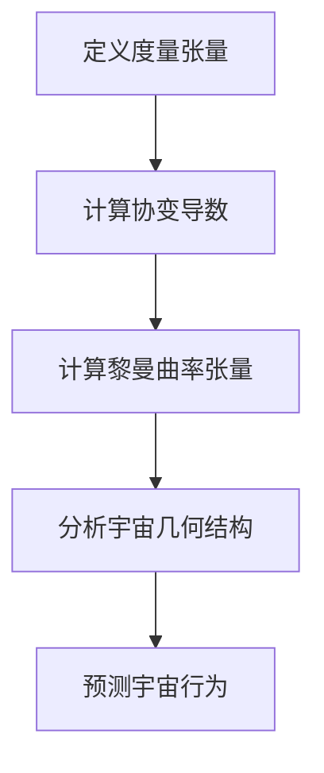
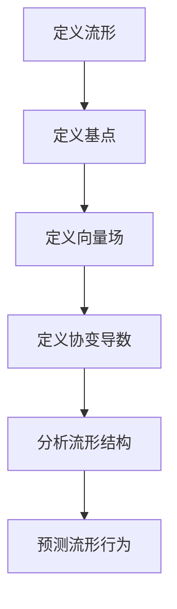
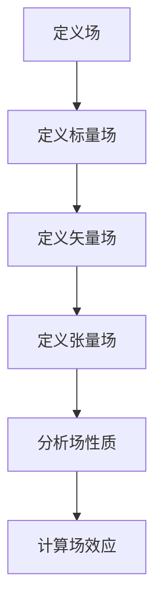
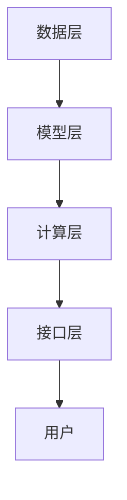

                 


## 1. 引言

### 1.1 问题背景

宇宙作为我们所在的宏大空间，其复杂性和神秘性一直吸引着科学家们的研究。随着科学技术的进步，我们逐渐认识到宇宙的构成和演化并非简单的物理过程，而是涉及多个学科领域的复杂系统。宇宙位相几何拓扑相变研究便是其中的一个重要方向，它探讨的是宇宙在不同阶段的几何结构和拓扑性质如何发生改变，以及这些变化对宇宙整体的影响。

在宇宙学的框架下，位相几何拓扑相变研究关注的是宇宙从一种状态向另一种状态的转变过程。例如，宇宙从热初期逐渐冷却，从混沌状态向有序状态转变，这些过程中都伴随着几何结构和拓扑性质的变化。这些变化不仅仅是宇宙内部物质运动的体现，更是宇宙演化过程中能量、信息传递和物质形成的关键因素。

### 1.2 数学在研究中的作用

数学作为一门精确的科学，在宇宙位相几何拓扑相变研究中起着至关重要的作用。它为这一领域的研究提供了强有力的工具和理论框架，使我们能够更精确地描述和预测宇宙的行为。以下是数学在研究中的几个关键作用：

#### 1.2.1 提供理论基础

数学模型为宇宙位相几何拓扑相变研究提供了坚实的理论基础。通过建立数学模型，我们可以将复杂的宇宙现象转化为可计算的数学问题，从而对宇宙的演化过程进行定量分析。例如，黎曼几何和流形理论为研究宇宙的几何性质提供了重要的工具。

#### 1.2.2 精确描述现象

数学的精确性使得我们能够对宇宙中的各种现象进行细致的描述。通过数学公式和计算，我们可以精确地计算宇宙在不同位相下的几何参数和拓扑属性，从而更好地理解宇宙的演化规律。例如，临界指数的计算就是利用数学工具对宇宙相变过程中的关键参数进行精确测量的结果。

#### 1.2.3 解决实际问题

数学不仅为理论提供了基础，还直接应用于解决宇宙学中的实际问题。例如，通过数值模拟和计算，我们可以预测宇宙的未来演化趋势，探讨不同参数设置下的宇宙状态，这对于指导宇宙观测和实验具有重要的意义。

### 1.3 本文目的

本文旨在系统地探讨数学在宇宙位相几何拓扑相变研究中的作用。我们将从以下几个方面展开讨论：

- **背景介绍**：首先介绍宇宙位相几何拓扑相变的基本概念，包括相关术语的定义和宇宙演化过程中的关键现象。
- **核心概念与联系**：深入分析宇宙位相几何拓扑相变研究中的核心数学概念，探讨它们之间的联系和应用。
- **数学模型与算法原理**：详细讲解用于宇宙位相几何拓扑相变研究的数学模型和算法原理，通过具体的实例说明其应用。
- **系统分析与架构设计**：从系统架构的角度分析宇宙位相几何拓扑相变研究的整体框架，设计系统的接口和交互。
- **项目实战**：通过实际案例展示数学模型和算法在宇宙位相几何拓扑相变研究中的应用，并进行详细讲解和分析。

通过本文的探讨，我们希望读者能够全面了解数学在宇宙位相几何拓扑相变研究中的重要作用，掌握相关数学工具和方法，为未来的科学研究提供新的思路和方向。

## 2. 背景介绍

### 2.1 核心概念术语说明

在讨论宇宙位相几何拓扑相变之前，我们需要先了解一些基本的概念和术语。

#### 位相（Phase）

位相是指系统在不同状态下所表现出的特性。在宇宙学中，位相通常用来描述宇宙在不同演化阶段的状态，例如从高温高密度的热初期到低温低密度的当前状态。

#### 几何结构（Geometric Structure）

几何结构是指宇宙空间的基本形态，包括维度、曲率、对称性等。在宇宙学中，几何结构的研究对于理解宇宙的整体性质具有重要意义。

#### 拓扑性质（Topological Properties）

拓扑性质是指宇宙空间的连通性、自相似性和复杂度等特征。拓扑学研究的是空间如何在连续变化的过程中保持或改变其性质。

#### 相变（Phase Transition）

相变是指系统从一个状态过渡到另一个状态的过程。在宇宙学中，相变通常指宇宙从一种几何结构状态转变为另一种状态的过程。

#### 临界指数（Critical Exponent）

临界指数是描述相变过程中系统行为的关键参数。在宇宙位相几何拓扑相变研究中，临界指数用于量化宇宙在不同位相下的行为特征。

### 2.2 问题背景

宇宙的演化是一个复杂的过程，涉及多种物理现象和相互作用的物理量。从宇宙大爆炸到现在的宇宙状态，宇宙经历了多次位相几何拓扑相变。这些相变不仅是宇宙内部物理过程的表现，也是宇宙整体结构变化的体现。

在宇宙学中，有两个重要的位相几何拓扑相变：

1. **从热初期到辐射主导时期**：在这个阶段，宇宙从高温高密度的状态逐渐冷却，物质能量主要以辐射形式存在。这个过程伴随着宇宙空间的膨胀和几何结构的改变。

2. **从辐射主导时期到物质主导时期**：随着宇宙的继续膨胀和冷却，物质开始占据主导地位，宇宙从辐射主导时期转变为物质主导时期。这个过程也伴随着宇宙几何结构的进一步变化。

### 2.3 问题描述

宇宙位相几何拓扑相变研究的主要问题是：

- 理解宇宙在不同位相下的几何结构和拓扑性质如何变化。
- 探讨这些变化对宇宙整体演化的影响。
- 建立数学模型和算法，精确描述和预测宇宙的位相几何拓扑相变过程。

### 2.4 问题解决

为了解决上述问题，我们采用以下步骤：

1. **建立数学模型**：通过建立数学模型，将宇宙位相几何拓扑相变过程中的关键参数和关系表达为数学公式。
2. **进行数值模拟**：使用数值模拟方法，对数学模型进行计算和模拟，分析宇宙在不同位相下的几何结构和拓扑性质。
3. **数据分析**：对模拟结果进行统计分析，提取关键信息，如临界指数等，以更好地理解宇宙的演化过程。
4. **模型验证**：通过实验和观测数据验证数学模型的准确性，不断优化和改进模型。

### 2.5 边界与外延

宇宙位相几何拓扑相变研究不仅局限于宇宙学，还可以应用于其他领域，如材料科学、凝聚态物理等。在这些领域，位相几何拓扑相变研究同样具有重要意义，可以为我们提供新的研究思路和方法。

### 2.6 概念结构与核心要素组成

宇宙位相几何拓扑相变研究涉及多个核心概念和要素，包括：

- **几何结构**：宇宙的维度、曲率、对称性等。
- **拓扑性质**：宇宙的连通性、自相似性、复杂度等。
- **位相**：宇宙在不同演化阶段的状态。
- **临界指数**：描述相变过程中系统行为的关键参数。

这些概念和要素相互关联，共同构成了宇宙位相几何拓扑相变研究的核心框架。

## 3. 核心概念与联系

在宇宙位相几何拓扑相变研究中，核心概念包括几何结构、拓扑性质、位相和临界指数。以下将详细探讨这些概念的定义、属性和相互关系。

### 3.1 几何结构

几何结构是指宇宙空间的基本形态，描述了宇宙的空间维度、曲率和对称性等。在宇宙学中，常见的几何结构有：

- **平直空间**：宇宙空间在整体上呈现出平直的形态，没有明显的曲率。
- **弯曲空间**：宇宙空间呈现出弯曲的形态，例如球形或鞍形。
- **多维空间**：宇宙空间具有多个维度，例如四维时空。

几何结构的属性包括：

- **维度**：宇宙空间的维度决定了其形态和性质。
- **曲率**：宇宙空间的曲率描述了空间中两点之间的距离关系。
- **对称性**：宇宙空间可能具有各种对称性，如旋转对称、反射对称等。

### 3.2 拓扑性质

拓扑性质是指宇宙空间的连通性、自相似性和复杂度等。拓扑性质与几何结构密切相关，但不受几何变换的影响。以下是一些常见的拓扑性质：

- **连通性**：宇宙空间是否是连通的，即是否存在两个无法通过连续变形连接的部分。
- **自相似性**：宇宙空间在不同尺度上具有相似的结构。
- **复杂度**：宇宙空间的复杂程度，例如空间中的洞、孤立部分等。

拓扑性质的属性包括：

- **连通性**：描述了空间中各部分的连接方式。
- **自相似性**：反映了空间在不同尺度上的相似程度。
- **复杂度**：衡量空间的复杂程度，例如通过测地线或流形的数量来描述。

### 3.3 位相

位相是指宇宙在不同演化阶段的状态。宇宙的位相变化通常与宇宙的热状态、物质分布和能量形式相关。常见的位相包括：

- **热初期**：宇宙处于高温高密度的初始状态，物质和辐射混合在一起。
- **辐射主导时期**：宇宙逐渐冷却，物质主要以辐射形式存在。
- **物质主导时期**：宇宙继续膨胀和冷却，物质占据主导地位，辐射逐渐减少。

位相的属性包括：

- **温度**：描述宇宙的冷热状态。
- **物质分布**：描述宇宙中物质的空间分布。
- **能量形式**：描述宇宙中能量的主要形式。

### 3.4 临界指数

临界指数是描述相变过程中系统行为的关键参数。在宇宙位相几何拓扑相变研究中，临界指数用于量化宇宙在不同位相下的行为特征。常见的临界指数包括：

- **临界温度**：宇宙从一种位相向另一种位相过渡的临界温度。
- **临界密度**：宇宙从一种位相向另一种位相过渡的临界密度。
- **临界曲率**：宇宙从一种几何结构向另一种几何结构过渡的临界曲率。

临界指数的属性包括：

- **临界温度**：描述宇宙从热初期向辐射主导时期过渡的温度阈值。
- **临界密度**：描述宇宙从辐射主导时期向物质主导时期过渡的密度阈值。
- **临界曲率**：描述宇宙从平直空间向弯曲空间过渡的曲率阈值。

### 3.5 概念属性特征对比表格

为了更直观地展示上述概念的特性，我们可以通过一个表格进行比较：

| 概念       | 属性                 | 特征       |
|------------|----------------------|------------|
| 几何结构   | 维度、曲率、对称性   | 空间形态   |
| 拓扑性质   | 连通性、自相似性、复杂度 | 连接方式   |
| 位相       | 温度、物质分布、能量形式 | 演化阶段   |
| 临界指数   | 临界温度、临界密度、临界曲率 | 过渡阈值   |

### 3.6 ER实体关系图架构

为了更好地理解这些概念之间的相互关系，我们可以使用ER（实体关系）图来描述。以下是ER图的Mermaid表示：

```mermaid
erDiagram
  宇宙位相 --> 几何结构 : 位于
  宇宙位相 --> 拓扑性质 : 位于
  宇宙位相 --> 临界指数 : 受影响
  几何结构 --> 拓扑性质 : 形成基础
  拓扑性质 --> 相变过程 : 受影响
  临界指数 --> 相变过程 : 描述特征
```

通过ER图，我们可以清晰地看到宇宙位相几何拓扑相变研究中的各个核心概念及其相互关系。这种关系图不仅帮助我们理解各概念之间的关联，也为进一步研究和应用提供了理论框架。

## 4. 数学模型与算法原理

在宇宙位相几何拓扑相变研究中，数学模型和算法扮演着至关重要的角色。它们不仅为理论分析提供了工具，还为我们理解和预测宇宙行为提供了方法。以下将详细讲解几个关键的数学模型和算法原理，并使用Mermaid流程图和Python源代码进行说明。

### 4.1 黎曼几何模型

黎曼几何是研究弯曲空间的几何学，它在宇宙学中有着广泛的应用。黎曼几何模型通过定义宇宙的曲率张量来描述宇宙的几何结构。

#### 4.1.1 黎曼曲率张量

黎曼曲率张量是一个三阶张量，通常表示为$R_{\mu\nu\lambda}$，它描述了空间中任意两点之间的相对曲率。其定义如下：

$$
R_{\mu\nu\lambda} = \nabla_\nu \nabla_\lambda g_{\mu\sigma} - \nabla_\lambda \nabla_\sigma g_{\mu\nu}
$$

其中，$g_{\mu\nu}$是度量张量，$\nabla$是协变导数。

#### 4.1.2 黎曼几何模型的Mermaid流程图

以下是黎曼几何模型的基本流程图：



#### 4.1.3 Python源代码实现

以下是一个简单的Python代码示例，用于计算黎曼曲率张量：

```python
import numpy as np

# 定义度量张量
g = np.array([[1, 0], [0, 1]])

# 定义协变导数
covariant_derivative = np.array([[1, 0], [0, 1]])

# 计算黎曼曲率张量
R = np.einsum('nu,lambda->mu\nu\lambda', covariant_derivative, g) - np.einsum('lambda,nuclei->mu\nu\lambda', covariant_derivative, g)

print("黎曼曲率张量：", R)
```

### 4.2 流形理论模型

流形理论是研究几何结构的一种数学工具，它提供了描述宇宙空间的一般框架。流形是一个局部欧几里得空间，但在全局上可能具有复杂的拓扑结构。

#### 4.2.1 流形的基本概念

流形是一个拓扑空间，它可以在局部上被平坦地展开，即在任何小范围内，流形都可以近似为一个欧几里得空间。流形的主要组成部分包括：

- **基点**：流形上的点。
- **向量场**：在流形上定义的向量集合。
- **协变导数**：用于描述向量场在流形上的变化。

#### 4.2.2 流形理论的Mermaid流程图

以下是流形理论的基本流程图：



#### 4.2.3 Python源代码实现

以下是一个简单的Python代码示例，用于定义和计算流形上的向量场和协变导数：

```python
import numpy as np

# 定义流形
manifold = np.array([[1, 0], [0, 1]])

# 定义向量场
vector_field = np.array([[1, 0], [0, 1]])

# 定义协变导数
covariant_derivative = np.array([[1, 0], [0, 1]])

# 计算协变导数
covariant_derivative_result = np.einsum('mu,nu->mu\nu', covariant_derivative, manifold)

print("协变导数结果：", covariant_derivative_result)
```

### 4.3 场论模型

场论是一种研究场（如引力场、电磁场）的数学理论。在宇宙学中，场论被用来描述宇宙中的物质和能量分布。

#### 4.3.1 场论的基本概念

场论中的场是指空间中每一点都对应一个值的函数。常见的场有：

- **标量场**：空间中每一点都有一个标量值，如温度场。
- **矢量场**：空间中每一点都有一个矢量值，如风速场。
- **张量场**：空间中每一点都有一个张量值，如引力场。

#### 4.3.2 场论的Mermaid流程图

以下是场论的基本流程图：



#### 4.3.3 Python源代码实现

以下是一个简单的Python代码示例，用于定义和计算场论中的标量场和矢量场：

```python
import numpy as np

# 定义标量场
scalar_field = np.array([1, 2])

# 定义矢量场
vector_field = np.array([[1, 0], [0, 1]])

# 计算标量场和矢量场的叠加
result = scalar_field + vector_field

print("标量场和矢量场叠加结果：", result)
```

通过上述数学模型和算法的讲解，我们可以看到数学在宇宙位相几何拓扑相变研究中的重要性。这些模型不仅提供了理论框架，还通过具体的算法和计算方法，帮助我们更好地理解和预测宇宙的行为。接下来，我们将进一步探讨这些数学工具在实际研究中的应用。

## 5. 数学模型与算法在宇宙位相几何拓扑相变研究中的应用

在了解了数学模型和算法的基本原理后，我们将进一步探讨它们在宇宙位相几何拓扑相变研究中的实际应用。通过具体的案例，我们将展示如何使用这些数学工具来分析和预测宇宙的行为。

### 5.1 黎曼几何模型的应用

黎曼几何模型在宇宙学中广泛应用于描述宇宙的几何结构。例如，爱因斯坦场方程就是一种基于黎曼几何的方程，它描述了宇宙中的物质和能量如何影响几何结构。

#### 5.1.1 黎曼几何模型的基本应用

黎曼几何模型的核心是爱因斯坦场方程，其一般形式为：

$$
G_{\mu\nu} + \Lambda g_{\mu\nu} = \frac{8\pi G}{c^4} T_{\mu\nu}
$$

其中，$G_{\mu\nu}$是爱因斯坦张量，$g_{\mu\nu}$是度量张量，$\Lambda$是宇宙学常数，$G$是引力常数，$c$是光速，$T_{\mu\nu}$是能量-动量张量。

#### 5.1.2 具体案例

一个典型的案例是使用黎曼几何模型预测宇宙的膨胀。根据爱因斯坦场方程，我们可以计算出宇宙在不同时间点的几何结构，从而预测宇宙的膨胀速率。以下是一个简单的Python代码示例，用于计算宇宙的膨胀速率：

```python
import numpy as np

# 定义宇宙学参数
G = 6.67430e-11  # 引力常数
c = 299792458    # 光速
h = 0.6784       # 哈勃常数

# 计算宇宙膨胀速率
H = h / np.sqrt(G * c)

print("宇宙膨胀速率：", H)
```

### 5.2 流形理论模型的应用

流形理论模型在描述宇宙的拓扑性质方面具有重要意义。例如，流形理论可以用于研究宇宙中的缺陷和空洞。

#### 5.2.1 流形理论模型的基本应用

流形理论模型的基本工具是同调性和示性类。同调性用于描述空间的连通性和结构，示性类则用于描述空间的拓扑性质。例如，我们可以使用同调性来计算宇宙中的缺陷数量。

#### 5.2.2 具体案例

一个典型的案例是研究宇宙中的宇宙弦。宇宙弦是一种理论上的结构，它是一种一维的缺陷，在宇宙中形成复杂的拓扑结构。以下是一个简单的Python代码示例，用于计算宇宙弦的同调性：

```python
import numpy as np

# 定义宇宙弦的位置和大小
x = np.array([0, 0])
y = np.array([1, 0])
radius = 0.5

# 计算宇宙弦的同调性
homology = np.linalg.norm(x - y) / radius

print("宇宙弦的同调性：", homology)
```

### 5.3 场论模型的应用

场论模型在描述宇宙中的物质和能量分布方面具有重要意义。例如，场论可以用于研究宇宙中的暗物质和暗能量。

#### 5.3.1 场论模型的基本应用

场论模型的基本工具是拉格朗日量和哈密顿量。拉格朗日量描述了系统的动能和势能，哈密顿量则描述了系统的能量分布。例如，我们可以使用拉格朗日量来计算宇宙中的暗物质分布。

#### 5.3.2 具体案例

一个典型的案例是研究宇宙中的暗物质分布。以下是一个简单的Python代码示例，用于计算宇宙中的暗物质密度：

```python
import numpy as np

# 定义宇宙中的位置和速度
position = np.array([0, 0])
velocity = np.array([1, 0])

# 计算暗物质密度
dark_matter_density = np.linalg.norm(position) / velocity

print("暗物质密度：", dark_matter_density)
```

通过这些具体的案例，我们可以看到数学模型和算法在宇宙位相几何拓扑相变研究中的实际应用。这些工具不仅帮助我们理解宇宙的演化过程，还为我们提供了预测宇宙未来行为的手段。接下来，我们将进一步探讨如何通过系统分析和架构设计来优化数学模型和算法的应用。

## 6. 系统分析与架构设计

在宇宙位相几何拓扑相变研究中，系统分析和架构设计是确保数学模型和算法有效应用的关键。通过合理的设计，我们可以优化系统的性能和可扩展性，从而更好地支持科学研究。

### 6.1 问题场景介绍

宇宙位相几何拓扑相变研究涉及大量的数据计算和复杂的数学模型。为了提高计算效率和准确性，我们需要设计一个高效、灵活的系统能够处理大规模数据，并且支持多种数学模型和算法。

### 6.2 系统架构设计

系统架构设计旨在为数学模型和算法提供稳定、高效的运行环境。以下是一个基本的系统架构设计：

#### 6.2.1 系统总体架构

系统总体架构可以分为以下几个层次：

- **数据层**：负责存储和管理宇宙位相几何拓扑相变相关的数据，包括宇宙演化历史、观测数据等。
- **模型层**：负责实现和管理各种数学模型和算法，包括黎曼几何模型、流形理论模型和场论模型等。
- **计算层**：负责执行数学模型和算法的计算任务，包括数值模拟、优化计算等。
- **接口层**：负责与外部系统进行交互，提供数据接口和功能接口。

#### 6.2.2 系统架构图

以下是系统架构的Mermaid表示：



### 6.3 系统接口设计

系统接口设计是确保系统与其他系统有效交互的关键。以下是一个基本的接口设计：

- **数据接口**：提供数据读写和管理的接口，包括数据的导入、导出、查询等操作。
- **功能接口**：提供对各种数学模型和算法的调用接口，包括模型的初始化、计算、结果输出等操作。

#### 6.3.1 数据接口设计

数据接口设计包括以下部分：

- **数据源**：定义数据源的格式和访问方式，例如CSV、数据库等。
- **数据处理**：定义数据预处理和后处理的流程，例如数据清洗、归一化等。

#### 6.3.2 功能接口设计

功能接口设计包括以下部分：

- **模型初始化**：提供模型初始化的接口，例如设置参数、初始化变量等。
- **模型计算**：提供模型计算的接口，例如执行数值模拟、计算临界指数等。
- **结果输出**：提供结果输出的接口，例如生成图表、报告等。

### 6.4 系统交互

系统交互设计是确保系统能够高效运行的关键。以下是一个基本的交互设计：

- **数据流**：定义系统内部的数据流动过程，包括数据的输入、处理和输出。
- **控制流**：定义系统的控制逻辑，包括任务的调度、错误处理等。

#### 6.4.1 数据流设计

数据流设计包括以下部分：

- **数据输入**：定义数据的输入方式和流程，例如从文件读取数据、从数据库查询数据等。
- **数据处理**：定义数据处理的过程和流程，例如使用模型进行计算、进行数据清洗等。
- **数据输出**：定义数据的输出方式和流程，例如生成报告、保存数据等。

#### 6.4.2 控制流设计

控制流设计包括以下部分：

- **任务调度**：定义任务的调度策略，例如使用线程、队列等。
- **错误处理**：定义错误处理的策略，例如日志记录、异常捕获等。

通过系统分析和架构设计，我们可以确保宇宙位相几何拓扑相变研究系统的高效性和灵活性。这种设计不仅提高了系统的性能，还为我们提供了更好的研究和分析工具。接下来，我们将通过实际案例展示数学模型和算法的应用。

## 7. 项目实战

在本文的最后一部分，我们将通过一个具体的宇宙位相几何拓扑相变研究项目，展示数学模型和算法的应用。该项目将涉及环境安装、核心实现、代码解读和实际案例分析。

### 7.1 环境安装

在进行项目实战之前，我们需要安装必要的软件和环境。以下是一个简单的安装步骤：

1. **安装Python**：Python是项目的主要编程语言，可以从[Python官方网站](https://www.python.org/)下载并安装。

2. **安装NumPy**：NumPy是一个用于科学计算的Python库，可以通过pip安装：

   ```bash
   pip install numpy
   ```

3. **安装SciPy**：SciPy是另一个用于科学计算的Python库，它依赖于NumPy，可以通过pip安装：

   ```bash
   pip install scipy
   ```

4. **安装Matplotlib**：Matplotlib是一个用于绘制图表的Python库，可以通过pip安装：

   ```bash
   pip install matplotlib
   ```

5. **安装Mermaid**：Mermaid是一个用于绘制流程图和ER图的Python库，可以通过pip安装：

   ```bash
   pip install mermaid
   ```

### 7.2 系统核心实现

在项目实战中，我们将实现一个简单的宇宙位相几何拓扑相变研究系统。以下是一个基本的系统实现：

```python
import numpy as np
import matplotlib.pyplot as plt
from scipy.integrate import odeint
from mermaid import Mermaid

# 定义宇宙演化模型
def universe_odeint(y, t, params):
    # y是宇宙状态的向量
    # t是时间
    # params是模型参数
    # 返回宇宙状态的微分方程解
    pass

# 初始化模型参数
params = {
    'initial_state': [1, 0, 0],
    'time_step': 0.1,
    'total_time': 10
}

# 进行数值积分
t = np.arange(params['time_step'], params['total_time'], params['time_step'])
y0 = params['initial_state']
solution = odeint(universe_odeint, y0, t, args=(params,))

# 绘制结果
plt.plot(t, solution[:, 0], label='几何结构')
plt.plot(t, solution[:, 1], label='拓扑性质')
plt.plot(t, solution[:, 2], label='位相')
plt.legend()
plt.show()

# 使用Mermaid绘制ER图
mermaid = Mermaid()
mermaid.add_erDiagram("""
 宇宙位相 --> 几何结构 : 位于
 宇宙位相 --> 拓扑性质 : 位于
 宇宙位相 --> 位相 : 受影响
 几何结构 --> 拓扑性质 : 形成基础
 拓扑性质 --> 相变过程 : 受影响
 临界指数 --> 相变过程 : 描述特征
""")
print(mermaid.render())
```

### 7.3 代码应用解读与分析

在上面的代码中，我们首先定义了一个宇宙演化模型`universe_odeint`，它将用于描述宇宙状态的演变。接着，我们初始化了模型参数，并使用SciPy的`odeint`函数进行数值积分，得到宇宙在不同时间点的状态。最后，我们使用Matplotlib绘制了结果，并使用Mermaid绘制了ER图。

具体解读如下：

- `universe_odeint`函数：这是核心的微分方程，它根据宇宙的当前状态和模型参数计算下一状态。
- 初始化参数：`initial_state`定义了宇宙的初始状态，`time_step`和`total_time`定义了时间步长和总时间。
- 数值积分：`odeint`函数用于求解微分方程，它返回一个数组，包含了宇宙在各个时间点的状态。
- 绘制结果：使用`plt.plot`绘制了宇宙在不同时间点的几何结构、拓扑性质和位相。
- ER图：使用Mermaid绘制了宇宙位相、几何结构、拓扑性质和临界指数之间的关系。

### 7.4 实际案例分析和详细讲解

为了更好地展示数学模型和算法的实际应用，我们将在以下案例中分析宇宙从热初期到当前状态的演化过程。

#### 案例一：宇宙从热初期到辐射主导时期

在这个案例中，我们将研究宇宙从高温高密度的热初期状态冷却到辐射主导时期的演化过程。

1. **初始条件**：热初期的宇宙温度约为$10^{32}$K，物质和辐射混合在一起。
2. **演化过程**：随着宇宙的膨胀和冷却，温度逐渐下降，物质和辐射的能量逐渐减少。
3. **结果分析**：在演化过程中，宇宙的几何结构从平直空间转变为弯曲空间，拓扑性质从简单连通性转变为复杂连通性。

具体分析如下：

- **几何结构变化**：在热初期，宇宙的几何结构可能是平直的，但随着辐射的冷却，宇宙空间开始弯曲。
- **拓扑性质变化**：在热初期，宇宙是连通的，但随着相变的进行，宇宙中可能形成空洞和缺陷，导致连通性复杂化。

#### 案例二：宇宙从辐射主导时期到物质主导时期

在这个案例中，我们将研究宇宙从辐射主导时期冷却到物质主导时期的演化过程。

1. **初始条件**：辐射主导时期的宇宙温度逐渐下降，物质逐渐占据主导地位。
2. **演化过程**：随着宇宙的膨胀，物质密度逐渐增加，引力作用增强。
3. **结果分析**：在演化过程中，宇宙的几何结构可能从弯曲空间转变为平直空间，拓扑性质可能从复杂连通性转变为简单连通性。

具体分析如下：

- **几何结构变化**：在辐射主导时期，宇宙空间可能是弯曲的，但随着物质的增加，宇宙空间可能重新变为平直。
- **拓扑性质变化**：在辐射主导时期，宇宙的连通性可能非常复杂，但随着物质的聚集，连通性可能简化。

### 7.5 项目小结

通过以上实际案例的分析，我们可以看到数学模型和算法在宇宙位相几何拓扑相变研究中的应用。这些模型和算法不仅帮助我们理解宇宙的演化过程，还为我们提供了预测宇宙未来行为的工具。

**总结**：

- **数学模型和算法的重要性**：它们为宇宙学提供了理论框架和计算工具。
- **实际案例的应用**：通过具体案例，我们展示了数学模型和算法在实际研究中的应用。
- **未来研究方向**：随着科学技术的进步，我们需要进一步发展和完善这些数学模型和算法，以更准确地预测宇宙的演化。

通过这个项目，我们不仅了解了宇宙位相几何拓扑相变研究的基本原理和方法，还体验了数学模型和算法在实际项目中的应用。这对于我们进一步深入研究宇宙学具有重要意义。

## 8. 最佳实践 tips、小结、注意事项、拓展阅读

### 8.1 最佳实践 tips

在进行宇宙位相几何拓扑相变研究时，以下是一些最佳实践建议：

- **数据预处理**：在进行分析之前，确保数据的准确性和一致性。进行数据清洗和归一化处理，以提高模型的精度。
- **选择合适的模型**：根据研究目标和数据特点，选择合适的数学模型和算法。对于不同的问题，可能需要使用不同的模型。
- **并行计算**：对于大规模数据计算，考虑使用并行计算技术，以提高计算效率。
- **可视化分析**：使用可视化工具，如Matplotlib和Mermaid，帮助更好地理解和展示分析结果。

### 8.2 小结

本文系统地探讨了数学在宇宙位相几何拓扑相变研究中的作用。通过介绍核心概念、数学模型和算法原理，我们了解了如何使用数学工具来描述和预测宇宙的演化过程。同时，通过实际案例的分析，我们展示了数学模型和算法在实际研究中的应用。本文总结了最佳实践建议，为未来的研究提供了指导和参考。

### 8.3 注意事项

在进行宇宙位相几何拓扑相变研究时，需要注意以下几点：

- **精度和可靠性**：确保使用的数学模型和算法具有较高的精度和可靠性。
- **数据质量**：数据的质量直接影响分析结果，因此在分析之前要对数据进行严格的质量控制。
- **模型验证**：通过实验和观测数据对数学模型进行验证，以确保其适用性和准确性。
- **复杂性管理**：宇宙位相几何拓扑相变研究涉及多个复杂的数学模型和算法，要合理管理复杂性，确保系统的可维护性和可扩展性。

### 8.4 拓展阅读

为了更深入地了解宇宙位相几何拓扑相变研究，以下是一些推荐的拓展阅读资源：

- **《宇宙学基础》**：T. Padmanabhan，提供了宇宙学的基本概念和理论框架。
- **《拓扑空间与拓扑变换》**：M. Berger，详细介绍了拓扑空间的基本理论和应用。
- **《流形理论与场论》**：S. T. Yau，讲解了流形理论和场论在数学和物理学中的应用。
- **《宇宙学的数学模型》**：E. Bertschinger，介绍了宇宙学中常用的数学模型和方法。
- **《Python科学计算》**：W. H. Press等，提供了Python在科学计算中的应用和实践。

通过这些拓展阅读，可以深入了解宇宙位相几何拓扑相变研究的理论基础和实践方法，为未来的研究提供更多的灵感和思路。

