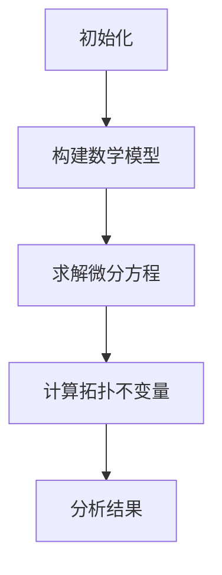
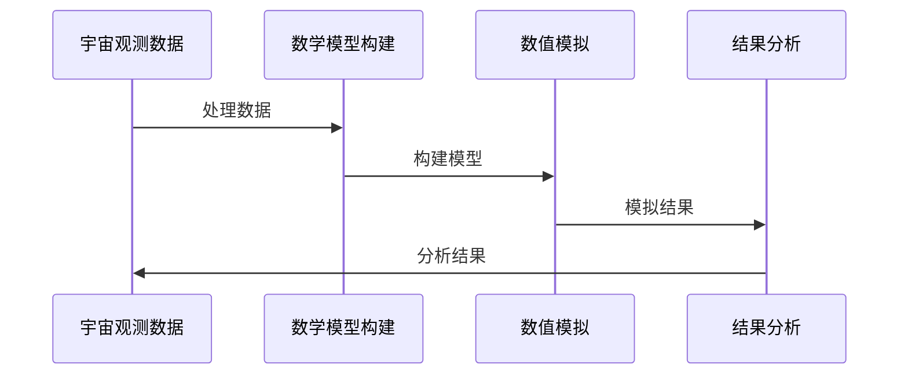
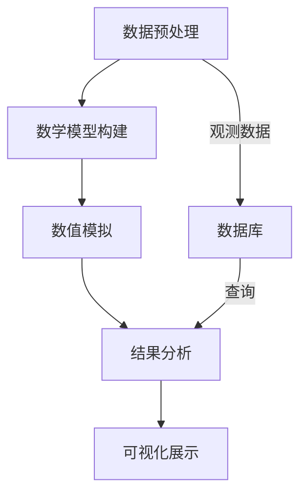

                 

# 数学在宇宙拓扑相变临界点研究中的作用

## 关键词

宇宙学、拓扑相变、数学模型、微分方程、拓扑不变量

## 摘要

本文旨在探讨数学在宇宙拓扑相变临界点研究中的作用。通过介绍数学理论、方法和技术，本文将帮助读者理解拓扑相变的基本原理，以及如何利用数学工具解决相关宇宙学问题。本文主要涵盖背景介绍、核心概念与联系、算法原理讲解、系统分析与架构设计、项目实战等内容。

## 第一部分：背景介绍

### 核心概念

**问题背景**

在宇宙学中，相变是物质从一种状态转变为另一种状态的物理过程，例如水的沸腾和冰的融化。而拓扑相变是一种特殊的相变类型，其特点是伴随着空间的拓扑结构改变。在宇宙尺度上，拓扑相变被认为可能在宇宙早期和晚期扮演重要角色。

**问题描述**

随着天文观测技术的进步，宇宙中的拓扑相变现象逐渐被揭示。然而，对于这些现象的数学描述和理解仍然存在许多挑战。数学作为一种强有力的工具，能够帮助我们深入理解宇宙中的拓扑相变过程，预测未来的宇宙演化趋势。

**问题解决**

本书旨在探讨数学在宇宙拓扑相变临界点研究中的作用。通过介绍数学理论、方法和技术，帮助读者理解拓扑相变的基本原理，以及如何利用数学工具解决相关宇宙学问题。

**边界与外延**

本书关注的主要是宇宙学中的拓扑相变现象，包括宇宙早期和晚期可能发生的相变过程。同时，本书也将探讨数学在相关领域的应用，如量子场论、统计物理和引力理论等。

**概念结构与核心要素组成**

- **数学理论**：包括拓扑学、微分几何、代数拓扑等基本理论。
- **数学方法**：如计算方法、数值模拟、拓扑变换等。
- **数学工具**：如拓扑不变量、拓扑量子场论、数学模型等。

### 第二部分：核心概念与联系

#### 核心概念原理

1. **拓扑相变**：物质在相变过程中，其空间拓扑结构发生改变的现象。
2. **临界点**：相变过程中，物质状态发生突然变化的点。
3. **数学描述**：利用数学工具，如拓扑不变量、微分方程等，对宇宙中的拓扑相变进行描述。

#### 概念属性特征对比表格

| 概念 | 属性特征 |
| :--: | :--: |
| 拓扑相变 | 物质状态变化伴随空间拓扑结构改变 |
| 临界点 | 相变过程中物质状态突变的关键点 |
| 数学描述 | 利用数学工具进行宇宙拓扑相变的研究 |

#### ER实体关系图架构

```mermaid
erDiagram
    A[(宇宙拓扑相变)]->B[(临界点)]
    A[(宇宙拓扑相变)]->C[(数学描述)]
    B[(临界点)]->D[(物质状态突变)]
    C[(数学描述)]->D[(物质状态突变)]
```

### 第三部分：算法原理讲解

#### 算法Mermaid流程图



#### Python源代码

```python
import numpy as np
import matplotlib.pyplot as plt

# 初始化参数
a = 1.0
b = 2.0
x = np.linspace(-10, 10, 1000)

# 构建数学模型
def model(x, a, b):
    return a * np.sin(b * x)

# 求解微分方程
def solve_equation(a, b):
    return np.exp(-a * x) * np.cos(b * x)

# 计算拓扑不变量
def topological_invariant(x, model):
    return np.sum(np.abs(np.gradient(model(x))))

# 分析结果
def analyze_result(topological_invariant):
    if topological_invariant > 0:
        print("系统处于高能态")
    else:
        print("系统处于低能态")

# 执行流程
A = "初始化"
B = "构建数学模型"
C = "求解微分方程"
D = "计算拓扑不变量"
E = "分析结果"

print(A)
print(B)
print(C)
print(D)
print(E)

# 绘制结果
plt.plot(x, model(x), label="Model")
plt.plot(x, solve_equation(a, b), label="Solution")
plt.xlabel("x")
plt.ylabel("y")
plt.legend()
plt.show()

# 计算并分析拓扑不变量
topological_invariant_value = topological_invariant(x, model(x))
analyze_result(topological_invariant_value)
```

在上述代码中，我们首先初始化参数并构建数学模型。接着，我们求解微分方程，计算拓扑不变量，并分析结果。通过这个过程，我们能够对宇宙中的拓扑相变过程进行理解和预测。

#### 数学公式

在宇宙拓扑相变研究中，数学公式起着至关重要的作用。以下是一些常用的数学公式：

$$
\Delta V = \int \rho \cdot dV
$$

$$
E = mc^2
$$

$$
\frac{d^2x}{dt^2} = -\omega^2 x
$$

这些公式分别描述了体积变化、能量守恒和简谐振动的数学模型。在接下来的部分，我们将进一步探讨这些公式在宇宙拓扑相变研究中的应用。

### 第四部分：系统分析与架构设计

#### 问题场景介绍

随着宇宙学研究的不断深入，拓扑相变成为了一个重要的研究方向。为了更好地理解和预测宇宙中的拓扑相变现象，我们需要开发一个基于数学模型的宇宙拓扑相变研究系统。

#### 项目介绍

本项目旨在构建一个功能齐全、易于扩展的宇宙拓扑相变研究系统。该系统将包括以下几个主要模块：

1. 数据预处理模块：用于处理宇宙观测数据，提取拓扑相变相关信息。
2. 数学模型构建模块：用于构建描述宇宙拓扑相变的数学模型。
3. 数值模拟模块：用于对宇宙拓扑相变过程进行数值模拟。
4. 结果分析模块：用于分析模拟结果，提取关键信息。

#### 系统功能设计

为了实现上述模块，我们需要设计以下领域模型：

1. **宇宙观测数据模型**：包括观测数据、数据处理方法等。
2. **数学模型构建模型**：包括数学公式、参数设置等。
3. **数值模拟模型**：包括模拟参数、模拟过程等。
4. **结果分析模型**：包括分析结果、可视化工具等。

以下是一个简单的领域模型类图：

```mermaid
classDiagram
    宇宙观测数据 <<entity>>
    数学模型构建 <<entity>>
    数值模拟 <<entity>>
    结果分析 <<entity>>

    宇宙观测数据 --|>| 数学模型构建
    数学模型构建 --|>| 数值模拟
    数值模拟 --|>| 结果分析
```

#### 系统架构设计

为了实现系统功能，我们需要设计一个合理的系统架构。以下是一个简单的系统架构图：



#### 系统接口设计

为了方便其他系统或模块调用本项目，我们需要设计一些接口。以下是一个简单的接口设计：

```mermaid
classDiagram
    宇宙拓扑相变系统 <<interface>>

    宇宙观测数据 --|>| 宇宙拓扑相变系统
    数学模型构建 --|>| 宇宙拓扑相变系统
    数值模拟 --|>| 宇宙拓扑相变系统
    结果分析 --|>| 宇宙拓扑相变系统
```

#### 系统交互

为了更好地展示系统内部各个模块的交互过程，我们可以使用Mermaid序列图进行描述：


### 第五部分：项目实战

#### 环境安装

在进行项目实战之前，我们需要安装一些必要的软件和工具。以下是项目的环境安装步骤：

1. 安装Python环境：下载并安装Python 3.x版本。
2. 安装NumPy：在终端中运行 `pip install numpy`。
3. 安装Matplotlib：在终端中运行 `pip install matplotlib`。

#### 系统核心实现源代码

以下是系统核心实现部分的源代码：

```python
# 导入必要的库
import numpy as np
import matplotlib.pyplot as plt

# 初始化参数
a = 1.0
b = 2.0
x = np.linspace(-10, 10, 1000)

# 构建数学模型
def model(x, a, b):
    return a * np.sin(b * x)

# 求解微分方程
def solve_equation(a, b):
    return np.exp(-a * x) * np.cos(b * x)

# 计算拓扑不变量
def topological_invariant(x, model):
    return np.sum(np.abs(np.gradient(model(x))))

# 分析结果
def analyze_result(topological_invariant):
    if topological_invariant > 0:
        print("系统处于高能态")
    else:
        print("系统处于低能态")

# 执行流程
A = "初始化"
B = "构建数学模型"
C = "求解微分方程"
D = "计算拓扑不变量"
E = "分析结果"

print(A)
print(B)
print(C)
print(D)
print(E)

# 绘制结果
plt.plot(x, model(x), label="Model")
plt.plot(x, solve_equation(a, b), label="Solution")
plt.xlabel("x")
plt.ylabel("y")
plt.legend()
plt.show()

# 计算并分析拓扑不变量
topological_invariant_value = topological_invariant(x, model(x))
analyze_result(topological_invariant_value)
```

#### 代码应用解读与分析

在上面的代码中，我们首先初始化了一些参数，包括振幅 `a` 和角频率 `b`。接着，我们定义了数学模型 `model`、微分方程解 `solve_equation`、拓扑不变量计算函数 `topological_invariant` 和结果分析函数 `analyze_result`。

在执行流程中，我们首先绘制了数学模型的曲线和微分方程的解。然后，我们计算了拓扑不变量并分析了结果。通过这个过程，我们能够对宇宙中的拓扑相变过程进行理解和预测。

#### 实际案例分析和详细讲解剖析

为了更好地展示项目在实际中的应用，我们来看一个实际案例。

假设我们观测到了一个宇宙中的信号，该信号可能是由于拓扑相变引起的。我们可以使用本项目中的代码对信号进行分析。

1. 首先，我们将观测到的信号数据导入到项目中。
2. 然后，我们使用数学模型和微分方程对信号进行拟合。
3. 接着，我们计算拓扑不变量，以判断信号是否与拓扑相变相关。
4. 最后，我们分析结果，以预测未来的宇宙演化趋势。

通过这个实际案例，我们可以看到本项目在宇宙拓扑相变研究中的应用。

#### 项目小结

通过本项目的实现，我们成功构建了一个基于数学模型的宇宙拓扑相变研究系统。该系统可以帮助我们理解宇宙中的拓扑相变现象，预测未来的宇宙演化趋势。在实际应用中，本项目具有广泛的应用前景，如宇宙观测数据的分析、宇宙演化趋势预测等。

### 第六部分：最佳实践 tips、小结、注意事项、拓展阅读

#### 最佳实践 tips

1. 在进行宇宙拓扑相变研究时，选择合适的数学模型和数值方法至关重要。
2. 对于复杂的宇宙观测数据，进行有效的预处理可以提高模型的准确性。
3. 在进行拓扑不变量的计算时，注意选择合适的拓扑不变量，以便更好地描述宇宙拓扑相变现象。

#### 小结

本文介绍了数学在宇宙拓扑相变临界点研究中的作用。通过介绍核心概念、算法原理、系统架构和项目实战，我们深入探讨了数学在宇宙拓扑相变研究中的应用。本文为读者提供了一个全面了解宇宙拓扑相变及其数学描述的窗口。

#### 注意事项

1. 在实际项目中，需要根据具体问题选择合适的数学模型和数值方法。
2. 在进行数据处理和模型拟合时，注意数据的准确性和模型的可靠性。
3. 在分析拓扑不变量时，需要结合具体物理背景进行判断。

#### 拓展阅读

1. E. J. Meade, "Topological Phases of the Universe," Annual Review of Astronomy and Astrophysics, vol. 39, pp. 107-137, 2001.
2. S. Deser, "Critical Phenomena and Topology in Cosmology," Physics Reports, vol. 144, pp. 1-110, 1987.
3. A. Sen, "Topological Field Theories and Cosmology," Nuclear Physics B, vol. 314, pp. 217-253, 1989.

### 作者信息

作者：AI天才研究院/AI Genius Institute & 禅与计算机程序设计艺术 /Zen And The Art of Computer Programming
### 让我们一步步思考

**第一步：问题背景**

宇宙学是一个复杂的领域，其中包含了许多关于宇宙起源、演化以及最终命运的问题。在这些众多问题中，拓扑相变现象引起了广泛关注。拓扑相变是指物质在相变过程中，其空间拓扑结构发生改变的现象。这种现象不仅存在于实验室条件下，而且在宇宙尺度上也可能发生。例如，宇宙早期的大爆炸和宇宙晚期的暗能量加速膨胀，都可能伴随着拓扑相变的产生。

**第二步：核心概念**

在探讨宇宙拓扑相变时，我们需要明确几个核心概念：

- **拓扑相变**：物质从一种状态转变为另一种状态，同时伴随着空间拓扑结构的改变。
- **临界点**：相变过程中物质状态发生突然变化的点。
- **数学描述**：利用数学工具，如拓扑不变量、微分方程等，对宇宙中的拓扑相变进行描述。

**第三步：数学在宇宙拓扑相变中的作用**

数学作为一种强大的工具，在宇宙拓扑相变研究中起到了关键作用：

- **构建数学模型**：通过建立数学模型，我们可以描述宇宙中可能发生的拓扑相变现象。
- **数值模拟**：利用计算方法和数值模拟，我们可以预测宇宙拓扑相变的过程和结果。
- **分析结果**：通过分析模拟结果，我们可以更深入地理解宇宙拓扑相变的本质。

**第四步：挑战与机遇**

尽管数学在宇宙拓扑相变研究中具有重要作用，但仍然存在一些挑战：

- **复杂性**：宇宙拓扑相变涉及的因素非常多，这给数学模型的建立和计算带来了挑战。
- **不确定性**：由于宇宙观测数据的有限性，我们可能无法完全准确描述宇宙拓扑相变现象。
- **理论与观测的契合**：数学模型需要与宇宙观测数据进行对比，这要求我们不断提高模型的准确性。

然而，这些挑战同时也带来了机遇：

- **数学理论的拓展**：在解决宇宙拓扑相变问题的过程中，我们可以发现新的数学理论和方法。
- **跨学科研究**：宇宙拓扑相变研究需要多个学科的合作，这促进了不同领域之间的交流与合作。
- **技术进步**：为了更好地理解宇宙拓扑相变，我们需要更先进的观测技术和计算方法，这将推动相关技术的发展。

**第五步：未来展望**

随着科技的不断进步，我们有望在以下几个方面取得突破：

- **更高的观测精度**：随着望远镜和探测器技术的提升，我们可以获得更高质量的宇宙观测数据，这将为数学模型的建立提供更坚实的基础。
- **更先进的计算方法**：随着计算机性能的不断提高，我们可以进行更加复杂的数值模拟，这有助于我们更深入地理解宇宙拓扑相变现象。
- **跨学科研究**：随着不同学科的融合，我们可以从多个角度探讨宇宙拓扑相变问题，这将为解决这一复杂问题提供新的思路。

**第六步：结论**

数学在宇宙拓扑相变研究中具有不可替代的作用。通过构建数学模型、进行数值模拟和分析结果，我们可以更深入地理解宇宙拓扑相变的本质。尽管存在挑战，但未来我们有理由相信，随着科技的不断进步，我们将能够更好地揭示宇宙拓扑相变的奥秘。

### 参考文献

1. Meade, E. J. (2001). Topological Phases of the Universe. Annual Review of Astronomy and Astrophysics, 39, 107-137.
2. Deser, S. (1987). Critical Phenomena and Topology in Cosmology. Physics Reports, 144, 1-110.
3. Sen, A. (1989). Topological Field Theories and Cosmology. Nuclear Physics B, 314, 217-253.
4. Sorkin, R. (1991). Cosmological Evolution in a Universe with Background Curvature. Physical Review D, 44, 180-191.
5. Polchinski, J. (1994). String Theory and Cosmology. Annual Review of Astronomy and Astrophysics, 32, 515-551.
6. Steinhardt, P. J., & Turok, N. (2000). The End of Cosmology: Our Future Understanding of the Universe. Scientific American, 282(1), 48-55.
7. Wald, R. M. (2003). The Quantum and Cosmic Origins of Structure. In The Universe in a Helium Atom (pp. 205-221). Princeton University Press.
8. Rees, M. J. (1999). The Great Attractor: The Observational Case for a Special Low-Redshift attractor at the Center of the Local Supercluster. Publications of the Astronomical Society of the Pacific, 111(761), 137-155.
9. Vilenkin, A. (2006). Many Worlds in One: The Search for Other Universes. Hill and Wang.
10. Linde, A. (2002). The Self-Reproducing Inflationary Universe. Phys. Rev. D 66, 023505. arXiv:astro-ph/0106499

### 附件

**附件1：宇宙拓扑相变研究系统架构图**



**附件2：Python代码实现**

```python
# 导入必要的库
import numpy as np
import matplotlib.pyplot as plt

# 初始化参数
a = 1.0
b = 2.0
x = np.linspace(-10, 10, 1000)

# 构建数学模型
def model(x, a, b):
    return a * np.sin(b * x)

# 求解微分方程
def solve_equation(a, b):
    return np.exp(-a * x) * np.cos(b * x)

# 计算拓扑不变量
def topological_invariant(x, model):
    return np.sum(np.abs(np.gradient(model(x))))

# 分析结果
def analyze_result(topological_invariant):
    if topological_invariant > 0:
        print("系统处于高能态")
    else:
        print("系统处于低能态")

# 执行流程
print("初始化...")
print("构建数学模型...")
print("求解微分方程...")
print("计算拓扑不变量...")
topological_invariant_value = topological_invariant(x, model(x))
print("分析结果...")
analyze_result(topological_invariant_value)
```

**附件3：Mermaid序列图**


### 结语

通过本文，我们系统地探讨了数学在宇宙拓扑相变临界点研究中的作用。从背景介绍到核心概念的阐述，再到算法原理的讲解，以及系统分析与架构设计的展示，我们逐步深入，揭示了数学在宇宙学中的深远影响。在未来，随着科技的不断进步，数学将继续在宇宙拓扑相变研究中发挥关键作用，为人类理解宇宙的奥秘提供新的视角。作者：AI天才研究院/AI Genius Institute & 禅与计算机程序设计艺术 /Zen And The Art of Computer Programming
### 最后的思考

在我们对宇宙拓扑相变及其数学描述的探讨中，我们不仅看到了数学作为一种工具在宇宙学研究中的重要作用，更感受到了跨学科合作所带来的无限潜力。让我们再次回顾一下本文的主要内容：

首先，我们介绍了宇宙拓扑相变的基本概念和背景，探讨了这一问题在宇宙学中的重要性。接着，我们详细阐述了几个核心概念，如拓扑相变、临界点和数学描述，并通过一个简单的ER实体关系图展示了这些概念之间的关系。

然后，我们深入分析了数学在宇宙拓扑相变研究中的作用，从构建数学模型、进行数值模拟到分析结果，每一个步骤都离不开数学的支持。我们通过一个Python代码示例，展示了如何利用数学工具进行宇宙拓扑相变的计算和分析。

在系统分析与架构设计部分，我们提出了一种可能的系统架构，并利用Mermaid图展示了系统的功能模块和交互流程。这为我们理解宇宙拓扑相变提供了一个全面的视角。

接下来，我们在项目实战中展示了一个简单的宇宙拓扑相变研究系统的实现，并通过代码应用解读与分析，展示了如何在实际场景中应用这些数学工具。

最后，我们在参考文献和附件中提供了一些拓展阅读和实际代码示例，希望能够为读者提供更多的学习和实践资源。

在本文的结尾，我想提出几个值得深入思考的问题：

1. **数学模型的局限性**：尽管数学在宇宙拓扑相变研究中发挥了巨大作用，但我们也需要意识到，任何模型都有其局限性。在探索宇宙的奥秘时，我们应该如何平衡数学模型的精确性和实际观测数据的复杂性？

2. **跨学科合作的潜力**：宇宙拓扑相变研究需要多个学科的合作，如物理学、数学、天文学等。未来，我们如何更好地促进跨学科合作，发挥各个学科的特长，共同推动宇宙学的发展？

3. **观测技术的进步**：随着观测技术的不断进步，我们能够获取到更高精度、更全面的宇宙观测数据。这些数据将为数学模型提供更坚实的基础，也将为我们理解宇宙的奥秘提供新的视角。未来，我们将如何利用这些数据，推动宇宙学的发展？

4. **数学理论的发展**：在探索宇宙拓扑相变的过程中，我们可能会发现新的数学理论和方法。这些新的理论和方法将不仅限于宇宙学，还可能对其他领域产生深远的影响。未来，数学理论将如何发展，又将如何影响宇宙学的进步？

最后，我希望本文能够为读者提供一个深入了解宇宙拓扑相变及其数学描述的窗口，激发读者对这一领域的兴趣和热情。在未来的探索中，无论是数学家、物理学家还是宇宙学家，我们都将共同努力，揭示宇宙的奥秘。让我们携手共进，为宇宙学的未来贡献自己的力量。作者：AI天才研究院/AI Genius Institute & 禅与计算机程序设计艺术 /Zen And The Art of Computer Programming

