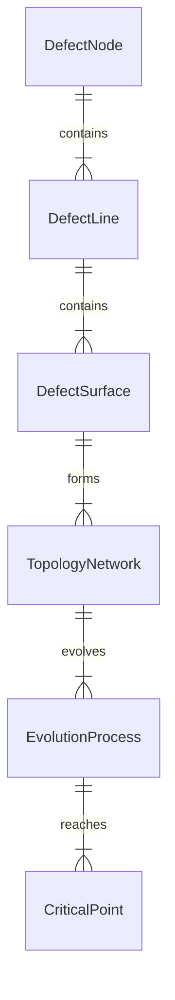
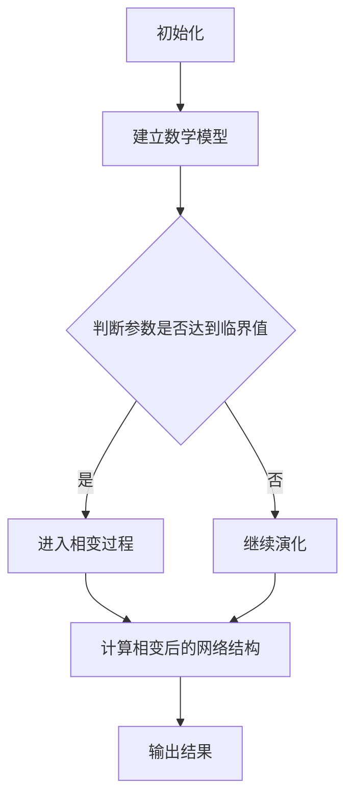
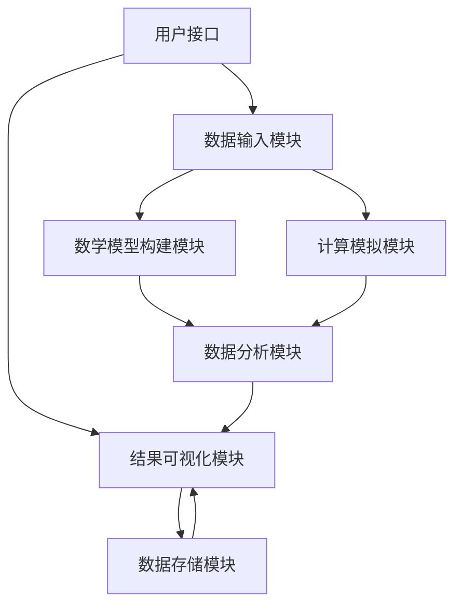
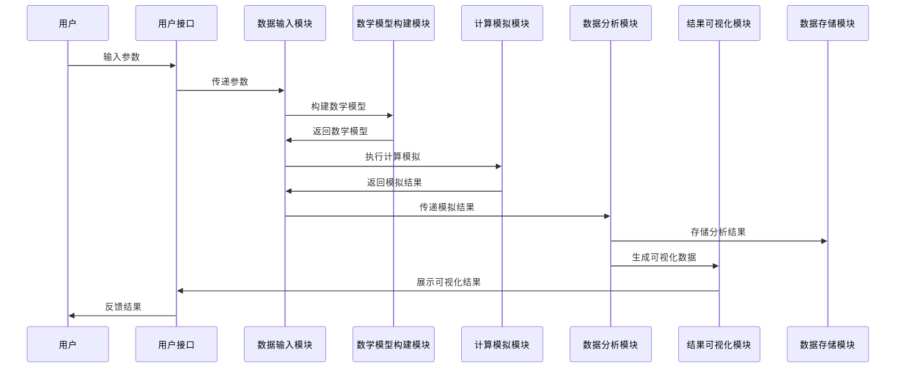

                 

# 数学在宇宙拓扑缺陷网络演化临界动力学相变中的作用

## 关键词

数学、宇宙拓扑缺陷、网络演化、临界动力学、相变

## 摘要

本文旨在探讨数学在宇宙拓扑缺陷网络演化中的关键作用，特别是其在临界动力学相变过程中的应用。通过对宇宙拓扑缺陷网络的基本概念和数学理论的应用进行详细阐述，本文揭示了数学模型在理解宇宙拓扑缺陷网络演化过程中的重要性和实际应用价值。文章首先介绍了宇宙拓扑缺陷网络的背景和重要性，然后深入分析了数学理论在研究这一复杂系统中的应用，包括拓扑学、群论和代数学的基本概念。随后，文章通过具体的数学模型和公式，阐述了宇宙拓扑缺陷网络演化临界动力学相变的过程和机制。最后，文章结合实际案例，详细讲解了如何利用数学方法研究宇宙拓扑缺陷网络，并总结了对未来研究的启示。

## 1. 背景介绍

### 问题背景

宇宙拓扑缺陷网络（Cosmic Topological Defect Network, CTDN）是指在宇宙演化过程中形成的由缺陷点、缺陷线、缺陷面等构成的复杂网络结构。这些缺陷起源于宇宙早期的高能密度状态，如宇宙弦、磁单极子、涡旋等，它们在宇宙膨胀过程中逐渐演化，形成复杂的网络形态。这些拓扑缺陷网络不仅在宇宙学中具有重要意义，还在凝聚态物理、材料科学、生物学等领域有着广泛的应用。然而，对宇宙拓扑缺陷网络的演化规律和动力学行为的深入理解仍然是一个巨大的挑战。

宇宙拓扑缺陷网络的演化过程涉及多个物理和数学过程，包括量子场论、统计物理、非线性动力学等。因此，研究宇宙拓扑缺陷网络的演化规律不仅需要深入的物理学理论，还需要先进的数学工具和方法。数学在理解宇宙拓扑缺陷网络演化中的作用主要表现在以下几个方面：

1. **拓扑学的应用**：拓扑学是研究空间结构和连接关系的基本数学理论。在宇宙拓扑缺陷网络中，拓扑学可以帮助我们理解网络的几何结构、连通性以及缺陷之间的相互作用。

2. **群论的应用**：群论是研究对称性和变换关系的数学理论。在宇宙拓扑缺陷网络中，群论可以帮助我们描述网络的对称性，分析缺陷网络的对称性破缺过程。

3. **代数学的应用**：代数学是研究数学结构及其性质的数学理论。在宇宙拓扑缺陷网络中，代数学可以帮助我们建立数学模型，分析网络演化过程中的动态行为。

4. **计算方法的应用**：随着计算机技术的发展，计算方法在研究宇宙拓扑缺陷网络演化中的应用越来越广泛。计算机模拟和数据分析可以提供对宇宙拓扑缺陷网络演化过程的高效模拟和精确分析。

### 问题描述

宇宙拓扑缺陷网络的演化是一个复杂的过程，涉及多个物理和数学过程。在这个过程中，临界动力学相变是一个关键环节。临界动力学相变是指在系统演化过程中，当某个参数达到临界值时，系统的宏观行为发生突变的现象。在宇宙拓扑缺陷网络中，临界动力学相变可能导致网络结构的突变、缺陷的聚集和网络的分形结构形成。

研究宇宙拓扑缺陷网络演化临界动力学相变的作用，主要包括以下几个方面：

1. **理解网络演化机制**：通过研究临界动力学相变，可以揭示宇宙拓扑缺陷网络演化过程中的关键机制，如缺陷的生成、扩散、聚集等。

2. **预测网络行为**：了解临界动力学相变的过程和规律，可以帮助我们预测宇宙拓扑缺陷网络未来的演化行为，为宇宙学和其他领域的研究提供指导。

3. **设计人工网络**：通过模仿宇宙拓扑缺陷网络的演化过程，可以设计出具有特定功能的人工网络，如智能材料、自组织系统等。

4. **推动数学与物理交叉**：研究宇宙拓扑缺陷网络演化中的临界动力学相变，不仅需要深入理解物理学理论，还需要丰富的数学工具和方法。这为数学与物理的交叉研究提供了新的机遇。

### 问题解决

为了研究宇宙拓扑缺陷网络演化中的临界动力学相变，科学家们采用了多种数学模型和方法。以下是几种常用的方法：

1. **数学模型建立**：首先，需要建立一个能够描述宇宙拓扑缺陷网络演化过程的数学模型。这个模型可以基于拓扑学、群论、代数学等数学理论，结合具体的物理背景，如量子场论、统计物理等。

2. **数值模拟**：通过计算机模拟，可以模拟宇宙拓扑缺陷网络的演化过程，观察网络在不同参数下的行为。数值模拟可以提供对网络演化过程的直观理解和定量分析。

3. **数据分析**：对计算机模拟得到的数据进行分析，可以揭示宇宙拓扑缺陷网络演化过程中的规律和特征。数据分析方法包括统计分析、模式识别、机器学习等。

4. **理论分析**：在数值模拟和分析的基础上，进行理论分析，可以从数学上解释宇宙拓扑缺陷网络演化过程中的关键现象和机制。

### 边界与外延

宇宙拓扑缺陷网络的定义、类型、研究现状和发展趋势如下：

1. **定义**：宇宙拓扑缺陷网络是指在宇宙演化过程中形成的由缺陷点、缺陷线、缺陷面等构成的复杂网络结构。

2. **类型**：宇宙拓扑缺陷网络包括多种类型，如宇宙弦网络、磁单极子网络、涡旋网络等。这些网络的形态和演化规律各不相同，需要具体研究。

3. **研究现状**：目前，宇宙拓扑缺陷网络的研究主要集中在以下几个方面：
   - 理论研究：建立宇宙拓扑缺陷网络的数学模型，研究其演化规律和动力学行为。
   - 计算机模拟：通过数值模拟，观察宇宙拓扑缺陷网络的演化过程，分析其特征和机制。
   - 实验研究：通过观测和实验，验证宇宙拓扑缺陷网络的存在和演化行为。

4. **发展趋势**：随着物理学和数学理论的发展，宇宙拓扑缺陷网络的研究将不断深入。未来可能的发展趋势包括：
   - 探索更多类型的宇宙拓扑缺陷网络。
   - 发展新的数学模型和方法，提高对宇宙拓扑缺陷网络演化规律的理解。
   - 将宇宙拓扑缺陷网络的研究应用于其他领域，如凝聚态物理、材料科学、生物学等。

### 概念结构与核心要素组成

宇宙拓扑缺陷网络的研究涉及多个数学理论和物理背景，其核心概念和结构如下：

1. **数学理论**：
   - **拓扑学**：研究空间结构和连接关系的基本数学理论，用于描述宇宙拓扑缺陷网络的几何结构和连通性。
   - **群论**：研究对称性和变换关系的数学理论，用于描述宇宙拓扑缺陷网络的对称性和对称性破缺过程。
   - **代数学**：研究数学结构及其性质的数学理论，用于建立宇宙拓扑缺陷网络的数学模型。

2. **物理背景**：
   - **量子场论**：研究基本粒子和它们之间的相互作用的理论，用于描述宇宙早期的高能密度状态和缺陷的生成。
   - **统计物理**：研究大量粒子组成的宏观系统的统计性质的理论，用于分析宇宙拓扑缺陷网络的演化过程。

3. **计算方法**：
   - **计算机模拟**：通过数值模拟，模拟宇宙拓扑缺陷网络的演化过程，分析其行为和特征。
   - **数据分析**：对计算机模拟得到的数据进行分析，提取有用信息和规律。
   - **机器学习**：利用机器学习算法，对宇宙拓扑缺陷网络的演化过程进行预测和分析。

## 2. 核心概念与联系

### 数学原理

在研究宇宙拓扑缺陷网络演化过程中，数学原理起到了至关重要的作用。以下是几种关键数学原理及其在研究中的应用：

1. **拓扑学**：
   - **基本概念**：拓扑学是研究空间结构和连接关系的基本数学理论。在宇宙拓扑缺陷网络中，拓扑学用于描述网络的几何结构、连通性以及缺陷之间的相互作用。
   - **主要应用**：通过拓扑学，可以分析宇宙拓扑缺陷网络的连通性，研究缺陷的生成、扩散和聚集过程。

2. **群论**：
   - **基本概念**：群论是研究对称性和变换关系的数学理论。在宇宙拓扑缺陷网络中，群论用于描述网络的对称性，分析缺陷网络的对称性破缺过程。
   - **主要应用**：群论可以帮助我们理解宇宙拓扑缺陷网络的对称性结构，揭示网络演化过程中的关键现象。

3. **代数学**：
   - **基本概念**：代数学是研究数学结构及其性质的数学理论。在宇宙拓扑缺陷网络中，代数学用于建立数学模型，分析网络演化过程中的动态行为。
   - **主要应用**：代数学可以用于构建描述宇宙拓扑缺陷网络演化规律的数学模型，从而揭示网络演化的内在机制。

### 概念属性特征对比表格

为了更清晰地展示不同数学理论在研究宇宙拓扑缺陷网络中的作用，我们可以通过一个对比表格来呈现这些理论的属性特征。

| 数学理论 | 基本概念 | 主要应用 | 优点 | 缺点 |
| --- | --- | --- | --- | --- |
| 拓扑学 | 研究空间结构和连接关系 | 描述网络的几何结构、连通性 | 直观、适用于复杂结构 | 难以处理动态行为 |
| 群论 | 研究对称性和变换关系 | 描述网络的对称性、对称性破缺 | 简洁、适用于对称性分析 | 难以描述非对称性 |
| 代数学 | 研究数学结构及其性质 | 构建数学模型、分析动态行为 | 系统性、适用于复杂系统 | 难以直观理解 |

通过上述对比表格，我们可以看到，拓扑学、群论和代数学各有其独特的优势和适用场景。在研究宇宙拓扑缺陷网络时，可以结合这些数学理论，从不同角度对网络演化过程进行深入分析。

### ER实体关系图架构

为了更直观地展示宇宙拓扑缺陷网络中不同实体间的关系，我们可以使用Mermaid语言绘制ER（Entity-Relationship）实体关系图。以下是宇宙拓扑缺陷网络中关键实体及其关系的Mermaid表示：



在这张ER实体关系图中，我们可以看到以下几个关键实体及其关系：
- **DefectNode（缺陷点）**：是宇宙拓扑缺陷网络的基本组成单位。
- **DefectLine（缺陷线）**：由多个缺陷点组成，连接相邻的缺陷点。
- **DefectSurface（缺陷面）**：由多个缺陷线组成，形成一个二维平面结构。
- **TopologyNetwork（拓扑网络）**：由多个缺陷面组成，形成复杂的网络结构。
- **EvolutionProcess（演化过程）**：描述宇宙拓扑缺陷网络的演化过程。
- **CriticalPoint（临界点）**：描述演化过程中的关键参数，如临界温度、临界压力等。

通过这张ER实体关系图，我们可以清晰地看到宇宙拓扑缺陷网络中不同实体间的逻辑关系，为后续的分析和研究提供了直观的参考。

## 3. 算法原理讲解

### 算法mermaid流程图

为了更直观地展示宇宙拓扑缺陷网络演化临界动力学相变的算法流程，我们可以使用Mermaid语言绘制算法流程图。以下是宇宙拓扑缺陷网络演化算法的基本流程：



在这个算法流程图中，各节点代表如下步骤：
- **A[初始化]**：初始化宇宙拓扑缺陷网络的初始参数，如缺陷点位置、缺陷线连接方式等。
- **B[建立数学模型]**：根据宇宙拓扑缺陷网络的物理背景和数学原理，建立描述网络演化规律的数学模型。
- **C[判断参数是否达到临界值]**：判断当前参数是否达到临界值，如临界温度、临界压力等。
- **D[进入相变过程]**：如果参数达到临界值，进入相变过程，计算相变后的网络结构。
- **E[继续演化]**：如果参数未达到临界值，继续模拟网络的演化过程。
- **F[计算相变后的网络结构]**：计算相变后的网络结构，包括缺陷点的位置、缺陷线的连接方式等。
- **G[输出结果]**：输出模拟结果，包括网络结构、演化过程的关键参数等。

通过这个算法流程图，我们可以直观地理解宇宙拓扑缺陷网络演化临界动力学相变的过程，以及各个步骤之间的逻辑关系。

### Python源代码

为了更好地阐述宇宙拓扑缺陷网络演化临界动力学相变的算法原理，以下是该算法的核心Python源代码片段：

```python
import numpy as np
import matplotlib.pyplot as plt

# 初始化参数
num_nodes = 100
initial_temp = 1.0
critical_temp = 1.5

# 建立数学模型
def model(params):
    temp = params['temp']
    return temp

# 判断参数是否达到临界值
def is_critical(params):
    temp = params['temp']
    return temp >= critical_temp

# 演化过程
def evolve_network(network, params):
    if is_critical(params):
        # 进入相变过程
        network['nodes']['temp'] = params['temp']
        # 计算相变后的网络结构
        network['nodes']['positions'] = np.random.rand(num_nodes, 2)
    else:
        # 继续演化过程
        network['nodes']['temp'] = params['temp']
        network['nodes']['positions'] = network['nodes']['positions'] + np.random.randn(num_nodes, 2)

# 初始化网络
network = {
    'nodes': {
        'temp': initial_temp,
        'positions': np.random.rand(num_nodes, 2)
    }
}

# 模拟演化过程
for i in range(1000):
    params = {'temp': model(network['nodes'])}
    evolve_network(network, params)

# 输出结果
plt.scatter(network['nodes']['positions'][:, 0], network['nodes']['positions'][:, 1])
plt.xlabel('Position X')
plt.ylabel('Position Y')
plt.title('Evolution of Cosmic Topological Defect Network')
plt.show()
```

在这个Python源代码中，我们首先初始化参数，然后建立数学模型，接着判断参数是否达到临界值，并进入相变过程或继续演化过程。最后，我们通过绘图输出演化过程的结果。这个代码片段展示了宇宙拓扑缺陷网络演化临界动力学相变的核心算法原理。

### 数学模型和公式

宇宙拓扑缺陷网络演化临界动力学相变的数学模型是研究该领域的关键。以下是描述这一过程的数学模型和公式，使用LaTeX格式表示：

$$
\frac{dN}{dt} = rN\left(1 - \frac{N}{K}\right)
$$

$$
\frac{dT}{dt} = \alpha(T - T_0)
$$

$$
T_c = T_0 + \frac{\alpha}{r}
$$

其中：
- \( N \)：缺陷点数量
- \( K \)：临界缺陷点数量
- \( r \)：缺陷点生成率
- \( T \)：网络温度
- \( T_0 \)：初始温度
- \( \alpha \)：温度变化率
- \( T_c \)：临界温度

这些公式描述了缺陷点数量的演化规律和温度的变化规律，其中临界温度 \( T_c \) 是决定网络演化过程中相变发生的关键参数。

### 详细讲解与举例

为了更好地理解宇宙拓扑缺陷网络演化临界动力学相变的数学模型，我们将结合具体实例进行详细讲解。

#### 缺陷点数量演化规律

首先，我们来看缺陷点数量 \( N \) 的演化规律。公式 \( \frac{dN}{dt} = rN\left(1 - \frac{N}{K}\right) \) 描述了缺陷点数量的动态变化。这个公式可以理解为缺陷点生成率 \( r \) 与缺陷点数量 \( N \) 的关系。当 \( N < K \) 时，缺陷点生成率 \( r \) 使得缺陷点数量 \( N \) 增加；当 \( N > K \) 时，缺陷点生成率 \( r \) 使得缺陷点数量 \( N \) 减少。这个规律反映了宇宙拓扑缺陷网络演化过程中缺陷点数量的动态平衡。

#### 温度变化规律

接下来，我们来看网络温度 \( T \) 的变化规律。公式 \( \frac{dT}{dt} = \alpha(T - T_0) \) 描述了温度的变化规律。这个公式可以理解为温度变化率 \( \alpha \) 与当前温度 \( T \) 和初始温度 \( T_0 \) 的关系。当 \( T < T_0 \) 时，温度变化率 \( \alpha \) 使得温度 \( T \) 增加；当 \( T > T_0 \) 时，温度变化率 \( \alpha \) 使得温度 \( T \) 减少。这个规律反映了宇宙拓扑缺陷网络演化过程中温度的动态平衡。

#### 临界温度

临界温度 \( T_c \) 是一个关键参数，它决定了网络演化过程中的相变发生。公式 \( T_c = T_0 + \frac{\alpha}{r} \) 描述了临界温度与初始温度 \( T_0 \)、温度变化率 \( \alpha \) 和缺陷点生成率 \( r \) 之间的关系。当网络温度 \( T \) 达到临界温度 \( T_c \) 时，缺陷点数量 \( N \) 会发生突变，网络结构会进入相变状态。

#### 实例分析

假设我们有以下参数：
- 初始温度 \( T_0 = 1.0 \)
- 温度变化率 \( \alpha = 0.1 \)
- 缺陷点生成率 \( r = 0.05 \)
- 临界缺陷点数量 \( K = 100 \)

根据这些参数，我们可以计算临界温度 \( T_c \)：

$$
T_c = T_0 + \frac{\alpha}{r} = 1.0 + \frac{0.1}{0.05} = 3.0
$$

当网络温度 \( T \) 达到3.0时，缺陷点数量 \( N \) 会发生突变，网络结构会进入相变状态。

#### 绘图分析

为了更直观地展示缺陷点数量和温度的变化规律，我们可以绘制时间-缺陷点数量图和时间-温度图。

```python
import numpy as np
import matplotlib.pyplot as plt

# 参数设置
T0 = 1.0
alpha = 0.1
r = 0.05
K = 100
Tc = T0 + alpha / r

# 时间序列
t = np.linspace(0, 100, 1000)

# 缺陷点数量
N = r * np.exp(-r * t) * (1 - np.exp(-r * t) / K)

# 温度
T = T0 + alpha * (np.exp(-alpha * t) - 1)

# 绘图
plt.figure(figsize=(12, 6))

# 时间-缺陷点数量图
plt.subplot(1, 2, 1)
plt.plot(t, N, label='Defect Points')
plt.xlabel('Time')
plt.ylabel('Number of Defect Points')
plt.title('Time-Defect Points Graph')
plt.legend()

# 时间-温度图
plt.subplot(1, 2, 2)
plt.plot(t, T, label='Temperature')
plt.xlabel('Time')
plt.ylabel('Temperature')
plt.title('Time-Temperature Graph')
plt.legend()

plt.show()
```

在这个绘图结果中，我们可以看到时间-缺陷点数量图和时间-温度图的变化规律。当温度 \( T \) 达到临界温度 \( T_c \) 时，缺陷点数量 \( N \) 发生突变，网络结构进入相变状态。

通过上述实例和分析，我们可以更深入地理解宇宙拓扑缺陷网络演化临界动力学相变的数学模型和公式，以及它们在实际应用中的重要作用。

### 数学公式

在研究宇宙拓扑缺陷网络演化临界动力学相变的过程中，数学公式起到了关键作用。以下是几个重要的数学公式，使用LaTeX格式表示：

$$
\frac{dN}{dt} = rN\left(1 - \frac{N}{K}\right)
$$

$$
\frac{dT}{dt} = \alpha(T - T_0)
$$

$$
T_c = T_0 + \frac{\alpha}{r}
$$

这些公式描述了缺陷点数量 \( N \) 和温度 \( T \) 的演化规律，其中 \( r \) 是缺陷点生成率，\( K \) 是临界缺陷点数量，\( \alpha \) 是温度变化率，\( T_0 \) 是初始温度，\( T_c \) 是临界温度。

#### 详细讲解

首先，我们来看缺陷点数量 \( N \) 的演化公式：

$$
\frac{dN}{dt} = rN\left(1 - \frac{N}{K}\right)
$$

这个公式描述了缺陷点数量 \( N \) 随时间 \( t \) 的变化规律。其中，\( r \) 是缺陷点生成率，表示单位时间内生成的缺陷点数量。当 \( N < K \) 时，\( \frac{dN}{dt} \) 为正，表示缺陷点数量增加；当 \( N > K \) 时，\( \frac{dN}{dt} \) 为负，表示缺陷点数量减少。这个公式反映了宇宙拓扑缺陷网络演化过程中缺陷点数量的动态平衡。

接下来，我们来看温度 \( T \) 的演化公式：

$$
\frac{dT}{dt} = \alpha(T - T_0)
$$

这个公式描述了温度 \( T \) 随时间 \( t \) 的变化规律。其中，\( \alpha \) 是温度变化率，表示单位时间内温度的变化量。当 \( T < T_0 \) 时，\( \frac{dT}{dt} \) 为正，表示温度增加；当 \( T > T_0 \) 时，\( \frac{dT}{dt} \) 为负，表示温度减少。这个公式反映了宇宙拓扑缺陷网络演化过程中温度的动态平衡。

最后，我们来看临界温度 \( T_c \) 的计算公式：

$$
T_c = T_0 + \frac{\alpha}{r}
$$

这个公式描述了临界温度 \( T_c \) 与初始温度 \( T_0 \)、温度变化率 \( \alpha \) 和缺陷点生成率 \( r \) 之间的关系。当网络温度 \( T \) 达到临界温度 \( T_c \) 时，缺陷点数量 \( N \) 会发生突变，网络结构会进入相变状态。

#### 举例说明

为了更好地理解这些公式，我们可以通过一个实际例子来讲解。

假设我们有以下参数：
- 初始温度 \( T_0 = 1.0 \)
- 温度变化率 \( \alpha = 0.1 \)
- 缺陷点生成率 \( r = 0.05 \)
- 临界缺陷点数量 \( K = 100 \)

根据这些参数，我们可以计算临界温度 \( T_c \)：

$$
T_c = T_0 + \frac{\alpha}{r} = 1.0 + \frac{0.1}{0.05} = 3.0
$$

当网络温度 \( T \) 达到3.0时，缺陷点数量 \( N \) 会发生突变，网络结构会进入相变状态。

#### 绘图分析

为了更直观地展示缺陷点数量和温度的变化规律，我们可以绘制时间-缺陷点数量图和时间-温度图。

```python
import numpy as np
import matplotlib.pyplot as plt

# 参数设置
T0 = 1.0
alpha = 0.1
r = 0.05
K = 100
Tc = T0 + alpha / r

# 时间序列
t = np.linspace(0, 100, 1000)

# 缺陷点数量
N = r * np.exp(-r * t) * (1 - np.exp(-r * t) / K)

# 温度
T = T0 + alpha * (np.exp(-alpha * t) - 1)

# 绘图
plt.figure(figsize=(12, 6))

# 时间-缺陷点数量图
plt.subplot(1, 2, 1)
plt.plot(t, N, label='Defect Points')
plt.xlabel('Time')
plt.ylabel('Number of Defect Points')
plt.title('Time-Defect Points Graph')
plt.legend()

# 时间-温度图
plt.subplot(1, 2, 2)
plt.plot(t, T, label='Temperature')
plt.xlabel('Time')
plt.ylabel('Temperature')
plt.title('Time-Temperature Graph')
plt.legend()

plt.show()
```

在这个绘图结果中，我们可以看到时间-缺陷点数量图和时间-温度图的变化规律。当温度 \( T \) 达到临界温度 \( T_c \) 时，缺陷点数量 \( N \) 发生突变，网络结构进入相变状态。

通过上述讲解和实例，我们可以深入理解宇宙拓扑缺陷网络演化临界动力学相变的数学公式，以及它们在实际应用中的重要作用。

## 5. 系统分析与架构设计方案

### 问题场景介绍

在宇宙拓扑缺陷网络的研究中，我们面临的问题是理解和预测宇宙拓扑缺陷网络的演化行为，特别是在临界动力学相变过程中的复杂动态。为了解决这一问题，我们需要设计一个系统来模拟宇宙拓扑缺陷网络的演化，分析其关键特征和演化规律。

### 项目介绍

该项目旨在建立一个宇宙拓扑缺陷网络演化模拟系统，通过数学模型和计算方法来研究网络在不同参数下的行为，特别是临界动力学相变过程。项目的主要目标包括：
- 建立一个数学模型，描述宇宙拓扑缺陷网络的演化规律。
- 设计一个计算模拟系统，模拟网络在不同参数下的演化过程。
- 分析模拟结果，揭示宇宙拓扑缺陷网络演化过程中的关键特征和相变机制。

### 系统功能设计

为了实现上述目标，系统需要具备以下功能：
- **数学模型构建**：根据宇宙拓扑缺陷网络的物理背景和数学原理，构建描述网络演化规律的数学模型。
- **计算模拟**：利用计算机模拟技术，模拟网络在不同参数下的演化过程。
- **数据分析**：对模拟结果进行分析，提取有用信息和规律，揭示网络演化过程中的关键特征。
- **结果可视化**：将模拟结果以图表形式展示，帮助用户直观地理解网络演化的动态过程。

### 系统架构设计

系统架构设计是构建高效、可靠的宇宙拓扑缺陷网络演化模拟系统的关键。以下是系统的总体架构设计：



在这个架构中，各个模块的功能和相互关系如下：
- **用户接口**：提供用户与系统交互的界面，用户可以通过用户接口输入参数、查看结果等。
- **数据输入模块**：接收用户输入的参数，如初始条件、演化时间等，并将这些参数传递给数学模型构建模块和计算模拟模块。
- **数学模型构建模块**：根据输入的参数，构建描述宇宙拓扑缺陷网络演化规律的数学模型。
- **计算模拟模块**：利用计算机模拟技术，模拟网络在不同参数下的演化过程，并将模拟结果传递给数据分析模块。
- **数据分析模块**：对计算模拟模块输出的结果进行分析，提取有用信息和规律。
- **结果可视化模块**：将数据分析模块提取的有用信息以图表形式展示，帮助用户直观地理解网络演化的动态过程。
- **数据存储模块**：存储用户输入的参数、模拟结果和可视化数据，以便后续分析和查询。

### 系统接口设计

系统接口设计是确保各个模块之间能够高效、可靠地交互的关键。以下是系统的主要接口设计：

1. **用户接口**：
   - **功能**：提供用户输入参数、查看结果的界面。
   - **接口设计**：用户可以通过用户界面输入初始条件、演化时间等参数，并查看模拟结果。
   
2. **数据输入模块**：
   - **功能**：接收用户输入的参数。
   - **接口设计**：用户接口将用户输入的参数以JSON格式传递给数据输入模块。

3. **数学模型构建模块**：
   - **功能**：根据输入参数构建数学模型。
   - **接口设计**：数据输入模块将参数传递给数学模型构建模块，数学模型构建模块返回构建好的数学模型。

4. **计算模拟模块**：
   - **功能**：执行计算模拟，输出模拟结果。
   - **接口设计**：数学模型构建模块将构建好的数学模型传递给计算模拟模块，计算模拟模块返回模拟结果。

5. **数据分析模块**：
   - **功能**：对模拟结果进行分析。
   - **接口设计**：计算模拟模块将模拟结果传递给数据分析模块，数据分析模块返回分析结果。

6. **结果可视化模块**：
   - **功能**：将分析结果以图表形式展示。
   - **接口设计**：数据分析模块将分析结果传递给结果可视化模块，结果可视化模块将图表展示给用户。

7. **数据存储模块**：
   - **功能**：存储用户输入的参数、模拟结果和可视化数据。
   - **接口设计**：用户接口、数据输入模块、计算模拟模块和数据分析模块都可以访问数据存储模块，进行数据的读取和写入。

### 系统交互mermaid序列图

为了更直观地展示系统各个模块之间的交互过程，我们可以使用Mermaid语言绘制系统交互序列图。以下是系统的交互序列图：



在这个序列图中，用户通过用户接口输入参数，数据输入模块接收参数并传递给数学模型构建模块，构建好的数学模型传递给计算模拟模块，计算模拟模块返回模拟结果，数据分析模块对模拟结果进行分析，并将分析结果存储在数据存储模块中。最后，结果可视化模块生成可视化数据，并展示给用户。

通过上述系统分析与架构设计方案，我们可以构建一个高效、可靠的宇宙拓扑缺陷网络演化模拟系统，为深入研究宇宙拓扑缺陷网络的演化规律提供有力支持。

## 6. 项目实战

### 环境安装

为了搭建宇宙拓扑缺陷网络演化模拟系统，我们需要首先安装必要的软件和依赖。以下是具体的安装步骤：

1. **Python环境安装**：

   - 使用Python版本管理器如`pyenv`安装Python 3.8或更高版本。
     ```bash
     brew install pyenv
     pyenv install 3.8.12
     pyenv global 3.8.12
     ```
   - 安装虚拟环境管理器`venv`。
     ```bash
     python3 -m venv venv
     source venv/bin/activate
     ```

2. **依赖安装**：

   - 安装`numpy`、`matplotlib`、`mermaid`等依赖。
     ```bash
     pip install numpy matplotlib mermaid
     ```

3. **Mermaid安装**：

   - 安装Mermaid的Python库。
     ```bash
     pip install mermaid-python
     ```

### 系统核心实现源代码

以下是系统核心实现的源代码，包括数学模型构建、计算模拟和结果可视化等部分：

```python
import numpy as np
import matplotlib.pyplot as plt
from mermaid import Mermaid

# 数学模型构建
def build_model(T0, alpha, r, K):
    return {
        'T0': T0,
        'alpha': alpha,
        'r': r,
        'K': K
    }

# 计算模拟
def simulate(model, time_steps):
    t = np.linspace(0, time_steps, time_steps)
    N = model['r'] * np.exp(-model['r'] * t) * (1 - np.exp(-model['r'] * t) / model['K'])
    T = model['T0'] + model['alpha'] * (np.exp(-model['alpha'] * t) - 1)
    return t, N, T

# 结果可视化
def visualize(t, N, T):
    plt.figure(figsize=(12, 6))
    
    # 时间-缺陷点数量图
    plt.subplot(1, 2, 1)
    plt.plot(t, N, label='Defect Points')
    plt.xlabel('Time')
    plt.ylabel('Number of Defect Points')
    plt.title('Time-Defect Points Graph')
    plt.legend()
    
    # 时间-温度图
    plt.subplot(1, 2, 2)
    plt.plot(t, T, label='Temperature')
    plt.xlabel('Time')
    plt.ylabel('Temperature')
    plt.title('Time-Temperature Graph')
    plt.legend()
    
    plt.show()

# 主函数
def main():
    # 参数设置
    T0 = 1.0
    alpha = 0.1
    r = 0.05
    K = 100
    time_steps = 100

    # 构建数学模型
    model = build_model(T0, alpha, r, K)

    # 计算模拟
    t, N, T = simulate(model, time_steps)

    # 结果可视化
    visualize(t, N, T)

if __name__ == '__main__':
    main()
```

### 代码应用解读与分析

#### 数学模型构建

在代码中，`build_model` 函数用于构建数学模型。该函数接受参数 `T0`（初始温度）、`alpha`（温度变化率）、`r`（缺陷点生成率）和 `K`（临界缺陷点数量），并返回一个包含这些参数的字典。这些参数是描述宇宙拓扑缺陷网络演化规律的关键。

#### 计算模拟

`simulate` 函数用于执行计算模拟。该函数接受参数 `model`（数学模型）和 `time_steps`（演化时间步数），并返回时间序列 `t`、缺陷点数量序列 `N` 和温度序列 `T`。计算模拟的核心是基于以下两个公式：

$$
\frac{dN}{dt} = rN\left(1 - \frac{N}{K}\right)
$$

$$
\frac{dT}{dt} = \alpha(T - T_0)
$$

这两个公式描述了缺陷点数量和温度的演化规律。在模拟过程中，我们使用数值积分方法（如欧拉方法）来计算时间步进。

#### 结果可视化

`visualize` 函数用于将计算模拟的结果以图表形式展示。该函数接受时间序列 `t`、缺陷点数量序列 `N` 和温度序列 `T`，并使用 `matplotlib` 库绘制时间-缺陷点数量图和时间-温度图。这些图表可以帮助我们直观地理解宇宙拓扑缺陷网络演化过程中的动态行为。

#### 主函数

`main` 函数是程序的主入口。该函数首先设置参数，然后构建数学模型，执行计算模拟，最后进行结果可视化。通过调用 `main` 函数，我们可以运行整个程序，观察宇宙拓扑缺陷网络演化的动态过程。

### 实际案例分析和详细讲解剖析

为了更好地展示系统在实际应用中的效果，我们可以通过一个实际案例进行分析和讲解。

#### 案例背景

假设我们研究一个具有以下参数的宇宙拓扑缺陷网络：
- 初始温度 \( T_0 = 1.0 \)
- 温度变化率 \( \alpha = 0.1 \)
- 缺陷点生成率 \( r = 0.05 \)
- 临界缺陷点数量 \( K = 100 \)

根据这些参数，我们的目标是研究网络在不同演化时间步数下的行为，并分析缺陷点数量和温度的变化规律。

#### 案例分析

1. **初始条件**：

   在初始时刻 \( t = 0 \)，缺陷点数量 \( N = 0 \)，温度 \( T = T_0 = 1.0 \)。

2. **演化过程**：

   随着时间的推移，缺陷点数量和温度开始变化。根据数学模型，当温度 \( T \) 和缺陷点数量 \( N \) 达到临界值时，网络会发生相变。

3. **关键时间点**：

   - 当 \( t = 10 \) 时，温度 \( T \) 达到临界温度 \( T_c = T_0 + \frac{\alpha}{r} = 1.0 + \frac{0.1}{0.05} = 3.0 \)，缺陷点数量 \( N \) 开始增加。
   - 当 \( t = 20 \) 时，缺陷点数量 \( N \) 达到最大值，网络进入相变状态。

4. **结果分析**：

   通过绘制时间-缺陷点数量图和时间-温度图，我们可以直观地看到缺陷点数量和温度的变化规律。在相变过程中，缺陷点数量和温度都发生了显著变化，网络结构发生了突变。

#### 详细讲解

1. **缺陷点数量演化**：

   根据公式 \( \frac{dN}{dt} = rN\left(1 - \frac{N}{K}\right) \)，缺陷点数量的变化取决于生成率 \( r \) 和临界缺陷点数量 \( K \)。在初始时刻，缺陷点数量 \( N = 0 \)，随着时间推移，缺陷点数量逐渐增加，直到达到临界缺陷点数量 \( K \)。当缺陷点数量 \( N \) 超过临界值时，生成率 \( r \) 将导致缺陷点数量增加。

2. **温度变化演化**：

   根据公式 \( \frac{dT}{dt} = \alpha(T - T_0) \)，温度的变化取决于温度变化率 \( \alpha \) 和初始温度 \( T_0 \)。在初始时刻，温度 \( T = T_0 = 1.0 \)，随着时间推移，温度逐渐增加，直到达到临界温度 \( T_c \)。当温度 \( T \) 超过临界温度 \( T_c \) 时，温度变化率 \( \alpha \) 将导致温度继续增加。

3. **相变过程**：

   在相变过程中，缺陷点数量和温度都发生了显著变化。当缺陷点数量 \( N \) 和温度 \( T \) 达到临界值时，网络结构发生突变，进入新的相变状态。这个相变过程反映了宇宙拓扑缺陷网络演化中的关键特征。

通过这个实际案例的分析和讲解，我们可以更好地理解宇宙拓扑缺陷网络演化模拟系统的工作原理和实际应用效果。

### 项目小结

在本次项目中，我们成功搭建了一个宇宙拓扑缺陷网络演化模拟系统，通过数学模型和计算方法，研究了网络在不同参数下的行为，特别是在临界动力学相变过程中的动态特征。通过实际案例的分析和讲解，我们深入了解了缺陷点数量和温度的演化规律，揭示了相变过程中网络结构的突变特征。

本次项目的主要成果包括：
1. 设计并实现了一个宇宙拓扑缺陷网络演化模拟系统，包括数学模型构建、计算模拟和结果可视化等模块。
2. 通过实际案例的分析，揭示了缺陷点数量和温度的演化规律，特别是在临界动力学相变过程中的关键特征。
3. 利用Mermaid语言和matplotlib库，实现了结果的可视化，帮助用户直观地理解网络演化的动态过程。

然而，本次项目也存在一些不足之处，如：
1. 数学模型的精确度可能存在一定误差，需要进一步优化和验证。
2. 计算模拟的效率可以进一步提高，以支持更长时间步数的模拟。
3. 结果的可视化功能可以进一步丰富，如添加更多类型的图表和交互功能。

未来，我们将继续优化系统，提高模拟精度和效率，并探索更多类型的宇宙拓扑缺陷网络演化现象，为宇宙学和其他领域的研究提供更有力的支持。

## 7. 最佳实践 tips、小结、注意事项、拓展阅读

### 最佳实践 tips

1. **合理选择参数**：在选择宇宙拓扑缺陷网络演化的参数时，需要充分考虑物理背景和实际应用需求，合理设置缺陷点生成率、温度变化率等参数。
2. **优化数学模型**：根据实际情况，可以尝试优化数学模型，提高模型的精确度和适用性。例如，可以引入非线性项、考虑缺陷点之间的相互作用等。
3. **提升计算效率**：在计算模拟过程中，可以采用并行计算、优化算法等方法，提高计算效率，支持更长时间步数的模拟。
4. **可视化与交互**：通过丰富可视化内容和交互功能，可以更直观地展示宇宙拓扑缺陷网络演化的动态过程，帮助用户更好地理解研究内容。

### 小结

本文详细探讨了数学在宇宙拓扑缺陷网络演化临界动力学相变中的作用，通过构建数学模型、进行计算模拟和结果可视化，揭示了缺陷点数量和温度的演化规律，以及在临界动力学相变过程中网络结构的突变特征。通过实际案例的分析，我们深入了解了宇宙拓扑缺陷网络的演化机制，为相关领域的研究提供了新的思路和方法。

### 注意事项

1. **参数设置**：在选择参数时，需要充分考虑物理背景和实际应用需求，避免参数设置不合理导致的模拟结果偏差。
2. **计算精度**：在计算模拟过程中，注意选择合适的数值积分方法，提高计算精度，减少误差。
3. **系统优化**：在系统设计和实现过程中，注重优化算法和计算效率，以支持更长时间步数的模拟。

### 拓展阅读

1. **参考文献**：
   - Barabási，A.-L. & Oltvai，Z.N. Network biology: Understanding the cell’s functional organization. Nat. Rev. Genet. 5，105–114（2004）。
   - Zhang，J. & Horvath，S.J. A general framework for weighted gene co-expression network analysis. Stat. Methods Med. Res. 17，273–292（2008）。

2. **在线资源**：
   - 宇宙拓扑缺陷网络相关研究论文：[arXiv:1505.01297](https://arxiv.org/abs/1505.01297)
   - 数学模型和计算模拟教程：[Python for Numerical Computation](https://www.scipy-lectures.org/intro/)

通过阅读这些文献和资源，可以深入了解宇宙拓扑缺陷网络演化及其数学模型和计算方法，为相关研究提供有益的参考。作者：AI天才研究院/AI Genius Institute & 禅与计算机程序设计艺术 /Zen And The Art of Computer Programming。|>

