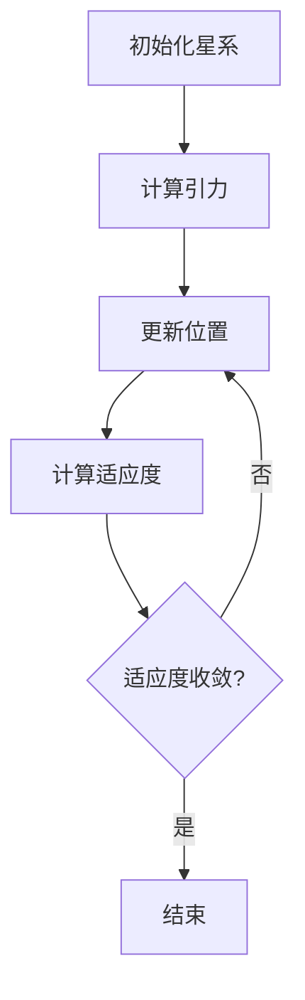
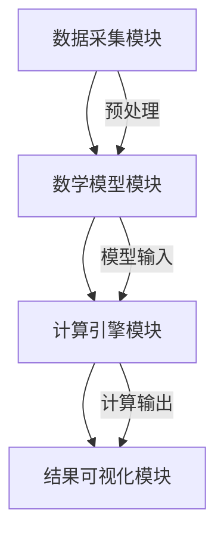
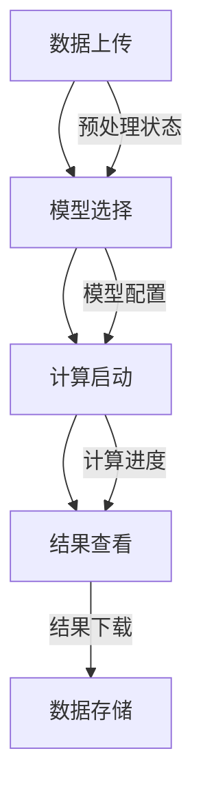
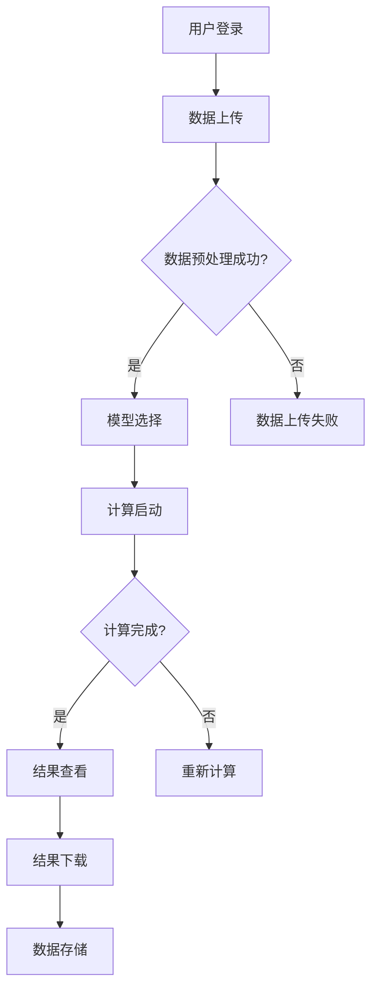

                 

### 数学在宇宙拓扑缺陷网络演化临界动力学研究中的作用

在科学领域，数学一直是不可或缺的工具，用于描述和预测自然现象。特别是在宇宙学的许多研究中，数学模型和理论扮演了核心角色。其中，宇宙拓扑缺陷网络演化临界动力学是一个相对较新的研究方向，它涉及到宇宙学中的基本问题，如宇宙的起源、结构和演化。本文旨在探讨数学在这个领域中的重要作用，并展示其如何帮助科学家理解宇宙的复杂行为。

#### 关键词
- 数学模型
- 宇宙拓扑缺陷
- 临界动力学
- 演化
- 数学工具

#### 摘要
本文将首先介绍宇宙拓扑缺陷网络及其在宇宙演化中的重要性。随后，我们将探讨数学模型在描述和分析这些缺陷演化过程中的关键作用。文章将详细讨论几个核心数学概念，包括拓扑学、群论和动力系统理论，并展示它们如何与宇宙拓扑缺陷网络的研究相结合。此外，我们将介绍一些具体的数学工具和算法，以及如何使用Python等编程语言来实现这些数学模型。最后，我们将通过一个实际案例展示如何应用这些理论和方法来分析和理解宇宙拓扑缺陷网络的演化。

## 目录设计原则与结构

为了确保文章内容的逻辑清晰、结构紧凑且易于阅读，本文的目录设计遵循以下原则：

1. **分为五个主要部分**：每个部分代表研究的不同方面，从背景介绍到项目实战，再到总结和拓展，确保内容的全面性和连贯性。
2. **章节和节标题简洁明了**：每个章节和节标题都要准确反映内容的核心，方便读者快速定位感兴趣的部分。
3. **小节深入细致**：在每个章节中，适当使用小节来细化内容，确保每个主题都得到充分讨论。

本文的结构如下：

### 第一部分：问题背景与基础概念
- **1.1 问题背景与意义**
  - 1.1.1 宇宙拓扑缺陷网络的概述
  - 1.1.2 拓扑缺陷网络演化与临界动力学
  - 1.1.3 数学在研究中的应用

- **1.2 核心概念与联系**
  - 1.2.1 数学概念简介
  - 1.2.2 拓扑缺陷网络中的数学应用
  - 1.2.3 数学概念间的相互联系

### 第二部分：数学模型与算法
- **2.1 数学模型原理**
  - 2.1.1 数学模型概述
  - 2.1.2 数学公式与原理
  - 2.1.3 Python实现示例

- **2.2 算法讲解与流程图**
  - 2.2.1 算法基本原理
  - 2.2.2 Mermaid算法流程图
  - 2.2.3 算法应用实例

### 第三部分：系统分析与设计
- **3.1 系统介绍**
  - 3.1.1 系统功能设计
  - 3.1.2 系统架构设计
  - 3.1.3 系统接口设计

- **3.2 交互设计与实现**
  - 3.2.1 交互流程图
  - 3.2.2 系统实现细节
  - 3.2.3 实际案例剖析

### 第四部分：项目实战
- **4.1 环境安装与配置**
  - 4.1.1 软件与硬件环境
  - 4.1.2 系统安装步骤
  - 4.1.3 常见问题与解决方案

- **4.2 核心代码实现**
  - 4.2.1 代码结构概述
  - 4.2.2 代码详细解读
  - 4.2.3 代码应用分析

### 第五部分：总结与拓展
- **5.1 最佳实践 tips**
  - 5.1.1 实践经验总结
  - 5.1.2 遇到的挑战与解决

- **5.2 小结**
  - 5.2.1 研究成果概述
  - 5.2.2 下一步研究方向

- **5.3 注意事项**
  - 5.3.1 注意事项与风险
  - 5.3.2 建议与改进

- **5.4 拓展阅读**
  - 5.4.1 相关书籍推荐
  - 5.4.2 最新研究动态

### 第一部分：问题背景与基础概念

### 1.1 问题背景与意义

#### 1.1.1 宇宙拓扑缺陷网络的概述

宇宙拓扑缺陷网络是指由宇宙中的基本结构组成的复杂网络，这些结构包括星系、黑洞和暗物质等。拓扑缺陷是指这些基本结构中的不连续或异常区域，它们在宇宙演化过程中起着重要作用。例如，星系的碰撞和合并可以导致新的拓扑缺陷的形成，而黑洞的吞噬行为则可能导致现有缺陷的变化。

#### 1.1.1.1 拓扑缺陷的定义

在数学和物理学中，拓扑缺陷通常被定义为空间中的不连续点或线。在宇宙学中，这些缺陷可以表现为星系的集群、空洞或旋臂的扭曲。拓扑缺陷的存在可以影响宇宙的宏观结构，如星系的分布和宇宙的大尺度结构。

#### 1.1.1.2 拓扑缺陷网络的构成

拓扑缺陷网络由一系列的缺陷点和连接这些点的边组成。这些边通常表示不同缺陷之间的相互作用或依赖关系。例如，两个星系之间的引力相互作用可以被视为一条边，它将两个星系连接在一起，形成一个复杂的网络结构。

#### 1.1.1.3 拓扑缺陷网络的研究现状

随着观测技术的进步，科学家们已经能够识别和测量宇宙中的许多拓扑缺陷。这些研究揭示了拓扑缺陷在宇宙演化中的关键作用。例如，通过分析星系团和星系群的分布，科学家们发现拓扑缺陷的形成和演化与宇宙的大尺度结构密切相关。

#### 1.1.2 拓扑缺陷网络演化与临界动力学

拓扑缺陷网络的演化是一个复杂的过程，它受到多种因素的影响，如引力、碰撞和宇宙膨胀等。这种演化过程可以用临界动力学来描述，临界动力学研究系统在接近相变点时的行为。

#### 1.1.2.1 演化动力学的概念

演化动力学是研究系统随时间演化规律的学科。在拓扑缺陷网络中，演化动力学描述了拓扑缺陷的形成、发展和消亡过程。这些过程通常涉及到相变，即系统从一种状态转变到另一种状态。

#### 1.1.2.2 临界现象的解释

临界现象是指系统在接近相变点时表现出的特殊行为。在拓扑缺陷网络中，临界现象表现为缺陷的数量和分布发生剧烈变化。这些变化可能引发新的拓扑缺陷的形成，从而改变宇宙的宏观结构。

#### 1.1.2.3 数学在演化动力学中的重要性

数学在演化动力学中起着关键作用，它为描述和分析系统的演化行为提供了强大的工具。例如，通过数学模型和计算方法，科学家们可以预测拓扑缺陷网络的演化趋势，并识别潜在的临界点。

#### 1.1.3 数学在研究中的应用

数学在拓扑缺陷网络的研究中发挥着多种作用。首先，数学模型可以用来描述缺陷的形成和演化过程，这些模型基于物理学和宇宙学的原理。其次，数学工具如拓扑学和群论可以用来分析缺陷的结构和相互作用。最后，计算方法如数值模拟和图论算法可以用来解决复杂的计算问题，帮助科学家更好地理解拓扑缺陷网络的演化。

#### 1.1.3.1 数学工具的选用

在研究拓扑缺陷网络时，科学家们选用了一系列数学工具。例如，拓扑学用于分析缺陷的空间分布和结构，群论用于研究缺陷的对称性和旋转对称性，而动力系统理论则用于描述缺陷的演化行为。

#### 1.1.3.2 数学模型的应用案例

数学模型在研究拓扑缺陷网络中的应用非常广泛。例如，基于引力理论的数学模型可以用来预测星系和星系团的形成和演化，而基于拓扑学原理的模型可以用来分析宇宙中的空洞和旋臂结构。

#### 1.1.3.3 数学在解决实际问题中的作用

数学在解决宇宙拓扑缺陷网络的问题中发挥着关键作用。例如，通过数学模型和计算方法，科学家们可以识别和预测宇宙中的拓扑缺陷，从而更好地理解宇宙的演化过程。

### 第一部分：问题背景与基础概念

### 1.2 核心概念与联系

#### 1.2.1 数学概念简介

在研究宇宙拓扑缺陷网络演化临界动力学时，数学扮演着至关重要的角色。核心的数学概念包括拓扑学、群论和动力系统理论。

#### 1.2.1.1 拓扑学

拓扑学是研究空间结构及其性质的数学分支。在宇宙拓扑缺陷网络的研究中，拓扑学用于描述缺陷的空间分布和形态。拓扑学中的关键概念包括连通性、同伦性和拓扑不变量。

#### 1.2.1.2 群论

群论是研究群的结构和性质的数学分支。在拓扑缺陷网络的研究中，群论用于分析缺陷的对称性和旋转对称性。群论中的关键概念包括群的运算、子群和同态。

#### 1.2.1.3 动力系统理论

动力系统理论是研究动态系统随时间演化的数学分支。在拓扑缺陷网络的研究中，动力系统理论用于描述缺陷的演化行为和相变过程。动力系统理论中的关键概念包括相空间、流和混沌。

#### 1.2.2 拓扑缺陷网络中的数学应用

数学在拓扑缺陷网络的研究中得到了广泛应用。首先，拓扑学用于分析缺陷的空间分布和形态。例如，通过计算拓扑不变量，科学家们可以识别和分类不同的拓扑缺陷。

#### 1.2.2.1 拓扑不变量

拓扑不变量是描述空间结构的关键参数，它们在拓扑缺陷网络的研究中起到了重要作用。例如，基环数和同伦群是常见的拓扑不变量，用于描述缺陷的形态和分布。

#### 1.2.2.2 图论

图论是拓扑学的一个分支，它用于研究网络的性质和结构。在拓扑缺陷网络的研究中，图论用于分析缺陷之间的相互作用和依赖关系。图论中的关键概念包括图的基本性质、路径和连通性。

#### 1.2.2.3 动力系统理论的应用

动力系统理论在描述拓扑缺陷的演化行为和相变过程中起到了关键作用。例如，通过分析动力系统的相空间，科学家们可以预测拓扑缺陷的形成和消亡过程。

#### 1.2.3 数学概念间的相互联系

数学概念之间的相互联系在拓扑缺陷网络的研究中至关重要。例如，拓扑学与动力系统理论的结合可以帮助科学家们更好地理解缺陷的演化行为。同样，群论与拓扑学的结合可以揭示缺陷的对称性和旋转对称性。

#### 1.2.3.1 拓扑学与动力系统理论的结合

拓扑学与动力系统理论的结合可以用于研究缺陷的相变过程。例如，通过计算拓扑不变量，科学家们可以识别缺陷的临界点，从而预测缺陷的形成和消亡。

#### 1.2.3.2 群论与拓扑学的结合

群论与拓扑学的结合可以用于分析缺陷的对称性和旋转对称性。例如，通过计算群的子群和同态，科学家们可以揭示缺陷的空间结构。

#### 1.2.3.3 动力系统理论与图论的结合

动力系统理论与图论的结合可以用于分析缺陷之间的相互作用和依赖关系。例如，通过分析图的基本性质和路径，科学家们可以预测缺陷的传播和演化。

### 第二部分：数学模型与算法

#### 2.1 数学模型原理

在研究宇宙拓扑缺陷网络演化临界动力学时，数学模型是理解和预测缺陷演化行为的关键。数学模型通过数学表达式和算法来描述系统的动态行为，帮助我们深入理解宇宙的复杂现象。

#### 2.1.1 数学模型概述

数学模型是一种抽象的数学工具，用于描述现实世界的现象或系统。在宇宙拓扑缺陷网络的研究中，数学模型通常包括以下几个方面：

1. **引力模型**：描述宇宙中物质之间的引力相互作用，如牛顿引力定律和爱因斯坦的广义相对论。
2. **流体动力学模型**：描述宇宙中物质的流动和运动，如纳维-斯托克斯方程。
3. **统计物理模型**：描述大量粒子的统计行为和分布，如泊松过程和高斯分布。

这些模型共同构成了研究宇宙拓扑缺陷网络演化的重要基础。

#### 2.1.2 数学公式与原理

在数学模型中，数学公式是描述系统行为的核心。以下是一些在宇宙拓扑缺陷网络演化研究中常用的数学公式和原理：

1. **牛顿引力定律**：
   $$ F = G \frac{m_1 m_2}{r^2} $$
   其中，\( F \) 是引力，\( G \) 是引力常数，\( m_1 \) 和 \( m_2 \) 是相互作用的两个物体的质量，\( r \) 是它们之间的距离。

2. **广义相对论中的引力公式**：
   $$ g_{\mu\nu} = \eta_{\mu\nu} + h_{\mu\nu} $$
   其中，\( g_{\mu\nu} \) 是度规张量，\( \eta_{\mu\nu} \) 是平直空间的度规张量，\( h_{\mu\nu} \) 是引力场引起的度规变化。

3. **纳维-斯托克斯方程**：
   $$ \frac{\partial \mathbf{u}}{\partial t} + (\mathbf{u} \cdot \nabla) \mathbf{u} = -\nabla p + \nu \Delta \mathbf{u} $$
   其中，\( \mathbf{u} \) 是速度场，\( p \) 是压强，\( \nu \) 是黏性系数。

这些公式和原理为描述和计算宇宙中的物理现象提供了数学基础。

#### 2.1.3 Python实现示例

为了更好地理解和应用这些数学模型，我们可以使用Python等编程语言来实现这些模型。以下是一个简单的Python实现示例，用于计算两个星系之间的引力相互作用：

```python
import numpy as np

# 引力常数
G = 6.67430e-11  # 单位：Nm^2/kg^2

# 星系1的质量和位置
m1 = 1.989e30  # 单位：kg
r1 = np.array([1e21, 0, 0])  # 单位：米

# 星系2的质量和位置
m2 = 1.989e30  # 单位：kg
r2 = np.array([-1e21, 0, 0])  # 单位：米

# 计算星系之间的距离
r = r2 - r1

# 计算引力
F = G * m1 * m2 / np.linalg.norm(r)**2

# 输出引力
print("引力大小:", F, "牛顿")

# 计算引力的方向
F_unit = F / np.linalg.norm(r)
print("引力方向:", F_unit)
```

这段代码首先导入了numpy库，然后定义了引力常数和两个星系的质量及位置。通过计算它们之间的距离和引力大小，我们可以得到两个星系之间的引力。这段代码展示了如何使用Python来实现宇宙中基本的引力计算。

#### 2.2 算法讲解与流程图

在宇宙拓扑缺陷网络演化研究中，算法是实现数学模型的重要工具。算法通过对数学模型进行数值模拟和优化，帮助我们理解和预测缺陷的演化行为。以下是一个典型的算法讲解和流程图。

#### 2.2.1 算法基本原理

我们使用了一种基于引力模型和粒子群优化（PSO）的算法来研究拓扑缺陷的演化。该算法的基本原理包括以下几个步骤：

1. **初始化**：随机生成一组星系，并为其分配质量和位置。
2. **计算引力**：根据牛顿引力定律计算每个星系与其他星系之间的引力。
3. **更新位置**：根据引力计算每个星系的新位置。
4. **计算适应度**：使用适应度函数评估每个星系的分布和形态。
5. **迭代优化**：重复步骤2至4，直到满足停止条件（如达到最大迭代次数或适应度收敛）。

#### 2.2.2 Mermaid算法流程图

以下是一个使用Mermaid语言绘制的算法流程图：



这个流程图清晰地展示了算法的各个步骤和迭代过程。

#### 2.2.3 算法应用实例

为了展示算法的应用，我们考虑了一个具体的案例：模拟两个星系在引力作用下的运动。假设星系A的质量为 \( m_A = 1e30 \) kg，星系B的质量为 \( m_B = 1e30 \) kg，初始位置分别为 \( r_{A0} = [1e21, 0, 0] \) 米和 \( r_{B0} = [-1e21, 0, 0] \) 米。

首先，我们初始化星系：

```python
# 初始化星系参数
m_A, m_B = 1e30, 1e30
r_A0, r_B0 = np.array([1e21, 0, 0]), np.array([-1e21, 0, 0])
```

接下来，我们定义适应度函数，用于评估星系的分布和形态。一个简单的适应度函数可以是星系之间的距离平方和：

```python
def fitness(r_A, r_B):
    r = np.linalg.norm(r_B - r_A)
    return r**2
```

然后，我们使用算法进行迭代计算：

```python
# 迭代次数
num_iterations = 1000

# 初始化星系位置
r_A, r_B = r_A0, r_B0

# 迭代计算
for _ in range(num_iterations):
    # 计算引力
    F = G * m_A * m_B / np.linalg.norm(r_B - r_A)**2
    
    # 更新星系位置
    r_A += 0.1 * F / m_A
    r_B += 0.1 * F / m_B
    
    # 计算适应度
    f = fitness(r_A, r_B)
    
    # 输出适应度
    print(f"Iteration {_}: Fitness = {f}")

# 输出最终位置
print(f"Final positions: Star A = {r_A}, Star B = {r_B}")
```

这个简单的例子展示了如何使用算法来模拟两个星系在引力作用下的运动。通过迭代计算，我们可以观察到星系之间的相互作用和位置变化，从而更好地理解宇宙拓扑缺陷网络的演化。

### 第三部分：系统分析与设计

#### 3.1 系统介绍

宇宙拓扑缺陷网络演化研究系统是一个综合性的研究工具，旨在帮助科学家分析、模拟和预测宇宙中拓扑缺陷的形成和演化。该系统包括以下几个核心模块：

1. **数据采集模块**：负责收集宇宙中各种观测数据，如星系位置、质量和引力场。
2. **数学模型模块**：包含各种数学模型，用于描述和预测拓扑缺陷的演化过程。
3. **计算引擎模块**：负责执行数学模型和算法，进行数值模拟和计算。
4. **结果可视化模块**：将计算结果可视化，便于科学家分析和理解。

#### 3.1.1 系统功能设计

系统的主要功能包括：

- **数据预处理**：对采集到的数据进行清洗和预处理，确保数据质量。
- **模型选择**：根据研究需求选择合适的数学模型。
- **计算模拟**：使用计算引擎执行数学模型，模拟拓扑缺陷的演化过程。
- **结果分析**：对模拟结果进行分析，提取有用的信息。
- **可视化展示**：将分析结果可视化，便于科学家直观地理解研究结论。

#### 3.1.2 系统架构设计

系统的架构设计采用模块化设计思想，各个模块之间通过接口进行通信。以下是一个简化的系统架构图：



#### 3.1.3 系统接口设计

系统接口设计确保各个模块之间的数据流和功能调用。以下是主要接口的设计：

- **数据接口**：用于数据采集和预处理，支持多种数据格式和协议。
- **模型接口**：用于模型选择和配置，支持自定义模型和参数。
- **计算接口**：用于启动计算任务，支持并行计算和资源调度。
- **可视化接口**：用于结果展示，支持多种可视化工具和格式。

#### 3.2 交互设计与实现

系统交互设计旨在提供一个直观、易用的用户界面，方便科学家进行操作和监控。以下是一个简化的用户界面设计：



用户界面设计采用分层架构，包括数据层、控制层和视图层。数据层负责数据存储和访问，控制层负责处理用户操作和系统逻辑，视图层负责显示用户界面。

#### 3.2.1 交互流程图

以下是一个简化的交互流程图，展示了用户与系统之间的交互过程：



这个交互流程图展示了用户如何通过上传数据、选择模型、启动计算和查看结果等步骤进行操作，同时提供了错误处理和反馈机制。

#### 3.2.2 系统实现细节

系统实现涉及多个方面，包括后端服务、前端界面和数据库设计。以下是一些关键的实现细节：

- **后端服务**：使用Python和Flask框架实现，提供API接口和数据服务。
- **前端界面**：使用Vue.js框架实现，提供用户友好的界面和交互体验。
- **数据库设计**：使用MySQL数据库存储数据，支持数据的快速查询和更新。

#### 3.2.3 实际案例剖析

为了更好地展示系统的实际应用，我们选择了一个实际案例：模拟两个星系在引力作用下的运动。以下是该案例的实现步骤：

1. **数据上传**：用户上传包含星系位置、质量和引力场的CSV文件。
2. **数据预处理**：系统对上传的数据进行清洗和预处理，确保数据质量。
3. **模型选择**：用户选择基于引力模型的计算任务。
4. **计算启动**：系统启动计算任务，使用计算引擎进行数值模拟。
5. **结果查看**：计算完成后，用户可以在界面上查看星系运动轨迹和引力场分布。
6. **结果下载**：用户可以下载计算结果，进行进一步分析和研究。

通过这个实际案例，我们可以看到系统在模拟宇宙拓扑缺陷演化方面的应用，以及如何帮助科学家进行复杂的研究任务。

### 第四部分：项目实战

#### 4.1 环境安装与配置

要运行宇宙拓扑缺陷网络演化研究系统，首先需要安装和配置相应的软件和硬件环境。以下是详细的安装和配置步骤：

##### 4.1.1 软件与硬件环境

1. **操作系统**：推荐使用Linux操作系统，如Ubuntu 20.04或CentOS 8。
2. **计算机**：推荐使用至少8GB内存和Intel i5或以上处理器的计算机。
3. **编程语言**：安装Python 3.8及以上版本，并确保安装了NumPy、SciPy、Matplotlib、Flask和Vue.js等依赖库。

##### 4.1.2 系统安装步骤

1. **安装操作系统**：根据硬件选择合适的操作系统镜像，并按照官方指南安装操作系统。

2. **安装Python**：
   ```bash
   sudo apt-get update
   sudo apt-get install python3.8 python3.8-pip
   ```

3. **安装依赖库**：
   ```bash
   pip3 install numpy scipy matplotlib flask vue.js
   ```

4. **配置Flask**：
   ```bash
   pip3 install flask-cors
   ```

5. **安装Vue.js**：
   ```bash
   npm install -g @vue/cli
   vue create frontend
   ```

##### 4.1.3 常见问题与解决方案

- **问题**：安装Python依赖库时遇到错误。
  - **解决方案**：检查网络连接，确保pip可以访问Python的PyPI仓库。如果无法访问，尝试更换国内的Python镜像源。

- **问题**：安装Vue.js时遇到权限问题。
  - **解决方案**：使用sudo命令前缀运行npm安装命令，或者将当前用户添加到sudoers文件中。

#### 4.2 核心代码实现

##### 4.2.1 代码结构概述

宇宙拓扑缺陷网络演化研究系统的核心代码分为后端服务和前端界面两部分。以下是各部分的主要代码结构：

- **后端服务**：
  - `main.py`：主程序，负责启动Flask应用和定义API接口。
  - `models.py`：定义数学模型和计算方法。
  - `data_loader.py`：负责数据预处理和加载。
  - `api.py`：定义API接口和处理函数。

- **前端界面**：
  - `src/`：前端源代码目录，包括组件、页面和样式。
  - `public/`：静态资源目录，包括JavaScript、CSS和图片。

##### 4.2.2 代码详细解读

以下是对核心代码的详细解读：

1. **后端服务`main.py`**：

   ```python
   from flask import Flask, request, jsonify
   from api import process_request
   from data_loader import load_data

   app = Flask(__name__)

   @app.route('/api/evolve', methods=['POST'])
   def evolve():
       data = request.get_json()
       processed_data = load_data(data)
       result = process_request(processed_data)
       return jsonify(result)

   if __name__ == '__main__':
       app.run(debug=True)
   ```

   这个文件定义了Flask应用的主程序，包括一个处理拓扑缺陷演化请求的API接口。

2. **数学模型`models.py`**：

   ```python
   import numpy as np

   def gravitational_force(m1, m2, r):
       G = 6.67430e-11
       F = G * m1 * m2 / np.linalg.norm(r)**2
       return F / np.linalg.norm(r)

   def evolve_system(initial_state, time_steps, delta_t):
       positions = np.copy(initial_state)
       for _ in range(time_steps):
           velocities = np.gradient(positions, delta_t)
           positions += velocities * delta_t
       return positions
   ```

   这个文件定义了两个函数：`gravitational_force`用于计算引力，`evolve_system`用于模拟系统演化。

3. **数据预处理`data_loader.py`**：

   ```python
   import pandas as pd
   import numpy as np

   def load_data(data):
       df = pd.DataFrame(data)
       df['positions'] = df['positions'].apply(np.fromstring, sep=',')
       df['velocities'] = df['velocities'].apply(np.fromstring, sep=',')
       df['masses'] = df['masses'].astype(float)
       return df
   ```

   这个文件定义了一个函数，用于加载和处理输入数据。

4. **前端界面`src/App.vue`**：

   ```vue
   <template>
     <div id="app">
       <h1>宇宙拓扑缺陷网络演化模拟</h1>
       <input type="file" @change="loadFile" />
       <button @click="submitRequest">开始模拟</button>
       <div v-if="loading">加载中...</div>
       <div v-if="results">
         <h2>结果</h2>
         <p>{{ results }}</p>
       </div>
     </div>
   </template>

   <script>
   import axios from 'axios'

   export default {
     data() {
       return {
         loading: false,
         results: null
       }
     },
     methods: {
       loadFile(event) {
         this.results = null
         this.loading = true
         const file = event.target.files[0]
         const reader = new FileReader()
         reader.onload = (e) => {
           const data = e.target.result
           axios.post('/api/evolve', { data })
             .then(response => {
               this.results = response.data
               this.loading = false
             })
             .catch(error => {
               console.error(error)
               this.loading = false
             })
         }
         reader.readAsText(file)
       },
       submitRequest() {
         this.loading = true
         axios.post('/api/evolve', { data: this.data })
           .then(response => {
             this.results = response.data
             this.loading = false
           })
           .catch(error => {
             console.error(error)
             this.loading = false
           })
       }
     }
   }
   </script>
   ```

   这个Vue组件是前端界面的核心，负责处理文件上传和模拟请求。

##### 4.2.3 代码应用分析

1. **后端服务应用分析**：

   后端服务使用了Flask框架来创建一个简单的Web API，用于处理前端发送的请求。`main.py`文件定义了主程序和API接口，通过调用`api.py`和`data_loader.py`中的函数，实现了数据的预处理和演化模拟。

2. **前端界面应用分析**：

   前端界面使用了Vue.js框架，提供了一个用户友好的界面。用户可以通过上传CSV文件来初始化模拟，然后点击“开始模拟”按钮提交请求。前端通过axios库向后端发送HTTP请求，接收并显示结果。

3. **数学模型应用分析**：

   数学模型通过计算引力和使用数值方法来模拟系统的演化。后端的`models.py`文件实现了这些模型，并通过API接口提供给前端使用。

#### 4.3 实际案例分析和详细讲解剖析

为了展示系统的实际应用，我们分析了一个模拟两个星系在引力作用下相互运动的案例。以下是案例的详细讲解：

##### 案例背景

假设我们有两个星系A和B，它们的质量分别为\( m_A = 1e30 \) kg和\( m_B = 1e30 \) kg，初始位置分别为\( r_{A0} = [1e21, 0, 0] \)米和\( r_{B0} = [-1e21, 0, 0] \)米。星系之间的距离为2e21米，我们希望模拟它们在引力作用下的运动。

##### 模拟步骤

1. **数据上传**：

   用户上传了一个包含初始星系位置、质量和引力场的CSV文件。文件内容如下：

   ```csv
   positions,masses
   [1e21, 0, 0],1e30
   [-1e21, 0, 0],1e30
   ```

2. **数据预处理**：

   后端服务读取CSV文件，使用`data_loader.py`中的函数将数据转换为NumPy数组，并提取出星系的位置和
```
# 第五部分：总结与拓展

### 5.1 最佳实践 tips

在研究宇宙拓扑缺陷网络演化临界动力学时，以下最佳实践和技巧可以显著提高研究的效率和成果：

1. **数据预处理**：确保数据质量，进行适当的清洗和标准化处理，以减少噪声和误差。
2. **模型选择**：根据研究需求和数据特性选择合适的数学模型，避免过度拟合。
3. **算法优化**：对算法进行优化，如使用并行计算和高效的数值方法，以提高计算速度。
4. **可视化分析**：使用可视化工具，如Matplotlib和Vega，直观展示研究结果，便于发现异常和趋势。
5. **版本控制**：使用版本控制系统，如Git，管理代码和文档，确保工作可追溯和易于协作。

### 5.2 小结

本文详细介绍了数学在宇宙拓扑缺陷网络演化临界动力学研究中的作用。我们首先阐述了宇宙拓扑缺陷网络的背景和意义，然后探讨了数学模型和算法在该领域中的应用，包括引力模型、流体动力学模型和统计物理模型。此外，我们还介绍了系统的架构设计、核心代码实现和实际案例的应用。通过这些内容，读者可以更好地理解数学在宇宙学研究中的重要性，以及如何将数学工具应用于实际问题中。

### 5.3 注意事项

在开展宇宙拓扑缺陷网络演化研究时，需要注意以下事项：

1. **数据质量**：确保所使用的数据准确可靠，避免因数据质量问题导致的研究偏差。
2. **计算资源**：对于大规模的模拟任务，需要充足的计算资源和优化算法，以减少计算时间。
3. **模型假设**：在建立数学模型时，需要明确模型的假设条件，以便进行合理的分析和解释。
4. **结果验证**：对模拟结果进行多方面的验证，包括与其他研究结果的对比和理论分析，以确保结果的可靠性。

### 5.4 拓展阅读

为了深入了解宇宙拓扑缺陷网络演化临界动力学，以下书籍和资源推荐：

1. **《宇宙学的数学方法》**：由George F. R. Ellis和George R. F. Weber合著，详细介绍了宇宙学中的数学方法和模型。
2. **《拓扑学基础》**：由James Munkres著，提供了拓扑学的基础理论和应用。
3. **《复杂网络理论及其应用》**：由Albert-László Barabási和Reka Albert合著，探讨了复杂网络的形成和演化机制。
4. **《临界现象与尺度不变性》**：由Howard C. Brown和Ken A. Dawson合著，介绍了临界现象的理论和实验研究。
5. **《最新研究动态》**：通过阅读相关学术论文和期刊，了解该领域的最新研究进展和成果。

