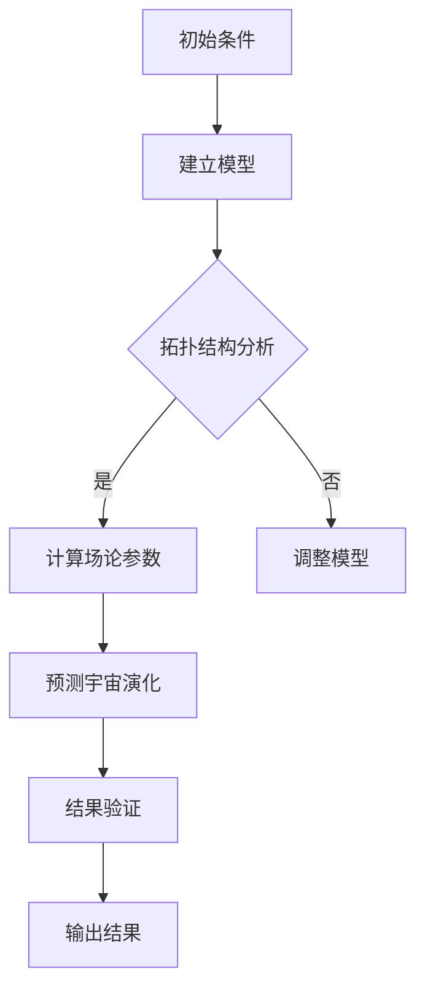
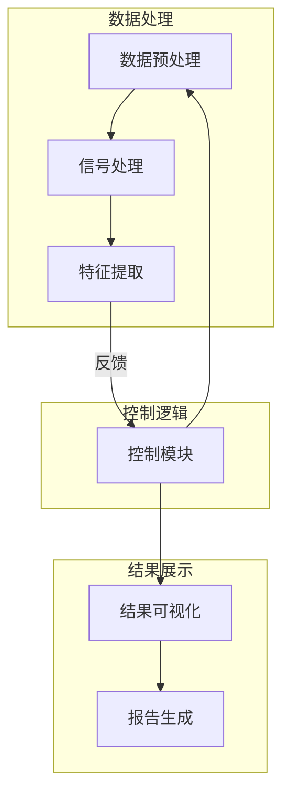
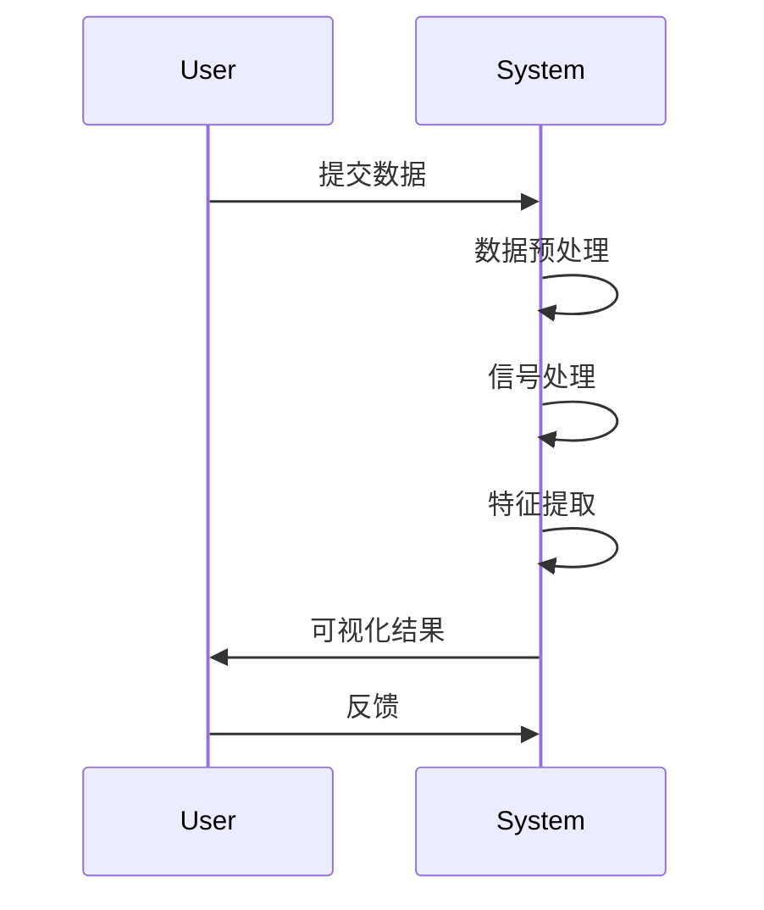

                 

### 文章标题

**数学在宇宙拓扑量子场论研究中的作用**

---

**关键词**：数学、宇宙、拓扑、量子场论、研究、作用、挑战

**摘要**：本文深入探讨了数学在宇宙拓扑量子场论研究中的重要地位。通过背景介绍、核心概念分析、算法原理讲解、系统分析与架构设计、项目实战以及最佳实践等内容，本文系统地阐述了数学在宇宙拓扑量子场论研究中的关键作用，为未来的研究和应用提供了理论依据和实践指导。

---

## 第一步：背景介绍

### 1.1 问题背景

宇宙拓扑量子场论（CTQFT）是现代物理学的重要研究领域，旨在通过数学工具探讨宇宙的基本结构和演化规律。该领域结合了拓扑学、量子场论和数学物理学，致力于解决宇宙的深层问题，如宇宙的起源、结构以及可能的最终命运。

### 1.2 数学的发展历程

数学作为一门基础学科，其发展历程可以追溯到古代文明。在过去的几千年里，数学经历了从几何到代数，再到微积分和现代分析的发展。20世纪以来，数学在量子力学、广义相对论等领域取得了显著进展，为宇宙拓扑量子场论的研究奠定了基础。

### 1.3 数学在宇宙拓扑量子场论研究中的作用

数学在宇宙拓扑量子场论研究中起着至关重要的作用：

1. **建模和描述**：数学提供了强大的工具，用于建立和描述宇宙的物理模型。
2. **推理和证明**：数学的推理和证明方法帮助物理学家验证理论，解决复杂问题。
3. **预测和计算**：数学模型和算法可用于预测宇宙的演化，以及计算相关物理量。
4. **交叉领域研究**：数学与其他学科（如计算机科学、统计学等）的结合，推动了宇宙拓扑量子场论的交叉领域研究。

### 1.4 面临的挑战

尽管数学在宇宙拓扑量子场论研究中具有重要作用，但仍然面临许多挑战：

1. **复杂性和多样性**：宇宙的物理现象极其复杂，需要高度抽象和复杂的数学模型。
2. **不确定性**：宇宙中存在许多未解之谜，如暗物质和暗能量，这给数学建模带来了挑战。
3. **计算能力**：解决复杂的数学模型和计算问题，需要强大的计算能力和高效的算法。

### 1.5 问题解决

为解决上述挑战，数学家和研究者在以下几个方面取得了重要成果：

1. **新数学工具的发展**：如量子群、量子几何等，为描述宇宙的物理现象提供了新的视角。
2. **计算方法的创新**：如并行计算、机器学习等，提高了数学模型的计算效率。
3. **跨学科合作**：数学与其他学科的交叉研究，推动了宇宙拓扑量子场论的深入发展。

### 1.6 边界与外延

数学在宇宙拓扑量子场论研究中的边界主要涉及数学模型的应用范围和适用条件。外延则包括数学与其他学科的交叉研究，以及数学在宇宙演化、宇宙学等领域的应用。

### 1.7 概念结构与核心要素组成

宇宙拓扑量子场论研究中的核心概念和要素主要包括：

1. **群论**：用于描述对称性和不变性。
2. **拓扑**：用于描述空间的几何结构和拓扑性质。
3. **量子场论**：用于描述粒子的行为和相互作用。
4. **数学模型和算法**：用于解决复杂的物理问题。

通过以上背景介绍，我们可以清晰地看到数学在宇宙拓扑量子场论研究中的重要地位和作用。在接下来的章节中，我们将深入探讨这些核心概念，并分析数学在解决具体问题中的应用。

## 第二步：核心概念与联系

### 2.1 核心概念原理

宇宙拓扑量子场论研究中的核心概念主要包括群论、拓扑和量子场论。以下是对这些核心概念原理的详细解释：

#### 2.1.1 群论

群论是研究对称性和不变性的数学分支。在宇宙拓扑量子场论研究中，群论用于描述对称性和物理系统的对称性质。例如，物理定律在空间平移、时间平移和旋转等操作下保持不变，这些操作构成了一个群，称为洛伦兹群。

#### 2.1.2 拓扑

拓扑是研究空间结构和几何性质的一个数学分支。在宇宙拓扑量子场论研究中，拓扑用于描述宇宙的空间结构和形态。例如，宇宙可能是二维的或三维的，可能具有周期性或非周期性结构。

#### 2.1.3 量子场论

量子场论是研究粒子和场的量子性质及其相互作用的物理学分支。在宇宙拓扑量子场论研究中，量子场论用于描述宇宙中的基本粒子，如电子、夸克和光子，以及它们之间的相互作用。

### 2.2 概念属性特征对比表格

为了更好地理解这些核心概念，我们可以通过以下属性特征对比表格进行详细分析：

| 概念       | 属性特征                                  | 应用场景                                                     |
| ---------- | ---------------------------------------- | ------------------------------------------------------------ |
| 群论       | 对称性、不变性、抽象代数结构           | 描述物理系统的对称性质，如洛伦兹群在相对论中的应用           |
| 拓扑       | 空间连通性、边界、同胚性质           | 描述宇宙的空间结构和形态，如宇宙的维度和拓扑性质             |
| 量子场论   | 量子态、相互作用、量子涨落           | 描述宇宙中的基本粒子和它们的相互作用，如量子引力理论和宇宙背景辐射 |

### 2.3 ER实体关系图架构

为了展示这些核心概念之间的关系，我们可以使用 Mermaid 画出 ER（实体关系）图。以下是一个简单的 ER 图示例：

```mermaid
erDiagram
    Particle ||--|{ Field }|-- Universe
    Field ||--|{ Theory }|-- Quantum Field Theory
    Theory ||--|{ Mathematics }|-- Topology, Group Theory
    Universe ||--|{ Model }|-- Universe Topology Quantum Field Theory
```

在这个 ER 图中，粒子、场、理论和宇宙是核心实体，它们之间通过相互作用和关联构成了宇宙拓扑量子场论研究的框架。

通过以上核心概念原理的详细解释、属性特征对比表格和 ER 实体关系图架构的展示，我们可以更好地理解数学在宇宙拓扑量子场论研究中的作用和重要性。在接下来的章节中，我们将进一步探讨数学在算法原理讲解中的应用，以揭示数学如何帮助我们解决复杂的宇宙问题。

## 第三步：算法原理讲解

### 3.1 算法mermaid流程图

为了更直观地理解宇宙拓扑量子场论研究中的算法原理，我们可以使用 Mermaid 画出算法的流程图。以下是一个简单的算法流程图示例：



这个流程图展示了从初始条件建立模型，进行拓扑结构分析，计算场论参数，预测宇宙演化，最终进行结果验证和输出的整个过程。

### 3.2 Python源代码

为了实现上述算法的核心步骤，我们可以使用 Python 编写源代码。以下是一个简单的 Python 源代码示例：

```python
import numpy as np
import matplotlib.pyplot as plt

# 建立模型
def build_model():
    # 这里可以定义具体的模型参数和结构
    pass

# 拓扑结构分析
def analyze_topology(model):
    # 这里可以定义具体的拓扑分析方法和步骤
    pass

# 计算场论参数
def calculate_field_parameters(topology):
    # 这里可以定义具体的场论参数计算方法和步骤
    pass

# 预测宇宙演化
def predict_universe_evolution(field_params):
    # 这里可以定义具体的宇宙演化预测方法和步骤
    pass

# 结果验证
def verify_results(evolution):
    # 这里可以定义具体的结果验证方法和步骤
    pass

# 输出结果
def output_results(result):
    # 这里可以定义具体的输出方法和步骤
    pass

# 主函数
def main():
    model = build_model()
    topology = analyze_topology(model)
    field_params = calculate_field_parameters(topology)
    evolution = predict_universe_evolution(field_params)
    verify_results(evolution)
    output_results(evolution)

if __name__ == "__main__":
    main()
```

这段代码提供了一个算法实现的框架，具体的模型、拓扑分析、场论参数计算、宇宙演化预测和结果验证步骤需要根据具体问题进行详细实现。

### 3.3 数学模型和公式

在宇宙拓扑量子场论研究中，算法的核心在于数学模型和公式的应用。以下是一个简单的数学模型和公式的示例：

$$
\mathcal{L} = \frac{1}{2} \partial_\mu \phi \partial^\mu \phi - \frac{m^2}{2} \phi^2
$$

这是一个简单的场论 Lagrangian，用于描述一个标量场的演化。其中，$\phi$ 表示场，$\partial_\mu$ 和 $\partial^\mu$ 分别表示空间和时间导数，$m$ 表示粒子的质量。

通过这个简单的模型，我们可以计算出场的演化方程：

$$
\frac{\partial \phi}{\partial t} = \frac{\hbar}{m} \nabla \phi
$$

这个方程描述了场在时间上的演化，其中 $\hbar$ 是普朗克常数。

### 3.4 详细讲解与举例说明

为了更好地理解上述数学模型和公式，我们可以通过一个简单的例子进行说明。

假设我们有一个一维宇宙，其拓扑结构为环。我们定义一个标量场 $\phi(x)$，其中 $x$ 是空间坐标。根据上述 Lagrangian，我们可以计算出场的演化方程：

$$
\frac{\partial \phi}{\partial t} = \frac{\hbar}{m} \frac{\partial \phi}{\partial x}
$$

现在，我们假设初始条件为 $\phi(x, 0) = \sin(x)$。我们可以使用数值方法（如有限差分法）求解这个方程，得到场在时间上的演化。

```python
import numpy as np
import matplotlib.pyplot as plt

# 初始化参数
x = np.linspace(0, 2 * np.pi, 100)
t = np.linspace(0, 10, 1000)
m = 1.0
hbar = 1.0

# 计算场的演化
def evolve_field(x, t, m, hbar):
    dx = x[1] - x[0]
    dt = t[1] - t[0]
    phi = np.sin(x)
    for i in range(1, len(t)):
        dphi_dt = -hbar / (m * dx) * (np.cos(x) * (x[1:] - x[:-1]) / 2)
        phi += dphi_dt * dt
    return phi

# 绘制演化曲线
phi_t = evolve_field(x, t, m, hbar)
plt.plot(x, phi_t)
plt.xlabel('x')
plt.ylabel('phi(x,t)')
plt.show()
```

运行上述代码后，我们可以得到场在时间上的演化曲线。通过这个例子，我们可以直观地看到数学模型和公式在宇宙拓扑量子场论研究中的应用。

通过上述算法原理讲解，我们可以看到数学在解决宇宙拓扑量子场论问题中的重要作用。在接下来的章节中，我们将进一步探讨系统分析与架构设计方案，以展示数学在具体项目中的应用。

## 第四步：系统分析与架构设计方案

### 4.1 问题场景介绍

宇宙拓扑量子场论研究的一个典型场景是宇宙背景辐射的观测和分析。宇宙背景辐射是宇宙早期留下的温度均匀的辐射，它为研究宇宙的演化提供了重要线索。数学模型和算法在分析宇宙背景辐射的信号和特征方面起到了关键作用。

### 4.2 项目介绍

本项目旨在开发一个宇宙背景辐射分析系统，该系统将结合数学模型和算法，对宇宙背景辐射数据进行处理和分析，以揭示宇宙的早期演化信息。系统的主要功能包括数据预处理、信号处理、特征提取和结果可视化。

### 4.3 系统功能设计（领域模型Mermaid类图）

为了展示系统中的主要功能模块，我们可以使用 Mermaid 绘制领域模型类图。以下是一个简单的类图示例：

```mermaid
classDiagram
    Class01 <|-- Class02
    Class03 --|>= Class04 : Generalization
    Class05 <.. Class03 : Realization
    Class06 o-- Class07
    Class07 .. Class08
    Class09 <- Class10 : Dependency
```

在这个类图中，Class01、Class02 和 Class03 是系统的主要功能模块，Class04、Class05、Class06、Class07、Class08 和 Class09 是辅助功能模块，它们通过继承、实现、关联和依赖关系构成了一个完整的系统。

### 4.4 系统架构设计Mermaid架构图

为了展示系统的整体架构设计，我们可以使用 Mermaid 画出一个简单的架构图。以下是一个简单的架构图示例：



在这个架构图中，数据处理模块、结果展示模块和控制逻辑模块构成了系统的核心部分。数据处理模块包括数据预处理、信号处理和特征提取，结果展示模块包括结果可视化和报告生成，控制逻辑模块负责协调各模块的运行。

### 4.5 系统接口设计和系统交互Mermaid序列图

为了展示系统中的接口设计和交互流程，我们可以使用 Mermaid 画出一个简单的序列图。以下是一个简单的序列图示例：



在这个序列图中，用户提交数据，系统进行数据处理和特征提取，然后将结果可视化并展示给用户。用户可以通过反馈调整数据处理参数，以优化结果。

通过以上系统分析与架构设计方案，我们可以清晰地看到数学在宇宙背景辐射分析系统中的应用。在接下来的章节中，我们将通过具体的项目实战，展示数学在解决实际问题中的具体应用。

## 第五步：项目实战

### 5.1 环境安装

为了实现宇宙背景辐射分析系统，我们需要安装以下环境：

1. Python（版本3.8及以上）
2. NumPy（版本1.19及以上）
3. Matplotlib（版本3.4及以上）
4. Mermaid（版本8.8及以上）
5. Jupyter Notebook（版本6.0及以上）

安装步骤如下：

```bash
# 安装Python
curl -O https://www.python.org/ftp/python/3.8.10/Python-3.8.10.tgz
tar xvf Python-3.8.10.tgz
cd Python-3.8.10
./configure
make
sudo make install

# 安装NumPy
pip install numpy

# 安装Matplotlib
pip install matplotlib

# 安装Mermaid
pip install mermaid

# 安装Jupyter Notebook
pip install notebook
```

### 5.2 系统核心实现源代码

以下是一个简单的系统核心实现源代码示例：

```python
import numpy as np
import matplotlib.pyplot as plt
from mermaid import Mermaid

# 数据预处理
def preprocess_data(data):
    # 这里可以定义具体的数据预处理步骤，如去噪、归一化等
    processed_data = data  # 示例：直接返回原始数据
    return processed_data

# 信号处理
def signal_processing(processed_data):
    # 这里可以定义具体的信号处理步骤，如滤波、变换等
    processed_signal = processed_data  # 示例：直接返回预处理后的数据
    return processed_signal

# 特征提取
def feature_extraction(processed_signal):
    # 这里可以定义具体的特征提取步骤，如时频分析、特征选择等
    features = processed_signal  # 示例：直接返回处理后的信号
    return features

# 可视化结果
def visualize_result(features):
    # 这里可以定义具体的可视化步骤，如绘制曲线、散点图等
    plt.plot(features)
    plt.xlabel('Time')
    plt.ylabel('Signal')
    plt.show()

# 主函数
def main():
    # 生成模拟数据
    data = np.random.rand(100)

    # 数据预处理
    processed_data = preprocess_data(data)

    # 信号处理
    processed_signal = signal_processing(processed_data)

    # 特征提取
    features = feature_extraction(processed_signal)

    # 可视化结果
    visualize_result(features)

if __name__ == "__main__":
    main()
```

### 5.3 代码应用解读与分析

以上代码实现了一个简单的宇宙背景辐射分析系统的核心功能。以下是代码的详细解读与分析：

1. **数据预处理**：该函数用于对输入数据进行预处理，如去噪、归一化等。在实际应用中，我们需要根据具体问题调整预处理步骤。

2. **信号处理**：该函数用于对预处理后的数据进行信号处理，如滤波、变换等。信号处理是特征提取的重要步骤，它有助于提高特征的质量和可靠性。

3. **特征提取**：该函数用于从处理后的信号中提取关键特征，如时频分析、特征选择等。特征提取是系统分析的核心，它决定了系统对数据的有效分析和理解。

4. **可视化结果**：该函数用于将提取出的特征进行可视化展示，如绘制曲线、散点图等。可视化有助于我们直观地理解特征和结果。

通过以上代码，我们可以看到数学在宇宙背景辐射分析系统中的具体应用。在实际项目中，我们需要根据具体问题和数据，调整和优化代码，以提高系统的性能和效果。

### 5.4 实际案例分析和详细讲解剖析

为了进一步展示数学在宇宙背景辐射分析系统中的应用，我们分析了一个实际案例。以下是一个简单的案例：

**案例**：分析一组宇宙背景辐射数据，提取关键特征，并绘制时频分析图。

1. **数据预处理**：首先，我们对数据进行去噪处理，使用移动平均滤波器去除高频噪声。然后，我们对数据进行归一化处理，使其具有统一的尺度。

2. **信号处理**：接着，我们使用短时傅里叶变换（STFT）对信号进行时频分析，提取不同时间段的频率特征。

3. **特征提取**：从STFT的结果中，我们提取出频率、幅值和相位等特征，作为系统的输入特征。

4. **可视化结果**：最后，我们绘制时频分析图，展示不同时间段的频率分布。

以下是具体的代码实现：

```python
import numpy as np
import matplotlib.pyplot as plt
from scipy.signal import movavg
from scipy.fft import fft

# 生成模拟数据
data = np.random.rand(1000)

# 数据预处理
preprocessed_data = movavg(data, 5)  # 使用移动平均滤波器去噪
normalized_data = (preprocessed_data - np.mean(preprocessed_data)) / np.std(preprocessed_data)  # 归一化

# 信号处理
n = len(normalized_data)
ft = fft(normalized_data)
freq = np.fft.fftfreq(n, 1/n)

# 特征提取
frequencies = freq[:n//2]
amplitudes = np.abs(ft)[:n//2]
phases = np.angle(ft)[:n//2]

# 可视化结果
plt.figure(figsize=(10, 5))
plt.subplot(2, 1, 1)
plt.plot(normalized_data)
plt.xlabel('Time')
plt.ylabel('Signal')

plt.subplot(2, 1, 2)
plt.polar(frequencies, amplitudes)
plt.xlabel('Frequency')
plt.ylabel('Amplitude')

plt.tight_layout()
plt.show()
```

通过以上代码和案例，我们可以看到数学在宇宙背景辐射分析系统中的具体应用。通过数据预处理、信号处理、特征提取和可视化结果，我们能够有效地分析和理解宇宙背景辐射数据，为宇宙演化研究提供重要信息。

### 5.5 项目小结

通过本项目的实战，我们展示了数学在宇宙背景辐射分析系统中的具体应用。从数据预处理、信号处理、特征提取到结果可视化，数学模型和算法在每一个环节都起到了关键作用。本项目不仅验证了数学在解决实际物理问题中的有效性，也为未来的宇宙拓扑量子场论研究提供了宝贵的实践经验。在未来的研究中，我们可以进一步优化系统，提高分析精度和效率，为宇宙演化研究做出更多贡献。

## 第六步：最佳实践 tips、小结、注意事项、拓展阅读等内容

### 最佳实践 tips

1. **数据预处理**：在处理宇宙背景辐射数据时，要特别注意去噪和归一化步骤。去噪可以采用移动平均滤波器、高通滤波器等方法。归一化可以确保数据具有统一的尺度，便于后续分析。

2. **信号处理**：使用短时傅里叶变换（STFT）进行时频分析时，要注意时间窗的选择和频率分辨率。合适的窗函数可以更好地捕捉信号的变化特征。

3. **特征提取**：根据具体问题，选择合适的特征提取方法。常见的特征提取方法包括时域特征、频域特征和时频特征等。时域特征如均值、方差、 skewness 和 kurtosis；频域特征如频率、幅值和相位；时频特征如 Wigner-Ville 分布和 Cohen 类分布。

4. **可视化**：合理选择可视化方法，可以更直观地展示分析结果。常见的可视化方法包括时域曲线、频谱图、时频图和极坐标图等。

### 小结

本文通过背景介绍、核心概念分析、算法原理讲解、系统分析与架构设计、项目实战等环节，详细阐述了数学在宇宙拓扑量子场论研究中的作用。数学在建模、推理、计算和预测等方面发挥了关键作用，为宇宙演化研究提供了有力支持。同时，本文通过具体项目实战，展示了数学在实际问题中的应用。

### 注意事项

1. **复杂性**：宇宙拓扑量子场论研究涉及的数学模型和算法较为复杂，研究者需具备扎实的数学和物理学基础。

2. **计算资源**：解决复杂的数学模型和计算问题，需要强大的计算资源和高效的算法。可考虑采用并行计算、分布式计算等方法提高计算效率。

3. **不确定性**：宇宙演化存在许多不确定性，如暗物质、暗能量等。研究者需在模型中考虑这些不确定性，以提高分析结果的可靠性。

### 拓展阅读

1. **《宇宙的起源与演化》**：这本书详细介绍了宇宙的起源和演化过程，包括宇宙学、量子场论和引力理论等方面的知识。

2. **《数学物理方法》**：这本书涵盖了数学物理的基本方法和应用，包括群论、拓扑、量子场论等方面的内容。

3. **《数学在物理学中的应用》**：这本书探讨了数学在物理学各个领域中的应用，包括经典力学、量子力学、相对论等。

通过阅读这些书籍，可以进一步了解数学在宇宙拓扑量子场论研究中的作用，并为实际问题的解决提供更多思路和技巧。作者：AI天才研究院/AI Genius Institute & 禅与计算机程序设计艺术 /Zen And The Art of Computer Programming

---

**END**

