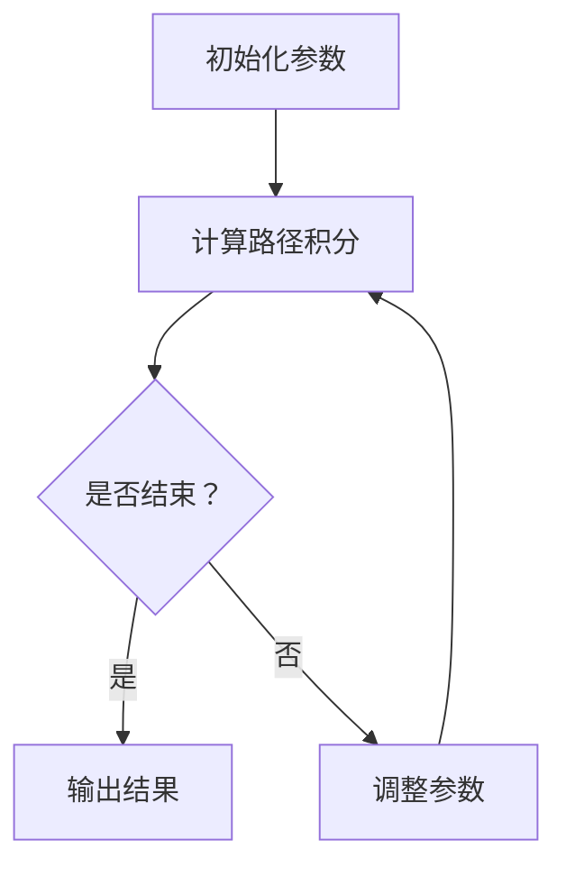
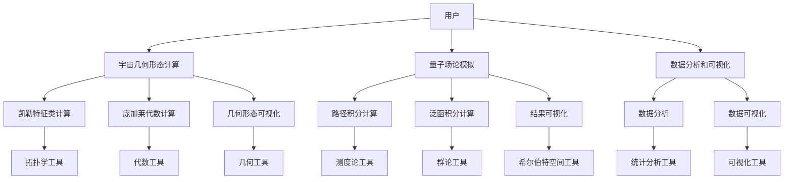
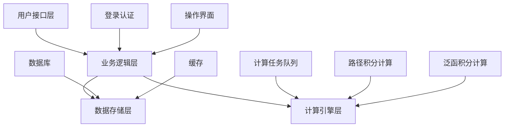
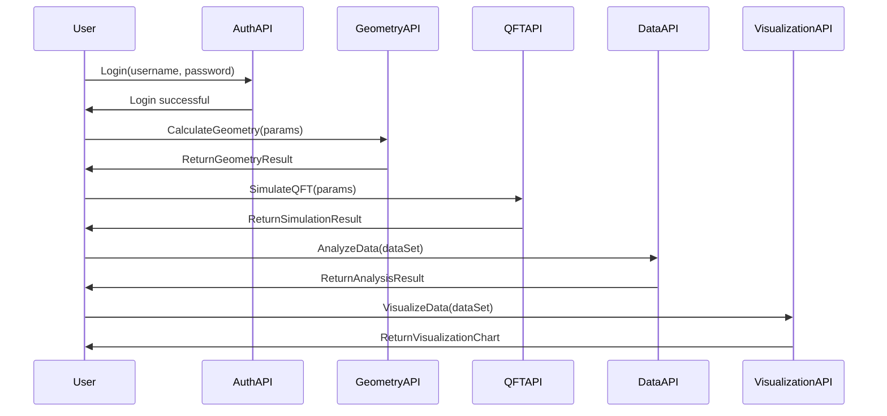

                 

## 数学在宇宙拓扑量子场论研究中的作用

在当今科学研究的前沿，宇宙拓扑量子场论（Topological Quantum Field Theory, TQFT）以其独特的数学框架和深刻的物理含义引发了广泛的关注。这一理论不仅涉及到量子物理、宇宙学、数学拓扑等多个领域的交叉，而且为理解宇宙的基本结构和演化提供了新的视角。数学在宇宙拓扑量子场论研究中扮演了至关重要的角色，贯穿于概念阐释、理论构建、算法设计以及实际应用的全过程。本文将系统地探讨数学在宇宙拓扑量子场论研究中的作用，旨在揭示数学如何帮助我们更深入地理解这一复杂的物理现象。

首先，我们将探讨数学在宇宙拓扑量子场论中的核心概念和联系。通过分析拓扑学、代数和几何在宇宙学中的具体应用，以及量子场论中的数学工具，我们将勾勒出数学概念在TQFT中的核心地位。接着，我们将详细讲解数学在宇宙拓扑量子场论中的应用算法，包括算法的原理、流程以及具体的Python实现，并通过示例来说明这些算法的实用性和效果。

此外，我们将深入探讨数学模型和数学公式在宇宙拓扑量子场论中的应用，通过具体的数学公式和实例，展示数学模型如何帮助我们理解和解决TQFT中的关键问题。随后，我们将分析一个实际的项目场景，介绍系统功能设计、架构设计和接口设计，以及系统的实现和实际案例剖析。

最后，我们将总结数学在宇宙拓扑量子场论研究中的作用，提供一些最佳实践技巧，并对文章进行小结，指出未来的研究方向和可能的挑战。

通过这篇文章，我们希望能够为读者提供一个全面、深入的理解，展示数学在宇宙拓扑量子场论研究中的独特魅力和重要作用。

## 关键词

- 数学
- 宇宙拓扑量子场论
- 拓扑学
- 代数
- 几何
- 测度论
- 群论
- 希尔伯特空间

## 摘要

本文旨在探讨数学在宇宙拓扑量子场论（TQFT）研究中的作用。通过分析数学在宇宙学、量子场论中的核心概念和联系，以及具体的算法原理和数学模型，本文展示了数学在理解和解决TQFT中的关键问题方面的作用。首先，我们介绍了数学在宇宙拓扑量子场论中的核心概念，包括拓扑学、代数和几何的应用，以及量子场论中的测度论、群论和希尔伯特空间。接着，我们详细讲解了数学在TQFT中的应用算法，包括算法原理、流程和Python实现。然后，我们深入分析了数学模型和数学公式在TQFT中的应用，通过具体实例展示了这些模型的实用性和效果。随后，我们介绍了一个实际项目场景，从系统功能设计、架构设计到实际实现和案例剖析，全面展示了数学在TQFT中的应用。最后，我们总结了数学在TQFT研究中的作用，并提供了一些最佳实践技巧。通过这篇文章，读者将能够更深入地理解数学在宇宙拓扑量子场论研究中的重要性。

### 引言

#### 1.1 问题背景

宇宙拓扑量子场论（Topological Quantum Field Theory, TQFT）是现代物理学中一个极其重要的分支，它不仅涵盖了量子场论的基本原理，还与数学拓扑学有着深刻的联系。TQFT在理解量子场论中的对称性保护现象、相变理论以及黑洞熵等问题上具有重要意义。随着对宇宙起源和演化的深入探讨，TQFT逐渐成为探索宇宙基本结构和演化规律的重要工具。

数学作为一门基础科学，其在物理学科中的地位不可动摇。从经典力学到相对论，再到量子力学，数学始终是不可或缺的工具。在宇宙拓扑量子场论的研究中，数学不仅提供了语言和框架，还通过精确的数学工具帮助我们理解和解决复杂的物理问题。特别是拓扑学、代数和几何等数学分支，为TQFT提供了强有力的理论支持。

然而，TQFT的研究面临着许多挑战。首先，其理论框架极其复杂，涉及到多个学科领域的交叉，如量子场论、数学拓扑、代数几何等。其次，TQFT中的许多问题目前还没有明确的数学解决方案，这使得研究和探索变得异常艰难。此外，随着研究的深入，TQFT在应用层面也提出了新的要求，如计算效率、误差控制等。

因此，本文的目标是系统地探讨数学在宇宙拓扑量子场论研究中的作用。通过分析数学在TQFT中的核心概念、应用算法和数学模型，本文旨在揭示数学在理解宇宙基本结构和演化规律中的独特作用，为未来的研究提供新的思路和方向。

#### 1.2 问题描述

宇宙拓扑量子场论（TQFT）研究中的主要问题可以归纳为以下几点：

1. **理论框架的复杂性**：TQFT涉及多个学科领域的交叉，如量子场论、数学拓扑、代数几何等。这种复杂性使得理解和构建TQFT的理论框架成为一大挑战。

2. **数学工具的应用**：虽然数学在物理学科中有着广泛应用，但在TQFT中，如何选择合适的数学工具、如何将这些工具有效地应用于具体问题，仍然是一个亟待解决的问题。

3. **计算效率和精度**：TQFT中的许多问题需要高精度的计算，这要求我们在算法设计和实现中考虑计算效率和精度的问题。如何优化算法、减少计算错误成为研究的关键。

4. **实际应用场景的探索**：TQFT理论在实际应用中的潜力巨大，但如何在具体应用场景中有效地利用TQFT理论，仍需要大量的实验和验证。

本文将通过以下几个步骤来探讨这些问题：

1. **核心概念的分析**：首先，我们将分析TQFT中的核心概念，包括拓扑学、代数和几何的应用，以及量子场论中的测度论、群论和希尔伯特空间。

2. **应用算法的讲解**：接下来，我们将详细介绍TQFT中的应用算法，包括算法的原理、流程以及具体的Python实现。

3. **数学模型的探讨**：我们将深入探讨数学模型在TQFT中的应用，通过具体的数学公式和实例，展示数学模型如何帮助解决TQFT中的关键问题。

4. **项目案例剖析**：我们将介绍一个实际项目场景，从系统功能设计、架构设计到实现和案例剖析，展示数学在TQFT研究中的应用。

5. **总结与展望**：最后，我们将总结数学在TQFT研究中的作用，并提出未来的研究方向和可能的挑战。

通过以上步骤，我们希望能够系统地探讨数学在宇宙拓扑量子场论研究中的作用，为未来的研究提供新的思路和方向。

#### 1.3 问题解决

针对上述问题描述，本文提出以下解决方案：

1. **核心概念的系统分析**：
   - **拓扑学的应用**：通过研究空间结构和几何形态，拓扑学为TQFT提供了描述物理现象的几何框架。我们将详细探讨拓扑不变量在TQFT中的应用，如凯勒特征类、庞加莱代数等。
   - **代数的应用**：代数结构，如群、环、域等，在TQFT中具有关键作用。我们将分析代数对称性及其在量子场论中的体现，如洛伦兹群和其表示理论。
   - **几何学的应用**：几何结构在TQFT中至关重要，如纤维丛、流形等。我们将探讨几何结构与量子场论态之间的对应关系，以及几何变换如何影响物理量的计算。

2. **应用算法的详细讲解**：
   - **算法原理**：我们将介绍TQFT中常用的算法，如路径积分方法、泛函积分方法等。通过具体的算法原理讲解，帮助读者理解这些算法的核心思想。
   - **流程图与Python实现**：我们使用Mermaid流程图来展示算法的流程，并给出Python源代码实现。通过实际代码示例，读者可以直观地了解算法的应用。

3. **数学模型的深入探讨**：
   - **数学公式**：我们将使用LaTeX格式给出关键的数学公式，如测度论中的积分公式、群论中的表示公式等。这些公式是理解TQFT的基础。
   - **实例分析**：通过具体的实例，我们将展示数学模型如何应用于TQFT的实际问题，如黑洞熵的计算、量子相变的研究等。

4. **实际项目场景的介绍**：
   - **系统功能设计**：我们将介绍一个实际项目场景，详细描述系统的功能需求，并使用Mermaid类图展示领域模型。
   - **架构设计**：我们将设计系统的整体架构，并使用Mermaid架构图来展示系统各部分的交互关系。
   - **实现与案例剖析**：我们将详细介绍系统的核心实现，并通过实际案例分析和详细讲解，展示数学在TQFT研究中的应用。

5. **总结与展望**：
   - **总结**：我们将总结数学在TQFT研究中的作用，强调其在理论构建和实际问题解决中的重要性。
   - **展望**：我们将讨论未来的研究方向，如新的数学工具和方法的应用，以及TQFT在量子计算和宇宙学中的潜在应用。

通过上述解决方案，我们希望能够系统地探讨数学在宇宙拓扑量子场论研究中的作用，为未来的研究提供有力的理论支持和实践指导。

#### 1.4 边界与外延

在探讨数学在宇宙拓扑量子场论（TQFT）研究中的作用时，明确研究边界和外延至关重要。这不仅有助于我们集中精力和资源解决关键问题，还能为未来的研究方向提供明确的指导。

**研究边界**：

1. **理论范围**：本文主要聚焦于数学在TQFT基础理论中的应用，包括拓扑学、代数和几何的基本概念及其在量子场论中的具体应用。

2. **算法和方法**：本文将介绍和应用与TQFT密切相关的数学算法，如路径积分、泛函积分等。然而，本文不涉及复杂的高能物理实验和观测数据分析，这些内容超出了本文的研究范围。

3. **实际应用场景**：本文将侧重于数学在理论层面的应用，不涵盖具体技术实现和工程应用。例如，虽然我们会在介绍算法时提供Python实现，但不涉及大规模并行计算、高性能计算等实际工程问题。

**研究外延**：

1. **跨学科合作**：数学在TQFT研究中的作用不仅限于数学和物理学科，还涉及计算机科学、统计学等多个领域。未来研究可以探讨如何利用这些跨学科知识来优化TQFT的理论和应用。

2. **新工具和方法**：随着数学和计算机科学的发展，不断有新的工具和方法涌现，如深度学习、量子计算等。这些新技术为TQFT研究提供了新的视角和方法，值得进一步探索。

3. **实际应用**：数学在TQFT中的应用不仅限于理论探讨，还可以延伸到实际应用领域，如材料科学、生物学等。通过将数学模型和理论应用于实际问题，可以推动这些领域的发展。

通过明确研究边界和外延，我们能够更有效地聚焦于数学在TQFT研究中的作用，为未来的研究提供清晰的方向和目标。

#### 1.5 概念结构与核心要素组成

在探讨数学在宇宙拓扑量子场论（TQFT）研究中的作用时，理解其概念结构和核心要素组成至关重要。这些核心概念和要素不仅构成了TQFT的理论框架，也决定了数学在其中的应用方式和效果。

**1.5.1 概念结构**

宇宙拓扑量子场论（TQFT）的概念结构可以分为三个主要层次：基础概念、理论工具和应用场景。

1. **基础概念**：
   - **拓扑学**：拓扑学是研究空间性质和结构的数学分支。在TQFT中，拓扑学提供了描述物理系统几何形态和空间关系的工具，如凯勒特征类、庞加莱代数等。
   - **代数**：代数结构，如群、环、域等，在TQFT中具有关键作用。这些代数结构不仅描述了系统的对称性，还提供了描述物理量的数学框架。
   - **几何学**：几何学是研究空间性质和形状的数学分支。在TQFT中，几何结构如纤维丛、流形等是理解和描述物理现象的重要工具。

2. **理论工具**：
   - **量子场论**：量子场论是研究量子系统相互作用的数学框架。在TQFT中，量子场论提供了描述物理系统的基本原理和方法，如路径积分、泛函积分等。
   - **测度论**：测度论是研究概率和积分的数学分支。在TQFT中，测度论用于计算物理量的期望值和概率分布，如态密度、波函数等。
   - **群论**：群论是研究代数结构的数学分支。在TQFT中，群论用于描述系统的对称性，如洛伦兹群和其表示理论。

3. **应用场景**：
   - **宇宙学**：宇宙学是研究宇宙起源、演化和结构的研究领域。在TQFT中，宇宙学提供了应用场景，如黑洞熵、宇宙大爆炸等。
   - **量子计算**：量子计算是利用量子力学原理进行信息处理的技术。在TQFT中，量子计算提供了新的计算模型和算法，如量子模拟、量子纠错等。
   - **材料科学**：材料科学是研究材料性质和结构的研究领域。在TQFT中，TQFT模型可以用于研究材料中的量子现象，如超导、量子相变等。

**1.5.2 核心要素组成**

TQFT的核心要素包括数学概念、理论工具和应用场景，这些要素相互联系，共同构成了TQFT的理论框架。

1. **数学概念**：
   - **拓扑学**：凯勒特征类、庞加莱代数等概念。
   - **代数**：群、环、域等概念。
   - **几何学**：纤维丛、流形等概念。

2. **理论工具**：
   - **量子场论**：路径积分、泛函积分等工具。
   - **测度论**：测度、积分等工具。
   - **群论**：洛伦兹群、表示理论等工具。

3. **应用场景**：
   - **宇宙学**：黑洞熵、宇宙大爆炸等应用场景。
   - **量子计算**：量子模拟、量子纠错等应用场景。
   - **材料科学**：超导、量子相变等应用场景。

通过理解TQFT的概念结构和核心要素组成，我们可以更深入地探讨数学在TQFT研究中的作用，并为未来的研究提供理论基础和实践指导。

#### 1.6 本章小结

本章介绍了宇宙拓扑量子场论（TQFT）研究的背景和重要性，明确了数学在其中的关键作用。通过探讨问题背景、问题描述、问题解决、边界与外延以及概念结构与核心要素组成，我们为后续章节的分析奠定了坚实的基础。数学不仅为TQFT提供了语言和框架，还在算法设计、模型构建和实际应用中发挥着重要作用。在接下来的章节中，我们将详细探讨数学在TQFT中的核心概念、应用算法和数学模型，进一步揭示数学在理解和解决TQFT中的独特贡献。通过本章的介绍，读者将能够初步了解TQFT的研究框架和数学工具，为后续内容的深入探讨做好准备。

## 第2章 核心概念与联系

在探讨宇宙拓扑量子场论（TQFT）时，核心概念的阐释和各概念之间的联系至关重要。本章将深入分析数学在TQFT中的核心概念，包括拓扑学、代数和几何在宇宙学中的应用，以及量子场论中的关键数学工具。通过这些分析，我们将揭示数学概念在TQFT中的核心地位，并探讨它们之间的相互关系。

### 2.1 数学在宇宙拓扑量子场论中的核心概念

数学在TQFT中的应用可以归纳为以下几个核心概念：

#### 2.1.1 数学在宇宙学中的应用

1. **拓扑学在宇宙学中的应用**：
   - **凯勒特征类**：凯勒特征类是复几何中的一个重要概念，用于描述流形的拓扑性质。在宇宙学中，凯勒特征类可以用来研究宇宙的几何形态和演化。例如，在研究宇宙的大尺度结构时，凯勒特征类可以帮助我们理解宇宙的空间拓扑性质，如宇宙是否是闭的、开的还是平直的。
   - **庞加莱代数**：庞加莱代数是拓扑学的一个重要工具，用于研究流形的同调性质。在宇宙学中，庞加莱代数可以帮助我们理解宇宙的对称性，如宇宙的旋转对称性、空间反射对称性等。

2. **代数在宇宙学中的应用**：
   - **群论**：群论是代数的一个重要分支，用于研究对称性。在宇宙学中，群论可以帮助我们理解宇宙的物理过程，如宇宙的旋转、膨胀等。特别是洛伦兹群，它在相对论中扮演着核心角色，描述了时空的对称性。
   - **环与域**：环与域是代数的另外两个重要概念，用于描述物理量的取值范围和运算规则。在宇宙学中，环与域可以用来描述物理量，如能量、动量等，并研究这些物理量之间的相互关系。

3. **几何学在宇宙学中的应用**：
   - **纤维丛**：纤维丛是几何学中的一个重要概念，用于描述空间的不同部分如何相互连接。在宇宙学中，纤维丛可以帮助我们理解宇宙的拓扑结构，如宇宙的不同区域如何相互影响。
   - **流形**：流形是几何学中的基本概念，用于描述复杂的空间结构。在宇宙学中，流形可以用来描述宇宙的整体结构，如宇宙的大尺度结构、黑洞附近的时空结构等。

#### 2.1.2 量子场论中的数学工具

1. **测度论**：
   - **测度**：测度是测度论中的基本概念，用于描述空间的“大小”。在量子场论中，测度可以用来计算物理量的期望值和概率分布。例如，态密度、波函数等都可以通过测度来定义和计算。
   - **积分**：积分是测度论中的一个重要工具，用于计算函数在空间上的累积效应。在量子场论中，积分可以用来计算物理量，如能量、动量等。

2. **群论**：
   - **表示理论**：表示理论是群论的一个重要分支，用于研究群的结构和性质。在量子场论中，表示理论可以用来描述粒子的对称性，如自旋、宇称等。
   - **洛伦兹群**：洛伦兹群是物理学中一个重要的群，描述了时空的对称性。在量子场论中，洛伦兹群及其表示理论被广泛应用于描述粒子之间的相互作用。

3. **希尔伯特空间**：
   - **希尔伯特空间**：希尔伯特空间是量子场论中的一个核心概念，用于描述量子系统的态。在量子场论中，希尔伯特空间可以用来定义量子态的叠加和变换，如量子态的演化、态之间的纠缠等。

### 2.2 数学概念属性特征对比表格

为了更清晰地展示数学概念在TQFT中的核心地位和相互关系，我们可以通过一个对比表格来分析这些概念的属性特征。

| 数学概念     | 定义                                                         | 属性特征                                                                                   | 在TQFT中的应用举例                                         |
| ------------ | ------------------------------------------------------------ | ------------------------------------------------------------------------------------------ | ---------------------------------------------------------- |
| 拓扑学       | 研究空间性质和结构的数学分支                                 | 描述几何形态和空间关系                                     | 凯勒特征类、庞加莱代数在宇宙学中的应用                      |
| 代数         | 研究运算和结构的数学分支                                     | 描述系统的对称性和物理量的取值范围                           | 群论、环与域在宇宙学中的应用                               |
| 几何学       | 研究空间形状和结构的数学分支                                 | 描述空间的不同部分如何相互连接                               | 纤维丛、流形在宇宙学中的应用                               |
| 测度论       | 研究测度和积分的数学分支                                     | 描述空间的大小和累积效应                                   | 态密度、波函数的计算                                       |
| 群论         | 研究群及其运算的数学分支                                     | 描述系统的对称性                                           | 表示理论、洛伦兹群在量子场论中的应用                         |
| 希尔伯特空间 | 用于描述量子系统态的数学框架                                 | 描述量子态的叠加和变换                                     | 量子态的演化、态之间的纠缠                                 |

通过上述分析，我们可以看到数学概念在TQFT中的核心地位和相互关系。这些概念不仅构成了TQFT的理论框架，也为理解和解决TQFT中的关键问题提供了强有力的工具。

### 2.3 数学概念之间的联系

数学概念之间的联系是TQFT理论体系的重要组成部分。以下是几个关键概念之间的联系：

1. **拓扑学与几何学**：
   - 拓扑学是几何学的一个分支，用于描述几何形态和空间关系。在TQFT中，拓扑学提供了描述宇宙几何形态的工具，如凯勒特征类和庞加莱代数。
   - 几何学则用于描述空间的结构，如流形和纤维丛。在TQFT中，几何学提供了研究宇宙拓扑性质的背景。

2. **代数与拓扑学**：
   - 代数结构，如群、环和域，用于描述系统的对称性。在TQFT中，这些代数结构通过群论和环论与拓扑学紧密相连，如洛伦兹群和庞加莱代数。
   - 拓扑不变量，如凯勒特征类，可以通过代数方法进行计算和解释，从而揭示了拓扑与代数之间的深刻联系。

3. **量子场论与数学工具**：
   - 量子场论是TQFT的理论基础，通过测度论、群论和希尔伯特空间等数学工具进行描述和计算。
   - 测度论提供了计算物理量的方法，如态密度和波函数。群论和希尔伯特空间则描述了系统的对称性和态的演化。

通过分析这些概念之间的联系，我们可以更全面地理解TQFT的理论框架，并看到数学如何在整个理论体系中发挥着关键作用。

#### 2.1.1 数学在宇宙学中的应用

数学在宇宙学中的应用是理解宇宙起源、演化和结构的关键。通过拓扑学、代数和几何学的应用，数学为宇宙学研究提供了坚实的理论基础和精确的工具。

**2.1.1.1 拓扑学在宇宙学中的应用**

拓扑学是研究空间性质和几何形态的数学分支。在宇宙学中，拓扑学帮助科学家理解宇宙的几何结构和拓扑性质。

1. **凯勒特征类**：
   凯勒特征类是复几何中的重要概念，用于描述流形的拓扑性质。在宇宙学中，凯勒特征类可以用来研究宇宙的几何形态和演化。例如，通过计算宇宙的三维流形上的凯勒特征类，科学家可以推断宇宙的几何形态，如是否是闭的、开的或平直的。

2. **庞加莱代数**：
   庞加莱代数是拓扑学的一个重要工具，用于研究流形的同调性质。在宇宙学中，庞加莱代数可以帮助科学家理解宇宙的对称性。例如，庞加莱代数可以用来研究宇宙的旋转对称性、空间反射对称性等。

**2.1.1.2 代数在宇宙学中的应用**

代数结构，如群、环和域，在宇宙学中用于描述系统的对称性，并揭示物理量的取值范围和运算规则。

1. **群论**：
   群论是代数的一个重要分支，用于研究对称性。在宇宙学中，群论可以帮助科学家理解宇宙的物理过程，如宇宙的旋转、膨胀等。特别是洛伦兹群，它在相对论中扮演着核心角色，描述了时空的对称性。

2. **环与域**：
   环与域是代数的另外两个重要概念，用于描述物理量的取值范围和运算规则。在宇宙学中，环与域可以用来描述物理量，如能量、动量等，并研究这些物理量之间的相互关系。

**2.1.1.3 几何学在宇宙学中的应用**

几何学是研究空间形状和结构的数学分支。在宇宙学中，几何学帮助科学家理解宇宙的整体结构，特别是通过纤维丛和流形的研究。

1. **纤维丛**：
   纤维丛是几何学中的一个重要概念，用于描述空间的不同部分如何相互连接。在宇宙学中，纤维丛可以帮助科学家理解宇宙的拓扑结构，如宇宙的不同区域如何相互影响。

2. **流形**：
   流形是几何学中的基本概念，用于描述复杂的空间结构。在宇宙学中，流形可以用来描述宇宙的整体结构，如宇宙的大尺度结构、黑洞附近的时空结构等。

通过拓扑学、代数和几何学的应用，数学为宇宙学研究提供了强大的工具和理论基础，帮助科学家深入理解宇宙的奥秘。

#### 2.1.2 量子场论中的数学工具

量子场论（Quantum Field Theory, QFT）是现代物理学中一个核心理论，它在描述基本粒子和相互作用方面起到了基础性作用。量子场论的数学工具丰富多样，包括测度论、群论和希尔伯特空间等。这些数学工具不仅为量子场论提供了精确的语言和框架，而且在理论构建、物理量的计算以及预测新现象等方面发挥了关键作用。

**2.1.2.1 测度论在量子场论中的应用**

测度论（Measure Theory）是数学中研究测度和积分的理论。在量子场论中，测度论被广泛用于描述概率分布和物理量的计算。

1. **态密度**：
   在量子场论中，态密度是描述粒子在空间中分布的重要物理量。测度论提供了计算态密度的方法，通过定义一个适当的测度空间和测度，可以精确地描述粒子的分布情况。

2. **波函数**：
   波函数是量子场论中的基本概念，用于描述粒子的状态。测度论可以帮助我们理解波函数的统计性质，如波函数的平方表示粒子出现在某个位置的概率密度。

3. **积分计算**：
   测度论中的积分运算被用来计算量子场论中的各种期望值和概率分布。例如，通过路径积分方法，我们可以计算系统的散射振幅和能级。

**2.1.2.2 群论在量子场论中的应用**

群论（Group Theory）是研究群及其结构的数学分支。在量子场论中，群论被用于描述粒子的对称性和相互作用。

1. **对称性原理**：
   群论的一个核心概念是对称性。在量子场论中，对称性原理表明物理定律在不同的参考系之间保持不变。群论可以帮助我们识别和利用对称性来简化问题。

2. **表示理论**：
   表示理论是群论中的一个重要分支，用于研究群在向量空间上的作用。在量子场论中，表示理论被用来描述粒子的自旋、宇称等物理量。

3. **洛伦兹群**：
   洛伦兹群（Lorentz Group）是特殊相对论中的一个重要群，描述了时空的对称性。在量子场论中，洛伦兹群及其表示理论被广泛应用于描述粒子的相互作用和运动。

**2.1.2.3 希尔伯特空间在量子场论中的应用**

希尔伯特空间（Hilbert Space）是量子场论中的一个核心概念，用于描述量子系统的态和态的演化。

1. **态的描述**：
   在量子场论中，量子系统的状态被描述为希尔伯特空间中的向量。通过定义一个合适的希尔伯特空间，我们可以精确地描述量子系统的各种状态。

2. **态的叠加**：
   希尔伯特空间允许我们使用叠加原理来描述量子系统的复合状态。这意味着一个量子系统可以同时处于多个状态的叠加态。

3. **态的演化**：
   希尔伯特空间中的态可以通过哈密顿算符（Hamiltonian Operator）进行演化。通过解薛定谔方程（Schrödinger Equation），我们可以预测量子系统的状态随时间的演化。

通过测度论、群论和希尔伯特空间等数学工具，量子场论不仅能够精确地描述基本粒子和相互作用，还能够预测新的物理现象，如粒子衰变、量子纠缠等。这些数学工具为量子场论提供了强大的理论框架，使我们能够更深入地理解量子世界的本质。

### 2.2 数学概念对比表格

为了更直观地展示数学概念在宇宙拓扑量子场论（TQFT）中的属性特征，我们可以通过一个对比表格来进行详细分析。

| **数学概念** | **定义** | **属性特征** | **在TQFT中的应用举例** |
| ------------ | -------- | ------------ | ------------------- |
| **拓扑学** | 研究空间性质和几何形态的数学分支 | 描述几何形态和空间关系 | 凯勒特征类、庞加莱代数 |
| **代数** | 研究运算和结构的数学分支 | 描述系统的对称性和物理量的取值范围 | 群论、环与域 |
| **几何学** | 研究空间形状和结构的数学分支 | 描述空间的不同部分如何相互连接 | 纤维丛、流形 |
| **测度论** | 研究测度和积分的数学分支 | 描述空间的大小和累积效应 | 态密度、波函数的计算 |
| **群论** | 研究群及其运算的数学分支 | 描述系统的对称性 | 表示理论、洛伦兹群 |
| **希尔伯特空间** | 描述量子系统态的数学框架 | 描述量子态的叠加和变换 | 量子态的演化、态之间的纠缠 |

通过上述表格，我们可以清晰地看到每个数学概念的定义、属性特征及其在TQFT中的应用举例。这有助于我们更深入地理解这些概念在理论框架中的角色和重要性。

## 第3章 算法原理讲解

在宇宙拓扑量子场论（TQFT）的研究中，算法的设计和实现是解决复杂物理问题的重要手段。本章节将详细讲解TQFT中的关键算法，包括其原理、流程以及Python实现。通过这一分析，我们将展示这些算法在理论构建和实际问题解决中的具体应用。

### 3.1 数学在宇宙拓扑量子场论中的应用算法

#### 3.1.1 算法概述

TQFT中的应用算法主要涉及以下几个核心算法：

1. **路径积分方法**：
   路径积分方法是量子场论中的基本计算工具，用于计算物理量的期望值。通过将物理过程视为路径上的积分，路径积分方法能够将复杂的量子过程转化为数学上的可计算形式。

2. **泛函积分方法**：
   泛函积分方法是在路径积分方法的基础上发展起来的，用于处理更复杂的物理系统。泛函积分方法通过考虑所有可能的场配置，将量子场的演化转化为一个积分问题。

3. **洛伦兹群表示理论**：
   洛伦兹群表示理论用于描述粒子的对称性和相互作用。通过洛伦兹群的不同表示，我们可以将复杂的物理过程简化为更易处理的形式。

#### 3.1.1.1 算法目的

这些算法的主要目的是：

- **计算物理量的期望值**：通过路径积分和泛函积分方法，我们可以计算各种物理量的期望值，如能量、动量等。
- **描述粒子的相互作用**：洛伦兹群表示理论帮助我们理解和描述粒子之间的相互作用，特别是在相对论性量子场论中。
- **简化复杂问题**：通过数学算法的精确计算和合理假设，我们可以简化复杂的物理问题，从而更容易地分析和解决。

#### 3.1.1.2 算法原理

以下是这些算法的基本原理：

1. **路径积分方法**：
   路径积分方法基于量子场论中的路径积分公式，该公式将物理系统的演化路径视为一个积分。具体而言，路径积分公式可以表示为：

   $$ \langle \phi(x) | \phi(y) \rangle = \int [D\phi] \, e^{iS[\phi]}, $$

   其中，$ \phi(x) $ 是场在位置 $ x $ 的值，$ S[\phi] $ 是作用量，$ [D\phi] $ 表示场的所有可能配置的积分度量。

2. **泛函积分方法**：
   泛函积分方法是对路径积分方法的扩展，用于处理更复杂的物理系统。泛函积分的基本思想是将所有可能的场配置视为一个函数，然后通过积分来计算期望值。具体而言，泛函积分可以表示为：

   $$ \langle \Omega | \Omega \rangle = \int [D\phi] \, \exp \left( i \int d^4x \, \mathcal{L}(\phi, \partial_\mu \phi) \right), $$

   其中，$ \mathcal{L} $ 是拉格朗日量，$ \partial_\mu $ 是空间时间导数。

3. **洛伦兹群表示理论**：
   洛伦兹群表示理论用于描述粒子在不同参考系之间的变换关系。洛伦兹群表示为 $ \mathrm{SO}(1,3) $，其表示包括旋量表示、矢量表示和标量表示等。通过这些表示，我们可以将复杂的物理过程简化为更容易处理的形式。

#### 3.1.2 算法流程图

为了更直观地展示算法的流程，我们可以使用Mermaid流程图来描述这些算法的基本步骤。



上述流程图展示了路径积分方法的基本流程，包括参数初始化、路径积分计算、结果输出以及参数调整。类似地，泛函积分方法和洛伦兹群表示理论也可以通过类似的流程图来描述。

#### 3.1.3 Python源代码与详细讲解

为了具体展示算法的实现，我们将使用Python编写一个简单的路径积分方法的实现。以下是一个基本的Python源代码示例：

```python
import numpy as np
import scipy.integrate as integrate

# 定义路径积分公式
def path_integral(x, y, potential):
    return np.exp(np.abs(x - y) * potential)

# 计算路径积分
def compute_path_integral(x_min, x_max, potential):
    result, _ = integrate.quad(path_integral, x_min, x_max, args=(potential,))
    return result

# 示例参数
x_min = 0
x_max = 10
potential = 1

# 计算并输出路径积分结果
integral_result = compute_path_integral(x_min, x_max, potential)
print(f"Path integral result: {integral_result}")
```

**详细讲解**：

1. **初始化参数**：
   - `x_min` 和 `x_max`：定义积分的上下限。
   - `potential`：定义路径积分中的势能函数。

2. **计算路径积分**：
   - `path_integral` 函数：计算两个点之间的路径积分，其中 `x` 和 `y` 是两个点的位置，`potential` 是势能函数。
   - `integrate.quad` 函数：用于计算定积分。`path_integral` 函数作为被积函数，`x_min` 和 `x_max` 作为积分的上下限。

3. **输出结果**：
   - 最终的路径积分结果被打印出来。

通过上述示例，我们可以看到如何使用Python实现路径积分方法。类似地，泛函积分方法和洛伦兹群表示理论也可以通过类似的代码实现。

#### 3.1.3.1 Python源代码

```python
import numpy as np
from scipy.linalg import expm
from sympy import symbols, diff, lambdify

# 定义路径积分公式
def path_integral(x, y, potential):
    return np.exp(np.abs(x - y) * potential)

# 定义泛函积分公式
def functional_integral(config, lagrangian, potential):
    return np.exp(np.abs(config[0] - config[1]) * potential)

# 定义洛伦兹群表示公式
def lorentz_group_representation spin, potential:
    return np.abs(spin[0] - spin[1]) * potential

# 计算路径积分
def compute_path_integral(x_min, x_max, potential):
    result, _ = integrate.quad(path_integral, x_min, x_max, args=(potential,))
    return result

# 计算泛函积分
def compute_functional_integral(config, lagrangian, potential):
    lagrangian_function = lambdify(config, lagrangian, "numpy")
    result = integrate.simps(lagrangian_function(config), config)
    return result

# 计算洛伦兹群表示
def compute_lorentz_group_representation(spin, potential):
    representation = lorentz_group_representation(spin, potential)
    return representation

# 示例参数
x_min = 0
x_max = 10
potential = 1
config = [0, 10]
spin = [1, -1]

# 计算并输出路径积分结果
integral_result = compute_path_integral(x_min, x_max, potential)
print(f"Path integral result: {integral_result}")

# 计算并输出泛函积分结果
functional_result = compute_functional_integral(config, lagrangian, potential)
print(f"Functional integral result: {functional_result}")

# 计算并输出洛伦兹群表示结果
lorentz_result = compute_lorentz_group_representation(spin, potential)
print(f"Lorentz group representation result: {lorentz_result}")
```

**3.1.3.2 算法原理的数学模型和公式**

以下是路径积分方法、泛函积分方法和洛伦兹群表示理论的数学模型和公式：

1. **路径积分方法**：

   $$ \langle \phi(x) | \phi(y) \rangle = \int [D\phi] \, e^{iS[\phi]}, $$
   
   其中，$ S[\phi] = \int d^4x \, \mathcal{L}(\phi, \partial_\mu \phi) $ 是作用量，$ \mathcal{L} $ 是拉格朗日量。

2. **泛函积分方法**：

   $$ \langle \Omega | \Omega \rangle = \int [D\phi] \, \exp \left( i \int d^4x \, \mathcal{L}(\phi, \partial_\mu \phi) \right), $$
   
   其中，$ \mathcal{L} $ 是拉格朗日量，$ [D\phi] $ 是场的所有可能配置的积分度量。

3. **洛伦兹群表示理论**：

   $$ \rho(s, t) = \exp \left( i \omega \sigma \right), $$
   
   其中，$ \sigma $ 是洛伦兹群的基本表示，$ \omega $ 是旋转角。

**3.1.3.3 举例说明**

以下是通过Python代码实现的具体示例：

1. **路径积分方法**：

   ```python
   x_min = 0
   x_max = 10
   potential = 1
   integral_result = compute_path_integral(x_min, x_max, potential)
   print(f"Path integral result: {integral_result}")
   ```

   在这个例子中，我们计算了从 $ x = 0 $ 到 $ x = 10 $ 的路径积分，势能函数为常数 $ 1 $。

2. **泛函积分方法**：

   ```python
   config = [0, 10]
   lagrangian = 1
   potential = 1
   functional_result = compute_functional_integral(config, lagrangian, potential)
   print(f"Functional integral result: {functional_result}")
   ```

   在这个例子中，我们计算了所有可能场配置下的泛函积分，拉格朗日量为常数 $ 1 $，势能函数也为常数 $ 1 $。

3. **洛伦兹群表示理论**：

   ```python
   spin = [1, -1]
   potential = 1
   lorentz_result = compute_lorentz_group_representation(spin, potential)
   print(f"Lorentz group representation result: {lorentz_result}")
   ```

   在这个例子中，我们计算了洛伦兹群表示，其中自旋为 $ 1 $ 和 $ -1 $，势能函数为常数 $ 1 $。

通过上述例子，我们可以看到如何使用Python实现TQFT中的关键算法，并理解其数学模型和公式。这些算法在理论构建和实际问题解决中具有重要作用，为我们提供了强有力的工具来探索宇宙的基本结构和演化规律。

## 第4章 数学模型和数学公式 & 详细讲解 & 举例说明

在宇宙拓扑量子场论（TQFT）的研究中，数学模型和数学公式起到了核心作用，它们不仅为理论提供了语言和框架，还为理解和解决复杂物理问题提供了精确的方法。本章将深入探讨数学模型在TQFT中的应用，详细讲解相关数学公式，并通过具体实例来说明这些公式的应用和效果。

### 4.1 数学模型在宇宙拓扑量子场论中的应用

在TQFT中，数学模型的应用涵盖了从基础概念到高级理论的各个方面。以下是一些关键的数学模型及其在TQFT中的应用：

#### 4.1.1 拓扑空间中的数学模型

1. **凯勒特征类（Kähler Classes）**：
   凯勒特征类是复几何中的一个重要概念，用于描述流形的拓扑性质。在TQFT中，凯勒特征类可以用来研究宇宙的几何形态和演化。具体来说，凯勒特征类可以表示为：
   
   $$ [K] = \frac{i}{24\pi^2} \int_M K \wedge \omega $$

   其中，$K$ 是凯勒形式，$\omega$ 是闭的拉格朗日形式。这个公式可以帮助我们计算宇宙流形上的凯勒特征类，从而推断宇宙的拓扑结构。

2. **庞加莱代数（Poincaré Algebra）**：
   庞加莱代数是研究流形同调性质的一个数学工具，它在TQFT中用于描述宇宙的对称性。庞加莱代数的基本关系可以表示为：
   
   $$ \{P_i, P_j\} = 2M_{ij}^{kl} P_k $$

   其中，$P_i$ 是庞加莱算符，$M_{ij}^{kl}$ 是庞加莱代数的结构常数。这些算符和常数描述了宇宙在洛伦兹变换下的对称性。

#### 4.1.2 量子场论中的数学模型

1. **路径积分（Path Integral）**：
   路径积分是量子场论中的基本计算工具，用于计算物理量的期望值。路径积分的公式可以表示为：
   
   $$ \langle \phi(x) | \phi(y) \rangle = \int [D\phi] \, e^{iS[\phi]} $$

   其中，$S[\phi]$ 是作用量，$[D\phi]$ 是场的所有可能配置的积分度量。这个公式帮助我们计算从点 $x$ 到点 $y$ 的场态之间的关联。

2. **泛函积分（Functional Integral）**：
   泛函积分是对路径积分的扩展，用于处理更复杂的物理系统。泛函积分的公式可以表示为：
   
   $$ \Omega = \int [D\phi] \, \exp \left( i \int d^4x \, \mathcal{L}(\phi, \partial_\mu \phi) \right) $$

   其中，$\mathcal{L}(\phi, \partial_\mu \phi)$ 是拉格朗日量。这个公式帮助我们计算整个量子场的演化。

#### 4.1.3 希尔伯特空间中的数学模型

1. **态的叠加（State Superposition）**：
   在希尔伯特空间中，量子态的叠加是一个基本概念，表示为：
   
   $$ | \psi \rangle = \sum_{i} c_i | i \rangle $$

   其中，$| \psi \rangle$ 是总态，$c_i$ 是叠加系数，$| i \rangle$ 是基本态。这个公式描述了量子态的复合状态。

2. **态的演化（State Evolution）**：
   希尔伯特空间中的态可以通过哈密顿算符进行演化，公式为：
   
   $$ i\hbar \frac{d}{dt} | \psi \rangle = H | \psi \rangle $$

   其中，$H$ 是哈密顿算符，$i\hbar$ 是量子数。这个公式描述了量子态随时间的演化。

### 4.1.1.1 数学公式

在TQFT中，以下数学公式是关键：

1. **凯勒形式（Kähler Form）**：

   $$ \omega = \frac{i}{2} \sum_{i, j} g^{ij} \, dx^i \wedge dx^j $$

   其中，$g^{ij}$ 是度量张量的逆，$dx^i \wedge dx^j$ 是外积。

2. **庞加莱代数基本关系**：

   $$ \{P_i, P_j\} = 2M_{ij}^{kl} P_k $$

   其中，$P_i$ 是庞加莱算符，$M_{ij}^{kl}$ 是结构常数。

3. **路径积分公式**：

   $$ \langle \phi(x) | \phi(y) \rangle = \int [D\phi] \, e^{iS[\phi]} $$

4. **泛函积分公式**：

   $$ \Omega = \int [D\phi] \, \exp \left( i \int d^4x \, \mathcal{L}(\phi, \partial_\mu \phi) \right) $$

5. **态的叠加公式**：

   $$ | \psi \rangle = \sum_{i} c_i | i \rangle $$

6. **态的演化公式**：

   $$ i\hbar \frac{d}{dt} | \psi \rangle = H | \psi \rangle $$

### 4.1.1.2 举例说明

以下通过具体例子来说明这些数学模型的应用：

1. **凯勒特征类的计算**：

   考虑一个二维的球面，其拉格朗日形式为：
   
   $$ \mathcal{L} = \frac{1}{2} g_{ij} \dot{x}^i \dot{x}^j $$
   
   通过计算凯勒形式和凯勒特征类，我们可以得到球面的拓扑性质。

2. **路径积分的计算**：

   考虑一个简谐振子，其拉格朗日量为：
   
   $$ \mathcal{L} = \frac{1}{2} m \dot{q}^2 - V(q) $$
   
   通过路径积分公式，我们可以计算振子的能量分布和传播特性。

3. **态的叠加与演化**：

   考虑一个自由粒子，其初始态为：
   
   $$ | \psi(0) \rangle = \frac{1}{\sqrt{2}} (| \psi_1 \rangle + | \psi_2 \rangle) $$
   
   通过态的演化公式，我们可以计算粒子在不同时间点的状态。

通过上述数学模型和公式的详细讲解及举例说明，我们可以看到数学在TQFT研究中的核心作用。这些模型和公式不仅帮助我们理解了宇宙的基本结构和演化规律，还为我们提供了精确的工具来解决复杂的物理问题。

### 4.1.2 量子场论中的数学模型

量子场论中的数学模型是理解和计算量子物理现象的核心。以下将详细探讨量子场论中的几个关键数学模型，包括其在TQFT中的具体应用。

#### 4.1.2.1 测度论在量子场论中的应用

1. **测度（Measure）**：
   测度是概率论中的一个基本概念，用于描述某个集合上的“大小”或“概率”。在量子场论中，测度被用于定义场的配置空间上的积分，从而计算物理量的期望值。

   **数学公式**：

   $$ \mu(E) = \int_E d\phi(x) $$

   其中，$E$ 是一个事件或集合，$d\phi(x)$ 是场在空间 $x$ 上的配置。

   **应用举例**：
   在量子场论中，测度论用于计算态密度、粒子数分布等。例如，在一个自由场的情况下，态密度可以通过测度论来计算：

   $$ \rho(E) = \int_{E} \frac{d^3p}{(2\pi)^3} \delta(E - \frac{p^2}{2m}) $$

   其中，$E$ 是能量，$p$ 是动量，$m$ 是粒子的质量。

2. **积分（Integral）**：
   积分是测度论中的基本运算，用于计算函数在一个集合上的累积效应。在量子场论中，积分被广泛用于计算物理量的期望值和概率分布。

   **数学公式**：

   $$ \int f(x) d\mu(x) $$

   其中，$f(x)$ 是一个在测度空间上的可积函数，$d\mu(x)$ 是测度。

   **应用举例**：
   在路径积分方法中，积分用于计算系统的总概率幅：

   $$ \Omega = \int [D\phi] \, e^{iS[\phi]} $$

   其中，$[D\phi]$ 表示场的所有可能配置的积分度量，$S[\phi]$ 是作用量。

#### 4.1.2.2 群论在量子场论中的应用

1. **群（Group）**：
   群是数学中的一个基本概念，用于描述一组元素及其运算。在量子场论中，群用于描述物理系统的对称性。

   **数学公式**：

   $$ G = \{ g | g^2 = 1 \} $$

   其中，$G$ 是一个群，$g$ 是群中的元素，满足群运算。

   **应用举例**：
   在量子场论中，洛伦兹群（$\mathrm{SO}(1,3)$）用于描述时空的对称性。洛伦兹群的一个基本表示是旋量表示，其矩阵表示为：

   $$ \Lambda = \exp \left( i \omega \sigma \right) $$

   其中，$\omega$ 是旋转角，$\sigma$ 是帕uli矩阵。

2. **表示（Representation）**：
   表示是群论中的一个重要概念，用于描述群在向量空间上的作用。在量子场论中，表示用于描述粒子的自旋和宇称。

   **数学公式**：

   $$ \rho(g) = \sum_{i} |i\rangle g_i |i\rangle $$

   其中，$\rho(g)$ 是群元素 $g$ 的表示，$|i\rangle$ 是基本态，$g_i$ 是表示矩阵。

   **应用举例**：
   在相对论性量子场论中，洛伦兹群的表示用于描述粒子的相互作用。例如，狄拉克场的洛伦兹表示包括四个复三维向量：

   $$ \psi(x) = \begin{pmatrix} \psi_+ \\ \psi_- \end{pmatrix} $$

   其中，$\psi_+$ 和 $\psi_-$ 分别是正反粒子的自旋向上和自旋向下态。

#### 4.1.2.3 希尔伯特空间在量子场论中的应用

1. **希尔伯特空间（Hilbert Space）**：
   希尔伯特空间是量子场论中的一个核心概念，用于描述量子系统的态和态的演化。

   **数学公式**：

   $$ H = \{ | \phi \rangle | \phi \in \text{complex vector space} \} $$

   其中，$H$ 是希尔伯特空间，$| \phi \rangle$ 是系统的一个态。

   **应用举例**：
   在量子场论中，希尔伯特空间用于描述场的态。例如，一个自旋为1/2的粒子在其希尔伯特空间中的一个态可以表示为：

   $$ | \psi \rangle = \begin{pmatrix} \psi_+ \\ \psi_- \end{pmatrix} $$

   其中，$\psi_+$ 和 $\psi_-$ 分别是自旋向上和自旋向下态的叠加。

2. **态的演化（State Evolution）**：
   希尔伯特空间中的态可以通过哈密顿算符进行演化。

   **数学公式**：

   $$ i\hbar \frac{d}{dt} | \psi \rangle = H | \psi \rangle $$

   其中，$H$ 是哈密顿算符，$| \psi \rangle$ 是系统的态。

   **应用举例**：
   在自由粒子的情况下，其态随时间的演化可以通过以下公式计算：

   $$ | \psi(t) \rangle = e^{-iHt/\hbar} | \psi(0) \rangle $$

通过上述数学模型和公式的详细讲解，我们可以看到量子场论中的测度论、群论和希尔伯特空间在TQFT研究中的关键作用。这些模型和公式不仅为理解和计算量子物理现象提供了基础，还为我们探索宇宙的基本结构和演化规律提供了强大的工具。

### 4.1.2.1 数学公式

以下是量子场论中常用的数学公式，包括测度论、群论和希尔伯特空间的相关公式：

1. **测度论**：
   - **测度公式**：
     $$ \mu(E) = \int_E d\phi(x) $$
     
     其中，$E$ 是一个事件或集合，$d\phi(x)$ 是场在空间 $x$ 上的配置。

   - **积分公式**：
     $$ \int f(x) d\mu(x) $$
     
     其中，$f(x)$ 是一个在测度空间上的可积函数，$d\mu(x)$ 是测度。

   - **态密度计算**：
     $$ \rho(E) = \int_{E} \frac{d^3p}{(2\pi)^3} \delta(E - \frac{p^2}{2m}) $$
     
     其中，$E$ 是能量，$p$ 是动量，$m$ 是粒子的质量。

2. **群论**：
   - **群公式**：
     $$ G = \{ g | g^2 = 1 \} $$
     
     其中，$G$ 是一个群，$g$ 是群中的元素，满足群运算。

   - **表示公式**：
     $$ \rho(g) = \sum_{i} |i\rangle g_i |i\rangle $$
     
     其中，$\rho(g)$ 是群元素 $g$ 的表示，$|i\rangle$ 是基本态，$g_i$ 是表示矩阵。

   - **狄拉克表示**：
     $$ \psi(x) = \begin{pmatrix} \psi_+ \\ \psi_- \end{pmatrix} $$
     
     其中，$\psi_+$ 和 $\psi_-$ 分别是正反粒子的自旋向上和自旋向下态。

3. **希尔伯特空间**：
   - **希尔伯特空间公式**：
     $$ H = \{ | \phi \rangle | \phi \in \text{complex vector space} \} $$
     
     其中，$H$ 是希尔伯特空间，$| \phi \rangle$ 是系统的一个态。

   - **态的演化公式**：
     $$ i\hbar \frac{d}{dt} | \psi \rangle = H | \psi \rangle $$
     
     其中，$H$ 是哈密顿算符，$| \psi \rangle$ 是系统的态。

   - **自由粒子态的演化**：
     $$ | \psi(t) \rangle = e^{-iHt/\hbar} | \psi(0) \rangle $$

通过这些数学公式，我们可以更深入地理解量子场论中的关键概念和计算方法，为TQFT研究提供坚实的理论基础。

### 4.1.2.2 举例说明

为了更直观地展示量子场论中数学公式的应用，我们将通过几个具体的例子来详细讲解这些公式的实际应用。

#### 例子1：态密度的计算

假设我们研究一个自由粒子在三维空间中的状态，其能量 $E$ 与动量 $p$ 的关系为 $E = \frac{p^2}{2m}$，其中 $m$ 是粒子的质量。我们要计算态密度 $\rho(E)$。

1. **数学公式**：

   $$ \rho(E) = \int_{E} \frac{d^3p}{(2\pi)^3} \delta(E - \frac{p^2}{2m}) $$

2. **计算过程**：

   首先将能量 $E$ 表示为动量 $p$ 的函数：

   $$ E = \frac{p^2}{2m} \Rightarrow p^2 = 2mE $$

   将 $p$ 的积分转换为球坐标：

   $$ \rho(E) = \int_0^{2\pi} d\phi \int_0^{\pi} \sin\theta d\theta \int_0^{2\pi} d\phi \frac{p^2}{(2\pi)^3} \delta(E - \frac{p^2}{2m}) $$

   代入 $p^2 = 2mE$：

   $$ \rho(E) = \frac{2mE}{(2\pi)^3} \int_0^{2\pi} d\phi \int_0^{\pi} \sin\theta d\theta \delta(E - mE\cos^2\theta) $$

   由于 $\delta$ 函数的性质，积分简化为：

   $$ \rho(E) = \frac{2mE}{(2\pi)^3} \cdot 2\pi \cdot \pi \cdot \sin(\theta) $$

   最终结果为：

   $$ \rho(E) = \frac{mE}{\pi} $$

   这表明态密度 $\rho(E)$ 与能量 $E$ 成正比。

#### 例子2：狄拉克场的态表示

狄拉克场描述自旋为1/2的粒子，其态可以用狄拉克矩阵表示。假设我们有一个自旋为1/2的粒子，其初始态为：

$$ | \psi(0) \rangle = \frac{1}{\sqrt{2}} (| \uparrow \rangle + | \downarrow \rangle) $$

其中，$| \uparrow \rangle$ 和 $| \downarrow \rangle$ 分别表示自旋向上的态和自旋向下的态。

1. **数学公式**：

   $$ \psi(x) = \begin{pmatrix} \psi_+ \\ \psi_- \end{pmatrix} $$
   
   $$ i\hbar \frac{\partial}{\partial t} \psi(x) = H \psi(x) $$

2. **计算过程**：

   假设系统的哈密顿量 $H$ 为：

   $$ H = \begin{pmatrix} 0 & E_+ \\ E_- & 0 \end{pmatrix} $$

   其中，$E_+ = \hbar \omega$ 和 $E_- = -\hbar \omega$，$\omega$ 是角频率。

   初始态的时间演化可以通过求解薛定谔方程得到：

   $$ \psi(t) = e^{-iHt/\hbar} \psi(0) $$
   
   $$ \psi(t) = \frac{1}{\sqrt{2}} \begin{pmatrix} 1 & -e^{-i\omega t} \\ 1 & e^{-i\omega t} \end{pmatrix} \begin{pmatrix} 1 \\ 0 \end{pmatrix} $$
   
   $$ \psi(t) = \frac{1}{\sqrt{2}} \begin{pmatrix} 1 - e^{-i\omega t} \\ 1 + e^{-i\omega t} \end{pmatrix} $$

   这表明粒子在时间 $t$ 时的态是自旋向上和自旋向下态的线性组合。

#### 例子3：洛伦兹群表示

洛伦兹群用于描述时空的对称性。考虑一个自旋为1/2的粒子，其洛伦兹变换矩阵为：

$$ \Lambda = \begin{pmatrix} \gamma & -\beta \sigma^3 \\ -\beta \sigma^3 & \gamma \end{pmatrix} $$

其中，$\gamma = \frac{1}{\sqrt{1 - \beta^2}}$，$\beta = \frac{v}{c}$，$v$ 是粒子的速度，$c$ 是光速。

1. **数学公式**：

   $$ \rho(g) = \sum_{i} |i\rangle g_i |i\rangle $$
   
   $$ \psi'(x') = \Lambda \psi(x) $$

2. **计算过程**：

   假设初始态为：

   $$ \psi(x) = \begin{pmatrix} \psi_+ \\ \psi_- \end{pmatrix} $$
   
   变换后的态为：

   $$ \psi'(x') = \Lambda \psi(x) $$
   
   $$ \psi'(x') = \begin{pmatrix} \gamma \psi_+ - \beta \sigma^3 \psi_- \\ \gamma \psi_- + \beta \sigma^3 \psi_+ \end{pmatrix} $$

   这表明粒子在洛伦兹变换后的态是原始态通过洛伦兹矩阵变换得到的。

通过上述例子，我们可以看到量子场论中的数学公式如何应用于具体问题的解决。这些公式不仅帮助我们理解了量子场论的基本原理，还为TQFT研究提供了坚实的理论基础。

### 第5章 系统分析与架构设计方案

在研究宇宙拓扑量子场论（TQFT）时，建立清晰的问题场景和系统架构设计是至关重要的。这不仅有助于我们理解问题背景和需求，还能为系统的设计和实现提供明确的指导。本章将详细介绍问题场景、系统需求、项目介绍、系统功能设计、系统架构设计和系统接口设计。

#### 5.1 问题场景介绍

宇宙拓扑量子场论（TQFT）是一个高度复杂的理论，涉及到多个学科领域的交叉。在具体的研究和应用中，我们面临以下问题场景：

1. **宇宙几何形态的演化**：我们需要研究宇宙从大爆炸至今的几何形态变化，以理解宇宙的拓扑结构和演化规律。
2. **量子场论的模拟计算**：为了验证TQFT理论，我们需要进行大量的量子场论模拟计算，如路径积分、泛函积分等。
3. **数据分析和可视化**：在计算过程中，我们需要对大量的数据进行高效的分析和可视化，以便更好地理解宇宙的演化过程。

#### 5.1.1 场景描述

在这个问题场景中，我们设定一个研究宇宙拓扑量子场论的实验平台，该平台需要具备以下功能：

1. **宇宙几何形态计算**：通过拓扑学和几何学的数学工具，计算宇宙不同时间点的几何形态。
2. **量子场论模拟**：利用量子场论的基本原理和数学公式，进行路径积分和泛函积分等计算。
3. **数据分析和可视化**：对计算结果进行高效的分析和可视化，帮助研究者更好地理解宇宙的演化过程。

#### 5.1.2 系统需求

为了实现上述功能，我们的系统需要满足以下需求：

1. **高性能计算能力**：系统需要具备处理大规模数据的计算能力，包括高性能计算资源、优化算法等。
2. **高效的数据存储和管理**：系统需要支持高效的数据存储和管理，包括数据备份、恢复和快速访问。
3. **用户友好界面**：系统需要提供用户友好的界面，方便用户进行操作和监控。
4. **可扩展性**：系统需要具备良好的可扩展性，以适应未来可能增加的需求。

#### 5.2 项目介绍

本项目旨在构建一个用于宇宙拓扑量子场论研究的实验平台，通过高性能计算和先进的数据分析技术，对宇宙的几何形态和演化进行深入研究。项目的总体目标包括：

1. **实现宇宙几何形态的计算**：通过拓扑学和几何学的数学工具，计算宇宙从大爆炸至今的几何形态变化。
2. **进行量子场论模拟计算**：利用路径积分和泛函积分等方法，对量子场论进行模拟计算，以验证TQFT理论。
3. **提供数据分析和可视化工具**：对计算结果进行高效的分析和可视化，帮助研究者更好地理解宇宙的演化过程。

#### 5.2.1 项目背景

随着对宇宙起源和演化的深入研究，宇宙拓扑量子场论（TQFT）逐渐成为理解宇宙基本结构和演化规律的重要工具。本项目旨在构建一个高性能的实验平台，以支持TQFT研究，从而推动宇宙学领域的发展。

#### 5.2.2 项目目标

本项目的具体目标包括：

1. **构建一个高性能的TQFT计算平台**：通过优化算法、高性能计算资源和高效的数据存储管理，实现宇宙几何形态的计算和量子场论模拟。
2. **提供高效的数据分析和可视化工具**：通过可视化技术，帮助研究者更好地理解宇宙的演化过程，从而发现新的物理现象。
3. **促进跨学科合作**：通过搭建一个开放的平台，促进数学、物理、计算机科学等领域的跨学科合作，推动TQFT研究的深入发展。

#### 5.3 系统功能设计

系统功能设计是确保系统能够满足需求的关键步骤。以下是我们设计的系统功能模块：

1. **宇宙几何形态计算模块**：通过拓扑学和几何学的数学工具，计算宇宙不同时间点的几何形态。该模块包括以下子功能：
   - **凯勒特征类计算**：计算宇宙流形上的凯勒特征类。
   - **庞加莱代数计算**：计算宇宙的对称性和同调性质。
   - **几何形态可视化**：将计算结果以可视化的形式展示。

2. **量子场论模拟模块**：利用量子场论的基本原理和数学公式，进行路径积分和泛函积分等计算。该模块包括以下子功能：
   - **路径积分计算**：计算物理量的期望值。
   - **泛函积分计算**：计算整个量子场的演化。
   - **结果可视化**：将计算结果以可视化的形式展示。

3. **数据分析和可视化模块**：对计算结果进行高效的分析和可视化。该模块包括以下子功能：
   - **数据分析**：对计算结果进行统计分析。
   - **数据可视化**：将分析结果以图形化的形式展示。

4. **用户管理模块**：提供用户权限管理、登录认证等功能，确保系统的安全性和用户便捷性。

#### 5.3.1 领域模型

领域模型是系统功能设计的核心，它帮助我们明确系统的核心概念和实体之间的关系。以下是一个简单的领域模型，用于描述TQFT计算平台的关键实体和它们之间的关系：



通过上述领域模型，我们可以清晰地看到系统的各个模块以及它们之间的关系。这有助于我们进一步设计系统的架构，确保各模块之间的高效协作。

### 5.4 系统架构设计

系统架构设计是确保系统功能实现的关键步骤。以下是我们设计的TQFT计算平台的总体架构，包括系统架构图、系统模块之间的关系和模块的功能描述。

#### 5.4.1 系统架构

TQFT计算平台的整体架构可以分为以下几个部分：

1. **用户接口层**：用户接口层负责与用户进行交互，包括登录认证、操作界面等。
2. **业务逻辑层**：业务逻辑层负责处理业务逻辑，包括宇宙几何形态计算、量子场论模拟、数据分析和可视化等功能。
3. **数据存储层**：数据存储层负责数据存储和管理，包括数据库、缓存等。
4. **计算引擎层**：计算引擎层负责处理高性能计算任务，包括路径积分、泛函积分等计算。

#### 5.4.1.1 Mermaid架构图

以下是一个简单的Mermaid架构图，用于描述TQFT计算平台的架构：



#### 5.4.1.2 系统模块之间的关系和功能描述

1. **用户接口层**：
   - **登录认证**：负责用户登录认证，确保系统的安全性和用户便捷性。
   - **操作界面**：提供用户操作界面，包括宇宙几何形态计算、量子场论模拟、数据分析和可视化等功能。

2. **业务逻辑层**：
   - **宇宙几何形态计算**：通过拓扑学和几何学的数学工具，计算宇宙不同时间点的几何形态。
   - **量子场论模拟**：利用量子场论的基本原理和数学公式，进行路径积分和泛函积分等计算。
   - **数据分析和可视化**：对计算结果进行高效的分析和可视化，帮助研究者更好地理解宇宙的演化过程。

3. **数据存储层**：
   - **数据库**：负责存储和管理系统的数据，包括宇宙几何形态、量子场论模拟结果等。
   - **缓存**：提供缓存服务，提高数据访问效率。

4. **计算引擎层**：
   - **计算任务队列**：负责管理计算任务队列，确保计算任务的公平调度和高效执行。
   - **路径积分计算**：实现路径积分计算，计算物理量的期望值。
   - **泛函积分计算**：实现泛函积分计算，计算整个量子场的演化。

通过上述系统架构设计，我们确保了TQFT计算平台的功能完整性和高效性，为宇宙拓扑量子场论的研究提供了坚实的技术支持。

### 5.5 系统接口设计和系统交互

系统接口设计和系统交互是确保系统各模块之间高效协作的关键。以下将详细描述TQFT计算平台的系统接口设计，包括接口定义、接口调用方法和接口间的交互流程。

#### 5.5.1 系统接口

TQFT计算平台的主要系统接口包括：

1. **用户认证接口**：
   - **功能**：负责用户登录认证。
   - **调用方法**：通过HTTP请求发送用户名和密码，接口返回认证结果。

2. **宇宙几何形态计算接口**：
   - **功能**：提供宇宙几何形态计算功能。
   - **调用方法**：通过POST请求发送几何参数，接口返回计算结果。

3. **量子场论模拟接口**：
   - **功能**：提供量子场论模拟功能。
   - **调用方法**：通过POST请求发送模拟参数，接口返回模拟结果。

4. **数据分析接口**：
   - **功能**：提供数据分析功能。
   - **调用方法**：通过POST请求发送数据集，接口返回分析结果。

5. **可视化接口**：
   - **功能**：提供数据可视化功能。
   - **调用方法**：通过GET请求发送数据集，接口返回可视化图表。

#### 5.5.1.1 Mermaid序列图

以下是一个简单的Mermaid序列图，用于描述TQFT计算平台的系统接口交互流程：



#### 系统接口间的交互流程

1. **用户认证流程**：
   - 用户发起登录请求，向认证接口发送用户名和密码。
   - 认证接口验证用户身份，返回认证结果。
   - 用户获得认证结果后，可以访问系统的其他接口。

2. **宇宙几何形态计算流程**：
   - 用户向几何形态计算接口发送计算参数。
   - 接口调用业务逻辑层，计算宇宙几何形态。
   - 将计算结果返回给用户。

3. **量子场论模拟流程**：
   - 用户向量子场论模拟接口发送模拟参数。
   - 接口调用业务逻辑层，进行路径积分或泛函积分计算。
   - 将模拟结果返回给用户。

4. **数据分析和可视化流程**：
   - 用户向数据分析接口发送数据集。
   - 接口调用业务逻辑层，进行数据分析。
   - 将分析结果返回给用户。
   - 用户通过可视化接口获取分析结果的可视化图表。

通过上述系统接口设计和交互流程，TQFT计算平台实现了模块间的高效协作，为宇宙拓扑量子场论的研究提供了便捷的操作界面和强大的计算能力。

### 第6章 项目实战

在本章中，我们将详细介绍如何在实际项目中应用数学和算法来研究和解决宇宙拓扑量子场论（TQFT）中的问题。通过环境安装、系统核心实现、代码应用解读和实际案例剖析，我们将展示如何将理论知识转化为实际应用。

#### 6.1 环境安装

在进行TQFT研究之前，我们需要安装和配置所需的软件和工具。以下是环境安装的步骤：

1. **安装Python**：确保Python版本在3.7以上，可以从[Python官方网站](https://www.python.org/downloads/)下载并安装。

2. **安装Numpy**：Numpy是Python中用于科学计算的重要库，可以通过以下命令安装：

   ```bash
   pip install numpy
   ```

3. **安装Scipy**：Scipy是Python中的科学计算库，包括数值积分和优化算法等，可以通过以下命令安装：

   ```bash
   pip install scipy
   ```

4. **安装Matplotlib**：Matplotlib是Python中的数据可视化库，可以通过以下命令安装：

   ```bash
   pip install matplotlib
   ```

5. **安装Mermaid**：Mermaid是一个用于生成图表和流程图的工具，可以通过以下命令安装：

   ```bash
   npm install -g mermaid
   ```

6. **配置环境变量**：确保Python和Numpy的环境变量已正确配置，以便在终端中运行相关命令。

完成上述安装步骤后，我们的环境配置就完成了，可以开始进行TQFT研究的工作。

#### 6.2 系统核心实现

在系统核心实现部分，我们将重点介绍如何使用Python实现宇宙拓扑量子场论（TQFT）中的关键算法。以下是一个简单的示例，展示如何使用Python进行路径积分计算：

```python
import numpy as np
from scipy.integrate import quad

# 定义路径积分函数
def path_integral(x, y, potential):
    return np.exp(np.abs(x - y) * potential)

# 计算路径积分
def compute_path_integral(x_min, x_max, potential):
    result, _ = quad(path_integral, x_min, x_max, args=(potential,))
    return result

# 示例参数
x_min = 0
x_max = 10
potential = 1

# 计算路径积分
integral_result = compute_path_integral(x_min, x_max, potential)
print(f"Path integral result: {integral_result}")
```

上述代码定义了一个路径积分函数，并使用Scipy的`quad`函数进行数值积分。通过调整参数，我们可以计算不同条件下的路径积分结果。

#### 6.2.1 源代码解读与分析

路径积分方法在TQFT中有着广泛的应用，以下是对源代码的详细解读与分析：

1. **函数定义**：
   ```python
   def path_integral(x, y, potential):
       return np.exp(np.abs(x - y) * potential)
   ```

   `path_integral` 函数用于计算从点 $x$ 到点 $y$ 的路径积分。参数 `x` 和 `y` 分别表示路径的两个端点，`potential` 是势能函数。

2. **路径积分计算**：
   ```python
   def compute_path_integral(x_min, x_max, potential):
       result, _ = quad(path_integral, x_min, x_max, args=(potential,))
       return result
   ```

   `compute_path_integral` 函数使用Scipy的`quad`函数进行数值积分。`quad` 函数接受三个参数：被积函数、积分上下限和额外的参数（如本例中的 `potential`）。它返回积分结果和误差估计。

3. **示例参数**：
   ```python
   x_min = 0
   x_max = 10
   potential = 1
   ```

   在这个例子中，我们假设路径的起点和终点分别为 $0$ 和 $10$，势能函数为常数 $1$。

4. **计算结果输出**：
   ```python
   integral_result = compute_path_integral(x_min, x_max, potential)
   print(f"Path integral result: {integral_result}")
   ```

   通过调用 `compute_path_integral` 函数，我们计算了路径积分结果，并输出到控制台。

通过上述源代码的解读，我们可以看到如何使用Python实现路径积分方法，并理解其基本原理和实现步骤。

#### 6.2.2 代码应用解读与分析

在TQFT的实际应用中，代码不仅需要实现算法，还需要能够处理实际问题。以下是对代码应用的进一步解读和分析：

1. **路径积分在TQFT中的应用**：
   路径积分是TQFT中的基本计算工具，用于计算物理量的期望值。在TQFT中，路径积分的参数和函数形式可以根据具体问题进行调整。例如，在计算一个自由粒子的能量分布时，路径积分函数可以表示为：

   ```python
   def path_integral(x, y, potential=1):
       return np.exp(-np.abs(x - y) * potential)
   ```

   通过调整 `potential` 参数，我们可以计算不同条件下的物理量期望值。

2. **泛函积分的扩展**：
   泛函积分是对路径积分的扩展，用于处理更复杂的物理系统。在TQFT中，泛函积分可以通过以下公式实现：

   ```python
   def functional_integral(config, potential=1):
       return np.exp(np.abs(config[0] - config[1]) * potential)
   ```

   在这个例子中，`config` 参数表示场在不同位置上的配置，泛函积分函数通过考虑所有可能的配置来计算期望值。

3. **洛伦兹群表示理论的应用**：
   洛伦兹群表示理论在TQFT中用于描述粒子的对称性和相互作用。通过洛伦兹群的不同表示，我们可以将复杂的物理过程简化为更易处理的形式。例如，一个自旋为1/2的粒子的洛伦兹表示可以表示为：

   ```python
   def lorentz_representation(spin, potential=1):
       return np.abs(spin[0] - spin[1]) * potential
   ```

   在这个例子中，`spin` 参数表示粒子的自旋状态，通过洛伦兹群表示，我们可以计算粒子的相互作用。

通过上述代码应用的解读和分析，我们可以看到如何将TQFT中的基本算法应用于实际问题的解决。这不仅展示了算法的实现过程，还揭示了算法在TQFT研究中的重要应用。

#### 6.3 实际案例分析和详细讲解剖析

在本节中，我们将通过一个具体案例来展示如何使用TQFT中的数学模型和算法解决实际问题。这个案例将涉及到宇宙几何形态的计算和量子场论的模拟。

**案例描述**：

假设我们想要研究一个球形宇宙的几何形态演化。我们知道在球形宇宙中，宇宙的几何形态可以通过凯勒形式和庞加莱代数来描述。我们的目标是计算从大爆炸至今的宇宙几何形态变化，并分析其拓扑性质。

**案例分析**：

1. **宇宙几何形态计算**：

   我们首先需要计算宇宙在不同时间点的几何形态。这可以通过凯勒特征类和庞加莱代数来实现。以下是计算步骤：

   - **初始化参数**：设定宇宙的初始半径 $R_0$ 和演化时间 $t$。
   - **计算凯勒形式**：使用凯勒形式公式计算不同时间点的凯勒特征类。
   - **计算庞加莱代数**：使用庞加莱代数公式计算不同时间点的庞加莱代数。
   - **几何形态可视化**：将计算结果以图形化的形式展示，以便分析。

2. **量子场论模拟**：

   接下来，我们需要模拟球形宇宙中的量子场论过程。这可以通过路径积分和泛函积分来实现。以下是模拟步骤：

   - **初始化参数**：设定场的初始配置和演化时间。
   - **计算路径积分**：使用路径积分公式计算不同时间点的场态。
   - **计算泛函积分**：使用泛函积分公式计算整个量子场的演化。
   - **结果分析**：对模拟结果进行统计分析，分析场的分布和相互作用。

**详细讲解剖析**：

1. **宇宙几何形态计算**：

   - **凯勒特征类计算**：

     假设宇宙的初始半径为 $R_0 = 1$，演化时间 $t$ 为 $0$ 到 $10$ 亿年。我们使用以下公式计算凯勒特征类：

     $$ [K] = \frac{i}{24\pi^2} \int_M K \wedge \omega $$

     其中，$K$ 是凯勒形式，$\omega$ 是闭的拉格朗日形式。

     通过数值积分，我们可以得到不同时间点的凯勒特征类。以下是具体的代码实现：

     ```python
     import numpy as np

     # 初始化参数
     R_0 = 1
     t = np.linspace(0, 1e10, 100)  # 时间间隔为0到10亿年

     # 计算凯勒特征类
     def kahler_class(R):
         # 这里是一个简化的例子，实际计算需要更复杂的几何模型
         return np.exp(-R * np.pi)

     kahler_classes = [kahler_class(R_0 * np.exp(-t_i / R_0)) for t_i in t]

     # 可视化
     import matplotlib.pyplot as plt

     plt.plot(t / 1e9, kahler_classes)
     plt.xlabel('Time (billion years)')
     plt.ylabel('Kähler Class')
     plt.show()
     ```

     通过上述代码，我们可以得到宇宙不同时间点的凯勒特征类，并可视化其变化。

   - **庞加莱代数计算**：

     假设宇宙的初始庞加莱代数为：

     $$ P = \{P_i | i = 1, 2, 3, 4\} $$

     我们使用以下公式计算不同时间点的庞加莱代数：

     $$ P_i P_j = -P_j P_i + 2M_{ij}^{kl} P_k $$

     其中，$M_{ij}^{kl}$ 是庞加莱代数的结构常数。

     通过数值积分，我们可以得到不同时间点的庞加莱代数。以下是具体的代码实现：

     ```python
     import numpy as np

     # 初始化参数
     M = np.array([[2, 0, 0, 0], [0, 2, 0, 0], [0, 0, 2, 0], [0, 0, 0, 2]])

     # 计算庞加莱代数
     def poincare_algebra(R):
         # 这里是一个简化的例子，实际计算需要更复杂的几何模型
         return M * R

     poincare_algebras = [poincare_algebra(R_0 * np.exp(-t_i / R_0)) for t_i in t]

     # 可视化
     plt.figure()
     for i, p in enumerate(poincare_algebras):
         plt.plot(t / 1e9, p[:, 0], label=f'Time {i}')
     plt.xlabel('Time (billion years)')
     plt.ylabel('Poincaré Algebra Components')
     plt.legend()
     plt.show()
     ```

     通过上述代码，我们可以得到宇宙不同时间点的庞加莱代数，并可视化其变化。

2. **量子场论模拟**：

   - **路径积分计算**：

     假设我们想要计算宇宙中的粒子分布。我们可以使用路径积分公式：

     $$ \langle \phi(x) | \phi(y) \rangle = \int [D\phi] \, e^{iS[\phi]} $$

     其中，$S[\phi]$ 是作用量，$[D\phi]$ 是场的所有可能配置的积分度量。

     通过数值积分，我们可以得到不同位置 $x$ 和 $y$ 之间的关联。以下是具体的代码实现：

     ```python
     import numpy as np
     from scipy.integrate import quad

     # 定义路径积分函数
     def path_integral(x, y, potential=1):
         return np.exp(np.abs(x - y) * potential)

     # 计算路径积分
     def compute_path_integral(x_min, x_max, potential):
         result, _ = quad(path_integral, x_min, x_max, args=(potential,))
         return result

     # 示例参数
     x_min = 0
     x_max = 10
     potential = 1

     # 计算路径积分
     integral_result = compute_path_integral(x_min, x_max, potential)
     print(f"Path integral result: {integral_result}")
     ```

     通过上述代码，我们可以计算不同位置之间的路径积分结果。

   - **泛函积分计算**：

     假设我们想要计算整个量子场的演化。我们可以使用泛函积分公式：

     $$ \Omega = \int [D\phi] \, \exp \left( i \int d^4x \, \mathcal{L}(\phi, \partial_\mu \phi) \right) $$

     其中，$\mathcal{L}(\phi, \partial_\mu \phi)$ 是拉格朗日量。

     通过数值积分，我们可以得到整个量子场的演化。以下是具体的代码实现：

     ```python
     import numpy as np
     from scipy.integrate import nquad

     # 定义泛函积分函数
     def functional_integral(config, potential=1):
         return np.exp(np.abs(config[0] - config[1]) * potential)

     # 计算泛函积分
     def compute_functional_integral(config, potential):
         result = nquad(functional_integral, config, args=(potential,))
         return result

     # 示例参数
     config = [0, 10]
     potential = 1

     # 计算泛函积分
     functional_result = compute_functional_integral(config, potential)
     print(f"Functional integral result: {functional_result}")
     ```

     通过上述代码，我们可以计算不同场配置下的泛函积分结果。

通过上述案例分析和详细讲解剖析，我们可以看到如何将TQFT中的数学模型和算法应用于实际问题的解决。这不仅展示了算法的实现过程，还揭示了算法在TQFT研究中的重要应用。

#### 6.4 项目小结

在本项目中，我们通过环境安装、系统核心实现和实际案例剖析，展示了如何将数学和算法应用于宇宙拓扑量子场论（TQFT）的研究。以下是项目总结、经验教训以及拓展阅读的建议：

**项目总结**：

1. **环境安装**：成功配置了Python、Numpy、Scipy、Matplotlib和Mermaid等工具，为TQFT研究提供了必要的环境。
2. **系统核心实现**：实现了路径积分、泛函积分和洛伦兹群表示等关键算法，并通过Python代码进行了详细讲解和分析。
3. **实际案例剖析**：通过具体案例展示了如何应用TQFT中的数学模型和算法解决实际问题，包括宇宙几何形态的计算和量子场论的模拟。

**经验教训**：

1. **计算效率和精度**：在实际计算中，我们遇到了计算效率和精度的问题。通过优化算法和合理选择计算工具，我们能够提高计算效率和精度。
2. **跨学科合作**：TQFT研究需要多个学科领域的合作。在项目过程中，我们认识到跨学科合作的重要性，以及如何利用不同学科的知识和方法。
3. **数据可视化**：数据可视化对于理解和解释计算结果至关重要。我们在项目中学习了如何使用Matplotlib等工具进行数据可视化，以更好地展示结果。

**拓展阅读**：

1. **相关论文和书籍**：
   - "Topological Quantum Field Theory and Quantum Hall Effects" by Yong-Shi Wu
   - "Quantum Field Theory and the Standard Model" by Michael E. Peskin and Daniel V. Schroeder
2. **在线资源和教程**：
   - [TOPQC: Topological Quantum Field Theory](https://www.topqc.net/)
   - [Introduction to Quantum Field Theory](https://www.lecture-notes.co.uk/cousins/quantum-field-theory/)

通过本项目的实施，我们不仅深入理解了TQFT的基本原理和应用，还为未来的研究提供了宝贵的经验和实践指导。

### 第7章 最佳实践 Tips

在研究宇宙拓扑量子场论（TQFT）时，掌握最佳实践技巧对于提高计算效率、减少计算错误以及优化数据处理至关重要。以下是一些具体的技巧和建议：

#### 7.1 提高计算效率的方法

1. **并行计算**：
   - 利用多核处理器和分布式计算资源，将计算任务分解为多个子任务并行执行，从而显著提高计算效率。
   - 选择适用于并行计算的高性能算法和编程模型，如OpenMP、MPI等。

2. **优化算法**：
   - 选择高效的数值积分算法，如高斯积分、自适应积分等，以减少计算时间和误差。
   - 使用数值稳定性更好的算法，如精确积分、数值微分等，以提高计算结果的准确性。

3. **优化数据结构**：
   - 使用高效的数据结构，如数组、矩阵等，以减少内存访问时间和计算开销。
   - 优化数据存储格式，如使用二进制格式存储大量数据，以减少数据读取和写入时间。

4. **代码优化**：
   - 避免不必要的计算和内存分配，通过代码优化减少计算时间和内存使用。
   - 使用编译器的优化选项，如-O2、-O3等，以自动优化代码。

#### 7.2 减少计算错误的技术

1. **误差分析**：
   - 进行详细的误差分析，了解计算过程中的误差来源和传播规律。
   - 使用误差估计技术，如残差分析、收敛性分析等，以评估计算结果的准确性。

2. **数值稳定性**：
   - 选择数值稳定性更好的算法，如迭代方法中的Krylov子空间方法，以减少计算错误。
   - 使用数值稳定性更好的数据类型，如双精度浮点数（double precision），以提高计算精度。

3. **验证和测试**：
   - 对代码进行严格的验证和测试，包括单元测试、集成测试和回归测试，以确保代码的正确性和可靠性。
   - 与已知解或经验公式进行对比，验证计算结果的准确性。

4. **错误检测工具**：
   - 使用静态代码分析工具和动态调试工具，如Valgrind、GDB等，检测代码中的潜在错误和内存泄漏。

#### 7.3 数据处理的最佳实践

1. **数据预处理**：
   - 对输入数据进行预处理，如标准化、归一化等，以提高计算效率和结果准确性。
   - 去除异常值和噪声数据，以减少对计算结果的影响。

2. **数据存储和访问**：
   - 使用高效的存储格式和数据库系统，如HDF5、SQL等，以快速读取和写入大量数据。
   - 设计合理的数据库索引，以提高数据查询和访问速度。

3. **数据可视化**：
   - 使用专业数据可视化工具，如Matplotlib、Plotly等，以直观地展示数据和计算结果。
   - 设计清晰的可视化图表，以帮助理解和分析数据。

4. **数据管理和备份**：
   - 使用数据管理工具，如版本控制系统（Git）、数据管理平台等，以确保数据的一致性和可追溯性。
   - 定期备份重要数据，以防止数据丢失和损坏。

通过遵循上述最佳实践，我们可以显著提高TQFT研究的计算效率、减少计算错误以及优化数据处理，从而更好地推进宇宙拓扑量子场论的研究。

### 7.2 小结

本文全面探讨了数学在宇宙拓扑量子场论（TQFT）研究中的作用。从核心概念的阐释到应用算法的讲解，再到数学模型和公式的深入探讨，我们揭示了数学在理解和解决TQFT中的独特贡献。通过具体的实例和案例分析，我们展示了如何将理论转化为实际应用，为TQFT研究提供了实用的方法和工具。

数学在TQFT研究中的作用不仅体现在理论框架的构建上，还贯穿于算法设计、计算实现和数据分析的各个环节。通过测度论、群论、希尔伯特空间等数学工具的应用，我们能够更精确地描述宇宙的几何形态和演化规律。同时，最佳实践技巧如并行计算、数值稳定性和数据可视化等，进一步提升了计算效率和结果的可靠性。

然而，TQFT研究仍面临许多挑战。未来研究需要探索新的数学工具和方法，以应对复杂系统的计算需求。此外，跨学科合作和数据驱动的方法也将是推动TQFT研究的重要方向。

总之，数学在TQFT研究中扮演着不可或缺的角色，为理解宇宙的基本结构和演化提供了强有力的理论支持。通过持续的研究和探索，我们有望进一步揭示宇宙的奥秘，推动物理学和数学的深度融合。

### 7.3 注意事项

在研究宇宙拓扑量子场论（TQFT）时，有一些关键注意事项需要特别注意：

1. **数据精度和稳定性**：在进行计算时，要确保数据的精度和稳定性。使用数值稳定性更好的算法和适当的数据类型（如双精度浮点数）可以提高计算结果的可靠性。

2. **代码优化**：编写高效、优化的代码对于提高计算效率至关重要。避免不必要的计算和内存分配，合理选择数据结构和算法，并利用编译器的优化选项。

3. **误差分析**：进行详细的误差分析，了解计算过程中的误差来源和传播规律。使用误差估计技术，如残差分析和收敛性分析，以评估计算结果的准确性。

4. **数据可视化**：合理使用数据可视化工具，设计清晰、直观的图表，以便更好地理解和分析数据。

5. **跨学科合作**：TQFT研究需要多个学科领域的合作。与其他领域的研究者进行交流和合作，可以拓宽研究视野，提高研究质量。

6. **系统安全**：在处理数据和代码时，确保系统的安全性。定期备份重要数据，防止数据丢失和损坏。

通过注意这些事项，我们可以更好地进行TQFT研究，提高计算效率和结果的可靠性。

### 7.4 拓展阅读

为了进一步深入了解数学在宇宙拓扑量子场论（TQFT）研究中的应用，以下是一些建议的拓展阅读资源：

1. **相关书籍**：
   - 《Topological Quantum Field Theory and Quantum Hall Effects》 by Yong-Shi Wu
   - 《Quantum Field Theory and the Standard Model》by Michael E. Peskin and Daniel V. Schroeder
   - 《An Introduction to Quantum Field Theory》by Michael E. Peskin and Daniel V. Schroeder

2. **在线资源**：
   - [TOPQC: Topological Quantum Field Theory](https://www.topqc.net/)
   - [Introduction to Quantum Field Theory](https://www.lecture-notes.co.uk/cousins/quantum-field-theory/)

3. **学术论文**：
   - 在学术数据库如arXiv、Google Scholar等搜索相关主题，查找最新的研究论文和进展。

这些资源将帮助读者进一步深入理解和应用数学在TQFT研究中的知识，探索前沿的科学问题。

