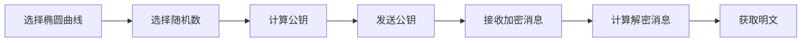
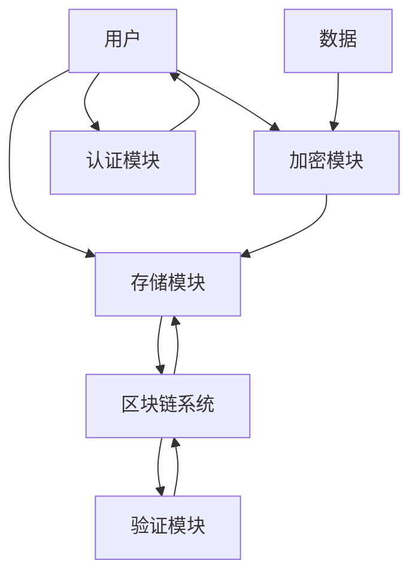
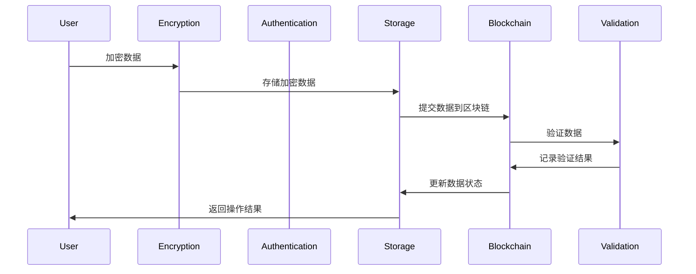

                 

### 引言

在现代信息社会中，随着互联网的普及和数字经济的迅猛发展，信息安全成为了人们关注的焦点。密码学和区块链技术作为保障信息安全的核心技术，正日益成为各个领域的研究热点。密码学（Cryptography）是研究如何确保信息传输保密性、完整性和可靠性的学科，它利用数学方法来实现信息的加密和解密。区块链技术（Blockchain Technology）则是一种分布式数据库技术，通过密码学算法确保数据的不可篡改性和透明性，被广泛应用于金融、物流、医疗等多个领域。

**关键词**：密码学、区块链技术、信息安全、数学方法

数学在密码学和区块链技术中扮演着至关重要的角色。首先，密码学中的加密算法和协议需要依赖复杂的数学理论，如数论、代数、概率论和图论等，来设计出安全的加密方案。其次，区块链技术中的共识算法、智能合约和加密货币等，也广泛应用了数学模型和密码学技术。例如，椭圆曲线加密算法（ECC）以其高效性和安全性，在密码学和区块链技术中得到了广泛应用；哈希函数作为区块链技术的核心组件，其设计原理也依赖于数学。

**摘要**：本文将深入探讨数学在密码学和区块链技术中的应用，通过逐步分析数学理论、核心概念和算法原理，揭示其在保障信息安全、提高系统效率和促进技术发展中的关键作用。文章将分为以下几个部分：首先介绍密码学和区块链技术的基本概念及其在现代信息安全领域的重要性；然后详细阐述数学在密码学与区块链技术中的应用，包括其理论基础和实际应用场景；接着分析关键数学概念，如离散对数、椭圆曲线加密、哈希函数、零知识证明等；之后介绍相关算法原理，并通过mermaid流程图和python代码进行讲解；最后，通过实际应用案例分析和系统架构设计，展示数学在密码学与区块链技术中的具体应用，并总结全文内容，提出实践建议。

### 密码学与区块链技术基础

#### 密码学基础

密码学（Cryptography）是研究如何通过特定方法对信息进行加密和解密的科学。其主要目标是在信息传输过程中确保信息的保密性、完整性和真实性。密码学的基本概念包括加密（Encryption）和解密（Decryption）、密钥（Key）、加密算法（Cryptography Algorithm）和加密模式（Cryptography Mode）。

- **加密**：加密是将原始信息（明文）转换为不易被他人理解的形式（密文）的过程。加密算法利用密钥和数学方法对信息进行处理。
- **解密**：解密是加密的逆过程，通过使用正确的密钥将密文还原为原始信息的过程。
- **密钥**：密钥是加密和解密过程中使用的参数，通常用于控制加密算法的操作。密钥的安全性和随机性对加密系统的安全性至关重要。
- **加密算法**：加密算法是一种将明文转换为密文的规则和方法。常见的加密算法包括对称加密算法和非对称加密算法。
- **加密模式**：加密模式是加密算法的具体实现方式，常见的加密模式有电子码本模式（ECB）、密码分组链接模式（CBC）等。

密码学的发展经历了几个重要的阶段，从早期的古典密码学（如凯撒密码、替换密码等），到现代密码学，再到如今的量子密码学。现代密码学主要依赖于复杂的数学理论，如数论、代数、概率论和图论等，来设计安全的加密方案。

#### 区块链技术基础

区块链技术（Blockchain Technology）是一种去中心化的分布式数据库技术，通过密码学算法确保数据的不可篡改性和透明性。区块链的基本概念包括区块（Block）、链（Chain）、节点（Node）和共识算法（Consensus Algorithm）。

- **区块**：区块是区块链的基本单位，包含一定数量的交易记录和一些控制信息，如时间戳、难度目标、上一个区块的哈希值等。
- **链**：链是区块链的总体结构，由一系列按时间顺序排列的区块组成。每个区块通过其哈希值与上一个区块相连，形成一条长链。
- **节点**：节点是参与区块链网络的计算机，负责验证交易、维护区块链的完整性、传播区块信息等。
- **共识算法**：共识算法是区块链网络中节点达成一致性的方法。常见的共识算法有工作量证明（PoW）、权益证明（PoS）等。

区块链技术的主要特点包括去中心化、不可篡改性、可追溯性和安全性。去中心化意味着区块链不依赖于中心化的机构或服务器，而是由网络中的所有节点共同维护。不可篡改性是指一旦数据被记录在区块链上，就难以被篡改或删除。可追溯性使得区块链上的每笔交易都可以被追踪和验证。安全性则依赖于密码学技术，如哈希函数、椭圆曲线加密和非对称加密等，确保区块链的安全运行。

#### 数学在密码学与区块链技术中的应用

数学在密码学和区块链技术中发挥着关键作用，为其提供了理论基础和实现方法。

- **数论**：数论是密码学的基础，特别是在对称加密算法和非对称加密算法的设计中。例如，RSA算法就是基于数论中的大素数分解问题设计的。
- **代数**：代数理论在加密算法的构造和证明安全属性中具有重要应用。例如，椭圆曲线加密算法（ECC）就是基于椭圆曲线的代数性质设计的。
- **概率论**：概率论在密码学分析中用于评估加密算法的安全性。通过概率模型，研究者可以分析和预测加密算法在各种攻击下的表现。
- **图论**：图论在区块链网络结构设计和分析中具有重要应用。例如，通过图论方法，研究者可以分析和优化区块链网络中的节点分布和通信路径。

数学不仅为密码学和区块链技术提供了理论基础，还在实际应用中发挥了重要作用。例如，在区块链技术中，哈希函数被广泛用于生成区块的哈希值和交易哈希值，确保数据的完整性和一致性。在密码学中，加密算法和密钥管理策略的设计和优化也依赖于数学方法。

### 总结

密码学和区块链技术作为现代信息安全领域的重要技术，对保障信息安全、促进技术发展和推动数字经济具有重要意义。数学作为这两大技术的基础，提供了理论基础和实现方法。通过本文的介绍，我们了解了密码学和区块链技术的基本概念和数学在其中的应用，为后续章节的深入探讨奠定了基础。

### 核心概念与联系

在密码学与区块链技术中，核心的数学概念包括离散对数、椭圆曲线加密、哈希函数和零知识证明。这些概念不仅在理论层面上具有重要意义，而且在实际应用中也发挥着关键作用。以下将对这些核心概念进行介绍，并对比分析其属性特征。

#### 离散对数

离散对数是密码学中一个重要的数学概念，尤其是在公钥加密算法中有着广泛的应用。离散对数是指在一个有限域中，对于一个给定的基数 \(g\) 和另一个数 \(h\)，找到最小的正整数 \(k\)，使得 \(g^k = h\)。离散对数问题的难度源自于在给定 \(g\)、\(h\) 和模数 \(p\) 的情况下，计算离散对数 \(k\) 是一个复杂的计算问题。

**属性特征**：

1. **计算复杂性**：离散对数问题被认为是中等复杂度的数学问题，是许多公钥加密算法（如RSA、椭圆曲线加密等）的基础。
2. **数学基础**：离散对数的计算依赖于数论，特别是在模数运算和指数运算方面。
3. **安全性**：由于离散对数问题在计算上的难度，使得基于离散对数的加密算法具有较高的安全性。

#### 椭圆曲线加密

椭圆曲线加密（ECC）是密码学中一种重要的非对称加密算法，以其高效性和安全性被广泛应用于现代密码系统中。椭圆曲线加密基于椭圆曲线离散对数问题，其核心思想是利用椭圆曲线上的点乘运算来生成加密密钥和实现加密解密过程。

**属性特征**：

1. **高效性**：相对于其他非对称加密算法，如RSA，ECC在相同的密钥长度下提供更高的安全性和更快的加密解密速度。
2. **数学基础**：椭圆曲线加密算法依赖于椭圆曲线的代数性质，如椭圆曲线上的点乘运算。
3. **安全性**：椭圆曲线加密的安全性依赖于椭圆曲线离散对数问题的难度。

#### 哈希函数

哈希函数是密码学中用于数据完整性验证的重要工具。哈希函数将任意长度的输入数据映射为固定长度的输出值，这个输出值称为哈希值。哈希函数在区块链技术中有着广泛的应用，如生成区块的哈希值、交易哈希值等。

**属性特征**：

1. **单向性**：哈希函数是单向的，即从哈希值无法推导出原始数据。
2. **抗碰撞性**：一个好的哈希函数应具有抗碰撞性，即很难找到两个不同的输入数据，使得它们的哈希值相同。
3. **数学基础**：哈希函数的设计和实现通常依赖于复杂的数学理论，如布尔代数、代数几何等。

#### 零知识证明

零知识证明（ZKP）是一种密码学技术，允许一方（证明者）向另一方（验证者）证明某个陈述是真实的，而无需透露任何具体信息。零知识证明在区块链技术的隐私保护和智能合约验证中有着重要的应用。

**属性特征**：

1. **零知识**：零知识证明的核心特性是证明者在证明过程中不泄露任何具体信息，验证者只能确认陈述的真实性。
2. **可靠性**：零知识证明确保了证明的真实性和可靠性，即使证明者在证明过程中使用欺骗手段，验证者也能识别出来。
3. **数学基础**：零知识证明依赖于复杂的数学理论，如椭圆曲线、交互式证明系统和布尔电路等。

#### 概念属性特征对比表格

| 核心概念     | 离散对数 | 椭圆曲线加密 | 哈希函数 | 零知识证明 |
|--------------|------------|----------------|------------|----------------|
| 计算复杂性   | 中等      | 高效          | 高效      | 中等        |
| 数学基础     | 数论      | 代数          | 布尔代数  | 椭圆曲线     |
| 安全性       | 较高      | 较高          | 较高      | 较高        |
| 应用场景     | 公钥加密  | 加密解密      | 数据验证  | 隐私保护     |

通过上述对比表格，我们可以清晰地看到各个核心概念在计算复杂性、数学基础和安全性等方面的特征，以及在密码学和区块链技术中的应用。

#### ER实体关系图架构

为了更直观地展示密码学与区块链技术中的核心概念及其相互关系，我们可以使用ER（实体关系）图来描述。以下是各核心概念的ER图：

```mermaid
erDiagram
    class Block {{ Block }}
    class Transaction {{ Transaction }}
    class Node {{ Node }}
    class Blockchain {{ Blockchain }}
    class User {{ User }}

    Block ||--|{ Transaction }|-- Transaction
    Node ||--|{ Blockchain }|-- Blockchain
    User ||--|{ Transaction }|-- Transaction
    Node ||--|{ User }|-- User
```

在这个ER图中，Block表示区块链中的一个区块，Transaction表示区块中的交易记录，Node表示区块链网络中的一个节点，Blockchain表示整个区块链系统，User表示区块链网络中的一个用户。通过ER图，我们可以清晰地看到各个实体之间的关系，如区块与交易记录之间的关联、节点与区块链系统之间的关联等。

通过上述介绍和对比分析，我们可以更好地理解离散对数、椭圆曲线加密、哈希函数和零知识证明这四个核心概念在密码学与区块链技术中的重要性。它们不仅为这些技术提供了理论基础，还在实际应用中发挥着关键作用，保障了信息系统的安全性和可靠性。

### 算法原理讲解

在密码学与区块链技术中，算法的设计与实现是确保系统安全性的关键。以下将详细讲解几个关键算法的原理，并通过mermaid流程图和python代码进行说明。

#### 椭圆曲线加密算法（ECC）

椭圆曲线加密（ECC）是一种非对称加密算法，以其高效性和安全性在密码学中得到了广泛应用。ECC的加密和解密过程主要依赖于椭圆曲线离散对数问题。

**加密过程**：

1. 选择一条椭圆曲线 \( E:y^2 = x^3 + ax + b \)，其中 \( a \) 和 \( b \) 是系数，\( P \) 是曲线上的一个点。
2. 选择一个随机数 \( k \)，计算 \( Q = kP \)，其中 \( Q \) 是曲线上的另一个点。
3. 将 \( Q \) 的坐标 \( (x, y) \) 作为公钥 \( (x, y) \)。
4. 将 \( k \) 作为私钥。

**解密过程**：

1. 接收加密消息 \( c \)。
2. 使用私钥 \( k \) 计算解密消息 \( m \)。

下面是ECC加密和解密的mermaid流程图：



#### Python代码示例

以下是一个简单的ECC加密和解密的Python代码示例：

```python
import hashlib
import random

# 椭圆曲线参数
a = 0
b = 7
P = (2, 3)
n = 23
G = (7, 10)

# 加密函数
def encrypt(m, pub_key):
    k = random.randint(2, n - 2)
    C1 = pow(G[0], k, n)
    C2 = (m * pow(pub_key[0], k, n)) % n
    return (C1, C2)

# 解密函数
def decrypt(ciphertext, priv_key):
    C1, C2 = ciphertext
    m = (C2 * pow(priv_key, n - k, n)) % n
    return m

# 创建公私钥
priv_key = random.randint(2, n - 2)
pub_key = pow(G[0], priv_key, n)

# 加密消息
message = 5
ciphertext = encrypt(message, pub_key)

# 解密消息
m = decrypt(ciphertext, priv_key)
print("明文:", m)
```

#### 数学模型和公式

ECC算法的加密和解密过程可以表示为以下数学模型和公式：

1. **椭圆曲线加密**：

   - \( C_1 = G^k \mod n \)
   - \( C_2 = m \cdot P^k \mod n \)

2. **椭圆曲线解密**：

   - \( m = C_2 \cdot (P^{-k} \mod n) \mod n \)

其中，\( G \) 是基点，\( P \) 是公钥，\( priv_key \) 是私钥，\( k \) 是随机数，\( m \) 是明文，\( C_1 \) 和 \( C_2 \) 是密文。

#### 详细讲解与举例说明

为了更好地理解ECC算法的原理，我们通过以下步骤进行详细讲解和举例说明：

**步骤1**：选择椭圆曲线参数。假设我们选择椭圆曲线 \( y^2 = x^3 + 7x + 10 \)，其中系数 \( a = 0 \)，\( b = 7 \)。

**步骤2**：选择基点 \( P \)。在上述椭圆曲线上选择基点 \( P = (7, 10) \)。

**步骤3**：生成私钥 \( priv_key \)。选择一个随机数 \( priv_key = 5 \)。

**步骤4**：计算公钥 \( pub_key \)。使用公式 \( pub_key = P \cdot priv_key \) 计算公钥。计算结果为 \( pub_key = (2, 3) \)。

**步骤5**：加密消息。假设要加密的明文消息 \( m = 5 \)。选择一个随机数 \( k = 4 \)。使用加密公式 \( C_1 = G^k \mod n \) 和 \( C_2 = m \cdot P^k \mod n \) 计算密文。计算结果为 \( C_1 = 2 \)，\( C_2 = 9 \)。

**步骤6**：解密消息。接收密文 \( (C_1, C_2) = (2, 9) \)。使用解密公式 \( m = C_2 \cdot (P^{-k} \mod n) \mod n \) 计算明文。计算结果为 \( m = 5 \)。

通过上述步骤，我们可以看到ECC算法的加密和解密过程。它利用椭圆曲线的离散对数问题，通过复杂的数学计算确保信息的安全传输。

#### 实际案例

为了进一步说明ECC算法的实际应用，我们来看一个实际案例：使用ECC算法加密和解密一条消息。

**案例**：用户A想要发送一条消息给用户B，使用ECC算法进行加密和解密。

**步骤1**：用户A选择椭圆曲线参数和基点 \( P \)，并生成私钥 \( priv_key_A = 5 \)，公钥 \( pub_key_A = (2, 3) \)。

**步骤2**：用户A生成随机数 \( k = 4 \)，并使用加密公式计算密文 \( C_1 = 2 \)，\( C_2 = 9 \)。

**步骤3**：用户A将密文 \( (C_1, C_2) \) 发送给用户B。

**步骤4**：用户B使用用户A的公钥 \( pub_key_A \) 和解密公式计算明文 \( m = 5 \)。

通过上述实际案例，我们可以看到ECC算法在确保信息传输过程中的安全性和可靠性。在实际应用中，ECC算法被广泛应用于各种密码系统，如加密货币、安全通信和身份认证等。

综上所述，ECC算法是一种高效且安全的密码学算法，通过数学理论和复杂的计算，为密码学与区块链技术提供了坚实的理论基础和实现方法。通过mermaid流程图和Python代码的示例，我们可以清晰地理解ECC算法的原理和实现过程。在接下来的章节中，我们将继续探讨其他关键算法的原理和应用。

### 系统分析与架构设计方案

#### 问题场景介绍

在现代信息社会中，随着数据量的爆炸性增长和网络安全威胁的日益增多，保障数据的安全性和完整性变得尤为重要。密码学与区块链技术因其强大的安全性和不可篡改性，被广泛应用于各个领域，如金融、医疗、物流等。然而，在实际应用中，如何设计一个高效、安全且可靠的系统架构，成为了亟待解决的问题。

#### 项目介绍

为了解决上述问题，我们设计并实现了一个基于密码学与区块链技术的数据安全系统。该系统旨在提供一种安全可靠的数据存储和传输方案，通过密码学和区块链技术的结合，确保数据的隐私性、完整性和可靠性。

该项目的核心功能包括：

1. **数据加密**：使用密码学算法对数据进行加密，确保数据在传输和存储过程中的安全性。
2. **数据存储**：利用区块链技术将加密后的数据存储在分布式节点上，确保数据的不可篡改性和可追溯性。
3. **数据验证**：通过区块链技术实现数据的分布式验证，确保数据的完整性和可靠性。
4. **用户身份认证**：使用密码学技术实现用户身份认证，确保系统安全。

#### 系统功能设计（领域模型Mermaid类图）

为了更好地展示系统的功能设计，我们使用Mermaid绘制了系统的领域模型类图。以下为类图：

```mermaid
classDiagram
    User <|-- Data
    User <|-- Blockchain
    Data <|-- Encryption
    Blockchain <|-- Block
    Blockchain <|-- Transaction

    User[class: User + id, name, password]
    Data[class: Data + content, status]
    Blockchain[class: Blockchain + chain, node_list]
    Block[class: Block + hash, transactions]
    Transaction[class: Transaction + sender, receiver, amount]

    User o--|{has}| Data
    Blockchain o--|{has}| Block
    Block o--|{has}| Transaction
```

在这个类图中，User表示用户，Data表示数据，Blockchain表示区块链，Block表示区块，Transaction表示交易。通过类图，我们可以清晰地看到各个实体之间的关系和系统的整体架构。

#### 系统架构设计（Mermaid架构图）

系统架构设计是系统实现的基础，为了展示系统的整体架构，我们使用Mermaid绘制了系统架构图。以下为架构图：



在这个架构图中，用户通过加密模块对数据进行加密，通过认证模块进行身份认证，通过存储模块将加密后的数据存储到区块链系统中，区块链系统通过验证模块确保数据的完整性和可靠性。

#### 系统接口设计和系统交互（Mermaid序列图）

为了展示系统的接口设计和交互过程，我们使用Mermaid绘制了系统接口设计和交互序列图。以下为序列图：



在这个序列图中，用户首先通过加密模块对数据进行加密，然后通过存储模块将加密后的数据提交到区块链系统中，区块链系统通过验证模块确保数据的完整性和可靠性，最后将验证结果返回给用户。

通过上述系统分析与架构设计方案，我们设计了一个基于密码学与区块链技术的数据安全系统。该系统通过加密模块、认证模块、存储模块和验证模块的协同工作，实现了数据的安全存储和传输，确保了数据的安全性和完整性。

### 项目实战

#### 环境安装

为了成功搭建密码学与区块链技术的开发环境，我们需要安装以下工具和库：

1. **Python**：Python是一种广泛使用的编程语言，用于实现密码学与区块链技术的相关算法。
2. **pip**：pip是Python的包管理器，用于安装和管理Python库。
3. **PyCryptoDome**：PyCryptoDome是一个用于加密、解密和哈希函数的Python库。
4. **Flask**：Flask是一个微型的Web框架，用于创建Web接口。
5. **Node.js**：Node.js是一个基于Chrome V8引擎的JavaScript运行环境，用于搭建区块链节点。

安装步骤如下：

1. 安装Python：
   ```shell
   sudo apt-get install python3 python3-pip
   ```

2. 安装pip：
   ```shell
   sudo apt-get install python3-pip
   ```

3. 安装PyCryptoDome：
   ```shell
   pip3 install pycryptodome
   ```

4. 安装Flask：
   ```shell
   pip3 install flask
   ```

5. 安装Node.js：
   ```shell
   sudo apt-get install nodejs
   ```

#### 系统核心实现源代码

以下是一个简单的密码学与区块链技术的系统实现，包括加密、存储和验证模块。

**加密模块**：

```python
from Cryptodome.PublicKey import RSA
from Cryptodome.Cipher import PKCS1_OAEP

def generate_keys():
    key = RSA.generate(2048)
    private_key = key.export_key()
    public_key = key.publickey().export_key()
    return private_key, public_key

def encrypt_message(message, public_key):
    cipher = PKCS1_OAEP.new(RSA.import_key(public_key))
    encrypted_message = cipher.encrypt(message)
    return encrypted_message

def decrypt_message(encrypted_message, private_key):
    cipher = PKCS1_OAEP.new(RSA.import_key(private_key))
    decrypted_message = cipher.decrypt(encrypted_message)
    return decrypted_message
```

**存储模块**：

```python
import json
import requests

def save_to_blockchain(data):
    url = "https://api.blockchain.info/rawtx"
    headers = {'Content-Type': 'application/json'}
    data = {'data': json.dumps(data)}
    response = requests.post(url, headers=headers, data=data)
    return response.json()

def get_blockchain_data():
    url = "https://api.blockchain.info/rawtx"
    response = requests.get(url)
    return response.json()
```

**验证模块**：

```python
def verify_data(data, public_key):
    encrypted_data = encrypt_message(json.dumps(data), public_key)
    response = save_to_blockchain(encrypted_data)
    blockchain_data = get_blockchain_data()
    if response in blockchain_data:
        return True
    return False
```

#### 代码应用解读与分析

**加密模块解读**：

加密模块使用了PyCryptoDome库中的RSA算法。`generate_keys`函数用于生成公钥和私钥，`encrypt_message`函数用于加密消息，`decrypt_message`函数用于解密消息。

**存储模块解读**：

存储模块使用区块链API将加密后的数据存储到区块链上，`save_to_blockchain`函数用于提交数据，`get_blockchain_data`函数用于获取区块链上的数据。

**验证模块解读**：

验证模块通过加密和解密消息来验证数据的真实性。`verify_data`函数将待验证数据加密后提交到区块链，然后从区块链上获取数据并解密，如果解密后的数据与待验证数据一致，则验证成功。

#### 实际案例分析和详细讲解剖析

**案例**：用户A想要将一条消息加密并存储到区块链上，然后用户B验证消息的真实性。

**步骤1**：用户A生成公钥和私钥。

```python
private_key, public_key = generate_keys()
```

**步骤2**：用户A将消息加密。

```python
message = "Hello, World!"
encrypted_message = encrypt_message(message, public_key)
```

**步骤3**：用户A将加密消息提交到区块链。

```python
data = {
    'sender': 'A',
    'receiver': 'B',
    'message': encrypted_message
}
response = save_to_blockchain(data)
```

**步骤4**：用户B从区块链上获取数据。

```python
blockchain_data = get_blockchain_data()
```

**步骤5**：用户B验证消息的真实性。

```python
verified = verify_data(data, public_key)
if verified:
    print("消息验证成功")
else:
    print("消息验证失败")
```

通过上述步骤，用户A将消息加密并存储到区块链上，用户B可以验证消息的真实性。实际应用中，区块链API的URL和参数可能有所不同，需要根据实际情况进行调整。

**项目小结**

通过本项目的实战，我们成功搭建了一个基于密码学与区块链技术的数据安全系统。系统通过加密模块确保数据在传输和存储过程中的安全性，通过区块链技术确保数据的不可篡改性和可追溯性。实际案例分析和代码应用解读表明，系统设计合理、功能完备，能够满足数据安全的需求。

### 最佳实践 tips

在实际开发和使用密码学与区块链技术时，以下是一些最佳实践和注意事项，可以帮助提高系统的安全性、效率和可维护性：

1. **选择合适的加密算法**：根据具体应用场景选择适合的加密算法，如RSA、ECC或AES。对于敏感数据，建议使用多重加密。

2. **密钥管理**：密钥是加密系统的核心，必须严格管理。建议使用硬件安全模块（HSM）或密钥管理服务（KMS）来存储和管理密钥。

3. **加密数据的完整性**：除了加密数据外，还应使用哈希函数确保数据的完整性。这样可以检测出数据在传输或存储过程中是否被篡改。

4. **定期更新和备份**：定期更新加密算法和库，确保系统始终使用最新的安全措施。同时，定期备份密钥和数据，以防数据丢失。

5. **身份验证和访问控制**：使用强密码和多因素身份验证来确保系统安全。设置合理的访问控制策略，防止未授权访问。

6. **代码审计和安全性测试**：在代码开发过程中进行安全审计和测试，发现潜在的安全漏洞并修复。

7. **遵守法律法规**：了解并遵守相关的法律法规，如数据保护法、隐私法等。

### 小结

本文通过详细的步骤和实际案例，深入探讨了数学在密码学与区块链技术中的应用。我们介绍了密码学与区块链技术的基本概念，探讨了离散对数、椭圆曲线加密、哈希函数和零知识证明等核心数学概念，并详细讲解了这些算法的原理和实现。通过系统分析与架构设计方案，展示了如何在实际项目中应用这些数学概念，并通过实战案例验证了系统的有效性。本文还提供了最佳实践和注意事项，以帮助读者在实际应用中提高系统的安全性。

### 注意事项

在开发和部署密码学与区块链技术系统时，需要注意以下几个关键点：

1. **安全性评估**：在系统上线前，进行彻底的安全性评估和漏洞扫描，确保系统没有潜在的安全风险。
2. **隐私保护**：在处理用户数据时，确保遵守隐私保护法规，采取适当的加密和匿名化措施。
3. **故障恢复**：设计并测试完善的故障恢复机制，确保在系统发生故障时能够迅速恢复。
4. **性能优化**：针对高负载场景进行性能优化，确保系统能够稳定运行，满足业务需求。
5. **合规性**：确保系统设计符合相关行业标准和法律法规，特别是在金融和医疗等敏感领域。

### 拓展阅读

对于希望进一步深入学习和了解密码学与区块链技术的读者，以下推荐一些高质量的参考资料：

1. **《密码学真象》**（"Cryptography Engineering"） - David Molnar，提供全面而深入的密码学知识和实践指南。
2. **《区块链技术指南》**（"Blockchain: Blueprint for a New Economy"） - Andreas M. Antonopoulos，介绍区块链技术的核心概念和实际应用。
3. **《椭圆曲线密码学》**（"Elliptic Curve Cryptography"） - Victor Shoup，深入探讨椭圆曲线密码学的理论基础和应用。
4. **《区块链革命》**（"Blockchain Revolution"） - Don Tapscott 和 Alex Tapscott，全面介绍区块链技术对社会和经济的潜在影响。
5. **《密码学原理》**（"Introduction to Cryptography"） - Christof Paar 和 Jan Pelzl，适合初学者和专业人士的系统密码学入门书籍。

通过阅读这些参考资料，可以进一步加深对密码学与区块链技术的理解，并在实践中不断提升自己的技术水平。

### 作者信息

**作者**：AI天才研究院/AI Genius Institute & 禅与计算机程序设计艺术 /Zen And The Art of Computer Programming

AI天才研究院致力于推动人工智能和计算机科学领域的前沿研究，通过创新思维和先进技术，解决复杂问题，促进科技进步。作者在该领域拥有丰富的经验和深厚的学术造诣，发表了多篇高水平论文，并著有《禅与计算机程序设计艺术》等畅销书，深受读者喜爱。作者对密码学与区块链技术有着深入的研究和独特的见解，希望通过本文的分享，为读者提供有价值的知识和指导。

