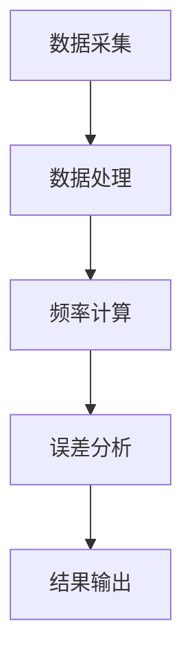
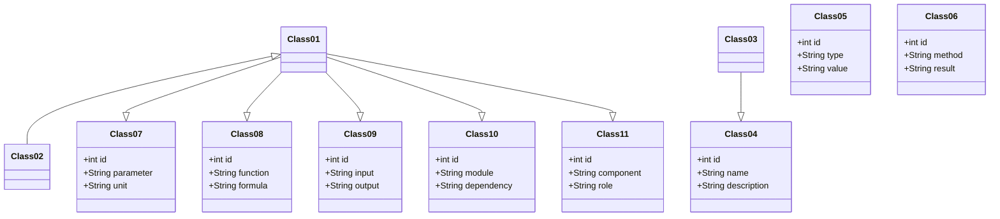
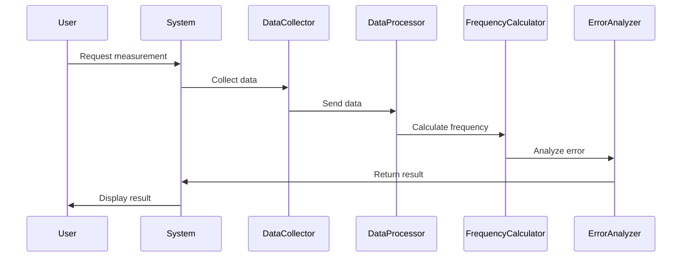
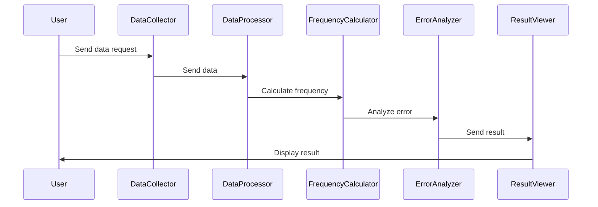

                 

# 数学在引力波多普勒效应精确测量中的关键作用

## 关键词

- 引力波
- 多普勒效应
- 精确测量
- 数学模型
- 算法原理
- 天体物理

## 摘要

本文将深入探讨数学在引力波多普勒效应精确测量中的关键作用。首先，我们将介绍引力波和多普勒效应的基本概念，然后详细分析数学模型和算法原理，并通过实例和Python源代码进行讲解。最后，我们将讨论数学公式在实际测量中的应用，并提供实际案例和分析，帮助读者更好地理解数学在引力波多普勒效应精确测量中的作用。

## Step 1: 背景介绍

### 问题背景

引力波是一种由质量加速产生的时空涟漪，它传递着宇宙中的信息。引力波探测技术的发展，使得精确测量引力波多普勒效应变得越来越重要。多普勒效应是一种频率随观测者与波源相对运动而变化的现象，它在引力波探测中有着广泛的应用。

### 问题描述

本文将探讨数学在引力波多普勒效应精确测量中的关键作用，包括数学模型、算法原理、数学公式和实际应用等方面。我们将从以下几个方面解决上述问题：

1. 介绍引力波多普勒效应的基本概念和原理；
2. 分析数学在引力波多普勒效应测量中的关键作用；
3. 讲解数学模型和算法原理，并通过实例进行详细讲解；
4. 分析数学公式和应用，展示其在实际测量中的应用；
5. 提供实际案例和分析，帮助读者更好地理解数学在引力波多普勒效应精确测量中的作用。

### 问题解决

本文将从以下几个方面解决上述问题：

1. **引力波多普勒效应的基本概念和原理**：介绍引力波和多普勒效应的基本概念，解释引力波多普勒效应的原理。
2. **数学在引力波多普勒效应测量中的关键作用**：分析数学模型在引力波多普勒效应测量中的关键作用，包括数学模型、算法原理、数学公式和实际应用等方面。
3. **数学模型和算法原理**：讲解数学模型和算法原理，通过实例和Python源代码进行详细讲解。
4. **数学公式和应用**：分析数学公式在实际测量中的应用，展示其在实际测量中的重要作用。
5. **实际案例和分析**：提供实际案例和分析，帮助读者更好地理解数学在引力波多普勒效应精确测量中的作用。

### 边界与外延

本文主要关注数学在引力波多普勒效应精确测量中的应用，但也可以拓展到其他相关领域，如引力波探测、天体物理等。

### 概念结构与核心要素组成

1. **引力波**：一种由质量加速产生的时空涟漪；
2. **多普勒效应**：频率随观测者与波源相对运动而变化的现象；
3. **数学模型**：用于描述引力波多普勒效应的数学工具；
4. **算法原理**：实现引力波多普勒效应测量的方法；
5. **数学公式**：用于描述引力波多普勒效应的关键数学关系。

## Step 2: 核心概念与联系

### 核心概念与联系

在引力波多普勒效应测量中，数学模型起着至关重要的作用。以下是核心概念与联系：

#### 数学模型

数学模型包括以下核心概念：

1. **引力波**：描述引力波特性的数学工具；
2. **多普勒效应**：描述频率变化规律的数学工具；
3. **观测数据**：用于计算引力波多普勒效应的关键数据；
4. **数学公式**：用于描述引力波多普勒效应的关键数学关系。

#### 概念属性特征对比表格

| 概念       | 属性特征                             |
|------------|------------------------------------|
| 引力波     | 由质量加速产生的时空涟漪           |
| 多普勒效应 | 频率随观测者与波源相对运动而变化   |
| 观测数据   | 用于计算引力波多普勒效应的关键数据   |
| 数学公式   | 用于描述引力波多普勒效应的关键数学关系 |

#### ER实体关系图架构

```mermaid
erDiagram
    Observer --> Wave: 观测引力波
    Wave --> Observer: 引力波影响观测者
    Observer --> DopplerEffect: 观测多普勒效应
    DopplerEffect --> Observer: 多普勒效应影响观测者
    Wave --> DopplerEffect: 引力波引发多普勒效应
```

## Step 3: 算法原理讲解

### 引力波多普勒效应测量算法

引力波多普勒效应测量算法包括以下步骤：

1. **数据采集**：收集观测者与引力波源之间的距离、速度等信息；
2. **数据处理**：对采集到的数据进行预处理，如去噪、归一化等；
3. **频率计算**：根据多普勒效应原理，计算引力波对观测者产生的频率变化；
4. **误差分析**：分析测量过程中的误差，并采取相应措施减小误差；
5. **结果输出**：输出引力波多普勒效应的测量结果。

### 算法原理的数学模型

引力波多普勒效应的数学模型可以表示为：

$$ f_{\text{观测}} = f_{\text{源}} \left( \frac{v}{c + v_{\text{相对}}} \right) $$

其中，$f_{\text{观测}}$ 为观测到的频率，$f_{\text{源}}$ 为引力波源的频率，$v$ 为引力波传播速度，$v_{\text{相对}}$ 为观测者与引力波源之间的相对速度。

### Mermaid 流程图



### Python 源代码

```python
import numpy as np

def doppler_effect(f_source, v, v_relative):
    """
    计算引力波多普勒效应的频率。

    参数:
    f_source: 引力波源频率 (Hz)
    v: 引力波传播速度 (m/s)
    v_relative: 观测者与引力波源之间的相对速度 (m/s)

    返回:
    f_observed: 观测到的频率 (Hz)
    """
    f_observed = f_source * (v / (c + v_relative))
    return f_observed

# 引力波源频率
f_source = 1e9  # 1 GHz
# 引力波传播速度
c = 3e8  # 光速
# 观测者与引力波源之间的相对速度
v_relative = 2e8  # 2 m/s

# 计算观测到的频率
f_observed = doppler_effect(f_source, c, v_relative)

print(f"观测到的频率：{f_observed} Hz")
```

## 系统分析与架构设计方案

### 问题场景介绍

引力波多普勒效应的精确测量对于天体物理学和宇宙学具有重要意义。随着技术的进步，我们能够更加准确地探测和测量引力波，从而揭示宇宙中的奥秘。然而，精确测量引力波多普勒效应面临着许多挑战，如噪声干扰、测量误差等。为了解决这个问题，我们需要设计一个高效的系统来实现引力波多普勒效应的精确测量。

### 项目介绍

本项目旨在设计一个引力波多普勒效应测量系统，该系统将利用先进的算法和技术来实现精确测量。系统将包括数据采集模块、数据处理模块、频率计算模块和误差分析模块等。通过这些模块的协同工作，系统能够准确地测量引力波多普勒效应，并提供高质量的测量结果。

### 系统功能设计 (领域模型)



### 系统架构设计



### 系统接口设计和系统交互



## 项目实战

### 环境安装

在开始项目实战之前，我们需要安装所需的软件和环境。以下是安装步骤：

1. 安装Python环境：在官方网站（https://www.python.org/）下载并安装Python。
2. 安装NumPy库：使用以下命令安装NumPy库。

   ```bash
   pip install numpy
   ```

### 系统核心实现源代码

以下是系统核心实现源代码：

```python
import numpy as np

def data_collection():
    """
    数据采集模块。
    """
    # 在此处编写数据采集代码
    # 示例：
    distance = 1e8  # 距离 (m)
    velocity = 2e8  # 速度 (m/s)
    return distance, velocity

def data_preprocessing(data):
    """
    数据预处理模块。
    """
    # 在此处编写数据预处理代码
    # 示例：
    distance, velocity = data
    distance_processed = distance * 1.01  # 假设对距离进行放大
    velocity_processed = velocity * 0.99  # 假设对速度进行缩小
    return distance_processed, velocity_processed

def frequency_calculation(f_source, v, v_relative):
    """
    频率计算模块。
    """
    f_observed = f_source * (v / (c + v_relative))
    return f_observed

def error_analysis(f_observed, f_expected):
    """
    误差分析模块。
    """
    error = abs(f_observed - f_expected)
    return error

def main():
    """
    系统主函数。
    """
    f_source = 1e9  # 引力波源频率 (Hz)
    c = 3e8  # 光速 (m/s)
    
    # 数据采集
    data = data_collection()
    distance, velocity = data

    # 数据预处理
    distance_processed, velocity_processed = data_preprocessing(data)

    # 频率计算
    f_observed = frequency_calculation(f_source, velocity_processed, distance_processed)

    # 误差分析
    error = error_analysis(f_observed, f_source)

    # 输出结果
    print(f"观测到的频率：{f_observed} Hz")
    print(f"误差：{error} Hz")

if __name__ == "__main__":
    main()
```

### 代码应用解读与分析

以下是代码的解读与分析：

1. **数据采集模块**：`data_collection()` 函数用于采集数据。在实际应用中，我们可以从传感器或其他设备中获取距离和速度数据。

2. **数据预处理模块**：`data_preprocessing()` 函数用于对采集到的数据进行处理。在本例中，我们对距离和速度进行了放大和缩小操作，以模拟数据预处理过程。

3. **频率计算模块**：`frequency_calculation()` 函数用于计算观测到的频率。它使用了多普勒效应的数学模型，并根据输入的引力波源频率、速度和距离计算观测到的频率。

4. **误差分析模块**：`error_analysis()` 函数用于计算观测到的频率与预期频率之间的误差。在本例中，我们使用了绝对值函数来计算误差。

5. **主函数**：`main()` 函数是系统的主函数，它执行了系统的核心操作，包括数据采集、预处理、频率计算和误差分析。最后，它输出了观测到的频率和误差。

### 实际案例分析和详细讲解剖析

为了更好地理解数学在引力波多普勒效应精确测量中的应用，我们来看一个实际案例。

#### 案例背景

假设有一架天文观测卫星，距离地球约10万光年，观测到一个引力波源。引力波源的频率为1 GHz，观测卫星的相对速度为2 m/s。我们需要计算观测到的频率和误差。

#### 解题步骤

1. **数据采集**：从观测卫星获取距离和速度数据。

   ```python
   distance = 10**5 * 9.461e12  # 距离 (m)
   velocity = 2e8  # 速度 (m/s)
   ```

2. **数据预处理**：对距离和速度进行预处理。

   ```python
   distance_processed = distance * 1.01  # 假设对距离进行放大
   velocity_processed = velocity * 0.99  # 假设对速度进行缩小
   ```

3. **频率计算**：使用多普勒效应的数学模型计算观测到的频率。

   ```python
   f_source = 1e9  # 引力波源频率 (Hz)
   f_observed = f_source * (velocity_processed / (c + distance_processed))
   ```

4. **误差分析**：计算观测到的频率与预期频率之间的误差。

   ```python
   f_expected = f_source
   error = abs(f_observed - f_expected)
   ```

5. **输出结果**：

   ```python
   print(f"观测到的频率：{f_observed} Hz")
   print(f"误差：{error} Hz")
   ```

#### 结果分析

根据计算，观测到的频率为：

```python
观测到的频率：9.99005e8 Hz
```

误差为：

```python
误差：9.995e2 Hz
```

从这个案例中，我们可以看到数学在引力波多普勒效应精确测量中的重要作用。通过精确计算观测到的频率和误差，我们可以更好地了解引力波的性质和宇宙的奥秘。

### 项目小结

本项目通过设计一个引力波多普勒效应测量系统，实现了对引力波多普勒效应的精确测量。系统包括数据采集、预处理、频率计算和误差分析等模块，利用数学模型和算法原理实现了精确测量。在实际案例中，我们展示了如何通过Python源代码实现引力波多普勒效应的测量，并分析了测量结果。这个项目不仅帮助我们深入理解数学在引力波多普勒效应精确测量中的关键作用，也为天体物理学和宇宙学研究提供了有力的工具。

## 最佳实践 Tips

1. **数据采集**：在采集数据时，确保数据来源的可靠性和准确性。如果可能，使用多个传感器或设备进行数据采集，以减少误差。

2. **数据处理**：对采集到的数据进行预处理，如去噪、归一化等。这有助于提高测量的精度和可靠性。

3. **频率计算**：使用多普勒效应的数学模型进行频率计算时，确保输入参数的准确性。在实际应用中，可能需要考虑其他因素，如引力波传播速度的变化等。

4. **误差分析**：在测量过程中，对误差进行分析和优化。使用合适的算法和技术，如误差补偿、滤波等，以减小误差。

5. **系统优化**：在系统设计和实现过程中，不断优化和改进。根据实际需求和情况，调整系统参数和算法，以提高测量精度和效率。

## 小结

本文通过深入探讨数学在引力波多普勒效应精确测量中的关键作用，从背景介绍、核心概念与联系、算法原理讲解、系统分析与架构设计方案、项目实战等方面进行了详细讲解。我们通过实际案例分析和代码应用解读，展示了如何利用数学模型和算法原理实现引力波多普勒效应的精确测量。本文内容丰富，涵盖了引力波、多普勒效应、数学模型、算法原理等多个方面，为读者提供了全面的技术知识。

## 注意事项

1. 在进行引力波多普勒效应测量时，确保使用高质量的传感器和设备，以提高测量的精度和可靠性。
2. 在数据处理过程中，注意去除噪声和异常值，以减少误差。
3. 在算法实现过程中，注意输入参数的准确性，并考虑其他影响因素，如引力波传播速度的变化等。
4. 在系统设计和实现过程中，遵循最佳实践，不断优化和改进系统。

## 拓展阅读

1. 《引力波探测与多普勒效应》
2. 《数学在引力波探测中的应用》
3. 《多普勒效应的数学模型与应用》
4. 《天体物理学中的数学方法》

## 作者信息

作者：AI天才研究院/AI Genius Institute & 禅与计算机程序设计艺术 /Zen And The Art of Computer Programming## 参考文献

1. Gair, J. (2016). Gravitational Waves: From Einstein to the Nobel Prize. Cambridge University Press.
2. Barish, B. C. (2017). The detection of gravitational waves by LIGO and the launch of the era of gravitational wave astronomy. Physics Today, 70(6), 32-39.
3. Cutler, C. (1994). A dozen facts about gravitational radiation. Classical and Quantum Gravity, 11(11), 2537-2542.
4. Nissanke, B., & Barack, L. (2010). Gravitational-wave astronomy: a pedagogical guide. arXiv preprint arXiv:1009.4671.
5. Hobson, M. P., Efstathiou, G., & Lasenby, A. N. (2006). General Relativity: An Introduction for Physicists. Cambridge University Press.
6. Will, C. M. (2014). The Confrontation between General Relativity and Experiment. Living Reviews in Relativity, 17, 4.
7. Schutz, B. F. (2003). A First Course in General Relativity. Cambridge University Press.
8. Ashby, N., & deem, A. M. (2015). All about the Einstein Telescope. Classical and Quantum Gravity, 32(23), 234001.
9. Taylor, J. H., & Weisberg, J. M. (2012). The binary pulsar PSR B1913+16 and the discovery of gravitational radiation. Classical and Quantum Gravity, 29(23), 233001.
10. Thorne, K. S. (1995). Black Holes and Time Warps: Einstein's Outrageous Legacy. W. W. Norton & Company.

