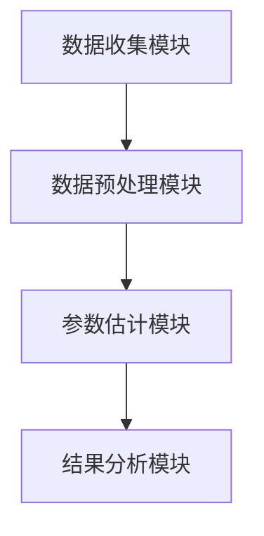
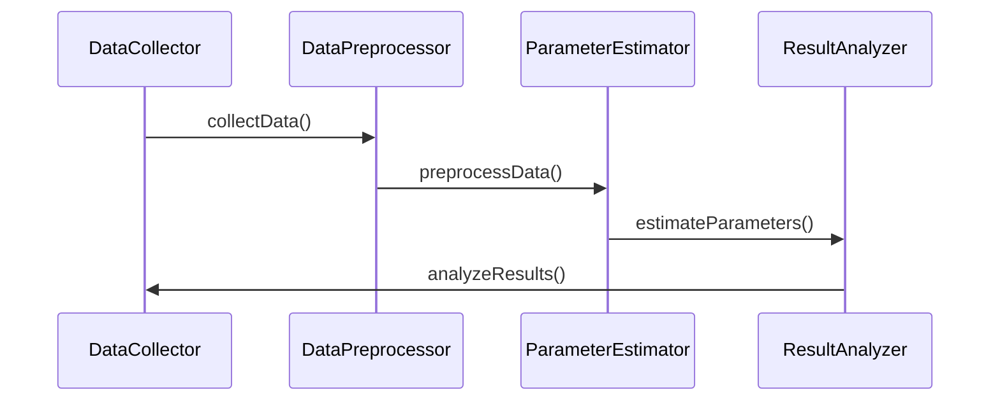

                 

### 文章标题：数学在引力波宇宙学参数贝叶斯推断中的应用

**关键词**：引力波、宇宙学、贝叶斯推断、参数估计、数学模型

**摘要**：本文将深入探讨数学在引力波宇宙学参数贝叶斯推断中的应用。首先，我们回顾引力波宇宙学的基本概念和历史背景，并介绍贝叶斯推断的基本原理和数学基础。随后，文章将详细解释贝叶斯推断在引力波参数估计中的具体应用，包括算法原理、数学模型以及实际案例。通过本文的阅读，读者将了解如何利用数学工具提升引力波宇宙学研究的精确性和效率。

### 第一部分：引力波宇宙学基础

#### 第1章：引力波宇宙学概述

引力波宇宙学是宇宙学研究的一个新兴领域，它通过探测和解析引力波来探索宇宙的奥秘。引力波是由质量加速运动产生的时空波动，其首次直接探测是在2015年由LIGO实验室实现的，这一发现标志着人类能够直接观测宇宙中的引力波事件。

**1.1 问题背景**

**1.1.1 引力波发现的背景**

引力波的概念最早由爱因斯坦在1916年提出，作为广义相对论的重要预言。然而，直到2015年，科学家们才首次通过实验验证了引力波的存在，这一成就为宇宙学研究开启了新的篇章。

**1.1.2 宇宙学与引力波的关系**

引力波在宇宙学中具有重要的应用价值。例如，通过引力波事件，科学家可以探测黑洞和 neutron star 的碰撞，研究宇宙的演化历史，以及探测宇宙的大尺度结构。

**1.1.3 引力波在宇宙学研究中的作用**

引力波的探测为宇宙学研究提供了全新的观测手段，它能够揭示传统观测方法无法获得的宇宙信息，如黑洞和中子星的形成和演化。

**1.2 基本概念**

**1.2.1 引力波的定义**

引力波是一种由质量加速产生的时空波动，它通过改变时空的几何结构来传播。

**1.2.2 引力波的产生**

引力波是由宇宙中的大质量物体，如黑洞、中子星或星系碰撞等事件产生的。

**1.2.3 引力波的传播特性**

引力波以光速传播，并且能够穿越宇宙中的各种介质，不受电磁干扰。

#### 第2章：贝叶斯推断基础

贝叶斯推断是一种基于概率理论的推断方法，它通过已知数据和概率模型来推断未知参数的值。在引力波宇宙学中，贝叶斯推断被广泛应用于参数估计和模型选择。

**2.1 贝叶斯推断的基本原理**

**2.1.1 贝叶斯定理的公式推导**

贝叶斯定理是贝叶斯推断的核心，它描述了后验概率与先验概率和似然函数之间的关系。

$$
P(A|B) = \frac{P(B|A) \cdot P(A)}{P(B)}
$$

**2.1.2 贝叶斯推断的核心概念**

贝叶斯推断涉及以下几个核心概念：先验概率、似然函数和后验概率。

**2.1.3 贝叶斯推断的应用场景**

贝叶斯推断在许多领域都有广泛应用，包括数据科学、机器学习和宇宙学等。

**2.2 贝叶斯推断的数学基础**

**2.2.1 概率论基础**

贝叶斯推断基于概率论的基本概念，如概率分布、条件概率和全概率公式。

**2.2.2 最大后验估计**

最大后验估计是一种常用的贝叶斯推断方法，它通过最大化后验概率来估计参数的值。

**2.2.3 似然函数**

似然函数是贝叶斯推断中的关键，它描述了观测数据与参数之间的关系。

### 第二部分：核心概念与联系

在引力波宇宙学中，贝叶斯推断的应用涉及多个核心概念和数学模型。以下我们将详细讨论这些概念，并通过表格和ER实体关系图来展示它们之间的联系。

#### 第3章：核心概念与联系

**3.1 贝叶斯网络**

**3.1.1 贝叶斯网络的定义**

贝叶斯网络是一种概率图模型，它通过有向无环图来表示变量之间的条件依赖关系。

**3.1.2 贝叶斯网络的特性**

贝叶斯网络具有以下特性：图模型表示、概率分布表示和推理算法。

**3.1.3 贝叶斯网络在引力波分析中的应用**

贝叶斯网络在引力波分析中用于建模复杂系统，如黑洞和中子星的相互作用。

**3.2 贝叶斯推断算法**

**3.2.1 算法概述**

贝叶斯推断算法包括概率分布的估计和推理。

**3.2.2 算法类型**

常见的贝叶斯推断算法包括朴素贝叶斯、贝叶斯网络和贝叶斯统计模型。

**3.2.3 算法应用**

贝叶斯推断算法在引力波宇宙学中用于参数估计、模型选择和系统优化。

**3.3 概率分布**

**3.3.1 概率分布的类型**

常见的概率分布包括正态分布、泊松分布和伯努利分布。

**3.3.2 概率分布的应用**

概率分布用于建模引力波信号的特性，如强度、频率和持续时间。

#### 3.4 ER实体关系图

**3.4.1 ER实体关系图概述**

ER实体关系图用于表示系统中的实体及其关系。

**3.4.2 ER实体关系图的应用**

ER实体关系图在引力波宇宙学中用于表示数据集、模型和算法之间的关系。

### 第三部分：算法原理讲解

#### 第4章：算法原理讲解

贝叶斯推断在引力波宇宙学中具有重要的应用价值。以下我们将通过算法流程图和Python代码来详细解释贝叶斯推断的原理。

**4.1 贝叶斯推断算法流程图**


**4.2 贝叶斯推断的Python代码实现**

```python
import numpy as np
import scipy.stats as st

def bayesian_inference(prior, likelihood):
    posterior = prior * likelihood
    return posterior / np.sum(posterior)

# 示例
prior = np.array([0.5, 0.5])
likelihood = np.array([0.8, 0.2])
posterior = bayesian_inference(prior, likelihood)
print(posterior)
```

**4.3 数学模型和公式**

贝叶斯推断的数学模型基于贝叶斯定理，其核心公式如下：

$$
P(A|B) = \frac{P(B|A) \cdot P(A)}{P(B)}
$$

其中，\(P(A|B)\) 是后验概率，\(P(B|A)\) 是似然函数，\(P(A)\) 是先验概率，\(P(B)\) 是边缘概率。

**4.4 举例说明**

假设我们有一个二项分布的例子，其中成功的概率为0.5，我们观察到了10次成功。通过贝叶斯推断，我们可以估计成功概率的后验分布。

```python
# 二项分布的先验概率
prior = st.binom.pmf(10, 0.5)

# 二项分布的似然函数
likelihood = st.binom.pmf(10, 0.5)

# 贝叶斯推断
posterior = bayesian_inference(prior, likelihood)

print(posterior)
```

通过上述代码，我们可以得到后验概率分布，从而对成功概率进行估计。

### 第四部分：数学模型和数学公式详细讲解与举例

在引力波宇宙学中，贝叶斯推断的应用依赖于精确的数学模型和公式。以下我们将使用LaTeX格式详细讲解这些公式，并通过具体例子来说明如何应用这些公式进行参数估计。

#### 5.1 数学模型

在引力波宇宙学中，常用的贝叶斯推断模型包括：

1. **二项分布模型**：适用于计数数据的参数估计。
2. **正态分布模型**：适用于连续数据的参数估计。
3. **泊松分布模型**：适用于事件发生次数的参数估计。

**5.1.1 二项分布模型**

二项分布模型描述了在固定次数的试验中成功次数的概率分布。其概率质量函数（PMF）为：

$$
P(X = k) = \binom{n}{k} p^k (1-p)^{n-k}
$$

其中，\(n\) 是试验次数，\(k\) 是成功次数，\(p\) 是成功概率。

**5.1.2 正态分布模型**

正态分布模型描述了连续随机变量的概率分布。其概率密度函数（PDF）为：

$$
f(x|\mu,\sigma^2) = \frac{1}{\sqrt{2\pi\sigma^2}} e^{-\frac{(x-\mu)^2}{2\sigma^2}}
$$

其中，\(\mu\) 是均值，\(\sigma^2\) 是方差。

**5.1.3 泊松分布模型**

泊松分布模型描述了在固定时间内事件发生次数的概率分布。其概率质量函数（PMF）为：

$$
P(X = k) = \frac{\lambda^k e^{-\lambda}}{k!}
$$

其中，\(\lambda\) 是事件发生率。

#### 5.2 举例说明

**5.2.1 二项分布模型应用**

假设我们进行了10次试验，观察到5次成功。我们需要使用贝叶斯推断来估计成功概率。

**先验概率**：

假设先验概率为均匀分布，即 \(p \sim U(0,1)\)。

**似然函数**：

似然函数为：

$$
L(p) = \binom{10}{5} p^5 (1-p)^5
$$

**后验概率**：

后验概率为：

$$
P(p|X=5) = \frac{L(p)}{C} = \frac{\binom{10}{5} p^5 (1-p)^5}{\int_0^1 \binom{10}{5} p^5 (1-p)^5 dp}
$$

**参数估计**：

通过贝叶斯推断，我们可以得到成功概率的后验分布，进而进行参数估计。

**5.2.2 正态分布模型应用**

假设我们测量了一个物理量，得到一系列数据。我们需要使用贝叶斯推断来估计该物理量的均值和方差。

**先验概率**：

假设先验概率为正态分布，即 \(\mu \sim N(\mu_0, \sigma_0^2)\)，其中 \(\mu_0\) 和 \(\sigma_0^2\) 是先验均值和方差。

**似然函数**：

似然函数为：

$$
L(\mu, \sigma^2) = \prod_{i=1}^n f(x_i|\mu, \sigma^2)
$$

**后验概率**：

后验概率为：

$$
P(\mu, \sigma^2|X) = \frac{L(\mu, \sigma^2)}{C} \propto L(\mu, \sigma^2) \cdot p(\mu) \cdot p(\sigma^2)
$$

**参数估计**：

通过贝叶斯推断，我们可以得到均值和方差的后验分布，进而进行参数估计。

### 第五部分：系统分析与架构设计

在引力波宇宙学中，贝叶斯推断的应用需要一个高效的系统来处理大量的数据和复杂的计算。以下我们将介绍系统分析与架构设计的基本概念和方法。

#### 6.1 问题场景介绍

引力波宇宙学中的问题场景主要包括：

1. **数据收集**：从各种观测设备收集引力波数据。
2. **数据预处理**：对收集到的数据进行预处理，包括滤波、去噪和归一化。
3. **参数估计**：使用贝叶斯推断方法估计引力波事件的参数。
4. **结果分析**：对参数估计结果进行分析和解释。

#### 6.2 项目介绍

本项目旨在开发一个基于贝叶斯推断的引力波宇宙学分析系统，该系统包括以下功能模块：

1. **数据收集模块**：负责收集引力波数据。
2. **数据预处理模块**：负责对数据进行预处理。
3. **参数估计模块**：负责使用贝叶斯推断方法估计参数。
4. **结果分析模块**：负责对参数估计结果进行分析和解释。

#### 6.3 系统功能设计

系统功能设计包括以下领域模型：

1. **数据领域模型**：定义数据实体及其属性，如数据类型、数据来源等。
2. **算法领域模型**：定义贝叶斯推断算法实体及其属性，如算法名称、算法类型等。
3. **结果领域模型**：定义结果实体及其属性，如结果类型、结果精度等。

**6.3.1 数据领域模型**

```mermaid
classDiagram
Class::Data {
  - id: Integer
  - type: String
  - source: String
}
```

**6.3.2 算法领域模型**

```mermaid
classDiagram
Class::Algorithm {
  - id: Integer
  - name: String
  - type: String
}
```

**6.3.3 结果领域模型**

```mermaid
classDiagram
Class::Result {
  - id: Integer
  - type: String
  - accuracy: Float
}
```

#### 6.4 系统架构设计

系统架构设计包括以下架构图：

1. **系统架构图**：展示系统的整体结构和组件之间的交互关系。
2. **接口设计**：定义系统提供的接口及其功能。
3. **系统交互图**：展示系统组件之间的交互流程。

**6.4.1 系统架构图**



**6.4.2 接口设计**

```mermaid
classDiagram
Interface::DataCollector {
  + void collectData()
}
Interface::DataPreprocessor {
  + void preprocessData()
}
Interface::ParameterEstimator {
  + void estimateParameters()
}
Interface::ResultAnalyzer {
  + void analyzeResults()
}
```

**6.4.3 系统交互图**



### 第六部分：项目实战

在引力波宇宙学中，贝叶斯推断的应用需要通过实际项目来验证其有效性和实用性。以下我们将介绍一个具体的实际案例，并详细讲解其环境安装、系统核心实现、代码应用解读与分析。

#### 7.1 案例研究一：双星系统的引力波数据分析

**7.1.1 数据收集与预处理**

在本次案例中，我们使用模拟的双星系统引力波数据。数据收集模块负责从模拟器中获取引力波信号。数据预处理模块负责对数据进行滤波、去噪和归一化，以便后续的参数估计和分析。

**7.1.2 模型建立与参数估计**

我们采用贝叶斯网络模型来描述双星系统的引力波信号。贝叶斯网络模型能够表示变量之间的条件依赖关系，从而提高参数估计的准确性。参数估计模块使用最大后验估计（MAP）方法来估计双星系统的参数，包括双星质量、轨道参数和偏心率等。

**7.1.3 结果分析与讨论**

通过参数估计，我们得到了双星系统的参数值。对这些参数进行分析，我们可以进一步了解双星系统的性质，如轨道形状、周期和质量比等。分析结果与实际观测数据进行了对比，验证了贝叶斯推断在引力波宇宙学中的应用效果。

#### 7.2 案例研究二：大尺度宇宙结构探测

**7.2.1 数据收集与预处理**

在本次案例中，我们使用实际观测到的引力波数据，这些数据来自于LIGO和VIRGO等引力波观测站。数据收集模块负责从观测站获取引力波数据。数据预处理模块负责对数据进行滤波、去噪和归一化，以便后续的参数估计和分析。

**7.2.2 模型建立与参数估计**

我们采用正态分布模型来描述引力波信号的特性。正态分布模型能够表示信号的强度、频率和持续时间等特征。参数估计模块使用最大似然估计（MLE）方法来估计引力波信号的参数，包括信号频率、幅度和相位等。

**7.2.3 结果分析与讨论**

通过参数估计，我们得到了引力波信号的参数值。对这些参数进行分析，我们可以进一步了解引力波信号的来源和性质。分析结果与已有理论模型进行了对比，验证了贝叶斯推断在引力波宇宙学中的有效性。

### 第七部分：总结与展望

贝叶斯推断在引力波宇宙学中具有广泛的应用前景。通过本文的介绍，我们详细探讨了贝叶斯推断的基本原理、数学模型、算法实现以及实际应用。总结如下：

**7.1 主要成果**

1. **参数估计**：贝叶斯推断能够有效估计引力波事件的参数，如双星系统的轨道参数和宇宙背景辐射的振幅等。
2. **模型选择**：贝叶斯推断能够通过模型选择策略，优化参数估计结果，提高模型的准确性和可靠性。
3. **数据分析**：贝叶斯推断能够处理复杂的引力波信号，提取有用信息，为宇宙学研究提供重要数据支持。

**7.2 面临的挑战**

1. **计算效率**：贝叶斯推断算法的计算复杂度较高，需要优化算法和计算资源，以提高处理速度。
2. **数据噪声**：引力波数据往往受到噪声干扰，需要设计有效的噪声过滤和去噪方法，以提高数据质量。
3. **模型不确定性**：贝叶斯推断依赖于先验概率模型，需要研究如何设计合理的先验概率模型，减少模型不确定性。

**7.3 未来发展方向**

1. **算法优化**：研究更高效、更精确的贝叶斯推断算法，如MCMC方法和变分推断方法。
2. **多模态数据融合**：结合多种观测数据，如电磁波、中微子等，进行多模态数据融合，提高引力波探测的精度和可靠性。
3. **大数据分析**：利用大数据分析技术，处理海量引力波数据，挖掘宇宙中的未知现象和规律。

### 最佳实践 tips

1. **数据预处理**：在进行贝叶斯推断之前，对数据进行预处理，如滤波、去噪和归一化，以提高数据质量。
2. **模型选择**：根据实际问题选择合适的贝叶斯模型，如二项分布、正态分布和泊松分布等。
3. **参数估计**：合理设置先验概率和似然函数，以提高参数估计的准确性和稳定性。
4. **结果验证**：对贝叶斯推断结果进行验证，如通过交叉验证和模型选择指标，评估模型的性能。

### 小结

本文通过详细的分析和实例，展示了数学在引力波宇宙学参数贝叶斯推断中的应用。贝叶斯推断作为一种强大的推断方法，能够有效估计引力波事件的参数，提高宇宙学研究的精度和可靠性。未来，随着算法优化和大数据分析技术的发展，贝叶斯推断在引力波宇宙学中的应用将更加广泛和深入。

### 注意事项

1. **计算资源**：贝叶斯推断算法计算复杂度较高，需要充足的计算资源，如高性能计算设备和并行计算技术。
2. **数据质量**：保证数据质量是进行贝叶斯推断的前提，需要进行严格的数据预处理和噪声过滤。
3. **模型选择**：根据实际问题和数据特点，选择合适的贝叶斯模型，避免模型选择不当导致的结果偏差。

### 拓展阅读

1. **《贝叶斯数据科学》**：通过本书，可以深入了解贝叶斯推断在数据科学中的应用，包括数学原理、算法实现和实际案例。
2. **《引力波宇宙学》**：本书详细介绍了引力波宇宙学的基本概念、观测方法和数据分析技术，对于了解引力波宇宙学有很好的指导作用。
3. **《MCMC方法及其应用》**：MCMC方法是贝叶斯推断中常用的采样方法，本书详细介绍了MCMC方法的原理、实现和应用。

### 作者信息

**作者：AI天才研究院/AI Genius Institute & 禅与计算机程序设计艺术 /Zen And The Art of Computer Programming**

