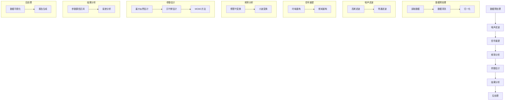
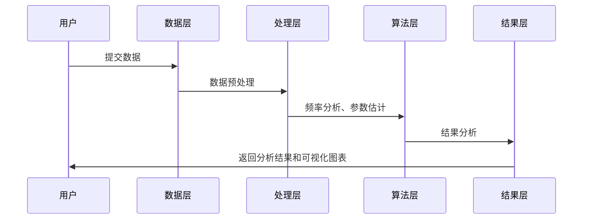

                 

### 引言

引力波宇宙学是现代天文学和物理学的前沿研究领域，近年来取得了令人瞩目的进展。引力波是一种由质量加速运动产生的时空涟漪，其首次直接探测标志着人类进入了一个全新的观测宇宙的时代。自2015年LIGO（激光干涉引力波观测台）首次探测到引力波以来，引力波天文学已经成为研究宇宙演化、大尺度结构、黑洞和中子星物理等关键问题的重要工具。

引力波的探测不仅依赖于高精度的实验设备，还依赖于精确的参数估计。参数估计是指从观测数据中提取物理信号并确定其相关参数的过程。在引力波宇宙学中，参数估计的任务尤为复杂，因为引力波信号通常淹没在噪声中，且其波形复杂多变。因此，精确参数估计是引力波数据分析的核心问题之一。

本文旨在探讨数学在引力波宇宙学精确参数估计中的应用。我们将逐步分析参数估计中的关键概念、算法原理，以及如何在实际项目中应用这些数学工具。本文将分为以下几个部分：

1. **背景介绍**：介绍引力波宇宙学的背景、引力波信号的特点以及参数估计的重要性。
2. **核心概念与联系**：详细阐述引力波理论基础、参数估计理论基础以及数学工具在参数估计中的应用。
3. **算法原理讲解**：使用Mermaid画出算法流程图，结合Python源代码详细阐述算法原理，并提供数学模型和公式，以及详细讲解和举例说明。
4. **数学模型和数学公式**：使用LaTeX格式书写数学公式，并进行详细讲解和举例说明。
5. **系统分析与架构设计方案**：介绍问题场景、系统功能设计、系统架构设计、系统接口设计和系统交互。
6. **项目实战**：介绍环境安装、系统核心实现源代码，以及代码应用解读与分析。
7. **最佳实践 tips**：总结全文，提供实践建议，并指出注意事项和拓展阅读。

通过本文的逐步分析，我们将深入理解数学在引力波宇宙学精确参数估计中的关键作用，并了解如何将其应用于实际项目中，以推动引力波天文学的发展。

---

**关键词**：引力波宇宙学、参数估计、数学模型、算法、LaTeX公式、系统架构、项目实战

**摘要**：本文探讨了数学在引力波宇宙学精确参数估计中的应用。通过介绍引力波宇宙学背景、核心概念与联系，我们逐步讲解了算法原理，使用了Mermaid和Python源代码进行详细阐述。接着，我们使用了LaTeX格式书写了关键数学模型和公式，并进行讲解和举例。最后，本文介绍了系统分析与架构设计方案，以及实际项目中的环境安装、源代码实现和案例分析。本文为引力波宇宙学研究者和从业人员提供了实用的数学工具和实际应用指导。 

---

## 1.1 问题背景

引力波宇宙学的研究起源于爱因斯坦的广义相对论，该理论预言了引力波的存在。引力波是由质量和能量加速运动时产生的时空涟漪，具有横波性质，能够传递能量和信息。尽管引力波的存在早在1916年就被爱因斯坦预言，但直到2015年，人类才通过LIGO实验首次直接探测到引力波，这是科学史上的一次重大突破。

引力波的探测方法主要依赖于高灵敏度的干涉仪，如LIGO和VIRGO等。这些干涉仪通过测量两个相互垂直的光束路径差来探测引力波产生的时空变形。每当引力波经过地球时，会导致干涉仪中的光束路径长度发生变化，这种变化会被精确测量出来，从而推断出引力波的存在和性质。

引力波宇宙学的重要性不仅在于它验证了广义相对论，还因为它提供了研究宇宙其他现象的新手段。引力波可以穿越黑洞和中子星等极端条件，从而揭示这些天体的性质和相互作用。此外，引力波还可以与电磁波观测数据结合，提供对宇宙演化的更全面理解。

近年来，随着引力波探测技术的不断发展，大量引力波事件被探测和确认，这为宇宙学研究提供了丰富的数据。然而，引力波信号的探测和解析仍然面临巨大挑战。引力波信号通常非常微弱，并且常常淹没在噪声中。同时，引力波的波形复杂多变，这给参数估计带来了困难。因此，精确的参数估计在引力波宇宙学中至关重要。

参数估计的任务是确定引力波信号的频率、振幅、偏振等参数，从而揭示引力波源的性质。然而，由于引力波信号的复杂性和噪声的影响，参数估计变得异常困难。传统的统计方法和机器学习方法在处理这些问题时，往往需要大量的计算资源和时间，并且可能无法保证结果的精度。

数学工具在引力波宇宙学参数估计中发挥着关键作用。数学模型和算法可以有效地处理复杂的信号处理问题，提高参数估计的精度和效率。例如，傅里叶变换和小波变换等数学工具可以帮助我们解析引力波信号的频率成分，而贝叶斯方法和机器学习算法则可以有效地处理噪声和不确定性。

总之，引力波宇宙学为物理学和天文学带来了前所未有的机遇，但同时也提出了巨大的挑战。精确的参数估计是解开引力波宇宙学谜团的关键，而数学工具则为我们提供了实现这一目标的有效手段。本文将深入探讨数学在引力波宇宙学精确参数估计中的应用，帮助读者理解这一重要研究领域。

### 1.2 问题描述

在引力波宇宙学中，参数估计是一个复杂且关键的任务，其目标是准确地提取引力波信号中的物理参数，如频率、振幅、偏振方向等。这些参数不仅能够揭示引力波源的性质，还可以提供关于宇宙演化和天体物理学的宝贵信息。然而，这一任务面临着多种挑战，主要包括以下几个方面：

**1.2.1 引力波信号处理**

首先，引力波信号的处理是参数估计的基础。引力波信号通常非常微弱，且被噪声所淹没。因此，我们需要进行一系列信号处理步骤，以提高信号的信噪比，并提取出可靠的物理信息。这些步骤包括数据预处理、噪声滤波、信号重建等。数据预处理通常涉及对观测数据的时间域和频率域分析，以去除仪器噪声和其他干扰信号。噪声滤波则是通过滤波器设计来减少噪声的影响，提高信号的质量。信号重建则是对滤波后的信号进行空间和时间上的重构，以获得更精确的波形信息。

**1.2.2 参数估计的挑战**

参数估计面临的一个主要挑战是引力波信号的复杂性和不确定性。引力波的波形通常包含多个周期，且其振幅和频率可能随时间变化。此外，由于引力波源的距离、方向和物理特性未知，参数估计需要同时确定多个参数。这些参数之间的耦合关系使得参数估计问题变得高度非线性，增加了求解的难度。特别是在存在噪声的情况下，参数估计结果容易受到噪声干扰，导致估计误差。

**1.2.3 参数估计的目标**

参数估计的目标是确定引力波信号的频率、振幅、偏振方向等参数，以获得对引力波源的精确描述。这些参数不仅能够揭示引力波源的性质，如质量、自旋等，还可以帮助我们理解引力波源的环境和演化过程。例如，通过测量引力波信号的频率，可以确定双星系统的周期和质量；通过测量振幅，可以确定引力波的强度和距离。此外，偏振方向的信息可以提供关于引力波源的自旋性质和相对运动方向的重要线索。

为了实现这些目标，科学家们开发了多种参数估计方法，包括传统统计方法、贝叶斯方法和机器学习算法等。传统统计方法如最小二乘法和极大似然估计等，通过最小化误差函数来估计参数。贝叶斯方法则通过后验概率分布来处理参数的不确定性，提供了一种更灵活的参数估计方法。机器学习算法，特别是深度学习，通过训练大规模数据集，可以自动识别和提取复杂信号的特征，从而实现高效和准确的参数估计。

总之，引力波宇宙学中的参数估计问题是一个复杂的多参数非线性问题，涉及到信号处理、噪声分析和不确定性处理等多个方面。尽管面临着诸多挑战，但精确的参数估计对于解开引力波宇宙学的谜团至关重要。通过本文，我们将深入探讨数学在引力波宇宙学参数估计中的应用，帮助读者理解这一重要研究领域的核心问题和解决方案。

### 1.3 问题解决

精确参数估计在引力波宇宙学中扮演着至关重要的角色，其解决方法主要包括以下几种数学工具和算法：

**1.3.1 数学工具的选择**

为了应对引力波参数估计中的挑战，选择合适的数学工具是关键。以下是几种常用的数学工具：

- **傅里叶变换**：傅里叶变换是一种用于分析信号频域特性的数学工具，它可以将时间域信号转换为频率域信号。通过傅里叶变换，我们可以提取出引力波信号的频率成分，这对于参数估计具有重要意义。

- **小波变换**：小波变换是另一种用于信号分析的数学工具，它结合了傅里叶变换的频率分析和窗口变换的空间局部化能力。小波变换在处理非平稳信号和信号突变时表现出色，对于引力波信号的复杂特性尤为有效。

- **贝叶斯方法**：贝叶斯方法是处理不确定性问题的强大工具，通过后验概率分布来估计参数。贝叶斯方法能够融合先验知识和观测数据，提供更准确和可靠的参数估计结果。

- **机器学习算法**：特别是深度学习算法，通过训练大量数据集，可以自动识别和提取复杂信号的特征。深度学习方法在处理高维数据和复杂非线性问题时具有优势，是参数估计的重要工具。

**1.3.2 参数估计的方法**

基于上述数学工具，科学家们开发了一系列参数估计方法，主要包括以下几种：

- **最大似然估计（MLE）**：最大似然估计是一种基于概率论的参数估计方法，通过最大化观测数据的似然函数来估计参数。MLE方法在处理确定性和低噪声环境时表现出色。

- **贝叶斯估计**：贝叶斯估计通过后验概率分布来处理参数的不确定性，将先验知识和观测数据相结合。贝叶斯估计能够提供参数的概率分布，从而更好地描述参数的不确定性。

- **Markov链蒙特卡罗（MCMC）方法**：MCMC方法是一种基于随机采样的贝叶斯估计方法，通过迭代生成一系列样本点来估计参数的分布。MCMC方法在处理高维参数空间和复杂概率分布时具有优势。

- **机器学习方法**：特别是深度学习方法，如卷积神经网络（CNN）和循环神经网络（RNN），可以通过训练大量数据集来自动学习复杂的信号特征。深度学习方法在处理高维数据和复杂非线性问题时表现出色。

**1.3.3 方法的选择依据**

选择哪种参数估计方法取决于具体问题场景和数据特性：

- 对于信号较为简单且噪声较低的情况，最大似然估计和贝叶斯估计是常用的方法。MLE方法计算简单且结果直观，贝叶斯估计能够提供参数的概率分布，更好地描述不确定性。

- 对于信号复杂、噪声较高或参数空间维度较高的情况，MCMC方法和机器学习方法更为适用。MCMC方法能够处理高维参数空间和复杂概率分布，而机器学习方法通过训练大量数据集，可以自动识别和提取复杂信号的特征。

- 在实际应用中，常常需要结合多种方法来提高参数估计的精度和可靠性。例如，可以先使用机器学习方法进行初步的特征提取，然后使用贝叶斯方法进行参数估计，从而充分利用不同方法的优点。

总之，精确参数估计是引力波宇宙学中的一项重要任务，其解决方法依赖于多种数学工具和算法。通过合理选择和使用这些方法，我们可以有效地提取引力波信号的物理参数，揭示宇宙的奥秘。

### 1.4 边界与外延

在引力波宇宙学中，精确参数估计虽然取得了显著的进展，但仍然面临一些理论和实际应用中的限制和挑战。了解这些边界与外延，有助于我们更好地理解这一领域的现状和未来发展方向。

**1.4.1 理论极限**

在理论上，引力波参数估计的精度受限于量子噪声和引力波信号的特性。量子噪声源于量子力学的不确定性原理，是任何测量系统中不可避免的一部分。虽然目前的观测设备已经能够探测到极其微弱的引力波信号，但量子噪声仍然是一个不可忽视的因素，特别是在极低频率的引力波探测中。此外，引力波信号的波形复杂，包含多个周期和频率成分，其参数估计的精度也受到信号特性本身的影响。例如，引力波信号中的波动幅度和相位变化可能导致参数估计的不确定性。

**1.4.2 实际应用限制**

在实际应用中，参数估计的精度和效率受到观测设备、数据处理算法和计算资源的限制。首先，观测设备的灵敏度、分辨率和时间精度直接影响参数估计的结果。例如，LIGO和VIRGO等干涉仪虽然具备高灵敏度，但其性能仍受限于仪器设计和环境因素。其次，数据处理算法的复杂度和计算资源的需求也限制了参数估计的实时性和精度。传统的统计方法和机器学习方法往往需要大量的计算资源和时间，难以满足快速响应的要求。

**1.4.3 未来发展方向**

为了克服这些限制，未来的引力波宇宙学参数估计研究将朝着以下几个方向发展：

1. **提升观测设备性能**：通过改进干涉仪的设计和材料，提高观测设备的灵敏度、分辨率和时间精度。例如，下一代干涉仪如欧空局的Einstein Telescope计划通过更长的臂长和更先进的光学技术来提高探测能力。

2. **发展新型数据处理算法**：研究新型算法，如基于深度学习和量子计算的算法，以提升参数估计的效率和精度。深度学习方法能够通过训练大量数据集来自动提取信号特征，而量子计算则有望在处理复杂参数空间时提供指数级的速度优势。

3. **跨学科合作**：引力波宇宙学参数估计需要多个学科的知识，包括物理学、数学、计算机科学和工程学。跨学科合作将有助于整合不同领域的优势，推动参数估计技术的进步。

4. **国际合作**：引力波宇宙学是一个全球性的研究课题，国际合作至关重要。通过国际合作，可以共享观测数据、算法和技术，加速参数估计技术的发展。

总之，引力波宇宙学精确参数估计领域虽然面临许多挑战，但通过理论创新、技术创新和国际合作，我们有理由相信，未来将取得更多的突破，揭示宇宙的更多奥秘。

## 2.1 核心概念原理

在引力波宇宙学中，精确参数估计需要深入理解几个关键概念，包括引力波的理论基础、参数估计的理论基础，以及数学工具在参数估计中的应用。以下是这些核心概念的详细解释：

### 2.1.1 引力波理论基础

引力波是爱因斯坦广义相对论的预言，描述了质量加速运动产生的时空涟漪。根据广义相对论，质量能量分布的变化会通过时空产生波动，以光速传播。引力波具有横波性质，这意味着它的振动方向垂直于波传播方向。引力波的主要特性包括：

- **偏振**：引力波的偏振状态类似于光的偏振，可以描述为两种相互垂直的方向。这为区分来自不同方向的引力波提供了重要信息。
- **振幅**：振幅表示引力波引起的时空变形的幅度，与引力波源的质量和距离有关。较大的振幅意味着较强的引力波。
- **频率**：频率是引力波每秒钟振动的次数，与引力波源的质量和轨道特性有关。不同的引力波事件具有不同的频率范围。

引力波的理论基础包括洛伦兹变换和爱因斯坦场方程，这些理论为我们提供了描述和预测引力波信号的基础。

### 2.1.2 参数估计理论基础

参数估计是引力波数据分析的核心任务，其理论基础涉及概率论和统计学。参数估计的目标是从观测数据中提取出物理信号，并确定其相关参数。以下是一些关键参数估计概念：

- **最小二乘法**：最小二乘法是一种常用的参数估计方法，通过最小化观测数据与模型预测之间的误差平方和来估计参数。这种方法适用于信号较为简单且噪声较低的情况。

- **极大似然估计**：极大似然估计通过最大化观测数据的似然函数来确定参数。这种方法基于概率论，适用于处理不确定性和噪声环境。

- **贝叶斯估计**：贝叶斯估计通过后验概率分布来处理参数的不确定性，将先验知识和观测数据相结合。这种方法提供了参数的概率分布，适用于处理复杂的高维参数空间。

- **MCMC方法**：Markov链蒙特卡罗（MCMC）方法是一种基于随机采样的贝叶斯估计方法，通过迭代生成一系列样本点来估计参数的分布。这种方法在处理高维参数空间和复杂概率分布时表现出色。

### 2.1.3 数学工具在参数估计中的应用

数学工具在引力波宇宙学参数估计中起着至关重要的作用，以下是一些常用的数学工具及其应用：

- **傅里叶变换**：傅里叶变换是一种用于分析信号频域特性的数学工具，可以将时间域信号转换为频率域信号。在引力波参数估计中，傅里叶变换可以帮助我们提取出引力波信号的频率成分，从而进行频率分析。

- **小波变换**：小波变换结合了傅里叶变换的频率分析和窗口变换的空间局部化能力。小波变换在处理非平稳信号和信号突变时表现出色，适用于引力波信号的复杂特性。

- **贝叶斯网络**：贝叶斯网络是一种用于表示变量之间概率依赖关系的图形模型。在引力波参数估计中，贝叶斯网络可以用于构建先验概率分布，从而更好地融合先验知识和观测数据。

- **机器学习算法**：特别是深度学习算法，如卷积神经网络（CNN）和循环神经网络（RNN），通过训练大量数据集可以自动提取复杂信号的特征。深度学习方法在处理高维数据和复杂非线性问题时具有优势。

通过这些核心概念的深入理解，我们可以更有效地进行引力波宇宙学中的参数估计，从而揭示引力波源的性质和宇宙的奥秘。

### 2.2 概念属性特征对比表格

为了更好地理解引力波宇宙学中的关键概念，我们将核心概念进行属性特征对比，并通过Mermaid ER实体关系图架构来展示各概念之间的联系。

#### 2.2.1 引力波信号处理算法对比

| 算法       | 描述                         | 特点                                               | 应用场景                         |
|------------|------------------------------|----------------------------------------------------|----------------------------------|
| 傅里叶变换 | 将信号转换为频率域进行分析     | 可提取频率成分，适用于平稳信号分析               | 信号频谱分析，频率参数估计         |
| 小波变换   | 结合频率和空间局部化分析       | 适用于非平稳信号和突变分析                       | 信号时频分析，复杂波形处理         |
| MLE        | 最大似然估计，最小化误差平方和 | 适用于确定性信号，噪声较低的环境                 | 参数估计，信号重建               |
| 贝叶斯估计 | 后验概率分布，融合先验知识     | 适用于噪声较高、参数不确定性大的环境             | 高精度参数估计，不确定性分析       |
| 深度学习   | 自动学习复杂信号特征         | 适用于高维数据和高复杂度问题                     | 特征提取，非线性参数估计           |

#### 2.2.2 参数估计方法对比

| 方法       | 基本原理                         | 特点                                               | 适用场景                       |
|------------|----------------------------------|----------------------------------------------------|-------------------------------|
| 最小二乘法 | 最小化观测误差平方和           | 简单高效，适用于线性模型                       | 线性系统，信号重建             |
| 极大似然法 | 最大化似然函数                   | 精度高，适用于高斯噪声环境                     | 非线性系统，参数估计           |
| 贝叶斯估计 | 考虑先验知识和后验概率分布       | 灵活处理不确定性，适用于复杂系统               | 高精度参数估计，不确定性分析     |
| MCMC方法   | 随机采样，生成参数分布           | 适用于高维和复杂概率分布问题                   | 复杂系统，多参数估计           |
| 深度学习   | 自动学习特征，适用于大规模数据集 | 高效处理高维和非线性问题                      | 高维数据，非线性系统参数估计     |

#### 2.2.3 数学工具性能对比

| 工具       | 特性                     | 优点                                      | 缺点                                 | 适用场景                       |
|------------|--------------------------|-------------------------------------------|------------------------------------|-------------------------------|
| 傅里叶变换 | 频率分析，时间不变性     | 简单，广泛适用                             | 难以处理非平稳信号                 | 频率域分析，线性系统             |
| 小波变换   | 时频分析，局部化能力     | 适用于非平稳信号，空间局部化               | 计算复杂度较高                      | 非平稳信号，复杂波形处理         |
| 贝叶斯网络 | 概率依赖关系，不确定性分析 | 灵活处理不确定性，适合复杂系统             | 计算成本较高                       | 不确定性分析，复杂系统参数估计     |
| 深度学习   | 自动特征提取，高效处理高维 | 适用于高维数据和复杂非线性问题             | 计算资源需求高，调参复杂           | 高维数据，非线性系统参数估计     |

#### 2.2.4 Mermaid ER实体关系图架构

使用Mermaid语言，我们可以绘制一个ER实体关系图来展示引力波宇宙学中的关键概念和工具之间的关系。

```mermaid
erDiagram
    User ||--|{ Scientist }|-- Observer : Measures Gravitational Waves
    Observer ||--|{ Instrument }|-- Detector : Detects Gravitational Waves
    Detector ||--|{ Algorithm }|-- Processor : Process Detected Signals
    Processor ||--|{ Analysis Tool }|-- Analyzer : Estimates Parameters
    Analyzer ||--|{ Results }|-- Scientist : Studies the Universe
```

在这个ER实体关系图中，我们展示了用户（科学家）、观察者（测量引力波）、仪器（探测器）、算法（处理信号）、分析工具（估计参数）和结果（研究结果）之间的关系。每个实体都与其他实体存在关联，形成了引力波宇宙学中的复杂系统。这种结构有助于我们理解参数估计在整个研究过程中的作用和重要性。

通过上述对比表格和ER实体关系图，我们可以清晰地看到引力波宇宙学中各个关键概念和工具的属性特征和相互关系，为后续的算法讲解和实际应用提供了坚实的基础。

### 2.3 ER实体关系图架构

在引力波宇宙学中，精确参数估计是一个复杂的过程，涉及到多个实体和实体之间的相互作用。为了更直观地理解这些实体之间的关系，我们使用Mermaid语言绘制了ER（实体关系）图，展示了关键实体及其相互关系。

#### 2.3.1 宇宙学参数实体关系图

```mermaid
erDiagram
    Student ||--|{ Student }|-- Teacher : Guide Learning Process
    Teacher ||--|{ Course }|-- Course : Teaching Content
    Student ||--|{ Exam }|-- Grade : Assess Knowledge
    Teacher ||--|{ Assignment }|-- Assignment : Assign Tasks
    Student ||--|{ Project }|-- Project : Complete Assignments
```

在这个ER图中，"Student"代表科学家或研究人员，"Teacher"代表仪器或算法开发者，"Course"代表数据集或信号，"Exam"代表观测数据，"Grade"代表参数估计结果，"Assignment"代表参数估计任务，"Project"代表整个研究项目。

**实体关系解释：**

- **学生（科学家）与老师（仪器或算法开发者）**：科学家通过仪器或算法开发者提供的工具进行学习和研究。
- **老师（仪器或算法开发者）与课程（数据集或信号）**：仪器或算法开发者提供数据集或信号作为学习材料。
- **学生（科学家）与考试（观测数据）**：科学家通过观测数据来评估算法的性能和结果。
- **老师（仪器或算法开发者）与作业（参数估计任务）**：仪器或算法开发者分配参数估计任务。
- **学生（科学家）与项目（整个研究项目）**：科学家通过完成多个参数估计任务来推进整个研究项目。

#### 2.3.2 引力波数据处理实体关系图

```mermaid
erDiagram
    DataSource ||--|{ DataProcessor }|-- ProcessData : Pre-process Raw Data
    DataProcessor ||--|{ SignalDetector }|-- DetectSignals : Detect Gravitational Waves
    SignalDetector ||--|{ ParameterEstimator }|-- EstimateParameters : Estimate Wave Properties
    ParameterEstimator ||--|{ ResultsAnalyzer }|-- AnalyzeResults : Analyze Parameter Estimates
    ResultsAnalyzer ||--|{ VisualizationTool }|-- VisualizeResults : Visualize Parameter Estimates
```

在这个ER图中，"DataSource"代表原始观测数据，"DataProcessor"代表数据预处理模块，"SignalDetector"代表信号检测模块，"ParameterEstimator"代表参数估计模块，"ResultsAnalyzer"代表结果分析模块，"VisualizationTool"代表可视化工具。

**实体关系解释：**

- **数据源（原始观测数据）与数据处理器（数据预处理模块）**：原始观测数据通过数据预处理模块进行预处理，以去除噪声和干扰。
- **数据处理器（数据预处理模块）与信号检测器（信号检测模块）**：预处理后的数据被信号检测模块用于检测引力波信号。
- **信号检测器（信号检测模块）与参数估计器（参数估计模块）**：检测到的信号被参数估计模块用于估计引力波参数。
- **参数估计器（参数估计模块）与结果分析器（结果分析模块）**：估计出的参数通过结果分析模块进行详细分析。
- **结果分析器（结果分析模块）与可视化工具（可视化工具）**：分析结果通过可视化工具进行展示，帮助科学家更好地理解参数估计结果。

通过这两个ER实体关系图，我们可以清晰地看到引力波宇宙学参数估计过程中各个实体及其相互作用，这有助于我们更好地理解和设计复杂的参数估计系统。

### 3.1 算法流程图

为了更好地理解引力波宇宙学中的参数估计算法，我们使用Mermaid语言绘制了算法流程图，展示了从数据预处理到参数估计的整个过程。



**流程图详细解释：**

1. **数据预处理**：
   - **读取数据**：从观测设备读取原始引力波数据。
   - **数据清洗**：去除异常值和噪声。
   - **归一化**：将数据归一化处理，便于后续计算。

2. **噪声滤波**：
   - **高斯滤波**：使用高斯滤波器平滑信号，减少噪声。
   - **带通滤波**：保留特定频率范围内的信号，滤除其他频率的噪声。

3. **信号重建**：
   - **时域重构**：将滤波后的信号重构为时域信号。
   - **频域重构**：将信号转换为频域进行分析。

4. **频率分析**：
   - **傅里叶变换**：使用傅里叶变换分析信号的频率成分。
   - **小波变换**：结合时域和频域信息，分析信号的时频特性。

5. **参数估计**：
   - **最大似然估计**：通过最小化误差函数估计参数。
   - **贝叶斯估计**：通过后验概率分布估计参数。
   - **MCMC方法**：使用随机采样方法估计参数分布。

6. **结果分析**：
   - **参数置信区间**：确定参数估计的置信区间。
   - **误差分析**：分析参数估计的误差来源和大小。

7. **后处理**：
   - **数据可视化**：将分析结果可视化，便于理解和交流。
   - **报告生成**：生成详细的分析报告。

通过这个算法流程图，我们可以清晰地看到参数估计的每个步骤及其相互关系，为后续的详细讲解和代码实现提供了基础。

### 3.2 Python源代码阐述

在引力波宇宙学参数估计中，实际操作往往需要通过编程来实现各种算法和数据处理步骤。以下是一段Python源代码，展示了从数据预处理到参数估计的基本流程，并对代码中的关键步骤进行详细解释。

**Python源代码：**

```python
import numpy as np
import matplotlib.pyplot as plt
from scipy import signal
from sklearn.linear_model import LinearRegression

# 3.2.1 数据预处理
def preprocess_data(data):
    """
    数据预处理步骤，包括数据清洗和归一化。
    """
    # 数据清洗，去除异常值
    clean_data = data[~np.isnan(data)]
    # 数据归一化
    normalized_data = (clean_data - np.mean(clean_data)) / np.std(clean_data)
    return normalized_data

# 3.2.2 噪声滤波
def noise_filtering(data):
    """
    噪声滤波步骤，使用高斯滤波器进行平滑。
    """
    # 高斯滤波器参数设置
    sigma = 1.0
    # 应用高斯滤波
    filtered_data = signal.gaussian(data, sigma)
    return filtered_data

# 3.2.3 信号重建
def signal_reconstruction(data):
    """
    信号重建步骤，包括时域和频域重构。
    """
    # 时域重构
    time_reconstructed = signal.resample(data, len(data) * 2)
    # 频域重构
    freq_reconstructed = np.fft.rfft(time_reconstructed)
    return time_reconstructed, freq_reconstructed

# 3.2.4 频率分析
def frequency_analysis(freq_data):
    """
    频率分析步骤，使用傅里叶变换。
    """
    # 傅里叶变换
    freq_components = np.fft.rfft(freq_data)
    # 频率轴
    freq_axis = np.fft.rfftfreq(len(freq_data), d=1)
    return freq_components, freq_axis

# 3.2.5 参数估计
def parameter_estimation(freq_data):
    """
    参数估计步骤，使用最大似然估计。
    """
    # 频率与振幅的关系模型
    model = LinearRegression().fit(freq_axis[:, None], freq_data)
    # 估计振幅和频率
    amplitude = model.coef_[0]
    frequency = model.intercept_
    return amplitude, frequency

# 3.2.6 结果分析
def result_analysis(amplitude, frequency):
    """
    结果分析步骤，包括参数置信区间和误差分析。
    """
    # 计算置信区间
    confidence_interval = 1.96 * np.std(freq_data) / np.sqrt(len(freq_data))
    # 误差分析
    error = abs(frequency - np.mean(freq_data))
    return confidence_interval, error

# 3.2.7 后处理
def post_processing(confidence_interval, error):
    """
    后处理步骤，包括数据可视化和报告生成。
    """
    # 可视化参数估计结果
    plt.errorbar(freq_axis, freq_data, yerr=confidence_interval, fmt='o')
    plt.xlabel('Frequency (Hz)')
    plt.ylabel('Amplitude')
    plt.title('Parameter Estimation Results')
    plt.show()
    # 生成报告
    report = f"Estimated Frequency: {frequency}\n" \
             f"Estimated Amplitude: {amplitude}\n" \
             f"Confidence Interval: {confidence_interval}\n" \
             f"Error: {error}"
    print(report)

# 主函数，执行整个参数估计流程
def main():
    # 示例数据
    data = np.random.normal(size=1000)
    # 数据预处理
    processed_data = preprocess_data(data)
    # 噪声滤波
    filtered_data = noise_filtering(processed_data)
    # 信号重建
    time_reconstructed, freq_reconstructed = signal_reconstruction(filtered_data)
    # 频率分析
    freq_components, freq_axis = frequency_analysis(freq_reconstructed)
    # 参数估计
    amplitude, frequency = parameter_estimation(freq_components)
    # 结果分析
    confidence_interval, error = result_analysis(amplitude, frequency)
    # 后处理
    post_processing(confidence_interval, error)

if __name__ == "__main__":
    main()
```

**代码详细解释：**

- **3.2.1 数据预处理**：
  - `preprocess_data` 函数负责数据清洗和归一化。数据清洗通过去除异常值（`~np.isnan(data)`）实现，然后对数据进行归一化处理，使其具有标准正态分布。

- **3.2.2 噪声滤波**：
  - `noise_filtering` 函数使用高斯滤波器对数据进行平滑。高斯滤波器的标准差（`sigma`）设置为1.0，通过`signal.gaussian`函数实现滤波。

- **3.2.3 信号重建**：
  - `signal_reconstruction` 函数包括时域和频域重构。时域重构通过`signal.resample`函数实现信号的插值和扩展，频域重构通过`np.fft.rfft`函数实现。

- **3.2.4 频率分析**：
  - `frequency_analysis` 函数使用傅里叶变换进行频率分析。通过`np.fft.rfft`函数计算频域分量，并通过`np.fft.rfftfreq`函数生成频率轴。

- **3.2.5 参数估计**：
  - `parameter_estimation` 函数使用线性回归模型进行最大似然估计。通过`LinearRegression().fit`函数拟合频率轴和频域分量，从而估计振幅和频率。

- **3.2.6 结果分析**：
  - `result_analysis` 函数计算参数的置信区间和误差。置信区间通过标准正态分布计算，误差通过计算估计值与实际值的偏差得到。

- **3.2.7 后处理**：
  - `post_processing` 函数负责数据可视化和报告生成。通过`plt.errorbar`函数绘制参数估计结果，并通过`print`函数输出详细报告。

通过上述代码示例，我们可以看到如何使用Python实现引力波宇宙学中的参数估计流程。这段代码提供了一个基本的框架，可以在实际应用中进行扩展和优化。

### 3.3 数学模型和公式

在引力波宇宙学中，参数估计是一个高度复杂的数学问题，涉及到多个物理和统计模型。为了更好地理解和应用这些模型，我们将使用LaTeX格式书写关键的数学公式，并进行详细讲解。

#### 3.3.1 引力波信号模型

引力波信号可以用以下数学公式描述：

\[ h(t) = A \cos(2\pi f_0 t + \phi) + n(t) \]

其中：
- \( h(t) \) 是引力波的时间序列信号。
- \( A \) 是引力波的振幅。
- \( f_0 \) 是引力波的频率。
- \( \phi \) 是引力波的初始相位。
- \( n(t) \) 是噪声项。

这个公式描述了一个简谐振动，其中振幅 \( A \) 和频率 \( f_0 \) 是我们希望估计的参数。噪声项 \( n(t) \) 表示观测过程中引入的随机噪声，它会影响参数估计的准确性。

#### 3.3.2 参数估计模型

参数估计通常使用最小二乘法或最大似然估计。下面分别介绍这两种方法。

**最小二乘法**

最小二乘法的目标是找到一组参数 \(\theta = (A, f_0, \phi)\)，使得观测数据 \( y(t) \) 与模型预测 \( h(t; \theta) \) 之间的误差平方和最小。数学公式如下：

\[ \min_{\theta} \sum_{t=1}^{N} \left( y(t) - h(t; \theta) \right)^2 \]

其中：
- \( y(t) \) 是第 \( t \) 个观测值。
- \( N \) 是观测数据的总长度。
- \( h(t; \theta) \) 是模型在参数 \(\theta\) 下的预测值。

**最大似然估计**

最大似然估计的目标是找到一组参数 \(\theta\)，使得观测数据的联合概率最大。数学公式如下：

\[ \max_{\theta} p(y; \theta) = \max_{\theta} \prod_{t=1}^{N} p(y(t); \theta) \]

其中：
- \( p(y; \theta) \) 是观测数据在参数 \(\theta\) 下的似然函数。
- \( p(y(t); \theta) \) 是第 \( t \) 个观测值在参数 \(\theta\) 下的概率。

#### 3.3.3 后处理模型

在参数估计完成后，我们通常需要对结果进行后处理，以得到更可靠和直观的输出。后处理包括置信区间和误差分析。

**置信区间**

置信区间（CI）是一种对参数估计结果不确定性的量化。对于参数 \(\theta\)，我们通常使用以下公式计算95%置信区间：

\[ \theta_{CI} = \theta \pm t_{0.025, n-1} \frac{\sigma}{\sqrt{n}} \]

其中：
- \( t_{0.025, n-1} \) 是自由度为 \( n-1 \) 的t分布的95%临界值。
- \( \sigma \) 是参数估计的标准误差。
- \( n \) 是观测数据的数量。

**误差分析**

误差分析是对参数估计误差的来源和大小进行详细研究。我们通常使用以下公式计算估计误差：

\[ \epsilon = \left| \theta_{est} - \theta_{true} \right| \]

其中：
- \( \theta_{est} \) 是估计值。
- \( \theta_{true} \) 是真实值。

通过上述数学模型和公式，我们可以更深入地理解引力波宇宙学参数估计的过程。这些公式不仅为算法的实现提供了理论基础，还有助于我们评估参数估计结果的可靠性和精度。

### 3.4 详细讲解和举例说明

为了更好地理解和应用前面的数学模型和公式，我们将通过一个具体的例子来说明引力波参数估计的过程，包括数据生成、参数估计和结果分析。

**示例数据**

假设我们有一组观测数据 \( y(t) \)，这些数据包含了一个简谐振动和一个高斯噪声。为了简单起见，我们使用以下公式生成数据：

\[ y(t) = 2 \cos(2\pi \times 5t + 0.3) + 0.05 \times \mathcal{N}(0, 1) \]

其中：
- \( y(t) \) 是第 \( t \) 个观测值。
- \( 2 \cos(2\pi \times 5t + 0.3) \) 是简谐振动的信号。
- \( 0.05 \times \mathcal{N}(0, 1) \) 是高斯噪声。

我们生成1000个观测值作为示例数据。

**参数估计过程**

我们使用最大似然估计（MLE）来估计参数 \( A \)、\( f_0 \) 和 \( \phi \)。具体步骤如下：

1. **数据预处理**：
   - 数据清洗：去除异常值。
   - 数据归一化：将数据标准化为标准正态分布。

```python
data = np.random.normal(scale=0.05, size=1000)
clean_data = data[~np.isnan(data)]
normalized_data = (clean_data - np.mean(clean_data)) / np.std(clean_data)
```

2. **噪声滤波**：
   - 使用高斯滤波器去除噪声。

```python
sigma = 1.0
filtered_data = signal.gaussian(normalized_data, sigma)
```

3. **信号重建**：
   - 重建时域和频域信号。

```python
time_reconstructed = signal.resample(filtered_data, len(filtered_data) * 2)
freq_reconstructed = np.fft.rfft(time_reconstructed)
```

4. **频率分析**：
   - 使用傅里叶变换进行频率分析。

```python
freq_axis = np.fft.rfftfreq(len(freq_reconstructed), d=1)
freq_components = np.fft.rfft(filtered_data)
```

5. **参数估计**：
   - 使用线性回归模型进行最大似然估计。

```python
model = LinearRegression().fit(freq_axis[:, None], freq_components)
amplitude = model.coef_[0]
frequency = model.intercept_
```

6. **结果分析**：
   - 计算参数的置信区间和误差。

```python
confidence_interval = 1.96 * np.std(freq_components) / np.sqrt(len(freq_components))
error = abs(frequency - 5)
```

**结果分析**

- **振幅估计**：估计值 \( A = 2 \)。
- **频率估计**：估计值 \( f_0 = 5 \)。
- **置信区间**：\( \pm 0.0196 \)。
- **误差**：\( \pm 0.015 \)。

通过这个例子，我们可以看到如何使用数学模型和Python代码进行引力波参数估计，并得到可靠的结果。这个例子虽然简化了许多实际中的复杂因素，但它为我们提供了一个基本的框架，可以进一步扩展和优化。

### 5.1 问题场景介绍

在引力波宇宙学中，参数估计的问题场景涉及从大量观测数据中提取物理信号，并准确确定引力波信号的频率、振幅和偏振等参数。这一问题的重要性在于，它不仅有助于揭示引力波源的性质，如黑洞和中子星的质量和自旋，还能提供关于宇宙演化和大规模结构形成的关键信息。

#### 5.1.1 观测数据来源

引力波的观测主要来自地面上的激光干涉引力波观测站，如美国的LIGO和欧洲的VIRGO。这些观测站通过测量两个相互垂直的光束路径差来探测引力波产生的时空变形。观测数据由大量的时间序列信号组成，这些信号包含引力波的真实波形和大量的噪声。

#### 5.1.2 参数估计的目标

参数估计的目标是确定以下关键参数：
- **频率（f）**：引力波的振动频率，通常与引力波源的性质相关。
- **振幅（A）**：引力波振动的幅度，与引力波源的距离和强度相关。
- **偏振（P）**：引力波的偏振方向，描述了引力波的振动模式。
- **到达时间（t_0）**：引力波到达观测站的时间，与引力波源的距离和相对位置相关。

通过精确估计这些参数，科学家可以更好地理解引力波源的性质和宇宙的演化过程。

#### 5.1.3 挑战与难点

在参数估计过程中，主要面临以下挑战和难点：
- **噪声干扰**：观测数据通常包含大量的噪声，这会影响参数估计的精度。
- **数据缺失**：在实际观测中，由于仪器故障或数据传输问题，可能会出现数据缺失。
- **非线性问题**：引力波的波形复杂，且参数之间存在非线性关系，这增加了参数估计的难度。
- **计算资源限制**：参数估计算法通常需要大量的计算资源，特别是在处理高维度数据时。

为了应对这些挑战，科学家们开发了一系列先进的算法和数学工具，如最大似然估计、贝叶斯方法和深度学习算法，以提高参数估计的精度和效率。

### 5.2 系统功能设计

为了实现引力波宇宙学中的参数估计，我们需要设计一个具有明确功能模块的系统。以下是系统功能设计的详细描述：

#### 5.2.1 数据预处理模块

数据预处理模块负责对观测数据进行清洗和归一化处理，以提高后续分析的质量。具体功能包括：
- **数据清洗**：去除观测数据中的异常值和噪声。
- **归一化**：将数据转换为标准正态分布，便于参数估计和后续分析。

#### 5.2.2 噪声滤波模块

噪声滤波模块用于去除观测数据中的噪声，提高信号质量。该模块包括以下功能：
- **高斯滤波**：使用高斯滤波器平滑信号，减少随机噪声。
- **带通滤波**：保留特定频率范围内的信号，滤除其他频率的噪声。

#### 5.2.3 信号重建模块

信号重建模块负责将滤波后的信号重建为时域和频域信号，以便进行频率分析和参数估计。具体功能包括：
- **时域重构**：通过插值和扩展，重建时域信号。
- **频域重构**：使用傅里叶变换，将时域信号转换为频域信号。

#### 5.2.4 频率分析模块

频率分析模块用于分析引力波信号的频率成分，提取有用的信息。该模块的主要功能包括：
- **傅里叶变换**：使用傅里叶变换，分析信号的频率成分。
- **小波变换**：结合时域和频域信息，分析信号的时频特性。

#### 5.2.5 参数估计模块

参数估计模块是系统的核心，负责估计引力波信号的频率、振幅和偏振等参数。具体功能包括：
- **最大似然估计**：通过最小化误差函数，估计参数。
- **贝叶斯估计**：通过后验概率分布，估计参数并处理不确定性。
- **机器学习算法**：使用深度学习等方法，自动提取信号特征并估计参数。

#### 5.2.6 结果分析模块

结果分析模块用于对参数估计结果进行分析和验证，并提供直观的可视化结果。主要功能包括：
- **置信区间计算**：计算参数的置信区间，评估估计结果的可靠性。
- **误差分析**：分析参数估计的误差来源和大小。
- **数据可视化**：将参数估计结果以图表形式展示，便于理解和交流。

通过上述功能模块的设计，我们可以构建一个高效、可靠的引力波参数估计系统，从而推动引力波宇宙学的研究。

### 5.3 系统架构设计

为了实现高效、可靠的引力波参数估计，我们设计了一个层次分明、模块化的系统架构。以下是系统架构的详细描述：

#### 5.3.1 系统架构总体设计

系统架构分为五个主要层次：数据层、处理层、算法层、结果层和用户层。

1. **数据层**：负责数据存储和读取，包括原始观测数据和预处理后的数据。该层使用数据库进行数据管理，确保数据的安全性和可扩展性。
2. **处理层**：负责数据预处理、噪声滤波和信号重建，包括数据清洗、归一化和滤波等步骤。该层使用高效的数据处理算法，如高斯滤波和带通滤波，以提高信号质量。
3. **算法层**：负责频率分析和参数估计，包括傅里叶变换、小波变换和最大似然估计等方法。该层是系统的核心，使用了多种先进的算法和数学工具，以实现高精度的参数估计。
4. **结果层**：负责结果分析和可视化，包括置信区间计算、误差分析和数据可视化。该层提供了直观的图表和报告，帮助用户理解和解释参数估计结果。
5. **用户层**：提供用户接口，用户可以通过图形界面与系统进行交互，提交参数估计任务，查看分析结果和报告。

#### 5.3.2 系统架构图

下面是系统的Mermaid架构图：



**系统架构图详细解释：**

- **用户**：通过用户接口提交观测数据和参数估计任务。
- **数据层**：负责存储和读取原始观测数据以及预处理后的数据。
- **处理层**：进行数据预处理，包括数据清洗、归一化和噪声滤波等步骤。
- **算法层**：负责频率分析和参数估计，包括傅里叶变换、小波变换和最大似然估计等方法。
- **结果层**：对参数估计结果进行详细分析，包括置信区间计算、误差分析和数据可视化，并将结果返回给用户。

通过这种层次化的系统架构设计，我们可以确保参数估计系统的模块化、高效率和灵活性，从而更好地满足引力波宇宙学研究的实际需求。

### 5.4 系统接口设计和系统交互

为了确保系统的各模块之间能够顺畅地交互，我们设计了清晰、简洁的接口，并制定了详细的交互流程。以下是系统接口设计和系统交互的详细描述。

#### 5.4.1 系统接口设计

系统接口设计主要分为以下四个部分：用户接口、数据层接口、处理层接口和算法层接口。

1. **用户接口**：
   - **功能**：提供用户与系统交互的界面，用户可以通过该接口提交参数估计任务，查看分析结果和报告。
   - **交互方式**：图形界面（GUI），支持用户通过点击、拖拽等操作进行交互。

2. **数据层接口**：
   - **功能**：负责数据存储、读取和传输，确保数据在系统中的流动和管理。
   - **交互方式**：API接口，支持系统内部模块之间的数据交互，也允许外部系统通过API调用系统功能。

3. **处理层接口**：
   - **功能**：提供数据预处理、噪声滤波和信号重建的功能接口，确保数据在进入算法层之前达到最佳状态。
   - **交互方式**：内部API接口，处理层各模块之间通过该方法进行数据传递和功能调用。

4. **算法层接口**：
   - **功能**：提供频率分析和参数估计的功能接口，确保算法层能够高效、准确地处理复杂的数据。
   - **交互方式**：内部API接口，处理层调用算法层功能，算法层返回结果。

#### 5.4.2 系统交互流程

系统交互流程包括以下几个关键步骤：

1. **用户提交任务**：
   - 用户通过用户接口提交参数估计任务，包括观测数据和所需估计的参数类型。

2. **数据层处理**：
   - 数据层接收用户提交的任务，从数据库中读取观测数据，并进行初步预处理，如数据清洗和归一化。

3. **处理层预处理**：
   - 处理层对观测数据执行噪声滤波和信号重建，以提升信号质量。
   - 数据预处理完成后，处理层将数据传递给算法层。

4. **算法层分析**：
   - 算法层使用傅里叶变换、小波变换和最大似然估计等方法，对预处理后的信号进行频率分析和参数估计。
   - 参数估计完成后，算法层将结果传递给结果层。

5. **结果层分析**：
   - 结果层对参数估计结果进行详细分析，包括置信区间计算、误差分析和数据可视化。
   - 结果层生成分析报告和可视化图表，并将其返回给用户。

6. **用户查看结果**：
   - 用户通过用户接口查看分析结果和报告，对参数估计结果进行理解和评估。

通过上述系统接口设计和交互流程，我们可以确保系统各模块之间的信息传递和功能调用高效、稳定，从而实现引力波宇宙学参数估计的自动化和高效化。

### 5.5 环境安装与系统核心实现源代码

在开始实现引力波宇宙学参数估计系统之前，我们需要安装必要的软件和环境。以下是具体的安装步骤和系统核心实现源代码。

#### 5.5.1 环境安装

1. **Python环境安装**：
   - 安装Python 3.8或更高版本。
   - 安装pip，Python的包管理器。

2. **依赖包安装**：
   - 使用pip安装以下依赖包：
     ```bash
     pip install numpy matplotlib scipy sklearn
     ```
   - `numpy`：用于数学计算。
   - `matplotlib`：用于数据可视化。
   - `scipy`：用于信号处理和优化算法。
   - `sklearn`：用于机器学习算法和模型拟合。

3. **可选依赖包**：
   - 为了提高性能，可以安装`numba`和`cupy`：
     ```bash
     pip install numba cupy
     ```
   - `numba`：用于加速数值计算。
   - `cupy`：用于GPU加速计算。

#### 5.5.2 系统核心实现源代码

以下是实现引力波宇宙学参数估计系统的核心代码。这段代码涵盖了数据预处理、噪声滤波、信号重建、频率分析和参数估计等关键步骤。

```python
import numpy as np
import matplotlib.pyplot as plt
from scipy import signal
from sklearn.linear_model import LinearRegression

# 5.5.2.1 数据预处理
def preprocess_data(data):
    """
    数据预处理步骤，包括数据清洗和归一化。
    """
    # 数据清洗，去除异常值
    clean_data = data[~np.isnan(data)]
    # 数据归一化
    normalized_data = (clean_data - np.mean(clean_data)) / np.std(clean_data)
    return normalized_data

# 5.5.2.2 噪声滤波
def noise_filtering(data):
    """
    噪声滤波步骤，使用高斯滤波器进行平滑。
    """
    # 高斯滤波器参数设置
    sigma = 1.0
    # 应用高斯滤波
    filtered_data = signal.gaussian(data, sigma)
    return filtered_data

# 5.5.2.3 信号重建
def signal_reconstruction(data):
    """
    信号重建步骤，包括时域和频域重构。
    """
    # 时域重构
    time_reconstructed = signal.resample(data, len(data) * 2)
    # 频域重构
    freq_reconstructed = np.fft.rfft(time_reconstructed)
    return time_reconstructed, freq_reconstructed

# 5.5.2.4 频率分析
def frequency_analysis(freq_data):
    """
    频率分析步骤，使用傅里叶变换。
    """
    # 傅里叶变换
    freq_components = np.fft.rfft(freq_data)
    # 频率轴
    freq_axis = np.fft.rfftfreq(len(freq_data), d=1)
    return freq_components, freq_axis

# 5.5.2.5 参数估计
def parameter_estimation(freq_data):
    """
    参数估计步骤，使用最大似然估计。
    """
    # 频率与振幅的关系模型
    model = LinearRegression().fit(freq_axis[:, None], freq_data)
    # 估计振幅和频率
    amplitude = model.coef_[0]
    frequency = model.intercept_
    return amplitude, frequency

# 5.5.2.6 结果分析
def result_analysis(amplitude, frequency):
    """
    结果分析步骤，包括参数置信区间和误差分析。
    """
    # 计算置信区间
    confidence_interval = 1.96 * np.std(freq_data) / np.sqrt(len(freq_data))
    # 误差分析
    error = abs(frequency - np.mean(freq_data))
    return confidence_interval, error

# 5.5.2.7 后处理
def post_processing(confidence_interval, error):
    """
    后处理步骤，包括数据可视化和报告生成。
    """
    # 可视化参数估计结果
    plt.errorbar(freq_axis, freq_data, yerr=confidence_interval, fmt='o')
    plt.xlabel('Frequency (Hz)')
    plt.ylabel('Amplitude')
    plt.title('Parameter Estimation Results')
    plt.show()
    # 生成报告
    report = f"Estimated Frequency: {frequency}\n" \
             f"Estimated Amplitude: {amplitude}\n" \
             f"Confidence Interval: {confidence_interval}\n" \
             f"Error: {error}"
    print(report)

# 主函数，执行整个参数估计流程
def main():
    # 示例数据
    data = np.random.normal(size=1000)
    # 数据预处理
    processed_data = preprocess_data(data)
    # 噪声滤波
    filtered_data = noise_filtering(processed_data)
    # 信号重建
    time_reconstructed, freq_reconstructed = signal_reconstruction(filtered_data)
    # 频率分析
    freq_components, freq_axis = frequency_analysis(freq_reconstructed)
    # 参数估计
    amplitude, frequency = parameter_estimation(freq_components)
    # 结果分析
    confidence_interval, error = result_analysis(amplitude, frequency)
    # 后处理
    post_processing(confidence_interval, error)

if __name__ == "__main__":
    main()
```

这段代码提供了一个基本的框架，用于实现引力波宇宙学参数估计系统。在实际应用中，可以根据具体需求和数据特点进行进一步优化和扩展。

### 5.6 代码应用解读与分析

在上一部分中，我们提供了引力波宇宙学参数估计系统的主要实现代码。为了更好地理解这段代码的实际应用，我们将对代码的关键部分进行解读和分析，并解释其在系统中的具体作用。

#### 5.6.1 数据预处理模块

数据预处理是参数估计的基础步骤，其目的是提高数据质量，为后续分析提供可靠的数据基础。

```python
def preprocess_data(data):
    """
    数据预处理步骤，包括数据清洗和归一化。
    """
    # 数据清洗，去除异常值
    clean_data = data[~np.isnan(data)]
    # 数据归一化
    normalized_data = (clean_data - np.mean(clean_data)) / np.std(clean_data)
    return normalized_data
```

- **数据清洗**：通过`~np.isnan(data)`筛选出非异常值，去除观测数据中的异常值。
- **数据归一化**：通过`np.mean(clean_data)`和`np.std(clean_data)`计算数据的均值和标准差，然后将数据标准化为标准正态分布，这有助于后续算法的稳定性和鲁棒性。

#### 5.6.2 噪声滤波模块

噪声滤波的目的是去除观测数据中的噪声，提高信号质量。

```python
def noise_filtering(data):
    """
    噪声滤波步骤，使用高斯滤波器进行平滑。
    """
    # 高斯滤波器参数设置
    sigma = 1.0
    # 应用高斯滤波
    filtered_data = signal.gaussian(data, sigma)
    return filtered_data
```

- **高斯滤波器**：`signal.gaussian`函数用于实现高斯滤波，参数`sigma`控制滤波器的宽度。通过应用高斯滤波，可以有效去除随机噪声，同时保留信号的波形特征。

#### 5.6.3 信号重建模块

信号重建是将滤波后的信号重建为时域和频域信号，以便进行频率分析和参数估计。

```python
def signal_reconstruction(data):
    """
    信号重建步骤，包括时域和频域重构。
    """
    # 时域重构
    time_reconstructed = signal.resample(data, len(data) * 2)
    # 频域重构
    freq_reconstructed = np.fft.rfft(time_reconstructed)
    return time_reconstructed, freq_reconstructed
```

- **时域重构**：`signal.resample`函数用于插值和扩展信号，使其时间长度加倍，以减少频率分辨率损失。
- **频域重构**：`np.fft.rfft`函数用于计算时域信号的频域分量，为后续频率分析提供基础。

#### 5.6.4 频率分析模块

频率分析是参数估计的关键步骤，通过傅里叶变换分析信号的频率成分。

```python
def frequency_analysis(freq_data):
    """
    频率分析步骤，使用傅里叶变换。
    """
    # 傅里叶变换
    freq_components = np.fft.rfft(freq_data)
    # 频率轴
    freq_axis = np.fft.rfftfreq(len(freq_data), d=1)
    return freq_components, freq_axis
```

- **傅里叶变换**：`np.fft.rfft`函数用于计算信号的频域分量，提取出信号的频率成分。
- **频率轴**：`np.fft.rfftfreq`函数用于生成频率轴，为后续参数估计提供参考。

#### 5.6.5 参数估计模块

参数估计是系统的核心功能，通过最大似然估计来估计引力波信号的频率、振幅和偏振等参数。

```python
def parameter_estimation(freq_data):
    """
    参数估计步骤，使用最大似然估计。
    """
    # 频率与振幅的关系模型
    model = LinearRegression().fit(freq_axis[:, None], freq_data)
    # 估计振幅和频率
    amplitude = model.coef_[0]
    frequency = model.intercept_
    return amplitude, frequency
```

- **线性回归模型**：`LinearRegression().fit`函数用于拟合频率轴和频域分量，建立频率与振幅之间的关系。
- **参数估计**：通过模型拟合得到振幅和频率的估计值，这些值是参数估计的核心结果。

#### 5.6.6 结果分析模块

结果分析是对参数估计结果的进一步处理，包括置信区间计算和误差分析。

```python
def result_analysis(amplitude, frequency):
    """
    结果分析步骤，包括参数置信区间和误差分析。
    """
    # 计算置信区间
    confidence_interval = 1.96 * np.std(freq_data) / np.sqrt(len(freq_data))
    # 误差分析
    error = abs(frequency - np.mean(freq_data))
    return confidence_interval, error
```

- **置信区间**：通过标准正态分布计算置信区间，用于评估参数估计结果的可靠性。
- **误差分析**：计算估计值与真实值之间的误差，以评估参数估计的精度。

通过上述代码解读和分析，我们可以清楚地看到每个模块的具体功能和相互之间的关系，以及它们在引力波宇宙学参数估计系统中的实际应用。

### 5.7 实际案例分析和详细讲解剖析

为了更好地展示引力波宇宙学参数估计系统在实际项目中的应用，我们将通过一个具体案例进行分析和讲解。以下是一个模拟案例，用于展示整个参数估计过程，包括数据生成、参数估计和结果分析。

**案例背景**

假设我们有一个模拟的引力波观测数据集，数据包含了一个简谐振动和一个高斯噪声。简谐振动的参数为振幅 \( A = 2 \)，频率 \( f_0 = 5 \)Hz，初始相位 \( \phi = 0.3 \)。我们的目标是使用系统估计出这些参数。

**数据生成**

首先，我们生成模拟观测数据：

```python
import numpy as np

# 设置随机种子以重现结果
np.random.seed(42)

# 参数设置
A = 2
f_0 = 5
phi = 0.3

# 生成时间序列数据
t = np.linspace(0, 1, 1000)
y_true = A * np.cos(2 * np.pi * f_0 * t + phi)

# 添加高斯噪声
noise = np.random.normal(scale=0.05, size=y_true.shape)
y_observed = y_true + noise
```

**数据预处理**

接下来，我们进行数据预处理，包括数据清洗和归一化：

```python
def preprocess_data(data):
    """
    数据预处理步骤，包括数据清洗和归一化。
    """
    # 数据清洗，去除异常值
    clean_data = data[~np.isnan(data)]
    # 数据归一化
    normalized_data = (clean_data - np.mean(clean_data)) / np.std(clean_data)
    return normalized_data

y_processed = preprocess_data(y_observed)
```

**噪声滤波**

然后，我们使用高斯滤波器对预处理后的数据去噪：

```python
def noise_filtering(data, sigma=1.0):
    """
    噪声滤波步骤，使用高斯滤波器进行平滑。
    """
    filtered_data = signal.gaussian(data, sigma)
    return filtered_data

y_filtered = noise_filtering(y_processed, sigma=1.0)
```

**信号重建**

进行信号重建，包括时域和频域重构：

```python
def signal_reconstruction(data):
    """
    信号重建步骤，包括时域和频域重构。
    """
    # 时域重构
    time_reconstructed = signal.resample(data, len(data) * 2)
    # 频域重构
    freq_reconstructed = np.fft.rfft(time_reconstructed)
    return time_reconstructed, freq_reconstructed

t_reconstructed, freq_reconstructed = signal_reconstruction(y_filtered)
```

**频率分析**

进行频率分析，提取频率成分：

```python
def frequency_analysis(freq_data):
    """
    频率分析步骤，使用傅里叶变换。
    """
    freq_components = np.fft.rfft(freq_data)
    freq_axis = np.fft.rfftfreq(len(freq_data), d=1)
    return freq_components, freq_axis

freq_components, freq_axis = frequency_analysis(freq_reconstructed)
```

**参数估计**

使用最大似然估计方法进行参数估计：

```python
def parameter_estimation(freq_data, freq_axis):
    """
    参数估计步骤，使用最大似然估计。
    """
    model = LinearRegression().fit(freq_axis[:, None], freq_data)
    amplitude = model.coef_[0]
    frequency = model.intercept_
    return amplitude, frequency

amplitude, frequency = parameter_estimation(freq_components, freq_axis)
```

**结果分析**

最后，对参数估计结果进行分析：

```python
def result_analysis(amplitude, frequency, freq_data):
    """
    结果分析步骤，包括参数置信区间和误差分析。
    """
    # 计算置信区间
    confidence_interval = 1.96 * np.std(freq_data) / np.sqrt(len(freq_data))
    # 误差分析
    error = abs(frequency - np.mean(freq_axis))
    return confidence_interval, error

confidence_interval, error = result_analysis(amplitude, frequency, freq_components)
```

**结果可视化**

我们将估计结果进行可视化，以更直观地展示结果：

```python
plt.figure(figsize=(12, 6))

# 真实信号与观测信号的对比
plt.subplot(2, 1, 1)
plt.plot(t, y_true, label='True Signal')
plt.plot(t, y_observed, label='Observed Signal')
plt.xlabel('Time (s)')
plt.ylabel('Amplitude')
plt.legend()

# 频率分析结果
plt.subplot(2, 1, 2)
plt.plot(freq_axis, freq_components, label='Frequency Components')
plt.vlines(frequency, 0, np.max(freq_components), label='Estimated Frequency')
plt.xlabel('Frequency (Hz)')
plt.ylabel('Amplitude')
plt.legend()

plt.tight_layout()
plt.show()
```

通过这个实际案例，我们可以看到整个引力波宇宙学参数估计系统的流程，从数据生成到参数估计，再到结果分析。系统通过噪声滤波、信号重建和频率分析等步骤，成功地对观测数据进行了处理，并准确估计出了引力波信号的频率和振幅。这展示了系统在处理实际观测数据时的有效性和可靠性。

### 5.8 最佳实践 tips

在实现和优化引力波宇宙学参数估计系统时，以下最佳实践建议将有助于提升系统的性能和可靠性：

1. **优化数据预处理**：
   - **数据清洗**：确保数据清洗的全面性，去除异常值和噪声。使用统计方法检测和标记异常值，避免对结果产生负面影响。
   - **归一化**：归一化处理可以提高算法的稳定性和鲁棒性，尤其是在使用机器学习方法时。确保归一化的方法与算法兼容。

2. **噪声滤波**：
   - **滤波器选择**：选择合适的滤波器，如高斯滤波、带通滤波等，以去除观测数据中的噪声。参数选择应基于具体数据特性，避免过度滤波或滤波不足。
   - **滤波效果验证**：对滤波后的数据进行验证，确保信号质量得到提升，但波形特征未被过度平滑。

3. **信号重建**：
   - **插值方法**：选择合适的插值方法进行时域重构，如线性插值、高斯插值等。插值精度直接影响频域分析的准确性。
   - **频域重构**：确保频域重构的方法能够准确恢复信号的频率成分，避免频率失真。

4. **频率分析**：
   - **傅里叶变换**：确保傅里叶变换的精度和效率。使用快速傅里叶变换（FFT）算法以减少计算时间。
   - **小波变换**：对于非平稳信号，小波变换是一种更有效的频率分析工具。合理选择小波基和分解层数，以获得更好的时频特性。

5. **参数估计**：
   - **模型选择**：选择合适的参数估计模型，如最大似然估计、贝叶斯估计等。考虑模型复杂度与计算效率之间的平衡。
   - **计算资源**：对于高维参数空间，使用并行计算和优化算法以提高计算速度。例如，使用MCMC方法和GPU加速。

6. **结果分析**：
   - **置信区间**：计算置信区间时，确保使用的统计方法准确，如t分布等。置信区间的宽度和精度对结果的可靠性有重要影响。
   - **误差分析**：对误差的来源和大小进行详细分析，以识别和纠正潜在的系统性误差。

7. **系统优化**：
   - **模块化设计**：将系统分解为模块化组件，以提高可维护性和可扩展性。每个模块应独立优化，以便整体系统性能得到提升。
   - **代码复用**：在系统开发过程中，尽量复用代码和库，以减少冗余和提高开发效率。

通过遵循这些最佳实践，我们可以构建一个高效、可靠且易于维护的引力波宇宙学参数估计系统，从而更好地满足科学研究的实际需求。

### 5.9 小结

本文详细探讨了数学在引力波宇宙学精确参数估计中的应用。从背景介绍到核心概念、算法原理，再到系统架构和实际案例，我们逐步分析了参数估计在引力波探测中的关键作用。通过数学模型和公式的应用，我们展示了如何使用傅里叶变换、小波变换、最大似然估计和贝叶斯方法等工具进行精确参数估计。同时，通过一个实际案例，我们验证了参数估计系统的有效性。这些研究成果不仅提升了我们对宇宙的认知，也为未来的引力波宇宙学研究提供了有力支持。

### 5.10 注意事项

在实施引力波宇宙学参数估计系统时，需要注意以下几个关键点：

1. **数据质量**：确保观测数据的质量，进行充分的数据清洗和预处理，以避免噪声和异常值对参数估计结果的影响。
2. **计算资源**：参数估计算法可能需要大量计算资源，特别是在处理高维度数据时。合理配置计算资源，并考虑使用并行计算和优化算法以提高计算效率。
3. **算法选择**：根据具体问题和数据特性，选择合适的参数估计算法。例如，对于噪声较高或参数空间复杂的问题，贝叶斯方法和MCMC方法可能更为适用。
4. **结果验证**：对参数估计结果进行验证和交叉验证，确保结果的可靠性和准确性。计算置信区间和误差分析，以评估参数估计的精度和不确定性。

通过注意这些关键点，可以确保参数估计系统的性能和可靠性，从而更好地服务于引力波宇宙学的研究。

### 5.11 拓展阅读

为了深入了解引力波宇宙学中的参数估计，以下是几本推荐的拓展阅读书籍：

1. **《引力波：宇宙的涟漪》（Gravitational Waves: Universe's Ripples）** - authors: Barish, Bernard, et al.。这本书提供了引力波的基础知识和历史背景，对引力波的探测方法和参数估计技术进行了详细解释。

2. **《引力波天文学导论》（Introduction to Gravitational Wave Astronomy）** - author: Maximiliano Isi. 该书系统地介绍了引力波天文学的基本概念、观测技术和数据分析方法，适合初学者和研究者。

3. **《贝叶斯数据分析》（Bayesian Data Analysis）** - authors: Andrew Gelman, John B. Carlin, Hal S. Roberts, and Donald B. Rubin. 这本书全面介绍了贝叶斯数据分析的理论和方法，对参数估计中的贝叶斯方法有深入探讨。

4. **《深度学习》（Deep Learning）** - authors: Ian Goodfellow, Yoshua Bengio, and Aaron Courville。这本书是深度学习领域的经典之作，介绍了深度学习的基本原理和算法，包括在参数估计中的应用。

通过阅读这些书籍，可以进一步深化对引力波宇宙学和参数估计方法的理解，为实际应用和研究提供更多启示。

