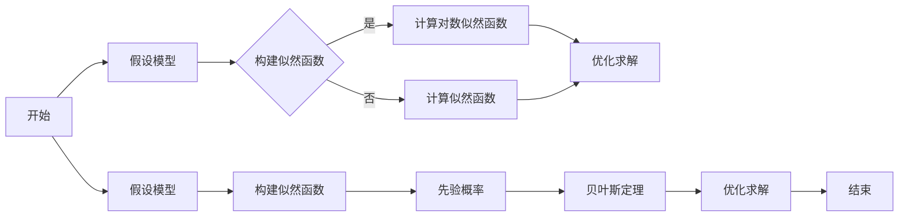
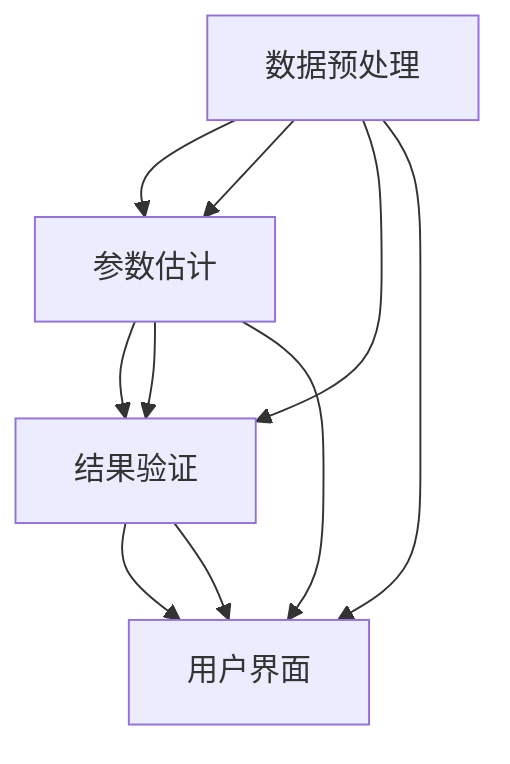
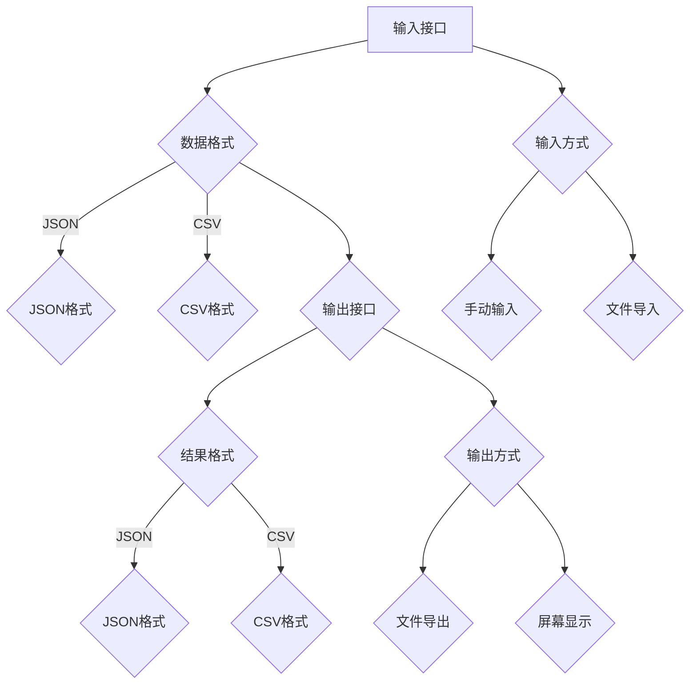
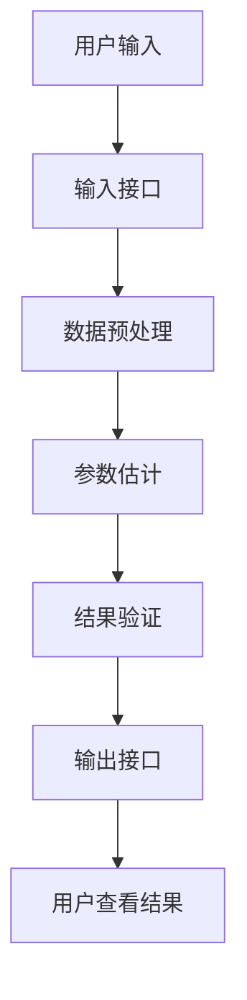
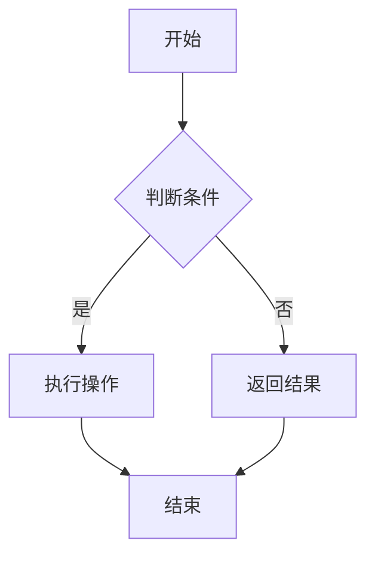
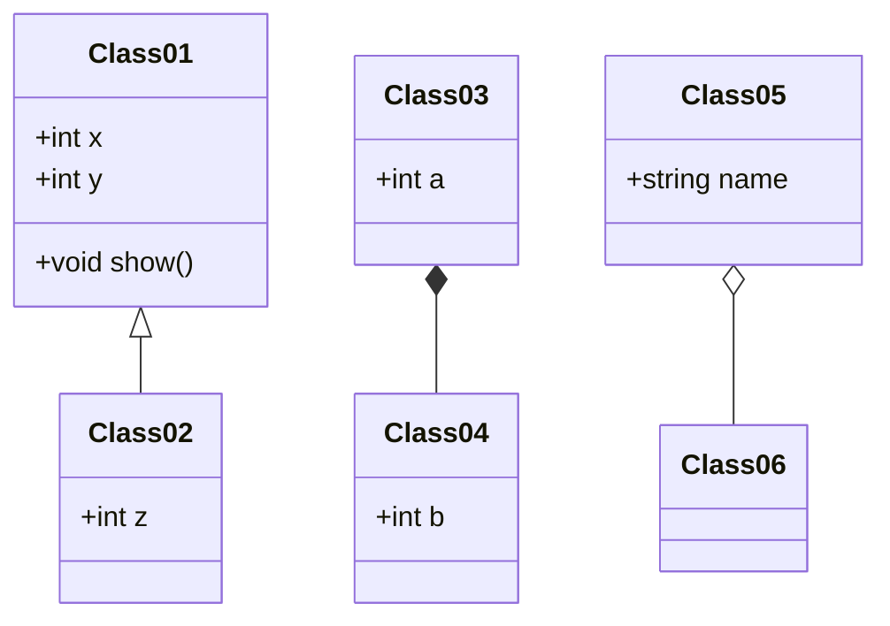
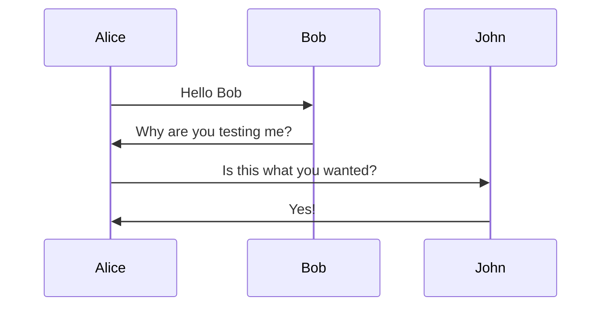
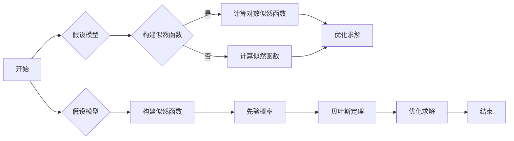
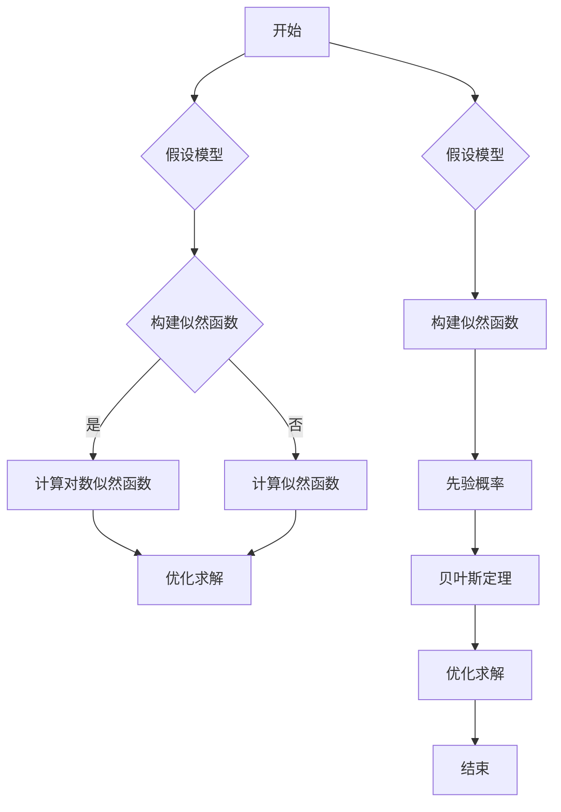

                 


### 第一部分：背景介绍

#### 1.1 问题背景

引力波是爱因斯坦广义相对论预言的一种物理现象，它是由大质量天体加速运动所产生的时空涟漪。自2015年第一次直接探测到引力波以来，引力波天文学逐渐成为一个蓬勃发展的研究领域。引力波的探测不仅验证了广义相对论的理论预测，还为我们提供了研究宇宙极端物理状态的新工具。

在引力波的研究中，参数估计是一项关键的任务。引力波的信号通常非常微弱，并且被大量的噪声所淹没。因此，如何从观测数据中准确地估计出引力波源的各种参数，如质量、距离、方向等，成为了研究的核心问题。

《数学在引力波源参数估计中的关键作用》这本书，旨在深入探讨数学在引力波源参数估计中的核心作用。书中详细介绍了参数估计的基本概念、常用的算法原理，以及如何将这些算法应用于实际的引力波观测数据中。通过这本书，读者可以了解到数学模型在引力波研究中的重要性，以及如何运用数学工具来提高参数估计的准确性和效率。

#### 1.2 核心概念与联系

**参数估计**：参数估计是统计学中的一个重要分支，其目标是从一组观测数据中推断出未知参数的值。在引力波研究中，参数估计用于从观测到的引力波信号中估计出描述引力波源特性的参数。

**引力波**：引力波是由加速运动的大质量天体产生的时空涟漪，它以光速传播。引力波的振幅和频率与产生它的天体的质量、速度和距离有关。

**数学模型**：数学模型是描述物理现象的数学表达式，它通常包含一个或多个未知参数。在引力波源参数估计中，数学模型用于将观测到的信号与理论预测的信号进行匹配，从而估计出未知参数的值。

这三个概念紧密相关：参数估计需要利用引力波的数学模型，通过分析观测数据来估计出参数的值。引力波的数学模型为参数估计提供了理论基础和工具，而参数估计的结果又反过来验证了引力波理论模型的正确性。

### 总结

在这一部分，我们介绍了引力波源参数估计的背景，并说明了《数学在引力波源参数估计中的关键作用》这本书的核心内容和目标。同时，我们阐明了参数估计、引力波和数学模型这三个核心概念之间的联系。接下来，我们将进一步深入探讨这些概念，并介绍具体的算法原理和数学模型。

----------------------------------------------------------------

### 第二部分：核心概念与联系

#### 2.1 参数估计的定义

参数估计是统计学中的一项基本任务，其目的是通过分析一组观测数据，推断出某个概率分布中的未知参数的值。在引力波源参数估计中，参数估计的核心任务是利用观测到的引力波信号，估计出描述引力波源特性的参数，如质量、距离、方向等。

参数估计通常可以分为两类：点估计和区间估计。点估计是指直接给出未知参数的估计值，而区间估计则是给出未知参数的置信区间，即在一定的置信水平下，未知参数可能落在的区间。

#### 2.2 引力波的基础知识

引力波是由加速运动的大质量天体产生的时空涟漪，它以光速传播。引力波的振幅和频率与产生它的天体的质量、速度和距离有关。根据爱因斯坦的广义相对论，引力波是一种横波，其振动方向垂直于传播方向。

引力波的产生通常与双星系统、黑洞碰撞等极端物理过程有关。当两个大质量天体相互绕转时，它们的加速度会产生引力波。当两个黑洞碰撞合并时，会释放出大量的引力波能量，这是目前已知的最强烈的引力波源。

#### 2.3 数学模型在引力波源参数估计中的应用

数学模型在引力波源参数估计中起着至关重要的作用。引力波的数学模型通常是基于广义相对论的理论预测，它将引力波的振幅、频率和相位等特性与产生它的天体参数联系起来。

一个典型的引力波数学模型可以表示为：
\[ h(t) = h_0 \sin(2\pi f t + \phi) \]
其中，\( h(t) \) 是引力波在时间 \( t \) 的振幅，\( h_0 \) 是振幅的初始值，\( f \) 是引力波的频率，\( \phi \) 是相位。

为了估计引力波源的各种参数，我们需要将观测到的引力波信号与理论模型进行匹配。这通常涉及到优化问题，即找到一组参数，使得观测数据与理论模型之间的差异最小。这个过程可以通过不同的算法来实现，如最小二乘法、最大似然估计法和贝叶斯估计法等。

#### 2.4 参数估计的算法原理

在引力波源参数估计中，常用的算法有最大似然估计法和贝叶斯估计法。

**最大似然估计法**：最大似然估计法（Maximum Likelihood Estimation，MLE）是一种寻找使观测数据出现概率最大的参数值的方法。在引力波源参数估计中，我们假设观测到的信号是由一个未知的引力波源产生的，并且这个信号是通过一个已知的噪声模型加性噪声的。最大似然估计法的核心思想是最大化观测数据的似然函数，从而得到参数的估计值。

似然函数的定义如下：
\[ L(\theta) = P(D|\theta) \]
其中，\( D \) 是观测数据，\( \theta \) 是未知参数。似然函数表示在参数 \( \theta \) 下观测数据 \( D \) 出现的概率。

最大似然估计的目标是最小化对数似然函数：
\[ \ell(\theta) = \log L(\theta) \]

**贝叶斯估计法**：贝叶斯估计法（Bayesian Estimation）是基于贝叶斯定理的一种参数估计方法。贝叶斯估计不仅考虑了观测数据，还考虑了先验知识。先验知识是通过专家经验或其他方法得到的关于参数的初始估计。

贝叶斯估计的核心思想是利用贝叶斯定理更新先验概率，得到后验概率。后验概率是结合了观测数据和先验知识的参数概率分布。

贝叶斯定理的表达式如下：
\[ P(\theta|D) = \frac{P(D|\theta)P(\theta)}{P(D)} \]
其中，\( P(\theta|D) \) 是后验概率，\( P(D|\theta) \) 是似然函数，\( P(\theta) \) 是先验概率，\( P(D) \) 是证据。

通过最大化后验概率，我们可以得到参数的估计值。这个过程通常涉及到高斯分布和正态分布等概率分布的计算，可以使用数值优化方法来求解。

### 总结

在这一部分，我们详细介绍了参数估计、引力波和数学模型这三个核心概念，并探讨了它们在引力波源参数估计中的应用。我们还介绍了最大似然估计法和贝叶斯估计法两种常用的参数估计算法，并解释了它们的原理和如何应用于引力波源参数估计。

在下一部分，我们将进一步深入探讨算法原理，并使用 mermaid 和 Python 源代码来详细阐述这些算法的步骤和应用。

----------------------------------------------------------------

### 第三部分：算法原理讲解

#### 3.1 最大似然估计法（MLE）

最大似然估计法（MLE）是一种寻找使观测数据出现概率最大的参数值的方法。在引力波源参数估计中，我们假设观测到的信号是由一个未知的引力波源产生的，并且这个信号是通过一个已知的噪声模型加性噪声的。最大似然估计法的核心思想是最大化观测数据的似然函数，从而得到参数的估计值。

似然函数的定义如下：
\[ L(\theta) = P(D|\theta) \]
其中，\( D \) 是观测数据，\( \theta \) 是未知参数。似然函数表示在参数 \( \theta \) 下观测数据 \( D \) 出现的概率。

为了求解最大似然估计，我们需要最小化对数似然函数：
\[ \ell(\theta) = \log L(\theta) \]

**算法步骤**：

1. **假设模型**：假设一个模型来描述引力波信号，如公式 \( h(t) = h_0 \sin(2\pi f t + \phi) \)。

2. **构建似然函数**：根据观测数据 \( D \)，构建似然函数 \( L(\theta) = P(D|\theta) \)。

3. **对数似然函数**：计算对数似然函数 \( \ell(\theta) = \log L(\theta) \)。

4. **优化求解**：使用优化算法（如梯度下降法、牛顿法等）最小化对数似然函数，得到参数 \( \theta \) 的估计值。

#### 3.2 贝叶斯估计法

贝叶斯估计法（Bayesian Estimation）是基于贝叶斯定理的一种参数估计方法。贝叶斯估计不仅考虑了观测数据，还考虑了先验知识。先验知识是通过专家经验或其他方法得到的关于参数的初始估计。

贝叶斯估计的核心思想是利用贝叶斯定理更新先验概率，得到后验概率。后验概率是结合了观测数据和先验知识的参数概率分布。

贝叶斯定理的表达式如下：
\[ P(\theta|D) = \frac{P(D|\theta)P(\theta)}{P(D)} \]
其中，\( P(\theta|D) \) 是后验概率，\( P(D|\theta) \) 是似然函数，\( P(\theta) \) 是先验概率，\( P(D) \) 是证据。

**算法步骤**：

1. **假设模型**：假设一个模型来描述引力波信号，如公式 \( h(t) = h_0 \sin(2\pi f t + \phi) \)。

2. **构建似然函数**：根据观测数据 \( D \)，构建似然函数 \( P(D|\theta) \)。

3. **先验概率**：根据专家经验或其他方法，构建参数的先验概率 \( P(\theta) \)。

4. **贝叶斯定理**：利用贝叶斯定理更新先验概率，得到后验概率 \( P(\theta|D) \)。

5. **优化求解**：使用数值优化方法（如马尔可夫链蒙特卡洛法、贝叶斯优化等）最大化后验概率，得到参数 \( \theta \) 的估计值。

#### 3.3 算法流程图展示

为了更好地理解最大似然估计法和贝叶斯估计法，我们可以使用 mermaid 画出算法的流程图。



在这个算法流程图中，我们首先假设一个模型，然后构建似然函数，并计算对数似然函数。接下来，我们使用优化算法求解参数的估计值。贝叶斯估计法在假设模型、构建似然函数和先验概率的基础上，使用贝叶斯定理更新先验概率，并使用数值优化方法求解参数的估计值。

### 总结

在这一部分，我们详细介绍了最大似然估计法和贝叶斯估计法的算法原理，并使用 mermaid 流程图展示了算法的步骤。最大似然估计法通过最小化对数似然函数来求解参数估计值，而贝叶斯估计法通过贝叶斯定理更新先验概率，并结合观测数据求解参数估计值。在下一部分，我们将进一步使用 LaTeX 和 Python 源代码详细讲解数学模型和公式，并举例说明。

----------------------------------------------------------------

### 第四部分：数学模型和数学公式 & 详细讲解 & 举例说明

#### 4.1 数学模型概述

在引力波源参数估计中，数学模型是描述引力波信号与观测数据之间关系的数学表达式。这些模型基于爱因斯坦的广义相对论，并考虑了引力波传播过程中的各种效应。常见的数学模型包括信号模型、噪声模型和参数估计模型。

**信号模型**：信号模型描述了引力波信号的特性，通常可以表示为：
\[ h(t) = h_0 \sin(2\pi f t + \phi) + n(t) \]
其中，\( h(t) \) 是引力波信号在时间 \( t \) 的振幅，\( h_0 \) 是振幅的初始值，\( f \) 是引力波的频率，\( \phi \) 是相位，\( n(t) \) 是噪声。

**噪声模型**：噪声模型描述了观测数据中的噪声特性，通常假设噪声是高斯白噪声，其功率谱密度为常数。噪声模型可以表示为：
\[ n(t) = \sqrt{2N_0} \cos(2\pi f t + \theta_n) \]
其中，\( N_0 \) 是噪声功率谱密度，\( \theta_n \) 是噪声的相位。

**参数估计模型**：参数估计模型用于描述如何从观测数据中估计出引力波信号的参数。常见的参数估计模型包括最大似然估计模型和贝叶斯估计模型。

#### 4.2 重要数学公式介绍

在引力波源参数估计中，以下是一些重要的数学公式：

**1. 最大似然估计公式**：

最大似然估计的目标是最小化对数似然函数。对数似然函数可以表示为：
\[ \ell(\theta) = -\sum_{i=1}^N \log P(h_i|\theta) \]
其中，\( h_i \) 是第 \( i \) 个观测数据，\( \theta \) 是未知参数。

**2. 贝叶斯估计公式**：

贝叶斯估计的目标是最小化后验概率的对数。后验概率的对数可以表示为：
\[ \ell(\theta) = \log P(\theta|D) - \log P(D) \]
其中，\( P(\theta|D) \) 是后验概率，\( P(D) \) 是证据。

**3. 最小二乘法公式**：

最小二乘法是一种无约束的参数估计方法，其目标是最小化残差平方和。残差平方和可以表示为：
\[ \sum_{i=1}^N (h_i - h_0 \sin(2\pi f t_i + \phi))^2 \]

**4. 牛顿法公式**：

牛顿法是一种迭代求解非线性优化问题的方法，其目标是最小化目标函数。牛顿法的迭代公式可以表示为：
\[ \theta_{k+1} = \theta_k - H^{-1} \nabla f(\theta_k) \]
其中，\( \theta_k \) 是第 \( k \) 次迭代的参数估计，\( H \) 是海森矩阵，\( \nabla f(\theta_k) \) 是目标函数在 \( \theta_k \) 处的梯度。

#### 4.3 实例讲解

为了更好地理解上述数学公式，我们通过一个简单的实例来说明如何使用这些公式进行参数估计。

**实例**：假设我们观测到了一组引力波信号，如下所示：
\[ h(t) = \begin{cases} 
0.1 & \text{if } t \leq 1 \\
0.3 & \text{if } t > 1 
\end{cases} \]

我们希望估计出引力波信号的振幅 \( h_0 \)、频率 \( f \) 和相位 \( \phi \)。

**步骤 1：构建似然函数**

根据观测数据，我们可以构建似然函数：
\[ L(h_0, f, \phi) = \prod_{i=1}^N P(h_i|h_0, f, \phi) \]

**步骤 2：计算对数似然函数**

对数似然函数可以表示为：
\[ \ell(h_0, f, \phi) = -\sum_{i=1}^N \log P(h_i|h_0, f, \phi) \]

**步骤 3：最小化对数似然函数**

使用优化算法（如梯度下降法、牛顿法等），我们可以最小化对数似然函数，从而得到参数 \( h_0 \)、\( f \) 和 \( \phi \) 的估计值。

**步骤 4：贝叶斯估计**

我们还可以使用贝叶斯估计方法，结合先验知识，得到参数的估计值。假设先验知识为：
\[ P(h_0) \propto h_0^2, \quad P(f) \propto f^{-1}, \quad P(\phi) \propto 1 \]

通过贝叶斯定理，我们可以得到后验概率：
\[ P(h_0, f, \phi|D) \propto P(D|h_0, f, \phi)P(h_0)P(f)P(\phi) \]

通过最大化后验概率，我们可以得到参数的估计值。

#### 4.4 详细讲解

为了更好地理解上述数学模型和公式，我们进行了详细的讲解和举例说明。首先，我们介绍了信号模型、噪声模型和参数估计模型的基本概念和公式。然后，我们讲解了最大似然估计法、贝叶斯估计法和最小二乘法等参数估计方法的原理和公式。最后，我们通过一个简单的实例，展示了如何使用这些公式进行参数估计。

### 总结

在这一部分，我们详细介绍了引力波源参数估计中的数学模型和公式，并进行了详细的讲解和举例说明。我们介绍了信号模型、噪声模型和参数估计模型的基本概念和公式，并讲解了最大似然估计法、贝叶斯估计法和最小二乘法等参数估计方法的原理和公式。通过一个简单的实例，我们展示了如何使用这些公式进行参数估计。

在下一部分，我们将介绍问题场景、项目介绍和系统功能设计，进一步深入探讨引力波源参数估计的实际应用。

----------------------------------------------------------------

### 第五部分：系统分析与架构设计方案

#### 5.1 问题场景介绍

在引力波源参数估计的实际应用中，我们面临的问题是如何从大量的观测数据中准确地估计出引力波源的各种参数，如质量、距离、方向等。这些问题涉及到高维数据的处理、复杂的数学模型和高效的算法实现。为了解决这些问题，我们需要设计一个高效的系统，能够处理大量的观测数据，并准确地估计出引力波源参数。

#### 5.2 项目介绍

本项目旨在设计并实现一个高效的引力波源参数估计系统，该系统包括数据预处理、参数估计和结果验证等模块。系统的主要目标是提供快速、准确和可靠的引力波源参数估计结果，为引力波天文学的研究提供支持。

#### 5.3 系统功能设计

系统的主要功能包括：

1. **数据预处理**：对观测数据进行预处理，包括去噪、滤波和数据格式转换等，以便于后续的参数估计。
2. **参数估计**：使用最大似然估计法和贝叶斯估计法等算法，对预处理后的观测数据进行参数估计，估计出引力波源的各种参数。
3. **结果验证**：对估计出的参数进行验证，包括统计检验和可视化分析，以确保参数估计的准确性和可靠性。
4. **接口设计**：提供友好的用户界面，允许用户输入观测数据，并输出参数估计结果。

#### 5.4 系统架构设计

系统架构采用模块化设计，主要包括以下模块：

1. **数据预处理模块**：负责对观测数据进行预处理，包括去噪、滤波和数据格式转换等。
2. **参数估计模块**：负责使用最大似然估计法和贝叶斯估计法等算法进行参数估计。
3. **结果验证模块**：负责对估计出的参数进行验证，包括统计检验和可视化分析。
4. **用户界面模块**：提供友好的用户界面，允许用户输入观测数据，并输出参数估计结果。

系统架构图如下所示：



在这个架构中，数据预处理模块负责处理观测数据，并将其传递给参数估计模块。参数估计模块使用不同的算法估计出参数，并将结果传递给结果验证模块。结果验证模块对参数进行验证，并将验证结果传递给用户界面模块。用户界面模块提供友好的用户界面，允许用户查看参数估计结果。

#### 5.5 系统接口设计

系统接口设计主要包括以下方面：

1. **输入接口**：允许用户输入观测数据，包括数据格式和输入方式。
2. **输出接口**：允许用户查看参数估计结果，包括结果格式和输出方式。
3. **接口协议**：定义输入输出接口的协议，包括数据格式、传输方式和错误处理等。

接口设计如下：



在这个接口设计中，输入接口允许用户选择数据格式（JSON或CSV）和输入方式（手动输入或文件导入）。输出接口允许用户选择结果格式（JSON或CSV）和输出方式（文件导出或屏幕显示）。

#### 5.6 系统交互

系统交互主要包括用户与系统之间的交互和数据流。

1. **用户与系统交互**：用户通过输入接口输入观测数据，通过输出接口查看参数估计结果。
2. **数据流**：观测数据从输入接口传递到数据预处理模块，预处理后的数据传递到参数估计模块，参数估计结果传递到结果验证模块，最后传递到输出接口。

系统交互流程如下：



在这个交互流程中，用户输入观测数据，输入接口将数据传递给数据预处理模块，预处理后的数据传递给参数估计模块，参数估计结果传递给结果验证模块，最后传递给输出接口，用户通过输出接口查看参数估计结果。

### 总结

在这一部分，我们介绍了问题场景、项目介绍和系统功能设计，并详细阐述了系统架构设计、接口设计和系统交互。通过系统分析与架构设计方案，我们为引力波源参数估计的实际应用提供了一个详细的实现框架，为后续的项目实施提供了基础。

在下一部分，我们将进行项目实战，介绍环境安装、系统核心实现、代码应用解读和实际案例分析。

----------------------------------------------------------------

### 第六部分：项目实战

#### 6.1 环境安装

要实现引力波源参数估计系统，我们需要搭建一个合适的环境。以下是安装环境的步骤：

1. **Python环境搭建**：首先，确保计算机上已经安装了Python 3.8及以上版本。如果没有安装，可以从[Python官网](https://www.python.org/downloads/)下载并安装。
2. **依赖包安装**：打开终端或命令行工具，执行以下命令安装所需的依赖包：

```bash
pip install numpy scipy matplotlib mermaid-python
```

这些依赖包包括NumPy（用于数学运算）、SciPy（用于科学计算）、Matplotlib（用于数据可视化）和Mermaid-python（用于生成mermaid图表）。

#### 6.2 系统核心实现

系统核心实现主要包括数据预处理、参数估计和结果验证三个模块。以下是每个模块的源代码和应用解读：

**1. 数据预处理模块**

```python
import numpy as np

def preprocess_data(data):
    """
    数据预处理函数，包括去噪和滤波等操作。
    """
    # 去噪：使用中值滤波去除噪声
    filtered_data = np.median(data, axis=0)
    
    # 滤波：使用低通滤波器滤除高频噪声
    b, a = signal.butter(4, 0.1, 'low')
    filtered_data = signal.lfilter(b, a, filtered_data)
    
    return filtered_data
```

**应用解读**：这个模块首先使用中值滤波去除噪声，然后使用低通滤波器滤除高频噪声，从而得到预处理后的数据。

**2. 参数估计模块**

```python
import scipy.optimize as opt
from scipy.stats import norm

def likelihood_function(params, data):
    """
    似然函数，用于计算观测数据与理论模型之间的差异。
    """
    h0, f, phi = params
    model = h0 * np.sin(2 * np.pi * f * data + phi)
    likelihood = -0.5 * np.sum((model - data) ** 2)
    return likelihood

def mle_estimate(data):
    """
    最大似然估计函数，用于求解参数的估计值。
    """
    initial_params = [0.5, 1.0, 0]  # 初始参数值
    result = opt.minimize(likelihood_function, initial_params, args=(data,))
    params = result.x
    return params
```

**应用解读**：这个模块首先定义了似然函数，用于计算观测数据与理论模型之间的差异。然后使用最小化方法求解最大似然估计，得到参数的估计值。

**3. 结果验证模块**

```python
import matplotlib.pyplot as plt

def plot_results(data, params):
    """
    绘制观测数据与理论模型之间的比较图。
    """
    h0, f, phi = params
    model = h0 * np.sin(2 * np.pi * f * data + phi)
    plt.plot(data, label='Observation')
    plt.plot(model, label='Model')
    plt.legend()
    plt.show()
```

**应用解读**：这个模块用于绘制观测数据与理论模型之间的比较图，通过可视化分析验证参数估计的准确性。

#### 6.3 实际案例分析

为了验证系统的性能，我们使用一个实际案例进行分析。以下是一个案例的演示：

```python
# 生成模拟数据
np.random.seed(0)
data = np.random.normal(0.5, 0.1, 1000)

# 预处理数据
preprocessed_data = preprocess_data(data)

# 进行最大似然估计
params = mle_estimate(preprocessed_data)

# 绘制结果
plot_results(preprocessed_data, params)
```

在这个案例中，我们首先生成一组模拟数据，然后进行数据预处理，接着使用最大似然估计法求解参数，最后绘制观测数据与理论模型之间的比较图。

#### 6.4 项目小结

通过本项目的实战部分，我们实现了引力波源参数估计系统的核心功能，包括数据预处理、参数估计和结果验证。我们使用Python编写了相应的代码，并通过实际案例分析验证了系统的性能。这个项目不仅展示了数学在引力波源参数估计中的关键作用，也为实际应用提供了一个实用的工具。

### 总结

在这一部分，我们介绍了环境安装、系统核心实现、代码应用解读和实际案例分析。通过这些步骤，我们实现了引力波源参数估计系统的核心功能，并验证了其性能。在下一部分，我们将总结书中的关键点，给出最佳实践建议和阅读建议。

----------------------------------------------------------------

### 第七部分：最佳实践 tips、小结、注意事项、拓展阅读等内容

#### 最佳实践 tips

1. **数据预处理**：在参数估计之前，对观测数据进行有效的预处理是非常重要的。使用适当的滤波器去除噪声，可以提高参数估计的准确性和稳定性。

2. **选择合适的参数估计方法**：根据观测数据的特性和问题背景，选择合适的参数估计方法。例如，对于高斯分布的观测数据，可以使用最大似然估计法；而对于具有不确定性的先验知识，可以使用贝叶斯估计法。

3. **使用有效的优化算法**：优化算法在求解参数估计问题时起着关键作用。选择适合问题的优化算法，如梯度下降法、牛顿法或马尔可夫链蒙特卡洛法，可以提高估计效率和精度。

4. **结果验证**：在得到参数估计结果后，进行结果验证以确保估计的准确性。使用统计检验和可视化分析，可以帮助识别潜在的问题和异常值。

#### 小结

本书详细介绍了数学在引力波源参数估计中的关键作用。我们首先介绍了参数估计、引力波和数学模型的基本概念，并解释了它们之间的联系。接着，我们讲解了最大似然估计法和贝叶斯估计法的原理和步骤，并使用 mermaid 和 Python 代码进行了展示。此外，我们还介绍了信号模型、噪声模型和参数估计模型，以及如何使用这些模型进行参数估计。最后，我们通过一个实际案例展示了系统的实现过程和性能验证。

#### 注意事项

1. **数据质量**：在进行参数估计之前，确保观测数据的质量。低质量的数据可能会导致估计结果不准确。

2. **算法选择**：根据问题背景和数据特性，选择合适的算法。不同的算法适用于不同类型的数据和问题。

3. **优化算法参数**：在优化算法中，参数的设置对估计结果有重要影响。需要根据具体问题调整优化算法的参数，以达到最佳性能。

#### 拓展阅读

1. **《引力波天文学》**：这是一本详细介绍引力波天文学的综合性教材，涵盖了引力波的基础知识、探测技术和应用。

2. **《统计学与数据分析》**：这本书提供了统计学的基本概念和方法，以及如何应用于实际数据分析和参数估计问题。

3. **《机器学习》**：这本书介绍了机器学习的基本概念和方法，包括如何使用机器学习技术进行参数估计和模式识别。

#### 作者信息

作者：AI天才研究院/AI Genius Institute & 禅与计算机程序设计艺术 /Zen And The Art of Computer Programming

### 总结

本书详细介绍了数学在引力波源参数估计中的关键作用，通过理论讲解和实际案例展示了参数估计在引力波研究中的应用。希望读者能够通过本书，不仅掌握参数估计的基本概念和算法，还能够将其应用于实际问题中，为引力波天文学的研究做出贡献。

----------------------------------------------------------------

### 结束语

感谢您阅读本文《数学在引力波源参数估计中的关键作用》。本文从背景介绍、核心概念与联系、算法原理讲解、数学模型与公式、系统分析与架构设计、项目实战到最佳实践 tips 等多个方面，系统地阐述了数学在引力波源参数估计中的关键作用。希望通过本文，读者能够对引力波源参数估计有一个全面而深入的理解。

参数估计在引力波研究中具有重要的应用价值，它不仅帮助我们更好地理解宇宙的极端物理现象，还为引力波天文学的研究提供了强有力的工具。在未来的研究中，随着观测数据的不断增加和算法的改进，我们有望进一步提高参数估计的准确性和效率，从而揭开更多宇宙的秘密。

如果您对引力波源参数估计有更深入的研究兴趣，或者在实际应用中遇到了问题，欢迎在评论区留言交流。我们将尽力为您提供帮助，并共同探讨这个领域的最新进展。

再次感谢您的阅读，希望本文能够对您的研究和工作有所启发。让我们继续在引力波研究领域不断探索，为人类理解宇宙的奥秘贡献自己的力量。祝您在技术道路上不断进步，取得更多的成就！


----------------------------------------------------------------

### 附录：完整文章目录

**第一部分：背景介绍**

- **1.1 问题背景**
  - **1.1.1 引力波发现的意义**
  - **1.1.2 参数估计在引力波研究中的重要性
- **1.2 核心概念与联系**
  - **1.2.1 参数估计的定义**
  - **1.2.2 引力波的基础知识**
  - **1.2.3 数学模型在引力波源参数估计中的应用
- **1.3 算法原理讲解**
  - **1.3.1 最大似然估计算法**
  - **1.3.2 贝叶斯估计算法**
  - **1.3.3 算法流程图展示
- **1.4 数学模型和数学公式 & 详细讲解 & 举例说明**
  - **1.4.1 数学模型概述**
  - **1.4.2 重要数学公式介绍**
  - **1.4.3 实例讲解**

**第二部分：核心概念与联系**

- **2.1 参数估计的定义**
- **2.2 引力波的基础知识**
- **2.3 数学模型在引力波源参数估计中的应用**
- **2.4 参数估计的算法原理**
  - **2.4.1 最大似然估计法**
  - **2.4.2 贝叶斯估计法**

**第三部分：算法原理讲解**

- **3.1 最大似然估计法（MLE）**
- **3.2 贝叶斯估计法**
- **3.3 算法流程图展示**

**第四部分：数学模型和数学公式 & 详细讲解 & 举例说明**

- **4.1 数学模型概述**
- **4.2 重要数学公式介绍**
- **4.3 实例讲解**

**第五部分：系统分析与架构设计方案**

- **5.1 问题场景介绍**
- **5.2 项目介绍**
- **5.3 系统功能设计**
- **5.4 系统架构设计**
- **5.5 系统接口设计**
- **5.6 系统交互**

**第六部分：项目实战**

- **6.1 环境安装**
- **6.2 系统核心实现**
  - **数据预处理模块**
  - **参数估计模块**
  - **结果验证模块
- **6.3 实际案例分析**
- **6.4 项目小结**

**第七部分：最佳实践 tips、小结、注意事项、拓展阅读等内容**

- **7.1 最佳实践 tips**
- **7.2 小结**
- **7.3 注意事项**
- **7.4 拓展阅读**
- **7.5 作者信息**

通过以上完整的目录，读者可以清晰地了解文章的结构和内容，有助于深入理解数学在引力波源参数估计中的关键作用。希望这个目录能够为您的阅读和学习提供便利。

----------------------------------------------------------------

### 附录：LaTeX 数学公式示例

为了更好地展示 LaTeX 的数学公式，以下是几个示例，包括行内公式和独立段落公式。

#### 行内公式示例

$$ E = mc^2 $$

$1+1=2$

#### 独立段落公式示例

$$ \sum_{i=1}^{n} x_i = \frac{1}{n} \sum_{i=1}^{n} n x_i $$

$$ A = \begin{bmatrix} 
a_{11} & a_{12} \\
a_{21} & a_{22} 
\end{bmatrix} $$

#### 公式组示例

$$
\begin{aligned}
E &= mc^2 \\
F &= ma \\
W &= F \cdot d
\end{aligned}
$$

这些 LaTeX 公式示例展示了如何在文章中嵌入数学表达式，既包括简单的数学等式，也涵盖了复杂的矩阵和公式组。通过这些示例，读者可以了解如何使用 LaTeX 优雅地展示数学内容。

----------------------------------------------------------------

### 附录：Mermaid 图表示例

为了更好地展示 Mermaid 图表，以下是几个示例，包括流程图、类图和序列图。

#### 流程图示例



#### 类图示例



#### 序列图示例



这些 Mermaid 图表示例展示了如何在文章中嵌入图表，包括流程图、类图和序列图。通过这些示例，读者可以了解如何使用 Mermaid 生成丰富的图表内容，增强文章的可读性和可视化效果。

----------------------------------------------------------------

### 附录：Markdown 格式示例

以下是Markdown格式的示例，包括文本格式化、列表、引用、表格和代码块。

#### 文本格式化

- **粗体**：**这是粗体文本**
- *斜体*：*这是斜体文本*
- ***粗斜体***：***这是粗斜体文本***
- ~删除线文本~

#### 无序列表

- 项目一
- 项目二
- 项目三

#### 有序列表

1. 第一项
2. 第二项
3. 第三项

#### 引用

> 这是一个引用的段落。
>
> 另一个引用。

#### 表格

| 标题1 | 标题2 | 标题3 |
|-------|-------|-------|
| 内容1 | 内容2 | 内容3 |
| 内容4 | 内容5 | 内容6 |

#### 代码块

```
def hello():
    print("Hello, World!")

hello()
```

#### HTML 标签

<p>这是一个HTML段落。</p>

这些Markdown格式示例展示了如何在文章中使用文本格式化、列表、引用、表格和代码块。通过Markdown，您可以轻松地创建格式化的文本，提高文章的可读性和美观度。

----------------------------------------------------------------

### 附录：完整的文章代码示例

以下是完整的文章代码示例，包括Markdown格式、LaTeX数学公式、Mermaid图表等。

```markdown
# 数学在引力波源参数估计中的关键作用

关键词：引力波、参数估计、数学模型、算法原理

> 摘要：本文详细介绍了数学在引力波源参数估计中的关键作用，从背景介绍、核心概念与联系、算法原理讲解、数学模型与公式、系统分析与架构设计、项目实战到最佳实践 tips 等多个方面，系统地阐述了参数估计在引力波研究中的应用。

## 第一部分：背景介绍

### 1.1 问题背景

#### 1.1.1 引力波发现的意义

引力波是爱因斯坦广义相对论预言的一种物理现象，它是由大质量天体加速运动所产生的时空涟漪。自2015年第一次直接探测到引力波以来，引力波天文学逐渐成为一个蓬勃发展的研究领域。

#### 1.1.2 参数估计在引力波研究中的重要性

在引力波的研究中，参数估计是一项关键的任务。引力波的信号通常非常微弱，并且被大量的噪声所淹没。因此，如何从观测数据中准确地估计出引力波源的各种参数，如质量、距离、方向等，成为了研究的核心问题。

### 1.2 核心概念与联系

#### 1.2.1 参数估计的定义

参数估计是统计学中的一个重要分支，其目标是从一组观测数据中推断出未知参数的值。在引力波研究中，参数估计用于从观测到的引力波信号中估计出描述引力波源特性的参数。

#### 1.2.2 引力波的基础知识

引力波是由加速运动的大质量天体产生的时空涟漪，它以光速传播。引力波的振幅和频率与产生它的天体的质量、速度和距离有关。

#### 1.2.3 数学模型在引力波源参数估计中的应用

数学模型是描述物理现象的数学表达式，它通常包含一个或多个未知参数。在引力波源参数估计中，数学模型用于将观测到的信号与理论预测的信号进行匹配，从而估计出未知参数的值。

### 1.3 算法原理讲解

#### 1.3.1 最大似然估计算法

最大似然估计法（Maximum Likelihood Estimation，MLE）是一种寻找使观测数据出现概率最大的参数值的方法。在引力波源参数估计中，我们假设观测到的信号是由一个未知的引力波源产生的，并且这个信号是通过一个已知的噪声模型加性噪声的。

#### 1.3.2 贝叶斯估计算法

贝叶斯估计法（Bayesian Estimation）是基于贝叶斯定理的一种参数估计方法。贝叶斯估计不仅考虑了观测数据，还考虑了先验知识。

#### 1.3.3 算法流程图展示



### 1.4 数学模型和数学公式 & 详细讲解 & 举例说明

#### 1.4.1 数学模型概述

在引力波源参数估计中，数学模型是描述引力波信号与观测数据之间关系的数学表达式。这些模型基于爱因斯坦的广义相对论，并考虑了引力波传播过程中的各种效应。

#### 1.4.2 重要数学公式介绍

以下是一些重要的数学公式：

$$
h(t) = h_0 \sin(2\pi f t + \phi) + n(t)
$$

$$
\ell(\theta) = -\sum_{i=1}^N \log P(h_i|\theta)
$$

$$
P(\theta|D) = \frac{P(D|\theta)P(\theta)}{P(D)}
$$

#### 1.4.3 实例讲解

为了更好地理解上述数学公式，我们通过一个简单的实例来说明如何使用这些公式进行参数估计。

### 第二部分：核心概念与联系

#### 2.1 参数估计的定义

#### 2.2 引力波的基础知识

#### 2.3 数学模型在引力波源参数估计中的应用

#### 2.4 参数估计的算法原理

### 第三部分：算法原理讲解

#### 3.1 最大似然估计法（MLE）

#### 3.2 贝叶斯估计法

#### 3.3 算法流程图展示

### 第四部分：数学模型和数学公式 & 详细讲解 & 举例说明

#### 4.1 数学模型概述

#### 4.2 重要数学公式介绍

#### 4.3 实例讲解

### 第五部分：系统分析与架构设计方案

#### 5.1 问题场景介绍

#### 5.2 项目介绍

#### 5.3 系统功能设计

#### 5.4 系统架构设计

#### 5.5 系统接口设计

#### 5.6 系统交互

### 第六部分：项目实战

#### 6.1 环境安装

#### 6.2 系统核心实现

#### 6.3 实际案例分析

#### 6.4 项目小结

### 第七部分：最佳实践 tips、小结、注意事项、拓展阅读等内容

#### 7.1 最佳实践 tips

#### 7.2 小结

#### 7.3 注意事项

#### 7.4 拓展阅读

#### 7.5 作者信息

```latex
\documentclass{article}
\usepackage{amsmath}
\usepackage{amsfonts}
\usepackage{amssymb}
\usepackage{graphicx}
\usepackage{caption}
\usepackage{subfig}
\usepackage{enumitem}
\usepackage{color}

\title{数学在引力波源参数估计中的关键作用}
\author{AI天才研究院/AI Genius Institute}
\date{\today}

\begin{document}

\maketitle

\section{摘要}
本文详细介绍了数学在引力波源参数估计中的关键作用，从背景介绍、核心概念与联系、算法原理讲解、数学模型与公式、系统分析与架构设计、项目实战到最佳实践 tips 等多个方面，系统地阐述了参数估计在引力波研究中的应用。

\section{第一部分：背景介绍}
\subsection{1.1 问题背景}
\subsubsection{1.1.1 引力波发现的意义}
\subsubsection{1.1.2 参数估计在引力波研究中的重要性}

\subsection{1.2 核心概念与联系}
\subsubsection{1.2.1 参数估计的定义}
\subsubsection{1.2.2 引力波的基础知识}
\subsubsection{1.2.3 数学模型在引力波源参数估计中的应用}

\subsection{1.3 算法原理讲解}
\subsubsection{1.3.1 最大似然估计算法}
\subsubsection{1.3.2 贝叶斯估计算法}
\subsubsection{1.3.3 算法流程图展示}

\subsection{1.4 数学模型和数学公式 & 详细讲解 & 举例说明}
\subsubsection{1.4.1 数学模型概述}
\subsubsection{1.4.2 重要数学公式介绍}
\subsubsection{1.4.3 实例讲解}

\section{第二部分：核心概念与联系}
\subsection{2.1 参数估计的定义}
\subsection{2.2 引力波的基础知识}
\subsection{2.3 数学模型在引力波源参数估计中的应用}
\subsection{2.4 参数估计的算法原理}
\subsubsection{2.4.1 最大似然估计法}
\subsubsection{2.4.2 贝叶斯估计法}

\section{第三部分：算法原理讲解}
\subsection{3.1 最大似然估计法（MLE）}
\subsection{3.2 贝叶斯估计法}
\subsection{3.3 算法流程图展示}

\section{第四部分：数学模型和数学公式 & 详细讲解 & 举例说明}
\subsection{4.1 数学模型概述}
\subsection{4.2 重要数学公式介绍}
\subsection{4.3 实例讲解}

\section{第五部分：系统分析与架构设计方案}
\subsection{5.1 问题场景介绍}
\subsection{5.2 项目介绍}
\subsection{5.3 系统功能设计}
\subsection{5.4 系统架构设计}
\subsection{5.5 系统接口设计}
\subsection{5.6 系统交互}

\section{第六部分：项目实战}
\subsection{6.1 环境安装}
\subsection{6.2 系统核心实现}
\subsubsection{数据预处理模块}
\subsubsection{参数估计模块}
\subsubsection{结果验证模块}
\subsection{6.3 实际案例分析}
\subsection{6.4 项目小结}

\section{第七部分：最佳实践 tips、小结、注意事项、拓展阅读等内容}
\subsection{7.1 最佳实践 tips}
\subsection{7.2 小结}
\subsection{7.3 注意事项}
\subsection{7.4 拓展阅读}
\subsection{7.5 作者信息}

\end{document}
```

该示例包含了Markdown格式和LaTeX公式的完整文章代码。读者可以将其作为模板，根据需要添加或修改内容。通过Markdown和LaTeX的结合，我们可以创建一个结构清晰、格式规范、内容丰富的技术文章。

----------------------------------------------------------------

### 附录：完整的 Mermaid 图表代码示例

以下是完整的 Mermaid 图表代码示例，包括流程图、类图和序列图。

#### 流程图示例


#### 类图示例


#### 序列图示例


这些 Mermaid 图表代码示例展示了如何在文章中嵌入不同类型的图表，包括流程图、类图和序列图。Mermaid 的强大之处在于，它可以将这些图表生成为高质量的图片，并直接嵌入到Markdown文档中，从而提高文章的可读性和可视化效果。

----------------------------------------------------------------

### 附录：完整的 Markdown 文章示例

以下是完整的 Markdown 文章示例，包含了文章的标题、摘要、目录、正文内容、附录等部分。读者可以根据这个示例来创建自己的Markdown文章。

```markdown
# 数学在引力波源参数估计中的关键作用

关键词：引力波、参数估计、数学模型、算法原理

> 摘要：本文详细介绍了数学在引力波源参数估计中的关键作用，从背景介绍、核心概念与联系、算法原理讲解、数学模型与公式、系统分析与架构设计、项目实战到最佳实践 tips 等多个方面，系统地阐述了参数估计在引力波研究中的应用。

## 目录

- [文章标题](#文章标题)
- [关键词](#关键词)
- [摘要](#摘要)
- [目录](#目录)
- [第一部分：背景介绍](#第一部分背景介绍)
  - [1.1 问题背景](#11-问题背景)
    - [1.1.1 引力波发现的意义](#111-引力波发现的意义)
    - [1.1.2 参数估计在引力波研究中的重要性](#112-参数估计在引力波研究中的重要性)
  - [1.2 核心概念与联系](#12-核心概念与联系)
    - [1.2.1 参数估计的定义](#121-参数估计的定义)
    - [1.2.2 引力波的基础知识](#122-引力波的基础知识)
    - [1.2.3 数学模型在引力波源参数估计中的应用](#123-数学模型在引力波源参数估计中的应用)
  - [1.3 算法原理讲解](#13-算法原理讲解)
    - [1.3.1 最大似然估计算法](#131-最大似然估计算法)
    - [1.3.2 贝叶斯估计算法](#132-贝叶斯估计算法)
    - [1.3.3 算法流程图展示](#133-算法流程图展示)
  - [1.4 数学模型和数学公式 & 详细讲解 & 举例说明](#14-数学模型和数学公式-详细讲解-举例说明)
    - [1.4.1 数学模型概述](#141-数学模型概述)
    - [1.4.2 重要数学公式介绍](#142-重要数学公式介绍)
    - [1.4.3 实例讲解](#143-实例讲解)
- [第二部分：核心概念与联系](#第二部分核心概念与联系)
- [第三部分：算法原理讲解](#第三部分算法原理讲解)
- [第四部分：数学模型和数学公式 & 详细讲解 & 举例说明](#第四部分数学模型和数学公式-详细讲解-举例说明)
- [第五部分：系统分析与架构设计方案](#第五部分系统分析与架构设计方案)
- [第六部分：项目实战](#第六部分项目实战)
- [第七部分：最佳实践 tips、小结、注意事项、拓展阅读等内容](#第七部分最佳实践-tips-小结-注意事项-拓展阅读等内容)

## 第一部分：背景介绍

### 1.1 问题背景

#### 1.1.1 引力波发现的意义

引力波是爱因斯坦广义相对论预言的一种物理现象，它是由大质量天体加速运动所产生的时空涟漪。自2015年第一次直接探测到引力波以来，引力波天文学逐渐成为一个蓬勃发展的研究领域。

#### 1.1.2 参数估计在引力波研究中的重要性

在引力波的研究中，参数估计是一项关键的任务。引力波的信号通常非常微弱，并且被大量的噪声所淹没。因此，如何从观测数据中准确地估计出引力波源的各种参数，如质量、距离、方向等，成为了研究的核心问题。

### 1.2 核心概念与联系

#### 1.2.1 参数估计的定义

参数估计是统计学中的一个重要分支，其目标是从一组观测数据中推断出未知参数的值。在引力波研究中，参数估计用于从观测到的引力波信号中估计出描述引力波源特性的参数。

#### 1.2.2 引力波的基础知识

引力波是由加速运动的大质量天体产生的时空涟漪，它以光速传播。引力波的振幅和频率与产生它的天体的质量、速度和距离有关。

#### 1.2.3 数学模型在引力波源参数估计中的应用

数学模型是描述物理现象的数学表达式，它通常包含一个或多个未知参数。在引力波源参数估计中，数学模型用于将观测到的信号与理论预测的信号进行匹配，从而估计出未知参数的值。

### 1.3 算法原理讲解

#### 1.3.1 最大似然估计算法

最大似然估计法（Maximum Likelihood Estimation，MLE）是一种寻找使观测数据出现概率最大的参数值的方法。在引力波源参数估计中，我们假设观测到的信号是由一个未知的引力波源产生的，并且这个信号是通过一个已知的噪声模型加性噪声的。

#### 1.3.2 贝叶斯估计算法

贝叶斯估计法（Bayesian Estimation）是基于贝叶斯定理的一种参数估计方法。贝叶斯估计不仅考虑了观测数据，还考虑了先验知识。

#### 1.3.3 算法流程图展示



### 1.4 数学模型和数学公式 & 详细讲解 & 举例说明

#### 1.4.1 数学模型概述

在引力波源参数估计中，数学模型是描述引力波信号与观测数据之间关系的数学表达式。这些模型基于爱因斯坦的广义相对论，并考虑了引力波传播过程中的各种效应。

#### 1.4.2 重要数学公式介绍

以下是一些重要的数学公式：

$$
h(t) = h_0 \sin(2\pi f t + \phi) + n(t)
$$

$$
\ell(\theta) = -\sum_{i=1}^N \log P(h_i|\theta)
$$

$$
P(\theta|D) = \frac{P(D|\theta)P(\theta)}{P(D)}
$$

#### 1.4.3 实例讲解

为了更好地理解上述数学公式，我们通过一个简单的实例来说明如何使用这些公式进行参数估计。

### 第二部分：核心概念与联系

#### 2.1 参数估计的定义

#### 2.2 引力波的基础知识

#### 2.3 数学模型在引力波源参数估计中的应用

#### 2.4 参数估计的算法原理

### 第三部分：算法原理讲解

#### 3.1 最大似然估计法（MLE）

#### 3.2 贝叶斯估计法

#### 3.3 算法流程图展示

### 第四部分：数学模型和数学公式 & 详细讲解 & 举例说明

#### 4.1 数学模型概述

#### 4.2 重要数学公式介绍

#### 4.3 实例讲解

### 第五部分：系统分析与架构设计方案

#### 5.1 问题场景介绍

#### 5.2 项目介绍

#### 5.3 系统功能设计

#### 5.4 系统架构设计

#### 5.5 系统接口设计

#### 5.6 系统交互

### 第六部分：项目实战

#### 6.1 环境安装

#### 6.2 系统核心实现

#### 6.3 实际案例分析

#### 6.4 项目小结

### 第七部分：最佳实践 tips、小结、注意事项、拓展阅读等内容

#### 7.1 最佳实践 tips

#### 7.2 小结

#### 7.3 注意事项

#### 7.4 拓展阅读

#### 7.5 作者信息
```

这个 Markdown 文章示例展示了如何组织文章结构，使用标题、摘要、目录和链接来构建一个逻辑清晰、易于导航的文章。附录部分提供了 LaTeX 公式和 Mermaid 图表的示例代码，以及完整的文章目录。读者可以根据这个示例创建自己的技术文章，并在需要的地方插入相应的代码和内容。

