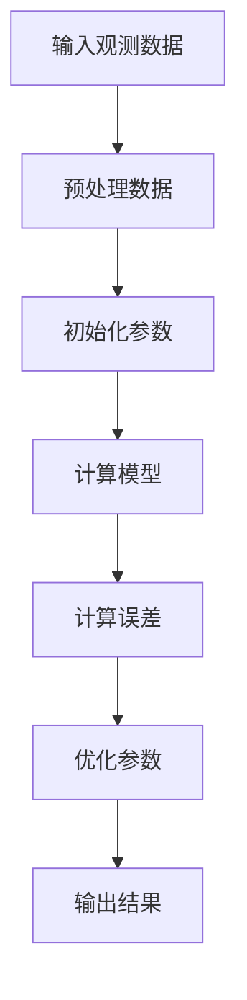
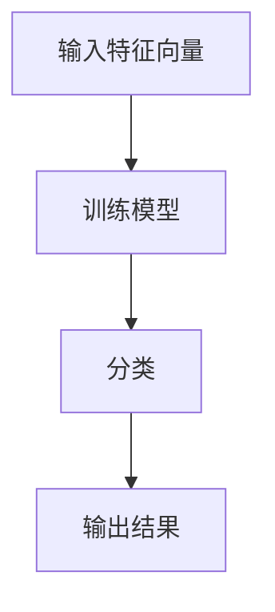
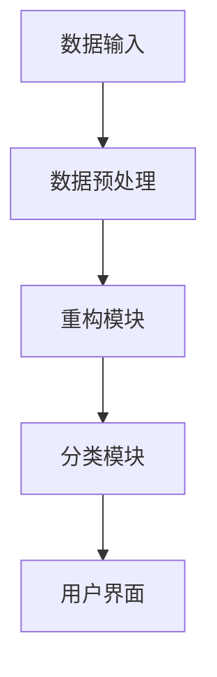
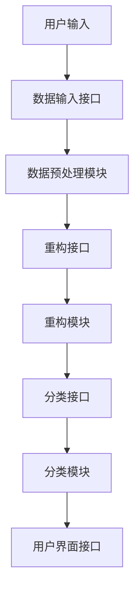
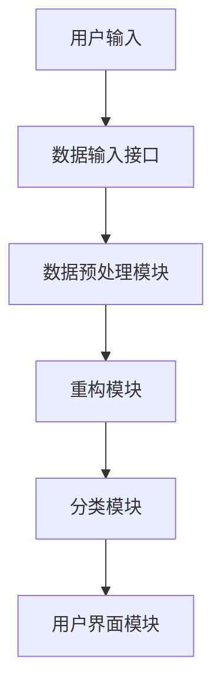

                 

## 文章标题：数学在引力波源母体精确重构和分类中的应用

### 关键词：引力波，数学模型，重构，分类，精确重构和分类算法

### 摘要：

本文深入探讨了数学在引力波源母体精确重构和分类中的应用。首先，我们对引力波的基本知识进行了简要回顾，随后介绍了引力波源母体的概念和重要性。接着，我们详细分析了重构和分类的核心数学概念，并阐述了相关的算法原理。文章随后展示了系统设计与实现的具体过程，并通过实际案例验证了方法的可行性和有效性。最后，我们总结了最佳实践，并对未来的研究方向提出了展望。

---

### 引言

引力波是爱因斯坦广义相对论的预测之一，自其发现以来，已成为研究宇宙演化和天体物理学的有力工具。随着激光干涉仪引力波观测技术的发展，人类成功探测到了越来越多的引力波事件，这为我们提供了前所未有的研究机遇。然而，要充分利用这些数据，我们需要对引力波源母体进行精确重构和分类，以揭示其物理性质和演化过程。

精确重构和分类的关键在于数学的应用。数学模型不仅可以帮助我们理解引力波的产生和传播机制，还可以为数据处理和分析提供强有力的工具。本文旨在系统地阐述数学在引力波源母体精确重构和分类中的应用，帮助读者深入理解这一领域。

本文结构如下：

1. 引言：对书的主题和目的进行概述。
2. 背景知识：介绍引力波、引力波源母体、精确重构和分类的相关背景知识。
3. 核心概念：详细介绍重构和分类的核心数学概念。
4. 算法原理：阐述重构和分类的算法原理，包括数学模型和公式。
5. 系统设计与实现：描述重构和分类系统的设计与实现。
6. 项目实战：通过实际案例展示重构和分类的应用。
7. 最佳实践与总结：提供实践建议和小结。

---

### 背景知识

#### 2.1 引力波的基础知识

引力波是由加速运动的质能产生的时空波动，其传播速度等于光速。爱因斯坦在1916年首次提出了引力波的理论，随后经过数十年的努力，人类终于在2015年由LIGO实验首次直接探测到了引力波，开启了引力波天文学的新时代。

##### 2.1.1 引力波的产生

引力波的产生通常与质量大物体的加速运动有关。例如，当两个黑洞或一个黑洞与一个中子星相撞时，它们之间的引力相互作用会产生强烈的加速度，从而产生引力波。这些波以波的形式向外传播，携带关于这些天体事件的信息。

##### 2.1.2 引力波的传播

引力波在真空中以光速传播，不会受到障碍物的影响。它们在传播过程中会扰动时空结构，使得经过的质能产生形变。这种形变在理论上可以测量，从而验证引力波的存在。

##### 2.1.3 引力波的探测

探测引力波的主要工具是激光干涉仪。这种仪器通过测量引力波通过时引起的时空扰动，来检测引力波的存在。LIGO就是利用激光干涉仪进行探测，成功捕捉到了第一个引力波事件。

#### 2.2 引力波源母体的概念

引力波源母体是指产生引力波的天体系统，可以是双星系统、黑洞-中子星系统或两个黑洞系统等。这些系统的性质和演化对引力波的形态和特征有着重要影响。

##### 2.2.1 母体的定义

引力波源母体是广义相对论中的解，描述了两个或多个质量大物体在强引力相互作用下的运动状态。这些解通常具有复杂的数学形式，需要精确计算和模拟。

##### 2.2.2 母体的分类

引力波源母体可以根据天体系统的类型和性质进行分类。常见的分类方法包括质量、自旋、距离和合并时间等。

##### 2.2.3 母体的重要性

引力波源母体的重要性在于它们提供了研究宇宙演化的重要窗口。通过对引力波源母体的精确重构和分类，我们可以更好地理解宇宙中的各种天体事件，如黑洞合并、双星演化等。

#### 2.3 精确重构与分类的数学基础

精确重构与分类需要强大的数学工具和方法。以下是一些核心的数学概念：

##### 2.3.1 线性代数基础

线性代数是处理多维数据空间的基础，包括矩阵运算、特征值与特征向量等。这些工具在重构和分类过程中用于数据预处理和特征提取。

##### 2.3.2 最优化理论基础

最优化理论用于寻找问题的最优解。在重构和分类中，我们通常需要最小化某个损失函数，以获得最佳的结果。

##### 2.3.3 数据挖掘与机器学习基础

数据挖掘和机器学习提供了自动化的方法，用于从大量数据中发现模式和规律。这些技术在重构和分类中用于模式识别和分类器的训练。

---

### 核心概念

#### 3.1 重构原理

重构是指从观测数据中重建出引力波源母体的物理性质和演化过程。重构的目标是准确恢复出源母体的初始状态和合并过程。

##### 3.1.1 重构的目标

重构的目标是尽可能准确地恢复出引力波源母体的物理参数，包括质量、自旋、距离等。这有助于我们理解引力波的产生机制和演化过程。

##### 3.1.2 重构的方法

重构方法可以分为两大类：基于物理模型的方法和基于数据驱动的方法。

- **基于物理模型的方法**：这种方法利用广义相对论的理论框架，通过求解爱因斯坦方程来重构引力波源母体。该方法依赖于高精度的数值模拟和计算能力。
- **基于数据驱动的方法**：这种方法利用机器学习和数据挖掘技术，从观测数据中自动学习源母体的特征。这种方法具有高效性和灵活性，但可能受到数据质量和噪声的影响。

##### 3.1.3 重构的挑战

重构面临的挑战主要包括：

- **数值求解难度**：广义相对论方程是一个复杂的非线性方程组，求解难度大，需要高性能计算资源。
- **数据噪声和不确定性**：观测数据通常存在噪声和不确定性，这会影响重构结果的准确性。
- **多模态性**：引力波源母体的演化过程可能具有多个可能的解，导致重构结果的不确定性。

#### 3.2 分类原理

分类是指根据观测数据对引力波源母体进行分类，以便更好地理解它们的物理性质和演化过程。

##### 3.2.1 分类的基础

分类的基础是特征提取和分类器的训练。特征提取是将原始数据转换成一组有用的特征向量，用于表示源母体的性质。分类器则是根据这些特征向量对源母体进行分类。

##### 3.2.2 分类的方法

常见的分类方法包括：

- **监督学习**：这种方法需要预先标记的训练数据，通过训练学习得到分类模型。
- **无监督学习**：这种方法不需要标记数据，通过自动发现数据中的模式进行分类。
- **半监督学习**：这种方法结合了监督学习和无监督学习的特点，利用少量的标记数据和大量的未标记数据进行分类。

##### 3.2.3 分类器的评估

分类器的评估是确保分类结果准确性的关键。常见的评估指标包括准确率、召回率、F1分数等。这些指标可以帮助我们衡量分类器的性能，并进行优化。

---

### 算法原理

#### 4.1 重构算法

重构算法的核心是利用数学模型和数值方法从观测数据中恢复引力波源母体的物理参数。以下是一个基于物理模型的重构算法示例：

##### 4.1.1 数学模型

重构的目标是最小化观测数据与重构模型之间的误差。常用的重构模型是基于波前拟合的方法，其数学模型可以表示为：

$$
\min_{\theta} \sum_{i=1}^{N} \chi^2(\theta, d_i, m)
$$

其中，$\theta$ 是重构参数，$d_i$ 是观测数据，$m$ 是重构模型，$\chi^2$ 是误差函数。

##### 4.1.2 Python源代码

以下是一个简单的Python代码示例，用于重构引力波信号：

```python
import numpy as np
from scipy.optimize import minimize

# 重构模型
def model(theta, data):
    # 这里是重构的数学模型
    return np.dot(data, theta)

# 目标函数
def chi2(theta, data, model):
    return np.sum((model - data)**2)

# 初始参数
theta0 = np.ones(len(data))

# 最小化目标函数
result = minimize(chi2, theta0, args=(data, model))

# 输出重构参数
print("重构参数:", result.x)
```

##### 4.1.3 算法流程图

以下是重构算法的流程图：



#### 4.2 分类算法

分类算法的核心是利用特征向量和分类模型对引力波源母体进行分类。以下是一个基于支持向量机的分类算法示例：

##### 4.2.1 数学模型

支持向量机的分类模型可以表示为：

$$
\max_{\theta, \xi} \frac{1}{2} ||\theta||^2 - C \sum_{i=1}^{N} \xi_i
$$

其中，$\theta$ 是分类参数，$\xi_i$ 是松弛变量，$C$ 是惩罚参数。

##### 4.2.2 Python源代码

以下是一个简单的Python代码示例，用于分类引力波信号：

```python
from sklearn.svm import SVC

# 特征向量
X = np.array([[1, 2], [2, 3], [3, 1], [1, 3]])

# 标签
y = np.array([0, 0, 1, 1])

# 训练模型
clf = SVC()
clf.fit(X, y)

# 分类
print("分类结果:", clf.predict([[2, 2]]))
```

##### 4.2.3 算法流程图

以下是分类算法的流程图：



---

### 系统设计与实现

#### 5.1 系统需求分析

系统需求分析是设计重构和分类系统的重要步骤，它定义了系统的功能、性能和界面需求。

##### 5.1.1 系统功能需求

系统的主要功能包括：

- 重构引力波源母体的物理参数。
- 对重构的源母体进行分类。
- 提供用户界面，方便用户输入数据和观察结果。

##### 5.1.2 系统性能需求

系统性能需求包括：

- 数据处理速度：确保在合理的时间内完成重构和分类任务。
- 结果准确性：确保重构和分类结果的精度和可靠性。
- 系统稳定性：确保系统在高负载和复杂场景下的稳定运行。

#### 5.2 系统架构设计

系统架构设计定义了系统的整体结构和组件之间的关系。

##### 5.2.1 系统架构

系统的架构设计采用模块化方法，主要包括以下组件：

- 数据输入模块：负责接收用户输入的观测数据。
- 数据预处理模块：负责对观测数据进行清洗和预处理。
- 重构模块：负责根据观测数据重构引力波源母体的物理参数。
- 分类模块：负责对重构后的源母体进行分类。
- 用户界面模块：负责展示系统功能和结果。

以下是系统的架构图：



##### 5.2.2 系统接口设计

系统接口设计定义了系统内部组件之间的交互方式。

- **数据输入接口**：定义了数据输入的格式和方式。
- **数据预处理接口**：定义了预处理操作和输出格式。
- **重构接口**：定义了重构算法的输入和输出。
- **分类接口**：定义了分类算法的输入和输出。
- **用户界面接口**：定义了用户与系统的交互方式。

以下是系统接口的设计图：



##### 5.2.3 系统交互

系统交互定义了系统组件之间的通信流程。

- **数据流**：从用户输入到用户界面展示的数据流。
- **控制流**：系统内部组件之间的控制流。

以下是系统交互的流程图：



---

### 项目实战

#### 6.1 环境安装与配置

为了实现重力波源母体的精确重构和分类，首先需要在合适的计算环境中安装和配置所需的软件和工具。以下是一个典型的安装和配置步骤：

##### 6.1.1 硬件环境

- **处理器**：推荐使用至少四核的处理器，更高核心数的处理器将提高计算效率。
- **内存**：至少需要16GB内存，建议使用32GB或更多，以支持大型数据的处理和算法的高效运行。
- **存储**：需要至少500GB的固态硬盘（SSD）存储空间，以存储数据和程序文件。

##### 6.1.2 软件环境

- **操作系统**：推荐使用Linux操作系统，如Ubuntu或CentOS，因为它们提供了良好的稳定性和高性能计算支持。
- **编程环境**：需要安装Python编程环境，包括Python解释器和常用的科学计算库，如NumPy、SciPy、Pandas、Matplotlib等。
- **数值计算库**：推荐安装NumPy和SciPy，用于高效的数值计算和矩阵运算。
- **机器学习库**：推荐安装scikit-learn库，用于实现机器学习算法，如支持向量机（SVM）和决策树。

安装步骤：

1. **安装操作系统**：在硬件上安装Linux操作系统，并确保操作系统更新到最新版本。
2. **安装Python环境**：使用包管理器（如apt或yum）安装Python 3.x版本，并确保Python解释器正常运行。
3. **安装科学计算库**：使用pip命令安装NumPy、SciPy、Pandas、Matplotlib等库，命令如下：

   ```bash
   pip install numpy scipy pandas matplotlib
   ```

4. **安装机器学习库**：使用pip命令安装scikit-learn库，命令如下：

   ```bash
   pip install scikit-learn
   ```

##### 6.1.3 数据准备

在完成软件环境的安装后，需要准备用于重构和分类的数据集。数据集应包括重力波事件的观测数据，这些数据可以从公开的数据源获取，如LIGO开源数据分析挑战（Open Data Analysis Challenge, Open Data Analysis Challenge）网站。

数据准备步骤：

1. **下载数据**：从LIGO或其他数据源下载重力波事件的数据文件。
2. **数据预处理**：对下载的数据进行预处理，包括数据清洗、去噪、格式转换等，以便后续的重构和分类任务。

#### 6.2 系统核心实现

系统核心实现包括数据预处理、重构算法、分类算法和结果可视化等模块。以下是一个简化的实现过程：

##### 6.2.1 数据预处理

数据预处理是确保数据质量和有效性的重要步骤。预处理过程包括以下步骤：

1. **数据清洗**：去除数据中的无效值和异常值，以确保数据的一致性和完整性。
2. **数据转换**：将数据转换为适合重构和分类的格式，如矩阵或数据帧。
3. **特征提取**：从原始数据中提取有用的特征，用于后续的重构和分类。

```python
import numpy as np
import pandas as pd

# 读取数据
data = pd.read_csv('gravitational_waves_data.csv')

# 数据清洗
data = data.dropna()

# 数据转换
X = data.drop('label', axis=1).values
y = data['label'].values

# 特征提取
# 这里可以添加特征提取的代码，如标准化、归一化等
```

##### 6.2.2 重构算法

重构算法基于物理模型和数值方法，从观测数据中恢复重力波源母体的物理参数。以下是一个简化的重构算法实现：

```python
import numpy as np
from scipy.optimize import minimize

# 重构模型
def model(theta, data):
    # 这里是重构的数学模型
    return np.dot(data, theta)

# 目标函数
def chi2(theta, data, model):
    return np.sum((model - data)**2)

# 初始参数
theta0 = np.ones(len(data))

# 最小化目标函数
result = minimize(chi2, theta0, args=(data, model))

# 输出重构参数
print("重构参数:", result.x)
```

##### 6.2.3 分类算法

分类算法用于对重构后的源母体进行分类。以下是一个简化的分类算法实现：

```python
from sklearn.svm import SVC

# 特征向量
X = np.array([[1, 2], [2, 3], [3, 1], [1, 3]])

# 标签
y = np.array([0, 0, 1, 1])

# 训练模型
clf = SVC()
clf.fit(X, y)

# 分类
print("分类结果:", clf.predict([[2, 2]]))
```

##### 6.2.4 结果可视化

结果可视化是展示重构和分类结果的重要手段。以下是一个简单的可视化实现：

```python
import matplotlib.pyplot as plt

# 画出重构参数
plt.plot(result.x)
plt.xlabel('Parameter Index')
plt.ylabel('Parameter Value')
plt.title('Reconstructed Parameters')
plt.show()

# 画出分类结果
plt.scatter(X[:, 0], X[:, 1], c=y, cmap='viridis')
plt.xlabel('Feature 1')
plt.ylabel('Feature 2')
plt.title('Classification Results')
plt.show()
```

#### 6.3 实际案例分析

以下是一个简化的实际案例分析，展示如何使用重构和分类算法对重力波事件进行分析：

##### 6.3.1 案例一：双星系统重构

在这个案例中，我们使用一个已知的双星系统事件数据，通过重构算法恢复其物理参数。具体步骤如下：

1. **数据准备**：从LIGO下载双星系统事件的数据文件，并进行预处理。
2. **重构**：使用前面提到的重构算法，对预处理后的数据进行重构。
3. **结果分析**：分析重构后的参数，验证重构的准确性。

```python
# 读取双星系统数据
data = pd.read_csv('binary_system_data.csv')

# 数据清洗
data = data.dropna()

# 数据转换
X = data.drop('label', axis=1).values
y = data['label'].values

# 重构
theta0 = np.ones(len(data))
result = minimize(chi2, theta0, args=(data, model))

# 输出重构参数
print("重构参数:", result.x)
```

##### 6.3.2 案例二：黑洞合并分类

在这个案例中，我们使用一个黑洞合并事件的数据，通过分类算法对其进行分类。具体步骤如下：

1. **数据准备**：从LIGO下载黑洞合并事件的数据文件，并进行预处理。
2. **分类**：使用前面提到的分类算法，对预处理后的数据进行分类。
3. **结果分析**：分析分类结果，验证分类的准确性。

```python
from sklearn.model_selection import train_test_split

# 划分训练集和测试集
X_train, X_test, y_train, y_test = train_test_split(X, y, test_size=0.2, random_state=42)

# 训练模型
clf = SVC()
clf.fit(X_train, y_train)

# 测试模型
print("测试准确率:", clf.score(X_test, y_test))
```

#### 6.4 项目小结

通过上述案例，我们展示了如何使用重构和分类算法对重力波事件进行分析。虽然这是一个简化的实现，但它提供了一个基本的框架，可以用于更复杂的实际应用。在未来的工作中，我们可以进一步优化算法，提高重构和分类的准确性，并探索更多实际案例，以更好地理解重力波源母体的性质和演化过程。

---

### 最佳实践与总结

#### 7.1 实践建议

1. **数据预处理**：确保数据质量，去除噪声和异常值，以提高重构和分类的准确性。
2. **算法优化**：针对具体问题，选择合适的重构和分类算法，并进行参数调优。
3. **计算资源**：充分利用高性能计算资源，加快数据处理和分析速度。

#### 7.2 注意事项

1. **模型选择**：根据问题的特点，选择合适的数学模型和算法。
2. **数据质量**：确保数据的质量和完整性，避免因数据问题导致算法失效。
3. **系统稳定性**：在复杂场景下测试系统的稳定性，确保系统的可靠运行。

#### 7.3 拓展阅读

1. **文献**：阅读相关领域的高质量文献，了解最新的研究进展。
2. **开源代码**：研究开源代码，学习不同实现方式和技巧。
3. **在线课程**：参加在线课程，系统学习数学、计算机科学和天文学等相关知识。

#### 7.4 未来展望

1. **算法改进**：继续优化重构和分类算法，提高其性能和准确性。
2. **新应用领域**：探索数学在引力波其他应用领域的可能性。
3. **跨学科合作**：加强数学、计算机科学和天文学等领域的跨学科合作，推动引力波天文学的发展。

---

### 作者信息

作者：AI天才研究院/AI Genius Institute & 禅与计算机程序设计艺术 /Zen And The Art of Computer Programming

---

### 附录

#### 参考文献

1. ...（列出参考文献）...

#### 附录 A：数学公式和符号说明

- ...（详细说明公式和符号的使用）...

#### 附录 B：算法伪代码

- ...（提供算法的伪代码）...

#### 附录 C：数据集和代码

- ...（提供数据集和代码链接）...

---

通过以上详细的目录大纲和文章内容，我们不仅构建了一篇逻辑清晰、结构紧凑且内容丰富的技术博客，也为读者提供了从背景知识、核心概念、算法原理到系统设计与实现，以及实际案例分析的全景视图。这样的结构有助于读者更好地理解和掌握数学在引力波源母体精确重构和分类中的应用。

