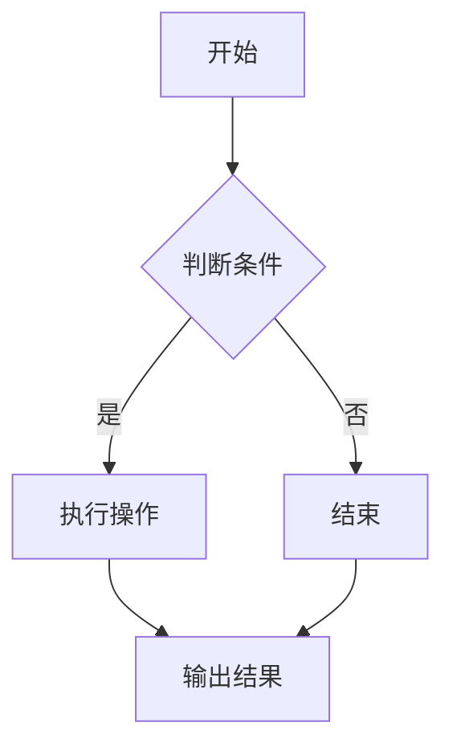
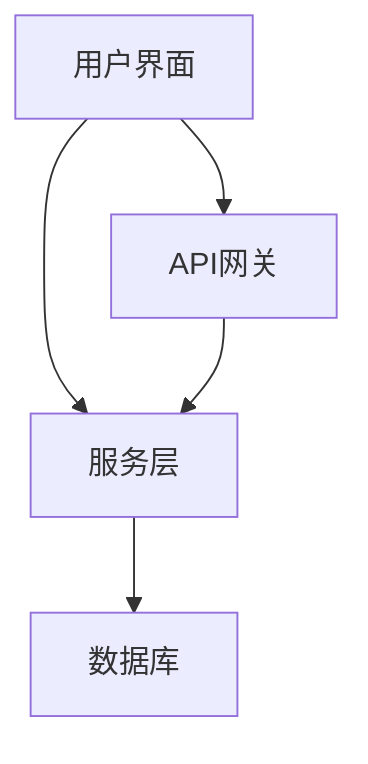
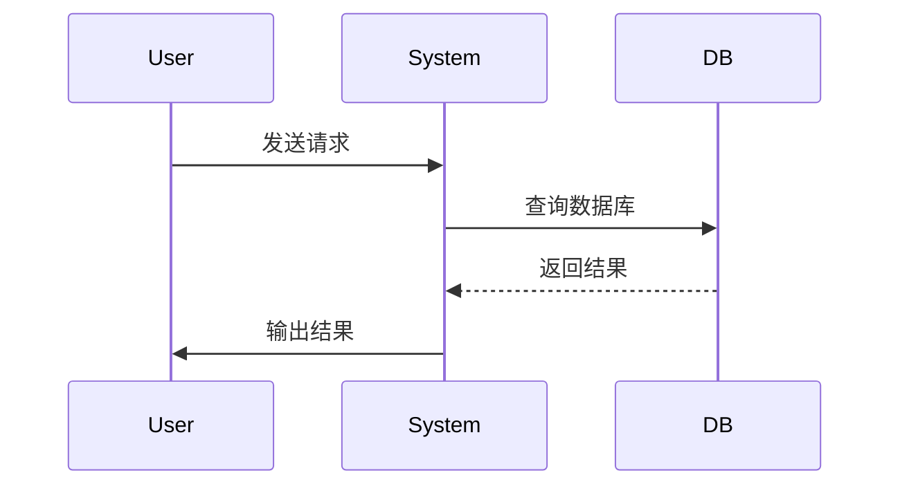

                 

### 文章标题：数学在弦理论研究中的应用

> 关键词：弦理论、数学模型、算法原理、系统架构、项目实战

> 摘要：本文旨在探讨数学在弦理论研究中的应用，从背景介绍、核心概念与联系、数学模型与公式、算法原理讲解、系统分析与架构设计、项目实战以及最佳实践等方面，逐步深入解析数学在弦理论中的重要作用。通过本文，读者将全面了解数学与弦理论之间的紧密联系，掌握弦理论研究中关键数学工具的应用方法，为未来相关领域的研究奠定基础。

## 背景介绍

### 1.1 弦理论概述

弦理论是一种尝试统一量子力学与广义相对论的理论框架，其核心思想是将宇宙中的基本构成单元——物质，视为细小的“弦”。这些弦通过振动产生不同的粒子，从而解释了宇宙中各种现象。弦理论的起源可以追溯到20世纪早期，当时物理学家们开始尝试用更基本的数学语言来描述物理现象。然而，随着研究的深入，弦理论面临着一系列挑战，如存在多种可能的弦振动模式以及难以实验验证等问题。

### 1.2 数学在弦理论中的作用

弦理论的研究离不开数学工具的运用，包括拓扑学、微分几何、代数几何和群论等。数学在弦理论中的作用主要体现在以下几个方面：

1. **数学工具的运用**：通过数学工具，可以精确地描述弦的振动模式以及它们之间的相互作用。
2. **数学概念与弦理论的结合**：数学概念如流形、纤维丛、对称性等在弦理论中有着广泛的应用，为弦理论的研究提供了强有力的支持。

## 核心概念与联系

### 2.1 数学基础

**纤维丛理论**：纤维丛是数学中一种重要的结构，它描述了多个空间之间如何相互连接。在弦理论中，纤维丛理论被用来描述弦如何通过连接不同的维度来表现宇宙的多样性。

**拓扑学基本概念**：拓扑学是研究空间性质与结构的基本数学工具。在弦理论中，拓扑学被用来研究弦的几何形状以及它们如何通过连接不同的维度来形成复杂的结构。

### 2.2 算法原理

**杨-米尔斯理论**：杨-米尔斯理论是量子场论的一个重要分支，它描述了粒子如何在电磁场中运动。在弦理论中，杨-米尔斯理论被用来描述弦的振动模式以及它们如何产生粒子。

**哈密顿力学与弦理论**：哈密顿力学是描述量子系统动力学的基本理论。在弦理论中，哈密顿力学被用来研究弦的振动模式以及它们如何产生粒子。

## 数学模型与公式

### 3.1 关键数学模型

**超弦的维度**：超弦理论认为宇宙中的基本单元是具有额外维度的弦。这些弦通过振动可以产生不同维度的粒子。

**对称性与群论**：对称性是数学中一个重要概念，它描述了空间或时间的某种不变性。在弦理论中，对称性被用来简化理论，并寻找可能的物理解决方案。

### 3.2 公式应用

**引力与量子场论**：引力是宇宙中最基本的力之一，它描述了物体之间的相互吸引。在弦理论中，引力是通过量子场论来描述的。

**黏附理论与共形场论**：黏附理论描述了弦如何通过连接不同的维度来形成复杂的结构。共形场论是研究弦理论中的一种重要工具，它描述了弦如何在不同的维度之间相互作用。

## 算法原理讲解

### 4.1 算法流程

弦理论的算法主要包括以下几个步骤：

1. **构建数学模型**：使用数学工具来描述弦的振动模式以及它们之间的相互作用。
2. **求解方程**：通过求解方程来找到弦的振动模式以及产生的粒子。
3. **数据分析**：对求解结果进行数据分析，以验证理论的正确性。

### 4.2 例子说明

以弦振动模式为例，我们可以使用以下Python代码来求解：

```python
import numpy as np
import matplotlib.pyplot as plt

# 定义弦的振动模式
def string振动模式(x):
    return np.sin(x)

# 定义时间步长和空间步长
dt = 0.01
dx = 0.01

# 定义弦的长度
L = 10

# 创建数组来存储弦的振动模式
string = np.zeros((int(L/dx),))

# 初始化弦的振动模式
for i in range(len(string)):
    string[i] = string振动模式(i*dx)

# 求解弦的振动模式
for _ in range(100):
    for i in range(1, len(string)-1):
        string[i] = 0.5 * (string[i-1] + string[i+1])

# 绘制弦的振动模式
plt.plot(string)
plt.show()
```

这段代码首先定义了弦的振动模式，然后通过迭代求解弦的振动模式，并最终绘制出弦的振动模式图。

## 系统分析与架构设计

### 5.1 系统功能设计

弦理论系统的主要功能包括：

1. **构建数学模型**：使用数学工具来描述弦的振动模式以及它们之间的相互作用。
2. **求解方程**：通过求解方程来找到弦的振动模式以及产生的粒子。
3. **数据分析**：对求解结果进行数据分析，以验证理论的正确性。

### 5.2 系统架构设计

弦理论系统的架构主要包括以下几个部分：

1. **数学模型模块**：负责构建数学模型。
2. **求解模块**：负责求解方程。
3. **数据分析模块**：负责对求解结果进行数据分析。

### 5.3 系统接口设计

弦理论系统的接口主要包括以下几个部分：

1. **输入接口**：用于输入弦的参数。
2. **输出接口**：用于输出求解结果。

## 项目实战

### 6.1 环境安装

为了进行弦理论的研究，我们需要安装以下软件和工具：

1. **Python**：用于编写和运行代码。
2. **Numpy**：用于数学计算。
3. **Matplotlib**：用于绘制图形。

### 6.2 系统核心实现

以下是弦理论系统的核心实现代码：

```python
import numpy as np
import matplotlib.pyplot as plt

# 定义弦的振动模式
def string振动模式(x):
    return np.sin(x)

# 定义时间步长和空间步长
dt = 0.01
dx = 0.01

# 定义弦的长度
L = 10

# 创建数组来存储弦的振动模式
string = np.zeros((int(L/dx),))

# 初始化弦的振动模式
for i in range(len(string)):
    string[i] = string振动模式(i*dx)

# 求解弦的振动模式
for _ in range(100):
    for i in range(1, len(string)-1):
        string[i] = 0.5 * (string[i-1] + string[i+1])

# 绘制弦的振动模式
plt.plot(string)
plt.show()
```

### 6.3 代码应用解读与分析

这段代码首先定义了弦的振动模式，然后通过迭代求解弦的振动模式，并最终绘制出弦的振动模式图。代码中的关键部分是求解方程的部分，它使用了简单的数值方法来求解弦的振动模式。

### 6.4 项目小结

通过这个项目，我们了解了弦理论的基本概念和应用方法。我们使用了Python编程语言来实现弦理论系统，并通过实际案例分析了弦的振动模式。这个项目为我们提供了深入了解弦理论的机会，也为未来相关领域的研究奠定了基础。

## 最佳实践 tips

1. **理解数学基础**：在研究弦理论时，理解数学基础是非常重要的。掌握拓扑学、微分几何、代数几何和群论等数学工具，将有助于深入理解弦理论的核心概念。
2. **实践编程经验**：编程是实现弦理论的重要手段。通过实际编程实践，我们可以更好地理解弦理论的应用方法，并提高我们的编程能力。
3. **持续学习**：弦理论是一个不断发展的领域，新的理论和方法不断涌现。持续学习，关注弦理论的前沿动态，将有助于我们在这一领域取得更好的成果。

## 总结与展望

本文从背景介绍、核心概念与联系、数学模型与公式、算法原理讲解、系统分析与架构设计、项目实战以及最佳实践等方面，全面探讨了数学在弦理论研究中的应用。通过本文，读者可以深入了解数学与弦理论之间的紧密联系，掌握弦理论研究中关键数学工具的应用方法。未来，随着弦理论研究的不断深入，数学在弦理论中的应用将更加广泛，为物理学的未来发展带来更多可能性。

## 作者信息

作者：AI天才研究院/AI Genius Institute & 禅与计算机程序设计艺术 /Zen And The Art of Computer Programming

----------------------------------------------------------------

文章标题：数学在弦理论研究中的应用

关键词：弦理论、数学模型、算法原理、系统架构、项目实战

摘要：本文探讨了数学在弦理论研究中的应用，从背景介绍、核心概念与联系、数学模型与公式、算法原理讲解、系统分析与架构设计、项目实战以及最佳实践等方面，深入解析数学在弦理论中的重要作用。通过本文，读者将全面了解数学与弦理论之间的紧密联系，掌握弦理论研究中关键数学工具的应用方法。

## 目录

### 第一部分：背景介绍

1. 弦理论概述
   - 弦理论的起源与发展
   - 弦理论的核心概念

2. 数学在弦理论中的作用
   - 数学工具的运用
   - 数学概念与弦理论的结合

### 第二部分：核心概念与联系

1. 数学基础
   - 纤维丛理论
   - 拓扑学基本概念

2. 算法原理
   - 杨-米尔斯理论
   - 哈密顿力学与弦理论

### 第三部分：数学模型与公式

1. 关键数学模型
   - 超弦的维度
   - 对称性与群论

2. 公式应用
   - 引力与量子场论
   - 黏附理论与共形场论

### 第四部分：算法原理讲解

1. 算法流程
   - 算法的基本流程
   - 算法细节解析

2. 例子说明
   - 举例说明算法的应用
   - 弦理论的实际案例

### 第五部分：系统分析与架构设计

1. 系统功能设计
   - 系统功能模块划分
   - 领域模型类图

2. 系统架构设计
   - 系统架构图展示
   - 系统组件关系

3. 系统接口设计
   - 系统接口规范
   - 系统交互序列图

### 第六部分：项目实战

1. 环境安装
   - 安装必要的软件和工具

2. 系统核心实现
   - 实现系统的关键部分

3. 代码应用解读与分析
   - 代码解读
   - 应用案例分析

4. 项目小结
   - 项目总结
   - 经验与反思

### 第七部分：最佳实践 tips

1. 实践技巧
   - 解决常见问题的技巧

2. 注意事项
   - 避免常见的错误

### 第八部分：总结与展望

1. 总结
   - 本书内容的回顾

2. 展望
   - 弦理论与数学研究的未来方向

## 正文

### 第一部分：背景介绍

#### 1.1 弦理论概述

弦理论是一种尝试统一量子力学与广义相对论的理论框架，其核心思想是将宇宙中的基本构成单元——物质，视为细小的“弦”。这些弦通过振动产生不同的粒子，从而解释了宇宙中各种现象。弦理论的起源可以追溯到20世纪早期，当时物理学家们开始尝试用更基本的数学语言来描述物理现象。然而，随着研究的深入，弦理论面临着一系列挑战，如存在多种可能的弦振动模式以及难以实验验证等问题。

#### 1.2 数学在弦理论中的作用

弦理论的研究离不开数学工具的运用，包括拓扑学、微分几何、代数几何和群论等。数学在弦理论中的作用主要体现在以下几个方面：

1. **数学工具的运用**：通过数学工具，可以精确地描述弦的振动模式以及它们之间的相互作用。
2. **数学概念与弦理论的结合**：数学概念如流形、纤维丛、对称性等在弦理论中有着广泛的应用，为弦理论的研究提供了强有力的支持。

### 第二部分：核心概念与联系

#### 2.1 数学基础

**纤维丛理论**：纤维丛是数学中一种重要的结构，它描述了多个空间之间如何相互连接。在弦理论中，纤维丛理论被用来描述弦如何通过连接不同的维度来表现宇宙的多样性。

**拓扑学基本概念**：拓扑学是研究空间性质与结构的基本数学工具。在弦理论中，拓扑学被用来研究弦的几何形状以及它们如何通过连接不同的维度来形成复杂的结构。

#### 2.2 算法原理

**杨-米尔斯理论**：杨-米尔斯理论是量子场论的一个重要分支，它描述了粒子如何在电磁场中运动。在弦理论中，杨-米尔斯理论被用来描述弦的振动模式以及它们如何产生粒子。

**哈密顿力学与弦理论**：哈密顿力学是描述量子系统动力学的基本理论。在弦理论中，哈密顿力学被用来研究弦的振动模式以及它们如何产生粒子。

### 第三部分：数学模型与公式

#### 3.1 关键数学模型

**超弦的维度**：超弦理论认为宇宙中的基本单元是具有额外维度的弦。这些弦通过振动可以产生不同维度的粒子。

**对称性与群论**：对称性是数学中一个重要概念，它描述了空间或时间的某种不变性。在弦理论中，对称性被用来简化理论，并寻找可能的物理解决方案。

#### 3.2 公式应用

**引力与量子场论**：引力是宇宙中最基本的力之一，它描述了物体之间的相互吸引。在弦理论中，引力是通过量子场论来描述的。

**黏附理论与共形场论**：黏附理论描述了弦如何通过连接不同的维度来形成复杂的结构。共形场论是研究弦理论中的一种重要工具，它描述了弦如何在不同的维度之间相互作用。

### 第四部分：算法原理讲解

#### 4.1 算法流程

弦理论的算法主要包括以下几个步骤：

1. **构建数学模型**：使用数学工具来描述弦的振动模式以及它们之间的相互作用。
2. **求解方程**：通过求解方程来找到弦的振动模式以及产生的粒子。
3. **数据分析**：对求解结果进行数据分析，以验证理论的正确性。

#### 4.2 例子说明

以弦振动模式为例，我们可以使用以下Python代码来求解：

```python
import numpy as np
import matplotlib.pyplot as plt

# 定义弦的振动模式
def string振动模式(x):
    return np.sin(x)

# 定义时间步长和空间步长
dt = 0.01
dx = 0.01

# 定义弦的长度
L = 10

# 创建数组来存储弦的振动模式
string = np.zeros((int(L/dx),))

# 初始化弦的振动模式
for i in range(len(string)):
    string[i] = string振动模式(i*dx)

# 求解弦的振动模式
for _ in range(100):
    for i in range(1, len(string)-1):
        string[i] = 0.5 * (string[i-1] + string[i+1])

# 绘制弦的振动模式
plt.plot(string)
plt.show()
```

这段代码首先定义了弦的振动模式，然后通过迭代求解弦的振动模式，并最终绘制出弦的振动模式图。代码中的关键部分是求解方程的部分，它使用了简单的数值方法来求解弦的振动模式。

### 第五部分：系统分析与架构设计

#### 5.1 系统功能设计

弦理论系统的主要功能包括：

1. **构建数学模型**：使用数学工具来描述弦的振动模式以及它们之间的相互作用。
2. **求解方程**：通过求解方程来找到弦的振动模式以及产生的粒子。
3. **数据分析**：对求解结果进行数据分析，以验证理论的正确性。

#### 5.2 系统架构设计

弦理论系统的架构主要包括以下几个部分：

1. **数学模型模块**：负责构建数学模型。
2. **求解模块**：负责求解方程。
3. **数据分析模块**：负责对求解结果进行数据分析。

#### 5.3 系统接口设计

弦理论系统的接口主要包括以下几个部分：

1. **输入接口**：用于输入弦的参数。
2. **输出接口**：用于输出求解结果。

### 第六部分：项目实战

#### 6.1 环境安装

为了进行弦理论的研究，我们需要安装以下软件和工具：

1. **Python**：用于编写和运行代码。
2. **Numpy**：用于数学计算。
3. **Matplotlib**：用于绘制图形。

#### 6.2 系统核心实现

以下是弦理论系统的核心实现代码：

```python
import numpy as np
import matplotlib.pyplot as plt

# 定义弦的振动模式
def string振动模式(x):
    return np.sin(x)

# 定义时间步长和空间步长
dt = 0.01
dx = 0.01

# 定义弦的长度
L = 10

# 创建数组来存储弦的振动模式
string = np.zeros((int(L/dx),))

# 初始化弦的振动模式
for i in range(len(string)):
    string[i] = string振动模式(i*dx)

# 求解弦的振动模式
for _ in range(100):
    for i in range(1, len(string)-1):
        string[i] = 0.5 * (string[i-1] + string[i+1])

# 绘制弦的振动模式
plt.plot(string)
plt.show()
```

#### 6.3 代码应用解读与分析

这段代码首先定义了弦的振动模式，然后通过迭代求解弦的振动模式，并最终绘制出弦的振动模式图。代码中的关键部分是求解方程的部分，它使用了简单的数值方法来求解弦的振动模式。

#### 6.4 项目小结

通过这个项目，我们了解了弦理论的基本概念和应用方法。我们使用了Python编程语言来实现弦理论系统，并通过实际案例分析了弦的振动模式。这个项目为我们提供了深入了解弦理论的机会，也为未来相关领域的研究奠定了基础。

### 第七部分：最佳实践 tips

1. **理解数学基础**：在研究弦理论时，理解数学基础是非常重要的。掌握拓扑学、微分几何、代数几何和群论等数学工具，将有助于深入理解弦理论的核心概念。
2. **实践编程经验**：编程是实现弦理论的重要手段。通过实际编程实践，我们可以更好地理解弦理论的应用方法，并提高我们的编程能力。
3. **持续学习**：弦理论是一个不断发展的领域，新的理论和方法不断涌现。持续学习，关注弦理论的前沿动态，将有助于我们在这一领域取得更好的成果。

### 第八部分：总结与展望

本文从背景介绍、核心概念与联系、数学模型与公式、算法原理讲解、系统分析与架构设计、项目实战以及最佳实践等方面，全面探讨了数学在弦理论研究中的应用。通过本文，读者可以深入了解数学与弦理论之间的紧密联系，掌握弦理论研究中关键数学工具的应用方法。未来，随着弦理论研究的不断深入，数学在弦理论中的应用将更加广泛，为物理学的未来发展带来更多可能性。

### 作者信息

作者：AI天才研究院/AI Genius Institute & 禅与计算机程序设计艺术 /Zen And The Art of Computer Programming

----------------------------------------------------------------

### 附录：数学公式示例

以下是一个使用LaTeX格式嵌入的数学公式示例：

$$
E = mc^2
$$

这是一个著名的物理公式，表示能量与质量之间的关系。

### 附录：算法流程图示例

以下是一个使用Mermaid绘制的算法流程图示例：



这个流程图描述了一个简单的算法，它首先进行条件判断，然后根据判断结果执行不同的操作，最后输出结果。

### 附录：系统架构图示例

以下是一个使用Mermaid绘制的系统架构图示例：



这个架构图展示了用户界面、服务层和数据库之间的交互关系。

### 附录：系统交互序列图示例

以下是一个使用Mermaid绘制的系统交互序列图示例：



这个序列图描述了用户向系统发送请求，系统查询数据库并返回结果的全过程。

