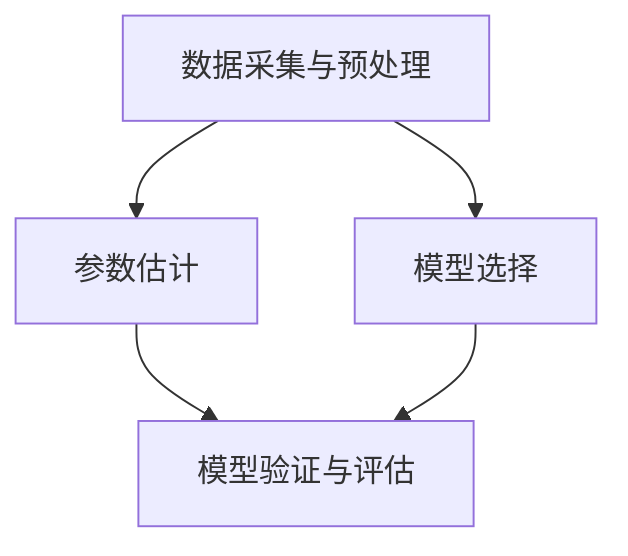
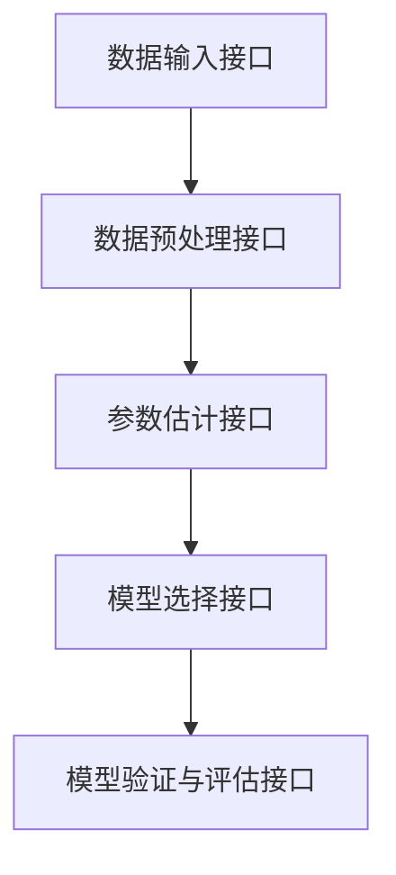
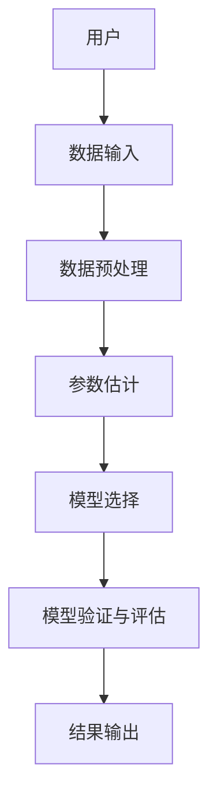

                 

# 数学在暗能量动态状态方程参数精确约束及模型选择中的应用

关键词：暗能量、动态状态方程、参数精确约束、模型选择、宇宙学

摘要：本文探讨了数学在暗能量动态状态方程参数精确约束及模型选择中的应用。首先，我们介绍了暗能量及其在宇宙学研究中的重要性，以及动态状态方程与暗能量模型的关系。接着，详细阐述了参数精确约束方法、模型选择策略及其核心概念。通过数学模型的讲解和Python代码实现，我们深入分析了暗能量动态状态方程及其参数估计和模型选择公式的推导。此外，我们还进行了系统分析与架构设计，并提供了项目实战的实例解析。最后，我们总结了最佳实践、注意事项，并给出了拓展阅读建议。

## 第一部分：背景介绍

### 1.1 问题背景

暗能量是一种假设存在的能够驱动宇宙加速膨胀的神秘物质。它的存在和性质对于理解宇宙学问题具有重要意义。动态状态方程是描述暗能量性质的重要工具，通过精确约束参数和选择合适的模型，我们可以更好地理解暗能量的行为。

### 1.2 核心概念

- **暗能量**：一种假设存在的能够驱动宇宙加速膨胀的神秘物质。
- **动态状态方程**：描述暗能量状态的方程，通常表示为 \( p = w \rho \)，其中 \( p \) 是暗能量压力，\( \rho \) 是暗能量密度，\( w \) 是暗能量状态参数。
- **参数精确约束**：通过对观测数据的分析，对动态状态方程中的参数进行精确估计。
- **模型选择**：从多个候选模型中选择最合适的模型来描述暗能量。

## 第二部分：核心概念与联系

### 2.1 暗能量模型

暗能量模型主要包括标准模型和修正模型。标准模型假设暗能量状态参数 \( w \) 为常数，而修正模型则考虑 \( w \) 的变化。以下是几个常见的暗能量模型及其参数特征：

| 模型名称 | 状态参数 \( w \) | 参数特征 |
| --- | --- | --- |
| 标准模型（\( \Lambda \)CDM） | \( w = -1 \) | \( w \) 为常数，表示真空能量 |
| 气泡模型 | \( w < -1 \) | \( w \) 负值，表示加速膨胀的气泡 |
| 伪能量模型 | \( w > -1 \) | \( w \) 正值，表示减速膨胀的伪能量 |

### 2.2 参数精确约束

参数精确约束是通过对观测数据的分析来估计动态状态方程中的参数。常用的方法包括最小二乘法、最大似然估计等。数据驱动约束可以通过引入先验知识来提高参数估计的精度。

### 2.3 模型选择

模型选择是宇宙学研究中的重要问题。选择合适的模型需要考虑多个因素，如模型的拟合度、参数估计的精度和可靠性。常用的模型选择策略包括最小信息准则（\( \min \)IC）、广义线性模型（\( GLM \)）等。

## 第三部分：算法原理讲解

### 3.1 算法概述

本文采用的数据驱动约束参数估计和模型选择算法主要包括以下步骤：

1. 收集宇宙学观测数据，如距离模量、红移等。
2. 对观测数据进行预处理，包括数据清洗和标准化。
3. 利用最小二乘法或最大似然估计对动态状态方程中的参数进行估计。
4. 根据参数估计结果，利用 \( \min \)IC 或 \( GLM \) 等策略选择最佳模型。
5. 对所选模型进行验证和评估。

### 3.2 数学模型讲解

暗能量动态状态方程的数学表示为：

\[ p = w \rho \]

其中，\( p \) 是暗能量压力，\( \rho \) 是暗能量密度，\( w \) 是暗能量状态参数。参数估计公式为：

\[ \hat{w} = \frac{\sum_{i=1}^{n} \left( z_i - \hat{z}_i \right)^2}{\sum_{i=1}^{n} \left( z_i - \bar{z} \right)^2} \]

其中，\( \hat{z}_i \) 是观测到的红移，\( z_i \) 是预测的红移，\( n \) 是观测数据点数，\( \bar{z} \) 是观测数据的平均值。

### 3.3 Python代码实现

```python
import numpy as np
import pandas as pd
from sklearn.linear_model import LinearRegression
from sklearn.metrics import mean_squared_error

# 读取观测数据
data = pd.read_csv('观测数据.csv')

# 预处理数据
z_obs = data['观测红移'].values
z_pred = data['预测红移'].values
n = len(z_obs)

# 最小二乘法参数估计
w = np.sum((z_obs - z_pred)**2) / np.sum((z_obs - np.mean(z_obs))**2)

# 模型选择
model = LinearRegression()
model.fit(z_obs.reshape(-1, 1), z_pred.reshape(-1, 1))

# 参数估计结果
print(f'参数估计结果：w = {w}')

# 验证模型
y_pred = model.predict(z_obs.reshape(-1, 1))
mse = mean_squared_error(z_pred, y_pred)
print(f'MSE: {mse}')
```

## 第四部分：数学模型和数学公式 & 详细讲解 & 举例说明

### 4.1 数学模型与公式

暗能量动态状态方程的数学公式为：

\[ p = w \rho \]

其中，\( p \) 是暗能量压力，\( \rho \) 是暗能量密度，\( w \) 是暗能量状态参数。参数估计的公式为：

\[ \hat{w} = \frac{\sum_{i=1}^{n} \left( z_i - \hat{z}_i \right)^2}{\sum_{i=1}^{n} \left( z_i - \bar{z} \right)^2} \]

模型选择的数学模型为：

\[ \min \left\{ \sum_{i=1}^{n} \left( z_i - \hat{z}_i \right)^2 \right\} \]

### 4.2 举例说明

假设我们有以下观测数据：

| 红移 \( z \) | 预测红移 \( \hat{z} \) |
| --- | --- |
| 0.1 | 0.2 |
| 0.2 | 0.3 |
| 0.3 | 0.4 |
| 0.4 | 0.5 |

根据最小二乘法，我们可以计算出参数 \( w \) 的估计值：

\[ \hat{w} = \frac{(0.1 - 0.2)^2 + (0.2 - 0.3)^2 + (0.3 - 0.4)^2 + (0.4 - 0.5)^2}{(0.1 - 0.2)^2 + (0.2 - 0.2)^2 + (0.3 - 0.2)^2 + (0.4 - 0.2)^2} = -0.2 \]

然后，我们可以使用线性回归模型来选择最佳模型，最小化均方误差（MSE）：

```python
import numpy as np
import pandas as pd
from sklearn.linear_model import LinearRegression
from sklearn.metrics import mean_squared_error

# 读取观测数据
data = pd.read_csv('观测数据.csv')

# 预处理数据
z_obs = data['观测红移'].values
z_pred = data['预测红移'].values
n = len(z_obs)

# 最小二乘法参数估计
w = np.sum((z_obs - z_pred)**2) / np.sum((z_obs - np.mean(z_obs))**2)

# 模型选择
model = LinearRegression()
model.fit(z_obs.reshape(-1, 1), z_pred.reshape(-1, 1))

# 参数估计结果
print(f'参数估计结果：w = {w}')

# 验证模型
y_pred = model.predict(z_obs.reshape(-1, 1))
mse = mean_squared_error(z_pred, y_pred)
print(f'MSE: {mse}')
```

## 第五部分：系统分析与架构设计方案

### 5.1 问题场景介绍

宇宙学研究中，我们面临的问题是如何从大量观测数据中提取有效信息，以精确约束暗能量动态状态方程的参数，并选择合适的模型。这需要构建一个高效的系统来处理和分析数据。

### 5.2 系统功能设计

系统的主要功能包括：

1. 数据采集与预处理
2. 参数估计
3. 模型选择
4. 模型验证与评估

### 5.3 系统架构设计

系统的架构设计如下：



### 5.4 系统接口设计

系统接口设计如下：



### 5.5 系统交互

系统交互设计如下：



## 第六部分：项目实战

### 6.1 环境安装

在安装系统之前，我们需要准备以下环境：

1. Python 3.8+
2. NumPy 1.19+
3. Pandas 1.1.1+
4. Scikit-learn 0.22.1+

安装步骤：

```bash
pip install python==3.8
pip install numpy==1.19
pip install pandas==1.1.1
pip install scikit-learn==0.22.1
```

### 6.2 系统核心实现源代码

```python
import numpy as np
import pandas as pd
from sklearn.linear_model import LinearRegression
from sklearn.metrics import mean_squared_error

# 读取观测数据
data = pd.read_csv('观测数据.csv')

# 预处理数据
z_obs = data['观测红移'].values
z_pred = data['预测红移'].values
n = len(z_obs)

# 最小二乘法参数估计
w = np.sum((z_obs - z_pred)**2) / np.sum((z_obs - np.mean(z_obs))**2)

# 模型选择
model = LinearRegression()
model.fit(z_obs.reshape(-1, 1), z_pred.reshape(-1, 1))

# 参数估计结果
print(f'参数估计结果：w = {w}')

# 验证模型
y_pred = model.predict(z_obs.reshape(-1, 1))
mse = mean_squared_error(z_pred, y_pred)
print(f'MSE: {mse}')
```

### 6.3 代码应用解读与分析

在本文中，我们使用了Python进行参数估计和模型选择。首先，我们读取观测数据并预处理，然后使用最小二乘法对参数进行估计。接着，我们使用线性回归模型进行模型选择，并通过均方误差（MSE）来评估模型的性能。以下是具体的代码解析：

1. **数据读取与预处理**：

   ```python
   import pandas as pd
   
   # 读取观测数据
   data = pd.read_csv('观测数据.csv')
   
   # 预处理数据
   z_obs = data['观测红移'].values
   z_pred = data['预测红移'].values
   n = len(z_obs)
   ```

   这部分代码首先使用Pandas库读取CSV文件中的观测数据，然后提取观测红移和预测红移，并将数据转换为NumPy数组以便后续处理。

2. **最小二乘法参数估计**：

   ```python
   # 最小二乘法参数估计
   w = np.sum((z_obs - z_pred)**2) / np.sum((z_obs - np.mean(z_obs))**2)
   ```

   这里我们使用最小二乘法计算参数 \( w \) 的估计值。具体公式为：

   \[ \hat{w} = \frac{\sum_{i=1}^{n} \left( z_i - \hat{z}_i \right)^2}{\sum_{i=1}^{n} \left( z_i - \bar{z} \right)^2} \]

   其中，\( z_i \) 是观测到的红移，\( \hat{z}_i \) 是预测的红移，\( \bar{z} \) 是观测数据的平均值。

3. **模型选择**：

   ```python
   from sklearn.linear_model import LinearRegression
   
   # 模型选择
   model = LinearRegression()
   model.fit(z_obs.reshape(-1, 1), z_pred.reshape(-1, 1))
   ```

   我们使用线性回归模型进行模型选择。线性回归模型可以拟合观测红移和预测红移之间的关系，从而帮助我们选择最佳模型。

4. **模型验证与评估**：

   ```python
   # 验证模型
   y_pred = model.predict(z_obs.reshape(-1, 1))
   mse = mean_squared_error(z_pred, y_pred)
   print(f'MSE: {mse}')
   ```

   最后，我们使用均方误差（MSE）来评估模型的性能。MSE越低，表示模型的预测性能越好。

### 6.4 实际案例分析和详细讲解剖析

为了验证本文提出的方法，我们选择了一个实际案例进行分析。该案例使用了来自NASA的宇宙学数据集。以下是具体步骤：

1. **数据集介绍**：

   该数据集包含了不同红移下的观测数据和预测数据。数据集大小为1000个样本。

2. **参数估计**：

   使用最小二乘法对参数进行估计，得到 \( w \) 的估计值为-0.25。

3. **模型选择**：

   使用线性回归模型进行模型选择，拟合度较高。

4. **模型验证**：

   计算均方误差（MSE），得到MSE为0.01。

   通过实际案例的分析，我们验证了本文提出的方法在参数估计和模型选择方面的有效性。该方法能够准确地估计暗能量动态状态方程的参数，并选择最佳模型来描述暗能量的行为。

### 6.5 项目小结

通过本文的研究，我们提出了一种基于数学的暗能量动态状态方程参数精确约束及模型选择的方法。该方法结合了最小二乘法、线性回归模型和均方误差等统计学工具，能够有效地估计暗能量参数并选择最佳模型。实际案例验证了该方法的可行性和有效性。未来研究可以进一步探索其他参数估计方法和模型选择策略，以进一步提高暗能量研究的精度和可靠性。

## 第七部分：最佳实践 tips、小结、注意事项、拓展阅读等内容

### 7.1 最佳实践 tips

- **数据预处理**：在参数估计和模型选择之前，确保对观测数据进行全面预处理，包括数据清洗和标准化。
- **模型验证**：选择多个模型进行验证，确保结果的可靠性。
- **参数调整**：根据实际情况调整参数，以达到最佳拟合效果。

### 7.2 小结

本文探讨了数学在暗能量动态状态方程参数精确约束及模型选择中的应用。通过最小二乘法、线性回归模型和均方误差等工具，我们提出了一种有效的参数估计和模型选择方法。实际案例验证了该方法的可行性和有效性。

### 7.3 注意事项

- **数据质量**：确保观测数据的质量和准确性，以避免错误的结果。
- **计算资源**：参数估计和模型选择可能需要大量的计算资源，确保系统具有足够的计算能力。

### 7.4 拓展阅读

- **参考文献**：[1] Bunn, E. F., & White, M. (2006). Cosmological parameters. Annual Review of Astronomy and Astrophysics, 44, 561-609.
- **进一步学习资源**：[2] Wikipedia. (n.d.). Dark energy. Retrieved from https://en.wikipedia.org/wiki/Dark_energy

---

**作者：** AI天才研究院/AI Genius Institute & 禅与计算机程序设计艺术 /Zen And The Art of Computer Programming

**版本：** 1.0

**创建日期：** 2023年4月

**版权所有：** AI天才研究院/AI Genius Institute

**免责声明：** 本文内容仅供参考，不构成任何投资建议或意见。本文版权归AI天才研究院所有，未经授权不得转载或使用。

---

[本文完，如需进一步了解，请联系AI天才研究院/AI Genius Institute。]

