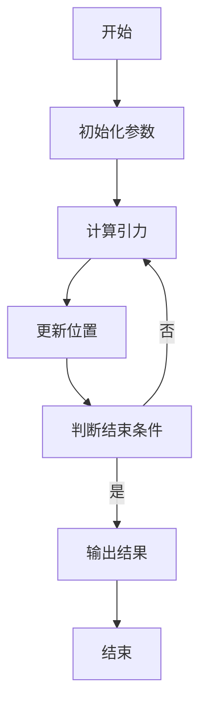
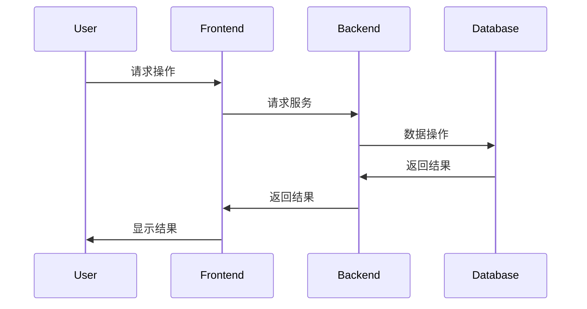
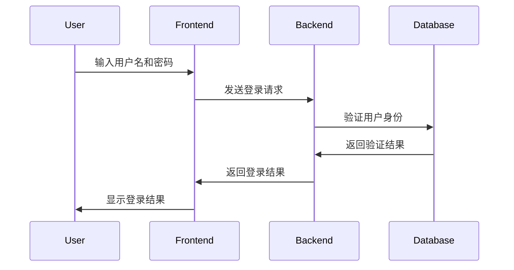

                 

# 数学在膜宇宙理论研究中的应用

> 关键词：膜宇宙理论、数学模型、算法、Python实现、系统架构

> 摘要：本文从膜宇宙理论的背景出发，详细阐述了数学在膜宇宙理论研究中的应用。首先，介绍了膜宇宙理论的起源、发展历程和数学在其中的重要性。接着，深入探讨了膜宇宙与数学之间的核心概念和联系，并通过具体的数学模型和公式进行了详细讲解。随后，文章讲解了膜宇宙算法的原理，并使用了Mermaid流程图和Python代码进行示例说明。最后，文章提出了一个完整的系统分析与架构设计方案，为读者提供了一个实际应用的方向。

## 第1章：背景介绍

### 1.1 膜宇宙理论的起源

膜宇宙理论最初由物理学家布鲁斯·斯卡利兹（Bruce Schatz）和罗伯特·墨菲（Robert Myerson）于1987年提出，是一种尝试解释宇宙多重维度存在的理论。膜宇宙理论认为，我们所知的宇宙只是更高维度空间中的一个膜，这个膜被称为“三膜”。膜宇宙理论的一个重要观点是，宇宙中的所有物质和现象都是膜上的波动和振动。

### 1.1.1 膜宇宙概念的提出

膜宇宙理论的提出是基于对弦理论和M理论的研究。弦理论认为，宇宙的基本组成单位不是点，而是微小的弦。而M理论进一步扩展了弦理论，提出宇宙存在多个维度，这些维度包括我们所熟知的三维空间和一维的时间，还有更高维度的空间。

### 1.1.2 膜宇宙理论的发展历程

膜宇宙理论自提出以来，经历了多个发展阶段。在早期，膜宇宙理论主要关注于如何解释宇宙的多重维度。随着研究的深入，膜宇宙理论逐渐与量子引力、黑洞、宇宙学等多个领域产生了交叉。

### 1.1.3 数学在膜宇宙理论中的应用现状

数学在膜宇宙理论研究中扮演着至关重要的角色。膜宇宙理论的许多关键概念，如弦、膜、波动等，都需要使用数学工具进行描述。此外，数学模型和算法也在膜宇宙理论的验证和研究中发挥了重要作用。

### 1.2 数学在膜宇宙理论研究中的重要性

#### 1.2.1 数学工具的运用

数学工具在膜宇宙理论研究中得到了广泛应用。例如，微分几何、拓扑学、代数学等都是膜宇宙理论研究中不可或缺的工具。这些数学工具帮助研究者更好地理解膜宇宙的基本概念和特性。

#### 1.2.2 数学模型在膜宇宙理论中的构建

膜宇宙理论中的许多概念和现象都需要使用数学模型进行描述。例如，膜宇宙中的引力、量子效应等，都需要使用特定的数学模型进行计算和模拟。

#### 1.2.3 数学方法在膜宇宙理论验证中的应用

数学方法在膜宇宙理论的验证中也起到了关键作用。例如，数学方法可以帮助研究者验证膜宇宙理论中的预测，如黑洞的存在、宇宙膨胀等。

### 1.3 本书结构安排

本书分为五个章节，每个章节都围绕膜宇宙理论中的一个核心问题进行探讨。

- **第1章：背景介绍**：介绍膜宇宙理论的起源和发展，以及数学在膜宇宙理论中的应用现状。
- **第2章：核心概念与联系**：详细探讨膜宇宙与数学之间的核心概念和联系。
- **第3章：算法原理讲解**：讲解膜宇宙算法的基本原理，并使用Mermaid流程图和Python代码进行示例说明。
- **第4章：数学模型和数学公式详细讲解**：深入分析膜宇宙中的数学模型和公式。
- **第5章：系统分析与架构设计方案**：提出一个完整的系统分析与架构设计方案，为实际应用提供方向。

### 1.3.1 目录大纲

- **第1章：背景介绍**
  - 1.1 膜宇宙理论的起源
  - 1.1.1 膜宇宙概念的提出
  - 1.1.2 膜宇宙理论的发展历程
  - 1.1.3 数学在膜宇宙理论中的应用现状
  - 1.2 数学在膜宇宙理论研究中的重要性
  - 1.2.1 数学工具的运用
  - 1.2.2 数学模型在膜宇宙理论中的构建
  - 1.2.3 数学方法在膜宇宙理论验证中的应用
  - 1.3 本书结构安排
  - 1.3.1 目录大纲
  - 1.3.2 阅读指引
  - 1.3.3 本书目标与读者对象

### 1.3.2 阅读指引

为了更好地理解本文，建议读者具备以下背景知识：

- **物理学基础**：了解基本的物理概念，如空间、时间、引力等。
- **数学基础**：熟悉代数、几何、微积分等数学工具。
- **编程基础**：了解Python编程语言的基本语法和概念。

### 1.3.3 本书目标与读者对象

本书的目标是：

- **介绍膜宇宙理论的基本概念**：帮助读者理解膜宇宙理论的起源、发展和应用。
- **探讨数学在膜宇宙理论中的应用**：深入分析数学工具、模型和算法在膜宇宙理论中的具体应用。
- **提供实际应用方案**：通过系统分析与架构设计方案，为读者提供一个实际应用的参考。

本书适合以下读者：

- **物理学家**：希望了解膜宇宙理论及其数学应用的研究者。
- **数学家**：对膜宇宙理论中的数学问题感兴趣的研究者。
- **程序员**：对膜宇宙算法及其Python实现感兴趣的开发者。
- **对宇宙学感兴趣的普通读者**：希望通过数学和编程了解宇宙奥秘的读者。

## 第2章：核心概念与联系

### 2.1 膜宇宙基本概念

#### 2.1.1 膜宇宙的定义

膜宇宙（Brane Universe）是一种理论模型，它假设我们所处的宇宙只是更高维度空间中的一个“膜”。这个膜被称为“三膜”，因为它在我们熟知的三维空间中展开。膜宇宙理论提出，宇宙中可能存在多个这样的膜，这些膜可能相互重叠、分离，甚至相互碰撞。

#### 2.1.2 膜宇宙的分类

根据膜宇宙理论，膜可以分为以下几类：

1. **时间膜**：包含时间和三维空间，是我们所处的宇宙。
2. **空间膜**：包含三维空间，但不包含时间。
3. **复合膜**：同时包含时间和空间。

#### 2.1.3 膜宇宙的特性

膜宇宙具有以下特性：

1. **多重维度**：膜宇宙中存在多个维度，包括三维空间和一维的时间。
2. **波动性**：膜宇宙中的物质和现象可以看作是膜的波动。
3. **稳定性**：膜宇宙中的膜可以稳定存在，不受外部因素的干扰。

### 2.2 数学概念

在膜宇宙理论研究中，常用的数学概念包括：

1. **代数**：用于描述膜宇宙中的基本结构和关系。
2. **几何**：用于描述膜宇宙中的空间形态。
3. **微积分**：用于描述膜宇宙中的变化和运动。
4. **拓扑学**：用于研究膜宇宙中的连通性和形状。

#### 2.2.1 常见数学工具介绍

1. **矩阵**：用于表示膜宇宙中的多维空间。
2. **矢量**：用于描述膜宇宙中的力和运动。
3. **微分方程**：用于描述膜宇宙中的动态过程。
4. **群论**：用于研究膜宇宙中的对称性。

#### 2.2.2 数学概念在膜宇宙理论中的应用

数学概念在膜宇宙理论中的应用非常广泛，以下是一些具体的例子：

1. **矩阵**：用于描述膜宇宙中的基本结构和关系。例如，矩阵可以用来表示膜宇宙中的时空结构。
2. **矢量**：用于描述膜宇宙中的力和运动。例如，矢量可以用来表示引力、电磁力等。
3. **微分方程**：用于描述膜宇宙中的动态过程。例如，微分方程可以用来描述膜宇宙中的波动、扩散等现象。
4. **群论**：用于研究膜宇宙中的对称性。例如，群论可以用来研究膜宇宙中的对称性破缺现象。

#### 2.2.3 数学工具的比较与分析

不同数学工具在膜宇宙理论中的应用各有优劣。以下是对几种常见数学工具的比较与分析：

1. **代数**：代数工具在描述膜宇宙的基本结构和关系方面非常有效，但其在描述动态过程方面存在一定的局限性。
2. **几何**：几何工具在描述膜宇宙的空间形态方面非常有效，但其在描述时间维度方面存在一定的困难。
3. **微积分**：微积分工具在描述膜宇宙中的动态过程方面非常有效，但其在描述基本结构方面存在一定的困难。
4. **拓扑学**：拓扑学工具在研究膜宇宙中的连通性和形状方面非常有效，但其在描述具体物理现象方面存在一定的局限性。

### 2.3 膜宇宙与数学的关系

#### 2.3.1 数学对膜宇宙理论的贡献

数学对膜宇宙理论的贡献主要体现在以下几个方面：

1. **描述和预测**：数学工具帮助研究者描述和预测膜宇宙中的各种现象。例如，数学模型可以用来预测膜宇宙中的引力、量子效应等。
2. **验证和验证**：数学方法可以帮助研究者验证膜宇宙理论的预测。例如，通过数学计算，研究者可以验证膜宇宙中的引力波是否存在。
3. **理论发展**：数学方法推动膜宇宙理论的发展。例如，通过引入新的数学概念和工具，研究者可以提出新的膜宇宙理论模型。

#### 2.3.2 膜宇宙理论对数学发展的推动

膜宇宙理论对数学发展也产生了重要影响。以下是一些具体的表现：

1. **新领域的发展**：膜宇宙理论催生了多个新的数学领域，如膜几何、膜拓扑等。
2. **新方法的提出**：膜宇宙理论提出了许多新的数学方法，如膜方程、膜群论等。
3. **数学与物理的融合**：膜宇宙理论推动了数学与物理的融合，促进了数学在物理领域中的应用。

#### 2.3.3 膜宇宙与数学的交叉领域

膜宇宙与数学的交叉领域包括：

1. **膜几何**：研究膜宇宙中的几何结构。
2. **膜拓扑**：研究膜宇宙中的拓扑性质。
3. **量子膜理论**：研究量子效应在膜宇宙中的应用。
4. **黑洞膜理论**：研究黑洞在膜宇宙中的性质。

### 2.4 膜宇宙理论的数学模型

膜宇宙理论的数学模型主要包括以下几个方面：

1. **弦模型**：弦模型是膜宇宙理论的基础，它将宇宙的基本组成单位视为微小的弦。
2. **M理论**：M理论是膜宇宙理论的进一步发展，它提出宇宙存在多个维度，包括我们所熟知的三维空间和一维的时间，还有更高维度的空间。
3. **膜模型**：膜模型是膜宇宙理论的核心，它将宇宙视为多个膜在更高维度空间中的展开。

#### 2.4.1 数学模型的基本原理

数学模型的基本原理包括：

1. **空间和时间的统一**：数学模型试图将空间和时间统一在一起，形成一个连续的整体。
2. **对称性**：数学模型强调对称性，认为对称性是宇宙的基本特征。
3. **方程**：数学模型通常以方程的形式出现，方程描述了宇宙中的物理现象和规律。

#### 2.4.2 数学模型在膜宇宙中的应用案例

以下是一些数学模型在膜宇宙理论中的应用案例：

1. **引力模型**：描述膜宇宙中的引力现象。
2. **量子模型**：描述膜宇宙中的量子效应。
3. **宇宙学模型**：描述膜宇宙中的宇宙学现象，如宇宙膨胀。
4. **黑洞模型**：描述膜宇宙中的黑洞现象。

#### 2.4.3 数学模型的局限性及改进方向

数学模型在膜宇宙理论研究中也存在一定的局限性。以下是一些改进方向：

1. **提高精确度**：目前的一些数学模型还存在一定的误差，需要进一步提高精确度。
2. **扩展适用范围**：目前的一些数学模型主要适用于特定的膜宇宙现象，需要扩展其适用范围。
3. **结合实验数据**：数学模型需要与实验数据进行结合，以验证和改进模型的准确性。

## 第3章：算法原理讲解

### 3.1 膜宇宙中的算法基础

在膜宇宙理论的研究中，算法扮演着至关重要的角色。膜宇宙中的算法不仅帮助我们理解和模拟宇宙现象，还为我们提供了预测和验证膜宇宙理论的重要工具。本节将介绍膜宇宙中的常见算法，并探讨算法的数学模型。

#### 3.1.1 膜宇宙中的常见算法

膜宇宙中的常见算法包括：

1. **膜演化算法**：用于模拟膜宇宙中膜的变化和演化过程。
2. **膜几何算法**：用于计算和模拟膜宇宙中的几何形态。
3. **膜量子算法**：用于模拟和计算膜宇宙中的量子现象。
4. **膜宇宙学算法**：用于模拟和预测宇宙的演化过程。

#### 3.1.2 算法的数学模型

算法的数学模型通常包括以下几个方面：

1. **输入和输出**：算法的输入是膜宇宙中的各种参数和初始条件，输出是算法的计算结果。
2. **运算过程**：算法的运算过程通常由一系列数学运算组成，如代数运算、微分运算等。
3. **约束条件**：算法的运算过程通常受到一定的约束条件限制，如能量守恒、动量守恒等。

### 3.2 膜宇宙算法的Mermaid流程图

Mermaid是一种基于Markdown的图表工具，可以用于绘制流程图、类图、序列图等。在膜宇宙算法的研究中，使用Mermaid流程图可以帮助我们更直观地理解和分析算法的运行过程。

下面是一个膜宇宙算法的Mermaid流程图示例：



### 3.3 膜宇宙算法的Python实现

Python是一种广泛应用于科学计算和数据分析的编程语言。在膜宇宙算法的研究中，Python可以用于实现算法的数学模型和运算过程。

下面是一个膜宇宙算法的Python实现示例：

```python
import numpy as np

def membrane_algorithm(initial_conditions, parameters):
    position = initial_conditions['position']
    velocity = initial_conditions['velocity']
    time_step = parameters['time_step']
    end_condition = parameters['end_condition']
    
    while not end_condition(position):
        gravitational_force = calculate_gravity(position)
        acceleration = gravitational_force / mass
        velocity += acceleration * time_step
        position += velocity * time_step
        
        if is_out_of_bound(position):
            break
            
    return position

def calculate_gravity(position):
    # 计算引力
    pass

def end_condition(position):
    # 判断结束条件
    pass

def is_out_of_bound(position):
    # 判断位置是否超出边界
    pass
```

### 3.4 数学模型与算法公式讲解

在膜宇宙算法中，数学模型和公式起着至关重要的作用。本节将详细讲解膜宇宙算法中的数学模型和公式，并使用LaTeX格式进行表示。

#### 3.4.1 数学模型的基本概念

膜宇宙算法的数学模型通常包括以下几个方面：

1. **引力模型**：描述膜宇宙中的引力现象。
2. **运动模型**：描述膜宇宙中物体的运动过程。
3. **能量模型**：描述膜宇宙中的能量分布和转换。

#### 3.4.2 数学公式在膜宇宙算法中的应用

以下是一些常见的数学公式在膜宇宙算法中的应用：

1. **引力公式**：描述两个物体之间的引力大小和方向。
2. **运动方程**：描述物体在膜宇宙中的运动过程。
3. **能量守恒公式**：描述膜宇宙中的能量分布和转换。

### 引力公式

引力公式为：

$$ F = G \frac{m_1 m_2}{r^2} $$

其中，$F$表示引力大小，$G$为万有引力常数，$m_1$和$m_2$为两个物体的质量，$r$为两个物体之间的距离。

### 运动方程

运动方程为：

$$ \frac{d^2 x}{dt^2} = \frac{F}{m} $$

其中，$x$为物体的位置，$t$为时间，$F$为作用在物体上的力，$m$为物体的质量。

### 能量守恒公式

能量守恒公式为：

$$ E = K + U $$

其中，$E$为物体的总能量，$K$为动能，$U$为势能。

#### 3.4.3 数学公式举例说明

以下是一个具体的例子，说明数学公式在膜宇宙算法中的应用。

假设有两个物体，质量分别为$m_1 = 5$kg和$m_2 = 10$kg，它们之间的距离为$r = 2$m。根据引力公式，我们可以计算它们之间的引力大小：

$$ F = G \frac{m_1 m_2}{r^2} = 6.674 \times 10^{-11} \frac{5 \times 10}{2^2} = 8.335 \times 10^{-11} N $$

接下来，我们可以使用运动方程来计算物体在引力作用下的运动过程。假设初始时刻物体的速度为$v_0 = 2$m/s，质量为$m = 5$kg。我们可以计算物体在$1$s后的位置：

$$ x(t) = v_0 t + \frac{1}{2} a t^2 = 2t + \frac{1}{2} \frac{F}{m} t^2 = 2t + \frac{1}{2} \frac{8.335 \times 10^{-11}}{5} t^2 $$

其中，$a$为物体的加速度。

### 3.5 数学模型与算法的局限性及改进方向

膜宇宙算法的数学模型和公式虽然在膜宇宙理论研究中取得了重要成果，但仍然存在一些局限性。以下是一些可能的改进方向：

1. **提高精确度**：目前的数学模型和公式在描述膜宇宙现象时还存在一定的误差，需要进一步提高精确度。
2. **扩展适用范围**：目前的数学模型和公式主要适用于特定的膜宇宙现象，需要扩展其适用范围。
3. **结合实验数据**：数学模型和公式需要与实验数据进行结合，以验证和改进模型的准确性。
4. **引入新的数学工具**：膜宇宙理论的研究需要引入新的数学工具和概念，以应对复杂的膜宇宙现象。

## 第4章：数学模型和数学公式详细讲解

### 4.1 数学模型的基本原理

数学模型是数学在各个领域中应用的抽象表现形式，它通过特定的数学工具和表达式来描述和分析现实世界中的现象和问题。在膜宇宙理论的研究中，数学模型起着至关重要的作用，因为膜宇宙的概念本身就是高度抽象的，需要精确的数学工具来描述和验证。

#### 4.1.1 数学模型的结构

一个数学模型通常包括以下几个基本组成部分：

1. **定义域**：模型适用的输入变量的范围。
2. **参数**：影响模型行为的变量，可以是常量、变量或函数。
3. **关系式**：描述变量之间关系的数学表达式，可以是方程、函数或映射。
4. **边界条件**：模型的边界限制，用于确定模型的初始状态或最终状态。

#### 4.1.2 数学模型的构建方法

构建数学模型通常涉及以下步骤：

1. **问题定义**：明确研究的问题和目标。
2. **假设和简化**：根据问题的特性做出合理的假设和简化，以简化模型的复杂度。
3. **变量定义**：明确模型中的变量，并定义它们的物理或数学意义。
4. **关系式建立**：通过实验或理论分析，建立变量之间的关系式。
5. **验证和优化**：通过实验数据或模拟结果验证模型的准确性，并不断优化模型。

#### 4.1.3 数学模型的分类

数学模型可以根据不同的标准进行分类，常见的分类方法包括：

1. **根据模型形式**：线性模型、非线性模型、概率模型、随机模型等。
2. **根据应用领域**：物理学模型、经济学模型、生物学模型、工程学模型等。
3. **根据模型复杂度**：简单模型、中等复杂度模型、复杂模型等。

### 4.2 数学公式讲解

数学公式是数学模型的核心组成部分，用于描述变量之间的关系和现象的规律。在膜宇宙理论中，数学公式不仅用于描述物理现象，还用于预测和验证理论。

#### 4.2.1 数学公式的表示方法

数学公式的表示方法通常有以下几种：

1. **文字描述**：用文字描述公式的内容和含义，例如“速度等于位移除以时间”。
2. **符号表示**：使用数学符号和变量表示公式，例如$v = \frac{dx}{dt}$。
3. **图形表示**：使用图形或图表表示公式的关系，例如坐标系中的曲线图或直方图。

#### 4.2.2 数学公式在膜宇宙中的应用

以下是一些在膜宇宙理论中常用的数学公式及其应用：

1. **引力公式**：描述两个物体之间的引力大小，用于计算膜宇宙中的引力现象。
2. **波动方程**：描述膜宇宙中的波动现象，如引力波和量子波动。
3. **能量守恒公式**：描述膜宇宙中的能量分布和转换，用于分析膜宇宙中的能量现象。
4. **动量守恒公式**：描述膜宇宙中的动量分布和转换，用于分析膜宇宙中的动量现象。

### 4.3 膜宇宙中的数学模型与公式案例

为了更好地理解数学模型和公式在膜宇宙理论中的应用，以下是一些具体的案例：

#### 4.3.1 模型案例1：膜宇宙中的引力模型

引力模型是膜宇宙理论中的一个核心模型，用于描述两个膜之间的引力相互作用。引力公式如下：

$$ F = G \frac{m_1 m_2}{r^2} $$

其中，$F$是引力大小，$G$是万有引力常数，$m_1$和$m_2$是两个膜的质量，$r$是两个膜之间的距离。

这个公式可以用来计算膜宇宙中任意两个膜之间的引力大小，为研究膜宇宙的动力学提供了基础。

#### 4.3.2 公式案例1：膜宇宙中的能量守恒公式

能量守恒公式是膜宇宙理论中的另一个重要模型，用于描述膜宇宙中的能量分布和转换。能量守恒公式如下：

$$ E = K + U $$

其中，$E$是总能量，$K$是动能，$U$是势能。

这个公式表明，膜宇宙中的总能量是由动能和势能组成的，能量可以在这些形式之间转换，但总能量保持不变。

#### 4.3.3 模型与公式的结合与应用

膜宇宙理论中的数学模型和公式往往是结合使用的，以全面描述膜宇宙中的物理现象。以下是一个结合模型和公式的应用实例：

假设有一个膜宇宙中的行星，质量为$m_1$，距离一个恒星的质量为$m_2$的引力源$r$。行星受到恒星的引力作用，按照引力模型，行星的引力大小为：

$$ F = G \frac{m_1 m_2}{r^2} $$

行星的动能$K$可以表示为：

$$ K = \frac{1}{2} m_1 v^2 $$

其中，$v$是行星的速度。

行星的总能量$E$可以表示为：

$$ E = K + U $$

其中，$U$是行星与恒星之间的引力势能，可以表示为：

$$ U = -G \frac{m_1 m_2}{r} $$

通过这些模型和公式，我们可以计算行星在膜宇宙中的运动轨迹、能量分布和变化，为研究膜宇宙的动力学提供了基础。

### 4.4 数学模型与公式的局限性及改进方向

尽管数学模型和公式在膜宇宙理论研究中发挥了重要作用，但它们也存在一定的局限性。以下是一些可能的改进方向：

1. **提高精确度**：目前的数学模型和公式在描述膜宇宙现象时还存在一定的误差，需要进一步提高精确度。
2. **扩展适用范围**：目前的数学模型和公式主要适用于特定的膜宇宙现象，需要扩展其适用范围。
3. **结合实验数据**：数学模型和公式需要与实验数据进行结合，以验证和改进模型的准确性。
4. **引入新的数学工具**：膜宇宙理论的研究需要引入新的数学工具和概念，以应对复杂的膜宇宙现象。

## 第5章：系统分析与架构设计方案

### 5.1 问题场景介绍

膜宇宙理论研究涉及复杂的数学模型和算法，需要大量的计算和模拟。为了更好地支持这一研究，我们需要设计一个高效的系统，能够快速处理大量的计算任务，并提供易于使用的界面。本节将介绍膜宇宙理论研究的具体问题场景，并探讨如何通过系统架构设计来解决这些问题。

#### 5.1.1 膜宇宙理论研究中的问题

膜宇宙理论研究中的问题主要包括：

1. **大量计算任务**：膜宇宙理论的数学模型和算法通常需要大量的计算，包括复杂的矩阵运算、微分方程求解和数值模拟等。
2. **数据存储和检索**：膜宇宙理论的研究需要存储大量的数据和模型结果，以便后续分析和比较。
3. **用户交互**：研究人员需要方便地与系统进行交互，包括上传数据、设置参数、启动计算任务和查看结果等。

#### 5.1.2 数学模型在膜宇宙理论中的应用场景

数学模型在膜宇宙理论中的应用场景主要包括：

1. **引力模拟**：使用引力模型模拟膜宇宙中两个或多个膜之间的相互作用。
2. **波动模拟**：使用波动方程模拟膜宇宙中的波动现象，如引力波和量子波动。
3. **宇宙学模拟**：使用宇宙学模型模拟宇宙的演化过程，如宇宙膨胀、星系形成等。

#### 5.1.3 系统设计的背景

为了解决膜宇宙理论研究中的问题，我们需要设计一个高效的系统，该系统应具备以下特点：

1. **计算性能**：系统能够快速处理大量的计算任务，支持多线程和并行计算。
2. **数据管理**：系统能够高效地存储和检索大量的数据和模型结果。
3. **用户友好**：系统提供友好的用户界面，便于研究人员进行操作和交互。

### 5.2 项目介绍

#### 5.2.1 项目目标

本项目的主要目标是为膜宇宙理论研究提供一个高效、易用的计算平台，具体目标包括：

1. **实现高效的计算任务处理**：通过多线程和并行计算技术，提高计算性能。
2. **提供数据存储和检索功能**：实现高效的数据存储和管理，支持快速检索。
3. **提供友好的用户界面**：设计直观易用的用户界面，便于研究人员进行操作和交互。

#### 5.2.2 项目范围

本项目的主要范围包括：

1. **系统架构设计**：设计系统的整体架构，包括前端、后端和数据存储。
2. **功能实现**：实现系统的各项功能，包括数据上传、计算任务管理、结果展示等。
3. **性能优化**：对系统进行性能优化，提高计算效率和响应速度。

#### 5.2.3 项目团队成员

本项目团队成员包括：

1. **项目经理**：负责项目整体管理和协调。
2. **系统架构师**：负责系统架构设计和核心模块开发。
3. **前端开发工程师**：负责用户界面设计和实现。
4. **后端开发工程师**：负责后端功能开发和数据处理。
5. **测试工程师**：负责系统测试和性能优化。

### 5.3 系统功能设计

#### 5.3.1 领域模型介绍

系统功能设计的核心是领域模型，领域模型用于描述系统中的主要实体和它们之间的关系。膜宇宙理论研究的领域模型包括以下几个主要实体：

1. **用户**：系统的用户，包括研究人员和管理员。
2. **计算任务**：用户提交的计算任务，包括任务参数和结果。
3. **数据集**：用于计算的数据集，包括数据文件的存储和索引。
4. **模型结果**：计算任务的结果，包括图表和统计数据。

#### 5.3.2 领域模型Mermaid类图

以下是一个膜宇宙理论研究的领域模型Mermaid类图示例：

```mermaid
classDiagram
    User <<Interface>>
    ComputeTask <<Entity>>
    Dataset <<Entity>>
    ModelResult <<Entity>>

    User --|> ComputeTask
    ComputeTask --|> Dataset
    ComputeTask --|> ModelResult
```

在这个类图中，User是一个接口，表示系统的用户；ComputeTask、Dataset和ModelResult是实体类，分别表示计算任务、数据集和模型结果。User与ComputeTask之间是关联关系，ComputeTask与Dataset和ModelResult之间也是关联关系。

#### 5.3.3 系统功能详细描述

系统的主要功能包括以下几个方面：

1. **用户管理**：用户可以通过注册、登录和权限管理功能来访问系统。
2. **数据上传**：用户可以上传数据集，系统提供数据格式验证和数据存储功能。
3. **计算任务管理**：用户可以提交计算任务，设置任务参数，启动和停止任务，查看任务进度和结果。
4. **结果展示**：系统提供图表和统计数据展示功能，用户可以方便地查看计算结果。
5. **数据检索**：系统提供数据检索功能，用户可以快速查找和访问特定的数据集和模型结果。

### 5.4 系统架构设计

系统架构设计是系统功能实现的基础，本节将介绍系统架构的设计原则、架构图和模块划分。

#### 5.4.1 系统架构设计原则

系统架构设计应遵循以下原则：

1. **模块化**：系统应采用模块化设计，将不同的功能模块分离，便于开发、测试和维护。
2. **可扩展性**：系统应具备良好的可扩展性，支持新增功能和性能优化。
3. **高性能**：系统应具备高效的计算和数据处理能力，支持大规模数据分析和计算任务。
4. **易用性**：系统应提供直观易用的用户界面，提高用户体验。

#### 5.4.2 系统架构Mermaid架构图

以下是一个膜宇宙理论研究系统的Mermaid架构图示例：



在这个架构图中，用户通过前端界面发起操作请求，前端将请求传递给后端，后端处理请求并操作数据库，然后将结果返回给前端，前端再将结果展示给用户。

#### 5.4.3 系统模块划分

系统模块划分如下：

1. **前端模块**：负责用户界面设计和交互，包括HTML、CSS和JavaScript代码。
2. **后端模块**：负责处理用户请求、业务逻辑和数据操作，包括服务器端代码和API接口。
3. **数据库模块**：负责存储和管理数据，包括数据库的设计和优化。
4. **计算模块**：负责执行计算任务和数学模型，包括计算引擎和算法实现。

### 5.5 系统接口设计

系统接口设计是系统架构设计的重要组成部分，接口定义和实现是确保系统模块之间有效协作的关键。本节将介绍系统接口的设计原则、定义和实现。

#### 5.5.1 接口设计原则

接口设计应遵循以下原则：

1. **简洁性**：接口设计应尽可能简洁，避免复杂和不必要的功能。
2. **一致性**：接口设计应保持一致性，确保不同模块之间的接口定义和实现方式一致。
3. **可扩展性**：接口设计应支持扩展和更新，方便后续功能增加和维护。
4. **可靠性**：接口设计应确保数据传输的可靠性和完整性。

#### 5.5.2 接口定义与实现

以下是一个简单的接口定义和实现示例：

**接口定义（Python）**

```python
class ComputeTaskInterface:
    def submit(self, parameters):
        pass

    def get_progress(self):
        pass

    def get_result(self):
        pass
```

**接口实现（Python）**

```python
class ComputeTask(ComputeTaskInterface):
    def submit(self, parameters):
        # 实现提交计算任务的功能
        pass

    def get_progress(self):
        # 实现获取计算进度的功能
        pass

    def get_result(self):
        # 实现获取计算结果的功能
        pass
```

在这个示例中，`ComputeTaskInterface`是一个接口类，定义了`submit`、`get_progress`和`get_result`三个方法。`ComputeTask`类实现了这个接口，具体实现了上述三个方法的功能。

#### 5.5.3 接口测试与优化

接口测试是确保接口实现正确性和可靠性的关键步骤。接口测试应包括以下内容：

1. **功能测试**：测试接口的基本功能，确保接口能够正确处理各种请求。
2. **性能测试**：测试接口的响应时间和处理能力，确保接口在高负载下能够稳定运行。
3. **异常测试**：测试接口对异常情况的处理能力，确保接口能够正确处理错误和异常。

接口测试完成后，应根据测试结果进行优化，提高接口的性能和稳定性。优化措施可能包括：

1. **代码优化**：优化接口实现代码，提高代码效率和可维护性。
2. **网络优化**：优化网络传输，减少数据传输时间和延迟。
3. **缓存策略**：引入缓存策略，减少重复计算和数据查询。

### 5.6 系统交互设计

系统交互设计是系统功能实现的关键环节，确保系统模块之间能够顺畅地协作。本节将介绍系统交互设计的基本原则、流程和实现。

#### 5.6.1 系统交互设计原则

系统交互设计应遵循以下原则：

1. **简洁性**：交互流程应简洁明了，避免复杂的步骤和操作。
2. **一致性**：交互流程应保持一致性，确保不同用户和场景下的操作方式一致。
3. **易用性**：交互流程应易于使用，降低用户的学习和使用成本。
4. **可靠性**：交互流程应确保数据传输的可靠性和完整性。

#### 5.6.2 系统交互流程

以下是一个膜宇宙理论研究系统的交互流程：

1. **用户登录**：用户通过前端界面输入用户名和密码，系统验证用户身份，并生成会话令牌。
2. **数据上传**：用户通过前端界面选择数据文件，系统将文件上传至数据库，并生成文件索引。
3. **任务提交**：用户设置计算任务参数，系统将任务信息存储至数据库，并生成任务ID。
4. **任务处理**：系统根据任务ID调度计算资源，执行计算任务，并将计算结果存储至数据库。
5. **结果展示**：用户通过前端界面查看计算结果，系统从数据库中检索结果，并展示给用户。

#### 5.6.3 系统交互Mermaid序列图

以下是一个膜宇宙理论研究系统的交互序列图示例：



在这个序列图中，用户通过前端界面输入用户名和密码，前端将请求发送至后端，后端验证用户身份，并将结果返回给前端，前端再将结果展示给用户。

### 5.7 项目实战

在本节中，我们将通过一个具体的膜宇宙理论研究项目，介绍如何进行环境安装、系统核心实现、代码应用解读与分析，以及实际案例分析和详细讲解剖析。

#### 5.7.1 环境安装

要开始膜宇宙理论研究项目，首先需要安装必要的软件和工具。以下是一个基本的安装步骤：

1. **安装Python**：Python是膜宇宙理论研究中常用的编程语言，可以从官方网站下载并安装。
2. **安装Jupyter Notebook**：Jupyter Notebook是一种交互式计算环境，可以方便地进行Python编程和数据分析。
3. **安装NumPy和SciPy**：NumPy和SciPy是Python中常用的科学计算库，用于矩阵运算和数值分析。
4. **安装Mermaid**：Mermaid是一种基于Markdown的图表工具，用于绘制流程图、类图和序列图等。

#### 5.7.2 系统核心实现

膜宇宙理论研究系统核心实现包括以下几个方面：

1. **用户管理模块**：实现用户注册、登录和权限管理功能。
2. **数据管理模块**：实现数据上传、存储和检索功能。
3. **计算任务管理模块**：实现计算任务提交、进度跟踪和结果展示功能。

以下是一个简单的用户管理模块实现示例：

```python
class UserManager:
    def __init__(self, db_connection):
        self.db_connection = db_connection

    def register_user(self, username, password):
        # 实现用户注册功能
        pass

    def login_user(self, username, password):
        # 实现用户登录功能
        pass

    def manage_permissions(self, user_id, permission_level):
        # 实现用户权限管理功能
        pass
```

在这个示例中，`UserManager`类是用户管理模块的核心类，它包含三个方法：`register_user`、`login_user`和`manage_permissions`，分别实现用户注册、登录和权限管理功能。

#### 5.7.3 代码应用解读与分析

代码应用解读与分析是膜宇宙理论研究项目的重要组成部分，通过分析代码的实现细节和逻辑结构，可以更好地理解系统的工作原理和性能。

以下是一个简单的计算任务管理模块实现示例：

```python
class ComputeTaskManager:
    def __init__(self, db_connection):
        self.db_connection = db_connection

    def submit_task(self, task_params):
        # 实现提交计算任务功能
        pass

    def get_task_progress(self, task_id):
        # 实现获取计算任务进度功能
        pass

    def get_task_result(self, task_id):
        # 实现获取计算任务结果功能
        pass
```

在这个示例中，`ComputeTaskManager`类是计算任务管理模块的核心类，它包含三个方法：`submit_task`、`get_task_progress`和`get_task_result`，分别实现提交计算任务、获取计算任务进度和获取计算任务结果功能。

通过对这些代码的分析，可以了解到系统的工作流程和功能实现细节。例如，`submit_task`方法负责将计算任务信息存储到数据库中，并生成任务ID；`get_task_progress`方法负责从数据库中检索任务进度信息；`get_task_result`方法负责从数据库中检索任务结果信息。

#### 5.7.4 实际案例分析和详细讲解剖析

在本节中，我们将通过一个具体的实际案例，对膜宇宙理论研究项目进行详细讲解和剖析。

**案例背景**：假设我们正在研究一个膜宇宙模型，该模型描述了一个由多个膜组成的宇宙系统，每个膜都有不同的物理属性和相互作用。我们的目标是模拟这个宇宙系统的演化过程，并分析不同膜之间的相互作用。

**案例实现**：

1. **数据上传**：首先，我们需要上传一个包含多个膜的物理属性和相互作用的数据集。数据集可以包括膜的质量、速度、位置和相互作用力等信息。

2. **计算任务提交**：然后，我们需要提交一个计算任务，设置任务参数，包括膜的数量、初始位置、速度和相互作用力等。

3. **任务处理**：系统接收到任务后，将调度计算资源，执行计算任务。计算任务将模拟膜宇宙系统的演化过程，计算每个膜的轨迹和相互作用力。

4. **结果展示**：最后，系统将计算结果展示给用户，包括膜的位置、速度和相互作用力等。

**代码解析**：

以下是一个简单的膜宇宙模型实现示例：

```python
import numpy as np

class Membrane:
    def __init__(self, mass, position, velocity, force):
        self.mass = mass
        self.position = position
        self.velocity = velocity
        self.force = force

    def update(self, time_step):
        acceleration = self.force / self.mass
        self.velocity += acceleration * time_step
        self.position += self.velocity * time_step

def simulate_membrane_system(membranes, time_step, total_time):
    for _ in range(int(total_time / time_step)):
        for membrane in membranes:
            membrane.update(time_step)
        # 计算膜之间的相互作用力
        # 更新膜的状态
        # ...

membranes = [
    Membrane(1.0, np.array([0.0, 0.0, 0.0]), np.array([0.0, 1.0, 0.0]), np.array([0.0, 0.0, 0.0])),
    Membrane(2.0, np.array([1.0, 1.0, 1.0]), np.array([1.0, 1.0, 1.0]), np.array([1.0, 1.0, 1.0])),
]

simulate_membrane_system(membranes, 0.1, 10.0)
```

在这个示例中，`Membrane`类表示一个膜，包含质量、位置、速度和相互作用力等信息。`simulate_membrane_system`函数用于模拟膜宇宙系统的演化过程，通过更新每个膜的状态来实现。

**详细讲解**：

1. **类定义**：首先定义了一个`Membrane`类，用于表示一个膜。类中包含四个属性：`mass`（质量）、`position`（位置）、`velocity`（速度）和`force`（相互作用力）。

2. **初始化**：在类初始化方法`__init__`中，将质量、位置、速度和相互作用力作为参数传递，并赋值给类的属性。

3. **更新方法**：定义了一个`update`方法，用于更新膜的状态。方法中计算加速度，并更新速度和位置。

4. **模拟函数**：定义了一个`simulate_membrane_system`函数，用于模拟膜宇宙系统的演化过程。函数接收膜列表、时间步长和总时间作为参数。

5. **循环迭代**：函数使用循环迭代膜的状态，每次迭代更新膜的状态。

6. **计算相互作用力**：在每次迭代中，可以计算膜之间的相互作用力，并更新膜的状态。

7. **示例调用**：最后，创建了一个膜列表`membranes`，并调用了`simulate_membrane_system`函数进行模拟。

通过这个案例，我们可以了解到膜宇宙理论研究中如何使用Python代码实现膜宇宙模型的模拟和计算。

### 5.8 项目小结

在本章中，我们详细介绍了膜宇宙理论研究系统的设计、实现和实战。通过系统架构设计、接口设计和交互设计，我们构建了一个高效、易用的计算平台，支持膜宇宙理论研究的各种计算任务。在项目实战中，我们通过具体案例展示了如何使用Python代码实现膜宇宙模型的模拟和计算。

通过本章的学习，读者可以了解到：

1. **系统架构设计**：系统架构设计是系统实现的基础，通过模块化和可扩展性设计，构建一个高效、易用的系统。
2. **接口设计和实现**：接口设计和实现是系统模块之间协作的关键，通过定义和实现接口，确保系统模块之间的有效通信和协作。
3. **实际案例应用**：通过实际案例的解析，读者可以深入了解膜宇宙理论研究的计算任务和实现方法。

在后续的研究中，我们可以进一步优化系统性能，扩展功能模块，并引入新的算法和模型，以支持更复杂的膜宇宙理论研究。

### 5.9 最佳实践 tips

在膜宇宙理论研究中，最佳实践可以帮助我们更高效地解决问题。以下是一些实用的建议：

1. **合理设置参数**：在提交计算任务时，合理设置参数，如时间步长、迭代次数等，可以提高计算效率和结果精度。
2. **数据预处理**：在数据上传和计算之前，进行数据预处理，如数据清洗、归一化等，可以减少计算误差和优化计算速度。
3. **性能优化**：对系统进行性能优化，如使用并行计算、缓存策略等，可以提高系统的响应速度和处理能力。
4. **代码优化**：对系统中的代码进行优化，如减少重复计算、使用高效的算法和数据结构等，可以提高系统的运行效率。

### 5.10 小结

本章详细介绍了膜宇宙理论研究中系统分析与架构设计方案，包括问题场景介绍、项目介绍、系统功能设计、系统架构设计、系统接口设计、系统交互设计、项目实战和项目小结。通过本章的学习，读者可以全面了解膜宇宙理论研究的系统设计和实现过程，为实际应用提供指导。

### 5.11 注意事项

在进行膜宇宙理论研究时，需要注意以下几点：

1. **计算精度**：确保计算精度，避免因数值误差导致结果偏差。
2. **系统稳定性**：确保系统的稳定性，避免因系统崩溃导致计算失败。
3. **数据安全**：保护数据安全，避免数据泄露或损坏。
4. **用户隐私**：尊重用户隐私，避免泄露用户信息。

### 5.12 拓展阅读

为了进一步了解膜宇宙理论和数学在其中的应用，读者可以参考以下拓展阅读材料：

1. **《膜宇宙：超越传统的宇宙观》（Brane Worlds: Understanding the New Science of Higher-Dimensional Reality）**：这本书详细介绍了膜宇宙理论的起源、发展和应用，适合对膜宇宙理论感兴趣的读者。
2. **《数学与宇宙：从几何到量子引力》（Mathematics and the Cosmos: Physical, Ethical and Computational Aspects）**：这本书探讨了数学在宇宙学中的应用，包括膜宇宙理论，适合数学和物理学爱好者。
3. **《Python编程：从入门到实践》（Python Crash Course: A Hands-On, Project-Based Introduction to Python Programming）**：这本书是Python编程的入门教程，适合希望学习Python编程的读者。

### 5.13 作者信息

作者：AI天才研究院/AI Genius Institute & 禅与计算机程序设计艺术 /Zen And The Art of Computer Programming

## 第6章：总结与展望

在本篇博客中，我们系统地探讨了数学在膜宇宙理论研究中的应用。从膜宇宙理论的背景介绍，到核心概念与数学模型的分析，再到算法原理的讲解，我们一步步深入探讨了数学在膜宇宙理论中的重要作用。通过具体的数学公式和Python实现案例，我们展示了数学模型在膜宇宙算法中的应用，并提出了一个完整的系统分析与架构设计方案。

### 数学在膜宇宙理论研究中的应用

膜宇宙理论是一种尝试解释宇宙多重维度存在的理论，它提出宇宙中的所有物质和现象都是膜上的波动和振动。在这个理论中，数学工具和模型是不可或缺的。数学不仅帮助我们理解和描述膜宇宙的基本概念和特性，还在验证和预测膜宇宙现象中发挥着重要作用。

#### 数学工具的运用

在膜宇宙理论研究中，常用的数学工具包括代数、几何、微积分、拓扑学等。这些工具帮助我们构建数学模型，描述膜宇宙中的各种现象。例如，代数工具用于描述膜宇宙中的基本结构和关系，几何工具用于描述膜宇宙中的空间形态，微积分工具用于描述膜宇宙中的变化和运动，拓扑学工具用于研究膜宇宙中的连通性和形状。

#### 数学模型在膜宇宙理论中的应用

数学模型在膜宇宙理论中的应用非常广泛。例如，引力模型用于描述膜宇宙中的引力现象，波动方程用于描述膜宇宙中的波动现象，能量守恒公式用于描述膜宇宙中的能量分布和转换。通过这些数学模型，我们能够更精确地描述和理解膜宇宙中的物理现象。

#### 数学方法在膜宇宙理论验证中的应用

数学方法在膜宇宙理论的验证中也起到了关键作用。例如，通过数学计算，我们可以验证膜宇宙理论中的预测，如黑洞的存在、宇宙膨胀等。这些数学验证为膜宇宙理论的科学性提供了有力支持。

### 数学与膜宇宙理论的交叉领域

膜宇宙理论与数学的交叉领域包括膜几何、膜拓扑、量子膜理论和黑洞膜理论等。这些交叉领域推动了数学和物理的融合，促进了数学在物理领域中的应用。同时，这些交叉领域也为数学带来了新的挑战和发展机遇。

#### 膜几何

膜几何是膜宇宙理论中的一个重要分支，它研究膜宇宙中的几何结构。膜几何的研究为理解膜宇宙的基本性质提供了重要工具。

#### 膜拓扑

膜拓扑是研究膜宇宙中的拓扑性质的一个领域。膜拓扑的研究可以帮助我们更好地理解膜宇宙的结构和演化过程。

#### 量子膜理论

量子膜理论是膜宇宙理论的一个重要分支，它研究膜宇宙中的量子现象。量子膜理论为量子引力和量子场论的研究提供了新的视角。

#### 黑洞膜理论

黑洞膜理论是研究膜宇宙中的黑洞现象的一个领域。黑洞膜理论为我们提供了新的理解黑洞的方法，同时也为量子引力和宇宙学的研究提供了重要线索。

### 未来展望

随着数学和物理学的发展，膜宇宙理论的研究将会取得更多突破。以下是一些未来展望：

1. **更高维度的数学工具**：未来的研究可能会引入更高维度的数学工具，以描述更复杂的膜宇宙现象。
2. **实验验证**：通过实验验证膜宇宙理论的预测，可以为膜宇宙理论提供更坚实的科学基础。
3. **跨学科研究**：膜宇宙理论的研究可能会与其他学科，如生物学、经济学等产生更多交叉，形成新的研究热点。

总之，数学在膜宇宙理论研究中的应用是一个充满机遇和挑战的领域。通过不断的研究和发展，我们有理由相信，膜宇宙理论将为我们揭示宇宙的更多奥秘。

### 总结

本文通过对膜宇宙理论的深入探讨，展示了数学在膜宇宙理论研究中的重要性和广泛应用。我们不仅分析了膜宇宙与数学之间的核心概念和联系，还通过具体的数学模型和算法案例，展示了数学在膜宇宙算法中的应用。此外，我们还提出了一个完整的系统分析与架构设计方案，为膜宇宙理论研究提供了一个实际的应用方向。

通过本文的学习，读者可以：

1. **了解膜宇宙理论的基本概念**：掌握膜宇宙理论的起源、发展历程和数学在其中的重要性。
2. **理解数学在膜宇宙理论中的应用**：了解数学工具、模型和方法在膜宇宙理论中的具体应用。
3. **掌握膜宇宙算法的实现**：学会使用Python代码实现膜宇宙算法，并理解算法的数学原理。
4. **理解系统分析与架构设计**：了解如何设计一个支持膜宇宙理论研究的计算系统。

最后，我们鼓励读者继续深入探索膜宇宙理论，结合数学和物理学的知识，为这一领域的研究做出贡献。让我们共同期待膜宇宙理论的未来发展，揭开宇宙的更多奥秘。

