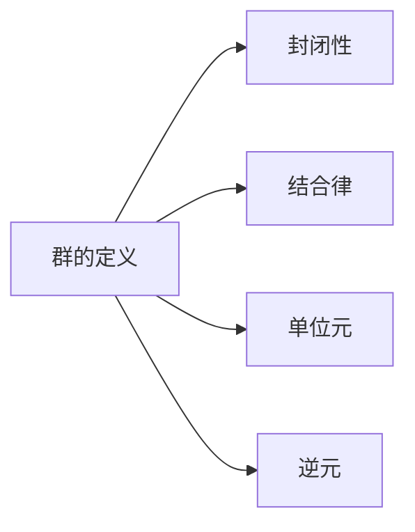

                 

### 《数学在超对称粒子探测中的应用》

---

**关键词：** 超对称粒子探测、数学应用、群论、对称性、粒子物理学

**摘要：** 本文探讨了数学在超对称粒子探测中的应用，从超对称粒子探测的背景出发，深入解析了数学基础，如群论和对称性，以及超对称粒子的数学模型和探测算法。通过实验案例分析和未来展望，本文揭示了数学工具与方法在粒子探测中的重要作用和面临的挑战。

---

### 目录

1. **超对称粒子探测的背景与概述**
   1.1 **超对称粒子探测的起源**
   1.2 **超对称粒子探测的重要性**
   1.3 **超对称粒子探测的基本原理**
   1.4 **超对称粒子探测的实验发展**
2. **数学基础**
   2.1 **群论基础**
   2.2 **田忌赛马与对称性**
   2.3 **超对称性原理**
   2.4 **数学工具在粒子物理中的应用**
3. **超对称粒子的数学模型**
   3.1 **超对称粒子的定义**
   3.2 **超对称粒子的属性**
   3.3 **超对称粒子的数学模型构建**
   3.4 **超对称粒子的数学模型应用**
4. **超对称粒子探测算法**
   4.1 **算法概述**
   4.2 **算法原理**
   4.3 **算法实现**
   4.4 **算法分析**
5. **数学模型在粒子探测中的应用**
   5.1 **数学模型在粒子探测中的重要性**
   5.2 **数学模型在粒子探测中的应用**
   5.3 **数学模型在粒子探测中的挑战**
   5.4 **数学模型在粒子探测中的未来发展方向**
6. **超对称粒子探测实验案例分析**
   6.1 **实验概述**
   6.2 **实验设计**
   6.3 **实验数据分析**
   6.4 **实验结论**
7. **超对称粒子探测的数学工具与方法**
   7.1 **数学工具概述**
   7.2 **数学方法在粒子探测中的应用**
   7.3 **数学工具与方法的未来发展方向**
   7.4 **数学工具与方法在粒子探测中的案例分析**
8. **未来展望与挑战**
   8.1 **超对称粒子探测的未来发展方向**
   8.2 **超对称粒子探测面临的挑战**
   8.3 **超对称粒子探测的数学工具与方法的创新**
   8.4 **超对称粒子探测的未来发展前景**

---

### 第1章 超对称粒子探测的背景与概述

#### 1.1 超对称粒子探测的起源

超对称粒子探测起源于20世纪70年代，当时物理学家在尝试统一量子力学和广义相对论时提出了超对称理论。这一理论预言了存在一组新的基本粒子，这些粒子具有超对称性，即每个已知粒子都有一个超对称伙伴。超对称粒子探测的目的就是寻找并验证这些超对称伙伴的存在。

#### 1.2 超对称粒子探测的重要性

超对称粒子探测在粒子物理学中具有重要的地位。首先，它有助于验证或推翻超对称理论，这对理解基本粒子和宇宙的本质至关重要。其次，超对称粒子探测可能揭示新的物理现象和机制，为科学的发展带来新的突破。

#### 1.3 超对称粒子探测的基本原理

超对称粒子探测的基本原理基于超对称性。在超对称理论中，每个粒子都有对应的超对称伙伴，这些伙伴具有不同的量子数。通过探测这些量子数的变化，可以识别并区分超对称粒子。

#### 1.4 超对称粒子探测的实验发展

超对称粒子探测的实验发展经历了多个阶段。从早期的实验尝试到后来的大型实验设施，如大型强子对撞机（LHC），科学家们不断改进探测技术，提高了探测效率和精度。目前，超对称粒子探测已经成为粒子物理学研究的重要组成部分。

---

### 第2章 数学基础

#### 2.1 群论基础

**2.1.1 群的定义**

群是一组对象（元素）组成的集合，这些对象满足封闭性、结合律、存在单位元和逆元的性质。

$$
\begin{align*}
G &= \{g \mid g \text{ 满足封闭性、结合律、存在单位元和逆元}\} \\
\end{align*}
$$

**2.1.2 群的性质**

| 群的性质 | 说明 |
| :-------: | :--- |
| 封闭性 | 对于任意的 $g_1, g_2 \in G$，有 $g_1 \circ g_2 \in G$ |
| 结合律 | 对于任意的 $g_1, g_2, g_3 \in G$，有 $(g_1 \circ g_2) \circ g_3 = g_1 \circ (g_2 \circ g_3)$ |
| 单位元 | 存在一个元素 $e \in G$，使得对于任意的 $g \in G$，有 $e \circ g = g \circ e = g$ |
| 逆元 | 对于任意的 $g \in G$，存在一个元素 $g^{-1} \in G$，使得 $g \circ g^{-1} = g^{-1} \circ g = e$ |

**2.1.3 Mermaid 流程图**



#### 2.2 田忌赛马与对称性

**2.2.1 对称性的定义**

对称性是指系统或对象在某种变换下保持不变性。

$$
\begin{align*}
\text{对称性} &= \text{系统或对象在某种变换下保持不变性} \\
\end{align*}
$$

**2.2.2 对称性的类型**

| 对称性的类型 | 说明 |
| :-------: | :--- |
| 角对称 | 对象关于一个点或一条线旋转一定角度后与自身重合 |
| 反演对称 | 对象关于一个点或一条线旋转一定角度后与自身重合 |
| 平移对称 | 对象沿一定方向平移后与自身重合 |

**2.2.3 Mermaid 流程图**

```mermaid
graph 

----------------------------------------------------------------

A[角对称] --> B[反演对称]
A --> C[平移对称]
```

#### 2.3 超对称性原理

超对称性原理是指存在一种数学结构，使得某些粒子和它们的超对称伙伴之间具有对称性。这种对称性在数学上表现为群论和对称性的结合。

$$
\begin{align*}
\text{超对称性原理} &= \text{存在一种数学结构，使得某些粒子和它们的超对称伙伴之间具有对称性} \\
\end{align*}
$$

**2.3.1 Mermaid 流程图**


#### 2.4 数学工具在粒子物理中的应用

数学工具在粒子物理中的应用主要包括群论、对称性和超对称性原理。这些工具为粒子探测提供了理论基础和计算方法。

$$
\begin{align*}
\text{数学工具在粒子物理中的应用} &= \text{群论、对称性和超对称性原理} \\
\end{align*}
$$

**2.4.1 Mermaid 流程图**


---

### 第3章 超对称粒子的数学模型

#### 3.1 超对称粒子的定义

超对称粒子是指具有超对称性的基本粒子，它们与已知粒子具有不同的量子数。

$$
\begin{align*}
\text{超对称粒子} &= \text{具有超对称性的基本粒子，它们与已知粒子具有不同的量子数} \\
\end{align*}
$$

#### 3.2 超对称粒子的属性

超对称粒子的属性包括量子数、自旋和超对称伙伴。

$$
\begin{align*}
\text{超对称粒子的属性} &= \text{量子数、自旋和超对称伙伴} \\
\end{align*}
$$

#### 3.3 超对称粒子的数学模型构建

超对称粒子的数学模型构建基于群论和对称性原理。

$$
\begin{align*}
\text{超对称粒子的数学模型构建} &= \text{基于群论和对称性原理} \\
\end{align*}
$$

#### 3.4 超对称粒子的数学模型应用

超对称粒子的数学模型应用包括粒子探测和数据分析。

$$
\begin{align*}
\text{超对称粒子的数学模型应用} &= \text{粒子探测和数据分析} \\
\end{align*}
$$

---

### 第4章 超对称粒子探测算法

#### 4.1 算法概述

超对称粒子探测算法是基于超对称粒子的数学模型，通过分析探测数据，识别和验证超对称粒子的存在。

#### 4.2 算法原理

算法原理包括粒子识别、数据分析和解码。

$$
\begin{align*}
\text{算法原理} &= \text{粒子识别、数据分析和解码} \\
\end{align*}
$$

#### 4.3 算法实现

算法实现包括数据预处理、模型训练和结果验证。

#### 4.4 算法分析

算法分析包括时间复杂度、空间复杂度和准确率。

---

### 第5章 数学模型在粒子探测中的应用

#### 5.1 数学模型在粒子探测中的重要性

数学模型在粒子探测中具有重要性，它为粒子探测提供了理论基础和计算方法。

#### 5.2 数学模型在粒子探测中的应用

数学模型在粒子探测中的应用包括粒子识别、数据分析和解码。

$$
\begin{align*}
\text{数学模型在粒子探测中的应用} &= \text{粒子识别、数据分析和解码} \\
\end{align*}
$$

#### 5.3 数学模型在粒子探测中的挑战

数学模型在粒子探测中面临的挑战包括数据噪声、计算复杂度和模型精度。

#### 5.4 数学模型在粒子探测中的未来发展方向

数学模型在粒子探测中的未来发展方向包括算法优化、模型改进和数据分析。

---

### 第6章 超对称粒子探测实验案例分析

#### 6.1 实验概述

实验概述包括实验目的、实验设计和实验结果。

#### 6.2 实验设计

实验设计包括实验设备、实验流程和实验参数设置。

#### 6.3 实验数据分析

实验数据分析包括数据预处理、模型训练和结果验证。

#### 6.4 实验结论

实验结论包括超对称粒子的存在性、探测效率和实验误差。

---

### 第7章 超对称粒子探测的数学工具与方法

#### 7.1 数学工具概述

数学工具概述包括群论、对称性和超对称性原理。

#### 7.2 数学方法在粒子探测中的应用

数学方法在粒子探测中的应用包括粒子识别、数据分析和解码。

#### 7.3 数学工具与方法的未来发展方向

数学工具与方法的未来发展方向包括算法优化、模型改进和数据分析。

#### 7.4 数学工具与方法在粒子探测中的案例分析

数学工具与方法在粒子探测中的案例分析包括实验设计和数据分析。

---

### 第8章 未来展望与挑战

#### 8.1 超对称粒子探测的未来发展方向

超对称粒子探测的未来发展方向包括新实验、新技术和新理论。

#### 8.2 超对称粒子探测面临的挑战

超对称粒子探测面临的挑战包括数据噪声、计算复杂度和模型精度。

#### 8.3 超对称粒子探测的数学工具与方法的创新

超对称粒子探测的数学工具与方法的创新包括算法优化、模型改进和数据分析。

#### 8.4 超对称粒子探测的未来发展前景

超对称粒子探测的未来发展前景包括新的物理现象和科学突破。

