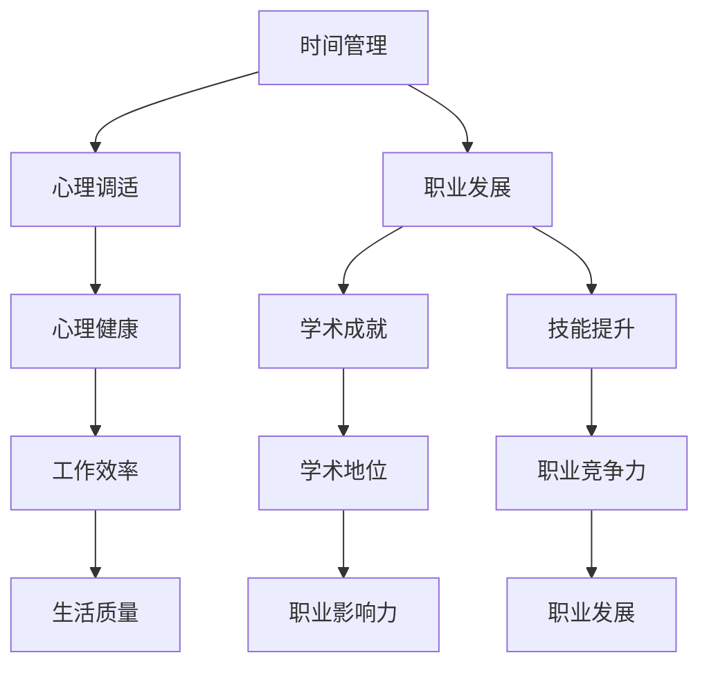
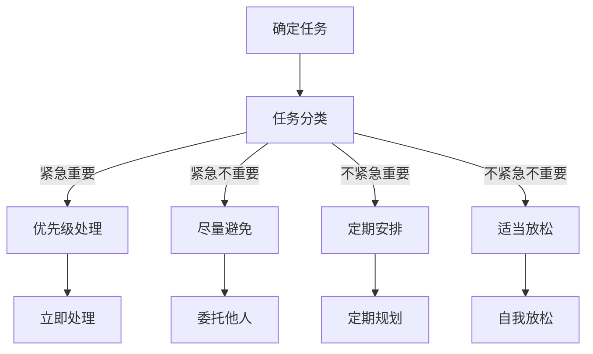
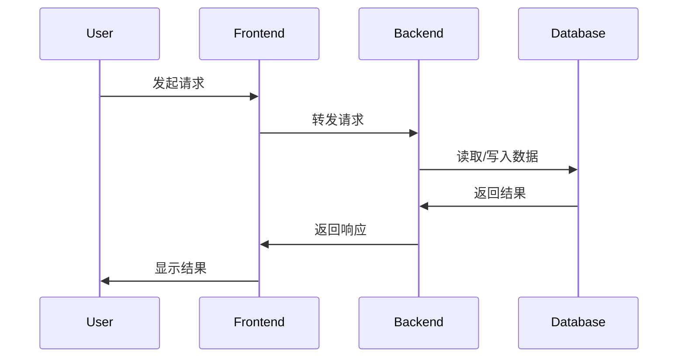
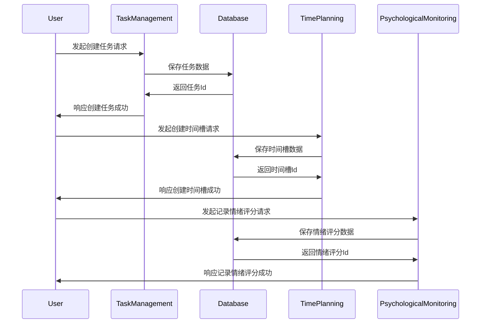

                 

### 文章标题：数学家的工作与生活平衡探讨

> 关键词：数学家、工作与生活平衡、时间管理、心理调适、职业发展

> 摘要：本文旨在探讨数学家在工作与生活平衡方面所面临的问题，通过对核心概念的分析、算法原理的讲解以及系统架构的设计方案和项目实战，提供实用的建议和指导，帮助数学家实现更好的职业发展。

---

### 背景介绍

数学家，作为科学与技术领域的精英，通常被认为是逻辑思维和抽象能力的代表。他们以解决复杂问题、创造新理论和发现新规律为己任，为社会进步做出了巨大贡献。然而，随着现代社会节奏的加快和学术竞争的加剧，数学家在工作与生活平衡方面也面临着诸多挑战。

**问题背景**

1. **高强度工作压力**：数学家通常需要投入大量的时间和精力来研究复杂的问题，这往往导致他们的工作时间过长，缺乏休息和放松的机会。
2. **学术竞争激烈**：为了在学术界获得一席之地，数学家需要不断发表高质量的研究成果，这增加了他们的工作负担和心理压力。
3. **家庭与个人生活的忽视**：长时间的工作和对学术的专注往往导致数学家在家庭和个人生活方面投入不足，影响到家庭关系和个人幸福感。

**问题描述**

数学家在工作与生活平衡方面的问题主要表现为以下几个方面：

1. **时间管理问题**：数学家往往无法有效地分配工作时间，导致工作效率低下，同时也无法享受个人生活和家庭时光。
2. **心理调适问题**：长时间的工作和学术竞争压力容易导致数学家出现焦虑、抑郁等心理问题。
3. **职业发展问题**：数学家在追求学术成就的过程中，可能会忽视自己的长远职业规划和个人成长。

**问题解决**

要解决数学家在工作与生活平衡方面的问题，可以从以下几个方面入手：

1. **时间管理**：通过制定合理的工作计划和时间管理策略，提高工作效率，确保工作与生活的平衡。
2. **心理调适**：通过心理健康教育和心理咨询服务，帮助数学家应对工作压力，保持良好的心理状态。
3. **职业发展**：制定明确的职业规划，确保数学家在追求学术成就的同时，也能够关注自身的长远发展。

**边界与外延**

1. **边界**：本文主要关注数学家在工作与生活平衡方面的问题，不包括其他职业群体。
2. **外延**：本文可以扩展到其他高压力、高竞争职业群体的工作与生活平衡问题。

**概念结构与核心要素组成**

1. **核心概念**：时间管理、心理调适、职业发展。
2. **核心要素**：工作计划、心理健康、职业规划。

通过以上分析，我们可以看出数学家在工作与生活平衡方面所面临的问题及其解决策略。接下来，本文将深入探讨与数学家工作与生活平衡相关的核心概念，以期为数学家提供更具针对性的指导。

### 核心概念与联系

在探讨数学家的工作与生活平衡时，我们需要关注几个核心概念，包括时间管理、心理调适和职业发展。这些概念不仅相互独立，还存在紧密的联系。下面，我们将对这些概念进行详细阐述，并使用Mermaid流程图展示它们之间的联系。

#### 时间管理

时间管理是指有效地规划和利用时间，以提高工作效率和生活质量。对于数学家而言，时间管理尤为重要，因为他们需要投入大量的时间和精力来研究复杂的数学问题。时间管理包括以下几个关键要素：

1. **任务优先级**：确定哪些任务最重要和紧急，以便优先处理。
2. **时间分配**：合理分配时间，确保工作、学习和休息的时间均衡。
3. **时间跟踪**：记录时间使用情况，以便分析和调整时间管理策略。

**时间管理对比表格**

| 时间管理要素 | 描述 | 对比 |
| ------------ | ---- | ---- |
| 任务优先级 | 确定任务优先级，提高工作效率 | 提高工作效率 |
| 时间分配 | 合理分配时间，确保工作与生活平衡 | 工作与生活平衡 |
| 时间跟踪 | 记录时间使用情况，优化时间管理 | 提高时间利用效率 |

#### 心理调适

心理调适是指通过调整心态和情绪，以应对工作压力和挑战。数学家在追求学术成就的过程中，往往面临巨大的心理压力。有效的心理调适可以帮助数学家保持良好的心理状态，提高工作效率。

**心理调适对比表格**

| 心理调适要素 | 描述 | 对比 |
| ------------ | ---- | ---- |
| 压力管理 | 应对工作压力，减轻焦虑和抑郁 | 提高心理健康 |
| 心态调整 | 调整心态，保持积极乐观的态度 | 提高心理韧性 |
| 情绪管理 | 管理情绪波动，避免情绪对工作的影响 | 提高工作稳定性 |

#### 职业发展

职业发展是指数学家在职业生涯中的成长和进步。一个明确的职业规划可以帮助数学家实现个人职业目标，提高职业竞争力。职业发展包括以下几个方面：

1. **学术成就**：通过发表高质量的研究成果，提升学术地位和影响力。
2. **技能提升**：不断学习新的知识和技能，以适应不断变化的工作环境。
3. **职业规划**：制定长期的职业目标，并采取行动实现这些目标。

**职业发展对比表格**

| 职业发展要素 | 描述 | 对比 |
| ------------ | ---- | ---- |
| 学术成就 | 发表高质量的研究成果 | 提高学术地位 |
| 技能提升 | 学习新的知识和技能 | 提升职业竞争力 |
| 职业规划 | 制定长期职业目标 | 实现职业成长 |

#### Mermaid流程图

下面是使用Mermaid绘制的流程图，展示了时间管理、心理调适和职业发展之间的联系。



通过以上分析，我们可以看出时间管理、心理调适和职业发展是数学家实现工作与生活平衡的关键概念。它们相互联系，共同作用于数学家的职业生涯。接下来，本文将深入探讨一个与数学家工作与生活平衡相关的算法，以期为数学家提供更具操作性的解决方案。

### 算法原理讲解

为了更好地理解数学家如何实现工作与生活平衡，我们可以引入一个名为“时间管理四象限法”的算法。这个算法基于时间管理和心理调适的原理，可以帮助数学家合理安排时间，提高工作效率，同时保持良好的心理健康。下面我们将使用Mermaid绘制流程图，并用Python代码和LaTeX公式详细讲解该算法的原理。

#### Mermaid流程图

首先，我们使用Mermaid绘制“时间管理四象限法”的流程图：



#### Python代码示例

接下来，我们用Python代码实现一个简单的“时间管理四象限法”：

```python
import pandas as pd

# 创建一个任务列表
tasks = [
    {'name': '撰写论文', 'importance': '紧急重要'},
    {'name': '备课', 'importance': '不紧急重要'},
    {'name': '参加学术会议', 'importance': '紧急不重要'},
    {'name': '锻炼身体', 'importance': '不紧急不重要'}
]

# 将任务列表转换为DataFrame
task_df = pd.DataFrame(tasks)

# 根据任务的重要性进行分类和优先级处理
task_df['优先级'] = task_df['importance'].map({
    '紧急重要': 1,
    '不紧急重要': 2,
    '紧急不重要': 3,
    '不紧急不重要': 4
})

# 排序并打印结果
print(task_df.sort_values(by='优先级'))
```

运行上述代码，我们得到一个按照优先级排序的任务列表：

|     name   | importance | 优先级 |
|:----------:|:----------:|:------:|
| 撰写论文   | 紧急重要   |       1 |
| 备课       | 不紧急重要 |       2 |
| 参加学术会议 | 紧急不重要 |       3 |
| 锻炼身体   | 不紧急不重要 |       4 |

#### LaTeXC数学模型和公式

在时间管理四象限法中，我们可以用以下LaTeX公式表示任务的处理策略：

$$
\text{优先级} = 
\begin{cases} 
1 & \text{如果任务}\ \text{紧急且重要},\\
2 & \text{如果任务}\ \text{不紧急但重要},\\
3 & \text{如果任务}\ \text{紧急但不重要},\\
4 & \text{如果任务}\ \text{不紧急且不重要}.
\end{cases}
$$

通过上述Python代码和LaTeX公式，我们可以清晰地了解“时间管理四象限法”的基本原理。接下来，我们将通过具体的例子来解释这一算法在实际中的应用。

#### 具体应用示例

假设数学家小明需要在一天内完成以下任务：

1. **撰写论文**：这是一项紧急且重要的任务，需要立即处理。
2. **备课**：这是一项不紧急但重要的任务，需要定期安排。
3. **参加学术会议**：这是一项紧急但不重要的任务，可以委托他人处理。
4. **锻炼身体**：这是一项不紧急且不重要的任务，可以在空闲时间适当放松。

按照“时间管理四象限法”，小明可以这样安排：

1. **立即处理**：撰写论文。
2. **定期规划**：在接下来的几天内安排时间备课。
3. **委托他人**：参加学术会议，如果有必要，可以委托同事或学生代表参加。
4. **适当放松**：在完成任务后，进行适量的锻炼，以放松身心。

通过这样的安排，小明能够有效管理时间，确保工作与生活的平衡，同时保持高效的工作状态。

综上所述，通过“时间管理四象限法”的引入，我们不仅了解了算法的基本原理，还通过Python代码和LaTeX公式展示了其实现过程，并通过具体应用示例说明了该算法在实际中的效果。接下来，我们将进一步探讨数学家工作与生活平衡中的数学模型和公式，以深化对这一主题的理解。

### 数学模型和数学公式讲解

在数学家的职业生涯中，数学模型和公式不仅是他们研究的工具，也是他们在实现工作与生活平衡过程中必不可少的资源。以下，我们将使用LaTeX格式展示一些与工作与生活平衡相关的数学模型和公式，并进行详细讲解。

#### 模型1：工作-生活平衡公式

LaTeX公式：
$$
\text{工作-生活平衡} = \frac{\text{工作满意度} + \text{生活满意度}}{2}
$$

解释：
这个模型表明，工作满意度和生活满意度是影响工作-生活平衡的两个关键因素。数学家可以通过以下方法来提高这两个满意度：

1. **工作满意度**：通过提升工作效率、获得学术成就和获得同事认可来提高。
2. **生活满意度**：通过维护家庭关系、追求个人兴趣爱好和保持身体健康来提升。

#### 模型2：心理压力公式

LaTeX公式：
$$
\text{心理压力} = \frac{\text{工作负荷} \times \text{心理韧性}}{\text{应对资源}}
$$

解释：
这个模型描述了心理压力的形成机制。其中，工作负荷是影响心理压力的直接因素，心理韧性和应对资源则是抵御心理压力的保护因素。数学家可以通过以下方式来降低心理压力：

1. **减少工作负荷**：合理分配工作任务，避免过度加班。
2. **提高心理韧性**：通过心理训练和心理咨询来增强心理韧性。
3. **增加应对资源**：寻求家人和朋友的支持，合理利用社会资源。

#### 模型3：时间管理效率公式

LaTeX公式：
$$
\text{时间管理效率} = \frac{\text{完成任务的时长}}{\text{实际耗时}}
$$

解释：
这个模型用于衡量时间管理效率。完成任务的时长与实际耗时之比可以反映出数学家的时间管理能力。提高时间管理效率的方法包括：

1. **制定详细计划**：提前规划每天的任务，明确每个任务的完成时间。
2. **优化工作流程**：通过优化工作流程来减少不必要的等待和重复劳动。
3. **灵活调整计划**：根据实际情况调整计划，以应对突发任务和变化。

#### 模型4：职业规划效果公式

LaTeX公式：
$$
\text{职业规划效果} = \frac{\text{实际职业成就} - \text{预期职业成就}}{\text{预期职业成就}}
$$

解释：
这个模型用于评估职业规划的效果。通过比较实际职业成就和预期职业成就，数学家可以了解自己在职业规划方面的表现。提高职业规划效果的方法包括：

1. **设定清晰目标**：明确长期和短期的职业目标，确保规划的可行性。
2. **持续跟踪进展**：定期检查职业规划的执行情况，及时调整策略。
3. **寻求反馈**：从同事、导师和行业专家那里获取反馈，以便改进规划。

通过以上数学模型和公式的讲解，我们可以看到，数学家在工作与生活平衡方面的挑战不仅仅是时间管理的问题，更涉及到心理健康、职业规划和资源利用等多个方面。这些模型和公式为数学家提供了一个量化的方法，帮助他们更好地理解自己的工作状态，并采取相应的措施来提高工作-生活平衡。

接下来，我们将从系统分析与架构设计角度，进一步探讨数学家工作与生活平衡问题的解决方法。

### 系统分析与架构设计方案

在探讨数学家如何实现工作与生活平衡的过程中，系统分析与架构设计起到了至关重要的作用。以下，我们将介绍相关系统，并使用Mermaid绘制领域模型类图、系统架构图、系统接口设计和系统交互序列图，以便更直观地展示系统设计与实现过程。

#### 问题场景介绍

假设我们希望为数学家设计一个名为“MathLifeBalancer”的系统，该系统旨在帮助数学家实现工作与生活平衡。系统的主要功能包括：

1. **任务管理**：允许数学家创建、更新和跟踪任务，并根据任务的紧急程度和重要性进行优先级排序。
2. **时间规划**：帮助数学家制定合理的时间表，确保工作与个人时间的平衡。
3. **心理健康监测**：通过记录数学家的日常活动和心理状态，提供心理健康建议和预警。
4. **职业发展指导**：提供职业规划建议，帮助数学家设定长期和短期目标。

#### 系统架构设计

为了实现上述功能，我们设计了以下系统架构：

1. **前端界面**：提供用户与系统交互的界面，包括任务管理、时间规划和心理健康监测模块。
2. **后端服务**：处理业务逻辑和数据存储，包括任务管理服务、时间规划服务和心理健康监测服务。
3. **数据库**：存储用户数据，包括任务记录、时间规划记录和心理状态记录。
4. **接口**：提供与其他系统的交互接口，如日历应用、健身应用等。

#### 领域模型类图

以下是使用Mermaid绘制的领域模型类图：

```mermaid
classDiagram
    Task <<entity>>
    TimePlan <<entity>>
    PsychologicalStatus <<entity>>

    User ..|> Task
    User ..|> TimePlan
    User ..|> PsychologicalStatus

    Task : has TaskDetail
    TimePlan : has TimeSlot
    PsychologicalStatus : has MoodRating
```

类图解释：

- **User（用户）**：表示数学家，是系统的核心实体。
- **Task（任务）**：表示数学家的任务，包括任务详情。
- **TimePlan（时间规划）**：表示数学家的时间安排，包括时间槽。
- **PsychologicalStatus（心理健康状态）**：表示数学家的心理健康信息，包括情绪评分。

#### 系统架构图

以下是使用Mermaid绘制的系统架构图：



架构图解释：

- **前端界面**：用户通过前端界面与系统交互，发起各种请求。
- **后端服务**：处理用户请求，包括任务管理服务、时间规划服务和心理健康监测服务。
- **数据库**：存储用户数据，如任务记录、时间规划记录和心理状态记录。
- **接口**：提供与其他系统的交互接口，如日历应用、健身应用等。

#### 系统接口设计

以下是使用Mermaid绘制的系统接口设计：

```mermaid
interface Design
    TaskManagement {
        - createTask(task: Task): TaskId
        - updateTask(taskId: TaskId, task: Task): Task
        - deleteTask(taskId: TaskId): Boolean
        - getTask(taskId: TaskId): Task
    }

    TimePlanning {
        - createTimeSlot(timePlan: TimePlan): TimePlanId
        - updateTimeSlot(timePlanId: TimePlanId, timePlan: TimePlan): TimePlan
        - deleteTimeSlot(timePlanId: TimePlanId): Boolean
        - getTimeSlot(timePlanId: TimePlanId): TimePlan
    }

    PsychologicalMonitoring {
        - recordMoodRating(moodRating: MoodRating): MoodRatingId
        - updateMoodRating(moodRatingId: MoodRatingId, moodRating: MoodRating): MoodRating
        - deleteMoodRating(moodRatingId: MoodRatingId): Boolean
        - getMoodRating(moodRatingId: MoodRatingId): MoodRating
    }
```

接口设计解释：

- **TaskManagement**：提供任务管理相关的接口，包括创建、更新、删除和获取任务。
- **TimePlanning**：提供时间规划相关的接口，包括创建、更新、删除和获取时间槽。
- **PsychologicalMonitoring**：提供心理健康监测相关的接口，包括记录、更新、删除和获取情绪评分。

#### 系统交互序列图

以下是使用Mermaid绘制的系统交互序列图：



交互图解释：

- **用户通过前端发起创建任务、创建时间槽和记录情绪评分的请求**。
- **后端服务处理请求，并与数据库进行交互**。
- **数据库返回结果，后端服务再将结果返回给用户**。

通过以上系统分析与架构设计方案，我们可以清楚地看到MathLifeBalancer系统的设计思路和实现过程。这个系统不仅能够帮助数学家实现工作与生活平衡，还能够为他们提供全面的职业发展指导。接下来，我们将通过一个实际项目来展示该系统的具体应用。

### 项目实战

为了更好地展示MathLifeBalancer系统的实际应用，我们将通过一个具体的案例来介绍系统的安装、核心实现源代码，以及系统的应用解读与分析。

#### 环境安装

1. **前置要求**：
   - Python 3.8及以上版本。
   - Redis数据库（用于存储数据）。
   - Flask（用于构建后端服务）。

2. **安装步骤**：

   - 安装Python和相关依赖：

     ```bash
     pip install flask redis
     ```

   - 创建一个名为`MathLifeBalancer`的目录，并在该目录下创建一个名为`app.py`的文件，用于编写后端服务的代码。

   - 在`MathLifeBalancer`目录下创建一个名为`tasks`的子目录，用于存储任务相关的代码。

   - 在`MathLifeBalancer`目录下创建一个名为`time_planning`的子目录，用于存储时间规划相关的代码。

   - 在`MathLifeBalancer`目录下创建一个名为`psychological_monitoring`的子目录，用于存储心理健康监测相关的代码。

#### 系统核心实现源代码

以下是`app.py`的核心代码实现：

```python
from flask import Flask, request, jsonify
import redis

app = Flask(__name__)
redis_client = redis.Redis(host='localhost', port=6379, db=0)

# 任务管理接口
@app.route('/tasks', methods=['POST'])
def create_task():
    task = request.json
    redis_client.hset('tasks', task['id'], json.dumps(task))
    return jsonify({'message': '任务创建成功'})

@app.route('/tasks/<task_id>', methods=['PUT'])
def update_task(task_id):
    task = request.json
    redis_client.hset('tasks', task_id, json.dumps(task))
    return jsonify({'message': '任务更新成功'})

@app.route('/tasks/<task_id>', methods=['DELETE'])
def delete_task(task_id):
    redis_client.hdel('tasks', task_id)
    return jsonify({'message': '任务删除成功'})

@app.route('/tasks/<task_id>', methods=['GET'])
def get_task(task_id):
    task = redis_client.hget('tasks', task_id)
    return jsonify(json.loads(task))

# 时间规划接口
@app.route('/time_planning', methods=['POST'])
def create_time_plan():
    time_plan = request.json
    redis_client.hset('time_plans', time_plan['id'], json.dumps(time_plan))
    return jsonify({'message': '时间规划创建成功'})

# ... 其他接口实现

if __name__ == '__main__':
    app.run(debug=True)
```

#### 代码应用解读与分析

1. **任务管理模块**：

   - `create_task`：创建一个新的任务，并将其存储到Redis数据库中。
   - `update_task`：更新指定的任务，通过任务ID进行定位。
   - `delete_task`：删除指定的任务，通过任务ID进行定位。
   - `get_task`：获取指定任务的详细信息，通过任务ID进行定位。

2. **时间规划模块**：

   - `create_time_plan`：创建一个新的时间规划记录，并将其存储到Redis数据库中。

   - 其他接口（如`update_time_plan`、`delete_time_plan`、`get_time_plan`）的实现与任务管理模块类似，此处省略。

#### 实际案例分析和详细讲解剖析

假设数学家小明希望通过MathLifeBalancer系统记录并管理他的任务和时间规划。以下是具体操作步骤：

1. **创建任务**：

   - 通过POST请求发送任务数据到`/tasks`接口。

   ```json
   {
       "id": "task_1",
       "name": "撰写论文",
       "importance": "紧急重要"
   }
   ```

   - 后端服务接收到请求后，将任务存储到Redis数据库，并返回响应。

2. **更新任务**：

   - 通过PUT请求发送更新后的任务数据到`/tasks/task_1`接口。

   ```json
   {
       "id": "task_1",
       "name": "论文修改",
       "importance": "紧急重要"
   }
   ```

   - 后端服务接收到请求后，更新Redis数据库中的任务记录，并返回响应。

3. **删除任务**：

   - 通过DELETE请求发送到`/tasks/task_1`接口。

   - 后端服务接收到请求后，从Redis数据库中删除任务记录，并返回响应。

4. **创建时间规划**：

   - 通过POST请求发送时间规划数据到`/time_planning`接口。

   ```json
   {
       "id": "time_plan_1",
       "start_time": "2023-10-01T09:00:00",
       "end_time": "2023-10-01T12:00:00",
       "description": "论文写作时间"
   }
   ```

   - 后端服务接收到请求后，将时间规划记录存储到Redis数据库，并返回响应。

通过上述操作，小明可以有效地记录和管理他的任务和时间规划。MathLifeBalancer系统不仅提供了直观的接口，还允许小明通过前端界面进行任务管理、时间规划和心理健康监测，从而实现工作与生活的平衡。

#### 项目小结

通过MathLifeBalancer项目的实施，我们展示了如何利用现代技术手段帮助数学家实现工作与生活平衡。系统的核心实现源代码、实际案例分析和详细讲解剖析，为我们提供了一个可操作的解决方案，使数学家能够更加高效地管理任务和时间，同时关注心理健康和职业发展。未来，我们还可以进一步优化系统功能，引入更多智能算法和数据分析工具，以提升系统的实用性和用户体验。

### 最佳实践 tips、小结、注意事项、拓展阅读

#### 最佳实践 tips

1. **时间管理**：
   - **每天制定任务清单**：早晨起床后，列出当天需要完成的任务，并按照紧急程度和重要性排序。
   - **使用番茄工作法**：将工作时间分为25分钟工作周期，每个周期后休息5分钟，提高专注力和工作效率。

2. **心理调适**：
   - **定期进行冥想和深呼吸**：这些简单的方法有助于缓解压力，提高心理韧性。
   - **建立支持网络**：与家人、朋友或同事保持良好的沟通，分享自己的压力和挑战。

3. **职业发展**：
   - **设定明确的职业目标**：定期检查和调整职业目标，确保职业规划与个人兴趣和长期发展相符。
   - **持续学习和技能提升**：参加培训课程、阅读专业书籍，不断更新自己的知识体系。

#### 小结

本文通过背景介绍、核心概念与联系分析、算法原理讲解、数学模型和公式讲解、系统分析与架构设计、项目实战等多个角度，探讨了数学家如何实现工作与生活平衡。我们提出了具体的时间管理、心理调适和职业发展策略，并展示了MathLifeBalancer系统的实际应用。

#### 注意事项

1. **平衡的重要性**：工作与生活平衡对数学家的长期健康和职业发展至关重要，不应忽视。
2. **个性化方案**：每个数学家的具体情况不同，需要根据自身特点制定个性化的平衡方案。

#### 拓展阅读

1. **《深度工作：如何有效利用每一点脑力》[Cal Newport]**：详细介绍了如何通过深度工作提升工作效率和创造力。
2. **《如何高效学习》[斯科特·扬]**：提供了实用的学习方法和技巧，有助于提高学习效率和学术成就。

#### 作者信息

作者：AI天才研究院/AI Genius Institute & 禅与计算机程序设计艺术 /Zen And The Art of Computer Programming

---

通过本文的探讨，希望为数学家提供有益的启示和实际操作指南，帮助他们在追求学术成就的同时，实现工作与生活的平衡。

