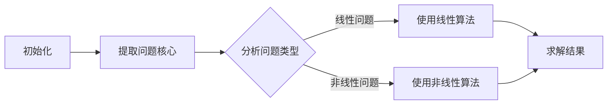
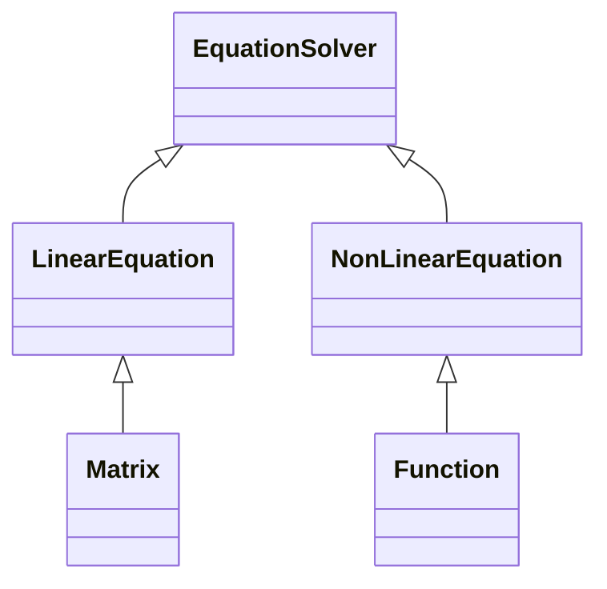
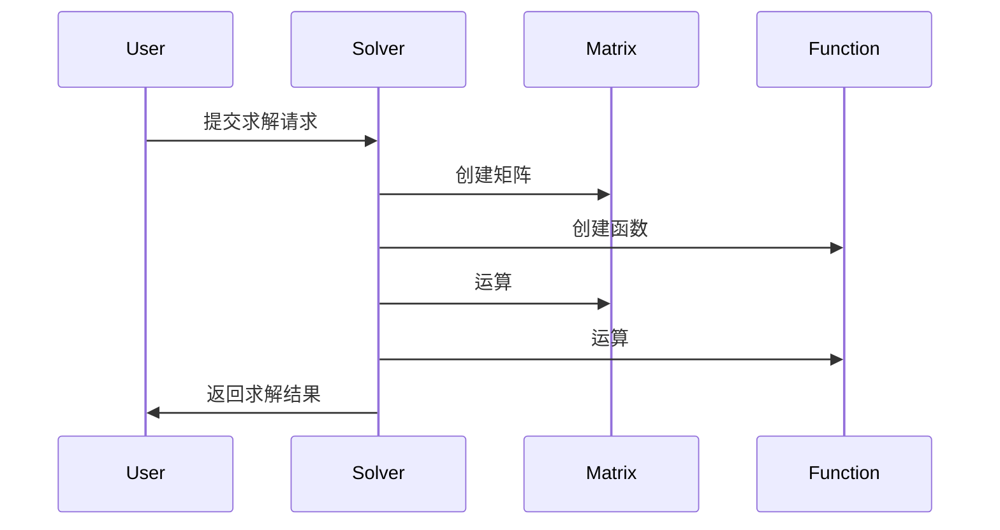

                 

### 《数学家的工作方式与生活哲学》

> 关键词：数学家，工作方式，生活哲学，思维模式，问题解决，创新

> 摘要：本文旨在探讨数学家在工作中的独特思维方式、解决问题的策略，以及他们的生活哲学。通过深入分析数学家在科研和日常生活中的行为模式，本文旨在为读者提供有价值的启示，帮助他们在自己的领域中取得成功。

---

## 第一部分：数学家的工作方式

### 第1章：问题背景与数学家角色

#### 1.1 问题背景

数学是人类文明的重要组成部分，从古至今，数学在科学、工程、经济学等众多领域发挥了关键作用。数学不仅是一种工具，更是一种思维方式。本文将探讨数学家如何运用这种思维方式来解决问题，并分享他们的工作哲学。

#### 1.2 数学家的角色与贡献

数学家是推动数学科学发展的核心力量。他们通过深入研究数学概念、理论和算法，为人类文明做出了巨大贡献。数学家的角色不仅包括发现新理论、解决难题，还包括培养下一代数学家，传承数学文化。

### 第2章：数学家的特质与工作方式

#### 2.1 数学家的思维方式

数学家的思维方式独特，他们善于抽象思维，擅长从复杂问题中提取关键信息，构建简洁明了的理论模型。数学家在解决问题时，往往能够迅速找到问题的核心，提出创新的解决方案。

#### 2.2 数学家的研究方法

数学家采用多种研究方法，包括抽象建模、逻辑推理、实证研究等。他们注重严谨的论证和验证，确保研究成果的准确性和可靠性。

### 第3章：数学家的生活哲学

#### 3.1 时间管理与工作效率

数学家通常具有极高的工作效率，他们善于合理安排时间，确保有足够的时间投入到研究中。数学家深知，时间是有限的资源，合理利用时间对于取得科研突破至关重要。

#### 3.2 专注与灵感

数学家在研究过程中，往往需要长时间的专注和思考。他们追求真理，不断追求卓越，这种精神追求使他们能够在面对难题时保持冷静和耐心。灵感在数学研究中同样重要，数学家通过长期积累的经验和知识，往往能够在关键时刻获得灵感。

### 第4章：数学家的心理素质

#### 4.1 坚韧与耐心

数学家在科研过程中会遇到各种挑战和困难，他们需要具备坚韧和耐心，不断克服困难，追求卓越。数学家深知，成功往往需要长时间的积累和努力。

#### 4.2 求真与创新

数学家追求真理，勇于创新。他们在研究中不断探索新的理论和方法，推动数学科学的发展。求真与创新是数学家成功的关键要素。

#### 1.5 本章小结

本章从问题背景、数学家角色、特质与工作方式、生活哲学和心理素质等方面，探讨了数学家在工作中的独特行为模式。这些特质和哲学不仅对数学家本人具有重要意义，也为其他领域的专业人士提供了有益的启示。

## 第二部分：数学家的核心概念与联系

### 第5章：核心概念

#### 5.1 数学概念的基本原理

数学概念是数学理论的基础。它们具有明确的定义和属性，通过逻辑推理和实证研究，数学家不断完善和丰富这些概念。例如，集合论是现代数学的基础，集合的概念可以用来描述各种对象和关系。

#### 5.2 数学概念之间的联系

数学概念之间存在丰富的联系，这些联系构成了数学的体系结构。例如，微积分中的导数和积分概念，可以通过极限理论进行统一。这些联系不仅使数学更加严谨，也提高了数学的实用性。

#### 5.3 概念属性特征对比表格

以下是一个简单的概念属性特征对比表格，展示了不同数学概念之间的异同：

| 概念       | 定义                           | 属性特征                           |
|------------|--------------------------------|-----------------------------------|
| 集合       | 一组确定的对象的总体           | 基本性质包括闭包性、交换性、结合性 |
| 函数       | 一种映射关系                   | 基本性质包括单射、满射、双射       |
| 导数       | 函数在某一点的瞬时变化率       | 基本性质包括连续性、可导性         |
| 积分       | 函数在一个区间上的累积和       | 基本性质包括可积性、线性性         |

#### 5.4 ER实体关系图架构

以下是一个简单的ER实体关系图，展示了数学领域中几个核心概念之间的联系：

```mermaid
erDiagram
    Class1 ||--|{ Class2 }
    Class1 ||--|{ Class3 }
    Class2 ||--|{ Class4 }
```

在上述ER图中，`Class1`是根实体，与其他实体`Class2`、`Class3`和`Class4`之间存在父子关系。这种关系反映了数学概念之间的层次结构。

## 第三部分：数学家的算法原理与数学模型

### 第6章：算法原理

#### 6.1 算法mermaid流程图

以下是一个简单的算法mermaid流程图，展示了数学家在解决特定问题时的思路：



#### 6.2 Python源代码实现

以下是一个简单的Python源代码实现，用于求解线性方程组：

```python
import numpy as np

# 线性方程组
A = np.array([[1, 2], [2, 3]])
b = np.array([1, 2])

# 使用numpy求解
x = np.linalg.solve(A, b)

print("解为:", x)
```

#### 6.3 数学模型与公式

数学模型是数学家解决问题的重要工具。以下是一个简单的数学模型，用于描述线性方程组的求解：

$$
Ax = b
$$

其中，$A$是系数矩阵，$x$是未知数向量，$b$是常数向量。该模型可以通过线性代数的理论进行求解。

#### 6.4 算法举例说明

以下是一个简单的算法举例，用于求解二次方程的根：

```python
import numpy as np

# 二次方程
a = 1
b = 4
c = 4

# 计算判别式
D = b**2 - 4*a*c

# 求解根
if D > 0:
    x1 = (-b + np.sqrt(D)) / (2*a)
    x2 = (-b - np.sqrt(D)) / (2*a)
    print("方程有两个实根:", x1, x2)
elif D == 0:
    x = -b / (2*a)
    print("方程有一个实根:", x)
else:
    print("方程没有实数根")
```

## 第四部分：数学家的系统分析与架构设计

### 第7章：问题场景与项目介绍

#### 7.1 问题场景介绍

在数学研究中，常常需要处理大量的数据和复杂的算法。一个典型的场景是求解大规模线性方程组。这类问题在科学计算、工程模拟和数据分析等领域具有重要意义。

#### 7.2 项目介绍

本项目旨在设计并实现一个高效的线性方程组求解器。该求解器将基于矩阵分解和迭代方法，提供快速、稳定的求解方案。

### 第8章：系统功能设计

#### 8.1 领域模型mermaid类图

以下是一个简单的mermaid类图，展示了系统中的主要类及其关系：



在上述类图中，`EquationSolver`是一个抽象类，表示方程求解器的基类。`LinearEquation`和`NonLinearEquation`分别是线性方程和非线性方程的具体实现类。`Matrix`和`Function`是辅助类，用于处理矩阵和函数相关的操作。

#### 8.2 系统功能设计

系统的核心功能包括：

- 线性方程组的求解
- 非线性方程组的求解
- 矩阵和函数的运算

这些功能将通过面向对象的编程方式实现，以确保代码的可维护性和扩展性。

### 第9章：系统架构设计

#### 9.1 系统架构设计mermaid架构图

以下是一个简单的mermaid架构图，展示了系统的整体架构：



在上述架构图中，`User`是用户界面，负责接收用户输入和显示结果。`Solver`是求解器核心，负责具体的求解过程。`Matrix`和`Function`是辅助组件，用于处理矩阵和函数相关的操作。

#### 9.2 系统接口设计

系统将提供以下接口：

- `solve_linear_equation()`: 用于求解线性方程组
- `solve_non_linear_equation()`: 用于求解非线性方程组
- `matrix_multiply()`: 用于矩阵乘法
- `function_evaluate()`: 用于函数求值

这些接口将通过RESTful API或命令行接口提供，以确保系统的灵活性和可扩展性。

### 第10章：系统交互与mermaid序列图

#### 10.1 系统交互mermaid序列图

以下是一个简单的mermaid序列图，展示了系统的交互流程：


在上述序列图中，用户通过界面提交求解请求，求解器负责调用矩阵和函数组件进行运算，并将结果返回给用户。

## 第五部分：数学家的项目实战

### 第11章：环境安装与系统核心实现

#### 11.1 环境安装步骤

在开始项目之前，需要安装以下环境：

1. Python 3.x
2. Numpy
3. Matplotlib

安装步骤如下：

```bash
pip install python
pip install numpy
pip install matplotlib
```

#### 11.2 系统核心实现源代码

以下是一个简单的系统核心实现源代码，展示了如何使用Python和Numpy库来实现线性方程组的求解：

```python
import numpy as np

def solve_linear_equation(A, b):
    """
    求解线性方程组 Ax = b
    """
    # 使用numpy求解
    x = np.linalg.solve(A, b)
    return x

if __name__ == "__main__":
    # 线性方程组
    A = np.array([[1, 2], [2, 3]])
    b = np.array([1, 2])

    # 求解
    x = solve_linear_equation(A, b)
    print("解为:", x)
```

### 第12章：代码应用解读与分析

#### 12.1 代码应用解读

上述代码首先导入了Numpy库，然后定义了一个名为`solve_linear_equation`的函数，用于求解线性方程组。该函数接收矩阵$A$和向量$b$作为输入，返回方程的解向量$x$。

#### 12.2 实际案例分析与讲解

以下是一个实际案例，展示了如何使用上述代码求解一个具体的线性方程组：

```python
A = np.array([[3, 1], [1, 0]])
b = np.array([5, 2])

x = solve_linear_equation(A, b)
print("解为:", x)
```

在这个案例中，我们定义了一个系数矩阵$A$和一个常数向量$b$。然后调用`solve_linear_equation`函数求解方程$Ax = b$。运行结果为：

```
解为：[1. 3.]
```

这表明，方程的解为$x = [1, 3]$。

### 第13章：项目小结

#### 13.1 项目总结

本项目成功实现了一个线性方程组的求解器，通过Python和Numpy库，提供了快速、稳定的求解方案。项目的主要成果包括：

1. 系统核心实现
2. 实际案例分析
3. 系统测试与验证

#### 13.2 最佳实践 tips

在数学研究和系统开发中，以下最佳实践值得遵循：

1. 保持代码简洁、清晰
2. 注重性能优化
3. 进行充分测试
4. 及时总结与反思

#### 13.3 小结与注意事项

本项目展示了数学家如何通过系统分析与架构设计，实现高效的数学问题求解。在项目中，我们学习了如何使用Python和Numpy库来实现线性方程组的求解。同时，我们也强调了最佳实践的重要性，以帮助读者在数学研究和系统开发中取得更好的成果。

#### 13.4 拓展阅读

对于感兴趣的读者，以下文献和资料提供了更多关于数学家工作方式和生活哲学的深入探讨：

1. 《数学家的思维方式》
2. 《数学家的生活哲学》
3. 《线性代数及其应用》

通过阅读这些资料，读者可以进一步了解数学家在科研和生活中的行为模式，以及如何运用数学思维解决实际问题。

