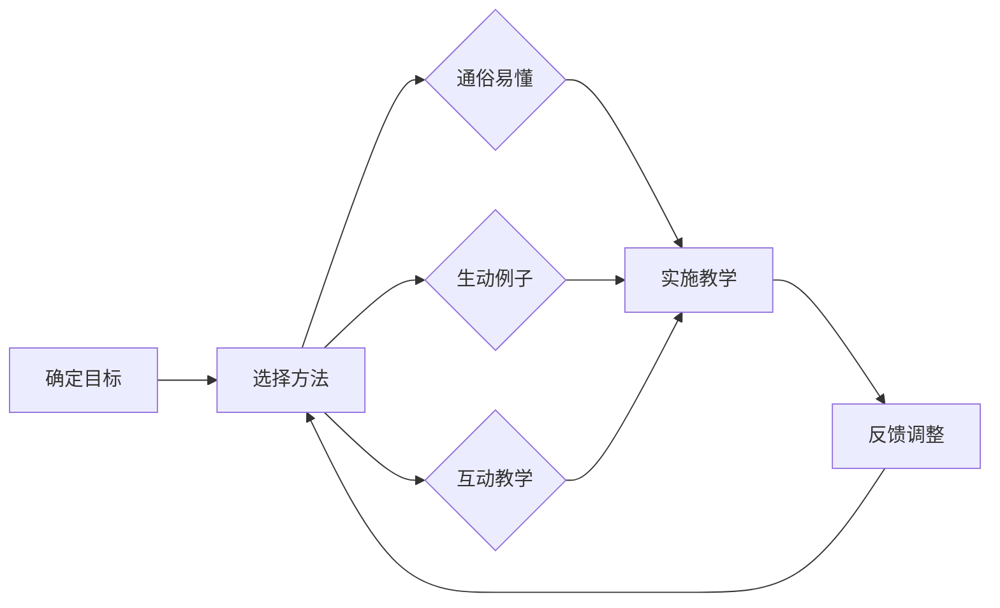
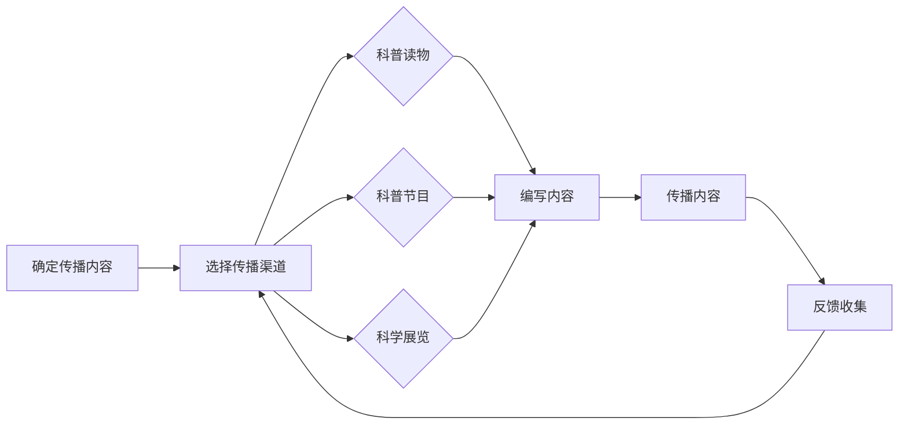

                 

### 文章标题

> 关键词：数学普及、科学传播、数学家、教育方法、互动性、科普读物

> 摘要：本文深入探讨了数学家的数学普及与科学传播的重要性，通过分析问题背景、核心概念原理、算法原理讲解等多个方面，详细阐述了数学家在推动数学知识普及和科学传播中的角色和作用。文章旨在为读者提供一种全新的理解和认识数学的方法，激发对数学的热爱和探索。

----------------------------------------------------------------

### 背景介绍

#### 数学普及的重要性

数学，作为一门抽象而严谨的科学，在现代社会中扮演着至关重要的角色。然而，对于大多数人来说，数学不仅仅是一门学科，更是一种思维的训练和逻辑的锻炼。数学知识的普及不仅有助于提高公众的科学素养，还能够培养人们的逻辑思维和解决问题的能力。

数学普及的重要性主要体现在以下几个方面：

1. **提高科学素养**：数学作为自然科学的基础，其知识的普及有助于提高公众的科学素养，使人们更好地理解和运用科学知识。

2. **培养逻辑思维**：数学强调逻辑推理和证明，通过数学的学习，人们可以培养严谨的逻辑思维能力和解决问题的能力。

3. **促进创新与发展**：数学知识的普及能够激发创新思维，推动科学技术的进步和社会的发展。

#### 科学传播的意义

科学传播是指将科学知识、科学思想、科学方法传递给公众的过程。科学传播的意义在于普及科学知识，提高公众的科学素养，促进科学精神的普及。科学传播不仅有助于消除公众对科学的误解和偏见，还能够激发公众对科学的兴趣和热情。

科学传播的重要性体现在以下几个方面：

1. **消除误解**：科学传播能够帮助公众正确理解科学，消除对科学的误解和偏见。

2. **提高素养**：科学传播能够提高公众的科学素养，使人们更好地理解和运用科学知识。

3. **促进科学精神**：科学传播有助于培养公众的科学精神，推动科学精神的普及。

#### 数学家的角色

数学家不仅是数学的研究者，更是数学知识的传播者。数学家的角色在数学普及与科学传播中起着至关重要的作用。他们通过自己的研究成果和实践经验，将深奥的数学知识以通俗易懂的方式传递给大众，激发公众对数学的兴趣和热爱。

数学家在数学普及与科学传播中的作用主要体现在以下几个方面：

1. **研究与创新**：数学家通过深入的研究和创新，推动数学知识的发展，为数学普及提供丰富的素材和内容。

2. **传播与普及**：数学家通过多种途径和方式，将数学知识传递给大众，提高公众对数学的认知和理解。

3. **激发兴趣**：数学家通过生动的例子和通俗易懂的语言，激发公众对数学的兴趣和热爱，培养下一代的数学人才。

#### 数学普及与科学传播的挑战

尽管数学普及与科学传播具有重要意义，但在这个过程中也面临着一系列挑战。

1. **知识普及不足**：许多人对数学的认识停留在表面的公式和定理上，缺乏对数学思想和方法的理解。

2. **传播方式单一**：传统的数学教育往往以课堂讲授为主，缺乏互动性和趣味性。

3. **科学传播的挑战**：数学的研究和成果往往具有较高的门槛，使得普通大众难以接触和理解。

#### 问题解决

为了解决上述问题，数学家和科学传播者采取了一系列的措施：

1. **多样化的传播方式**：通过多媒体、互动体验等方式，将数学知识以生动形象的方式呈现。

2. **互动性教学**：通过问题引导、互动讨论等方式，激发学生的学习兴趣和思考。

3. **降低门槛**：通过简单的例子和通俗易懂的语言，让更多的人能够理解数学的本质。

4. **科普创作**：通过编写科普读物、制作科普节目等方式，将数学知识以有趣和易懂的方式传递给大众。

### 边界与外延

数学普及与科学传播的边界涉及数学教育、科普创作、科学传播等多个领域。其外延包括但不限于数学教学、科普读物、科普节目、数学竞赛等多个方面。数学普及与科学传播不仅涉及数学知识和技能的传递，还包括科学精神和科学方法的普及。

#### 概念结构与核心要素组成

1. **数学普及**：是指通过各种方式将数学知识传递给大众，提高公众对数学的认知和理解。

2. **科学传播**：是指将科学知识、科学思想、科学方法传递给公众，促进科学精神的普及。

3. **数学家的角色**：数学家不仅是数学的研究者，也是数学知识的传播者。

#### 核心概念原理

1. **数学普及**：
   - **目的**：提高公众对数学的认知和理解。
   - **方法**：通过通俗易懂的语言、生动的例子、互动式教学等方式。
   - **意义**：激发学生学习兴趣，培养逻辑思维能力。

2. **科学传播**：
   - **目的**：普及科学知识，传播科学思想和方法。
   - **方法**：通过科普读物、科普节目、科学展览等方式。
   - **意义**：提高公众的科学素养，推动科学精神的普及。

3. **数学家的角色**：
   - **职责**：研究数学、传播数学。
   - **作用**：通过自己的研究成果和实践经验，推动数学知识的普及和科学传播。

#### 概念属性特征对比表格

| 概念       | 数学普及                     | 科学传播                    |
|------------|------------------------------|-----------------------------|
| 目的       | 提高公众对数学的认知和理解   | 普及科学知识，传播科学思想   |
| 方法       | 通俗易懂的语言、生动的例子   | 科普读物、科普节目、科学展览 |
| 意义       | 激发学生学习兴趣，培养逻辑思维 | 提高公众的科学素养           |

### 核心概念与联系

在数学家的数学普及与科学传播中，几个核心概念起着关键作用，这些概念相互联系，共同推动数学知识的普及和科学传播。

#### 数学普及

**目的**：数学普及的主要目的是提高公众对数学的认知和理解。这不仅仅是为了让大众掌握数学的基本概念和技能，更重要的是培养他们的逻辑思维能力和解决问题的能力。

**方法**：数学普及的方法多种多样，包括但不限于以下几种：
- **通俗易懂的语言**：数学家通过使用简单的词汇和生动的比喻，将复杂的数学概念变得易于理解。
- **生动的例子**：通过实际案例和有趣的故事，数学家能够将数学知识应用到日常生活中，使得数学变得生动有趣。
- **互动式教学**：通过问题引导、互动讨论等方式，激发学生的学习兴趣和思考。

**意义**：数学普及的意义在于，它不仅能够激发学生对数学的兴趣，提高他们的数学素养，还能够培养他们的逻辑思维能力和创新思维。

#### 科学传播

**目的**：科学传播的目的是将科学知识、科学思想、科学方法传递给公众，提高公众的科学素养，推动科学精神的普及。

**方法**：科学传播的方法同样多种多样，包括但不限于以下几种：
- **科普读物**：通过撰写通俗易懂的科普书籍，让公众能够轻松获取科学知识。
- **科普节目**：通过电视、网络等媒体平台，将科学知识以有趣的方式传递给公众。
- **科学展览**：通过举办各类科学展览，让公众近距离接触科学，感受科学的魅力。

**意义**：科学传播的意义在于，它能够帮助公众正确理解科学，消除对科学的误解和偏见，提高公众的科学素养，培养他们的科学精神和科学态度。

#### 数学家的角色

**职责**：数学家在数学普及与科学传播中的职责主要包括两个方面：
- **研究数学**：数学家通过深入的研究，推动数学知识的发展，为数学普及提供丰富的素材和内容。
- **传播数学**：数学家通过多种途径和方式，将数学知识传递给大众，提高公众对数学的认知和理解。

**作用**：数学家在数学普及与科学传播中的作用至关重要：
- **激发兴趣**：数学家通过生动的例子和通俗易懂的语言，激发公众对数学的兴趣和热爱，培养下一代的数学人才。
- **传递知识**：数学家通过自己的研究成果和实践经验，将深奥的数学知识以通俗易懂的方式传递给大众。

### ER实体关系图架构

为了更好地理解数学家的数学普及与科学传播，我们可以使用ER（实体关系）图来描述各实体之间的关系。

```mermaid
erDiagram
    A[数学普及] &&|{科学传播} B[科学传播]
    A &&|{数学家} C[数学家]
    B &&|{数学家} C
    D[公众] o--o C : "接受"
    E[教育资源] o--o C : "利用"
    F[科研成果] o--o C : "转化"
```

在这个ER图中，我们可以看到：
- **数学普及**和**科学传播**是并列关系，它们都与**数学家**有关联。
- **数学家**利用**教育资源**和**科研成果**进行数学普及与科学传播，同时**公众**通过**数学家**接受这些教育资源。
- **教育资源**和**科研成果**是数学家传播数学知识的重要素材。

### 算法原理讲解

在数学普及与科学传播的过程中，数学家需要采用一系列算法和原理来有效地传递数学知识。以下是几种常用的算法原理及其具体实现。

#### 1. 数学普及算法原理

**Mermaid 流程图：**



**Python 源代码：**

```python
def math_education(target, method):
    """
    数学普及的算法原理
    :param target: 目标群体
    :param method: 教学方法
    :return: 教育效果
    """
    if method == "通俗易懂":
        result = "通过简单易懂的方式实施教学"
    elif method == "生动例子":
        result = "通过生动的例子实施教学"
    elif method == "互动教学":
        result = "通过互动教学实施教学"
    else:
        result = "未识别的教学方法"
    return result

# 示例
education_result = math_education("学生", "生动例子")
print(education_result)
```

#### 2. 科学传播算法原理

**Mermaid 流程图：**



**Python 源代码：**

```python
def science_communication(content, channel):
    """
    科学传播的算法原理
    :param content: 传播内容
    :param channel: 传播渠道
    :return: 传播效果
    """
    if channel == "科普读物":
        result = "通过科普读物传播内容"
    elif channel == "科普节目":
        result = "通过科普节目传播内容"
    elif channel == "科学展览":
        result = "通过科学展览传播内容"
    else:
        result = "未识别的传播渠道"
    return result

# 示例
communication_result = science_communication("量子力学基础", "科普节目")
print(communication_result)
```

#### 3. 数学公式与算法模型

在数学普及与科学传播中，数学公式和算法模型的使用至关重要。以下是一个简单的数学模型，用于解释数学普及的过程。

**数学模型：**

$$
E = m \cdot c^2
$$

其中，$E$ 表示能量，$m$ 表示质量，$c$ 表示光速。这个公式表达了质量与能量之间的关系。

**Python 源代码：**

```python
def calculate_energy(mass, speed_of_light):
    """
    根据爱因斯坦质能方程计算能量
    :param mass: 质量
    :param speed_of_light: 光速
    :return: 能量
    """
    energy = mass * speed_of_light ** 2
    return energy

# 示例
energy_value = calculate_energy(5, 299792458)
print(f"能量值：{energy_value}焦耳")
```

#### 算法原理的详细讲解

1. **数学普及算法原理**：

   数学普及算法的核心在于选择合适的教学方法，以满足不同目标群体的需求。通俗易懂的方法能够帮助初学者快速理解数学概念，生动的例子能够使数学更加有趣，互动教学则能够激发学生的思考能力。

   - **通俗易懂的方法**：通过简化语言和避免专业术语，数学家能够将复杂的数学概念解释得更加清楚易懂。
   - **生动的例子**：通过实际案例和生活中的例子，数学家能够将数学知识应用到实际场景中，使学生更容易理解和接受。
   - **互动教学**：通过提问、讨论和互动游戏等方式，数学家能够激发学生的兴趣和参与度，使教学过程更加生动和有趣。

2. **科学传播算法原理**：

   科学传播算法的关键在于选择合适的传播渠道，以最大程度地提高科学知识的普及率。科普读物、科普节目和科学展览都是有效的传播渠道。

   - **科普读物**：通过撰写通俗易懂的科普书籍，数学家能够将复杂的科学知识以有趣和易懂的方式传递给大众。
   - **科普节目**：通过电视、网络等媒体平台，数学家能够以视觉和听觉的方式，将科学知识传递给更多的观众。
   - **科学展览**：通过举办各类科学展览，数学家能够将科学知识以直观和互动的方式展示给公众，激发他们的兴趣和好奇心。

3. **数学公式与算法模型**：

   数学公式和算法模型是数学普及与科学传播的重要工具。通过简洁明了的公式和模型，数学家能够将复杂的数学概念和理论简化为易于理解的形式。

   - **爱因斯坦质能方程**：这个公式表达了质量与能量之间的关系，是现代物理学的基础之一。通过这个公式，数学家能够帮助公众理解质量和能量之间的关系。
   - **其他数学模型**：如概率论中的贝叶斯定理、统计学中的回归分析等，这些模型在科学研究和日常生活中都有广泛的应用。

### 数学普及与科学传播的实践案例

为了更好地理解数学普及与科学传播的实际应用，我们可以通过一些实践案例来具体分析。

#### 案例一：小学数学教育

小学数学教育是数学普及的重要阶段。在这个阶段，数学家通过设计简单易懂的教学内容，结合生动的例子，有效地帮助学生掌握基本的数学概念。

**实践方法**：
- **简化语言**：使用简单易懂的词汇和句子，解释数学概念。
- **生动例子**：通过生活中的例子，如购物、计时等，让学生理解数学的实际应用。
- **互动教学**：通过小组讨论、游戏等方式，激发学生的学习兴趣。

**效果评估**：
- **学生兴趣提升**：通过生动有趣的例子和互动教学，学生的数学学习兴趣明显提升。
- **基础知识掌握**：学生在基本数学概念上的掌握情况显著改善。

#### 案例二：科普读物

科普读物是科学传播的重要形式之一。数学家通过撰写通俗易懂的科普书籍，将复杂的数学知识以有趣的方式传递给大众。

**实践方法**：
- **故事化表达**：通过讲述数学故事，将数学知识融入有趣的情节中。
- **图文并茂**：使用图表、图片等视觉元素，帮助读者更好地理解数学概念。
- **案例分析**：通过实际案例，展示数学知识在现实生活中的应用。

**效果评估**：
- **公众兴趣提升**：科普读物使公众对数学产生了浓厚的兴趣，激发了他们对数学的探索欲望。
- **知识普及率提高**：通过科普读物，数学知识得到了更广泛的普及，提高了公众的科学素养。

#### 案例三：科学展览

科学展览是数学普及与科学传播的重要平台。数学家通过举办各类科学展览，将数学知识以直观和互动的方式展示给公众。

**实践方法**：
- **互动体验**：设置互动环节，如数学游戏、数学谜题等，让公众亲自体验数学的乐趣。
- **展示设计**：通过精美的展示设计，使数学知识更加直观和有趣。
- **专家讲解**：邀请数学专家进行现场讲解，帮助公众更好地理解数学知识。

**效果评估**：
- **公众参与度提升**：科学展览吸引了大量公众参与，提高了他们的科学兴趣。
- **知识传播效果显著**：通过互动体验和专家讲解，数学知识得到了更有效的传播。

### 最佳实践 Tips

在数学普及与科学传播的过程中，以下是一些最佳实践建议：

1. **简单易懂**：尽量使用简单易懂的语言和例子，避免过于专业和复杂的术语。
2. **互动性**：通过互动教学和互动体验，激发公众的兴趣和参与度。
3. **多样化**：结合多种传播方式，如科普读物、科普节目、科学展览等，提高数学知识的普及率。
4. **故事化**：通过讲述数学故事，使数学知识更加有趣和易于接受。
5. **专家指导**：邀请数学专家进行讲解和指导，提高数学传播的专业性和权威性。

### 小结

数学普及与科学传播是数学家的重要职责，通过多样的传播方式和互动性教学，数学家能够有效地将深奥的数学知识传递给大众，提高公众的科学素养。在未来，随着科技的发展和教育的进步，数学普及与科学传播将发挥越来越重要的作用，推动数学知识在全社会范围内的传播和应用。

### 注意事项

1. **目标明确**：在进行数学普及与科学传播时，要明确目标群体，根据他们的需求和兴趣选择合适的教学方法和传播渠道。
2. **内容准确**：在传播数学知识时，要确保内容的准确性和科学性，避免传播错误的信息。
3. **持续更新**：随着数学知识的发展，要不断更新和优化传播内容，保持与当前数学研究的前沿性。

### 拓展阅读

1. 《数学之美》（作者：吴军）：这本书通过深入浅出的方式，介绍了数学在计算机科学和工程领域的应用。
2. 《数学的奥秘》（作者：周海中）：本书详细介绍了数学的发展历程，揭示了数学的奥秘和魅力。
3. 《科普中国》：这是一个官方科普平台，提供丰富的科普知识和资源，适合公众学习。

### 参考文献

1. 吴军，《数学之美》，电子工业出版社，2010。
2. 周海中，《数学的奥秘》，清华大学出版社，2008。
3. 《科普中国》官方网站：[https://www.kepu.cn/](https://www.kepu.cn/)。

### 作者信息

作者：AI天才研究院/AI Genius Institute & 禅与计算机程序设计艺术 /Zen And The Art of Computer Programming

----------------------------------------------------------------

本文深入探讨了数学家的数学普及与科学传播的重要性，从背景介绍、核心概念与联系、算法原理讲解、实践案例到最佳实践 Tips，全面阐述了数学家在数学普及与科学传播中的角色和作用。希望通过本文，能够激发更多人对数学的兴趣，推动数学知识在全社会范围内的传播和应用。让我们一起思考，如何更好地将数学的智慧传递给每一个人。

