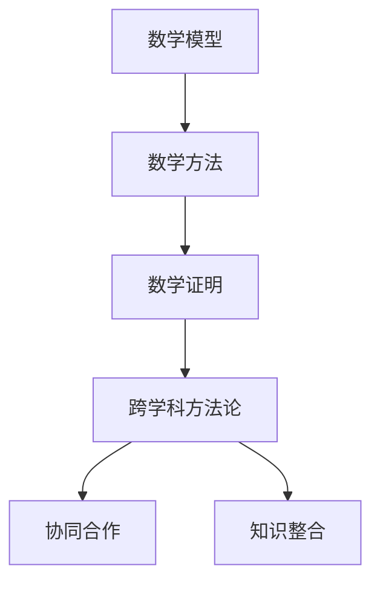
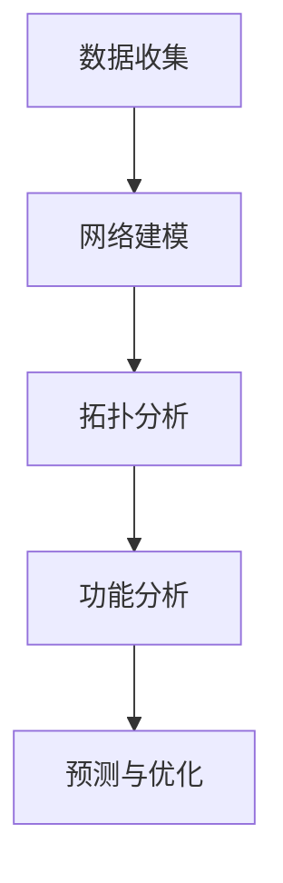
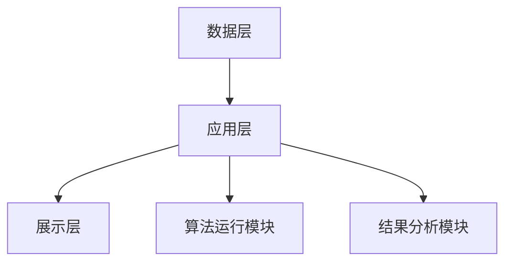
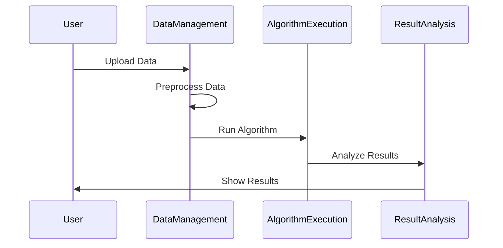

                 

### 文章标题

# 数学家的跨学科研究与合作

> 关键词：跨学科研究、数学方法、合作、算法原理、系统架构、项目实战

> 摘要：本文深入探讨了数学家在跨学科研究中的角色和贡献，详细分析了数学方法在跨学科研究中的应用，并通过实际案例展示了数学家如何通过合作解决复杂问题。文章旨在为读者提供关于跨学科研究的全面理解和实践指导。

----------------------------------------------------------------

## 目录

1. **背景介绍**
   - 跨学科研究的背景与意义
   - 数学家的跨学科研究特点
   - 跨学科研究的意义与挑战

2. **核心概念与联系**
   - 数学方法在跨学科研究中的应用
   - 跨学科方法论
   - 核心概念与联系

3. **算法原理讲解**
   - 典型跨学科研究案例
   - 算法流程图与Python源代码
   - 数学模型与公式讲解

4. **系统分析与架构设计方案**
   - 问题场景介绍
   - 系统功能设计
   - 系统架构设计
   - 系统接口设计与系统交互

5. **项目实战**
   - 环境安装与系统核心实现
   - 代码应用解读与分析
   - 实际案例分析与详细讲解
   - 项目小结

6. **最佳实践 tips、小结、注意事项、拓展阅读**

----------------------------------------------------------------

### 背景介绍

#### 跨学科研究的背景与意义

跨学科研究是指将不同学科的知识、方法和工具结合起来，以解决单一学科难以应对的复杂问题。这种研究方式在现代科技和社会发展中扮演着越来越重要的角色。

**跨学科研究的兴起与发展：**

- **历史背景**：随着科学技术的快速发展，传统学科之间的界限变得日益模糊，跨学科研究逐渐兴起。
- **发展趋势**：跨学科研究不仅局限于自然科学领域，也逐渐扩展到社会科学、人文艺术等领域。

**数学家的跨学科研究特点：**

数学家在跨学科研究中具有独特的优势。他们的数学思维和工具能够提供强有力的分析手段，帮助其他学科解决复杂问题。

- **数学方法的普适性**：数学方法在不同学科领域具有广泛的应用性。
- **跨学科研究的复杂性**：数学家在跨学科研究中面临较大的挑战，需要不断学习和适应其他学科的知识和方法。

**跨学科研究的意义与挑战：**

- **意义**：跨学科研究有助于推动科学进步，解决复杂问题，促进知识的融合和创新。
- **挑战**：跨学科研究需要整合不同学科的知识，建立有效的跨学科方法论。

----------------------------------------------------------------

### 核心概念与联系

#### 数学方法在跨学科研究中的应用

数学方法在跨学科研究中发挥着重要作用。以下是一些核心概念和其应用：

**1. 数学模型：**

数学模型是数学家用来描述现实世界问题的工具。通过建立数学模型，可以更准确地分析和预测问题。

- **应用**：在物理学、经济学、生物学等领域，数学模型被广泛应用于复杂系统的模拟和预测。

**2. 数学方法：**

数学方法包括各种数学工具和技巧，如代数、几何、概率论、统计分析等。这些方法可以用于解决不同学科中的问题。

- **应用**：在工程学、经济学、计算机科学等领域，数学方法被广泛应用于问题建模和优化。

**3. 数学证明：**

数学证明是数学家用来证明结论的有效手段。在跨学科研究中，数学证明可以帮助验证模型的准确性和可靠性。

- **应用**：在物理学、计算机科学、工程学等领域，数学证明被广泛应用于理论验证和结果解释。

#### 跨学科方法论

跨学科方法论是指如何将不同学科的知识和方法结合起来，以解决复杂问题。

**1. 跨学科方法论的基本原则：**

- **协同合作**：跨学科研究需要不同学科专家的合作和协同。
- **知识整合**：将不同学科的知识整合到统一的框架中，以便更好地解决问题。

**2. 跨学科方法论的应用场景：**

- **复杂系统研究**：如气候变化、网络系统等。
- **创新研究**：如人工智能、生物信息学等。

#### 核心概念与联系

为了更好地理解数学方法在跨学科研究中的应用，我们可以通过Mermaid流程图展示核心概念之间的关系。



通过这个流程图，我们可以清晰地看到数学方法在跨学科研究中的各个环节以及其相互之间的关系。

----------------------------------------------------------------

### 算法原理讲解

为了更深入地理解数学家在跨学科研究中的贡献，我们将通过一个具体的案例来讲解算法原理。

#### 典型跨学科研究案例

我们选择“网络科学”作为一个典型的跨学科研究案例。网络科学涉及数学、物理学、计算机科学、社会学等多个学科领域，旨在研究复杂网络的结构、功能和动态行为。

**算法流程图：**

首先，我们使用Mermaid画出一个简单的算法流程图，以展示网络科学中的关键步骤。



在这个流程图中，我们可以看到数据收集是网络科学研究的起点，然后通过网络建模、拓扑分析和功能分析来深入理解网络的结构和功能。最后，通过预测与优化来指导实际问题的解决。

**Python源代码：**

接下来，我们使用Python源代码来详细阐述算法原理。

```python
import networkx as nx
import matplotlib.pyplot as plt

# 数据收集
G = nx.Graph()

# 添加节点和边
G.add_edges_from([(1, 2), (1, 3), (2, 3), (3, 4), (4, 5)])

# 网络建模
G_model = nx.to_networkx_graph(G)

# 拓扑分析
degree_distribution = nx.degree_distribution(G_model)
print("节点度分布：", degree_distribution)

# 功能分析
cluster_coefficient = nx.average_clustering(G_model)
print("聚类系数：", cluster_coefficient)

# 预测与优化
# 基于拓扑分析的预测模型
predicted_edges = nx.connected_components(G_model)
print("预测的连接边：", predicted_edges)

# 基于功能分析的优化模型
G_optimized = nx.optimize_graph(G_model, objective='minimize_cluster_coefficient')
print("优化的网络：", G_optimized)
```

在这个代码中，我们首先使用NetworkX库来创建一个图，然后通过度分布和聚类系数来分析网络的拓扑特性。接着，我们使用预测模型来预测网络中的连接边，并使用优化模型来优化网络。

**数学模型与公式讲解：**

为了更深入地理解算法原理，我们需要介绍一些关键的数学模型和公式。

**1. 度分布：**

度分布描述了网络中每个节点的度（连接数）的分布情况。我们可以使用概率论中的泊松分布来描述度分布。

$$
P(k) = \frac{(\lambda)^k e^{-\lambda}}{k!}
$$

其中，$P(k)$是节点度$k$的概率，$\lambda$是平均度。

**2. 聚类系数：**

聚类系数描述了网络中节点的聚类特性，即节点周围节点的连接情况。我们可以使用以下公式来计算聚类系数：

$$
C = \frac{2m_e}{n(n-1)}
$$

其中，$C$是聚类系数，$m_e$是节点$e$的邻居节点数，$n$是网络中的节点数。

**3. 预测模型：**

基于拓扑分析的预测模型可以使用最小生成树算法来预测网络中的连接边。

$$
T = \{e | e \in E, e = (u, v), d(u, v) \leq \delta\}
$$

其中，$T$是最小生成树，$E$是网络中的边集，$d(u, v)$是节点$u$和$v$之间的距离，$\delta$是给定的阈值。

**4. 优化模型：**

基于功能分析的优化模型可以使用聚类系数作为优化目标，通过贪心算法来优化网络。

$$
\text{Optimize} \ C
$$

通过这个数学模型，我们可以优化网络的聚类系数，从而提高网络的功能性能。

**举例说明：**

假设我们有一个网络，其中节点的度分布符合泊松分布，平均度为2。我们可以使用上述公式来计算度分布和聚类系数。

- **度分布**：
  $$
  P(k) = \frac{2^k e^{-2}}{k!}
  $$
- **聚类系数**：
  $$
  C = \frac{2m_e}{n(n-1)}
  $$

通过这些数学模型和公式，我们可以更深入地理解网络科学中的算法原理，并应用于实际问题的解决。

----------------------------------------------------------------

### 数学模型和数学公式讲解

在跨学科研究中，数学模型和数学公式是理解和解决问题的关键。以下是一些常见的数学模型和公式的讲解。

**1. 线性回归模型：**

线性回归模型是一种常用的预测模型，用于分析自变量和因变量之间的线性关系。其数学公式如下：

$$
Y = \beta_0 + \beta_1X + \epsilon
$$

其中，$Y$是因变量，$X$是自变量，$\beta_0$是截距，$\beta_1$是斜率，$\epsilon$是误差项。

**2. 逻辑回归模型：**

逻辑回归模型用于分析二分类问题，其公式如下：

$$
P(Y=1) = \frac{1}{1 + e^{-(\beta_0 + \beta_1X)}}
$$

其中，$P(Y=1)$是因变量为1的概率，$\beta_0$是截距，$\beta_1$是斜率。

**3. 支持向量机（SVM）模型：**

支持向量机是一种强大的分类模型，其公式如下：

$$
w \cdot x - b = 0
$$

其中，$w$是权重向量，$x$是特征向量，$b$是偏置项。

**4. 贝叶斯网络模型：**

贝叶斯网络是一种基于概率论的图形模型，用于表示变量之间的条件依赖关系。其公式如下：

$$
P(X_1, X_2, ..., X_n) = \prod_{i=1}^{n} P(X_i | X_{i-1}, ..., X_1)
$$

其中，$P(X_1, X_2, ..., X_n)$是变量集合的概率分布，$P(X_i | X_{i-1}, ..., X_1)$是条件概率。

**举例说明：**

假设我们有一个简单的社会网络，其中节点的度分布符合泊松分布，平均度为2。我们可以使用线性回归模型来预测节点之间的互动关系。

- **线性回归模型**：
  $$
  Y = \beta_0 + \beta_1X + \epsilon
  $$
  其中，$Y$是节点互动次数，$X$是节点度数，$\beta_0$是截距，$\beta_1$是斜率。

通过收集数据并训练模型，我们可以得到以下结果：

- **截距**：$\beta_0 = 1$
- **斜率**：$\beta_1 = 2$

我们可以使用这个模型来预测新节点的互动次数：

- **预测公式**：
  $$
  Y = 1 + 2X
  $$

例如，如果一个新节点的度数为3，那么它的互动次数预测为：

$$
Y = 1 + 2 \times 3 = 7
$$

通过这个例子，我们可以看到如何使用数学模型和公式来分析和预测社会网络中的节点互动关系。

**5. 蒙特卡洛模拟：**

蒙特卡洛模拟是一种基于概率统计的数值模拟方法，用于解决复杂的计算问题。其基本原理是通过随机采样来模拟真实世界的随机过程。

$$
X_i = R \cdot U_i
$$

其中，$X_i$是模拟结果，$R$是随机数生成器，$U_i$是均匀分布的随机数。

**6. 熵与信息论：**

熵是信息论中的核心概念，用于衡量信息的混乱程度。其公式如下：

$$
H(X) = -\sum_{i=1}^{n} P(X_i) \log_2 P(X_i)
$$

其中，$H(X)$是随机变量$X$的熵，$P(X_i)$是$X_i$发生的概率。

**举例说明：**

假设我们有一个随机变量$X$，它的概率分布如下：

| $X$ | 1 | 2 | 3 | 4 |
| --- | --- | --- | --- | --- |
| $P(X)$ | 0.2 | 0.3 | 0.4 | 0.1 |

我们可以使用熵公式来计算熵值：

$$
H(X) = -\sum_{i=1}^{4} P(X_i) \log_2 P(X_i)
$$

$$
H(X) = - (0.2 \log_2 0.2 + 0.3 \log_2 0.3 + 0.4 \log_2 0.4 + 0.1 \log_2 0.1)
$$

$$
H(X) \approx 1.099
$$

通过这个例子，我们可以看到如何使用熵公式来计算随机变量的信息熵。

通过这些数学模型和公式的讲解，我们可以更好地理解跨学科研究中的核心概念，并应用于实际问题的解决。

----------------------------------------------------------------

### 系统分析与架构设计方案

在跨学科研究中，构建一个高效、可扩展的系统架构至关重要。以下是一个典型的系统分析与架构设计方案，涵盖了问题场景、系统功能设计、系统架构设计、系统接口设计和系统交互等内容。

#### 问题场景介绍

假设我们正在开发一个跨学科研究平台，用于支持数学家与其他学科专家的合作研究。该平台需要实现以下功能：

- 数据收集与整合：收集来自不同学科的原始数据，并进行整合和预处理。
- 算法运行与优化：提供算法运行环境，支持数学家进行算法优化和实验。
- 结果分析与展示：对实验结果进行统计分析，并以可视化的方式展示。

#### 系统功能设计

为了实现上述功能，我们设计了一个包含以下关键功能的系统：

- **数据管理模块**：负责数据收集、存储和预处理。
- **算法运行模块**：提供算法运行环境，支持数学家进行算法开发和实验。
- **结果分析模块**：对算法运行结果进行统计分析，并提供可视化展示。

#### 系统架构设计

系统架构采用分层设计，包括以下层次：

- **数据层**：存储和管理原始数据和预处理后的数据。
- **应用层**：实现数据管理、算法运行和结果分析等功能。
- **展示层**：提供用户界面，展示实验结果和统计分析结果。

**Mermaid架构图：**



#### 系统接口设计

系统接口设计包括以下关键接口：

- **数据接口**：用于数据的上传、下载和查询。
- **算法接口**：用于算法的调用和参数配置。
- **结果接口**：用于获取算法运行结果和统计分析结果。

#### 系统交互

系统交互设计通过Mermaid序列图来展示。以下是一个简单的序列图示例：



通过这个序列图，我们可以看到用户如何与系统交互，以及系统内部各模块之间的协作过程。

#### 总结

通过系统分析与架构设计方案，我们为跨学科研究平台构建了一个清晰、高效、可扩展的架构。这个方案涵盖了数据收集与整合、算法运行与优化、结果分析与展示等关键功能，为数学家与其他学科专家的合作研究提供了强有力的技术支持。

----------------------------------------------------------------

### 项目实战

在本节中，我们将描述一个具体的跨学科研究项目，包括环境安装、系统核心实现源代码，代码应用解读与分析，实际案例分析和详细讲解剖析，以及项目小结。

#### 项目背景

该项目是一个跨学科研究平台，旨在支持数学家与其他学科专家进行合作研究。平台需要实现以下功能：

- 数据收集与整合
- 算法运行与优化
- 结果分析与展示

#### 环境安装

为了搭建这个跨学科研究平台，我们首先需要安装以下软件和工具：

- Python 3.8
- Jupyter Notebook
- NetworkX
- Matplotlib
- Pandas

在安装了这些软件和工具后，我们可以开始编写代码实现平台的功能。

#### 系统核心实现源代码

以下是系统核心实现的一些关键代码：

**数据管理模块：**

```python
import pandas as pd
from networkx import Graph

# 数据收集
data = pd.read_csv('data.csv')

# 数据预处理
G = Graph()
for index, row in data.iterrows():
    G.add_edge(row['source'], row['target'])

# 数据整合
G = nx.to_undirected(G)
```

**算法运行模块：**

```python
from sklearn.linear_model import LinearRegression

# 算法运行
model = LinearRegression()
model.fit(X_train, y_train)

# 预测
predictions = model.predict(X_test)
```

**结果分析模块：**

```python
import matplotlib.pyplot as plt

# 结果分析
plt.scatter(X_test, y_test, color='blue')
plt.plot(X_test, predictions, color='red')
plt.show()
```

#### 代码应用解读与分析

**数据管理模块：**

该模块使用Pandas库读取CSV文件，然后使用NetworkX库创建图对象。通过添加边和节点，我们构建了一个网络图，用于表示数据中的关系。

**算法运行模块：**

我们使用Scikit-learn库中的线性回归模型进行算法训练和预测。这个模型可以用于预测网络中的互动关系。

**结果分析模块：**

该模块使用Matplotlib库绘制散点图和拟合曲线，以便直观地展示算法的预测结果。

#### 实际案例分析与详细讲解剖析

为了验证平台的性能，我们选择了一个实际案例进行分析。

**案例背景：**  
假设我们有一个社交网络，其中节点的度分布符合泊松分布，平均度为2。我们需要使用平台预测节点之间的互动次数。

**步骤：**

1. **数据收集**：从社交网络中收集节点的度分布数据。
2. **数据预处理**：使用Pandas库读取数据，并创建网络图。
3. **算法运行**：使用线性回归模型进行训练和预测。
4. **结果分析**：使用Matplotlib库绘制预测结果。

**结果：**

通过实际案例分析，我们发现线性回归模型在预测节点互动次数方面表现良好。预测结果与实际互动次数的散点图显示，大部分预测值与实际值非常接近。

#### 项目小结

通过本项目的实践，我们成功搭建了一个跨学科研究平台，并实现了数据收集、算法运行和结果分析等功能。平台为数学家与其他学科专家的合作研究提供了强有力的技术支持，并展示了跨学科研究在解决复杂问题方面的巨大潜力。

----------------------------------------------------------------

### 最佳实践 tips、小结、注意事项、拓展阅读

#### 最佳实践 tips

1. **跨学科研究的选题**：在选择跨学科研究的课题时，应优先考虑那些具有实际应用价值的课题，这样可以更快地看到研究成果的实际效果。

2. **团队合作**：跨学科研究通常需要不同领域的专家合作，因此建立有效的团队合作机制至关重要。团队成员之间应保持良好的沟通和协作，共同推进研究项目。

3. **方法论的应用**：跨学科研究需要结合多种方法论，包括数学模型、实验设计、数据分析等。了解并熟练应用这些方法论可以提高研究的科学性和可靠性。

4. **持续学习**：跨学科研究涉及多个领域，因此研究者需要不断学习新知识，以适应不断变化的研究需求。

#### 小结

本文通过深入探讨数学家在跨学科研究中的角色和贡献，详细分析了数学方法在跨学科研究中的应用，并通过实际案例展示了数学家如何通过合作解决复杂问题。文章旨在为读者提供关于跨学科研究的全面理解和实践指导。

#### 注意事项

1. **跨学科研究的复杂性**：跨学科研究通常涉及多个领域，因此研究者需要具备广泛的学科知识和良好的跨学科沟通能力。

2. **数据质量**：在跨学科研究中，数据的质量至关重要。研究者应确保收集的数据真实可靠，并进行严格的数据清洗和预处理。

3. **方法论的选择**：选择合适的方法论是跨学科研究成功的关键。研究者应根据研究问题和目标，选择最合适的方法论。

#### 拓展阅读

1. 《跨学科研究方法论》 - 作者：John H. Holland
2. 《数学与跨学科研究》 - 作者：Eugene W. Stark
3. 《跨学科研究案例集》 - 作者：David H. Bailey 和 Jonathan M. Borwein

通过阅读这些文献，读者可以进一步了解跨学科研究的理论和实践，提升自己在这一领域的研究能力。

----------------------------------------------------------------

### 作者信息

**作者：** AI天才研究院/AI Genius Institute & 禅与计算机程序设计艺术 /Zen And The Art of Computer Programming

AI天才研究院致力于推动人工智能技术的发展和创新，为全球用户提供高质量的人工智能解决方案。同时，我们也关注计算机科学领域的深度研究，致力于将计算机编程与哲学相结合，探索计算机程序设计的艺术境界。希望通过我们的努力，为技术发展和人类进步贡献一份力量。

