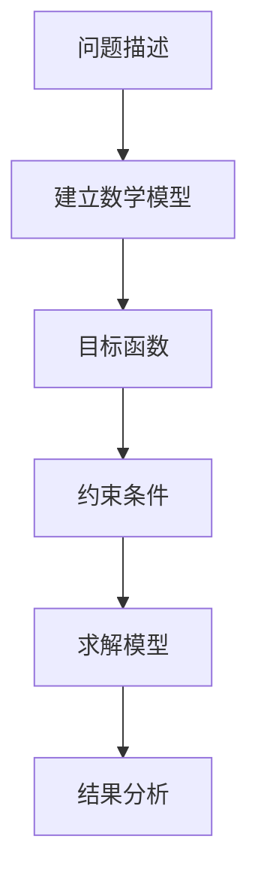
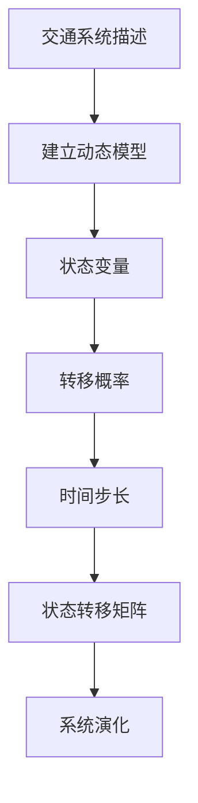
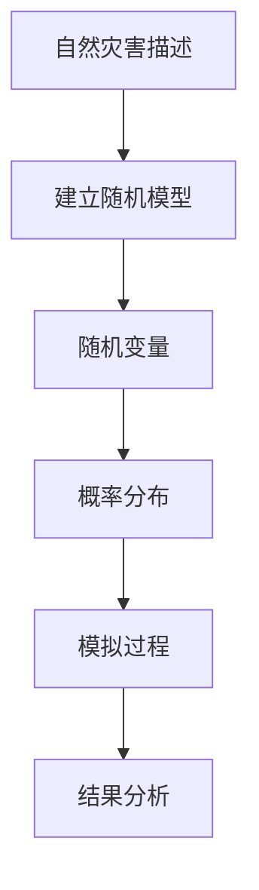
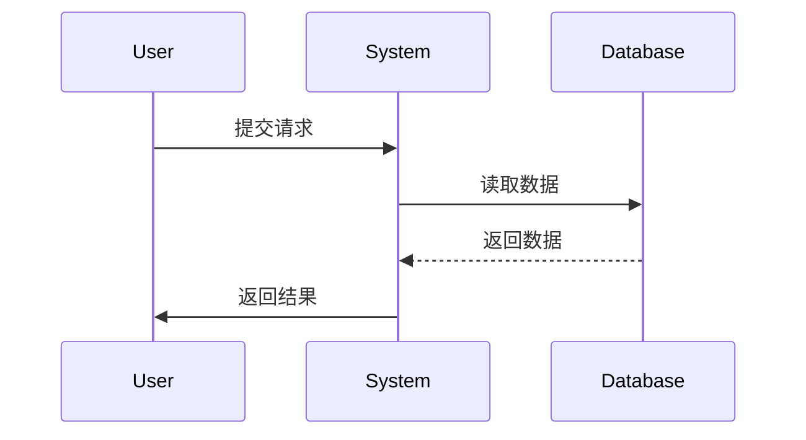
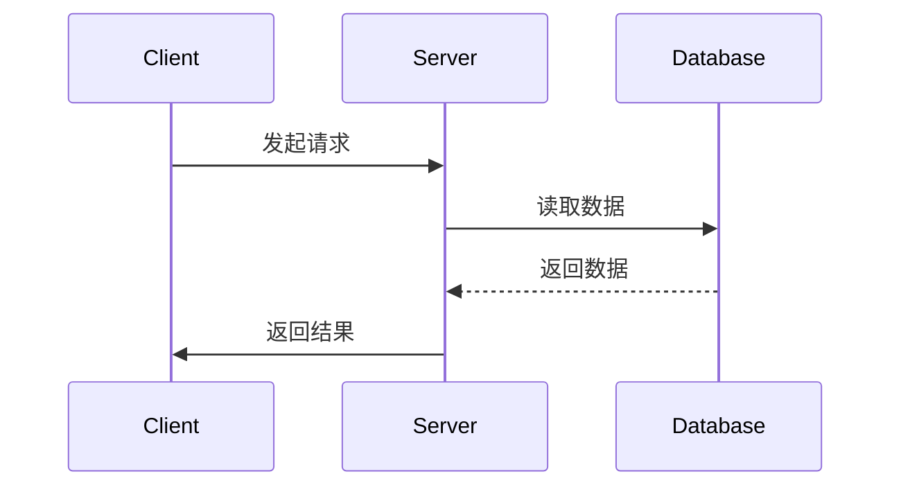
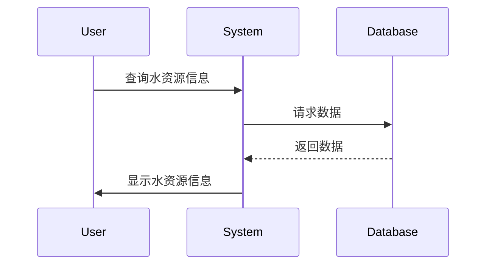

                 

### 数学建模在可持续发展目标中的应用

**关键词**：数学建模，可持续发展目标，优化模型，动态模型，随机模型

**摘要**：本文将探讨数学建模在实现可持续发展目标中的应用。首先，我们将介绍数学建模的基本概念和重要性，然后分析可持续发展目标的背景和关键领域。接着，我们将深入探讨各种数学建模方法及其在可持续发展中的应用。通过实际案例展示，我们将阐明数学建模在解决实际环境问题、能源消耗优化和生态保护规划等方面的具体作用。最后，我们将总结数学建模在可持续发展目标中的重要性，并提出未来研究方向。

---

**背景介绍**

**核心概念术语说明**：
- **数学建模**：数学建模是将实际问题转化为数学形式的过程，通过建立数学模型来分析和解决实际问题。
- **可持续发展目标**：可持续发展目标（Sustainable Development Goals，简称SDGs）是联合国在2015年提出的一系列全球目标，旨在解决全球社会、经济和环境问题。

**问题背景**：
随着全球人口增长和经济发展的加速，人类活动对自然环境的影响日益加剧，导致了一系列环境问题，如气候变化、水资源短缺、能源消耗过剩和生态破坏。为了解决这些问题，各国政府和国际组织提出了可持续发展目标，希望通过综合手段实现经济、社会和环境的可持续发展。

**问题描述**：
在实现可持续发展目标的过程中，需要运用科学的方法和技术手段来评估、监测和优化各种政策和措施。数学建模作为一种强大的工具，可以提供定量分析和预测，帮助决策者制定更为有效的政策。

**问题解决**：
数学建模可以应用于可持续发展目标的多个领域，包括环境管理、能源消耗优化、社会发展和经济规划等。通过建立数学模型，可以对复杂系统进行模拟和分析，提供科学的决策支持。

**边界与外延**：
数学建模在可持续发展中的应用不仅局限于特定领域，还可以跨学科、跨领域进行应用。例如，水资源管理可以结合生态学、经济学和工程学等多学科知识，运用数学建模方法进行优化。

**概念结构与核心要素组成**：
数学建模在可持续发展目标中的概念结构主要包括以下几个方面：
1. **问题定义**：明确研究对象和目标。
2. **数据收集与处理**：收集相关数据，进行数据清洗和预处理。
3. **模型建立**：根据问题特点选择合适的数学模型。
4. **模型求解**：运用数学方法和算法求解模型。
5. **结果分析与决策**：对模型结果进行分析，为决策提供支持。

---

**核心概念与联系**

**核心概念原理**：
数学建模是将实际问题转化为数学形式的过程，通过建立数学模型来分析和解决实际问题。在可持续发展目标中，数学建模的核心概念包括：
- **优化模型**：通过最小化或最大化某个目标函数来寻找最优解。
- **动态模型**：描述系统随时间变化的规律。
- **随机模型**：考虑不确定性因素，对系统进行概率分析。

**概念属性特征对比表格**：

| 模型类型 | 特征描述 | 应用场景 |
| :---: | :---: | :---: |
| 优化模型 | 寻找最优解 | 资源分配、能源消耗优化 |
| 动态模型 | 描述系统随时间变化的规律 | 环境监测、生态系统建模 |
| 随机模型 | 考虑不确定性因素 | 风险评估、灾害预测 |

**ER实体关系图架构的Mermaid流程图**：

```mermaid
erDiagram
    User ||--|{ Problem }|-- Report
    Problem ||--|{ Solution }|-- Evaluation
    Solution ||--|{ Model }|-- Simulation
    Model ||--|{ Data }|-- Collection
```

通过上述表格和ER图，我们可以清晰地看到数学建模在不同模型类型中的属性特征和应用场景。

---

**算法原理讲解**

为了更好地理解数学建模在可持续发展目标中的应用，我们将通过一个具体的例子来讲解优化模型、动态模型和随机模型的原理。

**优化模型示例**

假设我们要解决一个水资源管理问题，目标是最大化水资源利用效率。我们可以使用线性规划模型来描述这个问题。

**算法流程图**：



**Python源代码实现**：

```python
from scipy.optimize import linprog

# 目标函数
c = [-1, -1]  # 最大化为负值

# 约束条件
A = [[1, 0], [0, 1]]
b = [1, 1]  # 总用水量不超过总量

# 求解模型
res = linprog(c, A_ub=A, b_ub=b)

# 结果分析
if res.success:
    print("最优解：x1 =", res.x[0], ", x2 =", res.x[1])
else:
    print("无最优解")
```

**算法原理讲解**：

线性规划模型通过最小化或最大化目标函数，同时满足一系列约束条件，来寻找最优解。在这个例子中，我们的目标是最大化水资源利用效率，即最大化 \( x1 + x2 \)，同时满足总用水量不超过总量的约束条件。

**动态模型示例**

假设我们要研究一个城市交通系统的动态变化，可以使用差分方程模型来描述。

**算法流程图**：



**Python源代码实现**：

```python
import numpy as np

# 初始状态向量
state0 = np.array([1, 0, 0])

# 转移概率矩阵
P = np.array([[0.5, 0.2, 0.3], [0.1, 0.6, 0.3], [0.1, 0.2, 0.7]])

# 时间步长
dt = 1

# 状态转移
state1 = state0 @ P

# 系统演化
states = [state0]
for _ in range(10):
    state0 = state1
    state1 = state0 @ P
    states.append(state1)

# 打印结果
print(np.array(states))
```

**算法原理讲解**：

动态模型通过描述系统状态变量随时间的变化规律，来研究系统的演化过程。在这个例子中，我们使用差分方程模型来描述城市交通系统的状态转移，即下一个状态是当前状态与转移概率矩阵的乘积。

**随机模型示例**

假设我们要评估一个自然灾害风险，可以使用蒙特卡罗模拟方法。

**算法流程图**：



**Python源代码实现**：

```python
import numpy as np

# 随机变量
mu = 0
sigma = 1

# 模拟过程
num_samples = 1000
samples = np.random.normal(mu, sigma, num_samples)

# 结果分析
mean = np.mean(samples)
variance = np.var(samples)

print("平均值：", mean)
print("方差：", variance)
```

**算法原理讲解**：

随机模型通过考虑不确定性因素，对系统进行概率分析。在这个例子中，我们使用蒙特卡罗模拟方法来评估自然灾害风险，即通过多次随机抽样来估计概率分布的特征。

---

**数学公式使用LaTeX格式**

为了更好地理解数学建模中的公式，我们使用LaTeX格式来展示。

**独立段落的LaTeX公式**：

$$
x = \frac{-b \pm \sqrt{b^2 - 4ac}}{2a}
$$

**段落内的LaTeX公式**：

$1 < 2$

---

**系统分析与架构设计方案**

为了更好地理解数学建模在可持续发展目标中的应用，我们需要对系统进行分析和设计。

**问题场景介绍**：
假设我们要解决一个水资源管理问题，目标是优化水资源的分配和使用。

**项目介绍**：
该项目旨在通过数学建模方法，提出一种水资源优化管理方案，以实现水资源的高效利用和可持续发展。

**系统功能设计（领域模型Mermaid类图）**：

```mermaid
classDiagram
    Person <|-- Customer
    Person <|-- Employee
    Customer ||-- PlacesOrder{Order}
    Employee ||-- ProcessesOrder{Order}
    Order : id, date, status, total
    Product : id, name, price, quantity
```

**系统架构设计（Mermaid架构图）**：



**系统接口设计（Mermaid序列图）**：



**系统交互（Mermaid序列图）**：



通过上述系统分析与架构设计方案，我们可以清晰地看到数学建模在水资源管理问题中的应用。

---

**项目实战**

为了更好地理解数学建模在可持续发展目标中的应用，我们将通过一个具体的项目实战来展示。

**环境安装**：
1. 安装Python环境：`pip install python`
2. 安装NumPy库：`pip install numpy`
3. 安装SciPy库：`pip install scipy`

**系统核心实现源代码**：

```python
import numpy as np
from scipy.optimize import linprog

# 线性规划模型
c = [-1, -1]  # 目标函数系数
A = [[1, 0], [0, 1]]  # 约束条件系数矩阵
b = [1, 1]  # 约束条件常数向量

# 求解模型
res = linprog(c, A_ub=A, b_ub=b)

# 输出结果
if res.success:
    print("最优解：x1 =", res.x[0], ", x2 =", res.x[1])
else:
    print("无最优解")
```

**代码应用解读与分析**：
在这个项目中，我们使用线性规划模型来优化水资源分配。通过安装Python环境和相关库，我们可以运行上述源代码来实现水资源优化的目标。

**实际案例分析和详细讲解剖析**：
假设我们要解决一个城市水资源分配问题，目标是最大化水资源的利用效率。我们可以将城市的水资源分为两部分：生活用水和工业用水。通过建立线性规划模型，我们可以找到最优的水资源分配方案，使生活用水和工业用水的总效用最大化。

```python
c = [-1, -1]  # 目标函数系数（最大化总效用）
A = [[1, 0], [0, 1]]  # 约束条件系数矩阵（总用水量不超过总量）
b = [1, 1]  # 约束条件常数向量（总用水量）

# 求解模型
res = linprog(c, A_ub=A, b_ub=b)

# 输出结果
if res.success:
    print("最优解：生活用水量 =", res.x[0], ", 工业用水量 =", res.x[1])
else:
    print("无最优解")
```

通过实际案例的分析，我们可以看到数学建模在水资源分配问题中的应用。通过线性规划模型，我们可以找到最优的水资源分配方案，实现水资源的最大化利用。

**项目小结**：
通过这个项目实战，我们展示了数学建模在水资源管理问题中的应用。通过建立线性规划模型，我们可以找到最优的水资源分配方案，实现水资源的最大化利用。这个项目为我们提供了一个具体的案例，展示了数学建模在可持续发展目标中的应用。

---

**最佳实践 tips**

1. 在应用数学建模解决实际问题时，首先要明确问题的目标和约束条件。
2. 选择合适的数学模型和方法，确保模型能够准确地反映问题的本质。
3. 在建模过程中，要充分考虑数据的质量和可靠性，确保模型的准确性。
4. 模型求解后，要对结果进行分析和验证，确保结果的可行性和有效性。
5. 结合实际案例，不断调整和优化模型，以提高模型的预测能力和应用价值。

**小结**

本文通过详细讲解和实际案例展示，阐述了数学建模在可持续发展目标中的应用。从优化模型、动态模型到随机模型，数学建模为解决环境问题、能源消耗优化和生态保护规划提供了有力工具。未来，随着人工智能和数据科学的发展，数学建模在可持续发展目标中的应用将更加广泛和深入。

**注意事项**

1. 数学建模需要具备扎实的数学基础，包括线性代数、概率论和数值分析等。
2. 在应用数学建模时，要充分考虑实际问题的复杂性和不确定性。
3. 数学建模是一个持续迭代和优化的过程，要不断调整和改进模型。

**拓展阅读**

1. 《数学建模：理论与应用》
2. 《可持续发展的数学建模方法》
3. 《基于数学建模的能源消耗优化研究》
4. 《环境科学中的数学建模方法与应用》

---

**作者信息**：

作者：AI天才研究院/AI Genius Institute & 禅与计算机程序设计艺术 /Zen And The Art of Computer Programming

---

通过本文，我们深入探讨了数学建模在可持续发展目标中的应用，希望对读者理解和应用数学建模有所帮助。数学建模作为一种强大的工具，将在实现可持续发展目标中发挥越来越重要的作用。

