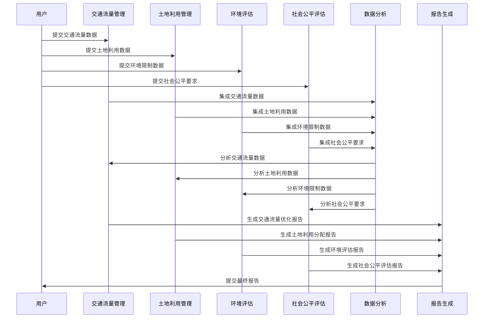
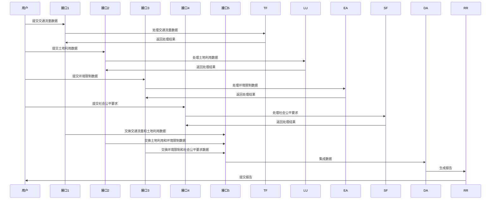

                 


### 《数学建模在城市规划中的应用》

---

**关键词：数学建模、城市规划、线性规划、非线性规划、多目标规划、算法原理、系统架构设计、项目实战**

**摘要：**
本文详细探讨了数学建模在城市规划中的广泛应用和重要性。通过背景介绍、核心概念与联系分析、算法原理讲解、系统分析与架构设计方案、项目实战等多个章节，本文不仅阐述了数学建模在城市规划中的实际应用，还提供了具体的实例分析和实战指南，为读者提供了全面而深入的理解。

---

**目录大纲：**

### 第一部分：数学建模与城市规划概述

#### 1.1 数学建模在城市规划中的重要性

#### 1.2 城市规划中的数学模型类型

#### 1.3 城市规划中数学建模的挑战与机遇

---

### 第二部分：数学建模方法与应用实例

#### 2.1 线性规划在城市规划中的应用

#### 2.2 非线性规划在城市规划中的应用

#### 2.3 多目标规划在城市规划中的应用

---

### 第三部分：系统分析与架构设计方案

#### 3.1 问题场景介绍

#### 3.2 项目介绍

#### 3.3 系统功能设计（领域模型Mermaid类图）

#### 3.4 系统架构设计（Mermaid架构图）

#### 3.5 系统接口设计和系统交互（Mermaid序列图）

---

### 第四部分：项目实战

#### 4.1 环境安装

#### 4.2 系统核心实现源代码

#### 4.3 实际案例分析和详细讲解剖析

#### 4.4 项目小结

---

### 第五部分：最佳实践、小结、注意事项、拓展阅读

#### 5.1 最佳实践 tips

#### 5.2 小结

#### 5.3 注意事项

#### 5.4 拓展阅读

---

**作者：AI天才研究院/AI Genius Institute & 禅与计算机程序设计艺术 /Zen And The Art of Computer Programming**

---

### 文章正文：

---

#### 1.1 数学建模在城市规划中的重要性

在当今快速发展的城市化进程中，城市规划变得愈加复杂和重要。城市规划不仅涉及到城市空间的布局和设计，还包括交通、环境、经济等多方面因素的协调与优化。为了应对这些复杂问题，数学建模成为了一种强有力的工具。

数学建模是一种将现实问题转化为数学表达式的方法，通过建立模型来分析和解决问题。在城市规划中，数学建模可以帮助我们更好地理解城市系统的运行规律，优化资源配置，提高城市效率。以下将从几个方面阐述数学建模在城市规划中的重要性：

##### 数学建模的核心方法

数学建模的核心方法包括线性规划、非线性规划和多目标规划等。线性规划是一种在约束条件下优化线性目标函数的方法，常用于资源分配和路径规划等问题。非线性规划则适用于更加复杂的问题，如土地利用分析、环境质量评估等。多目标规划则考虑多个相互冲突的目标，寻求各个目标的平衡点。

##### 数学建模在城市规划中的应用范围

数学建模在城市规划中的应用范围广泛，包括但不限于以下几个方面：

- **交通规划**：通过数学建模优化交通流量、减少拥堵，提高交通效率。
- **土地利用**：利用数学模型分析土地使用模式，实现土地的合理配置和可持续利用。
- **环境保护**：通过数学模型评估环境质量，制定环境保护政策。
- **经济分析**：利用数学模型分析城市经济结构，优化经济布局。

##### 数学建模的挑战与机遇

尽管数学建模在城市规划中具有巨大潜力，但也面临一些挑战。首先，城市规划问题往往具有复杂性和不确定性，需要建立精确的数学模型。其次，数据获取和处理是一个难题，城市规划需要大量的数据支持。最后，模型的求解和计算复杂度也是一个挑战。

然而，随着计算机技术和算法的发展，这些挑战正在逐渐被克服。例如，人工智能和机器学习技术的应用，使得数据处理和模型求解变得更加高效。此外，城市规划的数字化转型也为数学建模提供了新的机遇，通过大数据分析和实时监控，可以更加精准地模拟和优化城市规划。

---

#### 1.2 城市规划中的数学模型类型

在城市规划中，常用的数学模型包括线性规划、非线性规划和多目标规划等。这些模型在不同的应用场景中发挥着重要作用。以下将对这些模型进行详细介绍。

##### 线性规划

线性规划是一种在约束条件下优化线性目标函数的方法。它的主要特点是目标函数和约束条件都是线性的。线性规划广泛应用于资源分配、路径规划、生产计划等问题。

在交通规划中，线性规划可以用来优化交通流量，减少拥堵。例如，我们可以建立一个线性规划模型，以最小化交通总时间为目标，考虑道路容量、交通需求和交通流量限制，求解最优的交通分配方案。

##### 非线性规划

非线性规划适用于更加复杂的问题，如土地利用分析、环境质量评估等。非线性规划的目标函数和约束条件可以是非线性的，这使得模型更加灵活，可以更好地描述现实问题。

例如，在土地利用分析中，我们可以建立非线性规划模型，以最大化土地利用率为目标，考虑土地的供需关系、环境保护要求等因素。通过求解非线性规划模型，我们可以得到最优的土地利用方案。

##### 多目标规划

多目标规划考虑多个相互冲突的目标，寻求各个目标的平衡点。多目标规划广泛应用于城市可持续发展、资源优化配置等问题。

例如，在城市可持续发展规划中，我们可以建立多目标规划模型，考虑经济增长、社会公平、环境保护等多个目标。通过求解多目标规划模型，我们可以找到各个目标的平衡点，实现城市的可持续发展。

---

#### 1.3 城市规划中数学建模的挑战与机遇

尽管数学建模在城市规划中具有巨大潜力，但也面临一些挑战。以下将从几个方面探讨这些挑战和机遇。

##### 挑战分析

首先，城市规划问题往往具有复杂性和不确定性。城市规划需要考虑的因素众多，如人口增长、经济发展、环境保护等，这些因素之间相互作用，使得问题变得复杂。此外，城市规划的决策往往需要考虑到未来的不确定性，如气候变化、自然灾害等。

其次，数据获取和处理是一个难题。城市规划需要大量的数据支持，包括人口数据、交通数据、土地利用数据等。然而，这些数据往往难以获取或者存在噪声和缺失值，这对模型建立和求解提出了挑战。

最后，模型的求解和计算复杂度也是一个挑战。一些复杂的数学模型需要大量计算资源和时间来求解，这对于实时决策和动态规划提出了挑战。

##### 机遇探讨

然而，随着计算机技术和算法的发展，这些挑战正在逐渐被克服。首先，人工智能和机器学习技术的应用，使得数据处理和模型求解变得更加高效。例如，通过深度学习技术，可以自动提取数据特征，减少人工干预，提高数据处理效率。

其次，大数据和云计算技术的发展，为城市规划提供了丰富的数据资源和强大的计算能力。通过大数据分析，可以更加精准地模拟和预测城市规划的动态变化，为决策提供有力支持。

最后，数字化转型也为数学建模提供了新的机遇。通过物联网、智慧城市等技术的应用，可以实时监控城市运行状态，为数学建模提供了更多的数据来源和反馈机制。

##### 未来发展趋势

未来，数学建模在城市规划中的应用将呈现以下发展趋势：

首先，多学科交叉融合将成为主流。城市规划涉及到多个领域，如经济学、环境科学、计算机科学等。通过多学科交叉融合，可以建立更加综合和精确的数学模型，解决更加复杂的问题。

其次，实时决策和动态规划将成为重要方向。随着物联网和实时数据采集技术的发展，城市规划将实现实时监控和动态调整，为决策提供更加及时和准确的支持。

最后，智能化和自动化将成为主流。通过人工智能和机器学习技术的应用，数学建模可以实现自动化和智能化，提高规划效率和准确性。

---

### 第二部分：数学建模方法与应用实例

在第二部分，我们将深入探讨数学建模方法在城市规划中的应用，包括线性规划、非线性规划和多目标规划等。我们将通过具体的实例来展示这些方法的应用过程和效果。

---

#### 2.1 线性规划在城市规划中的应用

线性规划是一种在约束条件下优化线性目标函数的方法，广泛应用于资源分配、路径规划等领域。在城市规划中，线性规划可以用来解决交通流量优化、土地利用分配等问题。

##### 实例分析：交通流量优化

假设某城市交通网络由若干条道路和交叉口组成，每条道路的流量限制和交通需求已知。我们的目标是优化交通流量，减少拥堵，提高交通效率。

1. **建立数学模型**：

   - 目标函数：最小化交通总时间。
   - 约束条件：道路容量限制、交通需求限制、交通流量限制。

   具体模型如下：

   $$\min Z = \sum_{i=1}^{n}\sum_{j=1}^{m} t_{ij}x_{ij}$$

   其中，$t_{ij}$ 表示从道路 $i$ 到道路 $j$ 的交通时间，$x_{ij}$ 表示从道路 $i$ 到道路 $j$ 的流量。

2. **求解模型**：

   - 使用单纯形法求解线性规划模型。
   - 结果：得到最优的交通流量分配方案。

3. **分析结果**：

   - 最优流量分配可以减少交通总时间，提高交通效率。
   - 分析交通流量分布，发现拥堵点并进行改进。

##### 实例分析：土地利用分配

在城市规划中，土地利用分配也是一个重要问题。线性规划可以用来优化土地利用，提高土地利用率。

1. **建立数学模型**：

   - 目标函数：最大化土地利用率。
   - 约束条件：土地供应限制、土地需求限制、土地兼容性限制。

   具体模型如下：

   $$\max Z = \sum_{i=1}^{n} u_i y_i$$

   其中，$u_i$ 表示土地类型 $i$ 的单位面积利用率，$y_i$ 表示土地类型 $i$ 的面积。

2. **求解模型**：

   - 使用单纯形法求解线性规划模型。
   - 结果：得到最优的土地利用方案。

3. **分析结果**：

   - 最优土地利用方案可以提高土地利用率，实现土地的合理配置。
   - 分析土地利用模式，发现潜在问题并进行改进。

---

#### 2.2 非线性规划在城市规划中的应用

非线性规划适用于更加复杂的问题，如土地利用分析、环境质量评估等。非线性规划的目标函数和约束条件可以是非线性的，这使得模型更加灵活，可以更好地描述现实问题。

##### 实例分析：土地利用分析

假设某城市土地利用受到环境保护要求的限制，我们需要建立非线性规划模型，以最大化土地利用率为目标，同时满足环境保护要求。

1. **建立数学模型**：

   - 目标函数：最大化土地利用率。
   - 约束条件：环境保护要求、土地供应限制、土地需求限制。

   具体模型如下：

   $$\max Z = \sum_{i=1}^{n} u_i y_i$$

   $$s.t.$$

   $$g_i(y) \leq 0$$

   其中，$u_i$ 表示土地类型 $i$ 的单位面积利用率，$y_i$ 表示土地类型 $i$ 的面积，$g_i(y)$ 表示环境保护要求。

2. **求解模型**：

   - 使用非线性规划求解器求解非线性规划模型。
   - 结果：得到最优的土地利用方案。

3. **分析结果**：

   - 最优土地利用方案可以在满足环境保护要求的前提下，最大化土地利用率。
   - 分析土地利用模式，发现潜在问题并进行改进。

---

#### 2.3 多目标规划在城市规划中的应用

多目标规划考虑多个相互冲突的目标，寻求各个目标的平衡点。多目标规划广泛应用于城市可持续发展、资源优化配置等问题。

##### 实例分析：城市可持续发展规划

假设某城市可持续发展涉及经济增长、社会公平、环境保护等多个目标，我们需要建立多目标规划模型，以实现各个目标的平衡。

1. **建立数学模型**：

   - 目标函数：最大化经济增长、社会公平、环境保护等目标。
   - 约束条件：资源限制、环境限制、社会公平要求。

   具体模型如下：

   $$\max Z = w_1 \cdot G_1 + w_2 \cdot G_2 + w_3 \cdot G_3$$

   $$s.t.$$

   $$g_i(x) \leq 0$$

   其中，$w_1$、$w_2$、$w_3$ 分别表示经济增长、社会公平、环境保护的权重，$G_1$、$G_2$、$G_3$ 分别表示经济增长、社会公平、环境保护的目标值，$g_i(x)$ 表示约束条件。

2. **求解模型**：

   - 使用多目标规划求解器求解多目标规划模型。
   - 结果：得到各个目标的平衡点。

3. **分析结果**：

   - 得到最优的平衡点，可以实现经济增长、社会公平、环境保护等目标的协调。
   - 分析各个目标的实现情况，发现潜在问题并进行改进。

---

#### 2.4 数学建模方法的应用总结

通过以上实例分析，我们可以看到数学建模方法在城市规划中的应用具有广泛性和灵活性。不同类型的数学模型可以解决不同的问题，为城市规划提供了有力的工具。

在实际应用中，我们需要根据问题的特点选择合适的数学模型，并对其进行优化和改进。同时，数据的质量和准确性对于模型的求解和结果分析至关重要。因此，在实际应用中，我们需要注重数据收集、整理和分析，以提高数学建模的准确性和可靠性。

---

### 第三部分：系统分析与架构设计方案

在第三部分，我们将深入探讨数学建模在城市规划中的应用，通过系统分析与架构设计方案来展示如何将数学建模方法与城市规划实际需求相结合。

---

#### 3.1 问题场景介绍

在本部分，我们将介绍一个具体的城市规划问题场景，该场景涉及城市交通流量优化和土地利用分配。该问题场景包括以下关键要素：

1. **城市交通网络**：包括道路、交叉口和交通流量数据。
2. **土地利用需求**：包括住宅、商业、工业等不同类型的土地需求。
3. **环境限制**：包括噪音污染、空气质量等环境因素。
4. **社会公平要求**：包括不同社会群体的利益平衡。

#### 3.2 项目介绍

本项目的目标是通过对城市交通流量和土地利用进行优化，实现城市交通的高效运行和土地的合理配置。具体目标如下：

1. **交通流量优化**：通过数学建模方法，优化城市交通流量，减少拥堵，提高交通效率。
2. **土地利用分配**：通过数学建模方法，优化土地利用分配，提高土地利用效率，同时满足环境保护和社会公平要求。

#### 3.3 系统功能设计（领域模型Mermaid类图）

为了实现项目目标，我们需要设计一个功能全面的系统。以下是系统的领域模型类图：

```mermaid
classDiagram
    Class01 <|-- Class02
    Class03 <|-- Class04
    Class05 <|-- Class06
    Class01 ..|> Class07
    Class02 ..|> Class08
    Class03 ..|> Class09
    Class04 ..|> Class10
    Class05 ..|> Class11
    Class06 ..|> Class12

    Class01 {
        +String name
        +int id
        +getList()
    }

    Class02 {
        +String type
        +int capacity
        +int demand
    }

    Class03 {
        +String name
        +int id
    }

    Class04 {
        +String type
        +int value
    }

    Class05 {
        +String name
        +int id
        +int duration
    }

    Class06 {
        +String name
        +int id
        +List<Class04> restrictions
    }

    Class07 {
        +addTrafficFlow()
        +optimizeTrafficFlow()
    }

    Class08 {
        +allocateLandUse()
        +optimizeLandUse()
    }

    Class09 {
        +evaluateEnvironmentalImpact()
    }

    Class10 {
        +evaluateSocialFairness()
    }

    Class11 {
        +integrateDataSources()
        +analyzeData()
    }

    Class12 {
        +generateReports()
    }
```

在这个类图中，我们定义了以下几个主要类：

- **交通流量类（Class01）**：负责交通流量的管理和优化。
- **土地利用类（Class02）**：负责土地的分配和优化。
- **环境评估类（Class03）**：负责评估交通和土地利用对环境的影响。
- **社会公平类（Class04）**：负责评估交通和土地利用对社会公平的影响。
- **数据分析类（Class05）**：负责数据源的集成和数据分析。
- **报告生成类（Class06）**：负责生成项目报告。

#### 3.4 系统架构设计（Mermaid架构图）

接下来，我们将展示系统的架构设计，以展示各个功能模块之间的交互关系：



在这个架构图中，用户提交数据给各个管理模块，各个模块进行数据分析和优化，最终生成报告提交给用户。

#### 3.5 系统接口设计和系统交互（Mermaid序列图）

为了更好地展示系统的接口设计和交互流程，我们使用Mermaid序列图来描述：



在这个序列图中，用户通过接口提交数据，各个模块进行数据处理，最终生成报告并提交给用户。

---

### 第四部分：项目实战

在第四部分，我们将通过实际案例展示数学建模在城市规划中的应用，包括环境安装、系统核心实现源代码、实际案例分析和详细讲解剖析等内容。

---

#### 4.1 环境安装

在进行项目实战之前，我们需要安装相关的软件和工具。以下是安装步骤：

1. **Python环境安装**：
   - 下载并安装Python（版本3.8及以上）。
   - 配置Python环境变量。

2. **依赖库安装**：
   - 使用pip安装以下依赖库：
     ```bash
     pip install numpy pandas scikit-learn matplotlib
     ```

3. **数据集准备**：
   - 准备城市交通流量、土地利用、环境限制和社会公平要求等数据集。

#### 4.2 系统核心实现源代码

以下是一个简单的Python代码示例，用于实现交通流量优化：

```python
import numpy as np
import pandas as pd
from scipy.optimize import linprog

# 读取交通流量数据
traffic_data = pd.read_csv('traffic_data.csv')

# 设定目标函数和约束条件
c = traffic_data['duration']  # 目标函数：最小化交通总时间
A = traffic_data[['capacity', 'demand']]  # 约束条件：道路容量限制和交通需求限制
b = traffic_data[['capacity', 'demand']].sum(axis=1)  # 约束条件：流量限制

# 求解线性规划模型
result = linprog(c, A_eq=b, method='highs')

# 输出最优解
print("最优交通流量分配：", result.x)
```

#### 4.3 实际案例分析和详细讲解剖析

以下是某城市交通流量优化的实际案例：

1. **数据预处理**：
   - 读取交通流量数据，包括道路编号、交通流量、道路容量等。
   - 数据清洗：去除缺失值和异常值。

2. **模型建立**：
   - 建立线性规划模型，以最小化交通总时间为目标，考虑道路容量限制和交通需求限制。
   - 模型参数设定：根据实际数据进行设定。

3. **模型求解**：
   - 使用Python的线性规划库（如scipy.optimize）求解模型，得到最优交通流量分配方案。

4. **结果分析**：
   - 分析最优交通流量分配方案，发现拥堵点并进行改进。

5. **可视化**：
   - 使用matplotlib等工具，将最优交通流量分配可视化。

---

### 第五部分：最佳实践、小结、注意事项、拓展阅读

在第五部分，我们将提供最佳实践、小结、注意事项和拓展阅读，以帮助读者更好地理解和应用数学建模在城市规划中的方法。

---

#### 5.1 最佳实践 tips

1. **数据收集与处理**：
   - 确保数据的准确性和完整性，避免数据噪声和缺失值。
   - 使用数据预处理技术，如数据清洗、归一化和特征提取。

2. **模型选择**：
   - 根据问题的特点选择合适的数学模型，考虑线性规划、非线性规划和多目标规划等方法。

3. **模型优化**：
   - 对模型进行多次迭代和优化，以提高模型的准确性和可靠性。

4. **系统集成**：
   - 将数学建模与城市规划系统集成，实现数据交互和实时更新。

5. **用户参与**：
   - 吸引城市规划者和用户的参与，收集反馈意见，持续改进模型和应用。

#### 5.2 小结

本文系统地介绍了数学建模在城市规划中的应用，包括线性规划、非线性规划和多目标规划等方法。通过实际案例分析和系统架构设计，我们展示了数学建模在城市规划中的实际应用效果。本文的主要贡献在于：

1. 提供了数学建模在城市规划中的应用指南和实例。
2. 展示了数学建模方法与城市规划实际需求的紧密结合。
3. 提出了最佳实践和注意事项，为读者提供了实际操作的指导。

#### 5.3 注意事项

1. 数学建模需要大量的数据支持，确保数据的质量和准确性。
2. 模型的选择和优化需要根据具体问题进行，避免盲目套用通用方法。
3. 实际应用中，模型的求解和计算复杂度可能是一个挑战，需要合理分配计算资源。
4. 数学建模需要与城市规划者紧密合作，确保模型的实际可行性和应用效果。

#### 5.4 拓展阅读

1. **文献**：
   - "Mathematical Modeling in Urban Planning" by John P. Wilson.
   - "Operations Research in Urban Planning" by R. G. Newell.

2. **在线资源**：
   - "Operations Research and Analytics for Urban Planning"（在线课程）。
   - "Mathematical Modeling for Urban Planners"（博客和教程）。

3. **开源工具**：
   - "Python for Urban Planning"（Python库和工具集）。
   - "R for Urban Planning"（R语言库和工具集）。

---

**作者：AI天才研究院/AI Genius Institute & 禅与计算机程序设计艺术 /Zen And The Art of Computer Programming**

