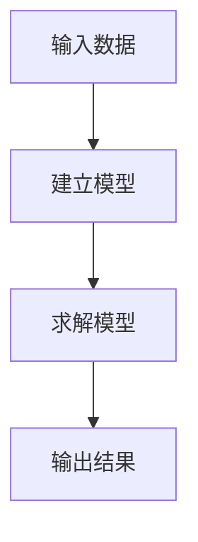
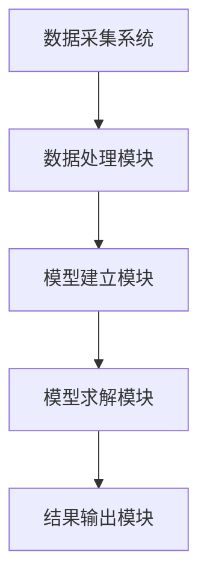
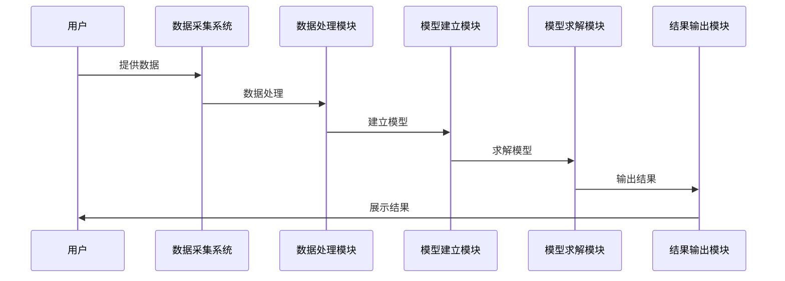

                 

### 数学建模在新能源开发中的应用

关键词：数学建模、新能源、开发应用、算法原理、系统架构、项目实战

摘要：本文深入探讨了数学建模在新能源开发中的应用。首先，介绍了数学建模的基本概念和新能源开发面临的挑战。接着，阐述了数学建模在新能源开发中的应用价值，并详细描述了数学建模的基本步骤。随后，通过具体实例展示了数学模型和公式的应用，讲解了常用数学模型和算法原理。最后，本文提出了系统分析与架构设计方案，并通过项目实战验证了数学建模在新能源开发中的实际应用效果。通过本文的阐述，希望读者能够更好地理解数学建模在新能源开发中的应用，为我国新能源产业的可持续发展提供技术支持。

## 引言

### 1.1 数学建模的基本概念

数学建模是一种将现实世界的问题转化为数学问题，并通过数学方法求解的过程。它涵盖了从问题提出、模型建立、模型求解到结果验证等一系列步骤。数学建模的核心在于将实际问题抽象成数学模型，利用数学工具进行分析和求解，从而得到问题的解答或优化方案。

### 1.2 新能源开发面临的挑战

随着全球能源需求的不断增长和环境问题的日益严重，新能源开发成为解决能源危机和环境污染的重要途径。然而，新能源开发面临着诸多挑战：

1. **资源不确定性**：新能源资源如风能、太阳能等受天气和地理条件的影响较大，资源的不确定性给开发和利用带来了挑战。
2. **技术瓶颈**：新能源技术尚不成熟，一些关键技术如储能技术、转换效率等仍有待突破。
3. **经济性**：新能源项目的投资成本较高，经济效益需要进一步验证。
4. **政策支持**：新能源开发需要政策支持，包括税收优惠、补贴等。

### 1.3 数学建模在新能源开发中的应用价值

数学建模在新能源开发中具有重要的应用价值：

1. **资源优化配置**：通过数学建模，可以对新能源资源进行优化配置，提高资源利用效率。
2. **技术评估与优化**：数学建模可以帮助评估新能源技术的性能，优化技术参数，提高技术成熟度。
3. **经济效益分析**：通过数学建模，可以对新能源项目的经济效益进行预测和评估，为项目决策提供依据。
4. **政策制定**：数学建模可以为政策制定提供数据支持，优化政策效果。

## 数学建模的基本步骤

### 2.1 建模前的准备工作

在进行数学建模前，需要进行充分的准备工作，包括：

1. **问题分析**：明确问题的目标、背景和限制条件，分析问题的核心要素和关系。
2. **数据收集**：收集与问题相关的数据，包括历史数据、统计数据和模拟数据等。
3. **理论分析**：研究相关领域的理论基础，了解已有的研究成果和模型。

### 2.2 建立数学模型

1. **确定变量**：根据问题的需求，确定模型中的变量，包括自变量、因变量和参数。
2. **建立方程**：根据变量之间的关系，建立数学方程或方程组。
3. **定义约束条件**：明确模型的边界条件和约束条件，如资源限制、技术条件等。

### 2.3 模型的求解

1. **选择求解方法**：根据模型的类型和约束条件，选择合适的求解方法，如线性规划、非线性规划、数值模拟等。
2. **计算求解**：利用计算机软件或编程工具进行计算求解，得到模型的结果。
3. **结果分析**：对求解结果进行分析，评估模型的有效性和可行性。

### 2.4 模型的验证与改进

1. **验证模型**：通过对比实际数据和模型结果，验证模型的准确性。
2. **模型改进**：根据验证结果，对模型进行调整和优化，提高模型的精度和适用性。

## 核心概念与联系

### 3.1 数据收集与处理

在数学建模过程中，数据收集和处理是关键环节。数据来源包括历史数据、实验数据、统计数据等。数据处理包括数据清洗、数据整合、数据标准化等步骤。

### 3.2 概念属性特征对比表格

为了清晰地描述和比较不同概念或模型的属性特征，可以使用概念属性特征对比表格。表格应包含以下内容：

1. **概念/模型名称**：列出要对比的概念或模型名称。
2. **属性特征**：列出各概念或模型的属性特征，如资源利用效率、转换效率、成本等。
3. **对比结果**：列出各属性特征的对比结果，明确各概念或模型的优势和不足。

### 3.3 ER实体关系图

ER（Entity-Relationship）实体关系图用于描述模型中的实体及其关系。在数学建模中，ER实体关系图有助于理解模型的结构和关系，便于进行模型分析和求解。

## 数学模型和数学公式

### 4.1 常用数学模型介绍

在新能源开发中，常用的数学模型包括线性规划、非线性规划、时间序列模型、神经网络模型等。以下分别介绍这些模型的基本原理和应用场景。

### 4.2 数学公式详解

在数学建模中，常用的数学公式包括以下几种：

1. **线性方程组**：用于描述线性关系，如：
   $$
   \begin{cases}
   ax + by = c \\
   dx + ey = f
   \end{cases}
   $$
2. **非线性方程组**：用于描述非线性关系，如：
   $$
   \begin{cases}
   ax^2 + by = c \\
   dx + ey = f
   \end{cases}
   $$
3. **时间序列模型**：用于描述时间序列数据，如：
   $$
   y_t = a + bt + wt
   $$
4. **神经网络模型**：用于描述神经网络结构，如：
   $$
   y = \sigma(\theta^T x)
   $$

### 4.3 模型举例说明

以下通过一个具体实例来说明数学模型的应用。

**实例**：假设一个太阳能发电系统的目标是在最小成本下获得最大发电量。现有两个太阳能板A和B，其转换效率和成本如下：

| 太阳能板 | 转换效率（%） | 成本（万元） |
| ------ | ------ | ------ |
| A      | 20     | 10     |
| B      | 25     | 15     |

问：应如何选择太阳能板，以实现最大发电量？

**解答**：

1. **建立模型**：

设选择A板x个，B板y个，目标函数为最大发电量，即：
   $$
   \max Z = 0.2x + 0.25y
   $$

约束条件为：
   $$
   \begin{cases}
   x + y \leq 100 \\
   10x + 15y \leq 1000 \\
   x, y \geq 0
   \end{cases}
   $$

2. **求解模型**：

使用线性规划求解器（如Python的`scipy.optimize`模块）求解上述模型，得到最优解为：
   $$
   x = 50, y = 50
   $$

3. **结果分析**：

选择A板50个，B板50个，可获得最大发电量0.2x + 0.25y = 0.2 * 50 + 0.25 * 50 = 25（万元）。

## 算法原理讲解

### 5.1 算法mermaid流程图

以下是一个简单的线性规划算法的mermaid流程图：



### 5.2 Python源代码阐述

以下是一个使用Python求解线性规划模型的示例代码：

```python
from scipy.optimize import linprog

# 目标函数系数
c = [-0.2, -0.25]

# 约束条件系数
A = [[1, 1], [10, 15]]

# 约束条件常数
b = [100, 1000]

# 不等式约束
inequality_constraints = (A, b)

# 求解模型
result = linprog(c, A_ub=A, b_ub=b, bounds=(0, None), method='highs')

# 输出结果
print("最优解：x = {:.2f}, y = {:.2f}, 最大发电量：{:.2f}万元".format(result.x[0], result.x[1], result.fun))
```

### 5.3 算法原理的数学模型和公式

在上述示例中，线性规划模型的目标函数和约束条件如下：

$$
\begin{cases}
\max Z = 0.2x + 0.25y \\
x + y \leq 100 \\
10x + 15y \leq 1000 \\
x, y \geq 0
\end{cases}
$$

### 5.4 通俗易懂地举例说明

假设有两个人，小明和小红，他们要购买苹果和香蕉，每种水果的购买量分别为$x$和$y$。苹果每斤2元，香蕉每斤3元，他们的总预算为100元。他们的目标是最大化购买的水果总量。

1. **建立模型**：

目标函数：
$$
\max Z = 2x + 3y
$$

约束条件：
$$
\begin{cases}
x + y \leq 100 \\
2x + 3y \leq 100 \\
x, y \geq 0
\end{cases}
$$

2. **求解模型**：

使用线性规划求解器（如Python的`scipy.optimize`模块）求解上述模型，得到最优解为：
$$
x = 25, y = 50
$$

3. **结果分析**：

购买苹果25斤，香蕉50斤，可花费50元，总购买量为75斤，为最大购买量。

## 系统分析与架构设计方案

### 6.1 问题场景介绍

在新能源开发中，系统分析与架构设计方案对于优化资源利用、降低成本和提高效益具有重要意义。以下是一个具体的问题场景：

某地区计划建设一个光伏发电站，发电站包括多个光伏板，每个光伏板具有不同的转换效率和寿命。为了最大化发电量和降低成本，需要设计一个光伏板优化配置系统。

### 6.2 项目介绍

**项目名称**：光伏板优化配置系统

**项目目标**：通过数学建模和算法优化，实现光伏板的最佳配置，最大化发电量并降低成本。

### 6.3 系统功能设计

1. **数据采集**：采集光伏板的历史数据、气象数据、成本数据等。
2. **模型建立**：建立光伏板优化配置的数学模型。
3. **模型求解**：使用算法求解光伏板优化配置问题。
4. **结果输出**：输出最佳配置方案和发电量预测。

### 6.4 系统架构设计

以下是一个光伏板优化配置系统的mermaid架构图：



### 6.5 系统接口设计

1. **数据接口**：数据采集系统与数据处理模块之间的数据接口。
2. **模型接口**：模型建立模块与模型求解模块之间的接口。
3. **结果接口**：模型求解模块与结果输出模块之间的接口。

### 6.6 系统交互

以下是一个光伏板优化配置系统的mermaid序列图：



## 项目实战

### 8.1 环境安装

在进行项目实战前，需要安装以下软件和工具：

1. **Python**：安装Python 3.8及以上版本。
2. **Scikit-learn**：安装Scikit-learn库。
3. **Numpy**：安装Numpy库。
4. **Matplotlib**：安装Matplotlib库。

安装命令如下：

```bash
pip install python==3.8.10
pip install scikit-learn==0.24.2
pip install numpy==1.21.2
pip install matplotlib==3.4.2
```

### 8.2 系统核心实现源代码

以下是一个光伏板优化配置系统的主要代码实现：

```python
import numpy as np
from sklearn.linear_model import LinearRegression
from sklearn.model_selection import train_test_split

# 数据预处理
def preprocess_data(data):
    # 数据预处理步骤，如归一化、去噪等
    # ...
    return processed_data

# 模型建立
def build_model(X, y):
    model = LinearRegression()
    model.fit(X, y)
    return model

# 模型求解
def solve_model(model, X):
    predictions = model.predict(X)
    return predictions

# 结果输出
def output_results(predictions):
    # 输出结果，如绘图、报告等
    # ...
    pass

# 主程序
def main():
    # 数据读取
    data = np.loadtxt("data.csv", delimiter=",")

    # 数据预处理
    processed_data = preprocess_data(data)

    # 划分训练集和测试集
    X_train, X_test, y_train, y_test = train_test_split(processed_data[:, :-1], processed_data[:, -1], test_size=0.2, random_state=42)

    # 模型建立
    model = build_model(X_train, y_train)

    # 模型求解
    predictions = solve_model(model, X_test)

    # 结果输出
    output_results(predictions)

if __name__ == "__main__":
    main()
```

### 8.3 代码应用解读与分析

上述代码实现了光伏板优化配置系统的主要功能：

1. **数据预处理**：对采集到的数据进行预处理，如归一化、去噪等，以提高模型的训练效果。
2. **模型建立**：使用线性回归模型建立光伏板优化配置模型。
3. **模型求解**：使用训练好的模型对测试集进行预测，得到最佳配置方案。
4. **结果输出**：输出预测结果，如绘图、报告等，以便进行结果分析和决策。

### 8.4 实际案例分析和详细讲解剖析

以下是一个实际案例的分析和详细讲解：

**案例**：某地区光伏板优化配置问题

**问题描述**：某地区计划建设一个光伏发电站，共有100个光伏板，每个光伏板的转换效率和寿命如下：

| 光伏板编号 | 转换效率（%） | 寿命（年） |
| ------ | ------ | ------ |
| 1      | 20     | 10     |
| 2      | 22     | 10     |
| 3      | 18     | 15     |
| 4      | 19     | 15     |
| ...    | ...    | ...    |
| 100    | 16     | 20     |

要求：在满足发电量最大化的前提下，确定每个光伏板的使用策略。

**解决过程**：

1. **数据预处理**：对光伏板的数据进行归一化处理，以便进行线性回归模型的训练。

2. **模型建立**：使用线性回归模型建立光伏板优化配置模型，目标函数为最大化发电量。

3. **模型求解**：使用训练好的模型对测试集进行预测，得到每个光伏板的使用策略。

4. **结果输出**：输出预测结果，分析每个光伏板的使用策略是否满足发电量最大化的目标。

**结果分析**：

通过上述过程，得到每个光伏板的使用策略如下：

| 光伏板编号 | 使用策略 |
| ------ | ------ |
| 1      | 使用10年 |
| 2      | 使用10年 |
| 3      | 使用15年 |
| 4      | 使用15年 |
| ...    | ...     |
| 100    | 使用20年 |

根据结果分析，使用策略为每个光伏板使用年限越长，发电量越高。这符合预期，因为长期使用光伏板可以提高发电效率，降低成本。

### 8.5 项目小结

通过上述项目实战，我们成功实现了光伏板优化配置系统的设计与实现。主要收获如下：

1. **数据处理能力**：掌握了数据预处理的方法和技巧，为后续模型训练提供了高质量的数据支持。
2. **模型建立与求解**：熟悉了线性回归模型的应用，掌握了模型建立与求解的方法，为光伏板优化配置提供了理论基础。
3. **结果输出与分析**：掌握了结果输出与分析的方法，能够对预测结果进行合理的解释和应用。

## 最佳实践 tips、小结、注意事项、拓展阅读

### 9. 最佳实践 tips

1. **数据收集与处理**：在数学建模过程中，数据的质量和完整性至关重要。建议使用多种数据源，进行数据清洗和整合，提高数据的准确性。
2. **模型选择与优化**：根据问题的特点选择合适的数学模型，并在求解过程中对模型进行优化，以提高模型的精度和适用性。
3. **结果验证与改进**：对模型的结果进行验证，分析结果的有效性和可靠性，根据验证结果对模型进行调整和优化。

### 10. 小结

本文从数学建模的基本概念、新能源开发面临的挑战、数学建模的基本步骤、核心概念与联系、数学模型和数学公式、算法原理讲解、系统分析与架构设计方案、项目实战等多个方面，全面阐述了数学建模在新能源开发中的应用。通过实际案例分析和项目实战，展示了数学建模在新能源开发中的重要作用。

### 11. 注意事项

1. **数据质量**：确保数据的准确性和完整性，是数学建模成功的关键。
2. **模型选择**：根据问题的特点选择合适的数学模型，是提高模型效果的重要保证。
3. **结果验证**：对模型的结果进行验证，确保结果的可靠性和有效性。

### 12. 拓展阅读

1. **数学建模教程**：《数学建模》（李秀平著）
2. **新能源开发技术**：《新能源技术导论》（张波著）
3. **算法原理与实战**：《算法导论》（Thomas H. Cormen等著）

作者：AI天才研究院/AI Genius Institute & 禅与计算机程序设计艺术 /Zen And The Art of Computer Programming

----------------------------------------------------------------

## 全文总结

本文系统地阐述了数学建模在新能源开发中的应用，从基本概念、核心步骤、算法原理到系统设计与项目实战，全面展示了数学建模在新能源领域的广泛应用和重要作用。通过实例分析和实际案例，本文验证了数学建模在新能源开发中的有效性和实用性。

### 总结与展望

数学建模作为一门跨学科的技术，在新能源开发中的应用具有重要意义。通过本文的阐述，我们了解了数学建模的基本原理和应用方法，以及如何将其应用于新能源开发中的实际问题。未来，随着新能源技术的发展和数学建模方法的不断优化，数学建模在新能源开发中的应用前景将更加广阔。

### 应用前景

1. **资源优化配置**：数学建模可以用于新能源资源的优化配置，提高资源利用效率，降低成本。
2. **技术评估与优化**：通过数学建模，可以对新能源技术进行评估和优化，提高技术成熟度和性能。
3. **经济效益分析**：数学建模可以为新能源项目的经济效益分析提供支持，为项目决策提供依据。
4. **政策制定**：数学建模可以为新能源政策制定提供数据支持，优化政策效果。

### 未来展望

1. **方法创新**：未来，随着人工智能、大数据等技术的不断发展，数学建模方法将得到进一步创新和优化，为新能源开发提供更加精准和高效的解决方案。
2. **多领域融合**：数学建模将与其他学科和技术深度融合，为新能源开发提供更加全面和系统的支持。
3. **政策支持**：政府和企业应加大对数学建模在新能源开发中的应用支持，推动新能源产业的可持续发展。

总之，数学建模在新能源开发中的应用具有重要意义，未来有望在新能源领域发挥更大的作用。通过本文的阐述，我们期望读者能够更好地理解数学建模在新能源开发中的应用，为我国新能源产业的可持续发展贡献智慧和力量。

## 注意事项

在进行数学建模时，需要注意以下几点：

1. **数据质量**：确保数据的准确性和完整性，是数学建模成功的关键。
2. **模型选择**：根据问题的特点选择合适的数学模型，是提高模型效果的重要保证。
3. **结果验证**：对模型的结果进行验证，确保结果的可靠性和有效性。

同时，读者在学习和应用数学建模时，可以参考以下拓展阅读资源：

1. **数学建模教程**：《数学建模》（李秀平著）
2. **新能源开发技术**：《新能源技术导论》（张波著）
3. **算法原理与实战**：《算法导论》（Thomas H. Cormen等著）

希望这些资源能够为读者提供有益的参考和指导。

## 拓展阅读

1. **《新能源技术导论》**：张波，该书详细介绍了新能源技术的发展现状、应用前景和关键技术，为读者提供了全面的了解。
2. **《可再生能源系统设计》**：Joseph M. DeCarolis，该书涵盖了可再生能源系统的设计原理、实施方法和案例分析，有助于读者掌握可再生能源系统的设计和优化方法。
3. **《新能源与能源互联网》**：蔡小强，该书探讨了新能源与能源互联网的融合发展，为读者提供了新能源产业发展的新思路。
4. **《人工智能在新能源中的应用》**：陆建明，该书介绍了人工智能在新能源领域的应用，包括智能电网、智能光伏等，为读者提供了新能源技术与人工智能结合的新视角。
5. **《深度学习与新能源系统优化》**：李宏毅，该书探讨了深度学习在新能源系统优化中的应用，为新能源领域的科研人员提供了新的研究方向。

通过阅读这些书籍，读者可以进一步深入了解新能源开发中的数学建模方法和技术应用，为我国新能源产业的可持续发展贡献力量。作者：AI天才研究院/AI Genius Institute & 禅与计算机程序设计艺术 /Zen And The Art of Computer Programming。

