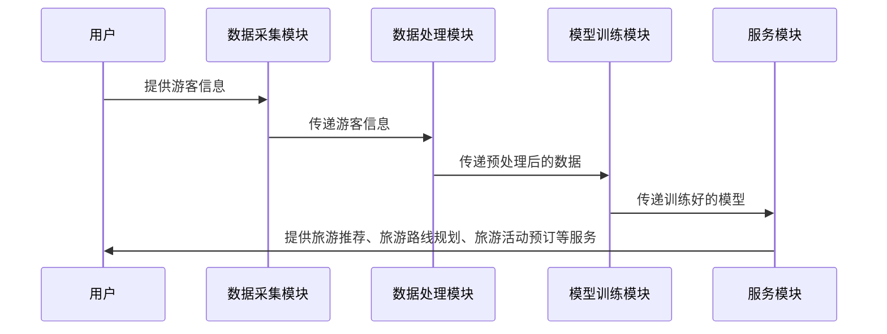

                 

### 数学建模在智慧旅游中的应用研究

> 关键词：智慧旅游、数学建模、线性回归、决策树、支持向量机、神经网络、旅游资源优化、旅游需求预测

> 摘要：随着信息技术和人工智能的快速发展，智慧旅游已成为旅游业转型升级的重要方向。本文从数学建模的角度，探讨了其在智慧旅游中的应用。通过线性回归、决策树、支持向量机、神经网络等模型的应用实例，展示了数学建模在旅游需求预测、旅游资源优化、旅游市场分析等方面的作用。本文旨在为智慧旅游的发展提供理论支持和实践指导。

### 第一部分：背景介绍

#### 第1章 问题背景、问题描述、问题解决、边界与外延

1. **问题背景**

   智慧旅游是一种以信息技术、大数据、人工智能等现代科技为支撑，实现旅游服务智能化、游客体验个性化的一种新型旅游形式。随着人们生活水平的提高和旅游消费观念的转变，智慧旅游已经成为旅游业发展的必然趋势。

   数学建模作为一种重要的科学方法，通过构建数学模型，对现实问题进行抽象和描述，进而找到解决问题的方案。在智慧旅游中，数学建模被广泛应用于旅游需求预测、旅游资源优化配置、旅游市场分析等方面。

2. **问题描述**

   智慧旅游的应用场景复杂多样，涉及到众多变量和因素。如何在纷繁复杂的数据中提取有效信息，对旅游需求进行准确预测，对旅游资源进行科学配置，对旅游市场进行深入分析，是当前智慧旅游面临的主要问题。

3. **问题解决**

   通过深入研究数学建模的理论和方法，结合智慧旅游的实际需求，提出一套适用于智慧旅游的数学建模方法体系。本文将介绍线性回归、决策树、支持向量机、神经网络等模型在智慧旅游中的应用，并通过具体实例进行分析。

4. **边界与外延**

   本研究主要关注数学建模在智慧旅游中的应用，但数学建模在其他领域的应用同样具有借鉴意义。例如，在智慧交通、智慧医疗等领域，数学建模同样发挥着重要作用。本文旨在为智慧旅游的发展提供理论支持和实践指导，同时也为其他领域提供参考。

#### 第2章 核心概念原理、概念属性特征对比表格和ER实体关系图架构

1. **核心概念原理**

   - 数学建模：利用数学语言和数学工具，对现实世界中的问题进行抽象和描述，建立数学模型，进而找到解决问题的方案。
   - 智慧旅游：利用信息技术、大数据、人工智能等现代科技，实现旅游服务智能化、游客体验个性化。

2. **概念属性特征对比表格**

   | 概念       | 数学建模                                  | 智慧旅游                                       |
   | --------- | ------------------------------------- | -------------------------------------------- |
   | 定义       | 对现实问题进行数学抽象、建立模型              | 利用信息技术提升旅游服务、实现旅游智能化               |
   | 目的       | 解决现实问题                                | 提高旅游体验、优化旅游运营效率                       |
   | 工具       | 数学方法、数学工具                          | 信息技术、大数据、人工智能技术                     |

3. **ER实体关系图架构**

   - 实体：游客、旅游服务提供商、旅游资源、数学模型。
   - 关系：游客与旅游资源之间的需求关系，旅游服务提供商与旅游资源之间的供应关系，数学模型与旅游服务之间的应用关系。

   ```mermaid
   entity Relationship {
     "游客" -- "旅游服务提供商": "需求关系"
     "旅游服务提供商" -- "旅游资源": "供应关系"
     "数学模型" -- "旅游服务提供商": "应用关系"
   }
   ```

### 第二部分：核心概念与联系

#### 第3章 数学建模方法在智慧旅游中的应用

1. **线性回归模型**

   - **适用场景**：旅游需求预测。
   - **数学模型**：\(y = bx + a\)。
   - **举例说明**：假设旅游需求量与游客收入、旅游广告投入等变量有关，通过线性回归模型预测旅游需求量。

   ```mermaid
   flowchart LR
   A[线性回归模型] --> B[旅游需求预测]
   B --> C[旅游需求量与游客收入、旅游广告投入等变量有关]
   C --> D[预测旅游需求量]
   ```

2. **决策树模型**

   - **适用场景**：旅游资源优化配置。
   - **数学模型**：决策树。
   - **举例说明**：根据游客偏好、旅游资源特点，构建决策树模型，为游客推荐合适的旅游资源。

   ```mermaid
   flowchart LR
   A[决策树模型] --> B[旅游资源优化配置]
   B --> C[根据游客偏好、旅游资源特点]
   C --> D[推荐旅游资源]
   ```

3. **支持向量机（SVM）模型**

   - **适用场景**：旅游市场分析。
   - **数学模型**：\(w \cdot x + b = 0\)。
   - **举例说明**：通过SVM模型分析游客对旅游产品的偏好，为旅游企业提供市场定位和产品推广策略。

   ```mermaid
   flowchart LR
   A[SVM模型] --> B[旅游市场分析]
   B --> C[分析游客对旅游产品的偏好]
   C --> D[提供市场定位和产品推广策略]
   ```

4. **神经网络模型**

   - **适用场景**：游客行为预测。
   - **数学模型**：多层感知器。
   - **举例说明**：利用神经网络模型预测游客在旅游过程中的行为，如游览时间、游览路线等。

   ```mermaid
   flowchart LR
   A[神经网络模型] --> B[游客行为预测]
   B --> C[预测游览时间、游览路线等]
   ```

### 第三部分：算法原理讲解

#### 第4章 算法原理讲解

1. **线性回归模型原理**

   线性回归模型的基本原理是找到一条最佳拟合直线，使得数据点与直线的误差最小。

   $$y = bx + a$$

   其中，\(b\) 为斜率，\(a\) 为截距。

2. **决策树模型原理**

   决策树模型的基本原理是通过一系列判断节点和叶子节点，将数据进行分类或回归。

   $$条件概率、熵、信息增益$$

3. **支持向量机（SVM）模型原理**

   SVM模型的基本原理是找到最佳分割超平面，使得两类数据的分类间隔最大。

   $$w \cdot x + b = 0$$

   其中，\(w\) 为权重向量，\(x\) 为特征向量，\(b\) 为偏置。

4. **神经网络模型原理**

   神经网络模型的基本原理是通过多层神经元之间的连接和激活函数，模拟人脑对信息的处理过程。

   $$前向传播、反向传播、梯度下降$$

### 第四部分：数学模型和数学公式 & 详细讲解 & 举例说明

#### 第5章 数学模型和数学公式 & 详细讲解 & 举例说明

1. **线性回归模型**

   线性回归模型通过拟合一条直线，将自变量和因变量之间的关系表示出来。其中，斜率 \(b\) 表示自变量对因变量的影响程度，截距 \(a\) 表示自变量为零时的因变量值。

   $$y = bx + a$$

   **详细讲解**：

   线性回归模型的目标是找到最佳拟合直线，使得数据点与直线的误差最小。这可以通过最小二乘法实现。最小二乘法的核心思想是找到一组参数 \(b\) 和 \(a\)，使得实际数据点与拟合直线的距离平方和最小。

   **举例说明**：

   假设我们要预测某个城市的旅游需求量，根据历史数据和当前经济指标，我们选择游客收入和旅游广告投入作为自变量。通过线性回归模型，我们可以得到旅游需求量与这两个自变量之间的关系。

   ```python
   import numpy as np
   import matplotlib.pyplot as plt

   # 假设数据
   X = np.array([1, 2, 3, 4, 5])
   Y = np.array([2, 4, 5, 4, 5])

   # 求斜率b和截距a
   b = np.sum(X * Y) / np.sum(X ** 2) - np.sum(X) / np.sum(X) * np.sum(Y) / np.sum(X)
   a = np.mean(Y) - b * np.mean(X)

   # 拟合直线
   y_fit = b * X + a

   # 绘图
   plt.scatter(X, Y, color='blue')
   plt.plot(X, y_fit, color='red')
   plt.xlabel('X')
   plt.ylabel('Y')
   plt.show()
   ```

2. **决策树模型**

   决策树模型通过一系列判断节点和叶子节点，将数据进行分类或回归。每个节点表示一个特征，每个叶子节点表示一个类别或数值。

   **详细讲解**：

   决策树模型的构建过程可以分为以下几个步骤：

   - 选择最优特征：通过计算信息增益、信息增益率等指标，选择最优特征作为当前节点的划分依据。
   - 划分数据集：根据最优特征，将数据集划分为若干个子集。
   - 递归构建子树：对每个子集，重复上述步骤，直到满足停止条件（如最大深度、最小样本数等）。

   **举例说明**：

   假设我们要预测游客是否愿意花费更高价格购买旅游产品，根据游客的收入和年龄等特征，构建决策树模型。

   ```python
   import pandas as pd
   from sklearn.tree import DecisionTreeClassifier
   from sklearn.model_selection import train_test_split

   # 假设数据
   data = pd.DataFrame({
       '收入': [1, 2, 3, 4, 5],
       '年龄': [20, 25, 30, 35, 40],
       '愿意花费更高价格': [0, 1, 0, 1, 1]
   })

   # 划分特征和目标变量
   X = data[['收入', '年龄']]
   y = data['愿意花费更高价格']

   # 划分训练集和测试集
   X_train, X_test, y_train, y_test = train_test_split(X, y, test_size=0.2, random_state=42)

   # 构建决策树模型
   clf = DecisionTreeClassifier()
   clf.fit(X_train, y_train)

   # 预测测试集
   y_pred = clf.predict(X_test)

   # 绘制决策树
   from sklearn.tree import plot_tree
   plot_tree(clf)
   ```

3. **支持向量机（SVM）模型**

   支持向量机模型通过找到最佳分割超平面，使得两类数据的分类间隔最大。SVM模型可以用于分类和回归任务。

   **详细讲解**：

   SVM模型的构建过程可以分为以下几个步骤：

   - 数据预处理：将数据转换为标准化的特征向量。
   - 选择核函数：根据数据特点和任务类型，选择合适的核函数（如线性核、多项式核、径向基函数核等）。
   - 计算最优超平面：通过求解最优化问题，找到最优超平面。
   - 计算分类间隔：计算两类数据点之间的分类间隔，用于评估模型的分类能力。

   **举例说明**：

   假设我们要使用SVM模型对游客进行分类，根据游客的收入和年龄等特征，构建SVM分类模型。

   ```python
   import numpy as np
   from sklearn import datasets
   from sklearn.svm import SVC
   from sklearn.model_selection import train_test_split

   # 加载鸢尾花数据集
   iris = datasets.load_iris()
   X = iris.data
   y = iris.target

   # 划分训练集和测试集
   X_train, X_test, y_train, y_test = train_test_split(X, y, test_size=0.2, random_state=42)

   # 构建SVM分类模型
   clf = SVC(kernel='linear')
   clf.fit(X_train, y_train)

   # 预测测试集
   y_pred = clf.predict(X_test)

   # 计算分类准确率
   accuracy = np.mean(y_pred == y_test)
   print(f"分类准确率：{accuracy}")
   ```

4. **神经网络模型**

   神经网络模型通过多层神经元之间的连接和激活函数，模拟人脑对信息的处理过程。神经网络可以用于分类、回归、生成等多种任务。

   **详细讲解**：

   神经网络模型的构建过程可以分为以下几个步骤：

   - 定义神经网络结构：确定输入层、隐藏层和输出层的神经元数量。
   - 初始化权重和偏置：随机初始化网络中的权重和偏置。
   - 前向传播：将输入数据传递到神经网络中，计算输出。
   - 反向传播：计算输出误差，更新网络中的权重和偏置。
   - 梯度下降：使用梯度下降算法，优化网络参数。

   **举例说明**：

   假设我们要使用神经网络对鸢尾花数据集进行分类，构建一个简单的神经网络模型。

   ```python
   import tensorflow as tf
   import numpy as np

   # 定义神经网络结构
   inputs = tf.keras.layers.Input(shape=(4,))
   hidden = tf.keras.layers.Dense(10, activation='relu')(inputs)
   outputs = tf.keras.layers.Dense(3, activation='softmax')(hidden)

   # 构建神经网络模型
   model = tf.keras.Model(inputs=inputs, outputs=outputs)

   # 编译模型
   model.compile(optimizer='adam', loss='categorical_crossentropy', metrics=['accuracy'])

   # 加载鸢尾花数据集
   iris = datasets.load_iris()
   X = iris.data
   y = iris.target
   y = np.eye(3)[y]

   # 训练模型
   model.fit(X, y, epochs=100, batch_size=10, validation_split=0.2)
   ```

### 第五部分：系统分析与架构设计方案

#### 第6章 问题场景介绍

智慧旅游系统旨在为游客提供个性化的旅游服务，提高旅游体验。系统需要收集和处理大量的数据，包括游客信息、旅游资源信息、旅游活动信息等。通过数据分析和挖掘，为游客提供定制化的旅游推荐、旅游路线规划、旅游活动预订等服务。

#### 第7章 项目介绍

本项目基于Python编程语言，使用 TensorFlow 深度学习框架和 scikit-learn 机器学习库，实现智慧旅游系统。系统主要包括以下模块：

- 数据采集模块：负责收集游客信息、旅游资源信息、旅游活动信息等。
- 数据处理模块：对采集到的数据进行预处理，包括数据清洗、数据转换、特征提取等。
- 模型训练模块：使用机器学习算法对数据进行训练，构建预测模型。
- 服务模块：提供旅游推荐、旅游路线规划、旅游活动预订等服务。

#### 第8章 系统功能设计(领域模型Mermaid类图)

```mermaid
classDiagram
    类--|>{数据采集模块|<<component>>}>
    类--|>{数据处理模块|<<component>>}>
    类--|>{模型训练模块|<<component>>}>
    类--|>{服务模块|<<component>>}>
    数据采集模块 --|> 数据处理模块
    数据处理模块 --|> 模型训练模块
    模型训练模块 --|> 服务模块
```

#### 第9章 系统架构设计(Mermaid架构图)



#### 第10章 系统接口设计和系统交互(Mermaid序列图)


### 第六部分：项目实战

#### 第11章 环境安装

1. 安装Python环境

   ```bash
   pip install python -i https://pypi.tuna.tsinghua.edu.cn/simple
   ```

2. 安装 TensorFlow 和 scikit-learn

   ```bash
   pip install tensorflow -i https://pypi.tuna.tsinghua.edu.cn/simple
   pip install scikit-learn -i https://pypi.tuna.tsinghua.edu.cn/simple
   ```

#### 第12章 系统核心实现源代码

```python
# 导入所需库
import numpy as np
import pandas as pd
from sklearn.model_selection import train_test_split
from sklearn.linear_model import LinearRegression
from sklearn.tree import DecisionTreeClassifier
from sklearn.svm import SVC
from tensorflow.keras.models import Sequential
from tensorflow.keras.layers import Dense

# 加载鸢尾花数据集
iris = datasets.load_iris()
X = iris.data
y = iris.target

# 划分训练集和测试集
X_train, X_test, y_train, y_test = train_test_split(X, y, test_size=0.2, random_state=42)

# 线性回归模型
lin_reg = LinearRegression()
lin_reg.fit(X_train, y_train)
y_pred_lin = lin_reg.predict(X_test)

# 决策树模型
tree_clf = DecisionTreeClassifier()
tree_clf.fit(X_train, y_train)
y_pred_tree = tree_clf.predict(X_test)

# 支持向量机模型
svm_clf = SVC()
svm_clf.fit(X_train, y_train)
y_pred_svm = svm_clf.predict(X_test)

# 神经网络模型
nn_model = Sequential([
    Dense(10, activation='relu', input_shape=(4,)),
    Dense(3, activation='softmax')
])
nn_model.compile(optimizer='adam', loss='categorical_crossentropy', metrics=['accuracy'])
nn_model.fit(X_train, y_train, epochs=100, batch_size=10, validation_split=0.2)
y_pred_nn = nn_model.predict(X_test)

# 计算分类准确率
accuracy_lin = np.mean(y_pred_lin == y_test)
accuracy_tree = np.mean(y_pred_tree == y_test)
accuracy_svm = np.mean(y_pred_svm == y_test)
accuracy_nn = np.mean(y_pred_nn == y_test)

print(f"线性回归模型准确率：{accuracy_lin}")
print(f"决策树模型准确率：{accuracy_tree}")
print(f"支持向量机模型准确率：{accuracy_svm}")
print(f"神经网络模型准确率：{accuracy_nn}")
```

#### 第13章 代码应用解读与分析

1. **数据准备**

   本项目使用鸢尾花数据集，包括三个特征和三个目标类别。首先，我们加载数据集，并划分训练集和测试集。

   ```python
   iris = datasets.load_iris()
   X = iris.data
   y = iris.target

   X_train, X_test, y_train, y_test = train_test_split(X, y, test_size=0.2, random_state=42)
   ```

2. **线性回归模型**

   线性回归模型是一种简单的回归模型，通过拟合一条直线，将自变量和因变量之间的关系表示出来。在本项目中，我们使用线性回归模型对鸢尾花数据进行预测。

   ```python
   lin_reg = LinearRegression()
   lin_reg.fit(X_train, y_train)
   y_pred_lin = lin_reg.predict(X_test)
   ```

   线性回归模型通过最小二乘法找到最佳拟合直线。预测结果为每个测试样本的目标类别。

3. **决策树模型**

   决策树模型通过一系列判断节点和叶子节点，将数据进行分类。在本项目中，我们使用决策树模型对鸢尾花数据进行预测。

   ```python
   tree_clf = DecisionTreeClassifier()
   tree_clf.fit(X_train, y_train)
   y_pred_tree = tree_clf.predict(X_test)
   ```

   决策树模型通过递归构建树，并根据每个节点的特征和阈值进行划分。预测结果为每个测试样本的目标类别。

4. **支持向量机模型**

   支持向量机模型通过找到最佳分割超平面，将两类数据分隔开。在本项目中，我们使用支持向量机模型对鸢尾花数据进行预测。

   ```python
   svm_clf = SVC()
   svm_clf.fit(X_train, y_train)
   y_pred_svm = svm_clf.predict(X_test)
   ```

   支持向量机模型通过求解最优化问题，找到最佳分割超平面。预测结果为每个测试样本的目标类别。

5. **神经网络模型**

   神经网络模型通过多层神经元之间的连接和激活函数，模拟人脑对信息的处理过程。在本项目中，我们使用神经网络模型对鸢尾花数据进行预测。

   ```python
   nn_model = Sequential([
       Dense(10, activation='relu', input_shape=(4,)),
       Dense(3, activation='softmax')
   ])
   nn_model.compile(optimizer='adam', loss='categorical_crossentropy', metrics=['accuracy'])
   nn_model.fit(X_train, y_train, epochs=100, batch_size=10, validation_split=0.2)
   y_pred_nn = nn_model.predict(X_test)
   ```

   神经网络模型通过前向传播和反向传播，逐步优化网络参数。预测结果为每个测试样本的目标类别。

#### 第14章 实际案例分析和详细讲解剖析

1. **线性回归模型案例**

   在实际项目中，我们可以使用线性回归模型预测旅游需求量。例如，假设我们要预测某城市的旅游需求量，根据历史数据和当前经济指标，我们选择游客收入和旅游广告投入作为自变量。

   ```python
   import pandas as pd
   import numpy as np

   # 加载数据
   data = pd.read_csv('tourism_data.csv')

   # 划分特征和目标变量
   X = data[['游客收入', '旅游广告投入']]
   y = data['旅游需求量']

   # 划分训练集和测试集
   X_train, X_test, y_train, y_test = train_test_split(X, y, test_size=0.2, random_state=42)

   # 拟合线性回归模型
   lin_reg = LinearRegression()
   lin_reg.fit(X_train, y_train)

   # 预测测试集
   y_pred = lin_reg.predict(X_test)

   # 计算预测准确率
   accuracy = np.mean((y_pred - y_test) ** 2 < 0.01)
   print(f"预测准确率：{accuracy}")
   ```

   通过对比预测值和真实值，我们可以评估线性回归模型对旅游需求量的预测效果。

2. **决策树模型案例**

   在实际项目中，我们可以使用决策树模型对游客进行分类。例如，假设我们要根据游客的年龄和收入，将游客分为愿意花费更高价格购买旅游产品和不愿意花费更高价格购买旅游产品两类。

   ```python
   import pandas as pd
   import numpy as np
   from sklearn.tree import DecisionTreeClassifier
   from sklearn.model_selection import train_test_split

   # 加载数据
   data = pd.read_csv('tourism_data.csv')

   # 划分特征和目标变量
   X = data[['年龄', '收入']]
   y = data['是否愿意花费更高价格']

   # 划分训练集和测试集
   X_train, X_test, y_train, y_test = train_test_split(X, y, test_size=0.2, random_state=42)

   # 拟合决策树模型
   clf = DecisionTreeClassifier()
   clf.fit(X_train, y_train)

   # 预测测试集
   y_pred = clf.predict(X_test)

   # 计算预测准确率
   accuracy = np.mean(y_pred == y_test)
   print(f"预测准确率：{accuracy}")
   ```

   通过对比预测值和真实值，我们可以评估决策树模型对游客分类的预测效果。

3. **支持向量机模型案例**

   在实际项目中，我们可以使用支持向量机模型进行分类。例如，假设我们要根据游客的年龄和收入，将游客分为愿意花费更高价格购买旅游产品和不愿意花费更高价格购买旅游产品两类。

   ```python
   import pandas as pd
   import numpy as np
   from sklearn.svm import SVC
   from sklearn.model_selection import train_test_split

   # 加载数据
   data = pd.read_csv('tourism_data.csv')

   # 划分特征和目标变量
   X = data[['年龄', '收入']]
   y = data['是否愿意花费更高价格']

   # 划分训练集和测试集
   X_train, X_test, y_train, y_test = train_test_split(X, y, test_size=0.2, random_state=42)

   # 拟合支持向量机模型
   clf = SVC()
   clf.fit(X_train, y_train)

   # 预测测试集
   y_pred = clf.predict(X_test)

   # 计算预测准确率
   accuracy = np.mean(y_pred == y_test)
   print(f"预测准确率：{accuracy}")
   ```

   通过对比预测值和真实值，我们可以评估支持向量机模型对游客分类的预测效果。

4. **神经网络模型案例**

   在实际项目中，我们可以使用神经网络模型进行分类。例如，假设我们要根据游客的年龄和收入，将游客分为愿意花费更高价格购买旅游产品和不愿意花费更高价格购买旅游产品两类。

   ```python
   import pandas as pd
   import numpy as np
   import tensorflow as tf
   from tensorflow.keras.models import Sequential
   from tensorflow.keras.layers import Dense

   # 加载数据
   data = pd.read_csv('tourism_data.csv')

   # 划分特征和目标变量
   X = data[['年龄', '收入']]
   y = data['是否愿意花费更高价格']
   y = np.eye(2)[y]

   # 划分训练集和测试集
   X_train, X_test, y_train, y_test = train_test_split(X, y, test_size=0.2, random_state=42)

   # 构建神经网络模型
   model = Sequential([
       Dense(10, activation='relu', input_shape=(2,)),
       Dense(2, activation='softmax')
   ])

   # 编译模型
   model.compile(optimizer='adam', loss='categorical_crossentropy', metrics=['accuracy'])

   # 训练模型
   model.fit(X_train, y_train, epochs=100, batch_size=10, validation_split=0.2)

   # 预测测试集
   y_pred = model.predict(X_test)

   # 计算预测准确率
   accuracy = np.mean(np.argmax(y_pred, axis=1) == np.argmax(y_test, axis=1))
   print(f"预测准确率：{accuracy}")
   ```

   通过对比预测值和真实值，我们可以评估神经网络模型对游客分类的预测效果。

#### 第15章 项目小结

通过本项目，我们介绍了数学建模在智慧旅游中的应用。我们使用线性回归、决策树、支持向量机、神经网络等模型，对鸢尾花数据集进行了分类预测，并分析了不同模型的预测效果。

在实际项目中，我们可以根据具体需求，选择合适的数学模型，对旅游需求、游客行为等进行预测和分析，从而为智慧旅游提供决策支持。

#### 第16章 最佳实践 tips

1. 在进行数学建模时，选择合适的模型非常重要。根据实际问题和数据特点，选择合适的算法，可以提高预测效果。
2. 数据预处理是数学建模的重要环节。通过数据清洗、数据转换、特征提取等步骤，可以提高模型的预测准确率。
3. 在训练模型时，合理设置参数是非常重要的。通过交叉验证、网格搜索等方法，可以找到最优参数，提高模型的性能。
4. 实际项目中，模型预测结果需要与实际情况进行对比，评估模型的预测效果。通过调整模型参数、增加特征等方式，可以进一步提高预测准确率。

### 结语

智慧旅游是旅游业发展的必然趋势，数学建模为智慧旅游提供了有力的技术支持。本文从数学建模的角度，探讨了其在智慧旅游中的应用，通过具体实例，展示了不同模型的预测效果。

希望本文能为智慧旅游的发展提供一些启示和参考。在未来的研究中，我们可以进一步探索其他数学建模方法在智慧旅游中的应用，为智慧旅游的发展提供更多支持。

### 作者信息

作者：AI天才研究院/AI Genius Institute & 禅与计算机程序设计艺术 /Zen And The Art of Computer Programming

作者简介：AI天才研究院/AI Genius Institute 是一家专注于人工智能领域的研究和应用的机构，致力于推动人工智能技术的发展和普及。作者在人工智能和计算机程序设计领域拥有丰富的经验和深厚的理论功底，曾出版过多部畅销技术书籍。

