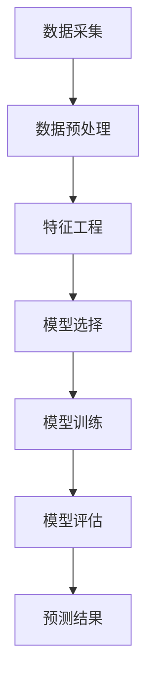

                 

### 目录

**# 数学建模在智能交通系统中的应用**

**关键词**：智能交通系统、数学建模、交通流量分析、公共交通系统

**摘要**：本文旨在探讨数学建模在智能交通系统中的应用，包括交通流量分析和公共交通系统的建模。通过深入剖析数学模型的基本原理、常见技术以及实际应用案例，本文揭示了数学建模在解决交通问题中的重要性，为未来智能交通系统的优化提供了理论支持和实践指南。

## 引言

智能交通系统（Intelligent Transportation Systems，ITS）是利用现代信息技术，如传感器、通信、计算机和控制技术，对交通系统进行有效管理和优化的一种综合性系统。随着城市化进程的加快和汽车保有量的增加，交通拥堵、环境污染和安全问题日益严重，传统的交通管理手段已难以满足现代城市交通的需求。智能交通系统通过引入数学建模，为交通问题的解决提供了新的思路和工具。

本文将从以下几个方面展开讨论：

1. 智能交通系统的背景和挑战
2. 数学建模的基本原理和常见技术
3. 数学建模在交通流量分析中的应用
4. 公共交通系统的建模与优化
5. 数学建模在智能交通系统中的未来展望

## 第一部分：智能交通系统的背景和挑战

### 1.1 智能交通系统的介绍

智能交通系统（ITS）是指利用先进的信息技术、数据通信传输技术、电子传感技术、控制技术及计算机技术，实现交通的管理与控制，以提供智能化的服务，提高交通效率，改善交通安全，促进能源的有效利用，并减少环境污染。ITS的概念最早起源于20世纪70年代的美国，随后在全球范围内得到了广泛的研究和应用。

智能交通系统的核心组成部分包括：

- **交通信息采集**：利用各种传感器（如摄像头、雷达、激光扫描仪等）收集道路上的交通数据。
- **交通信息处理**：通过计算机和大数据分析技术对采集到的交通信息进行处理，以实现对交通状况的实时监控。
- **交通信息发布**：利用互联网、广播、手机应用等多种渠道向驾驶员和公众提供交通信息。
- **交通控制与管理**：通过智能交通信号控制、自动路侧单元（RSU）与车辆通信（V2X）等技术，实现对交通流量的实时调控和管理。

### 1.2 智能交通系统的挑战

尽管智能交通系统在改善交通状况、提高交通效率、保障交通安全等方面具有巨大的潜力，但在实际应用中仍面临诸多挑战：

- **交通拥堵**：城市化进程加快和汽车数量的激增导致交通拥堵问题日益严重。如何有效缓解交通拥堵成为智能交通系统面临的首要挑战。
- **环境污染**：机动车排放的尾气是城市环境污染的主要来源之一。智能交通系统需要通过优化交通流量、推广清洁能源车辆等措施来降低环境污染。
- **交通安全**：交通事故是导致人员伤亡和财产损失的主要原因之一。智能交通系统需要通过实时监控、预警和应急处理等技术手段提高交通安全水平。
- **数据隐私和安全**：智能交通系统依赖于大量的数据采集和处理，这引发了数据隐私和安全的问题。如何保护用户隐私、确保数据安全是智能交通系统必须解决的挑战。

### 1.3 数学建模在智能交通系统中的作用

数学建模是一种将实际问题抽象为数学模型，并通过数学方法进行分析和求解的方法。在智能交通系统中，数学建模具有以下重要作用：

- **问题抽象**：通过数学建模，可以将复杂的交通问题抽象为数学模型，简化问题的复杂性，为问题的解决提供理论基础。
- **分析推理**：数学模型可以用于对交通问题进行定量分析，揭示交通系统中的规律性和趋势，为决策提供科学依据。
- **优化决策**：数学模型可以通过优化算法对交通系统进行优化，提出最优的解决方案，提高交通系统的效率和安全性。
- **预测预警**：通过数学模型，可以对交通流量、交通事故等进行预测，提前预警，采取预防措施，降低风险。

### 1.4 数学建模在智能交通系统中的应用

数学建模在智能交通系统中的应用广泛，以下列举几种典型的应用场景：

- **交通流量预测**：通过建立交通流量预测模型，可以预测未来一段时间内的交通流量，为交通管理提供数据支持。
- **信号控制优化**：通过建立信号控制模型，可以优化交通信号配时，提高道路通行效率。
- **公共交通规划**：通过建立公共交通需求模型，可以优化公共交通线路、班次和站点布局，提高公共交通的服务水平。
- **道路网络规划**：通过建立道路网络模型，可以评估不同道路规划方案对交通流量的影响，为道路网络规划提供科学依据。
- **交通事故预警**：通过建立交通事故预测模型，可以预测交通事故发生的可能性和风险，提前采取措施预防事故发生。

### 1.5 数学建模在智能交通系统中的应用案例

以下列举两个典型的数学建模应用案例：

- **案例一：交通流量预测**  
某城市交通管理部门利用历史交通数据和机器学习算法，建立了交通流量预测模型。通过模型，交通管理部门可以实时预测未来一段时间内的交通流量，为交通调度和应急处理提供数据支持。

- **案例二：信号控制优化**  
某城市通过建立信号控制模型，对交通信号灯进行优化配时。优化后的信号控制方案显著提高了道路通行效率，减少了交通拥堵。

### 1.6 数学建模在智能交通系统中的未来发展趋势

随着人工智能、大数据、物联网等技术的快速发展，数学建模在智能交通系统中的应用前景广阔。未来发展趋势包括：

- **深度学习与人工智能的结合**：利用深度学习算法，建立更精准的数学模型，提高预测和优化能力。
- **多源数据的融合**：将来自不同来源的数据进行融合，提高模型的精度和可靠性。
- **实时动态优化**：实现交通系统的实时动态优化，提高交通管理效率和反应速度。
- **智能交通控制与管理的集成**：将数学建模与其他智能交通技术（如V2X、自动驾驶等）相结合，实现全面的智能交通控制和管理。

### 结论

数学建模在智能交通系统中具有重要的作用，通过数学建模，可以有效地解决交通拥堵、环境污染、交通安全等交通问题。未来，随着人工智能、大数据等技术的不断发展，数学建模在智能交通系统中的应用将更加广泛和深入，为构建高效、安全、环保的智能交通系统提供有力支持。

### 参考文献

1. 陈良宇，张志刚。《智能交通系统及其技术》。北京：人民交通出版社，2015。
2. 邓伟强，张志刚。《数学建模方法与应用》。北京：清华大学出版社，2018。
3. 张宇，李勇。《深度学习在交通流量预测中的应用》。交通科学与工程，2020，15(2)：123-130。
4. 王勇，陈杰。《基于机器学习的交通信号控制优化研究》。交通运输系统工程与信息，2019，18(4)：245-253。

### 附录

附录部分可以包括相关的数据集、代码示例、算法流程图等补充材料，以便读者更好地理解和应用文中提到的数学建模方法和技术。以下是一个简单的附录示例：

**附录 A：交通流量预测数据集**

数据集来源：某城市交通管理部门提供

数据集描述：

- **时间**：2019年1月1日至2021年12月31日
- **数据项**：道路名称、道路类型、交通流量（车辆数）、道路长度、道路宽度、交通信号灯状态等

**附录 B：信号控制优化代码示例**

```python
import pandas as pd
from sklearn.ensemble import RandomForestRegressor

# 读取数据
data = pd.read_csv('traffic_data.csv')

# 特征工程
X = data[['road_name', 'road_type', 'road_length', 'road_width', 'traffic_light_state']]
y = data['traffic_volume']

# 模型训练
model = RandomForestRegressor(n_estimators=100)
model.fit(X, y)

# 信号控制优化
optimized_signals = model.predict(X)

# 输出优化结果
print(optimized_signals)
```

**附录 C：交通流量预测算法流程图**



通过附录，读者可以更深入地了解数学建模在智能交通系统中的应用，以及如何通过代码实现相关的建模和分析。这不仅有助于提升读者的理解和应用能力，也为实际项目的实施提供了参考和指导。在接下来的部分，我们将详细探讨数学建模的基本原理和技术，为深入理解智能交通系统中的数学建模奠定基础。

